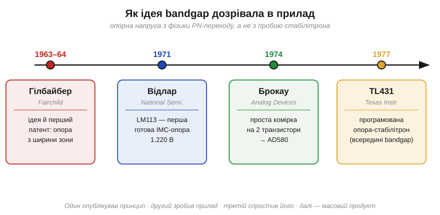
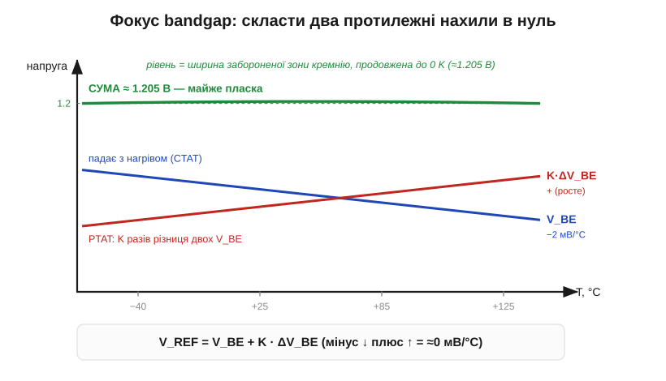

# 📜 Відлар, Брокау і bandgap: опора з фізики переходу

> Це історія за [джерелами опорної напруги](book:electronics/voltage-reference): щоб дістати напругу, яка **не повзе** з температурою, інженери взяли два температурно-залежні ефекти PN-переходу — і змусили їх погасити один одного. Результат впирається в число, продиктоване **фізикою кремнію**, — ширину його забороненої зони. Звідси й назва: *bandgap reference*, опора «по ширині зони». За цим фокусом стоять троє інженерів і класична для електроніки картина: один **опублікував принцип**, другий **зробив прилад**, третій **спростив** його до цеглинки, якою користуються досі.

*Рис. Шлях ідеї. Девід Гілбайбер (Fairchild) опублікував принцип і подав перший патент (1963–64). Боб Відлар (National Semiconductor) утілив його в першу готову ІМС-опору LM113 (1971). Пол Брокау (Analog Devices) звів схему до простої комірки на двох транзисторах (1974, прилад AD580). А далі bandgap став масовим — як-от програмована опора TL431 (1977). Один опублікував, другий зробив, третій спростив, четвертий розтиражував.*

---

## Навіщо взагалі шукали нову опору

Щоб зрозуміти, чому bandgap узагалі з'явився, варто згадати, чим був незадоволений інженер кінця 1950-х. Опорну напругу тоді давав **стабілітрон** (*Zener diode*) — [діод у зворотному пробої](book:electronics/zener-schottky) (історію цього пробою описує [Кларенс Зенер](book:electronics/zener-schottky/hist-zener.md)). Він працював, але мав дві вади, які муляли дедалі сильніше.

Перша — **температура**. Напруга пробою повзе з нагрівом, і лише у вузькому вікні близько 5–6 В два механізми пробою (тунельний і лавинний) випадково гасять один одному температурний нахил. Тобто «хороший» стабілітрон існує тільки на одну-дві напруги, та й то з компенсаційним діодом у парі. Друга вада випливає з тієї самої незручної напруги — це сам **рівень**. Ці добрі 6 вольт стоять надто високо: коли вся схема живиться від 5 В (а згодом — від 3.3 В), опора, якій потрібно більше за живлення, просто не вписується.

Була й третя, тонша проблема — **інтегральна схема**. Наприкінці 1950-х народжувалася планарна технологія: усю схему роблять на одному кристалі кремнію за один процес. Стабілітрон на 6 В у таку схему вбудувати важко й невигідно: він шумить, потребує точного легування й «з'їдає» запас напруги. Інженери, що проєктували перші монолітні стабілізатори й операційні підсилювачі, гостро потребували опори, яку **легко зробити прямо на кристалі** з тих самих транзисторів, що й решта схеми, — і яка б трималася незалежно від температури. Стабілітрон цього не давав. Потрібна була зовсім інша ідея.

## Гілбайбер: «а скористаймося самою фізикою переходу»

Ідея визріла там, де й більшість тогочасних проривів у напівпровідниках, — у **Fairchild Semiconductor**. **1963 року** інженер **Девід Гілбайбер** (*David F. Hilbiber*) подав патент, а в **лютому 1964-го** виступив на конференції ISSCC із доповіддю з промовистою назвою «A new semiconductor voltage standard» — «Новий напівпровідниковий стандарт напруги». Це, наскільки відомо, **перша публікація** про bandgap-опору взагалі.

Думка Гілбайбера була тонка. Пряме [падіння на PN-переході](book:electronics/diode-iv-curve) — оте «приблизно 0.7 В» — насправді **не константа**: воно спадає з нагрівом приблизно на 2 мВ на кожен градус (це показує [рівняння Шоклі](book:electronics/diode-iv-curve/math-shockley-equation.md)). Це вада, якщо потрібна стала напруга. Але Гілбайбер спитав інакше: а що, як цю ваду **скомпенсувати** іншим напруговим доданком, який із нагрівом, навпаки, **росте** — і то рівно з тим самим темпом? Тоді сума двох напруг стояла б на місці.

Де взяти доданок, що росте? У **різниці** падінь на двох однакових переходах, через які тече **різний** струм (точніше — різна щільність струму). Ця різниця, на відміну від самого падіння, **прямо пропорційна абсолютній температурі** — інженери звуть її PTAT (*proportional to absolute temperature*). Складемо спадне падіння (його звуть CTAT, *complementary to absolute temperature*) з підсиленою в потрібну кількість разів PTAT-різницею — і нахили взаємно знищаться.

*Рис. Суть фокуса. Падіння на переході V_BE спадає з температурою (синій, ≈−2 мВ/°C, CTAT). Різниця падінь двох переходів ΔV_BE росте з температурою (червоний, PTAT). Підбираємо коефіцієнт K так, щоб нахили зрівнялися за модулем, — і сума V_BE + K·ΔV_BE виходить майже пласкою (зелений). Дивовижно, що цей плаский рівень — не довільне число: він дорівнює ширині забороненої зони кремнію, продовженій до 0 K (≈1.205 В).*

Найкрасивіше тут — куди саме впирається ця сума. Виявляється, не в довільну величину, а в **ширину [забороненої зони кремнію](book:physics/semiconductor)**, перераховану в напругу й продовжену до абсолютного нуля, — близько **1.205 В** *(перевірити точне число: різні джерела дають 1.20–1.22 В залежно від моделі й температурного діапазону)*. Це не випадковість: обидва доданки кореняться в тій самій фізиці переходу, і коли вони складаються «правильно», лишається саме той фундаментальний параметр напівпровідника, який не залежить ні від струму, ні від нагріву. Звідси й ім'я: **bandgap reference**, опора по ширині зони (*band gap* — англ. «заборонена зона»).

Сам Гілбайбер дав це радше як **принцип** і лабораторну демонстрацію, ніж готовий продукт. Він узяв дискретні транзистори Fairchild із помітно різними падіннями, склав із них два «стовпчики» — і знайшов струм, за якого в крихітному вікні близько ±2.5 °C напруга між стовпчиками майже не мінялась і дорівнювала десь **1.2567 В** *(перевірити: число наводять із його доповіді 1964 р.)*. Це було доведення, що ідея жива. Та для масового приладу схема була заскладна: цілі стовпчики транзисторів, висока напруга живлення, вузьке температурне вікно. Принцип чекав на того, хто стулить його в одну зручну мікросхему.

> 🔧 **Навіщо це.** Тут — гарний урок про природу винаходу. Гілбайбер не лишив по собі легендарного приладу, та лишив **ідею-зерно**: опору можна вирощувати з фундаментальної сталої матеріалу, а не з примхи пробою. Інженерові варто розрізняти «придумати принцип», «зробити робочий прилад» і «зробити **зручний** прилад» — це різні досягнення, і часто за ними стоять різні люди. Сам по собі патент 1963 року ще нікого не нагодував; нагодувала його реалізація, що прийшла за вісім років.

---

## Відлар: фокус, складений в одну мікросхему

Реалізацію дав один із найяскравіших інженерів в історії аналогової техніки — **Роберт Джон Відлар** (*Robert John Widlar*, 1937–1991), американський схемотехнік, народжений у Клівленді (його батько, син німецько-ірландської родини, був радіоінженером-самоуком). Відлар уславився важким характером, феєричними витівками — і тим, що практично **сам створив** жанр аналогової інтегральної схеми: його операційні підсилювачі й стабілізатори зробили спершу Fairchild, а потім **National Semiconductor** лідерами галузі. До Fairchild він прийшов **1963 року**, а наприкінці 1965-го перейшов до National.

Саме у National Відлар наприкінці 1960-х згадав стару доповідь Гілбайбера — і зрозумів, як зробити з неї **компактний прилад**. Замість двох довгих стовпчиків транзисторів, що потребували десятка вольт, він склав схему так, щоб той самий баланс нахилів працював усього від **1.2–1.5 В**. У переказах це описують образно: Відлар узяв ідею протиставлення стовпчиків (умовно 11 проти 10 транзисторів, що працювали від 10 В) і «згорнув» її в схему на [струмовому дзеркалі](book:electronics/differential-pair/math-current-mirror.md) з парою транзисторів і резисторами в емітерах *(точну кількість приладів у конкретній реалізації — перевірити за патентом)*.

Результат побачив світ **1971 року** як **LM113** — перша спеціальна, двовивідна **інтегральна опора напруги** на **1.220 В**, чий температурний нахил тримався в десятих частках відсотка (патент US 3,617,859). Це був прорив одразу з кількох причин. По-перше, **низька напруга**: 1.2 В чудово вписувалися в схему, що живиться від 5 В, на відміну від 6-вольтового стабілітрона. По-друге, **повна інтегрованість**: опора робилася з тих самих транзисторів, що й решта кристала, без жодного екзотичного процесу. По-третє, **мала шумність** проти стабілітрона. Відтоді bandgap став серцем мало не кожного інтегрального стабілізатора — зокрема й [лінійного LDO](book:electronics/ldo-internals): «опорна напруга» в його блок-схемі — це майже завжди bandgap-комірка Відлара.

Тут варто чесно розставити внески. Гілбайбер **відкрив принцип** і показав, що він працює. Відлар **зробив його приладом** — і то таким, що ним можна користуватися щодня. Це не применшує жодного з двох: ідея без реалізації лишилася б рядком у збірнику конференції, а реалізація без ідеї не з'явилася б зовсім. Відлар, до речі, цього й не приховував — у колах схемотехніків добре відомо, що він прямо відштовхувався від доповіді Гілбайбера.

> 🔧 **Навіщо це.** Коли в даташиті стабілізатора чи мікроконтролера ви бачите рядок «internal bandgap reference 1.2 V» — це прямий нащадок LM113. Те, що майже всі опори в кремнії «номіналом» близько 1.2 В, — не випадковість і не мода: це та сама ширина зони кремнію, в яку впирається фокус Гілбайбера–Відлара. Знаючи це, ви вже не здивуєтесь, чому АЦП мікроконтролера часто має приховане джерело саме на ~1.1–1.2 В: усередині сидить bandgap.

---

## Брокау: комірка, що стала підручниковою

Залишалося зробити схему ще простішою й точнішою — і це зробив **Адріан Пол Брокау** (*Adrian Paul Brokaw*), американський інженер **Analog Devices**, згодом член IEEE й автор понад сотні патентів. У **грудні 1974 року** він опублікував у IEEE Journal of Solid-State Circuits статтю «A simple three-terminal IC bandgap reference» — «Проста трививідна інтегральна bandgap-опора».

Брокау звів усю ідею до елегантної **комірки на двох транзисторах** із різними площами емітерів (у його приладі — у відношенні 8:1), що працюють за однакового струму колектора. Різниця їхніх падінь дає ту саму PTAT-напругу, операційний підсилювач тримає струми рівними, а підсумкова опора виходить близько **1.234 В** *(перевірити точне число статті)* — знову та сама ширина зони. Схема вийшла настільки прозорою й передбачуваною, що її стали звати просто **«коміркою Брокау»** (*Brokaw cell*) — і вона досі в кожному підручнику аналогового проєктування.

Першим **продуктом** на цій комірці став **AD580** (1974) — трививідна опора, що з входу 4.5–30 В видавала акуратні **2.5 В**: bandgap-ядро на ~1.2 В усередині підсилювалося до зручного рівня. Її називають **першою прецизійною** інтегральною bandgap-опорою; пізніші покоління еталонів усе ще несуть її родовід.

Складімо ланцюг докупи. Гілбайбер сказав **«можна»** (1964). Відлар зробив **перший прилад** (1971). Брокау зробив його **простим і точним** (1974) — і дав схему, якою всі відтоді й користуються. Жоден із трьох не зробив усього сам; кожен поклав свою ланку. Це типова для електроніки історія колективного авторства — точнісінько як зі [зворотним зв'язком](book:electronics/negative-feedback/hist-harold-black.md) (Блек → Найквіст → Боде) чи з [транзистором](book:electronics/transistor-idea/hist-transistor.md).

---

## Куди це розтеклося: TL431 і не тільки

Після Брокау bandgap перестав бути екзотикою й розтікся по всій електроніці. Найвиразніший приклад — **TL431**, який Texas Instruments випустила близько **1977 року** *(деякі джерела називають 1977–78 — перевірити)*. Це «програмований стабілітрон»: трививідний прилад, що поводиться як стабілітрон, чию напругу (від 2.5 В і вище) задають двома резисторами. А всередині — **bandgap-ядро на ~1.2 В** у дусі Відлара. TL431 виявився настільки зручним і дешевим, що тихо «захопив» блоки живлення: він сидить у зворотному зв'язку мало не кожної зарядки телефона, формуючи опорну напругу для [оптопари](book:electronics/optocoupler-2). Докладніше цей прилад — у [компонентній вставці](comp-voltage-reference.md), а числа компенсації нахилів — у [математичній вставці](math-bandgap-math.md).

Сьогодні bandgap-опора стоїть усюди, де треба знати напругу точно: в АЦП і ЦАП, у кожному лінійному й імпульсному стабілізаторі, у вимірювальних приладах, у моніторах живлення. І щоразу це той самий фокус 1964 року — спадне падіння переходу плюс висхідна різниця падінь, складені так, щоб лишилася гола фізична стала кремнію.

Та було б нечесно змалювати цю історію надто гладенькою. Зробити bandgap-опору, яка справді тримається на сотих частках відсотка в широкому діапазоні температур, **важко**: сума двох великих доданків лишає не ідеально пласку лінію, а ледь вигнуту дугу, і боротьба з цією кривиною, з розкидом партії, з механічними напруженнями кристала тривала десятиліттями. Один із головних практиків цієї боротьби, інженер National Semiconductor Боб Піз (*Bob Pease*), навіть назвав свою класичну доповідь про проєктування bandgap-опор «Trials and Tribulations» — «Випробування й поневіряння». Простий на вигляд фокус виявився глибокою інженерною темою — і це теж частина його історії.

> 🔧 **Навіщо це.** Практичний підсумок для розробника: коли вам потрібна точна, незалежна від температури і від живлення опора — ви майже завжди берете bandgap (готову мікросхему чи вбудовану в чип). Стабілітрон лишається для грубих задач і високих напруг. А «магічні» 1.2 В, що визирають із сотень даташитів, — це підпис кремнію під винаходом, який почали 1964-го й довели до досконалості силами багатьох рук.

> ▶️ Тема: [Джерела опорної напруги: від стабілітрона до bandgap](book:electronics/voltage-reference)

---

### Пов'язані матеріали
- [Джерела опорної напруги: від стабілітрона до bandgap](book:electronics/voltage-reference) *(як користуються опорою)*
- [Bandgap у числах: як −2 мВ/°C діода компенсували різницею ΔV_BE](math-bandgap-math.md) *(математика компенсації)*
- [TL431-клас: «програмований стабілітрон»](comp-voltage-reference.md) *(масовий нащадок)*
- [Кларенс Зенер і пробій, що став корисним](book:electronics/zener-schottky/hist-zener.md) *(попередня опора, від якої відштовхувались)*
- [Рівняння Шоклі: чому «0.7 В» — не константа (−2 мВ/°C)](book:electronics/diode-iv-curve/math-shockley-equation.md) *(звідки CTAT-нахил)*
