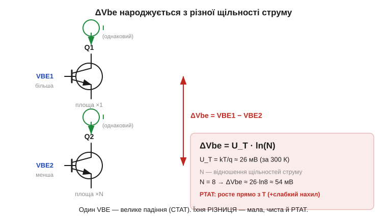
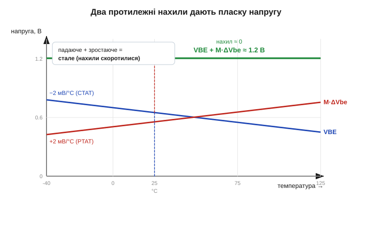

# 🧮 Bandgap у числах: як −2 мВ/°C діода компенсували різницею ΔVbe

> Стабілітрон (*Zener*) «пливе» з температурою, а [bandgap-джерело опорної напруги](book:electronics/voltage-reference) — ні, бо в ньому два температурні дрейфи гасять один одного. Покажемо це **числом**: чому падіння переходу втрачає −2 мВ на кожен градус, чому **різниця** двох таких падінь, навпаки, рівномірно **росте**, і як із них скласти напругу, чий нахил по температурі — нуль.

### Дві половинки з протилежним знаком

Уся ідея тримається на двох напругах спільного походження, але з протилежним знаком температурного нахилу.

Перша — пряме падіння переходу **V_BE** (*base-emitter voltage*; для діода це просто V_F). З [рівняння Шоклі для p-n переходу](book:electronics/diode-iv-curve) випливає його норов: за сталого струму воно **спадає** з нагрівом приблизно на −2 мВ/°C. Така залежність зветься **CTAT** (*complementary to absolute temperature* — «обернена до абсолютної температури»): гарячіше — менше напруги.

Друга — **різниця** падінь двох переходів, що несуть **різну щільність струму**. Її позначають **ΔV_BE**. І ось диво: ця різниця не спадає, а **росте** прямо пропорційно абсолютній температурі. Така залежність зветься **PTAT** (*proportional to absolute temperature*). Один доданок тягне вниз, другий — угору; лишається підібрати їхню вагу так, щоб нахили скоротилися рівно в нуль.

### Звідки PTAT: різниця, у якій Is скорочується

Чому ж різниця поводиться інакше за кожне падіння окремо? Випишемо обернене рівняння Шоклі для двох переходів за того самого робочого струму I, але різних струмів насичення Is (різна площа або щільність):

```
V_BE1 = U_T · ln(I / Is1)
V_BE2 = U_T · ln(I / Is2)
ΔV_BE = V_BE1 − V_BE2 = U_T · ln(Is2 / Is1) = U_T · ln(N)
```

Тут U_T = kT/q ≈ 26 мВ за 300 К — [тепловий потенціал](book:electronics/diode-iv-curve) (*thermal voltage*) p-n переходу, а **N** — відношення щільностей струму двох переходів. Найважливіше сталося в одному рядку: непокірний Is (який злітає з температурою експоненційно й тягне кожен V_BE вниз) **скоротився**. У різниці лишився чистий множник U_T = kT/q. А він прямо пропорційний температурі T — отже, ΔV_BE росте лінійно й передбачувано. Це і є PTAT у найчистішому вигляді.


*Два переходи живлять однаковим струмом I, але площа Q2 у N разів більша — отже, його щільність струму менша, а падіння V_BE2 нижче. Їхня різниця ΔV_BE = U_T·ln(N) мала (десятки мілівольтів), зате чиста й росте прямо з абсолютною температурою. Для N = 8 виходить ≈ 26·ln8 ≈ 54 мВ за кімнатної.*

Оцінимо нахил ΔV_BE. Похідна U_T = kT/q по температурі — це стала k/q ≈ 0.0862 мВ/К. Для N = 8 множник ln8 ≈ 2.08, тож:

```
d(ΔV_BE)/dT = (k/q)·ln(N) ≈ 0.0862 · 2.08 ≈ +0.18 мВ/°C
```

Лише +0.18 мВ/°C проти −2 мВ/°C у V_BE — сама собою різниця такий нахил не вирівняє. Тому ΔV_BE спершу **підсилюють**.

### Складання: підбираємо вагу M

Це підсилення і є останнім кроком. Помножимо PTAT-доданок на коефіцієнт **M** (його задають резистори схеми) і додамо до одного V_BE. Опорна напруга:

```
V_ref = V_BE + M · ΔV_BE
```

Вагу M обираємо так, щоб додатний нахил M·ΔV_BE точно погасив −2 мВ/°C від V_BE:

```
M · 0.18 мВ/°C = 2.0 мВ/°C   →   M ≈ 11
```

Підставимо й порахуємо саму напругу за кімнатної (V_BE ≈ 0.65 В, ΔV_BE ≈ 54 мВ):

```
V_ref = 0.65 + 11 · 0.054 ≈ 0.65 + 0.59 ≈ 1.24 В
```

І ось чому слово «bandgap» («заборонена зона»): сумарна напруга виходить близькою до **ширини [забороненої зони кремнію](book:physics/semiconductor), екстрапольованої до 0 К — близько 1.205 В**. Це не збіг: коли нахили скорочуються, у залишку лишається саме та фундаментальна стала кристала. Влучиш у ≈1.2 В — нахил мінімальний; промахнешся вагою M — повертається або CTAT-, або PTAT-нахил.


*Синій V_BE падає (−2 мВ/°C, CTAT), червоний M·ΔV_BE росте (+2 мВ/°C після підсилення, PTAT). Їхня сума (зелена) — горизонтальна лінія ≈ 1.2 В: нахил по температурі практично нульовий. Саме так bandgap «не пливе» там, де стабілітрон пливе.*

Залишковий вигин зеленої лінії все ж є — він другого порядку (бо V_BE по температурі не ідеально пряма). Точні джерела його прибирають окремою корекцією кривини (*curvature correction*), але першу й головну компенсацію робить саме баланс CTAT і PTAT.

### Де це працює

Ці числа — підмурок [джерел опорної напруги](book:electronics/voltage-reference). Той самий механізм «один V_BE плюс підсилена різниця» сидить у TL431-класі та в кожному вбудованому опорному джерелі мікроконтролера. Дві фізичні цеглинки під ним прості: −2 мВ/°C — це температурний дрейф [p-n переходу](book:electronics/diode-iv-curve), а підсилення різниці на M — це звичайний [різницевий каскад на ОП](book:electronics/summing-difference-amp). Головний урок: стабільність народжується не з пошуку «ідеального» переходу, а з **віднімання двох неідеальних** так, щоб їхні вади скоротилися, лишивши чисту сталу кристала.
