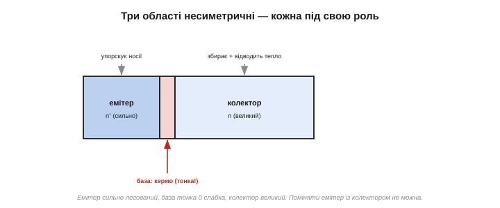
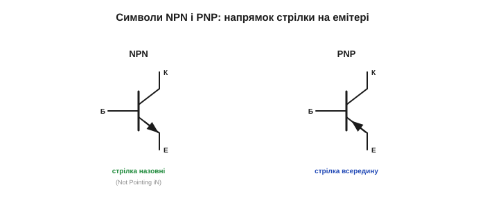
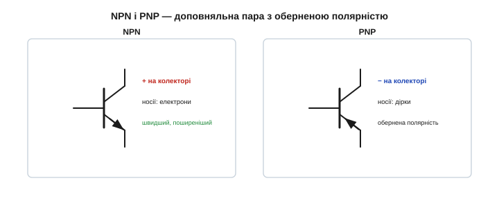

# Будова BJT: два p-n переходи (NPN/PNP)

Транзистор — це [кран, де мала дія керує великою](topic:electronics/transistor-idea). Відкриймо прилад і подивімося, з чого він зроблений. Виявиться, що будова **біполярного** транзистора (BJT, *bipolar junction transistor*) напрочуд проста: це **сендвіч** із трьох легованих шарів напівпровідника. Уся магія народжується саме з цього бутерброда — точніше, з двох переходів і тонесенького прошарку між ними. Це той рідкісний випадок, коли всесвітньо важливий прилад має майже тривіальну будову: три шматки кремнію різного «ґатунку», складені стосиком. Складність не в геометрії, а в тому тонкому шарі посередині — і у фізиці, що в ньому коїться.

### Сендвіч із трьох шарів

Завдяки [легуванню](topic:physics/doping) кремній буває **n-типу** (надлишок електронів) і **p-типу** (надлишок дірок). Біполярний транзистор — це три такі шари поспіль: **два** одного типу й **тонкий** прошарок протилежного **між** ними. Складають їх двома способами:

- **NPN** — n-p-n: дві n-області, а між ними тонка p.
- **PNP** — p-n-p: дві p-області, а між ними тонка n.

*Дві структури BJT. NPN: n-p-n (дві n-області, тонка p посередині). PNP: p-n-p (дзеркально). Центральний шар — дуже тонкий; саме він і робить транзистор транзистором.*

Важливо: ці три шари — не три склеєні шматочки, а **один** суцільний кристал, у якому сусідні області легували по-різному (точно як [PN-перехід](topic:physics/pn-junction)). Лише так межі виходять бездоганні, на рівні ґратки. А «**біполярним**» транзистор зветься тому, що в його роботі беруть участь **обидва** сорти носіїв — і електрони, і дірки (на відміну від польового, де працює лише один; «бі» — два). А розміри цього сендвіча мікроскопічні: у дискретному транзисторі кристалик менший за макове зерня, а в мікросхемі таких структур мільярди на площі нігтя. Великі шари на наших рисунках — лише для наочності; насправді це частки міліметра.

### Три виводи: емітер, база, колектор

Кожен із трьох шарів має вивід і власну назву та роль:

- **Емітер** (*emitter*, E) — сильно легований шар, що «**випускає**» (емітує) у прилад основну масу носіїв. Це джерело головного потоку.
- **База** (*base*, B) — той самий **тонкий** середній прошарок, легований слабко. Це **керувальний** вивід — те саме [кермо, що керує всім потоком](topic:electronics/transistor-idea).
- **Колектор** (*collector*, C) — шар, що «**збирає**» носії, які пройшли крізь базу. Зазвичай він найбільший — бо мусить розсіювати тепло.

Назви прозорі й самі підказують ролі: емітер **емітує** (випускає) носії, колектор їх **колекціонує** (збирає), а база історично була «основою» (*base*) першого, точкового транзистора, на якій трималася решта конструкції. Запам'ятати, хто є хто, легко просто з цих слів. До речі, саме через колектор транзистори так різняться розміром: малосигнальний (для слабких сигналів) крихітний, а потужний (керувати мотором чи лампою) великий і часто на радіаторі — бо крізь його колектор течуть ампери й виділяється чимало тепла.

*Три області несиметричні навмисно: емітер сильно легований (щоб упорснути багато носіїв), база дуже тонка й слабко легована (щоб носії пролетіли її майже без втрат), колектор великий (щоб зібрати їх і відвести тепло). Ця асиметрія — не примха, а умова роботи.*

Зверніть увагу на важливе: навіть у NPN дві n-області — емітер і колектор — **не однакові** й **не взаємозамінні**. Емітер сильно легований, колектор більший і легований слабше, база — дуже тонка. Помінявши емітер із колектором місцями, ви дістанете кепський транзистор (або взагалі не транзистор). Чому саме така асиметрія потрібна, стає видно, коли простежити, [як працює транзистор](topic:electronics/bjt-operation); тут досить запам'ятати, що три шари **різні за призначенням**.

Навіщо ж аж три різні шари? Кожен заточено під свою роль у [роботі транзистора](topic:electronics/bjt-operation). Емітер легують **сильно**, щоб він упорснув у базу якнайбільше носіїв. Базу роблять **тонкою й слабко легованою**, щоб ці носії пролетіли її майже без втрат на рекомбінацію — і майже всі дісталися колектора. А колектор роблять **великим**, бо крізь нього тече весь головний струм і виділяється тепло. Кожен шар заточено під свою роль — і лише разом вони дають підсилення.

Що буде, як усе ж поміняти емітер із колектором — увімкнути транзистор «навпаки»? Він працюватиме, але кепсько: слабко легований «емітер» упорсне мало носіїв, і підсилення впаде в рази. Тому, хоч обидва шари й однотипні, переплутати їх — означає зіпсувати прилад. Несиметрія тут не випадкова, а ретельно прорахована під роль кожного шару.

### Два PN-переходи

Де три леговані області стикаються, там — [PN-переходи](topic:physics/pn-junction). У транзисторі їх **два**:

- **база–емітер** (B-E),
- **база–колектор** (B-C).

Тож, якщо дивитися грубо, біполярний транзистор схожий на **два діоди, з'єднані спина до спини** через спільну базу. У NPN база (p) — спільний анод, а емітер і колектор (n) — два катоди; виходять ніби два діоди, що дивляться анодами всередину.

*У транзисторі два PN-переходи зі спільною базою: B-E і B-C. Грубо це схоже на два діоди спина до спини. Але — увага — справжній транзистор це **не** просто два діоди.*

Ця «двадіодна» картина зручна для **перевірки**: мультиметром у режимі [прозвонки діода](topic:electronics/diode-iv-curve) транзистор і справді дзвониться як два діоди від бази — так знаходять базу й визначають тип (NPN чи PNP). У PNP усе дзеркально: база (n) — спільний катод, а емітер і колектор (p) — аноди. Та затямимо: ця модель добра лише, щоб перевірити цілість приладу, а не щоб зрозуміти його **роботу**.

З двадіодної картинки видно й іще одне: між колектором і емітером (через базу) стоять два **зустрічні** діоди, тож сам по собі транзистор постійного струму між ними не пропускає — хоч би якої полярності. Це й правильно: щоб потік пішов, потрібен керувальний сигнал на базу. Без нього транзистор замкнений — як і має бути «кран», поки за нього не взялися.

### Але це **не** просто два діоди

Ось ключова осторога. Якщо взяти два **окремі** діоди й з'єднати їх дротом, транзистора **не вийде** — хоч переходи й ті самі. Чому? Бо весь секрет — у **тонкості спільної бази**. Обидва переходи поділяють той самий тонюсінький середній шар, тож носії, що їх упорскує емітер, устигають **пролетіти** базу наскрізь і дістатися колектора, перш ніж рекомбінують. А в двох окремих діодах «бази» товсті й роз'єднані — жоден носій із одного не долетить до іншого. Саме спільна тонка база перетворює два переходи на транзистор, і саме вона дає [підсилення](topic:electronics/bjt-operation).

*Ліворуч — два окремі діоди, з'єднані дротом: товсті бази, носії не переходять — транзистора немає. Праворуч — справжній BJT: спільна **тонка** база, крізь яку носії пролітають з емітера в колектор. Уся магія — у тонкості цього прошарку.*

Наскільки тонка та база? Часто це **частки мікрона** — тонша за довжину, яку носій устигає пробігти до рекомбінації. Саме тому впорснутий емітером носій не встигає «загинути» в базі, а проскакує її й потрапляє в полі колектора. Зробіть базу товстою — і носії порекомбінують, не долетівши; транзисторного ефекту не буде. Тонкість бази — буквально питання життя і смерті носіїв, і саме її неможливо відтворити, з'єднавши два готові діоди дротом.

Саме цієї тонкої бази й не мав перший, точковий транзистор: там два контакти лише дотикались до кристала. Плоскісний транзистор [Вільяма Шоклі](topic:electronics/transistor-idea/hist-traitorous-eight.md) тим і переміг, що в ньому база — рівний, контрольовано тонкий шар у самій товщі кристала. Саме цей **плоскісний** BJT і заполонив світ — про нього й уся розмова.

### Символи: NPN і PNP

На схемах транзистор малюють так: вертикальна риска (база), до неї під кутом — емітер (зі **стрілкою**) і колектор. Уся різниця між NPN і PNP — у напрямку стрілки на емітері:

- **NPN** — стрілка дивиться **назовні** (від бази). Зручна підказка: «**N**PN — **N**ot **P**ointing i**N**» (стрілка не всередину).
- **PNP** — стрілка дивиться **всередину** (до бази).

Стрілка показує напрямок умовного струму через емітер — тобто куди «дивиться» діод база–емітер.

*Символи транзистора. NPN — стрілка емітера назовні («Not Pointing iN»), PNP — усередину. Три виводи: база (кермо), колектор і емітер (головний струм). Стрілка показує напрямок струму емітера.*

На практиці стрілку читають як маленький діод бази–емітера: куди вона вказує, туди крізь емітер і тече умовний струм у відкритому транзисторі. Тому, лише глянувши на схему, за самою стрілкою видно і **тип** приладу (NPN чи PNP), і як його належить живити — плюсом чи мінусом до колектора. Це найшвидший спосіб «прочитати» транзистор у незнайомій схемі.

### NPN проти PNP

Дві структури — **доповняльна пара** (*complementary*): та сама ідея, лише дзеркально. У **NPN** головні носії — електрони, і працює він із **плюсом** на колекторі. У **PNP** головні носії — дірки, і полярність обернена (мінус на колекторі). На практиці **NPN поширеніший**: електрони рухливіші за дірки, тож NPN-транзистори трохи швидші й дешевші. PNP беруть там, де зручніша обернена полярність (наприклад, ключ «згори», у парі з NPN).

*NPN і PNP роблять те саме дзеркально: NPN несе струм електронами (плюс на колекторі), PNP — дірками (мінус на колекторі). NPN швидший і поширеніший; разом вони утворюють зручні доповняльні пари.*

Чому ж електрони рухливіші за дірки? Бо дірка «рухається» лише як [естафета перескоків зв'язаних електронів](topic:physics/doping), а вільний електрон мчить сам — тож NPN на тих самих розмірах виходить трохи прудкішим. А доповняльність NPN+PNP — велика зручність: парою таких транзисторів будують симетричні підсилювачі та вихідні каскади, де один «штовхає» струм, а другий «тягне».

У перших дослідах новачки майже завжди беруть NPN — популярні BC547, 2N2222, BC337 і подібні; це робоча конячка аматорської електроніки. PNP (як-от BC557) тримають напоготові, коли треба керувати навантаженням «згори», від плюса. Маючи пару NPN+PNP, ви впораєтеся майже з будь-яким простим завданням комутації чи підсилення.

> 🔧 **Навіщо це.** Дві практичні звички. Перша: не плутати **емітер і колектор** — вони не симетричні, і «перевернутий» транзистор працює погано; на корпусі й у даташиті виводи завжди підписані. Друга: за стрілкою символу миттєво впізнавати тип (назовні — NPN, усередину — PNP) і напрямок струму. Це позбавить половини помилок у транзисторних схемах ще до того, як ви візьметеся рахувати.

У реального транзистора три ніжки (наприклад, у поширеному корпусі TO-92 — три виводи в ряд), і яка з них емітер, база, колектор — каже **тільки даташит**: розкладка в різних приладів різна. Тому перше, що роблять, узявши незнайомий транзистор, — дивляться його розкладку (або «дзвонять» мультиметром), а не вгадують. Переплутаєте виводи — у кращому разі схема не запрацює, у гіршому транзистор згорить.

### Будова, з якої народжується диво

Отже, будова BJT — це три леговані шари, два переходи, **тонка спільна база** й несиметричні емітер–база–колектор, у двох варіантах NPN/PNP. Сама собою ця структура ще не пояснює дива — чому кволий струм бази керує потужним струмом колектора. Це і є **транзисторний ефект**, і ключ до нього вже в руках: емітер **упорскує** носії, тонка база їх **майже не затримує**, колектор **збирає**. Лишається питання, [як кволий струм у базу керує цим потоком](topic:electronics/bjt-operation) — і чому його стільки разів примножує. Це найдивовижніша частина історії транзистора — і, на щастя, цілком зрозуміла, варто лише пам'ятати про ту тонесеньку базу, крізь яку все й коїться.

---
