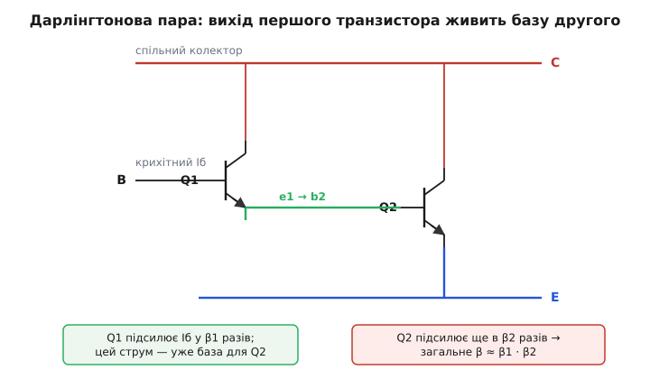
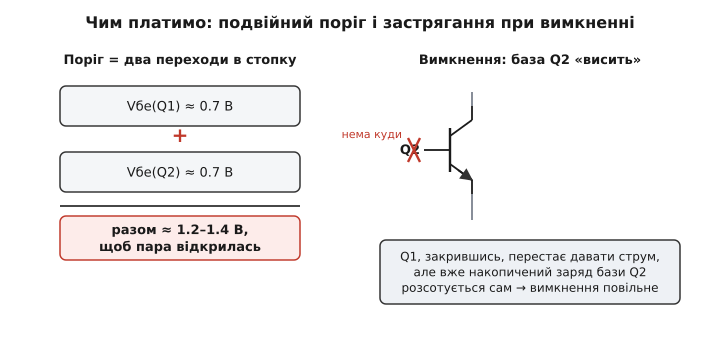

# 🔌 Дарлінгтонова пара: коли одного підсилення струму замало

Звичайний біполярний транзистор підсилює струм у β разів — типово десь у сотню. Подаєш у базу один міліампер, через колектор тече сто. Для більшості задач цього доволі. Та інколи джерело керування саме по собі настільки слабке, що навіть цей один міліампер для нього забагато. Тоді два транзистори з'єднують в один — і їхні підсилення **перемножуються**. Така зв'язка зветься **дарлінгтоновою парою** (на честь Сідні Дарлінгтона, інженера Bell Labs, який запатентував її 1953 року). Розберемо, як саме вона працює, чим за це доводиться платити, і чому в готових мікросхемах таких пар одразу сім.

### Навіщо взагалі гнатися за великим підсиленням струму

Підсилення струму вирішує, **скільки** струму керування потрібно, щоб пропустити потрібний струм навантаження. Хочемо ввімкнути реле чи мотор, що споживає 0.5 А. При β ≈ 100 базі треба подати 5 мА, щоб транзистор увійшов у насичення. Багато де це не проблема — вивід мікроконтролера легко дає 5 мА. Але буває інакше.

Уяви вихід якогось давача, операційного підсилювача в економному режимі чи фотоелемента, який фізично здатний віддати лише десятки **мікроампер**. Помнож такий струм на сотню — отримаєш кілька міліампер, для півамперного навантаження мало. А витиснути з кволого джерела більше не вийде: воно стільки просто не має. Виходить замкнене коло: навантаження вимагає більшого базового струму, ніж джерело здатне дати.

Розірвати його можна двома шляхами. Або взяти транзистор із вищим β — але β понад кількасот рідкісне, нестабільне й сильно гуляє від екземпляра до екземпляра. Або поставити **два каскади** підсилення поспіль: перший перетворить мікроампери на міліампери, другий — міліампери на ампери. Саме це й робить дарлінгтонова пара, тільки в одному корпусі та з одним спільним керуванням.

### Як перемножуються підсилення

Ідея проста до краси. Беремо два NPN-транзистори. Емітер першого (назвемо його Q1, вхідний) під'єднуємо прямо до бази другого (Q2, силовий). Колектори обох з'єднуємо разом — це спільний колектор пари. Емітер Q2 стає спільним емітером. Назовні стирчать три виводи — база, колектор, емітер, — тож зовні зв'язка поводиться як **один** транзистор, тільки дуже «підсилений».


*Q1 підсилює крихітний базовий струм у β₁ разів, і цей вихідний струм цілком стає базовим струмом Q2, який підсилює його ще в β₂ разів. Звідси добуток β ≈ β₁·β₂.*

Простежмо струм. У базу Q1 заходить крихітний струм Iб. Q1 підсилює його у β₁ разів — на його емітері маємо вже Iб·β₁. Але цей емітерний струм Q1 нікуди не розгалужується: він **повністю** входить у базу Q2. Тобто базовий струм Q2 дорівнює Iб·β₁. А Q2 підсилює його ще у β₂ разів. На виході (спільний колектор) маємо приблизно:

```
Iк ≈ Iб · β1 · β2
```

Звідси й береться знамените **перемноження**. Загальне підсилення пари:

```
β ≈ β1 · β2
```

(Точніше β ≈ β₁·β₂ + β₁ + β₂, але доданки β₁ і β₂ поряд із добутком — дрібниця, тож ними нехтують.) Підставмо числа. Хай у кожного транзистора скромне β ≈ 100. Тоді в пари:

```
β ≈ 100 · 100 = 10 000
```

Десять тисяч! Тепер, щоб пропустити 0.5 А, базі пари треба подати лише:

```
Iб = 0.5 А / 10 000 = 50 мкА
```

Ті самі п'ятдесят мікроампер, які кволе джерело таки здатне віддати. Задача, нерозв'язна для одного транзистора, для пари тривіальна. У цьому й суть: пара не дає більшого струму нізвідки — вона просто потребує **набагато менше** струму керування, щоб той самий силовий струм потік.

> 🔧 **Навіщо це.** Коли джерело сигналу слабке (давач, вихід логіки через великий резистор, оптопара, кволий вихід якоїсь мікросхеми), а ввімкнути треба щось ненажерливе — реле, соленоїд, лампу, обмотку крокового двигуна, — одного транзистора часто не вистачає за струмом керування. Дарлінгтонова пара з β у тисячі разів закриває цей розрив одним вузлом і трьома виводами.

### За все треба платити: дві ціни пари

Перемноження підсилення виглядає дармовим виграшем, але задарма не буває. Пара бере дві відчутні плати, і обидві треба тримати в голові, інакше схема поведеться не так, як чекаєш.

**Перша ціна — подвійний поріг відкриття.** Щоб звичайний кремнієвий транзистор відкрився, між базою і емітером треба прикласти приблизно 0.7 В — це падіння на одному p-n переході. А в парі база керує через **два** переходи поспіль: спершу перехід база-емітер Q1, потім перехід база-емітер Q2. Вони ввімкнені в стопку, тож їхні напруги додаються:

```
Vбе(пари) = Vбе(Q1) + Vбе(Q2) ≈ 0.7 + 0.7 ≈ 1.2–1.4 В
```


*Ліворуч: щоб пара відкрилась, керівна напруга має подолати два переходи в стопку, разом ≈ 1.2–1.4 В замість 0.7 В одного транзистора. Праворуч: при вимкненні заряд із бази Q2 нікому активно витягти — він розсотується сам, тому пара гасне повільніше.*

Тобто пара «вмикається» пізніше за одиночний транзистор. Для логіки на 3.3 чи 5 В півтора вольта — ще прийнятно, але це з'їдає частину запасу. Гірше інше: коли пара повністю відкрита (в насиченні), напруга між її колектором і емітером **не падає до майже нуля**, як в одиночного ключа. Адже силовий Q2 не може досягти свого власного низького насичення — на його базі сидить емітер Q1, який тримає напругу. У підсумку напруга на відкритій парі складається з насичення Q2 плюс падіння на переході Q1 і виходить десь 0.9–1.2 В замість ~0.2 В одиночного транзистора. На струмі 0.5 А це означає зайвих півватта тепла, що гріє корпус і марнує енергію. Для ключа це помітна вада.

**Друга ціна — повільне вимкнення.** Поки пара відкрита, у базі силового Q2 накопичений неосновний заряд — він і тримає транзистор відкритим. Щоб Q2 закрити, цей заряд треба **вивести**. Але глянь, хто з'єднаний із базою Q2: лише емітер Q1. Коли ми знімаємо сигнал і Q1 закривається, він просто **перестає підкачувати** струм у базу Q2 — а от активно **відсмоктати** вже накопичений заряд звідти нема кому. Цьому заряду нема куди швидко стекти, тож він розсотується сам собою через повільну рекомбінацію. Поки він не зникне, Q2 лишається відкритим. Тому дарлінгтонова пара гасне помітно повільніше, ніж умикається, — її вимкнення «затягнуте».

Для реле чи лампи ця млявість байдужа — там і так усе повільне. А от **швидко перемикати** парою не варто: на високій частоті (наприклад, у ШІМ для керування яскравістю чи обертами) затягнуте вимкнення означає, що транзистор довго лишається в проміжному, напіввідкритому стані, де на ньому водночас і чималий струм, і чимала напруга. Це гріє його даремно. Саме тому в швидкісних ключах частіше беруть MOSFET, а дарлінгтонову пару лишають для повільних, але струмних навантажень. (Окремий резистор з бази Q2 на емітер трохи пришвидшує вимкнення, даючи заряду куди стекти, але радикально проблему не знімає.)

### Готова збірка: масив із семи пар

Складати пару з двох окремих транзисторів щоразу незручно, надто коли керованих навантажень багато — скажімо, вісім обмоток у двох крокових двигунах чи ряд реле. Тому давно випускають **масиви дарлінгтонових пар** в одному корпусі. Класичний приклад — **ULN2003**: усередині сім незалежних дарлінгтонових пар зі спільним емітерним виводом, кожна готова прийняти сигнал прямо з логіки.

Що цінного вже вбудовано в таку збірку, крім самих пар. По-перше, на вході кожної пари стоїть **послідовний резистор** (у ULN2003 — 2.7 кОм), тож вхід можна чіпляти прямо до виходу 5-В логіки чи мікроконтролера: резистор сам перетворить напругу на потрібний базовий струм, зовнішніх деталей не треба. По-друге, виходи зроблено за схемою **відкритого колектора** — пара лише стягує свій вихід до землі (комутує «мінусовий» провід навантаження, тобто це нижнє плече), а навантаження вішають між плюсом живлення і виходом. Кожен вихід тримає до 500 мА (короткочасний пік до 600 мА) і витримує до 50 В у закритому стані. По-третє — і це особливо зручно — всередині вже є **захисні діоди** проти викидів індуктивних навантажень. Реле, соленоїд, обмотка двигуна при вимкненні струму вистрілюють напругою зворотної полярності (самоіндукція), здатною пробити транзистор; вбудовані діоди гасять цей викид. Щоб вони працювали, спільний вивід захисту (COM) під'єднують до плюса живлення навантаження.

Усе це робить ULN2003 типовою «робочою конячкою» там, де треба з логічного сигналу ввімкнути кілька струмних навантажень одразу: ряди реле, лампи, соленоїди, обмотки крокового двигуна. Принцип усередині — рівно той самий: дві пари переходів, перемножене β, подвійний поріг і затягнуте вимкнення. Масив лише множить готову пару на сім і додає навколо неї зручний «обвіс».

> 🔧 **Навіщо це.** Якщо треба з виходів мікроконтролера керувати кількома реле, соленоїдами чи обмотками крокового двигуна, не варто городити пари з розсипу транзисторів. Один корпус-масив дарлінгтонових пар дає сім готових ключів із вбудованими вхідними резисторами й захисними діодами — лишається підключити навантаження між плюсом і виходом, а вхід завести прямо з логіки.

### Дрібний шрифт

- Пара з двох **NPN** — це класичний дарлінгтон. Є й споріднена зв'язка з NPN та PNP (пара Шиклаї), що дає той самий перемножений β, але лише з одним падінням Vбе на вході; у масивах на кшталт ULN2003 застосовують саме звичайний дарлінгтон.
- Підсилення пари сильно залежить від струму: при дуже малих і дуже великих струмах β обох транзисторів просідає, тож добуток у тисячі — це орієнтир для середини діапазону, а не гарантія на краях.
- Витоки теж перемножуються: малий зворотний струм закритого Q1 потрапляє в базу Q2 й підсилюється, тому в закритому стані крізь пару тече більший залишковий струм, ніж крізь один транзистор. Для ключа це зазвичай дрібниця, але в чутливих колах варто пам'ятати.
- Якщо потрібен не нижнє плече (стягування до землі), а керування «плюсовим» проводом, тут потрібен інший підхід — окрема [схема верхнього плеча](book:electronics/bjt-switch).
