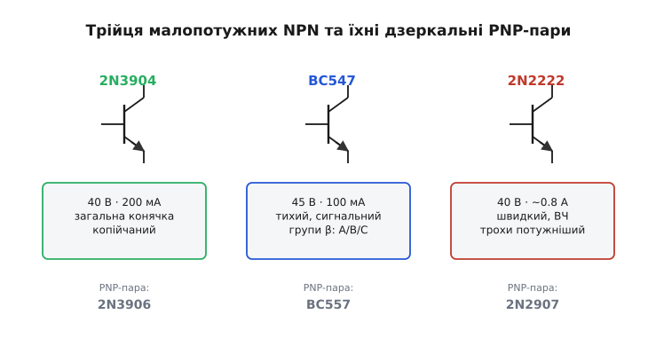
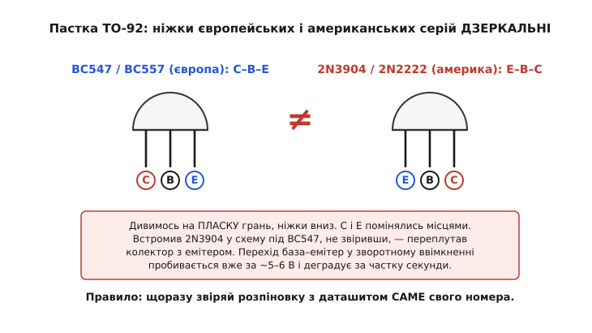

# 🔌 Малопотужні NPN: 2N3904, BC547, 2N2222 і як обрати

У шухляді в кожного, хто паяє, лежить кілька малопотужних NPN — на них тримається більшість дрібних ключів і сигнальних каскадів. Тут — про три такі робочі конячки: чим вони різняться, як читати їхні паспортні числа й суфікси, і де ховається головна пастка, на якій спотикаються всі новачки.

### Три імені, що варто знати

Більшість простих ключів і підсилювачів на дрібному струмі роблять на трьох сімействах.


*2N3904 — копійчана загальна конячка; BC547 — тихий сигнальний із групами β; 2N2222 — універсальний і швидший. У кожного є дзеркальна PNP-пара для симетричних схем.*

**2N3904** — американська загальна конячка: 40 В, 200 мА. Годиться і ключем, і підсилювачем, копійчаний і всюдисущий — типовий «перший транзистор». PNP-пара — 2N3906.

**BC547** (а також BC548, BC549) — європейський малопотужний NPN: 45 В, 100 мА, дуже тихий (BC549 — спеціально малошумний). Це класика **сигнальних** і аудіопідсилювачів — типовий вибір у [підсилювач зі спільним емітером](topic:electronics/bjt-amplifier) на макетці. PNP-пара — BC557.

**2N2222** (та його пластикові версії PN2222, P2N2222) — універсальний і швидкий NPN: 40 В, струм аж до ~0.6–0.8 А, висока гранична частота (близько 300 МГц). Годиться і ключем, і у високочастотних колах — звідси й слава «транзистора на всі випадки». PNP-пара — 2N2907.

Потрібно трохи більше струму — є потужніші родичі тих самих корпусів: BC337, 2N4401 (до ~0.8 А). А наявність **комплементарних пар** (для кожного NPN — дзеркальний PNP) зручна, коли треба симетрична схема: двотактний вихід, місток, [ключ у плюсовому проводі](topic:electronics/bjt-switch).

Три числа в даташиті — напруга, струм, частота — не випадкові, і за кожним стоїть фізика кристала. Варто розібрати два з них, бо саме вони пояснюють, чому BC547 беруть у тихий мікрофонний підсилювач, а 2N2222 — у радіотракт.

### Чому BC547 «тихіший»: звідки в транзисторі шум

Коли кажуть, що BC549 «малошумний», мають на увазі конкретну величину — **коефіцієнт шуму** (*noise figure*, NF). Але чому один транзистор шумить менше за інший, якщо кристали ніби однакові кремнієві? Бо шум у біполярнику народжується з двох фізичних джерел, і виробник цілеспрямовано тисне обидва.

Перше джерело — **дробовий шум** (*shot noise*). Струм через перехід — це не плавна ріка, а потік окремих електронів, що по одному долають бар'єр у випадкові моменти. Уяви дощ на бляшаному даху: краплі падають незалежно, тож загальний шум тим помітніший на тлі сигналу, чим менше крапель. Так само й тут: випадковість кожного акту переходу породжує флуктуацію струму, і вона тим відносно більша, чим менший сам струм. Тому малошумні каскади працюють на ретельно підібраному струмі колектора — не надто малому, щоб дробовий шум не виліз, і не надто великому, щоб не грілося.

Друге джерело — **тепловий шум** (*thermal*, або *Johnson noise*) на **опорі бази** (*base spreading resistance*, r_bb′). База — це тонесенький шар напівпровідника, і доки сигнальний струм пробирається крізь нього до активної області, він тече через цей розподілений опір. А будь-який опір при температурі вище абсолютного нуля шумить: теплові коливання решітки трясуть носії, наводячи випадкову напругу. Чим менший r_bb′, тим менший цей внесок — і ось тут ховається головна різниця сімейств.

BC549 і його клас роблять малошумними не магією, а **геометрією**: ширшим емітером і легуванням бази так, щоб опір r_bb′ був мінімальним, плюс підбором за струмом, де дробовий шум найменший. Звичайний 2N3904 цього оптимуму не проходив — у нього r_bb′ більший, тому й шумить помітніше. Тобто «тихий» транзистор — це не інша фізика, а та сама фізика, у якій конструктор прибрав обидва доданки шуму, де міг.

> 🔧 **Навіщо це.** У вхідному каскаді мікрофонного чи термопарного підсилювача, де сигнал — одиниці мікровольтів, власний шум транзистора визначає, чи почуєш ти корисний сигнал узагалі. Ось чому в таке коло ставлять саме BC549/BC550, а не перший-ліпший 2N3904: при підсиленні в сотні разів шум входу теж множиться в сотні разів, і економія на вхідному транзисторі чутна на виході як шипіння.

### Чому 2N2222 «швидший»: гранична частота й ємність переходу

Тепер про ті «~300 МГц». Це **гранична частота** (*transition frequency*, f_T) — частота, на якій підсилення по струму падає до одиниці, тобто транзистор перестає підсилювати взагалі. Чому в нього є стеля по частоті й чому в 2N2222 вона вища, ніж практично використовують у BC547?

Бо в кожному переході сидить **ємність**. P-N-перехід — це дві області різного заряду, розділені збідненим шаром; геть як обкладки конденсатора. А конденсатор не можна зарядити миттєво: щоб напруга на переході змінилася, треба прокачати заряд, і на це йде час. Найшкідливіша тут — ємність переходу база–колектор C_bc: через неї підсилений вихідний сигнал просочується назад на вхід, і цей зворотний зв'язок гасить підсилення тим сильніше, чим вища частота (ефект Міллера). Грубо, f_T тим вища, чим менші ємності переходів і чим коротший пробіг носіїв крізь базу:

```
        g_m
f_T ≈ ─────────────       g_m — крутість (∝ струму колектора)
      2π·(C_be + C_bc)     C_be, C_bc — ємності переходів
```

Звідси видно два важелі. Перший — **струм**: крутість g_m росте зі струмом колектора, тому той самий транзистор на більшому Iк «швидший». Другий, фундаментальний — **геометрія кристала**: тонша база (носії долають її швидше) і менша площа переходів (менші C_be, C_bc) піднімають стелю f_T. 2N2222 кроїли під радіочастоту — у нього маленькі переходи й тонка база, звідси близько 300 МГц. BC547 — сигнальний на звук і кілогерци; його ніхто не оптимізував під ВЧ, тому так високо його просто не женуть.

> 🔧 **Навіщо це.** Якщо керуєш цифровим сигналом із крутими фронтами — наприклад, ключуєш підсвічування на десятках кілогерц ШІМ — низька f_T і велика C_bc розмивають фронти: транзистор не встигає за командою, на виході замість прямокутника завали. Для ВЧ-генератора чи швидкого ключа бери 2N2222 з його запасом по частоті; для звукового тракту f_T BC547 з головою вистачає, зате виграєш у шумі.

### Worked example: чи встигне ключ за ШІМ

**Умова.** Хочемо ключувати затвор силового MOSFET сигналом ШІМ 50 кГц через малий NPN. Чи буде BC547 (f_T ≈ 150 МГц при Iк = 10 мА) вузьким місцем по швидкості?

```
Робочий струм каскаду:     Iк = 10 мА
f_T при цьому струмі:       f_T ≈ 150 МГц
Частота сигналу:            f_шім = 50 кГц = 0.05 МГц

Запас по частоті:
  f_T / f_шім = 150 МГц / 0.05 МГц = 3000×

Орієнтовний час переходу (1/2πf_T як стала переходу):
  τ ≈ 1 / (2π · 150·10⁶) ≈ 1.06 нс

Період ШІМ:
  T_шім = 1 / 50·10³ = 20 мкс = 20 000 нс
```

**Висновок.** Сама фізика переходу (≈1 нс) у 20 000 разів швидша за період ШІМ — транзистор тут не вузьке місце. Реальну швидкість обмежить не f_T, а **заряд затвора MOSFET і опір у колі бази/затвора**: щоб швидко перезаряджати ємність затвора, потрібен достатній струм, а його дає вибір резистора бази й самого струму колектора, не гранична частота. Тобто для повільного ключа на десятках кілогерц f_T узагалі не критерій — критичним він стане лише на одиницях-десятках мегагерц, де ці ~3000× з'їдаються.

### Як читати суфікси

Літери після номера не випадкові. У серії BC суфікс **A/B/C** позначає [групу β](topic:electronics/bjt-gain): BC547**A** має скромне підсилення (≈110–220), BC547**B** — середнє, BC547**C** — високе (до ~800). Якщо схемі потрібен надійний коефіцієнт, беруть із потрібною літерою. У 2N2222 суфікс **A** (2N2222**A**) — покращена версія з вищою напругою; префікс **PN**/**P2N** означає дешевий пластиковий корпус замість оригінального металевого. Дрібниця, але в даташиті вона є, і номер треба брати точно свій.

### Головна пастка: розпіновка дзеркальна

А тепер найважливіше попередження. **Розпіновка TO-92 в європейських і американських серій РІЗНА** — навіть протилежна.


*Дивлячись на пласку грань корпусу (ніжки вниз): у BC547/BC557 виводи йдуть C–B–E, а в 2N3904/2N2222 — навпаки, E–B–C. Переплутав родину — переплутав колектор з емітером.*

Це не дрібниця: якщо взяти схему під BC547 і встромити в неї 2N3904, не звіривши виводи, колектор з емітером поміняються місцями — і транзистор або не працюватиме, або згорить. Чому згорить? Бо перехід **база–емітер у зворотному ввімкненні пробивається вже за кілька вольтів** (типово ~5–6 В у малопотужних NPN): він тонкий і сильно легований з обох боків, тому збіднений шар вузький і поле в ньому досягає пробою при низькій напрузі — на відміну від переходу база–колектор, розрахованого на десятки вольтів. Подаси на дзеркально вставлений транзистор живлення — і ввімкнеш цей крихкий перехід задом наперед, лавинний пробій його деградує за частку секунди. Звідси залізне правило: щоразу звіряй розпіновку з даташитом **саме свого** номера, а не покладайся на пам'ять, де там була база. Зайва хвилина рятує і транзистор, і години налагодження.

### SMD і вибір

Для поверхневого монтажу ті самі кристали випускають у крихітних корпусах SOT-23: **MMBT3904**, **MMBT2222**, **BC847** (= BC547) — параметри ті самі, лише форм-фактор для машинного складання; у них своя розпіновка, теж за даташитом.

> 🔧 **Навіщо це.** Для дрібного ключа чи підсилювача тримай у шухляді трійцю: **2N3904** (загальна конячка), **BC547** (тихий сигнальний, із потрібною групою β) і **2N2222** (універсальний, швидший і трохи потужніший) — плюс їхні PNP-пари. Вибір зводиться до кількох чисел: струм навантаження, напруга, β, для ВЧ — гранична частота, корпус під монтаж. А перед тим, як встромити транзистор у плату, звір розпіновку з даташитом: в європейських і американських серій вона дзеркальна, і це найчастіша причина «чомусь не працює».
