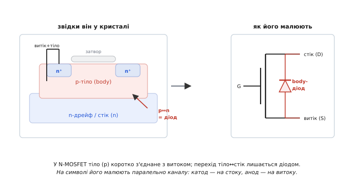
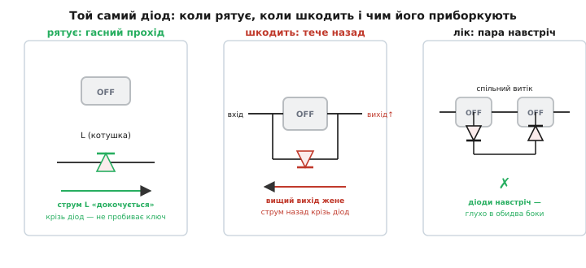
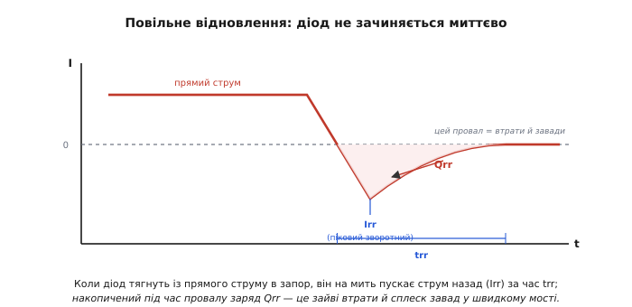

# Body-діод

Розкрийте даташит будь-якого силового MOSFET — і поряд із опором каналу та зарядом затвора там стоятиме окремий розділ про діод: його пряме падіння, піковий зворотний струм, час відновлення. Дивно: ми ж купуємо транзистор-ключ, навіщо йому діод? А тому, що цей діод не додали навмисне — він **виростає сам** із того, як узагалі влаштований MOSFET. Його не можна замовити «без діода», як не можна замовити трикутник без третього кута. Він є в кожному польовому транзисторі, тихо сидить між витоком і стоком, і та сама природа робить його то рятівником схеми, то прихованою пасткою. Звати його **body-діод** (англ. *body* — тіло, бо народжується він із кремнієвого тіла транзистора; інші назви — внутрішній, паразитний).

### Чому діод виростає сам

Щоб побачити, звідки він береться, гляньмо, з чого складений MOSFET. У [будові MOSFET](book:electronics/mosfet-structure) є три ділянки кремнію різного типу провідності: **тіло** (body) — суцільна підкладка одного типу, а в ній — два острівці протилежного типу: витік і стік. У N-канального транзистора тіло — це p-кремній, а витік і стік — області n⁺. Кожна межа p-кремнію з n-кремнієм — це **p-n перехід**, тобто [діод](root:embedded/diodes) за самою побудовою. Отже, у структурі вже сидить пара переходів: тіло↔витік і тіло↔стік. Це не дефект і не вада конкретної моделі — це неминучий наслідок того, що поряд із n завжди опиняється p.

Лишити тіло «висіти» окремим виводом не можна, і тут криється друга причина. Якщо тіло, витік і стік нічим не з'єднати, то трійка n⁺–p–n⁺ утворює готовий **паразитний біполярний транзистор** (емітер–база–колектор): витік за емітер, тіло за базу, стік за колектор. За різкого стрибка напруги цей непроханий біполярник може раптом відкритися й пустити крізь себе некерований струм — приладу настає кінець. Таке самовідкриття зветься **засувкою** (англ. *latch-up* — буквально «замкнутися на засув», бо структура клацає у провідний стан і не виходить із нього сама). Щоб біполярник не ожив ніколи, виробник прямо на кристалі **з'єднує тіло накоротко з витоком** — притискає базу паразитного транзистора до його ж емітера. Без різниці потенціалів між базою та емітером відкритися він уже не здатен.

Та в цього короткого з'єднання є наслідок, заради якого все й затівалося. Перехід тіло↔витік тепер закорочений — він мовчить. А перехід **тіло↔стік лишається живим діодом**; і оскільки тіло тепер сидить на потенціалі витоку, цей діод виявляється ввімкненим **між витоком і стоком**. Це і є body-діод. Куди він «дивиться», диктує тип каналу:

```
N-MOSFET:  тіло (p) на витоку → анод = витік,  катод = стік   (пускає струм S → D)
P-MOSFET:  тіло (n) на витоку → катод = витік, анод = стік    (пускає струм D → S)
```


*У N-канального тіло (p) з'єднане з витоком, тож живим лишається перехід тіло↔стік. На символі його малюють паралельно каналу: катод на стоку, анод на витоку. У P-канального все дзеркально.*

У нормальній роботі N-MOSFET (стік плюсовий відносно витоку) цей діод зворотно зміщений — він мовчить, і про нього можна забути. Прокидається він лише тоді, коли стік **опускається нижче** витоку, тобто струм пробує піти крізь транзистор «назад», з витоку на стік. І ось тут починається найцікавіше, бо діод живе **власним життям**, незалежно від затвора: відкритий канал чи закритий — body-діод відкриється від полярності напруги, а не від вашого керування.

> 🔧 **Навіщо це.** Та сама стрілка-діод між витоком і стоком на умовному позначенні MOSFET — не прикраса «для повноти». Це реальний компонент, який працюватиме у вашій схемі, хочете ви того чи ні. Перше, що варто зробити з будь-яким силовим ключем у схемі: подумки знайти його body-діод і спитати — а коли цей діод відкриється?

### Коли він рятує: гасний прохід для індуктивності

Добрий бік body-діода найкраще видно з [котушкою](book:electronics/inductor-coil) чи будь-яким індуктивним навантаженням — мотором, обмоткою реле, дроселем. Струм в індуктивності не вміє урватися миттєво: спробуєш різко розірвати коло — і котушка шарпне напругою вгору на сотні вольтів, аби лиш проштовхнути свій струм далі (це закон самоіндукції). Без обхідної дороги цей викид пробив би ключ.

Body-діод цю дорогу й дає. Коли MOSFET у [H-мості](book:electronics/h-bridge) закривається, струм котушки шукає, куди податися, — і знаходить body-діод сусіднього плеча, відкритий якраз у потрібний бік. Струм спокійно «докочується» крізь діод по інерції, доки не згасне; пробою немає. Англійці влучно звуть це **freewheeling** (буквально «вільне колесо» — як велосипед котиться накатом, коли вже не крутиш педалі): струм по інерції докочується сам. Завдяки цьому міст на MOSFET-ах має **вже вбудовані** гасні діоди — окремі навісні діоди для індуктивного навантаження часто й не потрібні.

Той самий механізм виручає в перетворювачах живлення. У [синхронному випрямлячі](book:electronics/sync-rectifier) два ключі по черзі женуть струм у дросель, і між їхніми перемиканнями лишають коротку паузу — **мертвий час** (англ. *dead time*), щоб обидва не відкрилися разом і не закоротили шину. У цю паузу струм дроселя нікуди не дівається — і його приймає на себе саме body-діод, поки не ввімкнеться наступний канал. Тобто діод робить корисну роботу рівно в ті миті, коли керовані канали обидва закриті.


*Один і той самий діод поводиться по-різному залежно від схеми: зліва рятує індуктивний струм, посередині зраджує (жене струм назад крізь закритий ключ), справа — приборканий парою транзисторів спина-до-спини.*

### Коли він шкодить

Лихий бік виходить трьома різними способами, і всі троє регулярно ловлять інженерів зненацька.

**Один ключ не вміє по-справжньому роз'єднати.** MOSFET — ключ лише в **один** бік. У бік, куди дивиться body-діод, він не вимикач, а діод: закриєш канал — а діод усе одно тече. Тому якщо напруга на ключі може змінити знак (переплутаний акумулятор, заряджений вихід, друга шина на тому ж проводі), одним транзистором навантаження не від'єднати. Канал закритий — а струм біжить крізь діод, і «вимкнена» гілка живиться далі. Це класична пастка ключів живлення: детально, як вона зриває саме ключ навантаження й чим її лікують, розібрано окремо [в матеріалі про body-діод у ключі живлення](book:electronics/load-switch/comp-body-diode.md).

**Повільне відновлення.** Body-діод — поганенький діод: він мляво зачиняється. Звичайний кремнієвий p-n діод, відпрацювавши прямий струм, не замикається тієї ж миті, коли напруга міняє знак, — усередині лишаються накопичені носії заряду, і поки вони не розсмокчуться, діод ще **пропускає струм назад**. Це **зворотне відновлення** (англ. *reverse recovery* — повернення до запірного стану): у короткий проміжок trr діод устигає кинути сплеск зворотного струму Irr, а сумарний заряд, що протік за цей час назад, звуть Qrr.

```
trr  — час відновлення: скільки діод іще проводить «назад» після зміни знака
Irr  — піковий зворотний струм за цей час
Qrr  — повний заряд, що протік назад (площа провалу): Qrr ≈ ½ · Irr · trr
```


*Діод не зачиняється миттєво: його витягають із прямого струму, він на мить пускає струм назад (пік Irr за час trr), і накопичений заряд Qrr — це зайві втрати та джерело завад.*

У жорстко-перемикальному мості це обертається бідою. Body-діод проводить у мертвий час, а коли протилежний ключ відкривається, він мусить різко закритися — і встигає пропустити крізь себе сплеск зворотного струму. Виходять три неприємності разом: зайві втрати (струм тече «не туди» під повною напругою), різкий стрибок струму збуджує дзвін на паразитних індуктивностях — а це електромагнітні завади, і той самий різкий dV/dt на закритті може через опір тіла **підняти** той самий паразитний біполярник, заради приборкання якого тіло й коротили. Тому у швидких мостах беруть MOSFET-и зі **спеціально пришвидшеним** body-діодом (малий Qrr, м'яке відновлення) або вішають паралельно [діод Шотткі](root:embedded/zener-schottky), який майже не має зворотного відновлення й перехоплює струм на себе.

**Несподіваний шлях для струму.** Body-діод уміє провести струм туди, куди ви не планували, — «підживити» нібито знеструмлену шину, якщо її вихід хтось іще тримає під напругою. На цьому спотикаються щоразу, коли в голові тримають канал, а про діод усередині забувають.

### Що з ним роблять

Інженерні відповіді прості й давно усталені — і всі вони зводяться до того, **куди дивиться діод** і **наскільки він швидкий**.

Де потрібне **чесне** двостороннє від'єднання — ставлять **два MOSFET спина-до-спини** (англ. *back-to-back*): з'єднують їх так, щоб body-діоди дивилися назустріч один одному. Тоді хоч куди штовхай струм, один із двох діодів завжди стоятиме поперек. Саме так будують вимикачі живлення, захист від переполярності й контролери «ідеального діода». Ціна — подвійний опір каналу, бо струм іде крізь два канали послідовно.

Де body-діод заважає **повільним відновленням** — його обходять активно: відкривають протилежний канал, щойно струм мав би піти крізь діод (те саме [синхронне випрямлення](book:electronics/sync-rectifier)). Струм тоді біжить холодним каналом із малим опором, а діоду лишається тільки коротка мить мертвого часу — менше провідності діода означає менший Qrr і менші втрати. А де міст таки жорсткий і діод не обійти — беруть транзистор із швидким body-діодом або паралельний Шотткі.

### Числовий приклад: чи болить body-діод у мертвий час

Прикинемо втрати на body-діоді в синхронному перетворювачі — це типовий розрахунок, який прошивка може й сама вести для теплового нагляду. Нехай нижній ключ півмоста працює на частоті fsw = 100 кГц, веде струм навантаження I = 5 А, а контролер лишає мертвий час td = 60 нс **двічі за період** (перед увімкненням і після вимкнення верхнього ключа). У ці проміжки струм 5 А тече крізь body-діод із прямим падінням Vf ≈ 0.8 В. Скільки потужності це з'їдає?

:::tabs
```cpp
// Оцінка втрат на body-діоді нижнього ключа за мертвий час.
// Запускаємо на МК (ESP32 тощо) для теплового нагляду в реальному часі.
const float Vf      = 0.8f;       // пряме падіння body-діода, В (з даташита)
const float I_load  = 5.0f;       // струм навантаження, А
const float f_sw    = 100000.0f;  // частота перемикання, Гц
const float t_dead  = 60e-9f;     // мертвий час, с (один проміжок)
const int   n_dead  = 2;          // скільки разів за період діод проводить

// частка періоду, коли струм іде крізь діод
float duty_diode = t_dead * n_dead * f_sw;     // 60e-9 * 2 * 1e5 = 0.012  (1.2 %)
float p_diode    = Vf * I_load * duty_diode;   // 0.8 * 5 * 0.012 = 0.048 Вт

ESP_LOGI("pwr", "vtraty na body-diodi: %.0f mVt (%.1f%% periodu)",
         p_diode * 1000.0f, duty_diode * 100.0f);
// → vtraty na body-diodi: 48 mVt (1.2% periodu)
```
```python
# Оцінка втрат на body-діоді нижнього ключа за мертвий час.
# Запускаємо на МК (ESP32 тощо) для теплового нагляду в реальному часі.
Vf      = 0.8        # пряме падіння body-діода, В (з даташита)
I_load  = 5.0        # струм навантаження, А
f_sw    = 100_000.0  # частота перемикання, Гц
t_dead  = 60e-9      # мертвий час, с (один проміжок)
n_dead  = 2          # скільки разів за період діод проводить

# частка періоду, коли струм іде крізь діод
duty_diode = t_dead * n_dead * f_sw   # 60e-9 * 2 * 1e5 = 0.012  (1.2 %)
p_diode    = Vf * I_load * duty_diode  # 0.8 * 5 * 0.012 = 0.048 Вт

print("vtraty na body-diodi: %.0f mVt (%.1f%% periodu)" %
      (p_diode * 1000.0, duty_diode * 100.0))
# → vtraty na body-diodi: 48 mVt (1.2% periodu)
```
:::

```
Перевіримо руками:
  частка часу крізь діод = td · n · fsw = 60·10⁻⁹ · 2 · 100·10³ = 0.012  → 1.2 %
  втрати                 = Vf · I · частка = 0.8 · 5 · 0.012      = 0.048 Вт = 48 мВт
```

Сорок вісім міліват — наче дрібниця. Але варто підняти частоту до 500 кГц або розтягнути мертвий час до 200 нс — і ця цифра злетить у рази, бо вона **прямо пропорційна** і частоті, і мертвому часу. Звідси й головний важіль синхронного перетворювача: **тримати мертвий час якнайкоротшим**, аби струм скоріше пішов холодним каналом, а не гарячим діодом. А якщо потрібна ще менша цифра — ставлять MOSFET із нижчим Vf body-діода або паралельний Шотткі, у якого падіння менше.

> 🔧 **Навіщо це.** Запам'ятайте головне: у кожному силовому MOSFET «їде» діод від витоку до стоку. Як **гасний прохід** — він дарунок: у мостах окремих діодів для індуктивного навантаження часто не треба. Як **перешкода** — тримайте в голові, що одним MOSFET не вийде ані від'єднати навантаження від зворотної напруги (треба пара спина-до-спини), ані швидко перемикати без оглядки на його повільне відновлення. Перш ніж поставити MOSFET ключем, завжди спитайте себе одне: «а куди дивиться його body-діод — і коли він відкриється?»
