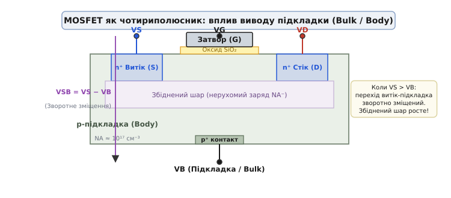
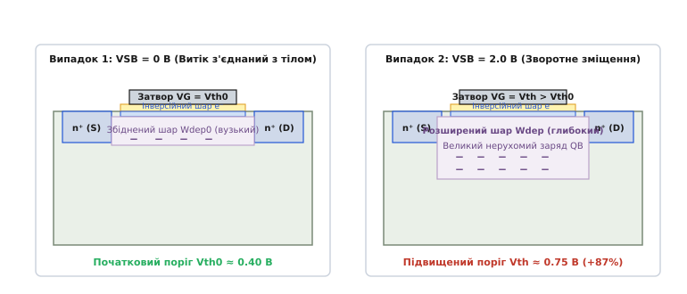
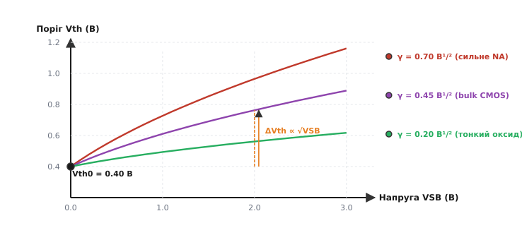
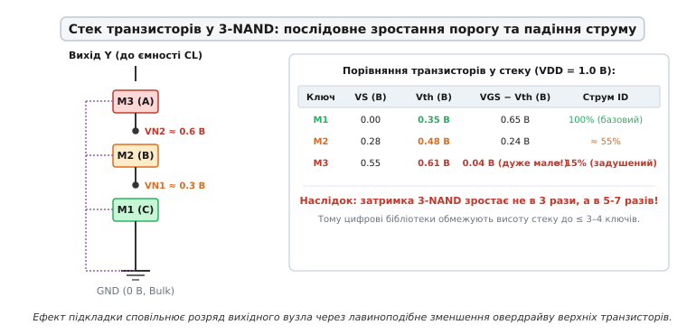
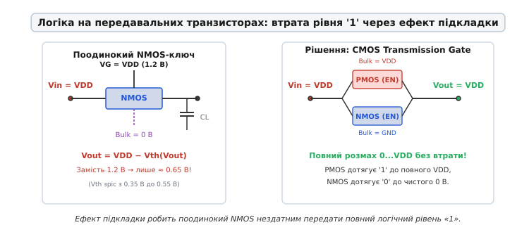
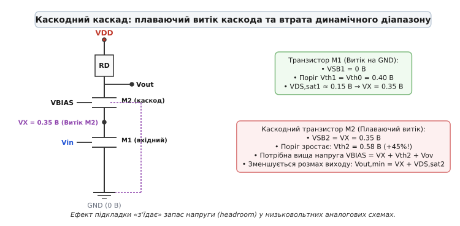
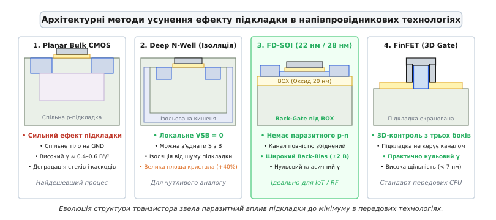
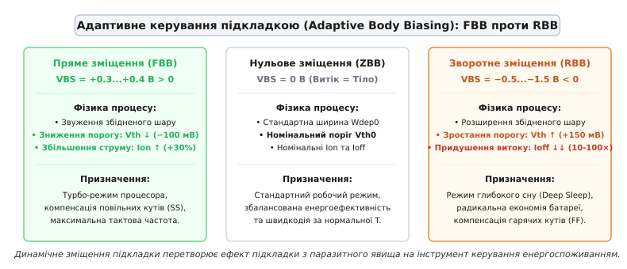

# Ефект підкладки: як напруга тіла керує порогом MOSFET

<preknowlist>
- [Будова MOSFET](topic:electronics/mosfet-structure) — чотириполюсна структура, підзатворний оксид, затвор і напівпровідникова підкладка.
- [Поріг відкривання MOSFET](topic:electronics/mosfet-threshold) — поняття порогової напруги V_th, збіднення та сильна інверсія під затвором.
- [p-n перехід](topic:physics/pn-junction) — просторовий заряд іонізованих домішок і розширення збідненого шару при зворотному зміщенні.
- [CMOS-логіка](topic:electronics/cmos) — комплементарні пари транзисторів, вентилі NAND/NOR та послідовні стеки ключів.
</preknowlist>

У підручниках і спрощених схемах польовий транзистор MOSFET малюють як триполюсний прилад із виводами затвора, стоку й витоку. У такій ідеалізованій картині все здається простим: напруга між затвором і витоком перевищила фіксований паспортний поріг `V_th` — прилад відкрився; впала нижче — закрився. Проте реальний кристал мікросхеми виготовлений у суцільному шарі напівпровідника, і кожен транзистор має четвертий, фундаментальний контакт — напівпровідникове тіло або підкладку *(Bulk / Body)*.

Поки витік транзистора фізично з'єднаний із цією підкладкою, порогова напруга залишається стабільною. Але варто транзистору опинитися всередині складнішого кола — наприклад, у верхньому поверсі каскодного підсилювача, у послідовному логічному стеку вентиля NAND або в ролі передавального аналогового ключа — як його витік піднімається над землею, набуваючи додатного потенціалу. Підкладка водночас залишається підключеною до спільної нульової шини чипа. Між витоком і тілом виникає різниця потенціалів, перехід підкладки зазнає зворотного зміщення, і порогова напруга транзистора починає непередбачувано зростати. Цю паразитну модуляцію порогу електростатичним полем підкладки називають **ефектом підкладки** *(body effect)*.


*MOSFET як повноцінний чотириполюсник. Крім трьох звичних виводів (G, D, S), прилад спирається на напівпровідникову p-підкладку (B). Різниця напруг між витоком і тілом VSB = VS − VB зворотно зміщує ізолюючий p-n перехід і деформує робочі характеристики транзистора.*

---

### Фізичний механізм: розширення збідненого шару та податок на поле затвора

Щоб зрозуміти, чому напруга підкладки змінює поріг відкривання транзистора, необхідно простежити баланс електричних зарядів безпосередньо під підзатворним діелектриком.

У звичайному n-канальному транзисторі під оксидом лежить кремній p-типу. У нейтральному стані цей напівпровідник заповнений рухомими позитивними дірками та нерухомими негативно зарядженими іонами акцепторної домішки (найчастіше бору). Коли на затвор подається додатна напруга, її електричне поле відштовхує вільні дірки від межі розділу з діелектриком углиб підкладки. Біля поверхні утворюється зона, позбавлена вільних носіїв — **збіднений шар** *(depletion region)*. У ньому залишаються оголені нерухомі іони акцепторів, які несуть негативний просторовий заряд `Q_B`.

Щоб на поверхні виник провідний інверсійний місток із вільних електронів (власне n-канал), електричне поле затвора повинно вирішити два послідовні фізичні завдання:
1. Повністю скомпенсувати нерухомий негативний заряд іонізованих акцепторів `Q_B` у збідненій області;
2. Створити достатній додатковий потенціал на поверхні кремнію (`ϕ_s ≈ 2·ϕ_F`, де `ϕ_F` — потенціал Фермі), щоб притягнути з витоку та стоку електрони й сформувати шар сильної інверсії.

У стандартному режимі, коли витік і підкладка з'єднані разом (`V_S = V_B = 0`), товщина збідненого шару визначається виключно початковим вигином зон. Заряд акцепторів помірний, і затвору вистачає невеликої порогової напруги `V_th0` (зазвичай `0.3–0.4 В` у сучасних процесах), щоб відкрити канал.


*Вплив напруги витік-підкладка на внутрішню структуру каналу. Зліва — VSB = 0 В: збіднений шар вузький, нерухомий заряд помірний, затвор легко наводить канал при напрузі Vth0. Справа — VSB = 2.0 В: зворотне зміщення розширює збіднений шар, оголюючи масивний заряд іонів акцепторів; поле затвора витрачається на його компенсацію, і поріг зростає до 0.75 В.*

Тепер розглянемо ситуацію, коли витік отримує додатний потенціал `V_S > 0`, а підкладка залишається заземленою (`V_B = 0`). Між інверсійним каналом і нейтральною товщею p-підкладки виникає зворотне зміщення `V_SB = V_S − V_B > 0`. Це зворотне поле діє як потужний пилосос для рухомих дірок: воно затягує їх ще глибше в кремнієву пластину.

Як наслідок, збіднена область різко розширюється вглиб підкладки:

```
W_dep = √( 2·ε_si · (2·ϕ_F + V_SB) / (q·N_A) )
```

Зі збільшенням ширини шару `W_dep` кількість оголених нерухомих негативних іонів бору зростає пропорційно кореню з прикладеної напруги. Цей збільшений просторовий заряд `Q_B` створює власне зустрічне електричне поле, спрямоване проти поля затвора.

Силові лінії електричного поля, які виходять від додатного заряду на металі затвора, тепер майже повністю «замикаються» на цей масивний блок негативних іонів у підкладці, замість того щоб притягувати вільні електрони до поверхні. Затвор змушений «платити важкий електростатичний податок»: щоб зібрати таку ж саму кількість електронів у каналі, на затвор доводиться подавати значно вищу напругу. У результаті порогова напруга відкривання транзистора піднімається.

---

### Кількісна модель: формула зсуву порогу та коефіцієнт підкладки

Кількісний зв'язок між напругою на переході витік-підкладка `V_SB` та пороговою напругою `V_th` описується класичним аналітичним виразом фізики напівпровідників:

```
V_th(V_SB) = V_th0 + γ · ( √(2·ϕ_F + V_SB) − √(2·ϕ_F) )
```

Розберемо фізичний зміст кожного параметра у цій залежності:

* **`V_th0`** — початкова (номінальна) порогова напруга транзистора за відсутності зміщення (`V_SB = 0`). Вона визначається роботою виходу матеріалу затвора, фіксованим зарядом у підзатворному діелектрику та базовим легуванням підкладки.
* **`ϕ_F`** — потенціал Фермі в напівпровіднику підкладки:
  ```
  ϕ_F = (k·T / q) · ln(N_A / n_i)
  ```
  Для типових концентрацій акцепторів у кремнії `N_A ≈ 10¹⁷...10¹⁸ см⁻³` подвоєний потенціал Фермі становить `2·ϕ_F ≈ 0.65...0.85 В`. Він задає масштаб поверхневого потенціалу, необхідного для виникнення сильної інверсії.
* **`γ` (гамма)** — **коефіцієнт ефекту підкладки** *(body effect parameter)*, який вимірюється у `В¹/²` (вольт у степені одна друга) і визначає чутливість транзистора до напруги тіла:
  ```
  γ = √(2·q·ε_si · N_A) / C_ox
  ```
  де `q` — заряд електрона, `ε_si` — діелектрична проникність кремнію, `C_ox = ε_ox / t_ox` — питома ємність підзатворного діелектрика на одиницю площі.

> 🧮 **Математичне обґрунтування.** Повне виведення цього виразу через одновимірне рівняння Пуассона для просторового заряду підкладки, умова зарядової нейтральності MOS-структури та визначення малосигнальної крутості підкладки `g_mb` розібрані у вставці [«Електростатичне виведення формули ефекту підкладки»](topic:electronics/body-effect/math-body-charge.md).

Аналіз формули для `γ` розкриває прямі важелі впливу технологічного процесу на вираженість ефекту підкладки:
- **Легування каналу `N_A`:** чим вища концентрація домішок у підкладці, тим більший просторовий заряд оголюється при збідненні, і тим сильніший ефект підкладки (вищий `γ`).
- **Товщина підзатворного діелектрика `t_ox`:** тонший оксид або застосування діелектриків із високою проникністю (High-k) збільшує питому ємність затвора `C_ox`. Затвор отримує кращий ємнісний контроль над каналом, перемагає вплив підкладки, і параметр `γ` істотно зменшується.


*Залежність порогової напруги Vth від напруги зміщення VSB при різних рівнях легування підкладки. Зростання порогу має нелінійний характер (пропорційно квадратному кореню). При високому легуванні підкладки (γ = 0.70 В¹/²) поріг під напругою 3 В подвоюється.*

У типових планарних CMOS-техпроцесах вузлів `180 нм`–`65 нм` коефіцієнт `γ` лежить у межах `0.3...0.7 В¹/²`. Це означає, що при напрузі на витоку всього `1.0 В` порогова напруга транзистора піднімається на `0.2–0.35 В`. Для сучасних низьковольтних схем із живленням `0.9–1.2 В` такий зсув є колосальним: він забирає більшу частину робочого запасу напруги затвора.

---

### Цифрова логіка: деградація послідовних стеків у NAND та вентилях AOI

У цифровій схемотехніці на CMOS-транзисторах ефект підкладки є головним обмежувальним фактором для побудови багатовходових логічних вентилів.

Розглянемо стандартний логічний елемент 3-NAND (І-НІ на три входи). Його нижня частина, що тягне вихідний вузол до землі, складається з трьох послідовно з'єднаних NMOS-транзисторів: нижнього `M1`, середнього `M2` та верхнього `M3`. Усі три транзистори розташовані в спільній кремнієвій p-підкладці мікросхеми, яка підключена до загального нуля (`GND = 0 В`).


*Розподіл напруг і порогових значень у стеку 3-NAND при напрузі живлення 1.0 В. Нижній ключ M1 має нульовий зсув підкладки і зберігає базовий поріг 0.35 В. Верхній ключ M3 через падіння напруги на нижніх транзисторах має плаваючий витік 0.55 В: його поріг злітає до 0.61 В, а овердрайв колапсує до 0.04 В, що драматично сповільнює розряд виходу.*

Коли всі три входи перемикаються у стан логічної одиниці (`1.0 В`), через стек починає протікати струм розряду ємності навантаження:
1. Для нижнього транзистора `M1` витік заземлений: `V_S1 = 0 В`, тому `V_SB1 = 0 В`. Його поріг залишається номінальним: `V_th1 = 0.35 В`. Керуюче перевищення напруги над порогом (овердрайв) максимальне: `V_GS1 − V_th1 = 1.0 − 0.35 = 0.65 В`.
2. Транзистор `M1` має ненульовий опір відкритого каналу `R_on1`, тому на його стоку (який є витоком для `M2`) встановлюється проміжний потенціал `V_N1 ≈ 0.28 В`. Для транзистора `M2` напруга витік-підкладка стає `V_SB2 = 0.28 В`. Ефект підкладки піднімає його поріг до `V_th2 ≈ 0.48 В`. Овердрайв падає до `V_GS2 − V_th2 = (1.0 − 0.28) − 0.48 = 0.24 В`.
3. Для найвищого транзистора `M3` ситуація стає критичною: його витік піднятий над землею вже на `V_N2 ≈ 0.55 В` (сума падінь напруги на двох нижніх ключах). Відповідно, `V_SB3 = 0.55 В`. Поріг зростає до `V_th3 ≈ 0.61 В`. Корисне перевищення напруги затвора над порогом колапсує до мізерної величини:
   ```
   V_GS3 − V_th3 = (V_DD − V_N2) − V_th3 = (1.0 − 0.55) − 0.61 = −0.16 В ... +0.04 В
   ```

Струм стоку польового транзистора пропорційний квадрату або ступеню від овердрайву: `I_D ∝ (V_GS − V_th)^α` (де `α ≈ 1.2...2.0`). Через катастрофічне падіння овердрайву верхній транзистор `M3` виявляється майже задушеним: його струмова провідність падає в 6–8 разів порівняно з поодиноким транзистором.

У результаті час розряду вихідного вузла вентиля `τ_HL` зростає не лінійно від кількості транзисторів у стеку, а за крутою квадратичною або кубічною траєкторією.

З цієї причини в бібліотеках стандартних цифрових комірок *(Standard Cell Libraries)* діють жорсткі архітектурні обмеження:
- Стеки послідовних транзисторів **ніколи не роблять вищими за 3–4 прилади** при напругах живлення `≥ 1.2 В`, і не вищими за **2–3 прилади** у суб-вольтних процесах (`0.75–0.9 В`).
- Якщо потрібно реалізувати логічну функцію 8-І-НІ, її ніколи не будують як один вентиль 8-NAND із вісьмома послідовними транзисторами. Замість цього функцію розбивають на дерево з кількох двовходових елементів 2-NAND і 2-NOR: дерево хоч і містить більше транзисторів, але перемикається в рази швидше, оскільки позбавлене деградації струму від ефекту підкладки.
- Для складних логічних комірок типу AOI *(AND-OR-Invert)* та OAI *(OR-AND-Invert)* порядок підключення входів оптимізують: критичні за часом найпізніші сигнали завжди подають на нижній транзистор стеку `M1`, де поріг мінімальний і швидкість наростання струму найвища.

---

### Передавальні вентилі та логіка PTL: бар'єр неповної одиниці

Ще яскравіше деструктивний вплив ефекту підкладки проявляється в логіці на передавальних транзисторах *(Pass-Transistor Logic, PTL)* та мультиплексорах, де поодинокі польові транзистори використовуються як двонаправлені перемикачі аналогових і цифрових сигналів.


*Передача високого рівня через NMOS-ключ. Зліва: в міру заряджання виходу потенціал витоку VS зростає, поріг Vth динамічно збільшується через ефект підкладки, і ключ блокується при напрузі всього 0.65 В замість повного VDD. Справа: паралельний PMOS у transmission gate дотягує вихід до чистого рівня 1.2 В без втрат.*

Спробуймо передати високий логічний рівень `V_DD = 1.2 В` через один поодинокий NMOS-транзистор:
1. На затвор подається напруга включення `V_G = V_DD = 1.2 В`.
2. На вхід (стік) подається `V_in = V_DD = 1.2 В`.
3. Вихідний конденсатор навантаження `C_L`, підключений до витоку, починає заряджатися від нуля вгору.

У міру того як напруга на конденсаторі `V_out` зростає, потенціал витоку транзистора `V_S = V_out` також піднімається. Напруга керування затвор-витік неминуче падає: `V_GS = V_DD − V_out`. Одночасно збільшується напруга витік-підкладка: `V_SB = V_out − 0 = V_out`.

Виникає негативний динамічний зворотний зв'язок: чим вище піднімається напруга на виході, тим ширшим стає збіднений шар під каналом, і тим вище злітає поріг транзистора `V_th(V_out)`.

Транзистор припиняє проводити струм рівно в той момент, коли напруга на затворі перестає перевищувати динамічний поріг:

```
V_GS = V_th(V_out)  ⇒  V_DD − V_out = V_th(V_out)
```

Максимальна напруга, до якої поодинокий NMOS-ключ здатний зарядити вихідний вузол, становить:

```
V_out(max) = V_DD − V_th(V_out)
```

Якби ефекту підкладки не існувало, втрата рівня становила б лише початковий поріг `V_th0 ≈ 0.35 В`, і вихід зарядився б до `0.85 В`. Але через розширення збідненого шару поріг на межі відсічки підскакує до `0.55 В`. У результаті напруга на виході застрягає на рівні близько `0.65 В` — тобто транзистор губить майже **половину амплітуди живлення**!

Наслідки такої «слабкої одиниці» катастрофічні:
- Наступний логічний інвертор отримує на вході проміжну напругу `0.65 В`, за якої його власний NMOS відкритий, але й PMOS-транзистор не може повністю закритися.
- Крізь обидва відкриті транзистори інвертора від шини живлення до землі виникає наскрізний струм короткого замикання, який створює велетенське статичне енергоспоживання та зводить нанівець головну перевагу CMOS-технології.
- Запас завадостійкості схеми `NM_H` падає майже до нуля: будь-який дрібний шум на шині живлення викликає помилкове спрацьовування.

Саме тому в мікроелектроніці застосовують два схемотехнічні рішення:
1. **CMOS Transmission Gate (передавальний вентиль):** паралельно до NMOS-ключа вмикають PMOS-транзистор, затвором якого керує інверсний сигнал. PMOS має підкладку, підключену до `V_DD`, і чудово передає високий рівень напруги аж до повного `V_DD` без жодного порогового падіння, тоді як NMOS забезпечує чисту передачу нуля до `0 В`.
2. **Level Restorer (відновлювач рівня):** на виході NMOS-ключа ставлять додатковий слабкий PMOS-транзистор зворотного зв'язку, який примусово підтягує потенціал вузла від `V_DD − V_th` до повного `V_DD`.

---

### Аналогові каскади: каскоди, повторювачі та втрата динамічного діапазону

В аналоговій схемотехніці напруги та струми змінюються безперервно, тому ефект підкладки проявляється через спотворення лінійності підсилення та різке звуження динамічного діапазону сигналів.


*Каскодний підсилювач. Верхній транзистор M2 має плаваючий витік VX ≈ 0.35 В. Ефект підкладки піднімає його поріг до 0.58 В. Щоб утримати обидва транзистори в насиченні, доводиться підвищувати напругу зміщення VBIAS, що відбирає динамічний діапазон вихідного сигналу Vout.*

#### 1. Каскодні джерела струму та підсилювачі

Каскодне включення застосовують для отримання колосального вихідного опору підсилювача `R_out ≈ g_m · r_o²`. У каскоді поверх вхідного транзистора `M1` ставлять другий транзистор `M2`, затвор якого зафіксовано постійною напругою зміщення `V_BIAS`.

Витік верхнього транзистора `M2` спирається на стік нижнього транзистора `M1`. Щоб нижній транзистор залишався в пологій активній області насичення, на його стоці має підтримуватися напруга вище напруги насичення: `V_X = V_DS1 ≥ V_ov1 = V_GS1 − V_th1` (зазвичай `0.2–0.35 В`).

Через це витік каскода `M2` виявляється піднятим над землею на напругу `V_X`. Оскільки підкладка підключена до загального нуля, для `M2` діє зміщення `V_SB2 = V_X > 0`. Його порогова напруга підскакує на 40–60%: з початкових `0.40 В` до `0.58–0.65 В`.

Щоб утримати транзистор `M2` увімкненим у режимі насичення, інженер змушений подавати на його затвор значно вищу напругу зміщення:

```
V_BIAS = V_X + V_GS2 = V_DS1,sat + V_th2(V_X) + V_ov2
```

Оскільки `V_th2` суттєво зріс через ефект підкладки, мінімальна напруга на виході каскаду `V_out,min`, нижче якої каскод заходить у лінійний режим і втрачає підсилення, також суттєво зростає:

```
V_out,min = V_DS1,sat + V_DS2,sat
```

У сучасних низьковольтних інтегральних схемах із живленням `0.9–1.0 В` підвищений поріг каскодного транзистора «з'їдає» від `150` до `250 мВ` дорогоцінного розмаху вихідної напруги *(voltage headroom)*. Аналоговий сигнал просто не має простору для розгойдування: вихідний синусоїдальний сигнал починає зрізатися зверху й знизу, виникають нелінійні гармонічні спотворення.

#### 2. Витоковий повторювач і нелінійність передачі

У повторювачі напруги (каскад зі спільним стоком) вихід знімається безпосередньо з витоку: `V_out = V_S`. При проходженні вхідного сигналу напруга на витоку безперервно змінюється: `v_s(t) = v_out(t)`.

Оскільки заземлена підкладка має сталий потенціал, напруга на переході витік-підкладка модулюється самим вихідним сигналом:

```
V_SB(t) = V_out(t)
```

Це означає, що порогова напруга транзистора `V_th(t)` не є сталою: вона збільшується на позитивних напівхвилях сигналу і зменшується на негативних. Підкладка діє як додатковий вхідний керівний електрод, створюючи паразитну **підкладкову крутість** *(substrate transconductance)*:

```
g_mb = ∂I_D / ∂V_BS = η · g_m
```

де коефіцієнт зв'язку `η = g_mb / g_m` для планарних технологій досягає `0.2...0.4`.

Малосигнальний коефіцієнт передачі витокового повторювача за наявності навантажувального опору `R_L` становить:

```
A_v = v_out / v_in = g_m / ( g_m + g_mb + 1/R_L + 1/r_o )
```

Через наявність `g_mb` у знаменнику коефіцієнт передачі повторювача падає з майже ідеальних `0.98` до відчутних `0.70...0.78`. Що ще гірше — оскільки `g_mb` нелінійно залежить від миттєвого значення вихідної напруги (`g_mb ∝ 1 / √(2·ϕ_F + V_out)`), коефіцієнт передачі змінюється вздовж синусоїди, викликаючи появу сильних другої та третьої гармонік у спектрі сигналу.

---

### Підкладковий шум і міжблоковий паразитний зв'язок

У сучасних системах-на-кристалі *(System-on-Chip, SoC)* на одному кремнієвому кристалі сусідять потужні цифрові процесорні ядра з мільйонами логічних вентилів та прецизійні аналогові блоки — малошумливі підсилювачі радіочастотного тракту (LNA), фазові автопідстроювачі частоти (PLL) та аналого-цифрові перетворювачі (ADC).

Усі ці вузли розташовані на спільній напівпровідниковій підкладці чипа. Коли мільйони цифрових вентилів одночасно перемикаються за тактовим фронтом, їхні перехідні ємності та струми заряджання інжектують у підкладку короткі високочастотні імпульси струму. Через розподілений паразитичний опір та індуктивність виводів корпусу потенціал підкладки починає «дрижати», виникає так званий **підкладковий шум** *(substrate noise)* з амплітудою в десятки мілівольт: `V_B(t) = 0 + v_noise(t)`.


*Шляхи передачі підкладкового шуму в планарному кристалі (Bulk) та методи його усунення: від ізолюючих глибоких кишень Deep N-Well до повної діелектричної ізоляції в технології FD-SOI та 3D-екранування в архітектурі FinFET.*

Через підкладкову крутість `g_mb` ефект підкладки перетворює ці коливання потенціалу безпосередньо в шумові флуктуації струму аналогових транзисторів:

```
i_noise(t) = g_mb · v_noise(t)
```

Шум від цифрового процесора безпосередньо модулює поріг чутливого вхідного транзистора аналогового підсилювача, маскуючи слабкі радіосигнали та руйнуючи співвідношення сигнал/шум *(SNR)*. Ефект підкладки тут виступає прямим паразитичним містком, через який цифрові завади проникають в аналоговий тракт.

---

### Адаптивне зміщення підкладки: перетворення паразита на інструмент

Хоча в більшості випадків ефект підкладки створює інженерам проблеми, у передовій цифровій схемотехніці фізичний механізм зсуву порогу вдалося приборкати та перетворити на найпотужніший інструмент керування енергоспоживанням процесорів — **адаптивне зміщення підкладки** *(Adaptive Body Biasing, ABB)*.

Ідея полягає в тому, щоб зробити напругу на підкладці керованою динамічно від спеціального внутрішнього стабілізатора, змінюючи поріг транзисторів залежно від поточного навантаження системи.


*Концепція адаптивного керування підкладкою (ABB). Пряме зміщення (FBB) знижує поріг для досягнення пікової швидкодії в турбо-режимі. Зворотне зміщення (RBB) підвищує поріг, експоненційно придушуючи підпороговий струм витоку в режимі глибокого сну.*

#### 1. Зворотне зміщення підкладки (Reverse Body Bias, RBB)

Коли мобільний процесор або контролер переходить у режим бездіяльності чи глибокого сну *(Deep Sleep)*, його тактова частота знижується до нуля. Проте мікросхема продовжує розряджати акумулятор через **підпороговий струм витоку** *(subthreshold leakage)* закритих транзисторів, який експоненційно залежить від порогової напруги:

```
I_leak ∝ exp( −V_th / (n · V_t) )
```

У цей момент система керування живленням прикладає до підкладки від'ємну напругу: `V_B = −0.5...−1.5 В` (для NMOS), тобто створює зворотне зміщення `V_SB > 0`.
- Збіднений шар розширюється;
- Порогова напруга транзисторів `V_th` піднімається на `100–150 мВ`;
- Завдяки експоненційній залежності підпороговий струм витоку падає в **10–100 разів**!

Це дає змогу смартфонам і ношеним пристроям зберігати заряд батареї тижнями в режимі очікування.

#### 2. Пряме зміщення підкладки (Forward Body Bias, FBB)

Коли від процесора вимагається максимальна обчислювальна потужність (наприклад, рендеринг графіки чи обробка штучного інтелекту), вмикається зворотний механізм. На підкладку NMOS подають невелику додатну напругу: `V_B = +0.3...+0.4 В`.

Різниця потенціалів витік-підкладка стає від'ємною (`V_SB < 0`), що звужує збіднений шар і притискає порогову напругу вниз на `80–120 мВ`.
- Овердрайв транзисторів `V_GS − V_th` різко зростає;
- Струм відкритого каналу `I_on` збільшується на 20–35%;
- Процесор розганяється на 20–30% вищу тактову частоту при незмінній напрузі живлення.

Головне технологічне обмеження для прямого зміщення у планарних кремнієвих кристалах — напруга `V_BS` не повинна перевищувати потенційний бар'єр відмикання паразитного p-n діода між підкладкою та витоком (`≈ 0.5–0.6 В`), інакше через відкритий діод потечуть велетенські струми прямої провідності, що призведе до катастрофічного перегріву або замикання (Latch-up).

---

### Технологічна еволюція: як мікроелектроніка долала ефект підкладки

Розвиток технологій виробництва напівпровідників за останні сорок років — це шлях послідовної ізоляції каналу транзистора від об'ємного впливу підкладки.

#### 1. Технологія потрійної кишені (Deep N-Well / Triple-Well)

У звичайному кремнієвому процесі всі NMOS-транзистори сформовані в одній спільній p-підкладці пластини, тому індивідуально керувати напругою тіла кожного окремого NMOS неможливо.

Для розв'язання цієї проблеми розробили процес із глибокою n-кишенею *(Deep N-Well)*. Навколо окремого транзистора створюють глибоку захисну ванну з n-домішки, всередині якої формується локальна ізольована p-кишеня *(Isolated P-Well)*.
- Тепер витік верхнього каскодного транзистора можна безпосередньо з'єднати з його власною ізольованою кишенею: `V_S = V_B ⇒ V_SB = 0`.
- Ефект підкладки повністю усувається, поріг залишається номінальним, а розмах вихідної напруги відновлюється.
- Плата за це рішення — значне збільшення площі на кристалі (ізолюючі кільця та захисні смуги займають на 30–40% більше місця) та додаткові літографічні маски.

#### 2. Кремній на ізоляторі (FD-SOI)

Справжньою революцією стало створення технології повністю збідненого кремнію на ізоляторі — **FD-SOI** *(Fully Depleted Silicon-On-Insulator)* на вузлах `28 нм` та `22 нм` (активно розвивається GlobalFoundries та STMicroelectronics).

У структурі FD-SOI над кремнієвою підкладкою розташований ультратонкий діелектричний шар діоксиду кремнію — захоронений оксид *(Buried Oxide, BOX)* товщиною всього `20–25 нм`. А вже поверх нього нанесена надзвичайно тонка плівка монокристалічного кремнію товщиною лише `5–7 нм`, у якій формується канал транзистора.

Фізичні наслідки цієї архітектури вражаючі:
- Плівка кремнію настільки тонка, що в ній взагалі немає місця для розростання об'ємного збідненого шару. Канал є повністю збідненим за своєю конструкцією.
- Між каналом і підкладкою немає p-n переходу — їх розділяє суцільний шар діоксиду кремнію (ізолятор).
- Паразитний коефіцієнт підкладки `γ` падає практично до нуля: послідовні стеки в логічних вентилях працюють на максимальній швидкості без порогової деградації.
- Простір під оксидом BOX використовується як високоефективний незалежний **задній затвор** *(Back-Gate)*. Оскільки оксид надійно ізолює струми витоку, діапазон зміщення підкладки вдалося розширити від мінус `3 В` до плюс `3 В` (проти жалюгідних `0.3 В` у bulk-кремнії), забезпечуючи безпрецедентну глибину керування енергоспоживанням процесора на льоту.

#### 3. Об'ємні тривимірні транзистори FinFET та Nanosheet (GAA)

При переході на технологічні норми `16 нм`, `7 нм`, `3 нм` і нижче індустрія перейшла на тривимірні архітектури транзисторів — **FinFET** та стрічкові нанолисти **Gate-All-Around (GAA)**.

У FinFET канал являє собою тонкий вертикальний кремнієвий плавець *(fin)*, який металевий затвор охоплює відразу з трьох боків. В архітектурі GAA затвор повністю оточує горизонтальні кремнієві нанолисти з усіх чотирьох боків.

Завдяки тривимірній геометрії електростатичне поле затвора повністю домінує над усім об'ємом каналу. Нижня підкладка виявляється повністю екранованою від інверсійного каналу металом і діелектриком затвора. У тривимірних транзисторах класичний ефект підкладки повністю подолано на фізичному рівні: порогова напруга FinFET визначається виключно геометрією плавця та роботою виходу металу затвора, незалежно від напруг на сусідніх вузлах кристала.

---

### Порівняльний огляд технологій

Зведемо фундаментальні відмінності прояву ефекту підкладки в різних поколіннях мікроелектронних технологій у підсумкову порівняльну таблицю:

| Параметр / Характеристика | Planar Bulk CMOS (180–65 нм) | Triple-Well Bulk (130–40 нм) | FD-SOI (28–22 нм) | FinFET / GAA (16–2 нм) |
| :--- | :--- | :--- | :--- | :--- |
| **Коефіцієнт підкладки `γ`** | Високий (`0.4–0.7 В¹/²`) | Локально усувається (`VSB=0`) | Мізерний (`< 0.05 В¹/²`) | Практично нульовий |
| **Зсув порогу `ΔVth` при `VSB = 1 В`** | `+150...+300 мВ` | `0 мВ` (для ізольованих) | `0 мВ` (через BOX) | Відсутній |
| **Стеки логіки NAND** | Обмежені до ≤ 3 ключів | Обмежені до ≤ 3 ключів | Висока швидкодія | Максимальна швидкодія |
| **Керування підкладкою (ABB)** | Вкрай вузьке (`−1.0...+0.3 В`) | Вузьке (`−1.0...+0.3 В`) | Надшироке (`−3.0...+3.0 В`) | Не застосовується |
| **Паразитний p-n витік** | Присутній | Присутній | Повністю відсутній | Повністю відсутній |
| **Ціна виготовлення пластини** | Базова (найдешевша) | `+10–15%` до вартості | `+15–20%` (дорожча SOI) | Дуже висока (складна 3D) |

---

> 🔧 **Навіщо це інженеру на практиці.**
> 1. **Аналогова схемотехніка:** під час проектування низьковольтних операційних підсилювачів і джерел опорного струму ніколи не розраховуйте на паспортний поріг `V_th0` для транзисторів, витоки яких відірвані від землі (каскоди, диференційні пари, повторювачі). Завжди перевіряйте розмах вихідної напруги з урахуванням зрослого `V_th(V_SB)` та закладайте транзистори у Deep N-Well, якщо потрібна максимальна лінійність і високий динамічний діапазон.
> 2. **Цифрова схемотехніка:** уникайте створення логічних елементів із високими стеками однакових транзисторів. Якщо напруга живлення становить `0.8–1.0 В`, елемент 4-NAND працюватиме в кілька разів повільніше за два елементи 2-NAND, об'єднані через NOR. Завжди оптимізуйте розташування критичних сигналів у стеку, підключаючи найшвидші входи до найнижчих транзисторів, витоки яких сидять на землі.
> 3. **Моделювання у SPICE:** перевіряйте наявність параметрів ефекту підкладки (`GAMMA`, `K1`, `K2`, `PHI`, `VFB`) у моделях BSIM вашої фабрики. Нехтування виводом підкладки в netlist (помилкове заземлення виводу `B` замість підключення до реального вузла) призводить до симуляції оптимістичних, але непрацездатних у залізі схем.

---

### Підсумок

Ефект підкладки — це невіддільна риса планарної напівпровідникової архітектури, зумовлена законами тривимірної електростатики. Розширення збідненого шару під каналом при появі напруги між витоком і тілом змушує затвор витрачати електричне поле на компенсацію нерухомого заряду акцепторів, піднімаючи порогову напругу транзистора.

Цей зсув порогу сповільнює послідовні стеки цифрових вентилів, обмежує амплітуду передавальних ключів, звужує динамічний діапазон аналогових каскодів і відкриває шлях для проникнення шумів підкладки. Водночас глибоке розуміння фізики ефекту підкладки дало змогу створити системи динамічного зміщення тіла (ABB) для кардинального зниження струмів витоку в мобільних чіпах, а подальша технологічна еволюція — від ізольованих кишень Deep N-Well та ультратонких шарів FD-SOI до тривимірних структур FinFET — дозволила мікроелектроніці підкорити цей ефект і створити сучасні енергоефективні процесори.
