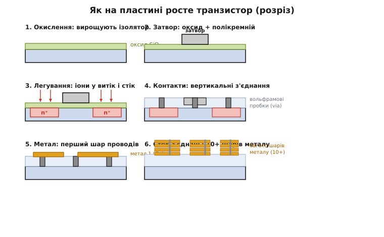
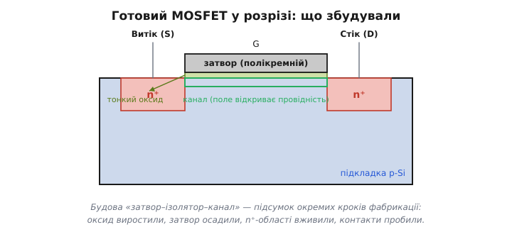
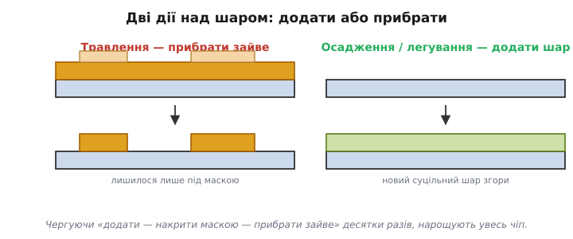

# Шар за шаром: легування, травлення, метал

Маска з фоторезисту, [надрукована фотолітографією](book:electronics/photolithography), сама собою нічого не робить — це лише трафарет. Справжній транзистор треба **збудувати** у самому кремнії й над ним: створити області з потрібним типом провідності, виростити ізолятор, покласти затвор, простягнути металеві дроти. І робиться це не за один прийом, а **шар за шаром** — десятками послідовних циклів, у кожному з яких фотолітографія наносить чергову маску, а тоді один фізичний крок щось **додає** або **прибирає** крізь відкриті місця цієї маски. Тут сходяться вся фізика напівпровідників — [легування кремнію](book:physics/doping) і [будова MOSFET](book:electronics/mosfet-structure) — і друк маски. Простежмо, як із порожньої пластини виростає працездатний транзистор.

### Три базові дії

Хоч кроків у реальному процесі сотні, усі вони — комбінації трьох елементарних дій над пластиною.


*Транзистор виростає в розрізі за кілька груп кроків. **Окислення**: на кремнії вирощують тонкий шар ізолятора SiO₂. **Затвор**: поверх оксиду осаджують і формують полікремнієвий затвор. **Легування**: крізь маску в кремній вживляють домішку, створюючи n⁺-області витоку й стоку. **Контакти**: крізь ізолятор пробивають вертикальні отвори й заповнюють металом (вольфрамові пробки). **Металізація**: зверху кладуть шар за шаром металеві дроти (мідь), з'єднуючи транзистори у схему, — у сучасних чипах таких шарів понад десяток.*

Придивіться до трьох дій, з яких усе складається. Перша — **додати шар** (осадження або вирощування): на поверхні нарощують плівку — оксид-ізолятор (вирощують, нагріваючи кремній у кисні), полікремній затвора чи метал (осаджують із газу або напиленням). Друга — **прибрати зайве** (травлення, *etch*, від германського кореня зі значенням «виїдати»): крізь відкриті місця маски витравлюють непотрібний матеріал — або «мокро» (хімічним розчином), або «сухо» (агресивною плазмою, що вибиває атоми). Третя — **змінити сам кремній** (легування, *doping*, від нідерл. *doop* — «домішка, підлива»): крізь маску в підкладку вганяють атоми домішки, перетворюючи відкриті ділянки на n- або p-тип.

Уся хитрість у тому, як ці три дії **спрямовують** — адже піч, пучок іонів і плазма діють на всю пластину однаково, без розбору, де треба, а де ні. Спрямованість дає саме [маска з резисту](book:electronics/photolithography): де вона відкриває кремній, дія спрацьовує; де закриває — ні. Маска перетворює «грубий» загальний вплив на **точно окреслений** локальний — рівно так, як трафарет перетворює суцільне фарбування на чіткий напис. Тож кожен повний цикл — це чотири такти: «нанесли резист → надрукували на ньому маску → виконали одну з трьох дій крізь відкриті вікна → змили резист». Один цикл додає чи змінює **один** шар майбутньої структури.

Повторивши такий цикл десятки (а на складних чипах — сотні) разів із різними масками, з пласкої пластини нарощують об'ємну тривимірну структуру — спершу самі транзистори в кремнії, потім багатоповерхову мережу дротів над ними. Порядок масок — це фактично «креслення» чипа, розкладене на шари: кожна маска — один поверх. Уявіть, що ви будуєте складний рельєф не різьбленням, а так: накладаєте трафарет, бризкаєте шар, знімаєте трафарет, накладаєте інший, додаєте наступний шар — і так сотні разів, доки з плоскої заготовки не виросте об'ємна конструкція. У цьому й суть **планарного процесу**, який Жан Ерні (*Jean Hoerni*) запропонував наприкінці 1950-х: чіп не збирають із готових деталей, як радіоприймач із окремих транзисторів, а **вирощують пошарово** на місці, як друкований багатошаровий рельєф. Саме це й зробило інтегральну схему можливою — і досі лишається серцем усієї технології.

### Як вживляють домішку

Зупинимося на легуванні — кроці, що перетворює інертний кремній на власне транзистор. Сама ідея проста: [додавши до кремнію домішку](book:physics/doping), донори (як-от фосфор чи миш'як), дістаємо n-тип (надлишок електронів), а додавши акцептори (бор) — p-тип (надлишок дірок). У виробництві це роблять **іонною імплантацією**: атоми домішки іонізують, розганяють у потужному електричному полі до великих швидкостей і буквально **вистрілюють** ними в пластину, як з мікроскопічної гармати. Там, де поверхню відкрито (маска прибрана), іони вганяються в кремній і застрягають у ньому на потрібній глибині; там, де її захищає товстий резист чи оксид, — застрягають у масці й кремнію не дістаються.

Чому саме «вистрілюють», а не просто «насипають»? Бо так можна **точно** керувати і кількістю, і глибиною. Кількість домішки задають **дозою** — скільки іонів пролетіло на квадратний сантиметр. А пучок іонів — це електричний струм, тож порахувати дозу можна просто з заряду, що пройшов: проінтегрувати струм у часі. Глибину ж задають **енергією** — швидші іони залітають глибше.

**Приклад (скільки тривати імплантації).** Треба вживити дозу Φ = 1·10¹⁵ іонів/см² бору (однозарядні, q = 1.6·10⁻¹⁹ Кл) у пластину 300 мм (площа A ≈ 707 см²) пучком струмом I = 5 мА. Скільки часу тримати пучок?

```
заряд на 1 іон   q = 1.6·10⁻¹⁹ Кл
іонів усього     N = Φ · A = 1·10¹⁵ · 707 = 7.07·10¹⁷
сумарний заряд   Q = N · q = 7.07·10¹⁷ · 1.6·10⁻¹⁹ ≈ 0.113 Кл
час              t = Q / I = 0.113 / 5·10⁻³ ≈ 22.6 с
```

Тобто дозу задає **лічильник заряду**, а не якесь хитре зважування: пропустили 0.113 кулона — отримали рівно стільки атомів, скільки треба, з точністю до часток відсотка. Саме тому імплантація витіснила старішу дифузію з печі: піч дає домішку «приблизно», а пучок — рахований до іона.

Та сам по собі влучний постріл ще не дає робочого транзистора. Іони, врізаючись у кристал, **розбивають** ґратку, а більшість вживлених атомів спершу застрягає не на вузлах, а між ними — електрично «німі». Тому пластину прогрівають (**відпал**, *anneal* — те саме слово, що про відпуск металу): жар дає атомам ґратки вкластися назад на місця, а домішкам — стати на вузли кристала й «увімкнутися» як донори чи акцептори. Так за один захід крізь потрібну маску створюють точно окреслені й точно дозовані області витоку й стоку — ті самі n⁺-зони обабіч затвора в [будові MOSFET](book:electronics/mosfet-structure). І ось де змикається [параноя щодо чистоти вихідного кремнію](book:electronics/silicon-monocrystal): концентрація корисної домішки тут — лічені атоми на мільйон-мільярд, тож якби вихідний кремній містив **стільки ж** випадкового бруду, він заглушив би сигнал. Чистота кремнію — це передумова того, щоб **навмисно** вживлені атоми визначали поведінку транзистора, а не випадкові чужинці. Дві теми — чистота сировини й точність легування — виявляються двома боками однієї медалі.

### Складаємо MOSFET

Зведімо кроки докупи й подивімося на готовий транзистор — той самий MOSFET, чию [внутрішню будову](book:electronics/mosfet-structure) тепер бачимо очима виробника.


*MOSFET як результат фабрикації. У p-підкладці — дві n⁺-області (**витік** і **стік**), вживлені імплантацією. Між ними — **канал**, накритий згори тонким **оксидом** (вирощеним окисленням) і **затвором** із полікремнію (осадженим і витравленим за формою). Трійця «затвор–ізолятор–канал» тут — прямий підсумок окремих кроків: оксид виростили, затвор поклали, n⁺-зони вживили, контакти пробили.*

Тепер видно, що будова MOSFET — це не довільна картинка з підручника, а **запис послідовності кроків** виробництва. Тонкий підзатворний оксид — результат акуратного окислення (його товщина в кілька атомів критична: тонший — сильніше керує каналом, але легше пробивається полем; саме межа цього оксиду колись і поставила одну з фізичних стін [масштабування процесу](book:electronics/process-node)). Затвор — осаджений і витравлений за рисунком полікремній (історично саме він дав вислів «кремнієвий затвор», хоч у найновіших чипах метал повернувся, бо полікремній на крихітних розмірах став заважати). Витік і стік — вживлені імплантацією n⁺-області. А канал між ними — це просто ділянка підкладки під затвором, провідністю якої затвор [керує полем через порогову напругу](book:electronics/mosfet-threshold).

Тут є один момент, що часто дивує. Мільярди таких структур друкують на пластині **одночасно**, тим самим набором масок: один комплект трафаретів описує весь процесор, і кожен його транзистор виходить за ті самі спільні кроки, що й сусід. Виробництво не «викладає» транзистори по одному — воно проявляє відразу **всю** картину кожного шару, як фотографія проявляє весь кадр разом, а не піксель за пікселем. Ось чому додати в чіп ще мільйон транзисторів майже нічого не коштує: вони народжуються тим самим друком, тими самими печами й тією самою імплантацією, що й решта. Дорого коштує **процес** і **площа**, яку схема займе, а не кількість приладів сама собою. Це — фундаментальна економіка інтегральної схеми, і саме вона дала змогу класти на чіп спершу тисячі, потім мільйони, а тепер мільярди транзисторів, не роздуваючи ціну пропорційно.

### Додати чи прибрати

Корисно ще раз поглянути на дві протилежні за напрямком дії — бо саме їх чергуванням і нарощують усю структуру.


*Дві дії над шаром. **Травлення** (субтрактивне): шар уже є, маска захищає потрібне, а відкрите — витравлюють; лишається матеріал лише під маскою. **Осадження/легування** (адитивне): на поверхню кладуть новий суцільний шар або вживляють домішку крізь вікна маски. Чергуючи «додати — накрити маскою — прибрати зайве» десятки разів, нарощують увесь чіп пошарово.*

Уся фабрикація — це ритмічне чергування цих двох жестів. Хочемо вузькі металеві доріжки — кладемо суцільний шар металу (додали), накриваємо маскою у формі доріжок і витравлюємо проміжки (прибрали). Хочемо контактні отвори крізь ізолятор — навпаки, маска відкриває лише точки майбутніх отворів, які й протравлюють наскрізь, а тоді заповнюють металом (знову додали). У найновіших процесах мідні дроти роблять навіть «у зворотному порядку» — спершу травлять у ізоляторі канавки, а потім заповнюють їх міддю й зчищають надлишок. Цей хід звуть **дамасценним процесом** (*damascene*, від назви міста Дамаск і старовинної техніки damascening — інкрустації золота чи срібла в темну сталь): метал утоплюють у заздалегідь вирізані канавки точнісінько так, як майстер утоплював коштовний дріт у борозни на клинку. Чому саме «навиворіт»? Бо мідь складно травити прямо — летких сполук вона майже не дає, тож замість «покласти суцільно й вигризти зайве» простіше «вирити рівчак і залити».

Над транзисторами так вибудовують **багатоповерхову розв'язку** з дротів — цей етап і звуть **металізацією** (*metallization*, від лат. *metallum* — метал): у сучасному процесорі понад десяток шарів металу, з'єднаних між собою вертикальними «пробками» (via), несуть сигнали й живлення до мільярдів транзисторів — як багатоповерхова транспортна розв'язка над містом, де нижні вузькі «вулиці» ведуть до окремих транзисторів, а верхні широкі «магістралі» розносять живлення по всьому кристалу. Ця мережа з'єднань за обсягом роботи й складністю не поступається самим транзисторам, а часом і перевершує їх: значну частину площі й шарів чипа займає саме «дротяна» частина, а не активні прилади.

Є тут і прихована умова, що зв'язує весь процес, — **тепловий бюджет**. Ранні кроки (окислення, відпал легування) вимагають високих температур, а от коли вже покладено метал, сильно гріти не можна — мідь і алюміній попливуть, а дбайливо вживлені домішки розповзуться, розмивши тонко окреслені області. Тому кроки шикують у строгому порядку: спершу все «гаряче» (транзистори в кремнії), потім усе «холодне» (метал згори). Порушити цей порядок не можна — звідси й жорстка послідовність шарів, де кожен наступний крок мусить терпіти менше тепла за попередній.

Окрема краса в тому, як ці сотні кроків узгоджені між собою. Кожна маска мусить лягти точно поверх попередніх — із похибкою в частки нанометра, інакше контакт промахнеться повз область, до якої веде. Це суміщення (*overlay*) — окреме мистецтво: машина орієнтується по спеціальних мітках, залишених попередніми шарами, і вирівнює новий малюнок по них. Уявіть сотню трафаретів, накладених один на одного так точно, що навіть під мікроскопом їхні краї збігаються, — і ви відчуєте, чому виробництво чипів недарма вважають вершиною точної інженерії. Підсумок простий і потужний: чіп **вирощують**, а не складають, — пошарово, друком, у точно заданому температурному порядку й з ідеальним суміщенням шарів, цілою пластиною за раз; і саме тому окремий транзистор практично безплатний, а от увесь процес — ні.

> 🔧 **Навіщо це.** Цей погляд «зсередини» прибирає містику з кількох речей, з якими ви стикаєтесь. Перше: ви розумієте, чому **схему чипа не можна «трохи підправити»** після випуску — будь-яка зміна означає новий комплект масок і фактично новий запуск виробництва; звідси дорожнеча помилок у кремнії й саме явище ревізій кристала. Друге: **кількість транзисторів майже не впливає на собівартість** (усі друкуються разом), а от **площа кристала** впливає прямо — бо визначає, скільки штук влізе на пластину й [наскільки ймовірний дефект](book:electronics/yield). Третє, концептуальне: усе «залізо», яке ви програмуєте, — це **застиглий результат послідовності фізичних кроків**, а не магія; той самий [MOSFET](book:electronics/mosfet-structure) і той самий [p-n-перехід](book:physics/pn-junction) буквально вирощені на пластині описаними діями. Засвоївши це, ви читатимете будь-який опис техпроцесу як інженер, а не як споживач реклами.
