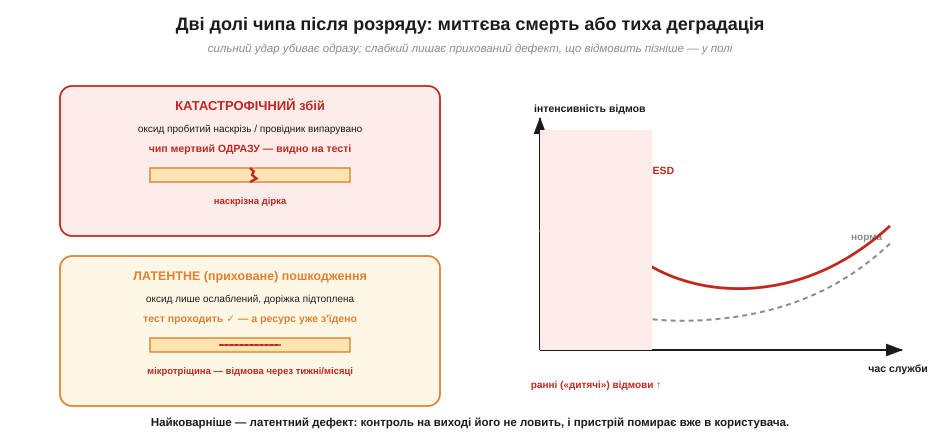

# Чому мікросхеми вмирають тихо: приховані ESD-пошкодження

Варто з'єднати дві відомі з фізики статики речі — що [тіло носить кіловольти](topic:physics/body-charge), а [розряд пробиває проміжки](topic:physics/air-breakdown) — з мікросхемою, і стає видно, чому **електростатичний розряд** (*ESD, electrostatic discharge*) — головний невидимий убивця електроніки. Найковарніше тут не те, що чип іноді гине одразу. Найгірше — що часто він **не гине одразу**, а лишається з прихованим пошкодженням і відмовляє пізніше: на тесті, у замовника, у польоті. Така «тиха смерть» руйнує довіру до пристрою сильніше за будь-яку явну поломку, бо її майже неможливо ні відтворити, ні відстежити.

### Чому чип такий тендітний: ізолятор завтовшки в нанометри

Щоб зрозуміти вразливість, треба заглянути всередину. Сучасний транзистор у мікросхемі керується **затвором** (*gate*), відділеним від кремнію тоненьким шаром ізолятора — **підзатворним оксидом**. І цей шар неймовірно тонкий: лічені нанометри, тобто **десятки атомних шарів**.


*Підзатворний оксид сучасного транзистора — лише 2–10 нм, кілька десятків шарів атомів. Поле пробою в оксиді приблизно того ж порядку, що й «вольт на товщину» деінде, але товщина в нанометрах означає, що небезпечними стають уже одиниці вольтів: 5 нм пробиває приблизно 5 В, тоді як тіло несе тисячі.*

Тут спрацьовує проста, але немилосердна арифметика поля. Пробій ізолятора визначається не напругою як такою, а **полем** — напругою, поділеною на товщину (вольт на метр). [Повітря пробивається](topic:physics/air-breakdown) при ~3 кВ/мм. Тверді ізолятори тримають більше, але не безмежно. І коли товщина оксиду — нанометри, навіть кілька вольтів дають усередині нього колосальне поле. Ось чому затвор польового транзистора — один із найтендітніших елементів: його тоненький оксид пробивається напругою, якої людина абсолютно не помічає — тією самою [сліпою зоною людського відчуття](topic:physics/body-charge), де тіло вже несе сотні вольтів, а ми нічого не чуємо.

Чому ж пробій оксиду такий **остаточний**, чому він не «відпускає», коли напруга спадає, як відпускає повітря після іскри? Бо в твердому ізоляторі пробій лишає по собі **фізичний слід**. У повітрі після розряду молекули знову розлітаються, іони рекомбінують, і проміжок відновлює ізоляцію. А в оксиді пробійний канал — це вже змінена речовина: локально перегріта, з провідною ниточкою з дефектів, інколи з домішкою матеріалу затвора, втопленого вглиб. Цей канал нікуди не зникає; він лишається провідним містком, що замикає затвор на канал транзистора. Тому пробій оксиду — **незворотний**: одна подія, і структура зіпсована назавжди. Ба більше, через цей канал тепер тече струм, що гріє його ще дужче, — пошкодження схильне **розростатись само** (теплова втеча), перетворюючи мікроскопічну ниточку на велику дірку.

Пробій оксиду — не єдиний механізм. Розряд може й **розплавити** тонесенькі металеві доріжки чи контакти всередині кристала: струм іскри хоч і короткий, але дуже інтенсивний, а провідники мікроскопічні. Може й **спекти** [p-n переходи](topic:physics/pn-junction) на вході. Та незалежно від конкретного механізму, суть одна: енергії навіть **крихітного** розряду досить, щоб локально зруйнувати наноструктуру.

**Приклад (яке поле дає 200 В на оксиді 5 нм).** Уяви слабкий розряд, що навів лише 200 В на затворі з оксидом 5 нм. Яке поле в оксиді?

```
E = V / d
E = 200 В / (5 × 10⁻⁹ м)
E = 4 × 10¹⁰ В/м = 40 ГВ/м
```

Сорок гігавольтів на метр — це в **тисячі разів** більше за поле пробою повітря (3 МВ/м). Жоден тонкий оксид такого не витримає. І зверни увагу: 200 В — це напруга, якої людина не відчула б навіть зблизька.

Може здатися, що для руйнування потрібна велика енергія — адже ми звикли, що «спалити» щось коштує дорого. Та насправді все навпаки: енергії в розряді тіла **мізерно мало** за побутовими мірками, а шкодить вона саме тому, що вкладається в **мікроскопічний** об'єм за **наносекунди**. Прикиньмо порядок.

**Приклад (скільки енергії в розряді тіла й чому цього досить).** Тіло-конденсатор C = 100 пФ заряджене до V = 2 кВ. Скільки енергії звільнить розряд? (Скористаємось формулою [енергії конденсатора](topic:electronics/capacitor-energy) W = ½·C·V².)

```
W = ½ · C · V²
W = ½ · (100 × 10⁻¹²) · (2000)²
W = ½ · (100 × 10⁻¹²) · (4 × 10⁶)
W = ½ · 4 × 10⁻⁴
W = 2 × 10⁻⁴ Дж = 0.2 мДж
```

Лише дві десятих міліджоуля — це менше, ніж віддає падіння канцелярської скріпки з висоти столу. За мірками побуту — ніщо. Але вся ця енергія вивільняється за наносекунди в пляму завбільшки з мікрон на краю чипа — і там вона перетворюється на локальний нагрів у тисячі градусів, якого досить, щоб розплавити доріжку чи пробити оксид. Руйнує не кількість енергії, а її **концентрація** в часі й просторі. (Скільки саме мікроджоулів потрібно різним структурам і як це рахують точніше — вставка 🧮 [Енергія іскри](topic:electronics/esd-damage/math-spark-energy.md).)

Тут варто додати тривожну тенденцію. Що дрібнішим стає транзистор (а технології весь час «зменшуються»), то **тоншим** робиться оксид і **меншими** — структури, що відводять тепло й струм. А отже, кожне нове покоління чипів за інших рівних **вразливіше** до ESD: той самий розряд, що ледь дряпав товсту стару логіку, наскрізь пробиває тонкий сучасний оксид. Тому ESD-дисципліна з роками не слабшає, а навпаки — стає критичнішою: ми працюємо з дедалі тендітнішою «начинкою». Заспокійливе «раніше ж паяли без браслетів і нічого» не працює: раніше й оксиди були в рази товстіші, а входи — грубіші. Сучасний чутливий компонент пробачає куди менше.

Зробимо ще один наочний підрахунок, щоб відчути цю тендітність числом. Порівняймо «бюджет напруги» товстого й тонкого оксиду за одного й того самого поля пробою (візьмемо для оксиду орієнтовно ~10⁹ В/м):

```
тонкий оксид сучасного чипа:   d ≈ 3 нм
  V_проб ≈ E · d ≈ 10⁹ В/м × 3×10⁻⁹ м ≈ 3 В

товстіший оксид старішого:     d ≈ 30 нм
  V_проб ≈ 10⁹ В/м × 30×10⁻⁹ м ≈ 30 В
```

Десятикратне стоншення оксиду — десятикратне падіння безпечної напруги: з ~30 В до ~3 В. Обидва числа мізерні проти кіловольтів тіла, але різниця показова: новіший чип «здувається» від удесятеро меншого збурення. Ось чому не можна переносити старі звички на сучасні компоненти.

### Дві долі чипа: катастрофа або латентне пошкодження

Тепер головне — **що буває** після того, як розряд проскочив. Доль рівно дві, і друга набагато підступніша за першу.


*Сильний розряд дає **катастрофічний** збій: оксид пробитий наскрізь або доріжка випарувана — чип мертвий одразу, і це видно на тесті. Слабший розряд лишає **латентне** (приховане) пошкодження: оксид лише ослаблений, тест проходить ✓, але ресурс уже з'їдено. Праворуч — крива інтенсивності відмов у часі: латентні дефекти піднімають частку ранніх («дитячих») відмов.*

Перша доля — **катастрофічний збій** (*catastrophic failure*). Розряд був сильний, пробій наскрізний, доріжка перегоріла. Чип мертвий **одразу**: не вмикається, коротить, поводиться явно неправильно. Це, як не дивно, **найкращий** із поганих сценаріїв — бо проблему видно негайно, дефектний виріб не вийде за двері, і ти знаєш, що сталося.

Друга доля — **латентне пошкодження** (*latent damage*, приховане). Розряд був слабкий — десь у тій самій сліпій зоні. Він не пробив оксид наскрізь, а лише **ослабив** його: створив мікроскопічну провідну ниточку, тоненьку тріщину, локальний дефект. Чип після цього **працює** і **проходить усі тести на виході**. Але всередині він уже поранений. Дефект із часом росте — під робочою напругою, від нагріву, від циклів увімкнення — аж поки одного дня не доросте до повного пробою. І тоді пристрій відмовляє: у замовника через місяць, у приладі в полі, у найгірший момент. Відтворити це майже неможливо, бо зовні нічого не передвіщало біди.

Чому ослаблений оксид «доростає» до пробою сам? Бо крізь тоненьку провідну ниточку, що лишив розряд, тепер постійно протікає невеликий струм витоку. Він помалу гріє й розширює дефект, той пропускає більший струм, гріється ще дужче — і так місяцями, аж поки канал не доросте до повного замикання. Виходить **повільна версія** тієї самої теплової втечі, що в катастрофі діє за наносекунди. Робоча напруга, перепади температури, цикли ввімкнення-вимкнення — усе це підштовхує процес. Тому латентний дефект — це не «майже ціло», а **закладена міна**: пристрій працює рівно доти, доки міна не дозріє.

Заради повноти варто назвати й третій, м'якший наслідок — **збій без поломки** (*upset*). Іноді розряд не руйнує нічого фізично, а лише наводить перешкоду, від якої логіка «спотикається»: чип зависає, скидається, плутає біт. Після перезавантаження він знову справний — заліза не зачеплено, постраждала тільки робота в ту мить. Головні все ж перші дві долі (вони про **загибель** компонента), але корисно знати, що ESD буває й причиною загадкових збоїв цілком живого пристрою, а не лише його смерті.

### Що вразливіше за все і чому не рятує вбудований захист

Не всі виводи однаково тендітні. Найвразливіші — ті, що ведуть **просто на тонкий оксид затвора**: входи КМОН-логіки, затвори польових транзисторів, високочастотні входи (там захист мусить бути малим, щоб не псувати сигнал). На шкалі чутливості ці входи стоять найнижче, гинучи від десятків вольтів — тобто від рівнів, [які тіло набирає](topic:physics/body-charge) геть непомітно для людини. Менш вразливі — виводи, за якими стоять міцніші структури: силові ноги, виходи з товстими транзисторами. Тому, працюючи з платою, особливо бережуть **сигнальні входи** й роз'єми, що ведуть прямо в чутливі чипи.

Виникає природне питання: але ж виробники вбудовують у входи **захисні структури** (діоди до шин живлення, що відводять надлишок). Хіба вони не рятують? Рятують — частково, і саме тому компоненти витримують хоч щось, а не гинуть від кожного дотику. Але цей вбудований захист розрахований на **обмежені** рівні (стандартну модель розряду [зарядженого тіла](topic:physics/body-charge), певні кіловольти) і має свою межу. Сильніший чи невдало прикладений розряд його перевершує. Гірше: сам захисний елемент теж може дістати латентне пошкодження — і тоді він тихо слабшає, лишаючись на вигляд справним, а наступний розряд уже проходить глибше. Тому вбудований захист — це **остання лінія**, а не дозвіл нехтувати рештою: він рятує від випадкового недогляду, але не заміняє браслет, мат і пакування.

Звідси й чесна відповідь на спокусливе «та на платі ж є захист, навіщо ці церемонії». Захист на платі бореться з тим, що **вже сталося**, і в межах свого запасу. Браслет і пакування борються з тим, щоб розряд **не стався взагалі**. Це різні рубежі, і покладатись лише на останній — означає весь час випробовувати його межу й накопичувати латентні дефекти в самому захисті. Надійність дає лише сукупність рубежів, а не один із них.

### Чому латентні відмови такі дорогі

Крива інтенсивності відмов у часі (інженери звуть її «ванною») допомагає відчути ціну латентності. У нормі вона має невеликий горб ранніх, «дитячих» відмов, довге пласке дно надійної служби й підйом наприкінці ресурсу. Латентні ESD-дефекти **піднімають передню частину** цієї кривої: пристроїв, що відмовляють у перші тижні-місяці, стає більше. Для виробника це прямі збитки — гарантійні заміни, репутація, відкликання партій, — і все через розряд, якого ніхто не відчув на складанні.

Саме тому ESD-захист — це не «педантизм», а економіка надійності. Один непомічений дотик голим пальцем до виводу може не вбити плату на столі, але закласти в неї міну сповільненої дії. І ось чому стандарти випробувань на стійкість до ESD такі суворі: пристрої навмисно «б'ють» каліброваними розрядами, щоб виявити слабкі місця **до** того, як це зробить життя (про методику — вставка 🔌 [ESD-симулятор і рівні IEC 61000-4-2](topic:electronics/esd-damage/comp-esd-gun.md)).

Варто відчути й **масштаб** цієї економіки. Компонент, убитий на столі, коштує копійки — його просто замінюють. Той самий компонент із латентним дефектом, що відмовив у зібраному пристрої в замовника, коштує вже на порядки більше: виїзд, діагностика, демонтаж, репутаційні втрати, а в критичному застосуванні (медицина, авіоніка, борт апарата) — потенційно й безпека. Вартість відмови **росте** з кожним етапом, на якому її не зловили: дешево на вході, дорого в полі. Тому ESD-дисципліна на складанні — це не витрата, а **дешеве страхування** від набагато дорожчих відмов потім. Кожен браслет і пакет окупається тим, що ловить проблему на найдешевшому етапі — поки компонент іще на столі, а не в руках користувача.

> 🔧 **Навіщо це.** Латентність повністю перевертає логіку роботи. Не можна міркувати «плата ж працює — значить, я нічого не зіпсував». Працює — ще не значить ціла. Тому ESD-дисципліну дотримують **завжди й до кінця**, навіть коли «нічого ж не сталося»: бо те, що сталося, могло й не проявитись одразу. Це той рідкісний випадок, коли відсутність видимого результату нічого не доводить — і саме тому профілактика безальтернативна.

Звідси й головне про ESD-пошкодження: чипи тендітні через **нанометрові ізолятори**, що пробиваються одиницями вольтів; розряд або вбиває чип **одразу** (катастрофа — її видно), або лишає **латентний** дефект, який тест пропускає, а пристрій відмовляє пізніше. Друге — найдорожче й найпідступніше. Висновок очевидний: статику треба не «ловити», а **не давати їй виникнути й накопичитись** — для чого й існують [антистатичне робоче місце](topic:electronics/antistatic-workplace) та [захисне пакування компонентів](topic:electronics/esd-packaging).

---
