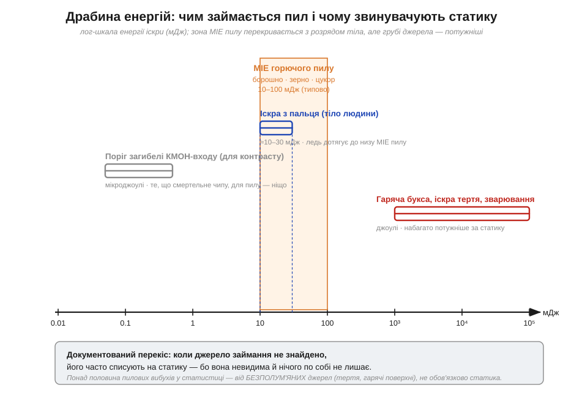
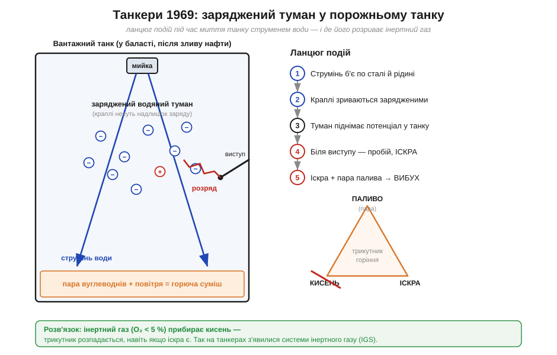

# 📜 Коли невидима іскра вбиває: статика як джерело займання

> Та сама невидима іскра, що беззвучно нищить [транзистор у мікросхемі](book:electronics/esd-damage), не лишаючи сліду, здатна на більше: за певних умов вона підпалює хмару пилу, пару розчинника чи вуглеводнів — і тоді гине вже не мікросхема, а будівля чи корабель. Це історія не про один винахід, а про **довге з'ясування**: чи справді статика винна там, де гримить, — і де ця підозра обґрунтована, а де лише зручна, бо іскри ніхто не бачив.

Зробимо застереження від початку, бо воно — серцевина цієї історії. Статичний розряд (*electrostatic discharge*, ESD) — джерело займання **реальне**, та водночас **найпідступніше для слідчого**. Він невидимий, триває мікросекунди й нічого по собі не лишає: ні обгорілого дроту, ні розплавленого контакту. Тому, коли після вибуху причину знайти не вдається, її **часто складають саме на статику** — не тому, що довели, а тому, що більше нема на що вказати. Ця спокуса супроводжує всю тему, і чесна історія мусить раз у раз питати: це встановлений факт чи здогад за браком кращого?

---

## Чому взагалі іскра здатна підпалити: трохи енергії

Почнімо з чисел, бо без них уся розмова перетворюється на страшилки. [Енергія розряду](book:electronics/esd-damage/math-spark-energy.md) дорівнює ½·C·V²: тіло людини (модель HBM — приблизно 100 пФ, заряджене до кількох кіловольтів) накопичує **десятки міліджоулів**. Для тонкого затвора КМОН-транзистора це смертельна доза; та чи досить її, щоб підпалити щось у повітрі?

Тут вступає поняття, яке інженер з вибухобезпеки знає напам'ять, — **мінімальна енергія займання** (*minimum ignition energy*, MIE): найменша енергія іскри, що здатна підпалити дану горючу суміш. І виявляється, що різні палива розташовані на дуже широкій драбині:

```
Пара водню в повітрі         MIE ≈ 0.02 мДж     ← мізерія, спалахує від чого завгодно
Пари бензину, розчинників    MIE ≈ 0.2–0.3 мДж  ← легко
Горючий пил (борошно, зерно) MIE ≈ 10–100 мДж   ← треба ПОМІТНА іскра
Іскра з пальця людини        ≈ 10–30 мДж        ← ледь дотягує до низу «пилового» діапазону
```


*Лог-шкала енергії іскри. Розряд людського тіла (≈10–30 мДж, синій) ледь сягає нижнього краю діапазону MIE горючого пилу (10–100 мДж, помаранчева зона) — тобто статика теоретично може підпалити пил, але це межовий випадок. Грубі механічні джерела (гаряча букса, іскра тертя, зварювання) несуть **джоулі** — на три-чотири порядки більше, тож вони куди ймовірніша причина. Те, що смертельне для КМОН-входу (мікроджоулі), для пилу — ніщо.*

Висновок із цієї картинки — ключ до всієї історії. Пари легких розчинників і газів спалахнути від статики **дуже** легко: їхня MIE у сотні разів менша за енергію, яку носить людина. А от горючий пил — випадок **межовий**: його MIE (десятки міліджоулів) лежить на самому краю того, що дає розряд тіла. Підпалити пил статикою **можливо**, але це не «само собою зрозуміло» — потрібен досить потужний розряд саме в момент, коли хмара має правильну концентрацію. Натомість гаряча букса конвеєра чи іскра від удару металу об метал несуть на порядки більше енергії. Тому, забігаючи наперед: для **парів** провина статики правдоподібна, а для **пилу** — її треба доводити, а не припускати.

> 🔧 **Навіщо це.** Та сама MIE визначає, наскільки серйозно ставитися до антистатики в реальній роботі. Паяльна станція з ізопропанолом для відмивання плат, балончик флюсу-розчинника, бак із розчинником у майстерні — це пари з MIE часток міліджоуля, які підпалить будь-яка іскра, у тому числі з вашого пальця. Звідси вимога заземлення й вентиляції там, де є леткі розчинники, — не бюрократія, а прямий наслідок цих чисел.

---

## Найчистіший випадок: операційна, що могла вибухнути

Якщо шукати приклад, де провина статики **доведена й безсумнівна**, найкращий — не завод, а операційна зала першої половини XX століття. Звучить дивовижно, але десятиліттями хірургія була буквально вибухонебезпечним ремеслом.

Причина — наркоз. Перший інгаляційний анестетик, **діетиловий ефір** (*diethyl ether*), увійшов у практику ще 1846 року; за ним прийшли **етилен** (*ethylene*, 1923) і **циклопропан** (*cyclopropane*, 1932). Усі троє чудово присипляли пацієнта — і всі троє були **горючі**, а в суміші з киснем чи закисом азоту давали атмосферу, що спалахувала від найменшої іскри (їхня MIE — частки міліджоуля, той самий «легкий» край драбини). Пацієнт дихав цією сумішшю, вона збиралася низько над підлогою, бо важча за повітря, — і операційна перетворювалася на наповнену горючим газом кімнату, де працювали люди, апарати й електрика.

А звідки іскра? Ось де статика виходить на сцену незаперечно. Персонал у гумовому взутті ходив по підлозі, пацієнта возили на каталці, простирадла терлися — і кожен накопичував заряд на кілька кіловольтів. Один дотик до металевого штатива — і **розряд із пальця** (ті самі десятки міліджоулів, що смертельні чипу) підпалював наркозну суміш. Документовані вибухи в операційних коштували життя й пацієнтам, і лікарям.

Реакція медицини стала, по суті, **першою у світі системною антистатичною інженерією** — задовго до того, як з'явилися чутливі мікросхеми, які теж довелося рятувати від статики:

```
Провідна підлога        — з кінця 1920-х: спершу плитка терацо в заземленій
                          сітці латунних смужок, з 1940-х — провідний полімер.
                          Заряд стікає в землю, не встигнувши накопичитися.
Ланцюжки й дроти        — приблизно 1930–1950-ті: пацієнт, апаратура,
                          анестезіолог з'єднані між собою й із підлогою —
                          щоб не було різниці потенціалів, нічому розряджатися.
Вологість 60 %          — вологе повітря робить поверхні трохи провідними,
                          і заряд розходиться, замість накопичуватися.
Провідне взуття й гума  — щоб людина теж була «заземлена» через підлогу.
```

Зверніть увагу, наскільки це **ті самі ідеї**, що захищають електроніку на [антистатичному робочому місці](book:electronics/antistatic-workplace) і через [контроль вологості](book:physics/humidity-static-control): заземлити все через помірний опір, зрівняти потенціали, підняти вологість. Операційна XX століття вже знала цей рецепт — тільки рятувала не транзистори, а життя.

> 🔧 **Навіщо це.** Це історичний доказ, що антистатичні правила робочого місця — не вигадка виробників браслетів. Коли ціна іскри була людським життям, медицина незалежно винайшла рівно той самий набір заходів: провідна підлога, зрівнювання потенціалів, контроль вологості. Якщо ці заходи рятували людей у горючій атмосфері, то вберегти від статики чутливий чип вони здатні й поготів.

Цікавий і **фінал** цієї історії: вибухонебезпечні анестетики поступово вийшли з ужитку (їх витіснив негорючий галотан та його наступники з 1950-х), і потреба в провідних підлогах операційних відпала майже сама. Сьогодні їх там майже не кладуть — бо зник горючий газ, а не тому, що статика стала безпечнішою. Загроза щезла разом із паливом — найнадійніший спосіб розірвати трикутник горіння.

---

## Три танкери за грудень: вибухи, що породили інертний газ

Другий випадок, де провина статики встановлена, — драматичний і масштабний. Грудень 1969 року, **три гігантські танкери** (*very large crude carrier*, VLCC) злетіли в повітря майже один за одним.

Перший — **«Marpessa»**, новий танкер дедвейтом близько 207 000 тонн, у своєму **першому рейсі**: 14 грудня 1969-го вибух розпанахав корпус, загинуло двоє членів екіпажу, і судно затонуло за кілька десятків миль від західного узбережжя Африки — на той час **найбільший корабель, що будь-коли йшов на дно**. Приблизно за два тижні вибухнув його однотипний побратим **«Mactra»** — теж із загиблими, але встояв на воді. А наступного дня — третій VLCC, **«Kong Haakon VII»** (не судно компанії Shell, але дуже схожої конструкції). Три однотипні гіганти за один місяць — це вже не випадковість, а закономірність.

Що спільного? Усі три **мили вантажні танки** в момент вибуху. Після зливу нафти порожній танк не порожній по-справжньому: у ньому лишається **пара вуглеводнів** у суміші з повітрям — готова горюча атмосфера. Танки відмивали потужними обертовими водяними гарматами під високим тиском. І ось тут спрацював фізичний механізм, який доти недооцінювали.


*Ланцюг подій у танку. Струмінь води під тиском б'є по сталі й залишках рідини — і краплі **зриваються зарядженими** (туман несе надлишок заряду). Заряджений туман піднімає потенціал усередині танку; біля будь-якого виступу конструкції поле сягає пробою — і проскакує **іскра**. Іскра плюс пара палива = вибух. Розв'язок (праворуч): заповнити танк **інертним газом** з вмістом кисню нижче ~5 % — тоді з трикутника горіння зникає кисень, і вибуху нема, навіть якщо іскра є.*

Дворічне розслідування встановило **найімовірнішу** причину: електростатичні розряди в газовому просторі танку, породжені самим миттям. Зверніть увагу на формулювання — «найімовірніша», а не «доведена до останнього розряду». Точно зафіксувати ту іскру в зруйнованому танку неможливо в принципі (вона невидима й нічого не лишає — повертаємося до нашого застереження). Та сукупність доказів була переконлива: три однакові судна, однакова операція, відтворюваний у лабораторії механізм заряджання водяного туману. Це той випадок, коли підозра на статику спирається на фізику й повторюваність, а не лише на брак інших підозрюваних.

Механізм заряджання варто пояснити, бо він не очевидний. Коли струмінь під тиском дробиться об сталь і об рідину на дрібні краплі, ці краплі **зриваються електрично зарядженими** — як і будь-яке розділення речовин при контакті й розриві ([трибоелектрика](book:physics/triboelectricity), лише в «мокрому» виконанні; споріднений ефект помітний і в брижах водоспаду). Хмара зарядженого туману заповнює танк, її сумарний заряд піднімає потенціал, і десь біля гострого виступу конструкції поле перевищує [пробивне](book:physics/air-breakdown) (≈3 кВ/мм) — проскакує розряд. Якщо в нафті була ще й вода, ефект сильнішає; саме тому одне з пізніших правил — не мити танк нафтою, що містить воду.

Наслідок цієї трагедії змінив усе світове судноплавство: масово запровадили **системи інертного газу** (*inert gas system*, IGS). Ідея елегантна й б'є точно в фізику горіння. Замість боротися з кожною можливою іскрою — а їх не злічити — прибрали **кисень**. Танк заповнюють відпрацьованими димовими газами (де кисню менш як 5 %), і горюча суміш просто не може спалахнути: у трикутнику «паливо — кисень — джерело займання» бракує однієї сторони. Іскра хай навіть проскочить — підпалювати нічого.

> 🔧 **Навіщо це.** Це чистий приклад інженерного мислення, корисний далеко за межами танкерів. Коли джерело загрози невидиме, численне й погано контрольоване (тут — статичні розряди), часто розумніше **прибрати не іскру, а одну з інших сторін трикутника горіння** — пальне або кисень. Та сама логіка працює і в електроніці: замість ловити кожен розряд, ми робимо вузол **нечутливим** до нього (захисні діоди на входах) — прибираємо не іскру, а її здатність нашкодити.

---

## А ось де підозра часто хибна: пил у млинах та елеваторах

Тепер — найважливіша й найделікатніша частина, заради якої й варто було все це писати. Пилові вибухи в зерносховищах і млинах — катастрофи давні, страшні й добре відомі. І саме тут підозра на статику найчастіше **необґрунтована**, хоча звучить вона повсюди.

Розділення речовин при терті заряджає не лише гуму чи синтетику — заряджається й сам пил, що тече трубами та сиплеться в бункери. Тож на перший погляд логічно: пил наелектризувався, проскочила іскра, хмара спалахнула. Проблема в тому, що MIE горючого пилу — десятки міліджоулів, на самому **верхньому** краю того, що дає звичайний статичний розряд. Підпалити пилову хмару статикою важче, ніж пару розчинника, **на порядки**.

А поряд стоять куди потужніші підозрювані. Подивімося на типову розслідувану причину пилового вибуху:

```
Гаряча букса / підшипник   — перегрітий від тертя вузол конвеєра чи елеватора;
                             сягає сотень °C — і підпалює пил теплом, без іскри.
Іскра тертя (метал-метал)   — болт чи камінь б'є об сталевий кожух елеватора —
                             механічна іскра несе ДЖОУЛІ.
Тління, самозаймання        — підмочене зерно гріється зсередини й тліє.
Зварювання, ремонт, куріння — відкрите полум'я й розжарені краплі металу.
Статичний розряд            — ✱ можливий, але межовий і важко доказовий.
```

Кожне з цих джерел несе **на порядки більше** енергії, ніж статичний розряд, і кожне лишає хоч якийсь слід. Тому в сучасній статистиці провідні задокументовані причини пилових вибухів — це **механічні іскри, гарячі поверхні й тління**, а не статика. У зведеннях фігурує промовиста цифра: понад половину пилових вибухів спричиняють **безполум'яні** джерела — нагрів від тертя й гарячі поверхні, — і це переважно не статичний розряд. Статику вписують у звіт переважно тоді, **коли іншого джерела не знайшли** — а в розтрощеному вибухом елеваторі його часто й неможливо знайти.

Звідси випливає прохання до самої історії — **не творити міфів**. Класичні, хрестоматійні катастрофи цього ряду статиці **не приписують**:

- **Турин, 1785** — перший науково описаний пиловий вибух (борошняний склад, спостереження графа Мороццо, *Count Morozzo*). Причина за самим описом — **відкрите полум'я лампи** й дуже сухе борошно, яке збив у хмару хлопець-працівник. Жодної статики; та її тоді ще й не вміли б запідозрити.
- **Млин «Washburn A», Міннеаполіс, 1878** — гігантський вибух борошняного пилу зруйнував найбільший млин міста, загинуло 18 людей. Конкретне джерело займання історія **не зафіксувала** певно (традиційно думають на іскру в жорнах чи механізмі); статиці його не атрибутують.

Тож коли почуєте впевнене «елеватори вибухали від статики», варто перепитати: а звідки відомо? У конкретних розслідуваних випадках статика буває однією з можливих версій, але **рідко доведеною головною причиною** — і майже ніколи в тих гучних історичних катастрофах, які люблять переказувати. Це той випадок, коли невидимість розряду грає з нами злий жарт: відсутність сліду перетворюють на доказ, хоча вона нічого не доводить.

> 🔧 **Навіщо це.** Урок для інженера ширший за пил. Якщо щось згоріло, а очевидної причини нема, «це, мабуть, статика» — найзручніша, але й найлінивіша гіпотеза, бо її **нічим не спростувати**: розряд не лишає слідів. Хороший розбір відмови шукає **позитивні** докази (обгорілий вузол, перегрітий підшипник, слід дуги), а не задовольняється підозрюваним, чия єдина «перевага» — що він невидимий. Та сама дисципліна знадобиться, коли розбиратимете, чому «сам собою» помер мікроконтролер на платі.

---

## Що з усього цього винести

Зведімо три випадки в одну думку — бо саме контраст між ними і є висновком:

- **Пари (розчинники, наркозні гази, вуглеводні)** — статика підпалює їх **легко й доведено**: їхня MIE мізерна. Операційні XX століття й танкери 1969-го — настільні приклади, де провина статики встановлена фізикою й повторюваністю, а не здогадом.
- **Пил (борошно, зерно, цукор)** — статика **можлива, але межова й рідко доказова** причина; куди ймовірніші тертя, гарячі поверхні, механічні іскри. Класичні катастрофи (Турин 1785, Washburn 1878) статиці **не приписують** — і ми теж не приписуватимемо.
- **Метод боротьби** в усіх випадках б'є по **трикутнику горіння**: прибрати кисень (інертний газ у танках), прибрати пальне (відмова від горючих анестетиків), або прибрати накопичення заряду (провідна підлога, зрівнювання потенціалів, вологість — рівно те, на чому стоїть [антистатичне робоче місце](book:electronics/antistatic-workplace)).

І головне, що варто забрати з цієї історії, — **інтелектуальна чесність**. Статичний розряд справді небезпечний, та його невидимість — пастка: вона спокушає списувати на нього все незрозуміле. Сильна позиція — там, де є фізика, числа й повторюваність (MIE парів, відтворений у лабораторії заряджений туман танкерів). Слабка — там, де лиш «більше нема на що подумати». Це та сама дисципліна, що потрібна, коли розбираєш [приховані ESD-пошкодження чипів](book:electronics/esd-damage): спершу доказ, потім вирок.

> Поряд: [🧮 «Енергія іскри: ½·Q·V»](math-spark-energy.md) і [🔌 «ESD-симулятор і рівні IEC 61000-4-2»](comp-esd-gun.md).

---

### Пов'язане
- [Чому мікросхеми вмирають тихо: приховані ESD-пошкодження](book:electronics/esd-damage) — та сама іскра, що тут палить, там беззвучно нищить транзистор.
- [🧮 Енергія іскри: ½·Q·V](math-spark-energy.md) — звідки беруться ті десятки міліджоулів і чому їх вистачає.
- [Кіловольти з нічого: трибоелектрика](book:physics/triboelectricity) — як заряджається тіло й чому туман зривається зарядженим.
- [Пробій повітря: іскра, корона й вістря](book:physics/air-breakdown) — чому розряд б'є саме біля виступу й що таке ≈3 кВ/мм.
