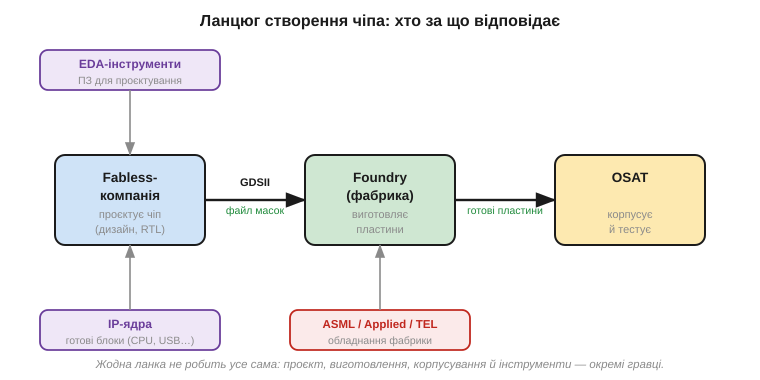

# Фаби й fabless: економіка за мільярди

Увесь технічний шлях чипа — від [піску й монокристалу](book:electronics/silicon-monocrystal) до [запакованого в корпус кристала](book:electronics/packaging) — це лише півкартини. За кожним його кроком — за чистими кімнатами, EUV-машинами, сотнями масок — стоїть **економіка**, без якої не зрозуміти, чому ринок чипів влаштований саме так. А влаштований він дивовижно. Сучасний напівпровідниковий завод — **фабрика** (*fab*, від *fabrication*) — коштує **десятки мільярдів** доларів, а кожне нове покоління дорожче за попереднє.

Така ціна породила ситуацію, що на перший погляд здається безглуздою: **майже ніхто у світі не має власної фабрики**. Компанії, чиї чіпи стоять буквально в усіх пристроях навколо вас, самі ці чіпи **не виготовляють** — вони лише проєктують, а власне виробництво замовляють у кількох гігантів-фабрик на іншому кінці світу. Уявіть автовиробника, що не має жодного заводу й замовляє складання машин у спільного підрядника разом із конкурентами, — у чипах це норма. Чому так склалося і чому це насправді розумно — і є тема цього останнього підрозділу. Розберімо економіку: хто за що відповідає в ланцюгу, чому фабрики такі немислимо дорогі й чому колись єдина індустрія розкололася на «тих, хто проєктує» і «тих, хто виготовляє». Це фінальний штрих, що пояснює весь ринок, на якому ви купуєте компоненти, — і його дефіцити, ціни та залежності.

### Ланцюг, де кожен робить своє

Сучасне виробництво чипа — не справа однієї компанії, а **ланцюг** спеціалізованих гравців, кожен зі своєю роллю.


*Рис. Хто за що відповідає. **Fabless-компанія** проєктує чіп (логіку, схему), користуючись **EDA-інструментами** (ПЗ для проєктування) і готовими **IP-ядрами** (ліцензовані блоки — процесор, USB, пам'ять). Готовий проєкт у вигляді файлу масок (GDSII) передають на **foundry** (фабрику), яка виготовляє пластини на своєму обладнанні (ASML та інші). Готові кристали корпусують і тестують спеціалізовані **OSAT**-компанії. Жодна ланка не робить усе сама.*

Простежмо ланцюг зліва направо. **Fabless-компанія** (буквально «без-фабрична») робить найголовніше інтелектуально — **проєктує** чіп: вирішує архітектуру, описує логіку, розкладає мільярди транзисторів і доріжок. Але робить вона це не з нуля, інакше жодного життя б не вистачило. По-перше, користується **EDA** (*Electronic Design Automation*) — складними програмами, що допомагають описати схему, перевірити її й автоматично розкласти мільярди елементів по кристалу (алгоритми place & route самі перетворюють опис логіки на фізичний малюнок доріжок). По-друге, ліцензує готові **IP-ядра** (*intellectual property*): перевірені блоки на кшталт процесорного ядра, контролера USB чи інтерфейсу пам'яті, які не має сенсу винаходити щоразу заново — їх «вставляють» у свій чіп, як готові цеглини. Це теж окрема індустрія: компанії, що **тільки** проєктують і ліцензують ядра, самі не випускаючи жодного чипа.

Готовий проєкт перетворюється на **файл масок** (формат GDSII — по суті, повне пошарове креслення всіх [шарів, які виростять на кристалі](book:electronics/doping-etching-metal)) і вирушає на **foundry** — фабрику, що власне виготовляє пластини, [друкуючи схему світлом](book:electronics/photolithography) на обладнанні, яке постачають ще інші спеціалісти (як-от ASML з її EUV-машинами). Нарешті готові кристали відправляють до **OSAT**-компаній (*Outsourced Assembly and Test*), що спеціалізуються на [корпусуванні](book:electronics/packaging) й [тестуванні та сортуванні](book:electronics/testing-binning). Виходить вражаюча картина: у створенні одного чипа беруть участь розробники EDA, постачальники IP, дизайнерська команда, фабрика, виробники обладнання, складальники — і всі вони **різні** компанії, часто з різних країн. Уся індустрія — це конвеєр вузьких спеціалізацій, де кожен робить **своє** найкраще; а тримає цю спеціалізацію вкупі сувора економіка фабрик.

### Чому фабрику не збудуєш у гаражі

Серце всієї цієї економіки — божевільна вартість фабрики. Саме вона пояснює, чому виробництво зосереджене в кількох руках.


*Рис. Вартість будівництва передового напівпровідникового заводу зростає з кожним поколінням: від кількох мільярдів доларів на старих вузлах до **$15–30 млрд** на найновіших — і ще стільки ж щороку на устаткування й розробку. Окупити такі гроші можна лише шаленими обсягами виробництва. Тому збудувати конкурентний фаб під силу буквально кільком компаніям у світі.*

Осягніть масштаб цих чисел. Передовий завод сьогодні коштує **$15–30 мільярдів** — як кілька авіаносців, — і це лише будівництво; додайте мільярди щороку на нове обладнання (одна EUV-машина — сотні мільйонів доларів) і на дослідження наступного покоління. Така сума має сенс, **лише** якщо завод працюватиме на повну й випускатиме чіпи **колосальними** тиражами роками поспіль. Покажімо це прямо.

**Приклад (чому фабрику окупає лише обсяг).** Завод вартістю $20 млрд треба окупити за ~5 років. Скільки чіпів він має випустити, щоб ця вартість «розмазалася» прийнятно?

```
Капітальні витрати:         $20 000 000 000
Строк окупності:            5 років
На рік:                     $4 млрд / рік треба відбити лише на будівлю

Якщо завод робить 20 000 пластин/місяць × 600 чіпів = 12 млн чіпів/міс
                            ≈ 144 млн чіпів/рік
Частка вартості заводу на 1 чіп:  $4 млрд / 144 млн  ≈  $28 / чіп

Якби обсяг був у 100 разів менший (1.44 млн чіпів/рік):
                            $4 млрд / 1.44 млн  ≈  $2800 / чіп  (!)
```

Різниця приголомшлива: при масовому випуску вартість заводу додає до чипа десятки доларів, а при дрібному — тисячі, що робить чіп неконкурентним. Звідси два наслідки. Перший: побудувати й окупити конкурентний передовий фаб під силу буквально **жменьці** компаній і країн у світі — це поріг, нездоланний для решти. Другий, і вирішальний для індустрії: переважній більшості компаній **немає сенсу** мати власну фабрику, навіть якби вони могли її збудувати, — вони просто **не завантажать** її на повну своїми обсягами, а недозавантажений завод (як показує приклад) робить кожен чіп золотим. Дешевше **замовити** виготовлення в того, хто збирає замовлення багатьох клієнтів і тримає завод завантаженим. Ця проста економіка масштабу й розколола індустрію, давши життя самій моделі fabless.

### Три моделі бізнесу

Зведімо все в три способи існувати в цій індустрії — і побачимо, куди рухається ринок.


*Рис. Три бізнес-моделі. **IDM** (Integrated Device Manufacturer) — проєктує **і** виготовляє сам, маючи власні фабрики (класична стара модель). **Fabless** — лише **проєктує**, а виготовлення віддає фабриці. **Foundry** (pure-play) — лише **виготовляє**, роблячи чужі чіпи на замовлення, своїх дизайнів не маючи. Дорожнеча фабрик розколола колишню єдину модель IDM надвоє — на тих, хто проєктує, і тих, хто виготовляє.*

Тут видно всю еволюцію галузі. Колись **усі** були **IDM** — велика компанія робила все під одним дахом: і проєктувала, і виготовляла на власних заводах. Поки фабрики були відносно дешеві, це мало сенс і навіть давало перевагу — повний контроль над усім ланцюгом. Та коли вартість фабу злетіла до десятків мільярдів (і кожне покоління дорожчало), тримати власне передове виробництво стало по кишені одиницям. Тоді й сталося велике розщеплення.

З одного боку з'явилися **fabless**-компанії: вони зосередилися на тому, що вміють найкраще, — на **проєктуванні** й архітектурі, — а виготовлення цілком віддали назовні. Це звільнило їх від мільярдних капітальних витрат: проєктувати чіпи можна талантом і комп'ютерами, без власного заводу. З іншого боку постали **pure-play foundry** — фабрики, що нічого свого **не проєктують**, а лише **виготовляють** чужі чіпи на замовлення. Їхній геній — у бізнес-моделі: зібравши замовлення **багатьох** fabless-клієнтів, вони тримають свій захмарно дорогий завод **повністю завантаженим**, а отже — як показав розрахунок вартості на чіп — роблять кожен чіп дешевим. Жоден окремий клієнт не завантажив би завод сам — а всі разом завантажують. Саме поява таких великих незалежних фабрик і зробила модель fabless узагалі можливою: доти дизайнерові не було куди віддати проєкт, а тепер з'явився підрядник.

Класичний і вирішальний для всієї індустрії приклад — фабрика, що принципово працює **на всіх** і ні з ким не конкурує власними дизайнами, тож клієнти не бояться віддавати їй секрети своїх схем (її історію винесено в окрему 📜-вставку до теми). Саме ця нейтральність — «ми лише виготовляємо, вашим конкурентом ніколи не станемо» — і зробила модель foundry такою успішною: вона зняла головний страх fabless-компанії віддати креслення на чужий завод. IDM-компанії досі існують і подекуди процвітають, особливо там, де власний процес дає унікальну перевагу, але їхня частка на передовому краї меншає: економіка невблаганно тягне до поділу праці, бо спеціалізований гравець на кожній ланці ефективніший за універсала, що тягне все сам. Так вимальовується повна картина: чіп, що народжується з піску складним фізичним процесом, існує ще й у складній **економічній** екосистемі, де проєкт, інструменти, IP, виготовлення й корпусування — справа різних спеціалізованих гравців, часто з різних кінців світу.

### Концентрація, тонкі місця й чому це питання світового рівня

Спеціалізація дала індустрії неймовірну ефективність, але й несподівано **крихку** структуру. Коли кожну ланку роблять кілька гравців, увесь світ стає залежним від кількох точок. І це не абстракція, а цілком конкретні «тонкі шийки» ланцюга.

Найгостріший приклад — **передові фабрики**: виготовлення найновіших чипів зосереджене буквально в кількох заводах кількох компаній, та ще й географічно в одному регіоні (Східна Азія). Поруч — **обладнання**: машини EUV для [найдрібнішого друку схем](book:electronics/photolithography) у світі робить **одна** компанія (ASML у Нідерландах), і без неї передовий завод просто не збудувати жодній країні, хоч би скільки грошей вона мала. Додайте сюди особливі **матеріали** (надчисті хімікати, спеціальні фоторезисти, кремнієві пластини), що теж походять із небагатьох постачальників, часом теж зосереджених в одній-двох країнах. Виходить ланцюг, де кожна ланка — вузьке місце, і збій у будь-якій (стихійне лихо, аварія, політична заборона, банальне перевантаження попитом) відлунює по **всьому** світу одночасно.

Найгостріше цю крихкість показав **дефіцит чипів** початку 2020-х. Сплеск попиту, накладений на збої постачання, оголив, наскільки тонкий ланцюг: бракувало навіть найпростіших, копійчаних мікроконтролерів на зрілих процесах — і через це **зупинялися автозаводи**, відкладався випуск техніки, дорожчало геть усе електронне. Виявилося, що сучасна промисловість тримається на безперебійному потоці чипів, як на кисні, а сам цей потік іде крізь кілька вузьких місць. Це був наочний урок для цілих держав — і саме він підштовхнув нинішні мільярдні програми будівництва власних фабрик.

Саме тому чіпи з суто технічної теми перетворилися на питання **світової політики й безпеки**: країни усвідомили, що залежать від кількох заводів за тисячі кілометрів, і тепер укладають мільярди в спроби збудувати власні фабрики й диверсифікувати ланцюг. Для вас як розробника з цього випливає дуже практичне: **ризик постачання** — реальна частина проєктування, не менш важлива за технічні характеристики. Закладаючи конкретний чіп у виріб, варто думати не лише про те, чи він підходить, а й про його доступність наперед, про запасні альтернативи на випадок дефіциту й про те, на скількох заводах він узагалі виробляється. Чіп, якого не дістати, — не кращий за чіп, якого нема.

> 🔧 **Навіщо це.** Економіка чипів пояснює реалії, з якими ви живете як розробник. Перше: **чому бувають дефіцити й черги** на чіпи — виробництво зосереджене в кількох фабриках і навіть одному регіоні, тож збій, перевантаження чи геополітика б'ють одразу по всьому ринку (і по доступності компонентів для ваших пристроїв); ризик постачання варто закладати в проєкт. Друге: **чому ціни такі, які є** — за вашим копійчаним мікроконтролером стоять мільярдні заводи, окуплені лише масовістю; звідси й те, що популярні масові чіпи дешеві, а нішеві — ні. Третє, корисне для розуміння галузі: коли в новині звучать назви компаній, ви тепер розрізняєте, **хто проєктує, а хто виготовляє** (fabless / foundry / IDM), і чому контроль над передовими фабриками й над єдиним виробником EUV — питання світового рівня. А загальний підсумок: чіп, який ви тримаєте, — продукт не лише фізики, а й безпрецедентної **глобальної кооперації**, де жодна країна й компанія не робить його самотужки від початку до кінця. Це варто тримати в голові, коли плануєте виріб і його залежність від ланцюга постачання.
