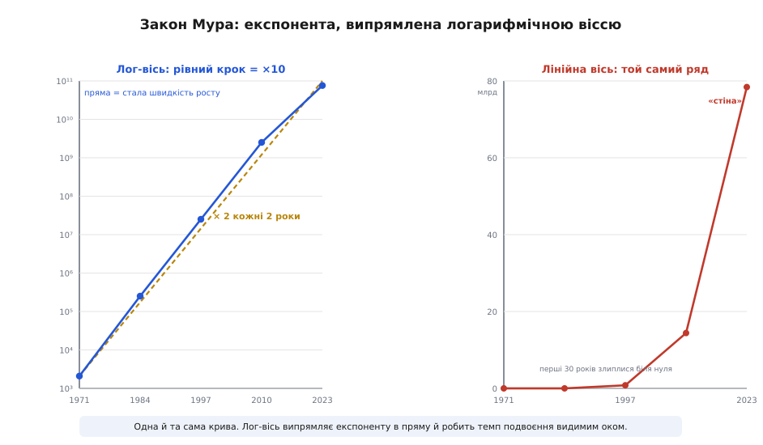
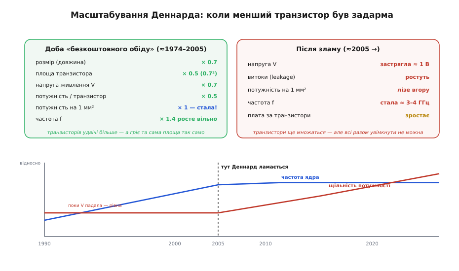
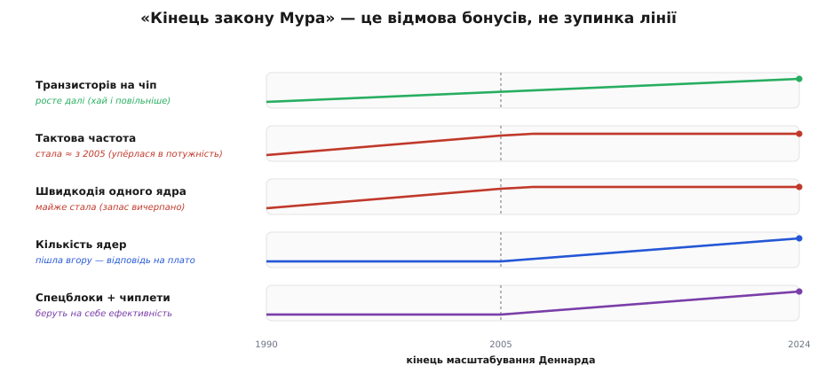

# 🧮 Закон Мура як графік: експонента, її злами й кінець масштабування Деннарда

> Числова вставка до теми [«Фаби й fabless: економіка за мільярди»](topic:electronics/fabs-fabless). Будівництво фабрики коштує десятки мільярдів і дорожчає з кожним поколінням. За цією економікою стоїть одна крива — славнозвісний «закон Мура». Тут розберемо її як математичний об'єкт: чому вона експонента, чому її прийнято малювати прямою, що означали «зручні роки», коли менший транзистор діставався майже задарма, — і чому цей подарунок закінчився, хоча сама лінія транзисторів іще тягнеться вгору.

### Означення: що саме стверджує закон Мура

Почнімо з того, що це **не закон фізики**, а помічена закономірність — і навіть радше економічне правило. 1965 року Гордон Мур (*Gordon Moore*) у журналі *Electronics* зауважив: число компонентів, які вигідно вмістити на одному кристалі, **подвоюється приблизно щороку**. За десять років, 1975-го, він переглянув темп до **подвоєння кожні ~2 роки** — і саме ця версія дожила донині. Назву «закон Мура» пустив у вжиток Карвер Мід (*Carver Mead*); сам Мур її не вигадував.

Подвоєння за сталий проміжок — це визначення **експоненційного росту** (*exponential growth*). Якщо N(t) — число транзисторів, а час подвоєння T₂ ≈ 2 роки, то

```
N(t) = N₀ · 2^(t / T₂)        T₂ ≈ 2 роки
```

Експонента тим і підступна, що «на око» здається нескінченно крутою: за десять подвоєнь — це ×1024, за двадцять — мільйон. Підставмо реальні числа, щоб відчути масштаб. Перший масовий мікропроцесор 1971 року ніс близько 2300 транзисторів; від нього до 2021-го минуло ≈ 50 років, тобто ≈ 25 подвоєнь по два роки:

```
подвоєнь за 50 років:   50 / 2  =  25
множник зростання:      2^25    ≈  33 000 000
N(2021) ≈ N₀ · 2^25  =  2300 · 33·10⁶  ≈  7.6·10¹⁰  (≈ 76 млрд)
```

І справді: найбільші сучасні кристали несуть десятки мільярдів транзисторів — крива витримала півстоліття. Та якби ми відклали ці 76 мільярдів на звичайній (лінійній) осі, перші тридцять років злиплися б у тонку лінію над нулем: на тлі мільярдів і мільйон, і тисяча транзисторів — практично нуль. Саме тому експоненту майже ніколи не малюють у звичайних координатах.

### Інтуїція: чому експоненту випрямляють у пряму

[Логарифм](topic:math/logarithms) перетворює подвоєння на **рівний крок**. Прологарифмуймо обидва боки:

```
log₂ N(t) = log₂ N₀ + t / T₂
```

Праворуч — рівняння **прямої** виду y = a + b·t. Тобто на осі, де по вертикалі відкладено не саме число, а його логарифм, експонента розпрямляється в пряму лінію, а її нахил — це **темп подвоєння**. Це не косметика: пряма дає змогу оком зчитати, чи тримається закон, бо будь-яке вповільнення одразу видно як злам нахилу.


*Та сама послідовність чіпів двома способами. Ліворуч — логарифмічна вісь: подвоєння за ~2 роки лягає на пряму (пунктир — ідеальний темп ×2), і реальні точки тримаються її кілька десятиліть. Праворуч — лінійна вісь: перші тридцять років злипаються біля нуля, а потім крива «злітає в стіну». Один ряд чисел, але лог-вісь робить зростання читабельним, а лінійна — ховає його.*

### Формальний апарат: масштабування Деннарда — джерело «безкоштовного обіду»

Закон Мура каже лише, **скільки** транзисторів поміститься. Те, що кожне нове покоління ще й працювало **швидше та холодніше**, — заслуга окремого правила. 1974 року група інженерів IBM на чолі з Робертом Деннардом (*Robert Dennard*) сформулювала **масштабування Деннарда** (*Dennard scaling*): якщо всі розміри транзистора й напругу живлення зменшувати в те саме число разів κ, фізика складається напрочуд вдало. Нехай за крок лінійний розмір ×0.7 (κ ≈ 1.4):

```
довжина, ширина : × 0.7          площа : × 0.5   (0.7²)
напруга V        : × 0.7          ємність : × 0.7
потужність / транзистор : × 0.5   (∝ C · V² · f)
число транзисторів на мм² : × 2
─────────────────────────────────────────────
потужність на 1 мм²  :  × 1   — СТАЛА
```

Ось у чому подарунок: транзисторів на одиниці площі **вдвічі більше**, кожен **удвічі ощадніший**, тож гріє той самий квадратний міліметр **так само**, а частоту можна вільно піднімати. Кожне покоління саме собою давало і щільність (Мур), і швидкодію без перегріву (Деннард) — звідси й вираз «безкоштовний обід» (*free lunch*).

Уся магія тут — у формулі динамічної потужності `P ∝ C · V² · f`, і варто побачити, чому саме напруга в ній вирішальна. Ємність C спадає лінійно з розміром, частота f росте — самі собою вони майже компенсували б одне одного. А от напруга входить **у квадраті**: зменшити V у 1.4 раза означає зменшити V² майже **вдвічі**. Саме цей квадрат і «оплачував» подарунок — він з лишком гасив і зростання частоти, і подвоєння числа транзисторів, тримаючи тепло на місці. Тому-то, коли напруга застрягла, обвалився не якийсь абстрактний баланс, а конкретно цей член V²: без нього зростання частоти більше нема чим компенсувати, і перегрів повертається. Квадрат напруги був джерелом щедрості — він же став і вузьким місцем.


*Дві ери на одній осі. Доки напруга падала разом із розміром (ліворуч, до ~2005), щільність потужності лишалася рівною, а частота вільно зростала. Потім напруга вперлася в поріг транзистора (≈1 В) і поповзли витоки — щільність потужності полізла вгору, а частота стала на місці (нижня панель).*

> 🔧 **Навіщо це.** Саме кінець масштабування Деннарда пояснює, чому ваш мікроконтролер уже багато років працює на одиницях чи десятках мегагерців і не «розганяється» сам собою щороку: дармова частота скінчилася. Подальший виграш дають не вищі такти, а архітектура — паралельність і спеціалізовані блоки.

### Де ламається лінія — і де ні

Близько 2005 року правило Деннарда **перестало виконуватися**, і причина варта того, щоб її розкласти. Уся вигода трималася на тому, що напруга падала разом із розміром. Але напруга вимикання транзистора (його поріг) знижується погано: транзистор не має різкого «клацання» з «увімкнено» в «нуль» — закритий стан настає поступово, і чим ближче робоча напруга до порога, тим більший **струм витоку** (*leakage*) тече навіть крізь начебто закритий транзистор. Гірше того, ця підпорогова провідність залежить від напруги **експоненційно**: знизивши живлення ще трохи, ти виграєш дрібку динамічної потужності, але програєш у рази на витоках. Тож напруга застрягла біля ≈ 1 В — нижче вже не окупається. А коли напруга стала, перестала зменшуватися й потужність на транзистор; множник «потужність на мм²» зірвався з одиниці й поліз угору — це й називають **стіною потужності** (*power wall*). Наслідок видно на [тактовій частоті процесорів](topic:programming/clock-frequency): у настільних вона застрягла на ≈3–4 ГГц і відтоді майже не росте.

Важливо не сплутати два злами. **Лінія транзисторів** (закон Мура) триває й досі, хоч і повільніше, ніж раз на два роки. А от **бонуси**, що йшли з нею в комплекті, насичуються по черзі: спершу частота, потім швидкодія одного ядра. Промисловість відповіла, витрачаючи нові транзистори інакше — на багатоядерність, спеціалізовані прискорювачі й чиплети (їхню [економіку чиплетів](topic:electronics/yield/math-yield-math.md) рахують через вихід придатних кристалів).


*«Кінець закону Мура» — це відмова бонусів, а не зупинка лінії транзисторів. Число транзисторів іде вгору; частота й швидкодія одного ядра вийшли на плато з ~2005; натомість угору пішли кількість ядер і спеціалізовані блоки. Кінець масштабування Деннарда — той самий вододіл.*

### Де ця крива дається взнаки

Ця крива — мовчазне тло цілого ремесла мікроелектроніки. Вона пояснює [економіку фаб](topic:electronics/fabs-fabless): кожне подвоєння щільності вимагає дедалі дорожчого обладнання, тож фабрики коштують мільярди, а охочих їх будувати лишаються одиниці. Вона ж стоїть за «стіною частоти» [процесорів](topic:programming/clock-frequency) і за тим, чому подальший поступ перемкнувся на ядра та [чиплети](topic:electronics/yield/math-yield-math.md). А головний урок — методичний: коли вам покажуть «вибух» якоїсь технології, перевірте, чи це справді експонента, чи лінійна вісь просто драматизує звичайний ріст. Логарифмічна вісь розрізняє їх миттєво.
