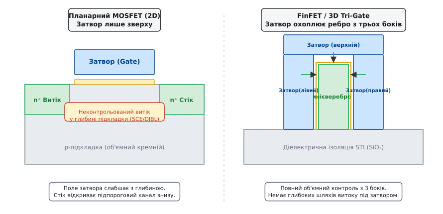
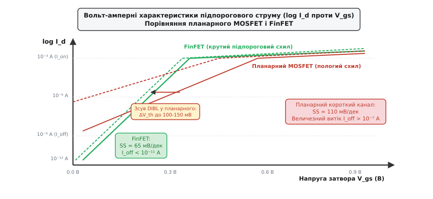
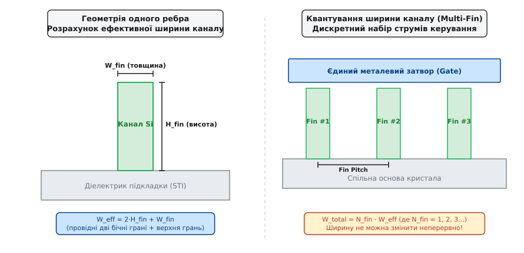
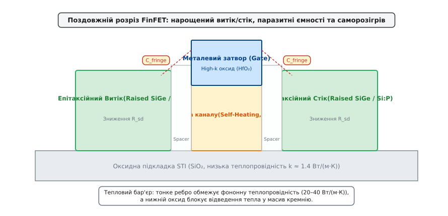

# FinFET: тривимірний транзистор

<preknowlist>
- [Будова MOSFET](topic:electronics/mosfet-structure) — плоский канал, затвор-ізолятор, стік і витік.
- [Поріг MOSFET](topic:electronics/mosfet-threshold) — наведення інверсійного каналу полем затвора.
- [Масштабування MOSFET і закон Денарда](topic:electronics/mosfet-scaling) — класичне геометричне зменшення розмірів та межі планарної технології.
- [Підпороговий витік](topic:electronics/subthreshold-leakage) — експоненційне протікання струму при напругах нижче порога.
- [High-k діелектрик і металевий затвор (HKMG)](topic:electronics/hkmg) — подолання тунельного витоку підзатворного діелектрика.
</preknowlist>

Коли довжина затвора планарного транзистора скоротилася нижче 30 нанометрів на технологічних нормах 28–22 нм, класична планарна архітектура втратила здатність надійно вимикати струм: електричне поле стоку почало пробивати товщу кремнієвої підкладки в обхід затвора, спричиняючи неконтрольоване падіння порогової напруги та гігантський підпороговий витік у сотні наноамперів на кожен мікрон ширини. Єдиним способом повернути електростатичний контроль над носіями заряду стало повне вилучення масивної підкладки з-під каналу та підняття кремнію у вертикальне надтонке ребро, оточене металевим затвором із трьох боків.

### Глухий кут планарного кремнію: прорив поля стоку на 22 нм

У класичному [планарному MOSFET](topic:electronics/mosfet-structure) затвор розташований лише на одній площині — зверху над кремнієвою пластиною. Поки довжина каналу `L_g` перевищувала 100 нм, товщина підзатворного оксиду була достатньо малою порівняно з відстанню між витоком і стоком, і лінії електричного поля затвора домінували над усім об'ємом каналу. Проте [масштабування за законом Денарда](topic:electronics/mosfet-scaling) вимагало скорочення довжини каналу на кожному поколінні мікросхем у `1.4` раза заради підвищення тактової частоти та щільності розміщення логічних вентилів.

При скороченні довжини затвора до 25–20 нм виникла фундаментальна геометрія конфлікту двох електричних полів:
1. **Поле затвора** діє перпендикулярно до поверхні пластини, намагаючись збіднити приповерхневий шар і створити потенціальний бар'єр для електронів. Його напруженість спадає експоненційно з віддаленням від верхнього діелектрика вглиб кремнію.
2. **Поле стоку** спрямоване горизонтально вздовж каналу, від позитивно зміщеного стоку до заземленого витоку. На відміну від затвора, лінії поля стоку проникають глибоко в товщу напівпровідникової підкладки.

У короткому планарному транзисторі нижня частина каналу виявляється ближчою до витоку й стоку, ніж до керуючого затвора. Позитивний потенціал стоку починає притягувати електрони з витоку крізь глибокі шари кремнію, де поле верхнього затвора вже практично не діє. Це явище отримало назву **зниження бар'єра полем стоку** *(Drain-Induced Barrier Lowering, DIBL)*: прикладання напруги до стоку знижує ефективну порогову напругу `V_th` транзистора. У результаті навіть за нульової або від'ємної напруги на затворі транзистор не закривається повністю — виникає об'ємний струм пробою підкладки *(punch-through)*.


*Зліва: у планарному транзисторі затвор розташований лише зверху, тому лінії поля стоку проникають у глибину підкладки під каналом, викликаючи неконтрольований витік DIBL. Справа: у FinFET кремнієвий канал піднято у вертикальне тонке ребро, охоплене затвором із трьох боків, що блокує будь-які шляхи витоку в обхід затвора.*

Спроби втримати планарну геометрію на вузлах 45 нм та 32 нм базувалися на важкому локальному легуванні кремнію акцепторними домішками (так зване кишенькове легування, *halo / pocket doping*). Концентрацію домішок під каналом піднімали до `N_a > 10¹⁸ см⁻³`, щоб звузити збіднену область стоку й заблокувати прорив ліній поля. Проте це інженерне рішення призвело до двох важких фізичних розплат:

По-перше, при концентрації домішок `10¹⁸–10¹⁹ см⁻³` у мікроскопічному об'ємі каналу розміром `20 нм × 50 нм × 10 нм` сумарна кількість іонів бору становить лише 10–50 штук. Внаслідок квантово-статистичного характеру іонної імплантації та дифузії кількість домішок у сусідніх транзисторах підпорядковується розподілу Пуассона з відносною дисперсією `σ_N / N = 1 / √N`. Цей ефект — **випадкові флуктуації кількості домішок** *(Random Dopant Fluctuation, RDF)* — викликав гігантський розкид порогових напруг `σ(V_th) > 40–60 мВ` між сусідніми транзисторами одного кристала, що повністю руйнувало працездатність [SRAM-комірок кеш-пам'яті](topic:electronics/sram-cell) та унеможливлювало зниження напруги живлення.

По-друге, колосальна щільність іонізованих атомів домішки в каналі спричиняла катастрофічне кулонівське розсіювання носіїв заряду. Рухливість електронів у кремнії впала з фундаментальних `1400 см²/(В·с)` до мізерних `100–150 см²/(В·с)`, нівелюючи виграш у швидкодії від скорочення довжини каналу. Планарний кремній досяг абсолютної фізичної межі.

> 🔧 **Навіщо це.** Без подолання короткоканальних ефектів мікроелектроніка застрягла б на технологічному вузлі 28 нм: споживання енергії сучасних процесорів у стані спокою перевищувало б сотні ватів через підпорогові витоки, а мобільні смартфони розряджали б акумулятор за лічені години навіть без запуску застосунків.

### Анатомія тривимірного ребра: електростатичне оточення з трьох боків

Виходом із планарного тупика стала зміна просторової конфігурації приладу: канал витягнули вгору перпендикулярно до площини пластини у вигляді тонкого вертикального кремнієвого ребра *(fin)*, на яке зверху накинули металевий затвор за [технологією HKMG](topic:electronics/hkmg). Така тривимірна структура дістала назву **FinFET** *(Fin Field-Effect Transistor)* або **3D Tri-Gate**.

У цій архітектурі кремнієве ребро характеризується двома геометричними параметрами:
- **Ширина ребра** `W_fin` (або його товщина в горизонтальному перерізі) — зазвичай від 6 до 15 нм;
- **Висота ребра** `H_fin` (вертикальний розмір ребра над діелектричною ізоляцією STI) — від 30 до 65 нм.

Металевий затвор, відокремлений конформним шаром діелектрика з високою проникністю (HfO₂ / High-k), огортає ребро з трьох поверхонь: лівої вертикальної бічної стінки, правої вертикальної бічної стінки та верхньої горизонтальної площини. Детальніше про історію цього винаходу та наукову боротьбу за впровадження 3D-структури можна дізнатися в [📜 історії розробки FinFET](topic:electronics/finfet/hist-finfet-invention.md).

Фізичний механізм електростатичного захисту полягає в **просторовому екрануванні каналу**. Коли електрод затвора знаходиться з обох боків тонкого кремнієвого ребра, силові лінії електричного поля стоку більше не можуть вільно проникнути крізь товщу напівпровідника до витоку: вони перехоплюються металевими обкладками затвора, потенціал яких жорстко контролюється схемою.

Електростатичний масштаб проникнення поля стоку описується параметром **натуральної довжини** *(scale length)* `λ_fin`. Зі строгого розв'язку двовимірного рівняння Пуассона, наведеного в [🧮 математичному виведенні натуральної довжини](topic:electronics/finfet/math-electrostatic-scaling.md), випливає вираз:

```
λ_fin = √((ε_si / (2 · ε_ox)) · W_fin · t_ox)
```

де `ε_si` — діелектрична проникність кремнію (`11.7`), `ε_ox` — діелектрична проникність підзатворного оксиду, `t_ox` — еквівалентна товщина діелектрика (EOT).

Щоб транзистор залишався стійким до короткоканальних ефектів і зберігав надійне перемикання, довжина затвора `L_g` повинна перевершувати натуральну довжину щонайменше у 2.5–3 рази:

```
L_g ≥ 2.5 · λ_fin
```

Звідси випливає фундаментальне геометричне правило проектування FinFET: **ширина ребра повинна бути меншою за половину довжини затвора**:

```
W_fin ≤ L_g / 2
```

Для транзистора техпроцесу 7 нм із фізичною довжиною затвора `L_g = 18 нм` ширина ребра `W_fin` не повинна перевищувати 7–8 нм. За такої надмалої товщини в середині ребра просто фізично немає місця для виникнення «глибоких» паразитно відкритих шляхів струму: весь об'єм кремнію знаходиться на відстані не більше 3–4 нм від найближчого металевого електрода затвора.

### Повне збіднення тіла: нелегований канал і подолання RDF

Тривимірне ребро малої товщини повністю усуває потребу у важкому легуванні каналу домішками. Це одна з найважливіших фізичних переваг FinFET, яка докорінно змінила напівпровідникову технологію.

У планарному транзисторі легування було необхідним для формування збідненої області та запобігання пробою. У FinFET різниця робіт виходу між металом затвора та кремнієм створює контактну різницю потенціалів, яка повністю спустошує надтонке ребро від вільних носіїв заряду на всю його глибину навіть за нульової напруги на затворі. Такий режим роботи зветься **повністю збідненим тілом** *(Fully Depleted, FD)*.

Канал FinFET виготовляють із **чистого, нелегованого або надзвичайно слабо легованого монокристалічного кремнію** (`N_ch < 10¹⁵ см⁻³`). Це дає три кардинальні переваги:

1. **Повне усунення випадкових флуктуацій домішок (RDF):**
   Оскільки в робочому об'ємі каналу немає іонізованих атомів бору чи миш'яку, зникає саме джерело статистичного розкиду параметрів. Розкид порогової напруги `σ(V_th)` між сусідніми приладами зменшується у 3–4 рази порівняно з планарними аналогами того самого масштабу. Це дозволило створювати мініатюрні комірки пам'яті SRAM площею менш ніж `0.03 мкм²` на вузлах 7 нм і 5 нм.

2. **Максимізація рухливості носіїв заряду:**
   У нелегованому монокристалі електрони та дірки рухаються без інтенсивного розсіювання на іонізованих центрах. Рухливість електронів у каналі зростає у 2–3 рази, що пропорційно збільшує струм відкритого транзистора `I_on` при тій самій напрузі затвора.

3. **Ідеальний підпороговий схил (Subthreshold Swing):**
   У планарному транзисторі ємність збідненої області `C_dep` разом із ємністю діелектрика `C_ox` утворювала ємнісний дільник напруги, через що лише частина прикладеної напруги затвора йшла на керування поверхневим потенціалом. У повністю збідненому FinFET ребро вже позбавлене мобільних зарядів, тому додаткова ємність збіднення дорівнює нулю (`C_dep ≈ 0`).

Фактор неідеальності затвора сягає свого теоретичного мінімуму `m = 1 + C_dep / C_ox = 1.00`. Як наслідок, підпороговий схил FinFET наближається до фундаментальної фізичної межі Больцмана:

```
SS = ln(10) · (k_B · T / q) · m ≈ 60 мВ/дек      [при T = 300 K]
```


*Залежність струму стоку від напруги затвора в логарифмічному масштабі. FinFET має крутий нахил SS ≈ 65 мВ/дек проти 110 мВ/дек у планарного приладу і практично нульовий зсув кривої при підвищенні напруги стоку (мінімальний DIBL), що забезпечує низький струм витоку I_off.*

Крутий підпороговий схил означає, що для зміни струму транзистора на 4 порядки (від закритого стану `10⁻¹¹ А` до початку відкривання `10⁻⁷ А`) у FinFET достатньо змінити напругу на затворі всього на `4 × 65 мВ = 260 мВ`, тоді як у деградованого планарного транзистора на це було потрібно `4 × 110 мВ = 440 мВ`.

Це дозволило конструкторам інтегральних схем знизити робочу напругу живлення кристалів `V_dd` з 1.0–1.1 В (на вузлах 32/28 нм) до 0.65–0.75 В (на вузлах 7/5 нм). Оскільки динамічна потужність логічних вентилів пропорційна квадрату напруги:

```
P_dyn = C_load · V_dd² · f
```

зниження напруги живлення з 1.0 В до 0.7 В скоротило споживання енергії логічного ядра більш ніж удвічі при тій самій робочій частоті.

### Квантування ширини каналу: дискретна схемотехніка Multi-Fin

Перехід у вертикальну площину кардинально змінив геометрію формування струму та принципи схемотехнічного проектування стандартних логічних комірок.

У класичному планарному транзисторі ширина каналу `W` була неперервною величиною: розробник міг задати на топологічному кресленні будь-яку ширину каналу — наприклад, `W = 120 нм`, `W = 175 нм` або `W = 500 нм`, залежно від того, яке ємнісне навантаження повинен перемикати цей транзистор.

У FinFET струм інверсійного каналу протікає трьома поверхнями ребра, накритими затвором: лівою стінкою, правою стінкою та верхньою гранню. **Ефективна ширина каналу одного ребра** `W_eff,1fin` визначається периметром ребра в розрізі:

```
W_eff,1fin = 2 · H_fin + W_fin
```

Оскільки висота ребра `H_fin` (наприклад, 45 нм) значно перевищує його товщину `W_fin` (наприклад, 7 нм), основна частка струму (понад 90%) протікає саме двома вертикальними бічними стінками:

```
W_eff,1fin = 2 · 45 нм + 7 нм = 97 нм
```

Звідси випливає фундаментальний наслідок: **ширина каналу FinFET є квантованою величиною**. Висота `H_fin` і товщина `W_fin` задаються загальним технологічним процесом на всій пластині й не можуть змінюватися від транзистора до транзистора. Тому загальна ефективна ширина транзистора може дорівнювати лише цілому числу ребер `N_fin`:

```
W_total = N_fin · W_eff,1fin = N_fin · (2 · H_fin + W_fin)      [де N_fin = 1, 2, 3, 4...]
```


*Зліва: ефективна ширина каналу одного ребра W_eff визначається сумою висот двох бічних стінок і ширини верхівки. Справа: дискретне нарощування струмової сили транзистора шляхом паралельного об'єднання цілої кількості ребер (N_fin = 1, 2, 3) під спільним затвором із фіксованим кроком Fin Pitch.*

Це квантування призвело до революції в [проектуванні стандартних комірок](topic:electronics/standard-cell):
- **Дискретні коефіцієнти підсилення (Drive Strength):** Логічні вентилі більше не можна оптимізувати з точністю до довільного нанометра ширини. Вентилі випускаються строго фіксованих градацій: X1 (1 ребро на NMOS/PMOS), X2 (2 ребра), X3 (3 ребра), X4 (4 ребра).
- **Висота комірки (Track Height):** Висота стандартної логічної комірки в бібліотеках CAD вимірюється в кількості металевих доріжок *(tracks, T)*, які можна прокласти над коміркою на першому металевому шарі M1 (наприклад, 9T, 7.5T, 6T або 5T). У комірку висотою 6T фізично вміщується лише 1 або 2 паралельних ребра для NMOS і стільки ж для PMOS.
- **Масштабування висоти ребра (Fin Height Scaling):** Щоб компенсувати зменшення кількості ребер у низьких комірках (перехід від 9T з 3 ребрами до 6T з 1–2 ребрами) без втрати швидкодії, виробники були змушені робити кожне окреме ребро дедалі вищим. Якщо на вузлі 22 нм висота ребра становила `H_fin ≈ 34 нм`, то на вузлі 5 нм її довели до `H_fin ≈ 60–65 нм`.

Проте зростання висоти ребра при збереженні надмалої ширини `W_fin = 6 нм` створило граничне аспектне співвідношення *(aspect ratio)*:

```
H_fin / W_fin = 65 нм / 6 нм ≈ 11 : 1
```

Кремнієві ребра перетворилися на надзвичайно високі й тонкі вертикальні «леза». Під час рідинного травлення та фінального промивання пластин поверхневий натяг висихаючої рідини між сусідніми ребрами створював капілярні сили, здатні деформувати та зламати ребра, викликаючи їхнє злипання *(fin collapse)*. Це вимагало переходу на надкритичне сушіння діоксидом вуглецю (CO₂) на етапах мікрофабрикації.

### Паразитний опір і ємності: ціна переходу у третій вимір

Підняття каналу у вертикальну площину ліквідувало короткоканальні ефекти, проте створило два нових паразитних бар'єри: різке зростання послідовного паразитного опору витоку/стоку та значне збільшення паразитних ємностей тривимірної структури.

#### 1. Проблема послідовного опору та епітаксія витоку/стоку (Raised S/D)
Струм, перш ніж потрапити в інверсійний канал, повинен пройти крізь ділянки витоку й вийти крізь ділянку стоку. Якщо ці ділянки виконати у вигляді того самого тонкого кремнієвого ребра товщиною `W_fin = 6 нм` і висотою 50 нм, його поперечний переріз становить мізерні:

```
S_fin = 6 нм × 50 нм = 300 нм² = 3 · 10⁻¹² см²
```

За питомого опору навіть сильно легованого кремнію послідовний опір ребра `R_fin` досягав би десятків кілоомів, що повністю заблокувало б протікання струму. Крім того, площа металевого контакту до верхівки такого ребра була б настільки малою, що контактний опір переходу метал-напівпровідник домінував би над усім опором транзистора.

Розв'язанням цієї проблеми стало застосування **селективного епітаксійного нарощування витоку та стоку** *(Raised Source/Drain Epitaxy)*. Після формування затвора та діелектричних спейсерів відкриті кінці ребер за межами каналу нарощують епітаксійним осадом кремнію, легованого безпосередньо під час росту (in-situ):
- Для **p-канальних транзисторів (pFinFET)** нарощують шар кремній-германію (SiGe:B), легованого бором. Кристалічна ґратка SiGe має більший період, ніж чистий Si, що створює в каналі потужне **поздовжнє стискаюче механічне напруження** *(compressive strain)*, збільшуючи рухливість дірок більш ніж на 100%. Епітаксія SiGe утворює характерні ромбоподібні фасеткові структури *(diamond-shaped facets)*, які зливаються між сусідніми ребрами в масивний суцільний блок витоку/стоку.
- Для **n-канальних транзисторів (nFinFET)** нарощують кремній, легований фосфором або вуглецем (Si:P / Si:C), що створює **розтягуюче напруження** *(tensile strain)*, додатково підвищуючи рухливість електронів.

Об'ємні епітаксійні контакти збільшують площу металізації в десятки разів, знижуючи питомий опір контактів `R_contact` до прийнятних `< 10⁻⁹ Ом·см²`.


*Поздовжній розріз FinFET уздовж ребра. Масивні епітаксійні області витоку й стоку (Raised SiGe) знижують послідовний опір R_sd і створюють деформаційне напруження. Спейсери відокремлюють метал затвора від витоку/стоку, проте між ними виникає паразитна ємність окантовки C_fringe. Знизу ребро оточене оксидом STI з низькою теплопровідністю, що спричиняє саморозігрів.*

#### 2. Паразитні тривимірні ємності окантовки (Fringe Capacitance)
У планарному транзисторі паразитна ємність перекриття затвор-витік/стік визначалася лише горизонтальною лінією ширини `W`. У FinFET металевий затвор опускається між вертикальними ребрами, нависаючи над епітаксійними блоками витоку та стоку.

Виникає складний тривимірний масив паразитних ємностей:
- **Ємність бічної окантовки** *(Outer Fringe Capacitance, C_of)* — між вертикальною стінкою затвора та бічною гранню епітаксійного витоку/стоку крізь діелектричний спейсер.
- **Ємність кутів і верхівки** *(Corner / Top Capacitance)*.

Ці паразитні ємності не беруть участі у створенні провідного каналу, але повинні перезаряджатися при кожному перемиканні логічного вентиля. На вузлах 10 нм та 7 нм сумарна паразитна ємність затвора `C_parasitic` досягла 50–60% від усієї ємності транзистора, ставши головним обмежувачем динамічної швидкодії. Для її зниження індустрія перейшла на спейсери з матеріалів із наднизькою діелектричною проникністю *(Low-k spacers, SiBCN, SiOCN із k < 4.5)* замість традиційного нітриду кремнію Si₃N₄ (`k = 7.5`).

### Тепловий бар'єр: ефект саморозігріву (Self-Heating Effect)

Поряд із паразитними ємностями найважчою експлуатаційною проблемою FinFET став **ефект локального саморозігріву** *(Self-Heating Effect, SHE)*, зумовлений погіршенням тепловідведення з тривимірного ребра.

У класичному планарному транзисторі тепло, що генерується рухомими електронами в каналі внаслідок розсіювання енергії, безперешкодно розсіювалося вниз безпосередньо в товщу масивної кремнієвої підкладки товщиною сотні мікрометрів. Монокристалічний кремній має відмінну теплопровідність `k_Si ≈ 148 Вт/(м·К)` за кімнатної температури.

У FinFET кремнієве ребро виявилося термічно ізольованим у пастці через поєднання трьох фізичних факторів:
1. **Низька теплопровідність діоксиду кремнію:**
   Основа ребра з боків і знизу занурена в товстий шар діелектричної ізоляції мілких траншей STI *(Shallow Trench Isolation)*, виконаної з аморфного діоксиду кремнію SiO₂. Теплопровідність SiO₂ становить лише:
   ```
   k_SiO₂ ≈ 1.4 Вт/(м·К)      [у 100 разів гірше за кремній!]
   ```
   Діелектрик STI діє як термоізоляційна шуба, блокуючи пряме скидання тепла в масив підкладки.
2. **Фононне граничне розсіювання в наноребрі:**
   Основними переносниками тепла в напівпровідниках є акустичні фонони, середня довжина вільного пробігу яких у кремнії становить `λ_phonon ≈ 40–100 нм`. Коли товщина ребра `W_fin` зменшується до 6–8 нм, фонони зазнають безперервного інтенсивного розсіювання на бічних границях ребра. Це зменшує ефективну теплопровідність самого кремнієвого ребра вздовж осі каналу з нормальних 148 Вт/(м·К) до критично низьких:
   ```
   k_fin,eff ≈ 20 … 40 Вт/(м·К)
   ```
3. **Висока густина струму:**
   Завдяки тривимірній геометрії через надтонке ребро перерізом `6 нм × 50 нм` протікає струм у кілька десятків мікроамперів, що створює екстремальну густину струму `J > 10⁷ А/см²`.

Внаслідок цих факторів тепло не встигає відводитися крізь вузьку ніжку ребра в підкладку. Під час активної роботи на тактових частотах 3–5 ГГц локальна температура в центрі ребра каналу підвищується на `ΔT = 15 … 35 °C` відносно середньої температури кремнієвого кристала.

> 🔧 **Навіщо це.** Ефект саморозігріву (SHE) безпосередньо лімітує надійність чіпів: локальний перегрів каналу різко прискорює деградацію підзатворного діелектрика через механізм [часо-залежного пробою оксиду (TDDB)](topic:electronics/tddb), посилює деградацію затвора через температурну нестабільність негативного зміщення (NBTI) та викликає прискорену електромеграцію металу в найнижчих міжз'єднаннях (шари M0/M1). Засоби САПР для проектування мікросхем на вузлах 7 нм і 5 нм змушені виконувати спеціальний електротермічний аналіз *(SHE-aware layout design)*, забороняючи розташування високонавантажених вентилів поруч один з одним.

### Технологічний маршрут: формування ребер через спейсери (SADP/SAQP)

Створення мільярдів бездоганних кремнієвих ребер товщиною 6–8 нм із кроком розміщення *(Fin Pitch)* 24–30 нм стало найбільшим тріумфом літографічного виробництва.

Коли FinFET впроваджувався на вузлах 22 нм та 14 нм, [інструменти EUV-літографії](topic:electronics/photolithography) ще не були готові до масового виробництва. Довжина хвилі найбільш передових сканерів глибокого ультрафіолету (ArF Immersion DUV) становила `193 нм`. Згідно з дифракційною границею Релея, мінімальний крок ліній, який можна було експонувати за один прохід світла, становив близько 80 нм.

Щоб сформувати ребра з кроком 24–30 нм, індустрія винайшла метод **самосуміщеного багаторазового структурування** *(Self-Aligned Spacer Pitch Splitting)*:

```
[Формування тимчасових оправок (Mandrels) з кроком P₀]
                           ↓
[Конформне нанесення надтонкої плівки спейсера (ALD) товщиною W_fin]
                           ↓
[Анізотропне сухе травлення: видалення плівки з горизонтальних поверхонь]
                           ↓
[Селективне витравлювання оправок → залишаються вертикальні стінки спейсерів]
                           ↓  (подвоєння частоти ліній: SADP, крок P₀/2)
[Перенесення малюнка спейсерів у кремній плазмовим травленням]
```

1. **Подвоєння ліній (SADP — Self-Aligned Double Patterning):**
   За допомогою звичайної літографії 193 нм формують широкі первинні смуги — «оправки» *(mandrels)*. Потім методом атомно-шарового осадження (ALD) на них конформно наносять шар діелектрика (оксиду або нітриду), товщина якого строго дорівнює бажаній товщині майбутнього ребра `W_fin = 7 нм` (з точністю до одного ангстрема). Вертикальним анізотропним плазмовим травленням шар знімають із горизонтальних ділянок, залишаючи тонкі бічні стінки (спейсери). Після хімічного видалення первинних оправок на пластині залишаються спейсери, кількість яких удвічі більша за первинні смуги, а крок зменшено вдвічі.
2. **Четвертування ліній (SAQP — Self-Aligned Quadruple Patterning):**
   На вузлах 10 нм і 7 нм процедуру повторили двічі поспіль: спейсери першого циклу використали як оправки для другого циклу, отримавши чотири ребра на одну вихідну літографічну смугу. Це дозволило досягти кроку ребер `24–27 нм` без використання короткохвильових джерел світла.
3. **Обрізання ребер (Fin Cut Mask):**
   Оскільки спейсерне структурування створює безперервні паралельні лінії вздовж усієї пластини, непотрібні ділянки ребер видаляють за допомогою додаткової маски травлення *(Block / Cut Mask)*, формуючи ізольовані острови для окремих транзисторів.
4. **Процес заміщення металевого затвора (RMG / Gate-Last):**
   Ребра пасивують, заповнюють траншеї діоксидом кремнію STI, полірують хіміко-механічним поліруванням (CMP) і заглиблюють діелектрик травленням, оголюючи верхню частину ребер на висоту `H_fin`. Потім формують тимчасовий затвор із полікремнію, вирощують епітаксійні витоки й стоки, покривають структуру товстим шаром ізолятора і витравлюють тимчасовий полікремній. Утворені глибокі вузькі щілини заповнюють робочим шаром High-k діелектрика (HfO₂) та багатошаровим пакетом металів із різною роботою виходу для формування порогових напруг NMOS і PMOS транзисторів.

### Фізична межа FinFET і перехід до наношарів (GAAFET)

Технологія FinFET панувала в мікроелектроніці понад десятиліття, забезпечивши прорив від вузла 22 нм (2011 рік) до вузла 3 нм (2022–2024 роки). Проте на нормах 3 нм – 2 нм тривимірне вертикальне ребро вперлося у власні фундаментальні фізичні та технологічні межі.

Головними причинами вичерпання потенціалу FinFET стали три фактори:

1. **Квантово-розмірна межа товщини ребра:**
   Щоб скоротити довжину затвора `L_g` нижче 15 нм, товщину ребра `W_fin` потрібно було зменшити до 4–5 нм. На цьому масштабі ширина ребра становить лише 15–20 атомів кремнію. Електрони зазнають сильного одновимірного квантового розмірного обмеження. Зсув енергії квантових підзон обернено пропорційний квадрату товщини ребра:
   ```
   ΔE_c ∝ 1 / W_fin²
   ```
   Флуктуація товщини ребра всього на один атомний моношар (`0.27 нм`) внаслідок шорсткості стінок після плазмового травлення викликає катастрофічний розкид порогової напруги `δV_th > 40–50 мВ`, що нівелює всі переваги нелегованого каналу.

2. **Втрата контролю над нижньою гранню ребра:**
   У структурі Tri-Gate затвор накриває ребро лише з трьох боків. Нижня частина ребра впирається в оксидну підкладку STI. При екстремальному зменшенні довжини затвора саме крізь цю нижню, не закриту затвором основу ребра *(sub-fin leakage)* починає протікати паразитна напруга стоку, погіршуючи DIBL до неприйнятних величин.

3. **Стельове обмеження квантування струму (1-Fin Limit):**
   У надщільних логічних комірках висотою 5T або 6T поміщається лише одне ребро на транзистор (`N_fin = 1`). Схемотехніки втратили можливість гнучкого регулювання струму: або X1 (одне ребро), або X2 (два ребра, але комірка стає занадто високою).

Ці обмеження зумовили наступну революційну трансформацію напівпровідникової архітектури — перехід від FinFET до транзисторів із круговим затвором **GAAFET** *(Gate-All-Around FET)*, також відомих як **наношари** *(Nanosheets / MBCFET / RibbonFET)*.

У GAAFET вертикальне ребро розрізають у горизонтальній площині на стопку з 3–4 паралельних плоских наношарів кремнію товщиною 5 нм і шириною 20–50 нм, кожен з яких повністю занурений у метал затвора з усіх чотирьох боків (360 градусів). Це повертає абсолютний електростатичний контроль, ліквідує витік крізь основу приладу та повертає схемотехнікам неперервне регулювання ширини каналу шляхом зміни ширини наношарів у літографічній масці.

Тривимірний транзистор FinFET виконав своє історичне призначення: він подолав електростатичний бар'єр планарного кремнію, вивів мікроелектроніку з кризи закону Денарда та забезпечив півтора десятиліття безпрецедентного прогресу обчислювальної потужності світової цивілізації.
