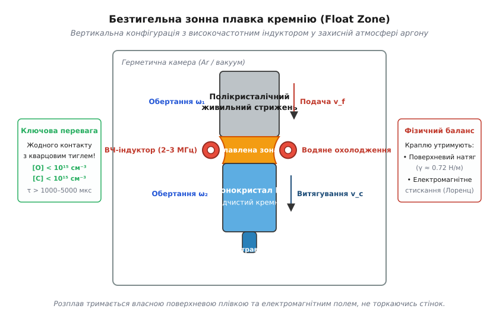
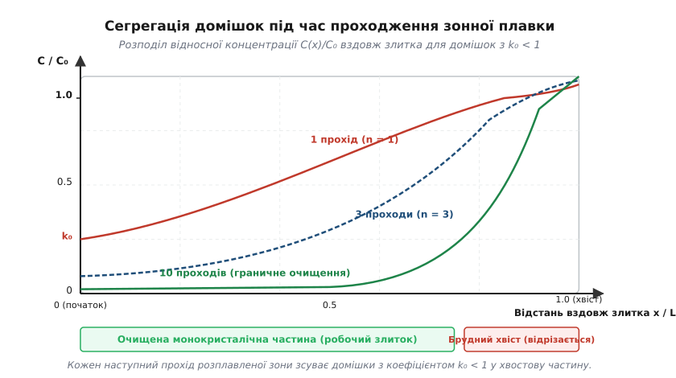
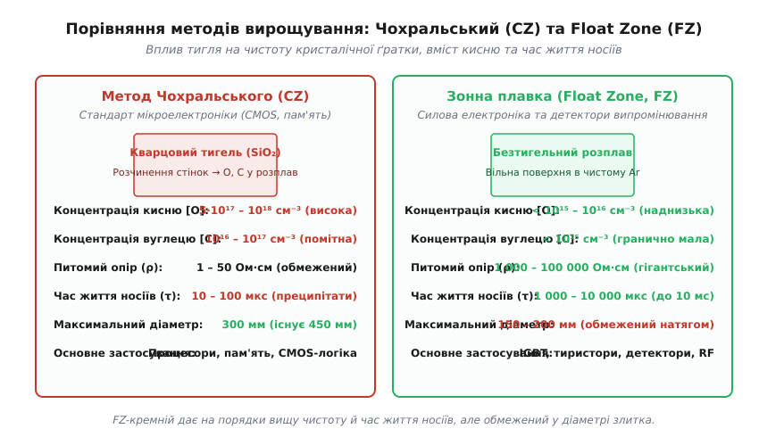
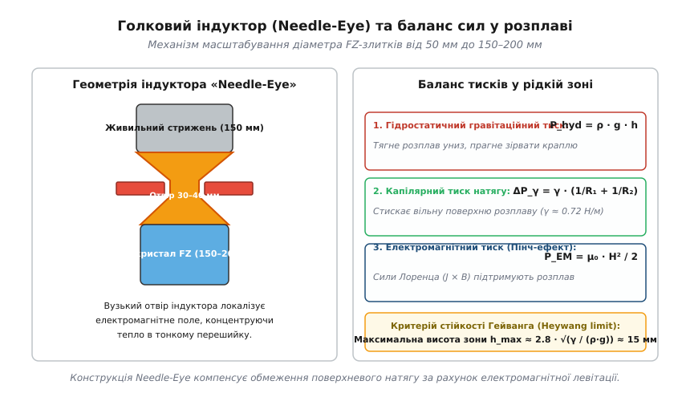
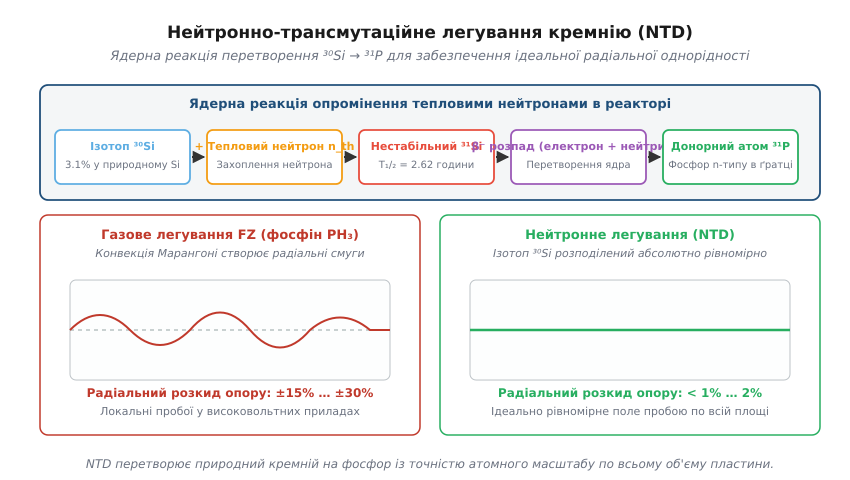
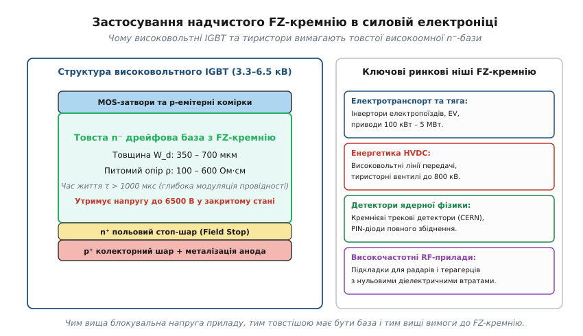

# Зонна плавка кремнію (Float Zone)

<preknowlist>
- [Кремній і монокристал](book:electronics/silicon-monocrystal) — вирощування монокристалів, метод Чохральського та базова сегрегація домішок.
- [Напівпровідник](book:physics/semiconductor) — зонна структура, власні та нерівноважні носії заряду в кристалічній ґратці.
- [Легування](book:physics/doping) — введення донорних і акцепторних атомів для створення заданого типу провідності.
- [PN-перехід](book:physics/pn-junction) — утворення збідненої області, бар'єрна ємність і механізм лавинного пробою.
- [Кремнієва межа: питомий опір і напруга пробою](book:electronics/silicon-limit) — зв'язок товщини дрейфової зони, легування та блокувальної напруги.
- [IGBT](book:electronics/igbt) — біполярний транзистор з ізольованим затвором і модуляція провідності товстої бази.
</preknowlist>

Коли високовольтний перетворювач тягового електровоза або підстанції лінії передачі постійного струму (HVDC) комутує напругу 3300 В чи 6500 В при струмі в кілька тисяч ампер, уся напруга мережі припадає на товсту слаболеговану кремнієву базу силового ключа — IGBT або тиристора. Щоб витримати таке електричне поле без лавинного пробою, кремнієва пластина повинна мати товщину 400–700 мкм і гігантський питомий опір порядку сотень або тисяч Ом·см, що відповідає надзвичайно малій концентрації легуючої домішки — менше одного атома фосфору на десять мільярдів атомів кремнію. Якщо виготовити такий прилад на звичайному кремнії, вирощеному стандартним методом Чохральського, кристал миттєво вийде з ладу.

Причина полягає у прихованому забрудненні з тигля. У методі Чохральського рідкий кремній плавиться у чаші з плавленого кварцу (`SiO₂`). За температури понад 1420 °C розплав невпинно розчиняє кварцові стінки, вбираючи в себе астрономічну кількість кисню — близько `10¹⁸ см⁻³` (один атом кисню на кожні п'ятдесят тисяч атомів кремнію), а також вуглець із графітових нагрівачів. Під час подальших технологічних нагрівів цей розчинений кисень збивається у мікроскопічні преципітати `SiO_x` та формує електрично активні комплекси — так звані термодонори. Термодонори неконтрольовано підвищують фонову провідність, обвалюючи блокувальну напругу в рази, а кисневі преципітати створюють мікродефекти, де концентрується напруженість поля й спалахує локальний мікроплазмовий пробій. Одночасно час життя неосновних носіїв заряду обвалюється з кількох мілісекунд до лічених мікросекунд, унеможливлюючи ефективну модуляцію провідності товстої бази.

Для подолання цієї фундаментальної межі застосовують **метод безтигельної зонної плавки** (англ. *Float Zone*, FZ). У ньому кремній взагалі не контактує з жодною твердою посудиною: вузька розплавлена зона утримується між двома стрижнями виключно власним поверхневим натягом та електромагнітним полем.

### Фізичний принцип локального безтигельного плавлення

Ідея безтигельної зонної плавки полягає у відмові від будь-якого матеріального тигля на користь локального розплавлення невеликої ділянки вертикально орієнтованого кремнієвого стрижня. 

У робочу камеру, заповнену інертним газом надвисокої чистоти (зазвичай аргоном під невеликим надлишковим тиском) або відкачану до глибокого вакууму, встановлюють вертикальний полікристалічний живильний стрижень (*feed rod*). Знизу до нього підводять монокристалічну затравку (*seed crystal*) з точно заданою кристалографічною орієнтацією ґратки — переважно `<111>` або `<100>`. Навколо стрижня розташовують мідний водоохолоджуваний індуктор, підключений до високочастотного генератора (типова робоча частота лежить у діапазоні від 2 до 3 МГц).


*Будова установки зонної плавки. Полікристалічний живильний стрижень плавиться індуктором, утворюючи висячу зону розплаву, яка кристалізується на обертовий монокристал без будь-якого контакту з тиглем.*

Нагрівання відбувається за рахунок електромагнітної індукції. Високочастотне змінне магнітне поле індуктора проникає в кремній і збуджує в ньому потужні вихрові струми (струми Фуко). Тут проявляється важлива фізична особливість кремнію: у твердому стані при кімнатній температурі чистий кремній є напівпровідником із помірною провідністю, проте при нагріванні до точки плавлення (1414 °C) його кристалічна ґратка руйнується, ковалентні зв'язки розриваються, і розплавлений кремній перетворюється на рідкий метал із густиною вільних електронів порядку `10²² см⁻³`. 

Питомий електричний опір рідкого кремнію становить лише `ρ_liq ≈ 7.5 · 10⁻⁵ Ом·см` — він проводить струм краще за рідке залізо чи ртуть. Завдяки високій провідності розплаву глибина скін-шару на частоті 2.5 МГц складає менше одного міліметра:

```
δ_skin = √(ρ_liq / (π · f · μ_0))
= √((7.5 · 10⁻⁷ Ом·м) / (3.14159 × 2.5 · 10⁶ Гц × 4π · 10⁻⁷ Гн/м))
≈ √(7.5 · 10⁻⁷ / 9.8696)
≈ 2.76 · 10⁻⁴ м = 0.28 мм
```

Уся електромагнітна енергія індуктора виділяється у вигляді тепла Джоуля в тонкому поверхневому шарі розплавленої зони. 

Коли між верхнім живильним стрижнем і нижньою затравкою формується стабільна рідка зона висотою 10–20 мм, механізм приводу починає повільно переміщувати індуктор угору вздовж стрижня (або, навпаки, опускати стрижні вниз крізь нерухомий індуктор) зі швидкістю кристалізації `v` порядку 1.5–3.5 мм/хв. На верхній (передній) межі рідкої зони вихідний полікристалічний стрижень безперервно підплавляється, віддаючи речовину в розплав. Одночасно на нижній (задній) межі кремній охолоджується нижче температури плавлення і кристалізується на монокристалічну підкладку, атом за атомом копіюючи бездоганну структуру затравки.

Щоб тепловий потік був строго симетричним, а фронт кристалізації — ідеально круглим, верхній живильний стрижень і нижній ростучий монокристал безперервно обертають у протилежних напрямках (*counter-rotation*) зі швидкістю 10–30 обертів на хвилину. Протитечійне обертання створює інтенсивне гідродинамічне перемішування всередині рідкої краплі, вирівнюючи температурні поля та концентрацію речовини по всьому перерізу.

Оскільки розплавлена крапля кремнію стикається лише з інертним газом високої чистоти і власними твердими торцями, у процесі повністю відсутні будь-які сторонні матеріали. Це позбавляє кристал головного джерела забруднення в мікроелектроніці — контакту з розігрітим кварцом або графітом.

Історичний шлях створення цього безтигельного методу — від перших патентів лабораторій Bell Labs і Siemens до подолання перших бар'єрів діаметра — детально описано у вставці [📜 Народження безтигельної плавки: від Bell Labs до силових мегаватів](book:electronics/float-zone-silicon/hist-float-zone-birth.md).

### Механізм сегрегації домішок на фронті кристалізації

Переміщення розплавленої зони вздовж стрижня не просто перетворює полікристал на монокристал, а й виконує глибоке хімічне очищення матеріалу завдяки явищу **сегрегації** (від латинського *segregatio* — відділення).

Коли рідина кристалізується, атоми кремнію шикуються у жорстку тетраедричну алмазоподібну ґратку з гібридизацією зв'язків `sp³`. Будь-який сторонній атом домішки (залізо, мідь, золото, вуглець) має інший атомний радіус і конфігурацію електронних оболонок. Вбудовування такого атома у вузол кристалічної ґратки викликає сильне локальне пружне напруження й вимагає додаткової енергії. Навпаки, у рідкому розплаві панує невпорядкована структура, де чужорідний атом легко оточується рухливими сусідами без енергетичних штрафів.

Тому більшості домішок енергетично вигідніше залишатися в рідкій фазі, ніж переходити у твердий кристал. На межі фазового переходу твердий кристал виштовхує домішки назад у розплав. Кількісною мірою цього процесу є **рівноважний коефіцієнт сегрегації** `k_0`, що визначається як відношення концентрації домішки у твердій фазі `C_S` до її концентрації в розплаві `C_L` у стані термодинамічної рівноваги:

```
k_0 = C_S / C_L
```

Для переважної більшості хімічних елементів у кремнії величина `k_0` є значно меншою за одиницю (`k_0 ≪ 1`):
- Залізо (`Fe`): `k_0 = 8 · 10⁻⁶` (із мільйона атомів заліза в розплаві кристал захоплює лише 8!);
- Золото (`Au`): `k_0 = 2 · 10⁻⁵`;
- Мідь (`Cu`): `k_0 = 4 · 10⁻⁴`;
- Вуглець (`C`): `k_0 = 0.07`;
- Фосфор (`P`): `k_0 = 0.35`;
- Арсен (`As`): `k_0 = 0.30`.

Винятком серед домішок є лише бор (`B`), ковалентний радіус якого дуже близький до кремнію, через що його коефіцієнт сегрегації складає `k_0 = 0.80`, що робить очищення кремнію від бору чистою кристалізацією малоефективним.


*Профіль концентрації домішок вздовж злитка. З кожним проходом розплавленої зони домішки з коефіцієнтом сегрегації k₀ < 1 зміщуються до кінця стрижня, залишаючи основну частину надчистою.*

Під час руху розплавленої зони довжиною `l` вздовж стрижня довжиною `L` розплав працює як «хімічний пилосос»: він розчиняє брудний вихідний полікремній на передньому фронті, залишає чистий кристал позаду себе і накопичує домішки всередині рідкої краплі.

Математичний опис розподілу концентрації домішки `C_s(x)` вздовж координати `x` після одного проходу зони описується класичним рівнянням Пфанна:

```
C_s(x) = C_0 · [1 - (1 - k) · exp(-k · x / l)]
```

На самому початку злитка (`x = 0`) концентрація домішки падає до мінімуму `C_s(0) = k · C_0`. У міру просування зони концентрація домішки в розплаві зростає через постійне виштовхування з кристала. Коли зона проходить кілька своїх довжин, настає динамічна рівновага: кількість домішки, що входить у зону при плавленні, зрівнюється з кількістю, що захоплюється кристалом, і концентрація виходить на початковий рівень `C_0`. 

Проте коли зона досягає самого кінця стрижня (`x = L - l`), рух припиняється, і вся накопичена в розплаві маса домішок застигає в останньому кінцевому сегменті. Цей забруднений хвостовий сегмент після охолодження просто механічно відрізають алмазною пилкою та відправляють на вторинну переробку.

Якщо повторити зонну плавку кілька разів поспіль (багатопрохідне очищення, *multi-pass zone refining*), кожен наступний прохід зсуває залишковий бруд дедалі далі до кінця злитка. Після 5–10 проходів фонова концентрація важких металів у робочій частині злитка падає нижче `10¹¹ см⁻³`, що відповідає хімічній чистоті кремнію понад 99.999999999% (одинадцять дев'яток, 11N).

Повний математичний вивід рівняння Пфанна, модель примежового дифузійного шару Бертона–Пріма–Сліхтера (BPS) для ефективного коефіцієнта `k_eff` та розрахунок граничного профілю очищення подано у вставці [🧮 Фізичні моделі зонної плавки: сегрегація, стійкість краплі та пробійна напруга](book:electronics/float-zone-silicon/math-float-zone-physics.md).

### Відмінність від методу Чохральського: чистота від кисню та вуглецю

Щоб зрозуміти, чому FZ-кремній є незамінним для силових приладів, необхідно детально зіставити його з кремнієм, вирощеним за методом Чохральського (CZ), який домінує у виробництві мікропроцесорів та пам'яті.


*Порівняння властивостей кремнію CZ та FZ. Відсутність контакту з кварцовим тиглем забезпечує FZ-кремнію на три порядки менший вміст кисню і в десятки разів довший час життя носіїв.*

Головна відмінність лежить у термодинаміці взаємодії з контейнером:

#### 1. Вміст кисню ([O])
У методі CZ розплавлений кремній перебуває у прямому контакті зі стінками кварцового тигля (`SiO₂`). Кремній розчиняє кварц зі швидкістю в кілька мікрометрів на годину:

```
Si(рідкий) + SiO₂(твердий) → 2 SiO(розчин у розплаві)
```

Більша частина утвореного монооксиду кремнію `SiO` випаровується з вільної поверхні розплаву в атмосферу аргону, але значна частка (близько 10–15%) переноситься конвективними потоками до фронту росту і захоплюється кристалом. У результаті CZ-кремній містить інтерстиційний (міжвузловий) кисень `O_i` у величезній концентрації:

```
[O]_CZ ≈ (5 – 10) · 10¹⁷ см⁻³
```

У методі FZ кварцового тигля немає взагалі. Єдиним джерелом кисню можуть бути мікродомішки у вихідному полікремнії та залишковий газ в аргоновій камері. Тому концентрація кисню у FZ-кремнії становить:

```
[O]_FZ < 10¹⁵ – 10¹⁶ см⁻³
```

Це на три порядки (у 100–1000 разів) нижче, ніж у кремнії Чохральського.

#### 2. Вміст вуглецю ([C])
У печі Чохральського встановлено потужні графітові нагрівачі та теплоізоляцію. Пари `SiO`, що випаровуються з розплаву, реагують із розжареним графітом, утворюючи монооксид вуглецю `CO`, який знову розчиняється в розплаві:

```
SiO(газ) + 2 C(твердий) → SiC(твердий) + CO(газ)
CO(газ) + Si(рідкий) → C(у розплаві) + SiO(газ)
```

Через це CZ-кремній містить вуглець у концентрації `[C] ≈ 10¹⁶ – 10¹⁷ см⁻³`. У безтигельній FZ-установці графітові нагрівачі відсутні (нагрів здійснюється чистою мідною ВЧ-котушкою), тому вміст вуглецю падає до рівня нижче порогу виявлення: `[C]_FZ < 10¹⁵ см⁻³`.

#### 3. Термічні донори та стабільність опору
При нагріванні кремнію до температур 400–500 °C (стандартний діапазон температур для пасивації, осадження діелектриків або спікання металевих контактів) розчинені поодинокі атоми кисню в CZ-кремнії починають дифундувати та об'єднуватися у кластери з 4–6 атомів навколо вакансій. Такі кластери утворюють мілководні подвійні донори — **термічні донори** (*Thermal Donors, TD*). 

У CZ-кремнії концентрація термодонорів може досягати `10¹⁵ – 10¹⁶ см⁻³`. Для низькоомного кремнію цифрових мікросхем (де концентрація корисної домішки становить `10¹⁷ – 10¹⁸ см⁻³`) додаткові `10¹⁵ см⁻³` електронів непомітні. Але для силової електроніки, де робоча концентрація фосфору повинна бути строго на рівні `10¹³ см⁻³` (питомий опір сотні Ом·см), поява `10¹⁵ см⁻³` паразитного кисневого фосфороподібного заряду є смертельною: вона знижує опір кристала у 100 разів і повністю руйнує високовольтні властивості приладу.

У FZ-кремнії через відсутність кисню термодонори не утворюються взагалі. Його питомий опір зберігає абсолютну термостабільність при будь-яких високотемпературних відпалах.

#### 4. Час життя неосновних носіїв заряду
Киснево-вуглецеві комплекси та домішки важких металів у кремнії утворюють глибокі енергетичні рівні посередині забороненої зони, які працюють як надзвичайно ефективні центри безвипромінювальної рекомбінації за механізмом Шоклі–Ріда–Холла (SRH). 

У CZ-кремнії час життя неосновних носіїв заряду (електронів у p-базі або дірок у n-базі) рідко перевищує `τ ≈ 10 – 100 мкс`. У надчистому FZ-кремнії вільний пробіг носіїв не обмежується дефектами, і час життя сягає рекордних значень:

```
τ_FZ ≈ 1000 – 10 000 мкс (1 – 10 мілісекунд)
```

Довгий час життя носіїв означає величезну дифузійну довжину `L_d = √(D · τ)` — до 2–3 міліметрів. Завдяки цьому інжектовані носії заряду здатні безперешкодно пронизувати всю товщу 500-мікрометрової напівпровідникової пластини, забезпечуючи глибоку **модуляцію провідності** бази силового IGBT або тиристора у відкритому стані.

| Параметр | Кремній Чохральського (CZ) | Безтигельний кремній (FZ) |
| :--- | :--- | :--- |
| **Контакт із тиглем** | Прямий контакт із розжареним `SiO₂` | Повна відсутність контакту |
| **Концентрація кисню `[O]`** | `5 · 10¹⁷ – 10¹⁸ см⁻³` | `< 10¹⁵ – 10¹⁶ см⁻³` |
| **Концентрація вуглецю `[C]`** | `10¹⁶ – 10¹⁷ см⁻³` | `< 10¹⁵ см⁻³` |
| **Діапазон питомого опору `ρ`** | `0.001 – 50 Ом·см` | `10 – 100 000 Ом·см` |
| **Час життя носіїв `τ`** | `10 – 100 мкс` | `1 000 – 10 000 мкс (до 10 мс)` |
| **Термодонори при 450 °C** | Генеруються (`10¹⁵ см⁻³`) | Практично відсутні |
| **Максимальний діаметр злитка** | До 300 мм (є прототипи 450 мм) | 150–200 мм (фізична межа) |
| **Собівартість вирощування** | Низька (масовий стандарт) | Висока (у 3–5 разів дорожче) |

### Обмеження максимального діаметра та голковий індуктор

Якщо FZ-кремній настільки перевершує CZ за чистотою та електричними параметрами, чому вся світова індустрія мікроелектроніки не перейшла на нього повністю? 

Відповідь полягає у жорстких законах гідродинаміки та поверхневого натягу: **метод зонної плавки має фундаментальну фізичну стелю діаметра злитка**, яку неможливо подолати простим збільшенням розміру машини.

У методі Чохральського розплав спирається на жорстке дно і стінки гігантського тигля діаметром до одного метра, який може утримувати сотні кілограмів рідкого кремнію, дозволяючи витягувати злитки діаметром 300 мм і довжиною понад два метри.

У методі FZ розплавлена зона буквально висить у повітрі між двома стрижнями. Її утримує лише різниця капілярного тиску Лапласа на вільній поверхні меніска, що прагне стиснути краплю:

```
ΔP_γ = γ · (1 / R_1 + 1 / R_2)
```

де `γ ≈ 0.72 Н/м` — коефіцієнт поверхневого натягу рідкого кремнію, а `R_1, R_2` — радіуси кривини рідкої поверхні.

Цьому капілярному утриманню протидіє сила тяжіння — гідростатичний тиск стовпчика рідини висотою `h`:

```
P_hyd = ρ_liq · g · h
```

де `ρ_liq = 2570 кг/м³` — густина розплавленого кремнію, а `g = 9.81 м/с²`.


*Конструкція індуктора Needle-Eye та баланс сил у розплаві. Електромагнітне поле високої частоти створює стискальний пінч-ефект, що компенсує гідростатичний тиск розплаву.*

Класичний розрахунок Вальтера Гейванга показує, що максимальна висота стабільної рідкої зони, яку здатна утримати власна плівка поверхневого натягу, становить:

```
h_max ≈ 2.8 · √(γ / (ρ_liq · g)) ≈ 15 мм
```

Якщо діаметр вихідного стрижня збільшувати при використанні звичайного кільцевого індуктора, висота зони неминуче зростає пропорційно діаметру, щоб тепло від індуктора встигло прогріти центр стрижня. Щойно висота рідкої зони перевищує 15–20 мм, гідростатичний тиск прориває бічний меніск, і розплав кремнію стікає вниз, повністю зриваючи процес. Через це перші FZ-установки були обмежені злитками діаметром лише 25–35 мм.

Технологічним проривом, що дозволив збільшити діаметр до 150 і 200 мм, став винахід **голкового індуктора** (*needle-eye inductor*).

Голковий індуктор виготовляють у вигляді товстого плоского мідного диска з одним витком, центральний отвір якого має діаметр лише 30–40 мм — значно менше за діаметр живильного стрижня (150–200 мм). Завдяки такій конструкції:

1. **Геометричне звуження розплаву:** Верхній товстий стрижень плавиться конусом. Рідкий кремній стікає у вузький отвір індуктора, утворюючи тонкий перешийок, площа якого відповідає умові капілярної стійкості, а під індуктором розширюється назад у товстий монокристал діаметром 150–200 мм.
2. **Високочастотна електромагнітна левітація:** Густина ВЧ-струму на внутрішній кромці отвору індуктора досягає десятків тисяч ампер на квадратний сантиметр. Сильне локальне магнітне поле високої частоти створює електромагнітний стискальний тиск — **пінч-ефект** (*magnetic pinch effect*):
   ```
   P_EM = (μ_0 · H²) / 2
   ```
   Сили Лоренца, що виникають від взаємодії індукованих поверхневих струмів із власним магнітним полем, спрямовані всередину і вгору. Вони буквально підтримують нижню частину розплавленої краплі, компенсуючи до 30–40% ваги стовпчика рідини.

Проте навіть із голковими індукторами діаметр 200 мм (8 дюймів) залишається крайньою межею технології FZ. Вирощування злитків діаметром 300 мм за методом FZ вважається фізично неможливим у гравітаційному полі Землі (експерименти з безтигельної плавки надвеликих діаметрів без обмеження ваги проводилися лише в умовах мікрогравітації на орбітальних станціях). 

Саме тому сучасні мікропроцесори з їхніми мільярдними серіями виготовляють на 300-міліметрових пластинах CZ, а FZ-кремній займає спеціалізовані ринки пластин діаметром 100, 150 та 200 мм, де параметри якості переважають над масштабною геометрією.

### Проблема однорідності легування та нейтронна трансмутація (NTD)

Надчистий кремній сам по собі є ізолятором. Щоб виготовити напівпровідниковий прилад, у нього необхідно ввести строго контрольовану кількість донорної домішки (зазвичай фосфору) для створення n-типу провідності.

Здавалося б, найпростіший шлях — додавати під час зонної плавки газоподібний фосфін (`PH₃`) у потік аргону, що омиває розплавлену зону (газове легування). Проте спроба створити високоомний кремній газовим методом натрапляє на непереборну фізичну перешкоду — **термокапілярну конвекцію Марангоні**.

Оскільки вільна поверхня рідкої краплі контактує з холодним газом, а поблизу індуктора діє потужний локальний нагрів, вздовж поверхні розплаву виникає гігантський температурний градієнт — до 100–200 °C на сантиметр. Поверхневий натяг кремнію сильно залежить від температури (`dγ/dT < 0`), тому рідина на поверхні починає хаотично рухатися від гарячих зон до холодних зі швидкістю в десятки сантиметрів на секунду. 

Разом із дією електромагнітних сил індуктора конвекція Марангоні породжує нестаціонарні турбулентні вихори в розплаві. У результаті товщина дифузійного примежового шару `δ` на фронті кристалізації неперервно пульсує. Це спричиняє мікросегрегацію домішок: концентрація фосфору в застиглому кристалі коливається з періодом у кілька міліметрів, формуючи так звану смугасту шаруватість (*doping striations*).

Радіальний розкид питомого опору пластини при газовому легуванні сягає:

```
Δρ / ρ_avg = ±15% … ±30%
```

Для високовольтного IGBT на 3.3 кВ такий розкид фатальний. Якщо середня напруга лавинного пробою розрахована на 3800 В, то в локальній ділянці пластини з 30-відсотковим просіданням опору напруга пробою впаде нижче 2800 В. При роботі модуль миттєво згорить через локальний шнуровий пробій у найслабшому місці кристала.


*Ланцюг реакції нейтронно-трансмутаційного легування та порівняння однорідності питомого опору. Перетворення ізотопу ³⁰Si на фосфор дає неперевершену радіальну стабільність провідності.*

Ідеальним вирішенням цієї проблеми стало **нейтронно-трансмутаційне легування** (англ. *Neutron Transmutation Doping*, NTD).

Природний кремній є стабільною сумішшю трьох ізотопів:
- Кремній-28 (`²⁸Si`): 92.23%;
- Кремній-29 (`²⁹Si`): 4.67%;
- Кремній-30 (`³⁰Si`): 3.10%.

Оскільки вихідний кремній вирощено методом зонної плавки з надвисокою чистотою, розподіл стабільного ізотопу `³⁰Si` по всьому об'єму монокристалічного злитка є ідеально однорідним на атомарному рівні.

Злиток надчистого FZ-кремнію поміщають у робочу зону ядерного реактора й опромінюють потоком теплових (повільних) нейтронів `n_th` з густиною потоку близько `10¹² – 10¹⁴ нейтронів/(см² · с)`. Тепловий нейтрон із високою ймовірністю захоплюється ядром ізотопу `³⁰Si`, запускаючи ланцюг ядерних перетворень:

```
³⁰Si + n_th → ³¹Si + γ(гамма-квант)
³¹Si ──(β⁻ розпад, T_1/2 = 2.62 год)──→ ³¹P + e⁻ + ν̄_e
```

Утворене нестабільне ядро кремнію-31 випромінює бета-частинку (електрон) та антинейтрино з періодом напіврозпаду 2.62 години і зазнає трансмутації, перетворюючись на стабільне ядро **фосфору-31 (`³¹P`)** — класичного мілководного донора для кремнію.

Оскільки проникна здатність теплових нейтронів у кремнії є дуже високою (довжина вільного пробігу становить десятки сантиметрів), опромінення проходить рівномірно крізь усю товщу злитка. Кількість утворених атомів фосфору залежить виключно від сумарної інтегральної дози нейтронів (флюенсу):

```
N_D(P) = N_Si · f_iso · σ_c · Φ_n
```

де:
- `N_Si = 5 · 10²² см⁻³` — атомна густина кремнію;
- `f_iso = 0.031` — частка ізотопу `³⁰Si`;
- `σ_c = 0.107 барн = 0.107 · 10⁻²⁴ см²` — переріз захоплення теплових нейтронів ядром `³⁰Si`;
- `Φ_n = ∫ φ_n dt` — інтегральний флюенс нейтронів.

Після опромінення в реакторі злиток витримують у спеціальному сховищі впродовж кількох днів до повного спаду наведеної радіоактивності (завдяки малому періоду напіврозпаду `³¹Si` матеріал швидко стає абсолютно безпечним). 

У процесі опромінення швидкі нейтрони та гамма-кванти вибивають атоми кремнію з вузлів ґратки, створюючи радіаційні дефекти — вакансії та міжвузлові дефекти Френкеля, а новоутворені атоми фосфору перебувають у міжвузлях і є електрично неактивними. Щоб залікувати ґратку та активувати домішку, злиток піддають відпалу в печі при температурі близько 750–800 °C упродовж 1–2 годин. Усі атоми фосфору займають правильні вузли кристалічної ґратки.

Результат вражає: **радіальний розкид питомого опору в NTD-FZ кремнії становить менше 1–2%** по всій площі пластини діаметром до 200 мм. На сьогодні понад 90% усього кремнію для високовольтних тиристорів та силових IGBT модулів класу вище 1700 В легується виключно методом нейтронної трансмутації.

### Застосування у високовольтній силовій електроніці, детекторах та RF-приладах

Унікальна комбінація властивостей FZ-кремнію — нульовий вміст кисневих преципітатів, високий та однорідний питомий опір (до 100 000 Ом·см) і рекордно довгий час життя носіїв заряду — робить його безальтернативною основою для трьох критичних сегментів високих технологій.


*Внутрішня структура високовольтного IGBT та ключові ніші застосування FZ-кремнію. Товста високоомна n⁻-база утримує тисячі вольт і вимагає рекордного часу життя носіїв.*

#### 1. Силова електроніка високої та надвисокої потужності
Силові напівпровідникові прилади керують потоками електричної енергії від сотень кіловат до гігават у таких системах:
- **Тягові перетворювачі транспорту:** Інвертори електропоїздів (TGV, Intercity-Express, Shinkansen), метрополітену, кар'єрних самоскидів та сучасного електротранспорту.
- **Енергетика та HVDC:** Високовольтні тиристорні вентилі ліній передачі постійного струму на напруги до ±800 кВ, статичні компенсатори реактивної потужності (STATCOM), інвертори вітрових та сонячних електростанцій мегаватного класу.
- **Промисловий електропривод:** Частотно-регульовані приводи прокатних станів, потужних насосів і компресорів.

У приладах із робочою напругою 1.2 кВ, 1.7 кВ, 3.3 кВ, 4.5 кВ та 6.5 кВ (високовольтні IGBT, IGCT, GTO-тиристори та швидкодіючі діоди FRD) у закритому стані електричне поле розширюється на сотні мікрометрів углиб `n⁻`-бази. 

Щоб прилад витримував напругу, концентрація донорів у базі повинна бути надзвичайно низькою:
- Для 3.3 кВ IGBT: `N_D ≈ 3 · 10¹³ см⁻³` (`ρ ≈ 150 Ом·см`), товщина бази `W_d ≈ 380 мкм`;
- Для 6.5 кВ IGBT: `N_D ≈ 1.5 · 10¹³ см⁻³` (`ρ ≈ 300 – 400 Ом·см`), товщина бази `W_d ≈ 650 – 750 мкм`.

У відкритому стані через таку товсту базу повинен протікати прямий струм густиною 100–200 А/см² із мінімальним спадом напруги (не більше 2.5–3.0 В). Це можливо лише завдяки двосторонній інжекції дірок та електронів (модуляція провідності), яка затоплює базу плазмою носіїв заряду з концентрацією `10¹⁶ – 10¹⁷ см⁻³`, знижуючи її ефективний опір у тисячі разів. 

Якщо час життя носіїв `τ` малий (як у CZ-кремнії), носії рекомбінують, не встигнувши долетіти до середини бази, спад напруги зростає до десятків вольт, і прилад миттєво плавиться від колосальних теплових втрат. Тільки FZ-кремній із часом життя `τ > 1 мс` забезпечує повне затоплення бази та мінімальні втрати провідності.

#### 2. Детектори ядерного випромінювання та фізика високих енергій
У трекових детекторах елементарних частинок на Великому адронному колайдері (CERN, експерименти ATLAS, CMS, ALICE), а також у кремнієвих дрейфових детекторах рентгенівського випромінювання (SDD) і гамма-спектрометрах робочим об'ємом є вся товщина кремнієвої пластини (300–500 мкм).

Принцип роботи полягає у створенні PIN-діода, який у режимі зворотного зміщення повинен бути **повністю збіднений** (відсутні вільні носії заряду в усьому об'ємі пластини). Коли заряджена частинка або квант пролітає крізь збіднений кремній, вона іонізує атоми, створюючи електронно-діркові пари, які дрейфують до електродів під дією прикладеного поля, генеруючи наносекундний імпульс струму.

Напруга повного збіднення пластини товщиною `W` описується формулою:

```
V_dep = (q · N_eff · W²) / (2 · ε_Si · ε_0)
```

Щоб напруга повного збіднення пластини товщиною 500 мкм становила безпечні та зручні для електроніки 50–100 В, ефективна концентрація фонових домішок `N_eff` повинна бути меншою за `5 · 10¹¹ см⁻³`, що відповідає надвисокому питомому опору:

```
ρ > 10 000 – 30 000 Ом·см
```

Отримати монокристалічний кремній із таким фантастичним рівнем власної чистоти (High-Resistivity Silicon, HR-Si) фізично можливо виключно багатопрохідною безтигельною зонною плавкою FZ у вакуумі.

#### 3. Високочастотні (RF) прилади та міліметрова оптика
У бездротових системах міліметрового діапазону (5G/6G, автомобільні радари 77–81 ГГц, терагерцова спектроскопія) провідність напівпровідникової підкладки є джерелом паразитного поглинання електромагнітної хвилі та втрат добротності інтегрованих котушок індуктивності й ліній передачі.

Тангенс кута діелектричних втрат підкладки прямо залежить від її питомого опору:

```
tan(δ) = 1 / (2π · f · ε_Si · ε_0 · ρ)
```

При використанні високоомного FZ-кремнію з `ρ > 10 000 Ом·см` на частоті 100 ГГц тангенс втрат становить менше `10⁻⁴`, що робить FZ-кремній чудовим діелектриком із низькими втратами, співмірним із кварцом або сапфіром, але значно дешевшим і придатним для прямої інтеграції мікросхем. Крім того, завдяки високому показнику заломлення (`n ≈ 3.42`) та нульовому поглинанню у далекому ІЧ-діапазоні, з надчистого FZ-кремнію виготовляють високоточні дифракційні лінзи та вікна для терагерцових лазерів і космічних телескопів.

---

> 🔧 **Навіщо це.** Якщо ви займаєтеся розробкою силових перетворювачів, інверторів або прецизійної аналогової техніки, вибір типу підкладки визначає межі можливого для вашої системи:
> 
> 1. **Діагностика надійності IGBT:** Якщо в технічній документації на силіконовий кристал або модуль зазначено підкладку *NTD-FZ (Neutron Transmutation Doped Float Zone)*, це гарантує найвищу однорідність поля пробою, мінімальний струм витоку за максимальної температури переходу (150–175 °C) та стійкість до циклічних перевантажень.
> 2. **Розуміння компромісу між ціною та напругою:** При напругах до 600–1200 В кремній Чохральського (особливо сучасний магнітний MCZ — *Magnetic Czochralski*, де розплав гальмують постійним магнітним полем для зниження розчинення тигля) успішно конкурує з FZ за рахунок більшого діаметра пластин (300 мм проти 200 мм) і меншої вартості. Проте при напругах вище 1700 В безтигельний FZ-кремній залишається безальтернативним стандартом фізики.
> 3. **Конкуренція з карбідом кремнію (SiC):** Поява широкозонних напівпровідників SiC та GaN активно витісняє кремній у діапазоні 650–1700 В завдяки здатності витримувати вищі температури та частоти. Проте в мегаватному класі (3300–6500 В, тисячі ампер) надчистий FZ-кремній діаметром 150–200 мм завдяки гігантському часу життя носіїв та ідеальній радіальній однорідності ще десятиліттями утримуватиме лідерство в глобальній енергетиці та магістральному транспорті.
