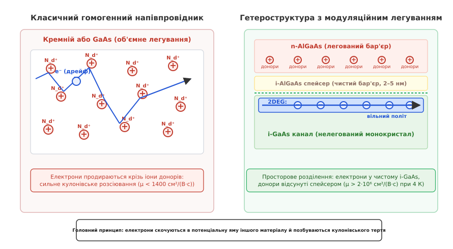
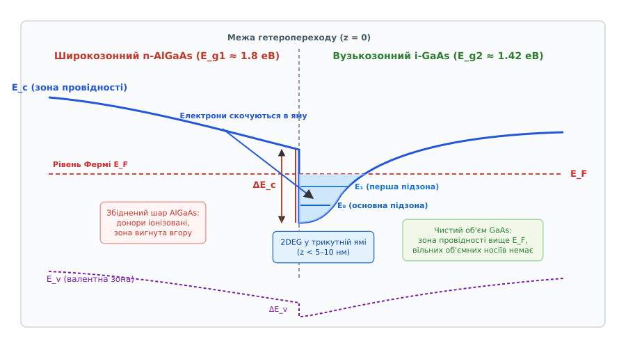
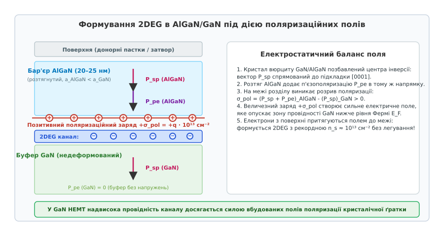
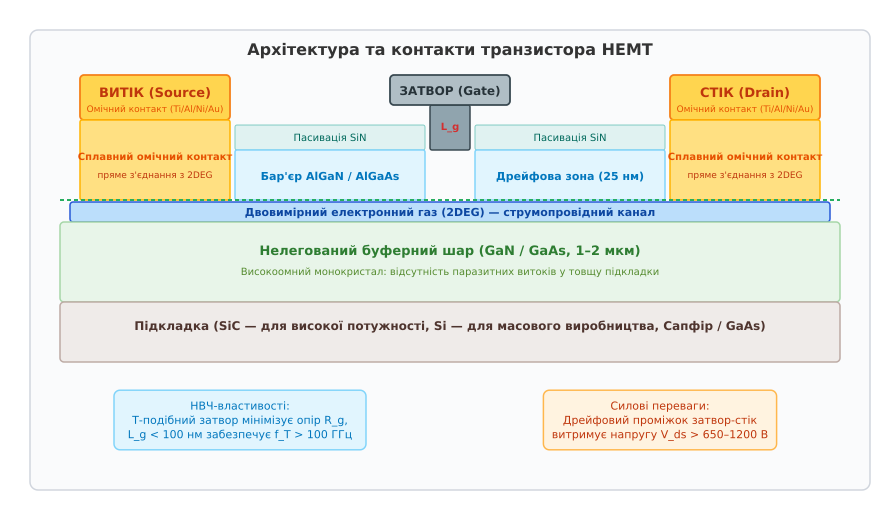

# HEMT і двовимірний електронний газ (2DEG)

<preknowlist>
- [Будова MOSFET](book:electronics/mosfet-structure) — планарний канал, затвор-ізолятор, витік і стік.
- [Поріг MOSFET](book:electronics/mosfet-threshold) — наведення інверсійного каналу полем затвора.
- [Шар за шаром](book:electronics/doping-etching-metal) — легування, епітаксія та пошарове формування напівпровідникових структур.
- [FinFET](book:electronics/finfet) — об'ємне оточення каналу та подолання короткоканальних ефектів.
</preknowlist>

Коли розробники напівпровідникових приладів намагаються підвищити струм і швидкодію класичного польового транзистора, вони неминуче стикаються з фундаментальним протиріччям: щоб канал проводив великий струм, у ньому має бути багато вільних електронів, але єдиний спосіб отримати ці електрони в гомогенному напівпровіднику — ввести в кристал донорні атоми домішки. Щойно концентрацію домішок піднімають вище `10¹⁸ см⁻³`, кожен донорний атом віддає свій електрон у зону провідності й перетворюється на нерухомий позитивний іон. Вільні електрони під час руху каналом змушені безперервно стикатися з кулонівським електричним полем цих самих іонів. У результаті рухливість електронів у кремнії падає з фундаментальних `1400 см²/(В·с)` до мізерних `100–200 см²/(В·с)`, а спроба охолодити прилад лише погіршує ситуацію — при низьких температурах повільні електрони ще сильніше відхиляються кулонівськими центрами.

Єдиним виходом із цього глухого кута став винахід **транзистора з високою рухливістю електронів** (*High Electron Mobility Transistor, HEMT*), у якому атоми домішок просторово відокремлені від зони протікання струму за допомогою гетеропереходу двох різних напівпровідників.

### Фізичний глухий кут гомогенного каналу: кулонівське гальмування

У класичному кремнієвому [MOSFET](book:electronics/mosfet-structure) або польовому транзисторі на арсеніді галію з бар'єром Шотткі (MESFET) струмопровідний канал формується в однорідному за хімічним складом матеріалі. Густина струму в такому каналі визначається базовим рівнянням провідності:

```
J = q · n · μ · E
```

де `q` — елементарний заряд (`1.602 · 10⁻¹⁹ Кл`), `n` — концентрація вільних носіїв заряду в одиниці об'єму, `μ` — рухливість електронів, `E` — поздовжнє електричне поле між витоком і стоком.

З цього рівняння випливає очевидне інженерне бажання: щоб зменшити опір відкритого каналу `R_on` та підвищити граничну тактову частоту, необхідно одночасно максимізувати концентрацію `n` та рухливість `μ`. Проте в гомогенному кристалі ці дві величини зв'язані жорсткою зворотною залежністю через механізм **розсіювання на іонізованих домішках** (*ionized impurity scattering* або кулонівське розсіювання).


*Зліва: у гомогенному напівпровіднику електрони продираються крізь іонізовані донори, втрачаючи швидкість через кулонівські зіткнення. Справа: у гетероструктурі з модуляційним легуванням донори залишаються в широкозонному шарі AlGaAs, а електрони скочуються в чистий i-GaAs, утворюючи високорухливий 2DEG.*

Коли атом домішки (наприклад, кремній у ґратці GaAs або фосфор у кремнії) іонізується, він створює навколо себе кулонівський потенціал `V(r) = q / (4πε · r)`. Електрон, що рухається повз такий іон зі швидкістю теплового або дрейфового руху, притягується до позитивного заряду й змінює напрямок свого імпульсу. 

Час вільного пробігу електрона між зіткненнями з домішками описується формулою Конуелл — Вайскопфа (*Conwell-Weisskopf formula*):

```
τ_imp ∝ (T^(3/2)) / (N_d · ln(1 + α · T² / N_d^(2/3)))
```

де `N_d` — концентрація іонізованих донорів, `T` — абсолютна температура, `α` — коефіцієнт, що враховує діелектричну проникність та ефективну масу.

З формули видно дві руйнівні закономірності:
1. **Зростання концентрації домішок прямо пропорційно знижує час вільного пробігу:** `τ_imp ∝ 1 / N_d`. При `N_d > 10¹⁸ см⁻³` середня відстань між донорами скорочується до менш ніж 10 нанометрів, і електрон взагалі перестає рухатися вільно — його траєкторія перетворюється на безперервне дифузійне блукання між центрами тяжіння.
2. **Зниження температури зменшує рухливість:** `μ_imp ∝ T^(3/2)`. На відміну від фононного розсіювання (коливання кристалічної ґратки, які затухають при охолодженні), кулонівське розсіювання на іонах при низьких температурах різко посилюється. Повільний холодний електрон довше перебуває в зоні дії електричного поля іона і тому відхиляється на значно більший кут, ніж швидкий гарячий електрон.

У результаті гомогенний напівпровідник ставить фізичний бар'єр: неможливо створити канал, який був би одночасно високопровідним (висока `n`) та швидкодіючим (висока `μ`). Більше про те, як фізики намагалися обійти це обмеження на початку ери напівпровідників, описано в [📜 народженні HEMT і розвитку технології MBE](book:electronics/hemt-2deg/hist-hemt-birth.md).

### Модуляційне легування: просторове розділення зарядів

Розв'язанням цієї дилеми став принцип **модуляційного легування** (*modulation doping*), вперше застосований для напівпровідникових гетероструктур.

Ідея полягає в тому, щоб виростити гетероперехід між двома різними напівпровідниками, які мають різні ширини забороненої зони:
- **Широкозонний матеріал** (наприклад, алюміній-галій арсенід `Al_x Ga_{1-x} As` із шириною забороненої зони `E_g1 ≈ 1.8–2.0 еВ`);
- **Вузькозонний матеріал** (наприклад, арсенід галію `GaAs` із шириною забороненої зони `E_g2 = 1.42 еВ`).

Ключовий крок полягає у вибірковому просторовому розподілі легувальної домішки:
1. Широкозонний шар `AlGaAs` сильно легують донорами кремнію (`n-AlGaAs`) до концентрації `N_d ≈ 10¹⁸ см⁻³`;
2. Вузькозонний шар `GaAs` залишають абсолютно чистим, нелегованим (*intrinsic*, `i-GaAs`), де фонова концентрація дефектів не перевищує `10¹⁴–10¹⁵ см⁻³`.

На межі гетеропереходу виникає стрибок зони провідності **ΔE_c** (енергетичний розрив зон), зумовлений різницею електронної спорідненості двох матеріалів `Δχ = χ(GaAs) - χ(AlGaAs)`. За правилом електронної спорідненості Андерсона (*Anderson's rule*), взаємне розташування зон визначається відстанню від дна зони провідності до вакуумного рівня енергії. 

За класифікацією гетеропереходів розрізняють три типи вирівнювання зон:
- **Тип I (перекривний, straddling gap):** заборонена зона вузькозонного матеріалу повністю лежить усередині забороненої зони широкозонного (як у системах AlGaAs/GaAs та AlGaN/GaN). На межі утворюється потенціальна яма як для електронів у зоні провідності, так і для дірок у валентній зоні. Саме цей тип є базовим для HEMT;
- **Тип II (східчастий, staggered gap):** дно зони провідності та верхівка валентної зони одного матеріалу лежать нижче відповідних рівнів іншого (наприклад, InGaAs/GaAsSb), що просторово розділяє електрони та дірки по різні боки переходу;
- **Тип III (розірваний, broken gap):** дно зони провідності одного напівпровідника опускається нижче верхівки валентної зони сусіднього (наприклад, InAs/GaSb), утворюючи напівметалевий контакт.

Для системи AlGaAs/GaAs розрив зони провідності становить близько 60–65% від повної різниці ширин заборонених зон:

```
ΔE_c ≈ 0.60 · (E_g(AlGaAs) - E_g(GaAs)) ≈ 0.25–0.35 еВ
```

Донорні атоми кремнію в широкозонному `AlGaAs` іонізуються за рахунок теплової енергії. Оскільки зона провідності в сусідньому `GaAs` лежить на енергетичній шкалі значно нижче (на величину `ΔE_c`), вільним електронам термодинамічно вигідно перетнути межу гетеропереходу й перескочити в шар `GaAs`, де їхня вільна енергія є мінімальною.

Позитивно заряджені іони кремнію `Si⁺` є атомами кристалічної ґратки AlGaAs і міцно зафіксовані у своїх вузлах. Вони не можуть рухатися слідом за електронами. У результаті виникає **просторове розділення зарядів**:
- У шарі `AlGaAs` формується збіднена область, що містить лише фіксовані позитивні іони донорів;
- У шарі `i-GaAs` безпосередньо біля межі розділу накопичується висока концентрація вільних електронів.

### Зонна діаграма: трикутна квантова яма

Перехід електронів із широкозонного шару у вузькозонний створює потужне внутрішнє електростатичне поле просторового заряду. Це поле спрямоване перпендикулярно до площини гетеропереходу — від позитивних іонів AlGaAs до негативного шару електронів у GaAs.

Згідно з електростатичним рівнянням Пуассона `d²φ / dz² = - ρ(z) / ε`, наявність просторового заряду викликає сильний вигин енергетичних зон біля межі розділу:
- У шарі `AlGaAs` зона провідності вигинається вгору через накопичення позитивного заряду іонізованих донорів;
- У шарі `GaAs` зона провідності вигинається вниз під дією притягання до позитивного шару.


*Зонна діаграма гетеропереходу: на межі виникає стрибок зони провідності ΔE_c та утворюється вузька трикутна потенціальна яма, дно якої опускається нижче рівня Фермі E_F. У ямі формується 2DEG із квантованими рівнями підзон E0 та E1.*

На самій межі розділу (`z = 0`) поєднання різкого енергетичного розриву `ΔE_c` та сильного електростатичного вигину зони створює **асиметричну трикутну потенціальну яму**:
1. Зліва (при `z < 0`) рух електронів заблоковано високим потенціальним бар'єром `ΔE_c` широкозонного AlGaAs;
2. Справа (при `z > 0`) рух електронів обмежується похилою електростатичною стінкою потенціалу `q · E_s · z`, де `E_s` — електричне поле на межі.

Дно цієї потенціальної ями опускається **нижче рівня Фермі** `E_F`. Усі електрони, що перейшли з легованого AlGaAs, потрапляють у пастку цієї ями й виявляються замкненими у вузькому приповерхневому шарі товщиною всього `5–10 нанометрів`.

### Двовимірний електронний газ (2DEG) та квантування підзон

Коли просторовий розмір області локалізації електрона вздовж однієї з осей (`z`) стає меншим або співмірним із його квантовомеханічною [довжиною хвилі де Бройля](book:physics/de-broglie-wavelength) `λ_dB = h / p`, класична фізика перестає працювати. Неперервний спектр руху вздовж координати `z` зникає.

Рух електронів у гетероструктурі розділяється на дві принципово різні компоненти:
- **Поперечний рух (вздовж осі z):** обмежений стінками трикутної потенціальної ями. Згідно з розв'язком одновимірного рівняння Шредінгера, енергія цього руху набуває строго дискретних значень `E_0, E_1, E_2, ...`, які називаються **електричними підзонами** (*subbands*).
- **Поздовжній рух (у площині xy):** є абсолютно вільним. Електрони можуть без перешкод переміщатися паралельно межі гетеропереходу з квазіімпульсами `k_x` та `k_y`.

Повна енергія електрона у стані з квантовим числом підзони `n` записується як:

```
E(n, k_x, k_y) = E_n + (ħ² · (k_x² + k_y²)) / (2 · m*)
```

де `m*` — ефективна маса електрона в зоні провідності (`m* = 0.067 · m₀` для GaAs, що в 15 разів легше маси вільного електрона `m₀`).

Оскільки вздовж осі `z` електрони позбавлені ступеня вільності, такий ансамбль носіїв заряду називається **двовимірним електронним газом** (*Two-Dimensional Electron Gas, 2DEG*).

Детальний математичний апарат розв'язання рівняння Шредінгера через функції Ейрі та обчислення густини станів наведено в [🧮 математичному розв'язку квантування у трикутній ямі](book:electronics/hemt-2deg/math-2deg-quantization.md).

Ключовою квантовою властивістю 2DEG є східчаста **густина станів** (*density of states*). Якщо у звичайному об'ємному 3D-напівпровіднику кількість доступних станів плавно зростає з енергією як `D_3D(E) ∝ √E`, то для кожної підзони двовимірного газу густина станів є **абсолютно сталою величиною**, що не залежить від енергії:

```
D_2D(E) = m* / (π · ħ²)
```

Для матеріалу GaAs ця стала становить `2.84 · 10¹⁰ еВ⁻¹·см⁻²`. При типових рівнях легування вся маса електронів 2DEG заповнює виключно найнижчу основну підзону `E_0`, що забезпечує надзвичайно стабільний транспорт заряду без міжпідзонного розсіювання.

### Нелегований спейсер і подолання кулонівського розсіювання

Хоча електрони 2DEG знаходяться в чистому матеріалі GaAs, у простій двошаровій структурі вони все ще зазнають впливу далекодіючих кулонівських хвостів електричного поля від іонів кремнію, розташованих безпосередньо на межі в шарі AlGaAs.

Щоб повністю ліквідувати цей залишковий зв'язок, в архітектуру гетеропереходу ввели **нелегований шар-спейсер** (*undoped spacer layer*):
1. На чистому буфері `i-GaAs` спершу вирощують тонкий шар чистого нелегованого `i-AlGaAs` товщиною `d_sp = 2–5 нанометрів`;
2. Лише після цього починають осаджувати сильно легований шар `n-AlGaAs`.

Шар спейсера відсуває позитивні іони донорів від накопичених у 2DEG електронів на фіксовану відстань `d_sp`. Оскільки інтенсивність кулонівського розсіювання спадає обернено пропорційно високому степеню відстані (`1 / d_sp³ ... 1 / d_sp⁴`), навіть крихітний зазор у 3–4 нм послаблює розсіювання на домішках на 2–3 порядки.

У різних температурних діапазонах рухливість носіїв у 2DEG лімітується принципово різними фізичними механізмами розсіювання:
- **Полярні оптичні фонони (LO-phonons):** при температурах `T > 150 К` домінує взаємодія електронів із поздовжніми оптичними коливаннями іонної ґратки GaAs (енергія фонона `ħω_LO ≈ 36 меВ`). Цей механізм обмежує рухливість при кімнатній температурі на рівні `μ ≈ 8500–9000 см²/(В·с)` у GaAs та `≈ 2000 см²/(В·с)` у GaN.
- **Акустичні фонони та деформаційний потенціал:** у діапазоні `20 К < T < 100 К` оптичні фонони замерзають, і розсіювання визначається низькочастотними пружними хвилями стиснення кристала. Рухливість зростає пропорційно `T^(-1)`.
- **Шорсткість межі розділу (interface roughness):** при гелієвих температурах (`T < 10 К`) флуктуації товщини квантової ями на рівні 1–2 моношарів атомів створюють випадковий розсіюючий потенціал. Завдяки атомарно гладким інтерфейсам молекулярно-променевої епітаксії (MBE) цей ефект мінімізовано.
- **Сплавне розсіювання (alloy disorder scattering):** випадковий розподіл атомів Al та Ga у твердому розчині AlGaAs створює локальні мікроскопічні варіації дна зони провідності на межі проникнення хвильової функції.

Завдяки введенню спейсера рухливість електронів у 2DEG досягає рекордних світових значень:
- **При 300 К:** `μ ≈ 8500–9000 см²/(В·с)` (у 6–7 разів вище за кремній);
- **При 77 К (рідкий азот):** `μ > 200 000 см²/(В·с)`;
- **При 4.2 К (рідкий гелій):** `μ > 10 000 000–35 000 000 см²/(В·с)`.

За таких умов довжина вільного пробігу електронів `l_e = v_F · τ` перевищує сотні мікрометрів, забезпечуючи **чистий балістичний квантовий транспорт**.

> 🔧 **Навіщо це.** Кріогенні HEMT з рекордною рухливістю є серцем приймачів наддалекого космічного зв'язку та радіотелескопів: вони здатні вловлювати квантові радіосигнали потужністю менше `10⁻²⁰ Вт` від зондів «Вояджер» на краю Сонячної системи або від реліктового випромінювання раннього Всесвіту з власним шумом підсилювача менше кількох кельвінів.

### GaN/AlGaN: утворення 2DEG поляризацією без жодного легування

Якщо в арсенідних гетероструктурах (AlGaAs/GaAs) для отримання 2DEG все ж потрібно вводити донори в бар'єрний шар, то в нітридних напівпровідниках — **нітриді галію (GaN)** та **нітриді алюмінію-галію (AlGaN)** — фізика відкрила ще більш разючий механізм: формування надпровідного 2DEG **взагалі без застосування домішкового легування**.

Кристали нітридів III групи мають кристалічну ґратку типу **вюрциту** (*wurtzite*). Ця ґратка має унікальну кристалографічну властивість: вона повністю позбавлена центра просторової інверсійної симетрії вздовж головної кристалографічної осі `c` (напрямок `[0001]`).

Внаслідок сильної різниці електронегативності між атомами азоту `N` та металу (`Ga`, `Al`) хімічні зв'язки в ґратці мають виражений іонний характер. Це породжує два типи гігантської електричної поляризації в об'ємі матеріалу:

#### 1. Спонтанна поляризація (P_sp)
Навіть у стані спокою за повної відсутності механічних напружень зміщення центрів тяжіння позитивних іонів металу та негативних іонів азоту створює постійний дипольний момент кристала. Вектор спонтанної поляризації **P_sp** спрямований уздовж осі `[000-1]` (у бік підкладки для Ga-полярних плівок). 

При цьому спонтанна поляризація в нітриді алюмінію є значно сильнішою, ніж у нітриді галію через менший розмір атома алюмінію:
- `P_sp(GaN) = -0.029 Кл/м²`
- `P_sp(AlN) = -0.081 Кл/м²`
- `P_sp(Al_0.25 Ga_0.75 N) ≈ -0.042 Кл/м²`


*Формування 2DEG в AlGaN/GaN: розрив спонтанної поляризації ΔP_sp та п'єзополяризація розтягнутого бар'єра P_pe створюють на гетеропереході фіксований позитивний заряд +σ_pol, який індукує 2DEG з концентрацією 10¹³ см⁻² без легування.*

#### 2. П'єзоелектрична поляризація (P_pe)
Оскільки період кристалічної ґратки AlN (`a = 3.112 Å`) менший за період ґратки GaN (`a = 3.189 Å`), тонкий шар бар'єра AlGaN (товщиною 20–25 нм), когерентно вирощений на товстому недеформованому буферному шарі GaN, виявляється **двовісно розтягнутим** у площині росту.

Пружна розтяжна деформація `ε_xx = (a_GaN - a_AlGaN) / a_AlGaN > 0` генерує потужну додаткову **п'єзоелектричну поляризацію** **P_pe**, вектор якої спрямований строго в тому ж напрямку, що й вектор спонтанної поляризації:

```
P_pe = 2 · (e_31 - e_33 · (C_13 / C_33)) · ε_xx
```

де `e_31, e_33` — п'єзоелектричні модулі, `C_13, C_33` — модулі пружності матеріалу.

#### Стрибок поляризації та індукція 2DEG
На межі розділу AlGaN/GaN виникає стрибок вектора повної поляризації `ΔP`:

```
ΔP = (P_sp + P_pe)_AlGaN - (P_sp)_GaN
```

Згідно з теоремою Гаусса для діелектриків `div P = - ρ_pol`, просторовий розрив поляризації на межі призводить до виникнення **фіксованого позитивного поляризаційного поверхневого заряду** `+σ_pol`:

```
+σ_pol = |ΔP| ≈ 0.016–0.020 Кл/м²
```

Якщо перерахувати цей заряд в еквівалентну густину елементарних зарядів:

```
n_pol = σ_pol / q ≈ 1.0 · 10¹³ – 1.3 · 10¹³ см⁻²
```

Цей колосальний позитивний заряд, розташований безпосередньо на атомарній межі гетеропереходу, створює гігантське електричне поле напруженістю понад `3–5 МВ/см`. Це поле настільки сильно вигинає зону провідності GaN вниз, що вона опускається глибоко під рівень Фермі. 

Електрони з донороподібних станів на зовнішній поверхні кристала притягуються цим полем крізь шар бар'єра і стікаються на межу розділу, формуючи двовимірний електронний газ із рекордною поверхневою концентрацією:

```
n_s ≈ 10¹³ см⁻²
```

Це майже на порядок перевищує концентрацію носіїв у класичних AlGaAs/GaAs структурах (`≈ 10¹² см⁻²`). При цьому канал GaN залишається абсолютно чистим від сторонніх домішок, забезпечуючи поєднання високої рухливості `μ ≈ 1500–2200 см²/(В·с)` при кімнатній температурі та гігантської концентрації струму.

### Будова транзистора HEMT

Конструкція транзистора з високою рухливістю електронів проектується так, щоб максимально використати провідність каналу 2DEG і забезпечити високу швидкість перемикання.


*Архітектура HEMT: омічні контакти витоку й стоку пронизують бар'єр до 2DEG, а Т-подібний затвор Шотткі або p-GaN затвор керує концентрацією електронів у квантовій ямі.*

Типова топологія HEMT містить такі функціональні елементи:
1. **Підкладка:** 
   - Напівізолюючий `GaAs` або `InP` — для малошумливих надвисокочастотних приладів;
   - Карбід кремнію (`4H-SiC`) — для потужних НВЧ-транзисторів завдяки найвищій теплопровідності (`≈ 4 Вт/(см·К)`);
   - Кремній (`Si (111)`) — для масових і дешевих силових транзисторів (технологія GaN-on-Silicon).
2. **Буферний шар (канал):** високочистий нелегований шар `GaAs` (товщиною 1–2 мкм) або `GaN` (товщиною 2–4 мкм), у верхніх 5 нанометрах якого формується 2DEG.
3. **Бар'єрний шар:** тонкий шар `AlGaAs` (з нелегованим спейсером) або `AlGaN` (товщиною 15–25 нм).
4. **Омічні контакти (Витік та Стік):** металізація на основі сплавів `Ti/Al/Ni/Au` або `Pd/Ge/Au`, яка піддається високотемпературному швидкому термічному відпалу (RTA при 800–850 °C). Метал дифундує крізь бар'єрний шар, утворюючи низькоомний контакт безпосередньо з двовимірним газом із перехідним опором менше `0.1–0.3 Ом·мм`.
5. **Керувальний електрод (Затвор):**
   - **Бар'єр Шотткі:** метал із високою роботою виходу (`Ni/Au`, `Pt`, `TiN`), нанесений безпосередньо на бар'єрний шар.
   - **Т-подібний затвор (Mushroom gate):** спеціальна форма металізації для НВЧ-транзисторів. Вузька «ніжка» затвора довжиною `L_g < 50–100 нм` забезпечує надмалий час прольоту електронів, тоді як масивний верхній «капелюшок» зменшує власний опір металу затвора `R_g`, запобігаючи падінню коефіцієнта підсилення.

### Паразитні явища: колапс струму та технологія Field-Plate

Під час роботи високовольтних GaN HEMT за великих напруг на стоці (`V_ds > 100–600 В`) виникає деградаційне явище, відоме як **колапс струму** (*current collapse*) або динамічне зростання опору відкритого стану `R_on(dyn)`.

Фізичний механізм цього явища пов'язаний із захопленням гарячих електронів глибокими пастками на поверхні напівпровідника та в товщі буферного шару:
1. Біля стокового краю затвора виникає екстремальний пік напруженості електричного поля (`E > 3–5 МВ/см`).
2. Гарячі електрони викидаються з каналу 2DEG і захоплюються пастками на діелектрику пасивації `SiN` або дефектах поверхні бар'єра AlGaN.
3. Накопичений негативний заряд діє як паразитна керувальна обкладка — **віртуальний затвор** (*virtual gate*), який збіднює 2DEG у дрейфовій зоні між затвором і стоком навіть після подання відкривальної напруги на основний затвор.
4. Опір увімкненого стану `R_on` короткочасно зростає у 2–5 разів, спричиняючи підвищені динамічні втрати перемикання.

Для усунення піків електричного поля та придушення колапсу струму застосовують **захисні польові пластини** (*Field-Plate technology*). Польова пластина — це виступ металізації затвора або витоку, що нависає над дрейфовою зоною стоку поверх шару діелектрика `SiN`. Вона перерозподіляє лінії електричного поля вздовж каналу, згладжуючи поверхневий градієнт потенціалу, що ліквідує захоплення електронів пастками та підвищує напругу пробою приладу на 40–60%.

### Режими керування: збіднення проти збагачення

За своєю базовою фізичною суттю HEMT на гетеропереході є транзистором **збідненого типу** (*depletion-mode, d-mode* або *normally-on*). 

За нульової напруги на затворі (`V_gs = 0 В`) квантова яма вже заповнена двовимірним газом, і між витоком та стоком вільно протікає максимальний струм. Щоб вимкнути транзистор, на затвор необхідно подати **від'ємну напругу** відносно витоку (`V_gs < 0`):

```
V_th(d-mode) ≈ -3...-5 В
```

Від'ємний потенціал затвора створює електричне поле, яке виштовхує електрони з квантової ями назад до поверхні або в глибину підкладки. Зона провідності під затвором піднімається вище рівня Фермі, 2DEG зникає, і канал розривається.

Для радіочастотних трактів (де робоча точка підсилювача задається постійним зміщенням) режим d-mode є стандартним. Проте для **силової електроніки** нормально відкритий транзистор становить смертельну небезпеку: у момент увімкнення схеми, поки на платі керування ще не з'явилося від'ємне живлення затвора, транзистор закорочує високовольтну шину 400–650 В, що викликає вибух перетворювача.

Тому для силових застосувань були розроблені технології транзисторів **збагаченого типу** (*enhancement-mode, e-mode* або *normally-off*), які закриті при `V_gs = 0 В` і відкриваються лише при поданні додатної напруги (`V_th ≈ +1.2...+1.7 В`):
1. **p-GaN затвор:** вирощування під металом затвора акцепторного шару p-GaN, легованого магнієм. Шар p-GaN створює вбудований потенціал, який опускає рівень Фермі нижче дна зони провідності в стані спокою, повністю спустошуючи 2DEG під затвором;
2. **Травлений затвор (Recessed gate):** локальне прецизійне витравлювання шару AlGaN під ніжкою затвора до товщини менше 5 нм, за якої поляризаційного заряду стає недостатньо для формування 2DEG за нульового зміщення.

Порівняння двох підходів до створення силових ключів — монолітного e-mode та каскодної конфігурації — наведено в [🔌 схемотехніці силових GaN HEMT та каскодних ключів](book:electronics/hemt-2deg/comp-gan-hemt-cascode.md).

### Псевдоморфні pHEMT та mHEMT: терагерцова межа швидкодії

Для досягнення екстремальних робочих частот у сотні гігагерців замість бінарного GaAs застосовують вузькозонний потрійний розчин **In_x Ga_{1-x} As** (індій-галій арсенід):
- Вміст індію `x = 0.15–0.30` знижує ефективну масу електрона до `m* ≈ 0.04–0.05 · m₀` (що вдвічі легше за GaAs);
- Дрейфова швидкість насичення зростає до `v_sat ≈ 2.5–3.0 · 10⁷ см/с`;
- Розрив зони провідності `ΔE_c` на гетеропереході збільшується, що покращує квантове утримання носіїв у ямі.

Оскільки постійна ґратки InGaAs більша за ґратку GaAs, шар каналу вирощують надзвичайно тонким (10–15 нм), нижче критичної товщини утворення дислокацій невідповідності. Такий пружно деформований кристал називається **псевдоморфним HEMT** (*pseudomorphic HEMT, pHEMT*).

Для ще вищих концентрацій індію (`x = 0.53–0.70`) застосовують підкладки з фосфіду індію `InP` або спеціальні метаморфні буфери, що плавно змінюють період ґратки (**mHEMT**). Сучасні mHEMT із довжиною затвора `L_g = 20–35 нм` демонструють граничні частоти підсилення за струмом `f_T > 600 ГГц` та максимальні частоти генерації потужності `f_max > 1.0–1.2 ТГц`.

### Граничні частоти та швидкодія

Гранична швидкодія польового транзистора визначається двома параметрами: часом прольоту електронів під затвором `τ_tr` та швидкістю перезаряджання ємностей затвора.

У сильних електричних полях каналу (`E > 10 кВ/см`) швидкість електронів перестає залежати від рухливості й досягає фундаментальної **швидкості насичення** `v_sat`:
- Для кремнію: `v_sat(Si) ≈ 1.0 · 10⁷ см/с`
- Для GaAs: `v_sat(GaAs) ≈ 1.2 · 10⁷ см/с`
- Для GaN: `v_sat(GaN) ≈ 2.0–2.5 · 10⁷ см/с` (удвічі швидше за кремній)
- Для InGaAs/InP: `v_sat(InGaAs) ≈ 2.5–3.0 · 10⁷ см/с`

Час прольоту електрона під затвором довжиною `L_g`:

```
τ_tr = L_g / v_sat
```

Гранична частота підсилення за струмом **f_T** (частота, на якій коефіцієнт підсилення за струмом падає до одиниці) виражається класичним співвідношенням:

```
f_T = g_m / (2π · C_gs) = v_sat / (2π · L_g)
```

де `g_m` — диференціальна крутизна характеристики транзистора, `C_gs` — ємність затвор-витік.

Завдяки високій насиченій швидкості та можливості зменшення довжини затвора до нанометрових масштабів транзистори HEMT демонструють рекордні частотні характеристики:
- Для GaN HEMT із довжиною затвора `L_g = 60 нм`: `f_T > 150–200 ГГц`, а максимальна частота генерації `f_max > 300–400 ГГц`;
- Для псевдоморфних InGaAs/InAlAs HEMT на підкладках InP із довжиною затвора `L_g = 20–30 нм`: `f_T > 600 ГГц`, а `f_max` перевищує **1 терагерц (1000 ГГц)**.

Це робить HEMT абсолютним світовим лідером серед усіх твердотільних трививідних напівпровідникових приладів за робочим частотним діапазоном.

### Сфери застосування: НВЧ-тракти проти силової електроніки

Завдяки поєднанню квантового утримання 2DEG та виняткових властивостей матеріалів гетероструктур HEMT сформував дві фундаментальні технологічні ніші в сучасній радіоелектроніці:

```
                                 ГАЛУЗІ ЗАСТОСУВАННЯ HEMT
                                            │
               ┌────────────────────────────┴────────────────────────────┐
               ▼                                                         ▼
     НВЧ ТА РАДІОЧАСТОТНІ ТРАКТИ                               СИЛОВА ЕЛЕКТРОНІКА
  (GaAs, InP, GaN-on-SiC HEMT)                                (GaN-on-Silicon HEMT)
               │                                                         │
  • Радіотелескопи та глибокий космос (4 К)                • Компактні адаптери та зарядні пристрої
  • Супутникові конвертери DBS (10–12 ГГц)                 • Серверні блоки живлення для дата-центрів
  • Базові станції 5G / 6G MIMO (28–60 ГГц)                • Тягові інвертори електромобілів (EV)
  • Радари AESA та автомобільні радари (77 ГГц)            • Інвертори сонячних електростанцій
  • Коефіцієнт шуму NF < 0.3–0.5 дБ                        • ККД > 98–99%, комутація до 5 МГц
```

#### 1. Надвисокочастотна електроніка та зв'язок (RF & Microwave)
Головна перевага HEMT у прийманні сигналів — **мінімальний рівень власних шумів**. Оскільки електрони в 2DEG не розсіюються на домішках, тепловий шум каналу є екстремально низьким. 

Коефіцієнт шуму (*Noise Figure, NF*) сучасних малошумливих підсилювачів (LNA) на HEMT становить менше `0.3–0.6 дБ` на частотах 10–30 ГГц при кімнатній температурі. У передавальних трактах GaN HEMT на підкладках із SiC забезпечують вихідну питому потужність понад `5–10 Вт/мм` ширини затвора на частотах до 40 ГГц (що в 10 разів перевищує можливості кремнію та GaAs). Вони є основою передавачів радарів з активними фазованими антенними решітками (AESA) та базових станцій зв'язку 5G Massive MIMO.

#### 2. Силова електроніка (GaN Power Devices)
У силових перетворювачах напругою 650 В транзистори GaN Power HEMT на кремнієвих підкладках зробили революцію, потіснивши класичні кремнієві MOSFET та IGBT:
- **У 10 разів менший опір відкритого каналу на одиницю площі кристала** `R_ds(on) · A` завдяки високій провідності 2DEG;
- **У 5–10 разів менші паразитні ємності** `C_iss` та `C_oss`, що дозволяє підняти частоту перемикання імпульсних блоків живлення зі стандартних 65–100 кГц до `1–5 МГц`;
- **Повна відсутність заряду зворотного відновлення діода** `Q_rr = 0`, що знижує динамічні втрати в мостових схемах майже до нуля.

Збільшення частоти комутації в десятки разів дозволило зменшити габарити накопичувальних дроселів та трансформаторів у 4–5 разів. Саме завдяки технології GaN HEMT на ринку з'явилися кишенькові зарядні пристрої потужністю 65–140 Вт для ноутбуків і смартфонів, надкомпактні блоки живлення серверів штучного інтелекту з ККД понад 98% та високочастотні інвертори для відновлюваної енергетики.
