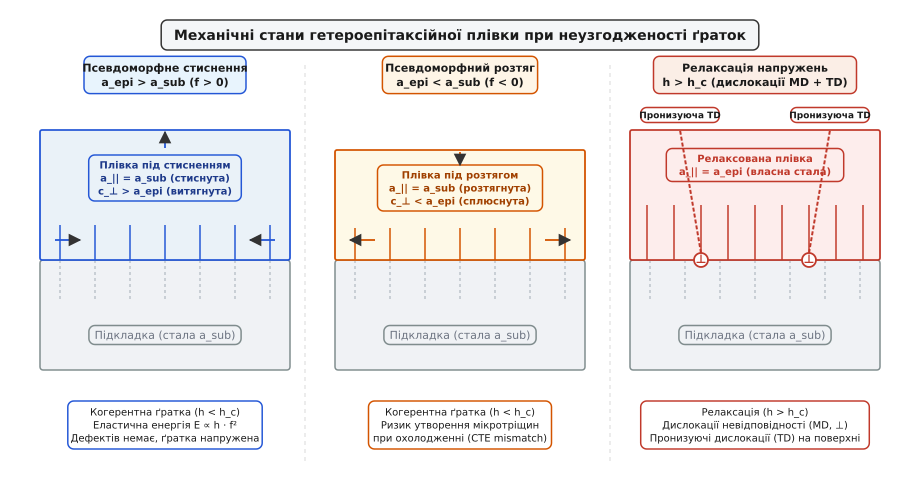
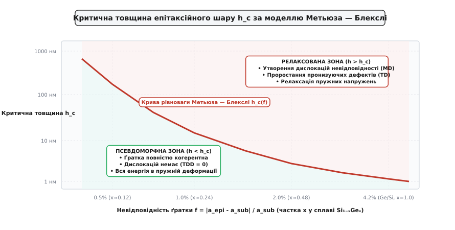
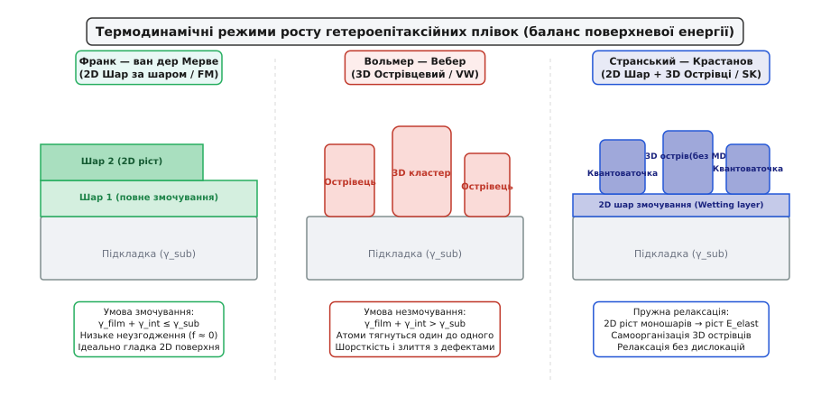
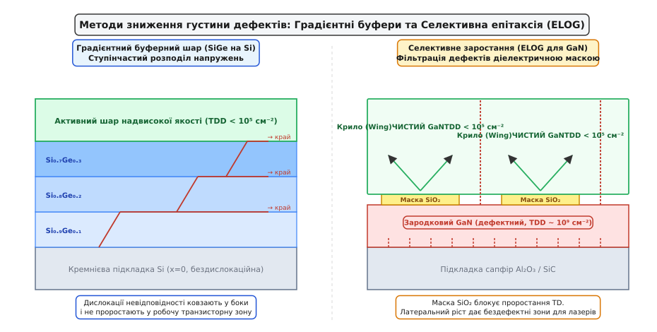

# Гетероепітаксія та неузгодженість ґраток

<preknowlist>
- [Кремній і монокристал](book:electronics/silicon-monocrystal) — кристалічна ґратка, періодичність атомної структури та площини спайності монокристала.
- [Планарний процес](book:electronics/planar-process) — пошарове формування напівпровідникових структур та епітаксійне нарощування плівок.
- [Шар за шаром](book:electronics/doping-etching-metal) — термічний бюджет, літографічне маскування та кристалічні дефекти напівпровідників.
</preknowlist>

Коли на ідеальну монокристалічну кремнієву пластину намагаються осаджувати атоми нітриду галію чи германію для створення швидкісного транзистора або світлодіода, осаджений шар або миттєво розтріскується на мікроскопічні уламки, або збирається в хаотичні краплі, посічені мільярдами лінійних дефектів. Причина полягає в тому, що природні міжатомні відстані у кристалі кремнію (`5.431 Å`), нітриду галію (`3.189 Å`) та германію (`5.658 Å`) суттєво відрізняються. Спроба примусити чужорідні атоми повторити просторовий малюнок підкладки призводить до накопичення гігантських механічних напружень у гігапаскалі: або хімічні зв'язки розтягуються до межі пружності, або кристалічна ґратка скидає напругу через самозародження розривів і дислокацій. Орієнтоване нарощування одного монокристала на поверхні іншого дістало назву **гетероепітаксії** (грец. *heteros* — інший, *epi* — над, зверху, та *taxis* — порядок, устрій).

### Фундаментальна геометрія невідповідності ґраток

В основі гетероепітаксійного процесу лежить поняття **невідповідності кристалічної ґратки** (*lattice mismatch*, або *misfit parameter*) `f`. Якщо стала ґратки вільного ненапруженого матеріалу підкладки дорівнює `a_sub`, а стала вільного матеріалу нарощуваної плівки — `a_epi`, то відносна невідповідність визначається формулою:

```
f = (a_epi - a_sub) / a_sub
```

Залежно від співвідношення міжатомних відстаней виникають два принципово різні механічні стани:

1. **Псевдоморфне стиснення (Compressive strain, `f > 0`):**
   Природний період ґратки плівки більший за період підкладки (`a_epi > a_sub`). Щоб збігтися з вузлами підкладки, атоми плівки змушені зблизитися в площині росту `(x, y)`. Виникає двовісне стискаюче напруження:
   ```
   ε_|| = (a_sub - a_epi) / a_epi ≈ -f
   ```
   Через пружний ефект Пуассона стиснення кристала в горизонтальній площині неминуче супроводжується його тетрагональним витягуванням уздовж вертикальної осі `z` (перпендикулярно до межі розділу):
   ```
   ε_⊥ = - (2 · ν / (1 - ν)) · ε_|| > 0
   ```
   де `ν` — коефіцієнт Пуассона напівпровідника (`0.25–0.32`). Відношення осей елементарної комірки `c_⊥ / a_||` стає більшим за одиницю. Класичні приклади: нарощування германію на кремній (`Ge / Si`, `f = +4.18%`), індію-галію-арсеніду на арсенід галію (`In₀.₂Ga₀.₈As / GaAs`, `f = +1.43%`) або твердого розчину `InGaN` на `GaN`.

2. **Псевдоморфний розтяг (Tensile strain, `f < 0`):**
   Природний період ґратки плівки менший за період підкладки (`a_epi < a_sub`). Атоми плівки розтягуються в площині нарощування, підлаштовуючись під ширшу сітку підкладки (`ε_|| > 0`). У відповідь вертикальний розмір комірки скорочується (`ε_⊥ < 0`), сплющуючи кристал (`c_⊥ / a_|| < 1`). Приклади: нарощування нітриду галію безпосередньо на площину Si(111) (`f = -16.9%`), алюміній-галій-нітриду на нітрид галію (`AlGaN / GaN`) або кремнію на релаксовану підкладку кремній-германію (`Si / SiGe`).


*Зліва: псевдоморфне стиснення плівки при a_epi > a_sub із тетрагональним витягуванням комірки вгору. Посередині: псевдоморфний розтяг при a_epi < a_sub із вертикальним сплющуванням. Справа: релаксація напружень при перевищенні критичної товщини з генерацією дислокацій невідповідності (⊥) на межі розділу та проростанням пронизуючих дислокацій у робочий об'єм плівки.*

Поки кристал зберігає повну атомну узгодженість із підкладкою (кожен атом плівки лежить строго над атомом підкладки без порушення порядку з'єднань), такий ріст зветься **псевдоморфним** або **когерентним**.

Густина пружної енергії деформації, накопиченої в одиниці об'єму псевдоморфного шару `u_elast`, пропорційна квадрату пружної деформації:

```
u_elast = 2 · G · ((1 + ν) / (1 - ν)) · ε_||² ≈ Y · f²
```

де `G` — модуль зсуву, а `Y` — біаксіальний модуль Юнга матеріалу плівки.

Інтегруючи по товщині плівки `h`, отримуємо повну накопичену пружну енергію на одиницю площі поверхні пластини `E_elast`:

```
E_elast(h) = 2 · G · ((1 + ν) / (1 - ν)) · f² · h
```

Ця формула демонструє фундаментальну закономірність: **пружна енергія напруженого шару зростає строго лінійно з його товщиною `h`**. Кожен новий нарощений атомний моношар вносить додаткову фіксовану порцію механічної напруги. Рано чи пізно накопичена енергія досягає величини, якої достатньо для руйнування хімічних зв'язків та зародження дефектів.

---

### Розбіжність коефіцієнтів теплового розширення (CTE Mismatch)

Невідповідність розмірів ґратки при кімнатній температурі — це лише половина фізичної проблеми. Епітаксійне нарощування монокристалічних плівок завжди відбувається при високих температурах, необхідних для дисоціації молекул газів-носіїв та поверхневої дифузії атомів:
- Металоорганічна газофазна епітаксія (MOCVD) нітриду галію проводиться при `1000–1100 °C`;
- Епітаксія кремній-германію (`SiGe`) та арсеніду галію (`GaAs`) вимагає температур `600–850 °C`.

Коли процес нарощування завершується, пластину охолоджують від температури росту `T_growth` до кімнатної температури `T_room = 25 °C` зі спадом температури `ΔT ≈ -600...-1050 K`.

Якщо коефіцієнти лінійного теплового розширення (Coefficient of Thermal Expansion, CTE) підкладки `α_sub` та плівки `α_epi` різняться, під час охолодження виникає додаткова **термічна деформація**:

```
ε_th = ∫ (α_sub(T) - α_epi(T)) dT ≈ (α_sub - α_epi) · ΔT
```

Цей ефект викликає серйозні інженерні наслідки:

1. **Випадок `α_epi > α_sub` (Нітрид галію на кремнії):**
   Коефіцієнт теплового розширення GaN (`α_GaN ≈ 5.59 × 10⁻⁶ K⁻¹`) більш ніж удвічі перевищує коефіцієнт кремнію (`α_Si ≈ 2.60 × 10⁻⁶ K⁻¹`). Під час охолодження від 1050 °C до 25 °C плівка GaN намагається стиснутися набагато сильніше, ніж масивна кремнієва пластина товщиною 775 мкм. Кремнієва основа жорстко утримує плівку, створюючи в ній колосальне **термічне напруження розтягу** величиною до `1.0–1.5 ГПа`.
   Оскільки кристали нітридів є крихкими матеріалами з низькою міцністю на розрив, при досягненні критичної межі розтягу в плівці миттєво поширюється мережа макроскопічних тріщин (*cracking*), що робить пластину непридатною для виготовлення мікросхем. Одночасно пластина вигинається увігнутою чашею (*wafer bow*) з прогином у сотні мікрометрів, що унеможливлює її фокусування в установках [фотолітографії](book:electronics/photolithography).

2. **Випадок `α_epi < α_sub` (Нітрид галію на сапфірі):**
   Сапфір (`Al₂O₃`) має коефіцієнт теплового розширення `α_sapphire ≈ 7.5 × 10⁻⁶ K⁻¹`, що помітно більше за `α_GaN`. Під час охолодження сапфір стискається сильніше за нітрид галію, стискаючи плівку та згинаючи пластину опуклою лінзою. Стискаючі термічні напруження не спричиняють розтріскування, але можуть призводити до відшарування плівки (*delamination*) або локального сколювання країв кристала.

Зв'язок між радіусом вигину пластини `R_curv` та механічним напруженням у плівці `σ_film` описується класичним **рівнянням Стоні** (*Stoney's equation*):

```
σ_film = (E_sub · t_sub²) / (6 · (1 - ν_sub) · t_film · R_curv)
```

де `E_sub`, `ν_sub`, `t_sub` — модуль Юнга, коефіцієнт Пуассона та товщина підкладки, а `t_film` — товщина епітаксійного шару. Для промислових 200-міліметрових пластин GaN-on-Si контроль термічного напруження є головним технологічним викликом.

---

### Модель Метьюза — Блекслі та критична товщина плівки

Поки товщина гетероепітаксійного шару менша за деяку критичну величину `h_c`, системі енергетично вигідніше залишатися когерентно напруженою без жодного дефекту, ніж витрачати енергію на розрив міжатомних зв'язків для створення дислокацій.

У 1974 році Джон Метьюз та Артур Блекслі сформулювали механічну модель балансу сил, яка дозволяє аналітично розрахувати критичну товщину `h_c`. Фізичний механізм полягає в наступному: у вихідній підкладці завжди присутні ростові дислокації, які проростають крізь межу розділу у вигляді пронизуючих ліній (*threading dislocations*). На цей пронизуючий сегмент діють дві протидіючі сили:

1. **Рушійна сила пружного напруження плівки (сила Піча — Келера `F_ε`):**
   Зсувне напруження намагається просунути дислокацію вбік уздовж площини ковзання, скидаючи пружну енергію шару:
   ```
   F_ε = 2 · G · ((1 + ν) / (1 - ν)) · |f| · b · h · cos(λ)
   ```
   де `b` — абсолютна величина вектора Бюргерса, `λ` — геометричний кут ковзання. Ця сила прямо пропорційна товщині плівки `h`.

2. **Сила лінійного натягу самої дислокації `F_l`:**
   Під час руху пронизуючої руки за нею вздовж межі розділу розгортається горизонтальний відрізок — дислокація невідповідності. Створення нової довжини лінії дефекту вимагає витрати енергії пружного спотворення кристала навколо її ядра. Лінійний натяг чинить опір подовженню дислокації:
   ```
   F_l = (G · b² / (4 · π · (1 - ν))) · (1 - ν · cos²(α)) · [ln(h / b) + 1]
   ```
   де `α` — кут між лінією дислокації та вектором Бюргерса.

Критична товщина `h_c` досягається в точці точної рівноваги сил `F_ε = F_l`. Детальний покроковий математичний вивід та чисельні розрахунки наведені в [🧮 математичному виведенні та розрахунках моделі Метьюза — Блекслі](book:electronics/heteroepitaxy/math-matthews-blakeslee.md).

Підсумкове трансцендентне рівняння Метьюза — Блекслі має вигляд:

```
h_c = (b / (8 · π · |f| · (1 + ν) · cos(λ))) · (1 - ν · cos²(α)) · [ln(h_c / b) + 1]
```


*Крива рівноваги Метьюза — Блекслі h_c(f). Нижче кривої лежить стабільна псевдоморфна зона: плівка ідеально когерентна, пронизуючих дефектів немає. Вище кривої система переходить у релаксований стан із генерацією дислокацій невідповідності та проростанням дефектів.*

З графіка та формули видно гіперболічну залежність критичної товщини від невідповідності `1 / |f|`:
- При малому неузгодженні `f = 0.42%` (наприклад, шар `Si₀.₉Ge₀.₁` на кремнії) псевдоморфна товщина досягає солідних **`h_c ≈ 28 нм`** (близько 200 моношарів), що цілком достатньо для формування бази гетероструктурного біполярного транзистора (HBT);
- При збільшенні частки германію до `x = 0.20` (`f = 0.84%`) критична товщина падає до **`11.6 нм`**;
- Для чистого германію на кремнії (`f = +4.18%`) або нітриду галію на AlN (`f = +2.41%`) критична товщина становить лише **`1.0–1.2 нм`** — це всього 3–5 атомних шарів. Будь-який товщий шар неминуче втрачає когерентність.

При низьких температурах росту (молекулярно-променева епітаксія MBE при 450–500 °C) через високий енергетичний бар'єр зародження дислокацій плівка може тимчасово існувати в напруженому стані вище лінії `h_c` (так звана метастабільна модель Піпла — Біна). Проте під час будь-якого наступного високотемпературного технологічного відпалу така метастабільна плівка лавиноподібно релаксує, заповнюючись дислокаційними сітками.

---

### Анатомія дефектів: дислокації невідповідності та пронизуючі дислокації

Коли товщина плівки перетинає межу `h > h_c`, накопичена пружна енергія скидається через пластичну деформацію. У кристалі виникають два взаємопов'язані типи дефектів:

```
           Поверхня плівки
           ──────┬─────────────┬──────
                 │             │
   Пронизуючі    │             │   Threading
   дислокації    │             │   Dislocations (TDD)
                 │             │
   ══════════════╧═════════════╧══════ Межа розділу (Interface)
                 ▲             ▲
   Дислокації невідповідності (Misfit Dislocations, ⊥)
   (зайві атомні напівплощини)
```

1. **Дислокації невідповідності (Misfit Dislocations, MD):**
   Це лінійні дефекти, що лежать суворо в двовимірній площині гетероінтерфейсу. Кожна дислокація невідповідності є краєм зайвої атомної напівплощини, вставленої в кристал із меншим періодом ґратки. Вона компенсує один крок невідповідності на величину паралельної проекції вектора Бюргерса `b_||`. Відстань між паралельними лініями дислокацій на інтерфейсі у стані повної релаксації становить `S = b_|| / |f|`.

2. **Пронизуючі дислокації (Threading Dislocations, TD):**
   За фундаментальною топологічною теоремою кристалографії лінія дислокації не може обірватися всередині ідеального об'єму монокристала — вона повинна або замкнутися в петлю, або вийти на вільну поверхню. Тому горизонтальні дислокації невідповідності на межі розділу загинаються вгору й проростають крізь усю товщу нарощеного шару до самої його поверхні.

У гексагональних нітридних кристалах вюрцитної структури (`GaN`, `AlN`, `InN`) розрізняють три типи пронизуючих дислокацій:
- **Крайові дислокації** (*Edge dislocations*, вектор Бюргерса `b = 1/3 ⟨112̄0⟩` у площині базиса) — становлять 70–80% усіх дефектів;
- **Гвинтові дислокації** (*Screw dislocations*, `b = ⟨0001⟩` уздовж осі c) — 10–15%;
- **Змішані дислокації** (*Mixed dislocations*, `b = 1/3 ⟨112̄3⟩`) — 10–15%.

Густина виходу пронизуючих дислокацій на робочу поверхню кристала зветься **густиною пронизуючих дислокацій** (*Threading Dislocation Density, TDD*, вимірюється в `см⁻²`).

У прямому гетероепітаксійному нарощуванні GaN на сапфір без спеціальних буферних прошарків величина TDD досягає колосальних **`10⁹–10¹⁰ см⁻²`** (в середньому одна дислокація на кожні 100 нанометрів площі поверхні).

#### Руйнівний вплив TDD на роботу електронних та оптичних приладів

Дислокація — це не просто порушення геометрії ґратки, це лінійний ланцюжок нескомпенсованих обірваних ковалентних зв'язків (*dangling bonds*), оточений сильним полем пружної деформації. Цей мікроскопічний об'єкт руйнує характеристики приладів на всіх рівнях:

- **Катастрофічне падіння квантового виходу світлодіодів (LED):**
  Обірвані зв'язки в ядрі дислокації створюють глибокі енергетичні рівні всередині забороненої зони напівпровідника. Вони працюють як високоефективні центри безвипромінювальної рекомбінації Шоклі — Ріда — Холла (SRH). Електрони та дірки рекомбінують на дислокаціях, віддаючи енергію у вигляді тепла (фононів), а не фотонів світла. При `TDD > 10⁸ см⁻²` внутрішній квантовий вихід синіх світлодіодів падає в рази.
- **Деградація та вихід із ладу лазерних діодів:**
  У напівпровідникових лазерах (зокрема синьо-фіолетових лазерах Blu-ray) дислокації слугують центрами локального перегріву та прискореної міграції точкових дефектів під дією потужного оптичного поля. Це викликає швидке утворення темних ліній деградації (*Dark Line Defects*) і руйнування оптичних дзеркал резонатора за лічені години роботи. Працездатний лазер вимагає зниження `TDD < 10⁵–10⁶ см⁻²`.
- **Струми витоку та пробій у силових транзисторах HEMT:**
  У силовій електроніці GaN-on-Si пронизуючі дислокації діють як вертикальні струмопровідні шунтуючі канали. Під високою зворотною напругою (650–1200 В) уздовж ліній дефектів виникає надлишковий струм витоку затвора і стоку, що знижує напругу пробою діелектрика, викликає ефект колапсу струму (*current collapse*) через захоплення електронів пастками та призводить до передчасного теплового пробою транзистора.

---

### Антифазні межі (APB) при полярно-неполярній епітаксії

Окремий складний клас кристалографічних дефектів виникає при нарощуванні полярних напівпровідників (сполук груп III-V або III-N, як `GaAs` або `GaN`) на неполярні підкладки IV групи (кремній `Si` або германій `Ge`).

Кремній має симетричну діамантову ґратку, де всі позиції зайняті однаковими атомами Si. Натомість `GaAs` має ґратку сфалериту, складену з двох взаємопроникних гранецентрованих підґраток: підґратки галію та підґратки миш'яку.

Якщо підкладка Si(001) має мікроскопічні сходинки висотою в один атомний моношар `a / 4` (поодинокі атомні сходинки):
- На одній терасі перший атомний шар утворює зв'язки `Si–As`, спрямовані в одному кристалографічному напрямку;
- На сусідній терасі через висоту сходинки `a / 4` орієнтація зв'язків розвертається на 90°;
- Коли домени росту з сусідніх терас стикаються, на їхній межі атоми Ga стикаються з атомами Ga, а атоми As — з атомами As.

Виникає площинний дефект — **антифазна межа** (*Antiphase Boundary, APB*). Неправильні гомополярні зв'язки `Ga–Ga` (дефіцит електронів, локальний акцепторний заряд) та `As–As` (надлишок електронів, локальний донорний заряд) є потужними пастками носіїв і короткими замикачами p-n переходів.

Інженерне розв'язання проблеми APB полягає у використанні **віцинальних підкладок із кутовим нахилом** (*off-axis miscut substrates*):
Пластину кремнію зрізають під кутом 2–4° відносно базової площини (001) у напрямку `[110]`. Під час високотемпературного водневого відпалу перед ростом поверхня кремнію реконструюється: поодинокі сходинки зливаються в стабільні **подвійні атомні сходинки** висотою `a / 2`. Завдяки цьому полярна орієнтація підґраток на всіх терасах стає абсолютно ідентичною, і антифазні межі повністю пригнічуються.

---

### Три термодинамічні режими росту тонких плівок

Морфологія поверхні плівки на початкових стадіях нарощування визначається балансом трьох питомих вільних поверхневих енергій за класичним капілярним рівнянням Юнга — Дюпре:
- `γ_sub` — питома вільна енергія поверхні чистої підкладки;
- `γ_film` — питома вільна енергія відкритої поверхні нарощуваної плівки;
- `γ_int` — енергія межі розділу між плівкою та підкладкою (*interface energy*).

Залежно від співвідношення цих величин та рівня пружної енергії реалізуються три фундаментальні термодинамічні режими росту:


*Зліва: режим Франка — ван дер Мерве (пошаровий 2D-ріст при повному змочуванні та малому неузгодженні). Посередині: режим Вольмера — Вебера (3D-острівцевий ріст при переважанні сил зчеплення між атомами плівки). Справа: режим Странського — Крастанова (утворення моношарового шару змочування з наступним розпадом на бездислокаційні 3D-квантові точки для релаксації пружної енергії).*

#### 1. Режим Франка — ван дер Мерве (Frank–van der Merwe / FM, 2D шар за шаром)

Умова реалізації:
```
γ_film + γ_int ≤ γ_sub   [при f ≈ 0]
```

Осаджувані атоми міцніше зв'язуються з атомами підкладки, ніж один з одним. Поверхня підкладки повністю змочується плівкою. Ріст відбувається суворо двовимірно: кожен новий моношар повністю заповнюється і згладжується до того, як почне формуватися наступний шар.

Поверхня залишається атомно-гладкою зі сходинками висотою в один атом. Цей режим характерний для гомоепітаксії (`Si / Si`, `GaAs / GaAs`) та ізоморфної гетероепітаксії з близькими ґратками (наприклад, `AlGaAs / GaAs` у лазерних гетероструктурах).

#### 2. Режим Вольмера — Вебера (Volmer–Weber / VW, 3D острівцевий)

Умова реалізації:
```
γ_film + γ_int > γ_sub
```

Атоми плівки притягуються один до одного сильніше, ніж до підкладки. Повне змочування відсутнє. Осаджуваний матеріал негайно коагулює у тривимірні ізольовані зародки-острівці.

У міру нарощування острівці ростуть у висоту та ширину, доки не починають стикатися і зливатися (*coalescence*). Оскільки сусідні зародки виникають незалежно і можуть мати незначний кутовий розворот кристалографічних осей (дезорієнтацію на частки градуса), на межах їхнього зростання утворюються суцільні стінки з пронизуючих дислокацій, порожнин і антифазних меж. Цей режим реалізується при спробі прямого нарощування GaN на сапфір або металів на діелектричні оксиди без спеціальних буферів.

#### 3. Режим Странського — Крастанова (Stranski–Krastanov / SK, шар + 3D острівці)

Умова реалізації:
```
γ_film + γ_int ≤ γ_sub   [початково], але |f| > 2–7%
```

Проміжний, надзвичайно цікавий фізичний режим. На перших етапах термодинамічна умова змочування виконується, і на підкладці виростає ідеально гладкий суцільний псевдоморфний двовимірний шар товщиною від 1 до 4 моношарів — так званий **шар змочування** (*wetting layer*).

Проте через значну невідповідність ґраток накопичена пружна енергія `E_elast ∝ h · f²` швидко зростає з кожним моношаром. Коли товщина перевищує критичну межу змочування, системі стає енергетично вигідніше згорнути верхній суцільний шар у масив крихітних тривимірних наноострівців куполоподібної або пірамідальної форми.

Унікальність режиму Странського — Крастанова полягає в тому, що 3D-острівці релаксують напруження **без утворення дислокацій**: наноострівець має вільні бічні грані, які можуть вільно розширюватися або звужуватися в просторі, скидаючи напруження пружним вигином ґратки.

Цей механізм став основою технології **самоорганізованих квантових точок** (*Self-Assembled Quantum Dots*):
- Осадження 2–3 моношарів `InAs` на `GaAs` (`f = +7.16%`) призводить до спонтанного формування масиву напівпровідникових квантових точок діаметром 10–20 нм і висотою 3–5 нм із густиною `10¹⁰–10¹¹ см⁻²`;
- Електрони та дірки виявляються замкненими в тривимірній потенціальній ямі з дискретним атомоподібним енергетичним спектром, що забезпечує температурну стабільність випромінювання та наднизькі порогові струми в лазерах оптичного зв'язку.

Детальніше про історію відкриття цих трьох режимів росту та наукову боротьбу за створення синіх світлодіодів можна прочитати в [📜 історії відкриття режимів росту та синіх світлодіодів](book:electronics/heteroepitaxy/hist-heteroepitaxy.md).

---

### Методи контролю росту та напружень у реальному часі (In-Situ моніторинг)

Сучасні реактори молекулярно-променевої епітаксії (MBE) та металоорганічної газофазної епітаксії (MOCVD) оснащені прецизійними системами оптичного діагностування, що дозволяють відстежувати процеси напруження та релаксації безпосередньо в процесі нарощування кристала:

1. **Дифракція швидких електронів на відбиття (RHEED — Reflection High-Energy Electron Diffraction):**
   Пучок високоенергетичних електронів (10–30 кеВ) спрямовується на поверхню під ковзним кутом 1–2°.
   - При 2D пошаровому рості Франка — ван дер Мерве інтенсивність дзеркального рефлексу осцилює з періодом, що строго відповідає часу укладання одного атомного моношару (максимум інтенсивності — гладка заповнена тераса, мінімум — наполовину заповнений шорсткий шар). Рахуючи кількість піків осциляцій RHEED, оператор контролює товщину квантових ям з точністю до одного атомного шару.
   - При переході Странського — Крастанова смугаста дифракційна картина миттєво перетворюється на точкову об'ємну дифракцію від тривимірних наноострівців, фіксуючи момент критичної товщини шару змочування.

2. **Лазерна кривинометрія пластин у реальному часі (In-Situ Wafer Curvature / MOS):**
   Паралельні лазерні промені відбиваються від поверхні зростаючої пластини на матричний фотодетектор. За зміною відстані між відбитими плямами оптична система неперервно розраховує радіус кривини пластини `R_curv(t)`.
   За формулою Стоні це дає графік накопиченого напруження плівки `σ · t` у реальному часі. Інженер-технолог бачить точний момент переходу від псевдоморфного стиснення до пластичної релаксації дислокаціями і може оперативно коригувати склад буферних шарів для запобігання розтріскуванню.

---

### Інженерні методи зниження густини дефектів та керування напруженнями

Оскільки ідеально узгоджених підкладок для більшості перспективних матеріалів не існує в природі або вони занадто дорогі, матеріалознавство розробило чотири високоефективні стратегії придушення дислокацій та компенсації напружень.


*Зліва: ступінчастий градієнтний шар SiGe на кремнії — напруження розподіляються по товщині, змушуючи дислокації ковзати в боки до країв пластини без проростання в активний верхній шар. Справа: селективне латеральне заростання (ELOG) — смуги маски SiO₂ блокують вертикальні пронизуючі дислокації, формуючи над діелектриком ідеально чисті кристалічні крила з TDD < 10⁵ см⁻².*

#### 1. Низькотемпературні зародкові буферні шари (Low-Temperature Buffer Layers)

Цей метод став поворотним моментом у виробництві нітридних приладів:
- Перед нарощуванням основного шару GaN на підкладку сапфіру або кремнію при зниженій температурі `450–550 °C` наносять тонкий (20–40 нм) шар `AlN` або `GaN`;
- При такій низькій температурі поверхнева рухливість атомів мала, тому осаджений матеріал утворює суцільний аморфний або ультрадисперсний нанокристалічний шар із надвисокою густиною зародків, повністю покриваючи підкладку і пригнічуючи острівцевий режим Вольмера — Вебера;
- При повільному нагріванні реактора до робочої температури `1050 °C` цей буферний шар рекристалізується, формуючи бездоганно орієнтовану плоску кристалічну матрицю для подальшого квазідвовимірного росту основного шару GaN. Цей прийом дозволив знизити густину дислокацій з `10¹⁰ см⁻²` до `10⁸ см⁻²`.

#### 2. Градієнтні буферні шари зі змінним складом (Compositionally Graded Buffers)

Якщо необхідно виростити товстий релаксований шар із великим неузгодженням (наприклад, чистий Ge або `Si₀.₇Ge₀.₃` на підкладці Si), прямий стрибок концентрації германію створив би колосальну густину заплутаних пронизуючих дефектів.

Замість різкого переходу застосовують **градієнтний буферний шар**:
- Частку германію `x` плавно або дрібними сходинками збільшують у процесі росту зі швидкістю приблизно `10% Ge на 1 мікрон товщини` (від `x = 0.0` біля підкладки до `x = 0.30` на вершині);
- На кожному мікроскопічному ступені невідповідність між сусідніми підшарами не перевищує часток відсотка;
- Дислокації невідповідності отримують можливість здійснювати довгий вільний пробіг у горизонтальних площинах ковзання, виходячи на бічні торці пластини і розвантажуючи напруження без викиду вертикальних пронизуючих дефектів у верхній робочий шар;
- Верхній шар кремній-германію виходить повністю релаксованим із відмінною якістю поверхні (`TDD < 10⁵ см⁻²`), слугуючи штучною підкладкою (*virtual substrate*) для подальшого формування надшвидкісних транзисторів.

#### 3. Напружені надґратки для фільтрації дислокацій (Strained-Layer Superlattices, SLS)

Метод полягає у введенні в структуру періодичного стека з кількох десятків надтонких шарів, що чергуються (наприклад, `AlN / GaN` або `InGaAs / GaAs`), товщина кожного з яких строго менша за критичну товщину `h_c`:
- Шари почергово перебувають під стисненням і розтягом;
- Потужні черговані поля пружних зсувних напружень на кожному внутрішньому гетероінтерфейсі діють на вертикальні пронизуючі дислокації, змушуючи їх різко вигинатися під кутом 90° у площину межі розділу;
- Коли дві дислокації з протилежними за знаком векторами Бюргерса зближуються під дією напружень, вони взаємно анігілюють (`b₁ + b₂ = 0`) або зливаються в замкнені безнебезпечні дислокаційні петлі, які більше не проростають у робочу зону приладу.

#### 4. Селективна епітаксія та латеральне заростання (ELOG — Epitaxial Lateral Overgrowth)

Найефективніший метод отримання монокристалічних плівок практично бездислокаційної якості (`TDD < 10⁴–10⁵ см⁻²`):
1. На вихідний дефектний шар GaN літографічним методом наносять тонку маску з діоксиду кремнію `SiO₂` або нітриду кремнію `Si₃N₄` у вигляді періодичної системи паралельних смуг шириною 5–10 мкм із вікнами шириною 2–5 мкм між ними.
2. Пластину повертають у реактор епітаксії. За підібраних термодинамічних умов коефіцієнт прилипання атомів галію до діелектрика `SiO₂` близький до нуля: зародження кристала відбувається **виключно у відкритих вікнах** на поверхні затравочного GaN.
3. Спочатку кристал росте вертикально через вікна. Досягнувши верхнього краю діелектричної маски, фронт росту змінює напрямок і починає розростатися горизонтально вбік над поверхнею оксиду кремнію (так званий латеральний ріст, або формування «крил» — *wings*).
4. Пронизуючі дислокації з нижнього шару не можуть проникнути крізь аморфний діоксид кремнію. Вони проростають лише крізь вузькі відкриті вікна, де вигинаються на 90° до бічних граней.
5. Уся область кристала, що наросла латерально над маскою SiO₂ (крила ELOG), виявляється абсолютно вільною від вертикальних пронизуючих дефектів.

Саме технологія ELOG дозволила створити промислові фіолетові лазерні діоди для оптичних накопичувачів Blu-ray та потужні лазерні проєктори.

---

### Практичне значення та застосування в сучасній мікроелектроніці

> 🔧 **Навіщо це.** Без технологій гетероепітаксії та керування невідповідністю ґраток сучасна напівпровідникова індустрія не мала б енергоефективного білого LED-освітлення, компактних швидких зарядок для смартфонів, базових станцій зв'язку 5G/6G, транзисторів FinFET з нормами нижче 10 нм та волоконно-оптичного інтернету.

Сучасні комерційні втілення гетероепітаксії охоплюють найважливіші напрямки високих технологій:

1. **Силова електроніка GaN-on-Silicon:**
   Вирощування напівпровідникових гетероструктур GaN на стандартних дешевих 200-міліметрових кремнієвих підкладках Si(111) за допомогою складних багатошарових буферів `AlN/AlGaN/GaN` дозволило створити сильні транзистори з двовимірним електронним газом (2DEG). Вони перемикають напруги 650 В на частотах у мегагерци з ККД понад 98%, зменшивши габарити зарядних пристроїв та блоків живлення серверів у 3–4 рази.
2. **Радіочастотні прилади GaN-on-SiC:**
   Епітаксія GaN на карбіді кремнію (де невідповідність ґратки становить лише `3.4%`, а теплопровідність SiC колосальна — до `490 Вт/(м·К)`) є основою вихідних підсилювачів потужності для радарів з активними фазованими ґратками (AESA), систем супутникового зв'язку та передавачів 5G.
3. **Напружений кремній у мікропроцесорах (Strained Silicon):**
   У сучасних логічних техпроцесах (FinFET та GAAFET) епітаксійне вирощування напружених вставок `Si_{1-x}Ge_x` в областях витоку та стоку p-канальних транзисторів створює в каналі стискаюче напруження до 2 ГПа. Це деформує зонну структуру кремнію, знімає виродження валентних зон і збільшує рухливість дірок у 2.5–3 рази без збільшення споживання енергії.
4. **Волоконно-оптичний зв'язок на InP та GaAs:**
   Напівпровідникові лазери та швидкісні фотодіоди на базі квантово-розмірних гетероструктур `InGaAsP / InP` генерують оптичні сигнали на довжинах хвиль 1.31 мкм та 1.55 мкм (зона мінімальних оптичних втрат у кварцовому волокні), забезпечуючи передачу терабітних потоків даних у глобальних магістральних мережах.
