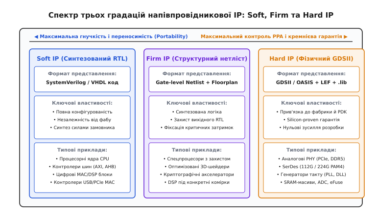
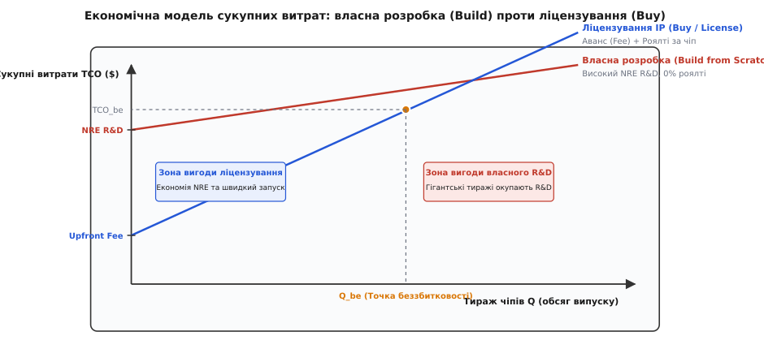
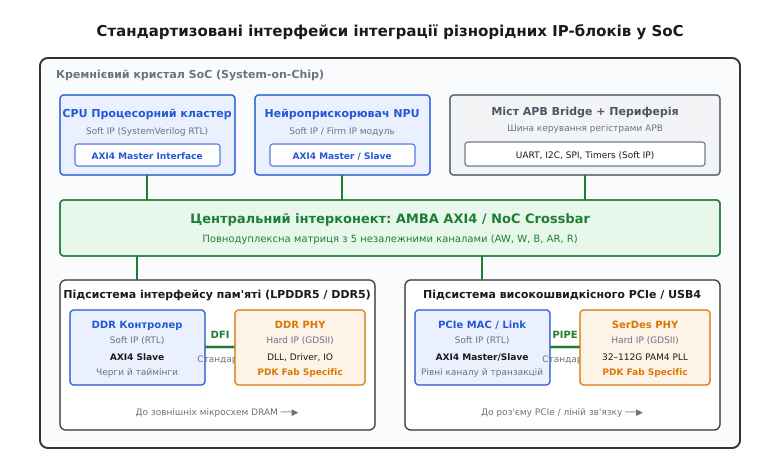

# Ліцензування IP-ядер

<preknowlist>
- [Фаби й fabless](book:electronics/fabs-fabless) — розподіл ролей між безфабричними розробниками мікросхем, чистими фабриками та OSAT.
- [Система-на-кристалі (SoC)](book:electronics/system-on-chip) — гетерогенна інтеграція процесорних ядер, графіки, прискорювачів та аналогових вузлів на єдиному кремнієвому кристалі.
- [Техпроцес та літографія](book:electronics/process-node) — геометричне масштабування, бібліотеки стандартних комірок та правила фізичного проєктування PDK.
- [Тестування й binning](book:electronics/testing-binning) — перевірка працездатності кремнієвих кристалів, вбудовані тестові структури BIST та сканувальні ланцюги.
</preknowlist>

Коли напівпровідникова літографія досягла нанометрових масштабів і дозволила розміщувати на єдиному кристалі площею 1 см² від 10 до 50 мільярдів транзисторів, індустрія мікроелектроніки зіткнулася з кризою продуктивності проєктування (Design Productivity Gap). Кількість транзисторів на кристалі за законом Мура подвоювалася кожні два роки (річне зростання на ~58%), тоді як продуктивність інженерів-розробників цифрових та аналогових схем під час проєктування блоків «з нуля» зростала лише на ~21% на рік. Спроба однієї компанії спроєктувати сучасну гетерогенну систему-на-кристалі (SoC) виключно власними силами — від процесорних конвеєрів та графічних шейдерів до аналогових трансиверів PCIe Gen5, контролерів пам'яті DDR5 та синтезаторів частоти PLL — вимагала б команди з кількох тисяч вузькопрофільних інженерів і 8–10 років безперервної розробки, що повністю позбавляє продукт будь-якого комерційного сенсу.

Єдиним способом подолання цього розриву став перехід від монолітного проєктування всього чіпа однією командою до модульної збірки мікросхем із попередньо спроєктованих, повністю верифікованих та апаратно оптимізованих функціональних блоків. Такі блоки отримали назву **напівпровідникової інтелектуальної власності** (Semiconductor Intellectual Property Cores, SIP, або **IP-ядра**). IP-ядро є закінченим схемотехнічним або топологічним модулем із чітко специфікованими вхідними й вихідними інтерфейсами, часовими моделями та тестовим оточенням, призначеним для багаторазового використання (Design Reuse) у складі різних інтегральних схем.

Поява ринку комерційного ліцензування IP-блоків докорінно змінила структуру світової мікроелектроніки, зробивши можливою саму модель безфабричних (Fabless) напівпровідникових компаній. Замість витрачання сотень мільйонів доларів на повторне проєктування загальноприйнятих стандартних інтерфейсів (USB, PCIe, Ethernet, MIPI) чи процесорних ядер загального призначення, розробники SoC фокусують свої інженерні ресурси виключно на створенні ключової профільної цінності продукту (наприклад, унікального тензорного прискорювача штучного інтелекту, апаратного модема чи графічного процесора), ліцензуючи решту 70–90% кремнієвої площі кристала у спеціалізованих IP-вендорів.

---

## Три технічні градації IP-блоків: Soft, Firm та Hard IP

Будь-який функціональний блок на кристалі може бути представлений на різних рівнях фізичної та логічної абстракції. Індустрія розділила IP-ядра на три класи залежно від формату постачання, ступеня фізичної оптимізації та прив'язки до кремнієвого техпроцесу.


*Спектр трьох градацій IP: порівняння рівнів абстракції, переносимості між фабриками та контролю затримок PPA.*

### 1. Soft IP (Програмно реалізовані ядра)

Soft IP постачається замовнику у вигляді вихідного синтезованого тексту на мовах апаратного опису (HDL — Hardware Description Language), таких як SystemVerilog або VHDL. Це найгнучкіша форма напівпровідникової інтелектуальної власності.

Головні характеристики Soft IP:
- **Повна технологічна переносимість (Process Portability):** Вихідний RTL-код не містить жодної прив'язки до конкретної фабрики (TSMC, Samsung, Intel, GlobalFoundries) чи геометричного вузла техпроцесу (від 180 нм до 2 нм). Замовник самостійно обирає цільову кремнієву фабрику та транслює код у логічні вентилі за допомогою синтезатора (Synopsys Design Compiler, Cadence Genus), використовуючи обрану бібліотеку стандартних комірок (Standard Cell Library).
- **Глибока параметризація (Configurability):** Постачальник Soft IP закладає в код конфігураційні параметри, що дозволяють інтегратору налаштовувати ядро під специфічні потреби свого чіпа: обирати розрядність внутрішніх шин даних (32, 64, 128 або 256 біт), змінювати розміри кеш-пам'яті L1/L2, регулювати кількість конвеєрних стадій, конфігурувати глибину буферів FIFO та вмикати чи вимикати апаратні модулі (наприклад, блок векторних обчислень SIMD або модуль апаратного ділення).
- **Склад пакета поставки (Deliverables):** Вихідні файли RTL на SystemVerilog/VHDL (або зашифровані файли IEEE P1735), скрипти обмежень таймінгів у форматі SDC (Synopsys Design Constraints), файли опису архітектури живлення мультидоменних систем у форматі UPF (Unified Power Format) чи CPF, тестове верифікаційне оточення на базі методології UVM та симуляційні поведінкові моделі.
- **Зона відповідальності інтегратора:** Купуючи Soft IP, замовник бере на себе повну відповідальність за фізичну реалізацію блоку: синтез логіки, синтез дерева тактового сигналу (Clock Tree Synthesis, CTS), розміщення та трасування комірок (Place & Route), усунення перевантаження металевих трас (Routing Congestion) та закриття статичного часового аналізу (Static Timing Analysis, STA). Якщо ядро не досягає бажаної частоти 2.5 ГГц через занадто довгі комбінаційні шляхи або перекоси тактового сигналу, інтегратор змушений самостійно змінювати топологічні обмеження або вставляти додаткові регістрові каскади.

Типовими представниками Soft IP є універсальні процесорні ядра (ARM Cortex-A/R/M, RISC-V ядра SiFive чи Andes), цифрові сигнальні процесори (DSP), системні таймери, контролери переривань (NVIC/GIC), контролери шин (AMBA AXI, AHB, APB) та цифрові контролери канального рівня протоколів (PCIe MAC, USB Link Layer, Ethernet MAC).

### 2. Firm IP (Структурно фіксовані ядра)

Firm IP є проміжною градацією між повністю відкритим RTL-описом та монолітним топологічним лейаутом. Постачальник самостійно виконує логічний синтез RTL-коду під певне сімейство стандартних комірок і постачає замовнику структурний список з'єднань логічних вентилів (Gate-level Netlist), часто доповнений специфікацією відносного просторового розміщення макросів (Relative Placement Constraints або Floorplan RBM).

Головні властивості Firm IP:
- **Захист авторських прав (IP Protection):** Постачальник не розкриває замовнику вихідний текст алгоритму, передаючи лише сітку логічних вентилів та тригерів, яку надзвичайно важко модифікувати чи реверс-інжинірити.
- **Часткова оптимізація PPA (Power, Performance, Area):** Постачальник гарантує, що критичні шляхи передачі даних між регістрами синтезовані оптимальним чином, що знімає з інтегратора частину ризиків часового закриття.
- **Обмежена переносимість:** Firm IP прив'язаний до певної архітектури стандартних комірок або конкретного покоління фабричного PDK, але залишає можливість фінального трасування з'єднань на етапі загального Place & Route системи.

До класу Firm IP належать спеціалізовані криптографічні прискорювачі з підвищеними вимогами до захисту від витоку інформації по побічних каналах (Side-channel Attack Protection), оптимізовані 3D-графічні шейдерні ядра та спеціалізовані обчислювачі DSP.

### 3. Hard IP (Жорстко топологічно реалізовані ядра)

Hard IP є найглибшим рівнем фізичної реалізації: це повністю спроєктований, топологічно оптимізований і верифікований напівпровідниковий макрос, представлений у бінарному форматі масок GDSII або OASIS. Hard IP створюється під конкретну фабрику, конкретний технологічний процес (наприклад, TSMC N3E або Samsung SF4), конкретний металевий стек (Metal Stack) та специфічні правила проектування фабричного комплекту розробки (PDK — Process Design Kit).

```
   ┌─────────────────────────────────────────────────────────┐
   │                Порівняння градацій IP-ядер              │
   ├──────────────────────────┬───────────┬──────────┬───────┤
   │ Параметр                 │ Soft IP   │ Firm IP  │Hard IP│
   ├──────────────────────────┼───────────┼──────────┼───────┤
   │ Формат передачі даних    │ RTL (.sv) │ Netlist  │ GDSII │
   │ Незалежність від фабрики │ Повна     │ Середня  │ Нульова│
   │ Гнучкість конфігурації   │ Максимальн│ Обмежена │ Фіксов│
   │ Гарантія кремнію (Proof) │ Відсутня  │ Часткова │ 100%  │
   │ Складність інтеграції    │ Висока    │ Середня  │ Низька│
   └──────────────────────────┴───────────┴──────────┴───────┘
```

Hard IP є єдино можливим форматом для блоків, чия працездатність безпосередньо залежить від нелінійних фізичних процесів у кремнії, прецизійної симетрії транзисторних пар, паразитних ємностей між металевими шарами та високочастотних аналогових ефектів:
1. **Фізичні рівні високошвидкісних інтерфейсів (PHY):** Аналогові приймачі та передавачі інтерфейсів PCIe Gen5/Gen6 (32–64 Гбіт/с), USB4, MIPI D-PHY/C-PHY, інтерфейсів пам'яті DDR5/LPDDR5/HBM3, а також надшвидкісних ліній SerDes (56G, 112G та 224G PAM4). Такі вузли містять схеми автокалібрування термінації ліній, схеми вирівнювання фаз (DLL), аналогові еквалайзери (CTLE, DFE) та потужні вихідні драйвери з регульованим наростанням фронтів.
2. **Аналогові та змішано-сигнальні блоки (Analog & Mixed-Signal):** Генератори тактових частот на базі фазового автопідстроювання частоти (Phase-Locked Loop, PLL), джерела опорної напруги на ширині забороненої зони (Bandgap Voltage References), аналого-цифрові (ADC) та цифро-аналогові (DAC) перетворювачі, вбудовані датчики температури й напруги, а також схеми скидання за зниження напруги живлення (Power-On Reset, POR / Brown-Out Detect).
3. **Спеціалізовані масиви пам'яті:** Компілятори статичної пам'яті SRAM (High-Density, High-Speed, Single-port, Dual-port), масиви ROM та блоки одноразово програмованих перемичок eFuse для збереження апаратних криптографічних ключів та конфігурації калібрувань чіпа.

Комплект поставки Hard IP містить набір абстрактних та повних моделей:
- **LEF (Library Exchange Format):** Геометрична абстракція блоку для САПР Place & Route інтегратора. Вона містить лише габаритні розміри, розташування й металеві шари контактних площадок (пінів) та зони заборони розміщення стандартних комірок і трасування металу (Blockages), приховуючи внутрішню топологію мільйонів транзисторів.
- **Liberty (`.lib` / `.db`):** Файли нелінійних таблиць затримок (NLDM) або композитних струмових моделей (CCS), що описують часи поширення сигналів від вхідних пінів до вихідних, вимоги Setup/Hold та споживання енергії для всіх технологічних кутів (PVT Corners).
- **CDL / SPICE Netlist:** Повний список транзисторів і паразитних елементів для верифікації відповідності топології схемі (LVS — Layout Versus Schematic).
- **GDSII / OASIS:** Повний бінарний макет усіх фізичних шарів, що вклеюється у загальний топологічний файл чіпа перед відправкою на літографію.

Головна перевага Hard IP полягає в гарантії працездатності: такі блоки мають статус **Silicon Proven** (перевірені у виготовленому кремнії на тестових шатлах вендора), що знімає з інтегратора колосальний ризик виходу з ладу найскладнішої аналогової частини мікросхеми. Головний недолік — повна технологічна прив'язка (Foundry Lock-in): якщо компанія вирішує змінити фабрику з TSMC на Samsung або перейти з техпроцесу 7 нм на 4 нм, Hard IP блок неможливо просто перекомпілювати — його необхідно замовляти заново у вендора, який повністю перепроєктовує аналогову схемотехніку під новий PDK.

Детальну матрицю всіх типів файлів, меж інженерної відповідальності та топологічних пасток зведено в окремому технічному огляді ([🔌 технічні формати та межі відповідальності Soft, Firm та Hard IP](book:electronics/ip-licensing/comp-soft-firm-hard-ip.md)).

---

## Моделі монетизації та комерційні контракти в IP-індустрії

Економіка напівпровідникової IP будується на принципі поділу витрат на розробку (Shared R&D) між сотнями клієнтів. Комерційна угода між постачальником IP та інтегратором зазвичай складається з двох ключових фінансових компонентів: авансового ліцензійного платежу та поштучних роялті.


*Економіка Build vs Buy: перетин кривих сукупних витрат NRE та поштучних роялті формує точку беззбитковості для обсягу виробництва.*

### 1. Авансовий ліцензійний платіж (Upfront License Fee)

Авансовий платіж є фіксованою сумою, яку замовник сплачує на етапі укладання контракту за право доступу до інтелектуальної власності. Цей платіж покриває витрати постачальника на надання технічної документації, вихідних файлів, тестових стендів, а також виділення інженерної підтримки (Field Application Engineers, FAE) для супроводу інтеграції блоку в чіп клієнта.

За структурою прав використання авансові ліцензії поділяються на:
- **Single-Use License (Одноразова проєктна ліцензія):** Надає право інтегрувати IP-блок у єдиний конкретний чип (один Tape-out). Будь-яка модифікація кристала, зміна кількості ядер чи перенесення на інший проєкт вимагає придбання нової ліцензії. Це найдешевший варіант, популярний серед стартапів з обмеженим стартовим бюджетом.
- **Multi-Use / Portfolio License (Багаторазова ліцензія):** Дозволяє використовувати ліцензований блок у необмеженій кількості похідних проєктів або в межах одного продуктового сімейства протягом фіксованого терміну (зазвичай 2–3 роки).
- **Subscription / Enterprise Model (Підписна модель):** Великі напівпровідникові корпорації (наприклад, Qualcomm, MediaTek, NXP) сплачують фіксовану щорічну суму в десятки мільйонів доларів (наприклад, за програмами ARM Total Access або Synopsys DesignWare Enterprise), отримуючи необмежений доступ до всього каталогу процесорних ядер, периферії та інтерфейсних блоків постачальника.
- **Architecture License (Архітектурна ліцензія):** Найвищий рівень ліцензування в процесорній індустрії. Замовник купує не готовий RTL-код процесорного конвеєра, а виключне право створити власну мікроархітектуру «з нуля», яка повністю сумісна з набором інструкцій постачальника (наприклад, ліцензія Apple, Qualcomm чи Nvidia на систему команд ARMv9-A).

### 2. Поштучні роялті за виготовлений кристал (Per-chip Royalty)

Роялті є змінною складовою собівартості, яку ліцензіат сплачує постачальнику IP за кожен фізично виготовлений на фабриці або відвантажений клієнтам кристал.

Роялті формуються за двома основними схемами:
- **Відсоткова ставка від ціни чіпа (Percentage Royalty):** Становить від 1% до 3% від середньої відпускної ціни мікросхеми (ASP — Average Selling Price). Якщо флагманська процесорна система-на-кристалі для смартфона продається виробникам телефонів за $100, постачальник ключових процесорних ядер отримує $1.00–$2.50 з кожного проданого чіпа. Для недорогих мікроконтролерів вартістю $1.00 роялті становлять від 1 до 2 центів.
- **Фіксована ставка за кристал (Fixed Unit Royalty):** Становить фіксовану суму (наприклад, $0.05 або $0.15 за кристал) незалежно від того, за якою ціною кінцевий пристрій продається споживачеві. Часто застосовується для стандартних периферійних інтерфейсів (USB, Ethernet, I2C).
- **Ступенева шкала (Volume Tiering):** Для захисту інтересів замовника при великих тиражах контракт часто передбачає регресивну шкалу роялті: наприклад, 1.5% за перші 5 мільйонів чіпів, 1.0% за наступні 10 мільйонів, і 0.5% при обсягах понад 20 мільйонів одиниць.

Щоб контролювати чесність звітності щодо тиражів, постачальники IP впроваджують суворі аудиторські механізми: вони отримують регулярні агреговані звіти безпосередньо від контрактних фабрик (Foundry Wafer Starts Reports) та складальних підприємств (OSAT Packaging Reports), що унеможливлює приховування реальних обсягів випуску.

Про те, як ця бізнес-модель виникла з безгрошів'я невеликого кембриджського стартапу та назавжди змінила ринок процесорів, читайте в історичній довідці ([📜 історія виникнення бізнес-моделі ліцензування ARM](book:electronics/ip-licensing/hist-arm-business-model.md)).

### 3. Економічний компроміс: «Створити чи придбати» (Build vs Buy)

Перед затвердженням проєкту кожна інженерна організація розраховує точку беззбитковості (Break-even Volume `Q_be`).

Сукупні витрати на власну розробку (`Cost_build`) складаються з високих фіксованих інженерних витрат NRE (зарплати команди, ліцензії на САПР, виготовлення тестових шатлів) та фінансових збитків від запізнення виходу на ринок (`Cost_delay` через довший цикл розробки), але мають нульову ставку роялті. Сукупні витрати на ліцензування (`Cost_buy`) мають низький стартовий NRE, швидкий запуск чіпа у виробництво, але несуть постійні поштучні виплати роялті з кожного виготовленого екземпляра.

Точка беззбитковості розраховується аналітично:

```
Q_be = (NRE_build + Cost_delay + E_respin - Fee_upfront - NRE_integ) / Royalty
```

Для складних високошвидкісних аналогових блоків (PCIe Gen5 PHY чи DDR5 інтерфейсів) значення `Q_be` часто перевищує 10–30 мільйонів кристалів, що робить самостійну розробку таких блоків економічно абсурдною для 99% напівпровідникових компаній світу.

Повний математичний вивід формул TCO, оцінку функції затримки виходу на ринок та числовий розрахунок для реального кремнієвого проєкту наведено в математичному аналізі ([🧮 економіко-математичний аналіз Build vs Buy](book:electronics/ip-licensing/math-ip-build-vs-buy.md)).

---

## Стандартизація інтерфейсів інтеграції: подолання шинного хаосу

Коли на одному кристалі об'єднуються десятки IP-ядер, розроблених різними компаніями в різний час, виникає фундаментальна проблема інтерфейсної сумісності. Якби кожен розробник IP використовував власний пропрієтарний протокол обміну даними (власні назви сигналів, несумісні полярності стробів, різні фази тактування), інтеграція перетворилася б на інженерний колапс: для з'єднання `N` блоків знадобилося б створення `N · (N - 1) / 2` мостових перетворювачів («клеєвої логіки» — Glue Logic), що призвело б до роздуття площі кристала, непередбачуваних затримок та нескінченних багів у функціональних симуляціях.

Рішенням стала глобальна індустріальна стандартизація внутрішньокристальних шин та інтерфейсів зв'язку.


*Інтеграція різнорідних IP: повнодуплексна магістраль AMBA AXI4, міст APB та спеціалізовані інтерфейси DFI й PIPE до аналогових Hard IP.*

### 1. Екосистема стандартів ARM AMBA

Сімейство протоколів **AMBA (Advanced Microcontroller Bus Architecture)** стало де-факто промисловим стандартом з'єднання IP-блоків у цифрових системах:
- **AMBA APB (Advanced Peripheral Bus):** Спеціалізована низькошвидкісна шина з мінімальним енергоспоживанням, оптимізована для доступу до конфігураційних регістрів периферійних IP-ядер (UART, I2C, SPI, таймери, регістри керування живленням). Шина не використовує конвеєризацію: кожна транзакція займає щонайменше два такти (фаза вибору `Setup` та фаза доступу `Access`), що вимагає мінімальної кількості логічних вентилів для реалізації інтерфейсного контролера.
- **AMBA AHB (Advanced High-performance Bus):** Конвеєризована шина з централізованим арбітражем для мікроконтролерних систем, що підтримує пакетні передачі (Burst Transfers) з фіксацією адреси на першому такті та передачею даних на наступних тактах.
- **AMBA AXI4 (Advanced eXtensible Interface):** Стандарт високопродуктивного повнодуплексного інтерконекту для сучасних процесорів, GPU, NPU та контролерів пам'яті. AXI4 відмовляється від концепції спільної шини на користь комутованої матриці з **п'ятьма повністю незалежними односпрямованими каналами**:
  1. `AW (Write Address Channel)` — передача адреси та параметрів запису;
  2. `W (Write Data Channel)` — передача даних запису та маски байтів;
  3. `B (Write Response Channel)` — повернення статусу завершення транзакції запису;
  4. `AR (Read Address Channel)` — передача адреси та параметрів читання;
  5. `R (Read Data Channel)` — повернення зчитаних даних та статусу відповіді.

Усі п'ять каналів AXI4 використовують симетричний протокол двостороннього квитування за сигналами `VALID` (передавач виставив дійсні дані) та `READY` (приймач готовий прийняти дані). Завдяки наявності поля `AXI ID` шина підтримує позачергове виконання транзакцій (Out-of-Order Execution): якщо повільний контролер пам'яті затримує читання за адресою A, інтерконект може миттєво повернути дані читання за адресою B, що суттєво підвищує коефіцієнт використання смуги пропускання.

Для багатопроцесорних кластерів зі спільним доступом до кешів AMBA розширена стандартами **ACE (AXI Coherent Extensions)** та **CHI (Coherent Hub Interface)**, які реалізують апаратне відстеження рядків пам'яті (Hardware Snooping) та пряму передачу даних між кешами процесорів.

### 2. Спеціалізовані інтерфейси зв'язку контролерів та Hard IP PHY

Для відокремлення цифрової логіки обробки протоколів (MAC/Link Layer) від аналогових блоків фізичного рівня (Hard IP PHY) індустрія створила вузькоспеціалізовані відкриті стандарти:
- **PIPE (PHY Interface for the PCI Express Architecture):** Стандартизований паралельний інтерфейс, розроблений консорціумом на чолі з Intel, який з'єднує цифровий контролер PCIe, USB3/USB4 або SATA з аналоговим блоком Hard IP SerDes PHY. Завдяки PIPE розробник SoC може придбати цифровий контролер PCIe MAC у компанії Synopsys, а Hard IP SerDes PHY замовити у компанії Cadence чи Alphawave, гарантуючи їхню повну електричну та логічну сумісність.
- **DFI (DDR PHY Interface):** Стандарт зв'язку між цифровим планувальником контролера оперативної пам'яті (Memory Controller) та аналоговим Hard IP DDR PHY. DFI уніфікує передачу команд оновлення рядків, активації банків, сигналів калібрування затримок (Write/Read Leveling) та керування низькоспоживаючими станами DRAM.

---

## Процедура верифікації, валідації та кремнієвої надійності

Інтеграція десятків ліцензованих IP-ядер у єдиний кремнієвий кристал створює надзвичайно складне верифікаційне завдання: переконатися, що всі блоки коректно взаємодіють між собою за будь-яких комбінацій навантаження, тактових частот і режимів живлення.

### 1. Верифікаційна інтелектуальна власність (Verification IP, VIP)

Для симуляції системних інтерфейсів розробники використовують **VIP** — спеціалізовані програмні моделі протоколів, побудовані на базі мови SystemVerilog та бібліотеки класів UVM (Universal Verification Methodology).

VIP діє всередині симулятора як еталонний партнер по протоколу:
- **Генерація стресових послідовностей (Constrained Random Stimulus):** VIP інжектує у шину мільйони псевдовипадкових транзакцій, створюючи граничні ситуації (одночасні конфлікти запитів, переповнення буферів, запити з максимальними затримками `READY`, скасування транзакцій, інжекцію помилок контрольних сум CRC).
- **Апаратні твердження (SystemVerilog Assertions, SVA):** VIP безперервно відстежує стан ліній зв'язку і миттєво генерує помилку симуляції, якщо будь-який блок порушує часові діаграми протоколу (наприклад, змінює дані при високому рівні `VALID` до отримання підтвердження `READY`).
- **Оцінка функціонального покриття (Functional Coverage):** VIP формує матрицю перевірених станів протоколу, гарантуючи, що жодна можлива комбінація сигналів не залишилася непротестованою до здачі проєкту на фабрику.

### 2. Керування доменами живлення за специфікаціями UPF / CPF

Сучасна система-на-кристалі містить десятки ізольованих доменів живлення. Коли центральний процесор засинає, живлення його Soft IP блоку повністю вимикається силовими транзисторними ключами (Power Gating), тоді як сусідній Hard IP блок бездротового зв'язку чи таймер RTC продовжує працювати від завжди увімкненого домену AON (Always-On).

Специфікація **UPF (Unified Power Format, стандарт IEEE 1801)** формалізує правила взаємодії між цими доменами:
- Автоматичне розміщення **комірок ізоляції (Isolation Cells)** на лініях, що виходять із вимкненого IP-блоку, фіксуючи їхній стан у логічному «0» або «1», щоб запобігти виникненню наскрізних струмів увімкнених приймачів;
- Розміщення **перетворювачів рівнів (Level Shifters)** на лініях між доменами, які працюють за різних напруг живлення (наприклад, 0.75 В у цифровому ядрі та 1.8 В в аналоговому блоці);
- Керування **тригерами збереження стану (Retention Registers)**, які живляться від резервної лінії та зберігають контекст регістрів процесора під час глибокого сну.

---

## Стратегічний ландшафт і відкриті альтернативи (RISC-V та Chiplets)

Успіх ліцензійної моделі породив нові виклики для напівпровідникової індустрії: домінування кількох ключових IP-вендорів призвело до високої вартості ліцензійних платежів, що створює високий фінансовий бар'єр для академічних груп, стартапів та виробників нішевих пристроїв.

Відповіддю індустрії став розвиток двох революційних рухів:

1. **Відкрита архітектура команд RISC-V:**
   Поява відкритої системи команд (ISA) RISC-V, розробленої в Університеті Берклі, дала змогу створювати безкоштовні процесорні ядра з відкритим вихідним кодом (Open-Source RTL). Це позбавляє розробників необхідності сплачувати авансові платежі та роялті за базові процесорні ядра загального призначення, стимулюючи конкуренцію між постачальниками відкритого та пропрієтарного IP.
2. **Чиплетна революція та стандарти UCIe (Universal Chiplet Interconnect Express):**
   Коли розміри монолітних кристалів на передових техпроцесах (3 нм, 2 нм) наблизилися до літографічної межі маски (Reticle Limit ~858 мм²), індустрія перейшла від об'єднання IP-ядер на єдиному кристалі до збирання систем із окремих фізичних кремнієвих кристалів — **чиплетів** (Chiplets), з'єднаних через кремнієві інтерпозери та мости (Advanced Packaging). Стандарт **UCIe** перетворює колишню концепцію внутрішньокристальних IP на рівень кремнієвих модулів: компанія може придбати готовий 5-нм обчислювальний чиплет у одного виробника, а 16-нм чиплет аналогових інтерфейсів I/O — у іншого, з'єднавши їх у єдиному корпусі з мінімальними затримками.

Ліцензування напівпровідникової інтелектуальної власності пройшло шлях від сміливого експерименту кембриджських інженерів до базового економічного та інженерного фундаменту всієї глобальної мікроелектроніки, перетворивши проєктування мікросхем із ремесла одинаків на всесвітній конвеєр модульної інтеграції.
