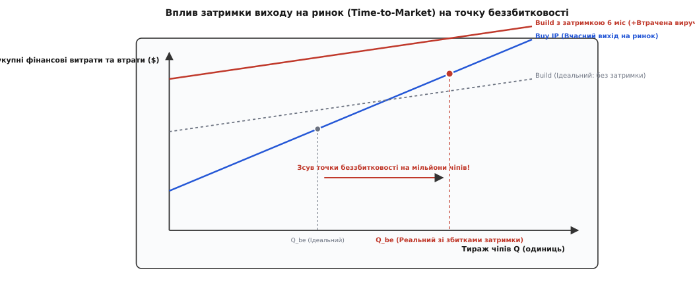

# 🧮 Економіка «Створити чи купити»: розрахунок точки беззбитковості ліцензування IP

Коли напівпровідникова компанія розпочинає проєктування нової системи-на-кристалі (SoC), технічний директор (CTO) та фінансовий директор (CFO) постають перед фундаментальним вибором щодо кожного складного функціонального блоку: створити його власними силами інженерної команди (стратегія **Build**) чи придбати ліцензію у комерційного постачальника напівпровідникової IP (стратегія **Buy**). Помилка в будь-який бік коштує мільйони доларів: власна розробка нестандартного високошвидкісного інтерфейсу може затягнутися на роки й спалити бюджет стартапу, тоді як надмірне ліцензування другорядних блоків при масових мільйонних тиражах призводить до виплати гігантських роялті, що з'їдають маржинальність бізнесу.

Щоб ухвалити обґрунтоване рішення, інженерне керівництво застосовує строгий математичний апарат аналізу сукупної вартості володіння (Total Cost of Ownership, TCO) та розрахунку точки беззбитковості (Break-even Analysis). Ця модель враховує не лише прямі витрати на зарплати інженерів та ліцензійні платежі, але й вартість робочих місць САПР, витрати на виготовлення тестових кремнієвих пластин (Test Chips), ймовірність апаратної помилки та повторного виготовлення масок (Respin Risk), різницю у виході придатних кристалів через площу топології, альтернативну вартість інженерного капіталу, а також колосальні фінансові збитки від запізнення виходу продукту на ринок (Time-to-Market Delay Penalty).


*Вплив затримки виходу продукту на точку беззбитковості: врахування втраченої ринкової виручки (Time-to-Market Penalty) зсуває точку економічної доцільності власної розробки далеко в область багатомільйонних тиражів.*

---

## Математична формалізація функцій сукупних витрат

Розгляньмо систему, яка випускає тираж із `Q` одиниць мікросхем протягом повного життєвого циклу продукту.

### 1. Функція сукупних витрат при власній розробці (Build)

При самостійному проєктуванні блоку «з нуля» компанія бере на себе всі одноразові інженерні витрати (NRE — Non-Recurring Engineering), оплачує роботу висококваліфікованої команди аналогових та цифрових розробників, ліцензії на програмні пакети автоматизованого проєктування, тестові шатли для кремнієвої верифікації та несе повний тягар ризиків затримки.

Сукупні витрати описуються розширеним рівнянням:

```
Cost_build(Q) = NRE_build + c_silicon_build · Q + Cost_delay + E_respin + Cost_opp
```

де складові розгортаються у вирази:

```
NRE_build = Cost_eng + Cost_eda + Cost_shuttle + Cost_lab
Cost_eng = N_eng · S_eng · T_dev
Cost_eda = N_eng · P_eda · T_dev
```

- `N_eng` — чисельність інженерної R&D-групи (схемотехніки, топологи, інженери верифікації, фахівці з цілісності сигналів);
- `S_eng` — середньорічна вартість утримання одного інженера (включаючи заробітну плату, соціальні внески, медичне страхування, адміністративні накладні витрати та вартість робочого простору);
- `T_dev` — тривалість циклу розробки блоку у роках (від затвердження технічного завдання до фінального здавання проєкту на фабрику — Tape-out);
- `P_eda` — щорічна вартість ліцензій САПР (EDA-інструменти для симуляції, синтезу, екстракції паразитів, аналогового моделювання SPICE та фізичної перевірки DRC/LVS від Cadence, Synopsys або Siemens EDA) у розрахунку на одного інженера;
- `Cost_shuttle` — вартість виготовлення експериментальних тестових кристалів на збірних пластинах (MPW — Multi-Project Wafer) для кремнієвої валідації Hard IP чи складних змішано-сигнальних блоків;
- `Cost_lab` — витрати на високочастотне вимірювальне лабораторне обладнання (осцилографи реального часу з широкою смугою, генератори тестових послідовностей BERT, векторні аналізатори кіл VNA), спеціалізовані тестові плати та сертифікацію;
- `c_silicon_build` — пряма собівартість кремнієвої площі кристала, яку займає блок власної розробки;
- `Cost_delay` — фінансовий еквівалент збитків від пізнішого виходу продукту на ринок через тривалий цикл R&D;
- `E_respin` — математичне сподівання витрат на виправлення апаратних помилок і повторне виготовлення масок;
- `Cost_opp` — альтернативна вартість відволікання інженерного капіталу від створення ключових конкурентних переваг продукту.

### 2. Функція сукупних витрат при ліцензуванні IP (Buy)

При ліцензуванні готового IP-блоку компанія сплачує фіксований авансовий ліцензійний платіж (Upfront License Fee), відносно невеликі інженерні витрати на інтеграцію та регулярні поштучні роялті з кожного проданого чіпа:

```
Cost_buy(Q) = Fee_upfront + NRE_integ + (c_silicon_buy + Royalty) · Q
```

де складові визначаються так:
- `Fee_upfront` — фіксований авансовий платіж постачальнику IP за передачу файлів (RTL, LEF, GDSII, .lib), документації та надання інженерної підтримки;
- `NRE_integ` — внутрішні витрати на інтеграцію блоку в систему-на-кристалі, перевірку інтерфейсних протоколів, виконання логічного синтезу та закриття граничних таймінгів (`N_integ · (S_eng + P_eda) · T_integ`), де час інтеграції `T_integ` у рази менший за час повної розробки `T_dev`;
- `c_silicon_buy` — собівартість площі кремнію для ліцензованого блоку;
- `Royalty` — поштучна плата постачальнику за кожен виготовлений або проданий кристал.

Якщо комерційний контракт передбачає відсоткову ставку роялті `r_pct` від середньої відпускної ціни мікросхеми (`ASP` — Average Selling Price), то:

```
Royalty = r_pct · ASP
```

---

## Альтернативна вартість інженерного капіталу (Opportunity Cost)

Один із найважливіших прихованих факторів у моделі Build vs Buy полягає в обмеженості людського капіталу компанії. Якщо команда з 10 висококласних інженерів-схемотехніків протягом двох років зайнята розробкою стандартного контролера PCIe або DDR PHY, вони фізично не можуть працювати над власним нейропроцесором (NPU), унікальними тензорними ядрами або пропрієтарними алгоритмами енергозбереження, які безпосередньо створюють ринкову цінність продукту.

Альтернативна вартість `Cost_opp` визначається додатковим прибутком, який компанія могла б отримати, спрямувавши ці інженерні людино-місяці на вдосконалення власної профільної технології:

```
Cost_opp = N_eng · T_dev · Value_add_rate
```

де `Value_add_rate` — середня додана вартість, яку генерує один інженер компанії за рік під час створення ключової диференціюючої IP (зазвичай $300 000 — $800 000 на рік у сфері ШІ та високоефективних обчислень). Врахування `Cost_opp` робить розробку стандартних інтерфейсів власними силами ще менш раціональною.

---

## Вплив площі блоку та виходу придатних (Yield Effect) на кремнієву собівартість

Комерційні постачальники Hard IP зазвичай мають можливість витратити тисячі інженерних людино-годин на ручне ущільнення фізичної топології (Full-custom Layout), завдяки чому ліцензований блок займає меншу площу кремнію, ніж блок, згенерований інструментами автоматичного розміщення та трасування під час внутрішньої швидкої розробки (`A_buy < A_build`).

Згідно з моделлю дефектів Мерфі або Негліца, вихід придатних кристалів на пластині (`Yield`) експоненційно падає зі зростанням площі кристала:

```
Yield = (1 + (D_0 · A_total) / α)^(-α)
```

де `D_0` — середня густина дефектів на квадратний сантиметр пластини, `A_total` — повна площа кристала, а `α` — параметр кластеризації дефектів (зазвичай `α ≈ 1.0–2.0`).

Збільшення площі кристала на додаткові квадратні міліметри через неоптимальний власний лейаут веде до двох наслідків:
1. Зменшення загальної кількості кристалів на одній 300-мм пластині (Gross Dies per Wafer);
2. Зниження відсотка працездатних мікросхем після тестування (Net Yield).

Різниця в собівартості кремнію `Δc_silicon = c_silicon_build - c_silicon_buy` додається до ефективної величини поштучних витрат, знижуючи фінансову привабливість власної розробки.

---

## Виведення аналітичної формули точки беззбитковості (Break-even Volume)

Точка беззбитковості `Q_be` — це критичний обсяг тиражу чіпів, за якого сукупні витрати обох стратегій стають абсолютно однаковими:

```
Cost_build(Q_be) = Cost_buy(Q_be)
```

Підставимо повні аналітичні функції витрат:

```
NRE_build + c_silicon_build · Q_be + Cost_delay + E_respin
= Fee_upfront + NRE_integ + (c_silicon_buy + Royalty) · Q_be    [базова рівність TCO]

NRE_build + Cost_delay + E_respin - Fee_upfront - NRE_integ
= (c_silicon_buy + Royalty) · Q_be - c_silicon_build · Q_be    [перенесення доданків]

NRE_build + Cost_delay + E_respin - Fee_upfront - NRE_integ
= (Royalty - (c_silicon_build - c_silicon_buy)) · Q_be         [групування за Q_be]

Q_be = (NRE_build + Cost_delay + E_respin - Fee_upfront - NRE_integ) / (Royalty - Δc_silicon)
```

У типовому наближенні, коли різниця у вартості кремнію мала порівняно зі ставкою роялті (`Δc_silicon ≪ Royalty`), формула набуває канонічного інженерного вигляду:

```
Q_be = (NRE_build + Cost_delay + E_respin - Fee_upfront - NRE_integ) / Royalty
```

Цей аналітичний результат дає прямий кількісний критерій для менеджменту:
- Якщо очікуваний ринковий обсяг замовлень `Q < Q_be` — **ліцензування IP є значно вигіднішим**, оскільки економія капітальних витрат на R&D перекриває майбутні виплати роялті;
- Якщо ринковий обсяг `Q > Q_be` — **власна розробка стає економічно доцільною**, оскільки на багатомільйонних тиражах економія на відсутності роялті з лишком покриває дорогі стартові інженерні інвестиції.

---

## Моделювання затримки виходу на ринок (Time-to-Market Penalty)

Створення складного високоефективного аналогового чи змішано-сигнального блоку (наприклад, SerDes 112G PAM4 чи DDR5 PHY) силами внутрішньої R&D-групи неминуче збільшує час виходу кристала на ринок. Різниця у часі виходу становить `D = T_dev - T_integ` (зазвичай від 9 до 18 місяців).

У напівпровідниковій галузі кожне покоління стандартів і продуктів має чітко обмежене часове вікно попиту `W` (зазвичай 36–48 місяців до появи наступного технологічного покоління). Продажі підпорядковуються класичній трапецієподібній кривій життєвого циклу продукту.

Затримка появи чіпа на ринку на інтервал `D` викликає два руйнівні економічні ефекти:
1. **Скорочення вікна активних продажів:** Продукт фізично присутній на ринку менше часу, оскільки кінець життєвого циклу визначається появою стандарту наступного покоління і не зміщується вперед;
2. **Втрата пікової ринкової частки (Peak Market Share Loss):** Клієнти, яким процесор або прискорювач був потрібен вчасно, укладають довгострокові контракти з конкурентами, які вийшли на ринок раніше.

Згідно з моделлю затримки життєвого циклу МакКінсі (McKinsey Time-to-Market Model), частка безповоротно втраченої ринкової виручки `Loss_pct` обчислюється через інтеграл скорочення площі трапеції:

```
Loss_pct = (D / (2 · W)) · (3 - D / W)
```

Фінансовий еквівалент втраченого прибутку становить:

```
Cost_delay = Loss_pct · Revenue_max · Margin_gross
```

де `Revenue_max` — потенційна виручка компанії за весь життєвий цикл продукту за умови вчасного виходу, а `Margin_gross` — середня валова маржинальність напівпровідникового продукту (зазвичай 45–60% для fabless-сегменту).

---

## Математичне сподівання ризику апаратних респінів (Respin Expected Cost)

Розробка надшвидкісних аналогових і цифрових інтерфейсів пов'язана з фізичними ефектами, які надзвичайно важко повністю передбачити під час симуляцій: шуми підкладки, електроміграція, температурні градієнти та розбіжність фаз.

Ймовірність того, що перший виготовлений кристал міститиме критичну помилку, яка вимагатиме повторного виготовлення комплекту фотомасок (Respin), становить `P_respin ≈ 0.25–0.40` для власної розробки з нуля, тоді як для ліцензованого блоку зі статусом Silicon Proven вона падає до `P_respin_ip ≈ 0.02–0.05`.

Математичне сподівання додаткових витрат на респін описується виразом:

```
E_respin = P_respin · (Cost_mask + Cost_eng_fix + Cost_delay_respin)
```

де `Cost_mask` — пряма ціна повторного комплекту масок на фабриці ($3–5 млн на вузлах 5 нм / 3 нм), `Cost_eng_fix` — витрати на пошук і усунення дефекту інженерами, а `Cost_delay_respin` — збитки від додаткової затримки проєкту на 4–6 місяців.

---

## Числовий розрахунок для реального сценарію: розробка PCIe Gen5 x16 PHY

Продемонструймо роботу моделі на прикладі безфабричного стартапу, що розробляє серверний прискорювач штучного інтелекту (AI Accelerator ASIC) у передовому техпроцесі TSMC 5nm (N5). Проєкт вимагає інтеграції інтерфейсу **PCIe Gen5 x16** (сумарна пропускна здатність 128 ГБ/с).

### 1. Вихідні економічні та інженерні параметри

```
Параметр                                            Позначення       Значення
───────────────────────────────────────────────────────────────────────────────
Команда власної розробки PHY (аналог + цифра)       N_eng            10 інженерів
Річна вартість утримання інженера                   S_eng            $250 000 / рік
Тривалість власної розробки                         T_dev            2.0 роки (24 міс)
Вартість EDA-ліцензій на одне робоче місце          P_eda            $100 000 / рік
Виготовлення тестового шатла (MPW Shuttle 5nm)      Cost_shuttle     $1 800 000
Лабораторне вимірювальне обладнання та оснастка     Cost_lab         $500 000
Ймовірність необхідності респіну власного PHY       P_respin         0.30 (30%)
Пряма вартість виготовлення масок для респіну       Cost_mask        $3 500 000
───────────────────────────────────────────────────────────────────────────────
Авансовий ліцензійний платіж за готовий Hard IP PHY Fee_upfront      $2 500 000
Команда інтеграції ліцензованого IP                 N_integ          2 інженери
Тривалість інтеграції та перевірки                  T_integ          0.5 року (6 міс)
Середня відпускна ціна чіпа (ASP)                   ASP              $120.00
Ставка роялті постачальнику IP                      r_pct            1.25% ($1.50 / чіп)
───────────────────────────────────────────────────────────────────────────────
Ринкове вікно життя продукту                        W                3.0 роки (36 міс)
Очікувана виручка при вчасному виході               Revenue_max      $150 000 000
Валова рентабельність прискорювача                  Margin_gross     50% (0.50)
```

### 2. Покроковий розрахунок NRE при власній розробці (Build)

Обчислимо прямі інженерні витрати на створення блоку:

```
Cost_eng = 10 · 250 000 · 2.0 = $5 000 000          [зарплата інженерів: N_eng · S_eng · T_dev]
Cost_eda = 10 · 100 000 · 2.0 = $2 000 000          [ліцензії САПР: N_eng · P_eda · T_dev]

NRE_build
= Cost_eng + Cost_eda + Cost_shuttle + Cost_lab     [сума складових NRE]
= 5 000 000 + 2 000 000 + 1 800 000 + 500 000       [підстановка чисельних значень]
= $9 300 000                                        [фіксовані витрати власного R&D]

E_respin = 0.30 · 3 500 000 = $1 050 000            [математичне сподівання респіну масок]
```

### 3. Розрахунок втрат від затримки виходу на ринок (Cost_delay)

Затримка власної розробки відносно ліцензування готового блоку становить:

```
D = T_dev - T_integ = 2.0 - 0.5 = 1.5 року (18 місяців)
```

Частка втраченої виручки за формулою життєвого циклу:

```
Loss_pct
= (1.5 / (2 · 3.0)) · (3 - 1.5 / 3.0)               [модель життєвого циклу при D=1.5, W=3.0]
= (0.25) · (3 - 0.5)                                [обчислення коефіцієнта затримки]
= 0.25 · 2.5                                        [множення на фактор ринкового попиту]
= 0.625                                             [частка втраченої виручки: 62.5%]
```

Фінансовий еквівалент втраченого валового прибутку:

```
Cost_delay = 0.625 · 150 000 000 · 0.50 = $46 875 000
```

### 4. Розрахунок витрат при ліцензуванні IP (Buy)

Витрати на інтеграцію стороннього блоку:

```
NRE_integ
= N_integ · (S_eng + P_eda) · T_integ               [формула витрат інтеграції IP]
= 2 · (250 000 + 100 000) · 0.5                     [підстановка інженерних параметрів]
= 2 · 350 000 · 0.5                                 [розрахунок вартості команди інтеграції]
= $350 000                                          [витрати на адаптацію ліцензованого блоку]

Royalty = 1.25% · 120.00 = $1.50 / чіп              [ставка роялті: r_pct · ASP]
```

### 5. Обчислення точки беззбитковості (Q_be) у трьох сценаріях

**Сценарій 1: Базовий NRE (без затримки та без ризику респіну)**

```
Q_be_1
= (NRE_build - Fee_upfront - NRE_integ) / Royalty   [базова формула беззбитковості]
= (9 300 000 - 2 500 000 - 350 000) / 1.50          [підстановка значень витрат]
= 6 450 000 / 1.50                                  [чистий дельтовий NRE]
= 4 300 000 кристалів                               [точка беззбитковості]
```

*Висновок Сценарію 1:* Якщо стартап планує випустити менше **4.3 млн кристалів**, ліцензування готового IP є дешевшим навіть без урахування фактора часу.

**Сценарій 2: Врахування ризику апаратного респіну (NRE + E_respin)**

```
Q_be_2
= (NRE_build + E_respin - Fee_upfront - NRE_integ) / Royalty [врахування ризику респіну]
= (9 300 000 + 1 050 000 - 2 500 000 - 350 000) / 1.50      [підстановка зі сподіванням респіну]
= 7 500 000 / 1.50                                          [скоригований дельтовий NRE]
= 5 000 000 кристалів                                       [точка беззбитковості з респіном]
```

**Сценарій 3: Повна економічна модель (NRE + E_respin + Cost_delay)**

```
Q_be_3
= (NRE_build + E_respin + Cost_delay - Fee_upfront - NRE_integ) / Royalty [повна модель із затримкою]
= (9 300 000 + 1 050 000 + 46 875 000 - 2 500 000 - 350 000) / 1.50      [підстановка втраченого прибутку]
= 54 375 000 / 1.50                                                       [сумарна вартість власного ризику]
= 36 250 000 кристалів                                                    [реальна точка беззбитковості]
```

*Висновок Сценарію 3:* З урахуванням ринкових втрат від запізнення на 18 місяців, власна розробка окупиться лише при астрономічному тиражі у **36.25 млн чіпів**, що багаторазово перевищує весь річний обсяг ринку спеціалізованих дата-центрових ШІ-прискорювачів для окремої компанії.

---

## Модель ступеневих роялті (Volume Tiered Royalties)

У реальних комерційних контрактах ставка роялті рідко залишається незмінною для всього тиражу. Постачальники IP застосовують прогресивне зниження ставки роялті зі зростанням обсягів випуску (Volume Tiering):

```
Діапазон тиражу (кристалів)      Ставка роялті (% від ASP)      Ставка на чіп (при ASP $120)
────────────────────────────────────────────────────────────────────────────────────────────
0 — 1 000 000                    1.50%                          $1.80
1 000 001 — 5 000 000            1.00%                          $1.20
5 000 001 — 20 000 000           0.60%                          $0.72
Понад 20 000 000                 0.30%                          $0.36
```

При ступеневій системі функція поштучних витрат стає кусково-лінійною функцією:

```
Royalty_total(Q) = ∑ (r_i · ΔQ_i)
```

Зниження ставки роялті на старших інтервалах тиражу робить ліцензування економічно вигідним навіть для компаній із тиражами в десятки мільйонів одиниць, оскільки питома вага роялті в собівартості чіпа падає до десятих часток відсотка.

---

## Порівняльний аналіз для різних ринкових сегментів

Рішення «Створити чи купити» кардинально різниться залежно від класу пристрою та обсягів тиражу:

```
Сегмент ринку          ASP чіпа   Типовий тираж   Ставка роялті   Оптимальна стратегія
────────────────────────────────────────────────────────────────────────────────────────
IoT Мікроконтролер     $1.50      50 000 000      $0.02 / чіп     Власна розробка периферії,
(Cortex-M0+ / RISC-V)                                             ліцензування базового CPU
────────────────────────────────────────────────────────────────────────────────────────
Мобільний процесор     $45.00     30 000 000      $0.60 / чіп     Ліцензування Hard IP PHY,
(Смартфони)                                                       власний NPU та GPU
────────────────────────────────────────────────────────────────────────────────────────
Дата-центровий ШІ      $600.00    250 000         $6.00 / чіп     Повне ліцензування PCIe/DDR,
(AI Accelerator ASIC)                                             весь R&D фокус на тензорному ядрі
```

### Чутливість точки беззбитковості до ставки роялті
Математична похідна точки беззбитковості за ставкою роялті:

```
∂Q_be / ∂Royalty = - (NRE_net) / (Royalty)²
```

Знак мінус свідчить про зворотну квадратичну залежність: що нижча узгоджена ставка роялті, то вищою стає точка беззбитковості, роблячи ліцензування привабливим навіть для надвеликих серійних партій чіпів.

---

## Висновки економіко-математичного аналізу

1. **Домінування фактора Time-to-Market:** На передових напівпровідникових вузлах фінансові втрати від запізнення виходу продукту на кілька кварталів у 5–10 разів перевищують всю суму авансового ліцензійного платежу.
2. **Трансформація капітального ризику в операційну собівартість:** Поштучні роялті перетворюють фіксований ризик банкрутства через невдалу розробку на плату, яка виникає лише в разі реального комерційного успіху продукту на ринку.
3. **Фокус на ключовій диференціації (Core Differentiation):** Економічно доцільно розробляти власними силами лише ті блоки, які створюють унікальну споживчу цінність чіпа (власні ШІ-прискорювачі, унікальні процесорні ядра, пропрієтарні алгоритми обробки сигналів). Стандартні комунікаційні інтерфейси та аналогові блоки живлення економічно виправдано ліцензувати як готові IP-ядра.
