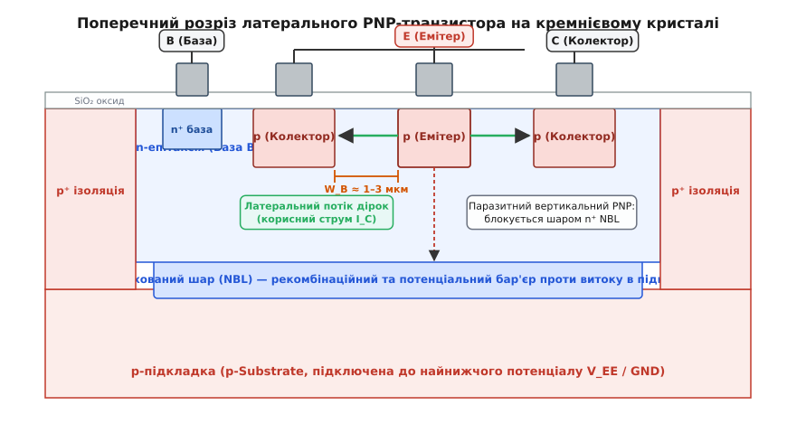
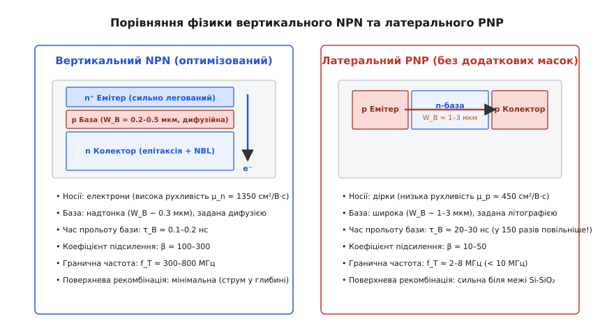
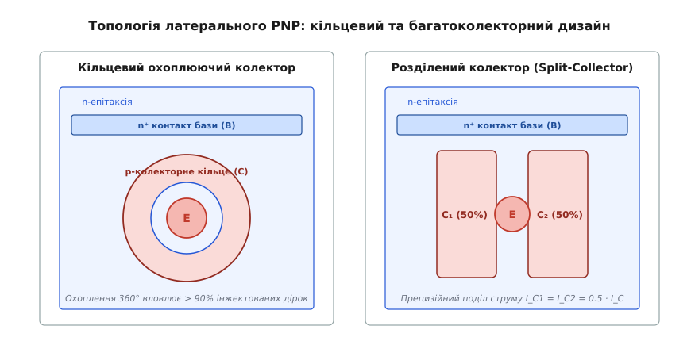
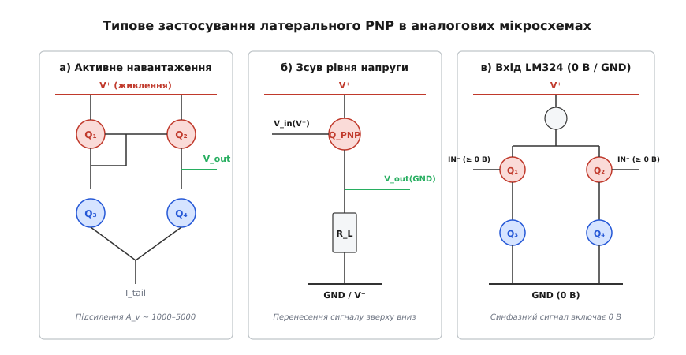

# Латеральний p-n-p транзистор в інтегральних схемах

<preknowlist>
- [p-n перехід](book:physics/pn-junction) — утворення збідненої області, потенціальний бар'єр та інжекція носіїв при прямому зміщенні.
- [Легування напівпровідників](book:physics/doping) — створення донорних (n) та акцепторних (p) областей, рухливість електронів і дірок у кремнії.
- [Будова BJT](book:electronics/bjt-structure) — тришарова планарна структура біполярного транзистора (емітер, база, колектор) та принцип підсилення струму.
- [Планарний процес](book:electronics/planar-process) — термічне оксидування, фотолітографія та локальна дифузія домішок через оксидні вікна.
- [p-n ізоляція компонентів на кристалі](book:electronics/pn-isolation) — розділення компонентів зворотними переходами, ізольовані n-кишені та приховані n⁺ шари.
</preknowlist>

Коли розробник аналогової монолітної мікросхеми намагається побудувати операційний підсилювач, стабілізатор напруги чи компаратор, він стикається з критичною перешкодою: у стандартному планарному біполярному техпроцесі, де формуються високошвидкісні вертикальні n-p-n транзистори, прилади протилежного p-n-p типу повністю відсутні. Сигнал, посилений першим NPN-каскадом, знімається з колектора поблизу додатньої шини живлення `V⁺`, і щоб передати його на базу наступного каскаду без втрати розмаху напруги, потрібен зсувач рівня або навантажувальне джерело струму p-типу. Спроба замінити комплементарні транзистори звичайними дифузійними резисторами призводить до неприйнятних наслідків: резистори номіналом 100–500 кОм займають понад 60% площі кремнієвого кристала, мають шалений технологічний розкид ±25% і знижують коефіцієнт підсилення схеми у сотні разів.

Щоб подолати цей бар'єр без здорожчання виробництва, інженери створили латеральний p-n-p транзистор — прилад із принципово горизонтальним рухом носіїв заряду, який виготовляється в єдиному технологічному циклі з NPN-транзисторами без додавання жодної нової фотолітографічної маски.

## Технологічна дилема монолітної інтеграції

У класичній напівпровідниковій технології кремнієва пластина оптимізується під вертикальний NPN-транзистор: на слаболегованій p-підкладці вирощується n-епітаксійний шар (колектор NPN), у ньому дифузією бору формується p-область (база NPN), а всередині неї неглибокою дифузією фосфору або миш'яку створюється сильнолегований `n⁺` шар (емітер NPN). Струм електронів у такому транзисторі рухається суто вертикально — від поверхневого емітера крізь тонкий базовий прошарок униз до епітаксійного колектора.

Спроба сформувати на такій самій пластині повноцінний вертикальний PNP-транзистор вимагає створення ізольованої p-кишені, формування всередині неї n-бази та подальшої дифузії `p⁺` емітера. Це означає додавання трьох або чотирьох додаткових масок фотолітографії, окремих операцій високотемпературного розгону домішок та іонної імплантації. У кремнієвому виробництві кожна додаткова маска збільшує кількість дефектів кристалічної ґратки, знижує вихід придатних чипів на 10–15% і піднімає собівартість пластини майже в півтора раза.

Рішення, запропоноване в середині 1960-х років, полягало у використанні вже наявних технологічних шарів у несподіваній геометричній орієнтації: замість вертикального стека шарів створити транзистор, у якому емітер і колектор розташовані поруч на одній поверхні, а струм тече в горизонтальній площині вздовж кристала; про драматичну історію цієї інженерної інновації та її роль у створенні легендарних мікросхем розповідає [історія появи бічного PNP та створення перших монолітних ОП](book:electronics/lateral-pnp/hist-lateral-pnp.md).

```
+─────────────────────────────────────────────────────────────────────────────+
|                         Поверхневий оксид SiO₂                              |
+───────┬──────────────────────┬───────────────┬──────────────────────┬───────+
|  p⁺   |      n-епітаксія     |      p⁺       |      n-епітаксія     |  p⁺   |
| стінка|  (кишеня під NPN)    |    стінка     | (кишеня під латерал) | стінка|
|       ├──────────────────────┤               ├──────────────────────┤       |
|       |  n⁺ прихований шар   |               |  n⁺ прихований шар   |       |
+───────┴──────────────────────┴───────────────┴──────────────────────┴───────+
|                              Підкладка p-Si                                 |
+─────────────────────────────────────────────────────────────────────────────+
```

## Конструкція та формування в планарному процесі

Латеральний PNP-транзистор формується всередині стандартної ізольованої n-епітаксійної кишені, яка слугує базою приладу. Під час виконання єдиної фотолітографічної операції, призначеної для формування баз NPN-транзисторів, в оксиді кремнію розкривають два вікна на малій відстані одне від одного. Через ці вікна проводять дифузію бору (акцепторна домішка), одночасно створюючи дві сусідні p-області з однаковою глибиною залягання (близько 1.5–2.5 мкм) та однаковою концентрацією акцепторів `N_A ~ 10¹⁷ – 10¹⁸ см⁻³`:

1. **Емітер (p-тип)**: центральна дифузійна область, яка підключається до вищого потенціалу й інжектує дірки в навколишній кремній.
2. **Колектор (p-тип)**: дифузійна область, що оточує емітер і збирає інжектовані дірки.
3. **База (n-тип)**: ділянка слабколегованого n-епітаксійного шару (`N_D ~ 10¹⁵ – 10¹⁶ см⁻³`), розташована між емітером і колектором.
4. **Контакт бази (n⁺-тип)**: дрібна сильнолегована область, що формується одночасно з емітерами NPN-транзисторів (`N_D ~ 10²⁰ см⁻³`) для забезпечення нелінійного омічного контакту алюмінієвої металізації до n-епітаксії.
5. **Прихований шар (n⁺ Buried Layer / NBL)**: високопровідна область під епітаксією, легована сурмою або миш'яком (`N_D ~ 10¹⁹ см⁻³`), яка відіграє вирішальну роль у пригніченні паразитних витоків.


*Поперечний розріз кремнієвого кристала з латеральним PNP-транзистором: p-емітер і p-колектор сформовані в єдиній базовій дифузії NPN, латеральний дірковий струм протікає паралельно до поверхні, а n⁺ прихований шар блокує витік дірок у p-підкладку.*

Коли перехід емітер–база зміщується в прямому напрямку (`V_EB > 0.6 В`), p-емітер інжектує дірки в навколишній n-епітаксійний шар. Оскільки колекторний p-n перехід зміщений у зворотному напрямку (`V_CB < 0`), на ньому утворюється сильне електричне поле збідненої області. Дірки, рухаючись горизонтально вздовж поверхні кристала за рахунок дифузії крізь товщу n-бази, досягають колектора й екстрагуються в його контакт, утворюючи корисний струм колектора `I_C`.

## Фізика латерального перенесення та літографічна база

Головна фізична відмінність латерального PNP від вертикального NPN полягає в тому, **чим саме визначається ширина бази `W_B`**.

У вертикальному NPN-транзисторі ширина бази задається різницею глибин проникнення двох послідовних високотемпературних дифузій: бази та емітера (`W_B = x_jB − x_jE`). Оскільки дифузійні фронти контролюються часом і температурою печі з точністю до десятих часток мікрона, вертикальна база виходить надзвичайно тонкою: `W_B ≈ 0.2 – 0.4 мкм`.

У латеральному PNP ширина бази визначається **оптичною фотолітографією** — тобто фізичною відстанню між краями вікон у масці фоторезисту на поверхні кристала за вирахуванням бокового підтікання домішок під діоксид кремнію під час термічної дифузії. Через обмеження оптичної роздільної здатності, похибки суміщення шарів та необхідність запобігання пробою змикання збіднених областей (*punch-through*), ширина нейтральної бази в латеральному транзисторі становить:

```
W_B ≈ 1.5 – 3.0 мкм
```

База латерального PNP у 5–10 разів ширша, ніж у вертикального NPN. До цього додається фундаментальна відмінність у рухливості носіїв заряду:
- У вертикальному NPN струм переносять електрони, рухливість яких у кремнії становить `μ_n ≈ 1350 см²/(В·с)`, а коефіцієнт дифузії `D_n ≈ 35 см²/с`.
- У латеральному PNP струм переносять дірки, рухливість яких майже втричі нижча: `μ_p ≈ 450 см²/(В·с)`, а коефіцієнт дифузії `D_p ≈ 12 см²/с`.

Поєднання широкої бази та низької рухливості дірок фундаментально визначає всі електричні характеристики латерального приладу: низький коефіцієнт підсилення струму `β` та низьку граничну частоту `f_T`.


*Порівняння конструкції та характеристик: вертикальний NPN має надтонку дифузійну базу й високу швидкодію, тоді як латеральний PNP має широку літографічну базу й низький коефіцієнт підсилення, але не вимагає додаткових масок.*

## Механізми обмеження коефіцієнта підсилення струму β

Коефіцієнт підсилення струму біполярного транзистора в схемі зі спільним емітером `β` пов'язаний із загальним коефіцієнтом передачі струму емітера в колектор `α` співвідношенням:

```
β = α / (1 − α)
```

Коефіцієнт `α` є добутком трьох фізичних складових:

```
α = γ · α_T · η_c
```

де `γ` — ефективність інжекції емітера, `α_T` — коефіцієнт переносу бази, а `η_c` — геометричний коефіцієнт збору колектора. У латеральному PNP кожен із цих трьох множників зазнає сильної деградації під дією специфічних фізичних механізмів:

### 1. Зниження ефективності інжекції емітера (γ)
Ефективність інжекції визначає, яка частка струму емітера створюється впорскуванням дірок у базу, а яка — паразитним зустрічним впорскуванням електронів із бази в емітер:

```
γ = 1 / (1 + (D_n · N_D_base · W_B) / (D_p · N_A_emit · W_E))
```

У вертикальному NPN емітер легований надзвичайно сильно (`n⁺`, `N_D ~ 10²⁰ см⁻³`), тому співвідношення концентрацій емітер/база становить понад 1000:1, забезпечуючи `γ > 0.999`. 
У латеральному PNP емітер формується звичайною базовою дифузією, де концентрація акцепторів становить лише `N_A ~ 10¹⁸ см⁻³`. Співвідношення концентрацій емітер/база виявляється всього близько 50:1. Одночасно ширина бази `W_B` у 5–10 разів більша, що додатково посилює знаменник. У результаті ефективність інжекції падає до `γ ≈ 0.96 – 0.98`.

### 2. Рекомбінація дірок у товщі бази та коефіцієнт переносу (α_T)
Дірки, що рухаються від емітера до колектора, рекомбінують з електронами нейтральної n-бази. Коефіцієнт переносу бази виражається через дифузійну довжину дірок `L_p = √(D_p · τ_p)`:

```
α_T = 1 / cosh(W_B / L_p) ≈ 1 − (W_B² / (2 · L_p²))
```

Оскільки втрати струму зростають пропорційно квадрату ширини бази `W_B²`, у латеральній структурі з `W_B ≈ 2.5 мкм` рекомбінаційні втрати в об'ємі бази виявляються у 50–100 разів вищими, ніж у вертикальному транзисторі, знижуючи `α_T` до `0.97 – 0.99`.

### 3. Поверхнева рекомбінація на межі Si–SiO₂
На відміну від вертикального NPN, де струм тече в глибині кристала подалі від дефектів поверхні, у латеральному PNP дірки дифундують безпосередньо під захисним шаром діоксиду кремнію `SiO₂`. На межі поділу кристалічної ґратки кремнію та аморфного оксиду існує висока густина поверхневих станів (пасток Шоклі — Ріда — Холла) `N_ss ~ 10¹⁰ – 10¹¹ см⁻²·еВ⁻¹`. Швидкість поверхневої рекомбінації `S_rec` сягає сотень сантиметрів за секунду, що катастрофічно зменшує ефективний час життя дірок у приповерхневому шарі й додатково знижує `β` за малих колекторних струмів (`I_C < 1 мкА`).

### 4. Високий рівень інжекції (ефект Вебстера)
Оскільки епітаксійна база легована слабо (`N_D ~ 10¹⁵ см⁻³`), уже за помірних струмів емітера `I_E > 0.5 – 1.0 мА` концентрація інжектованих дірок перевищує рівноважну концентрацію електронів у базі (`Δp > N_D`). Для збереження квазінейтральності концентрація електронів у базі різко зростає, що викликає спад ефективності інжекції емітера `γ ∝ 1 / I_C`. Коефіцієнт підсилення `β` латерального PNP має яскраво виражений пік у діапазоні струмів 50–200 мкА та стрімко обвалюється за міліамперних навантажень.

У результаті сукупної дії цих чинників типовий коефіцієнт підсилення струму монолітного латерального PNP становить:

```
β ≈ 10 – 50
```

(у рідкісних оптимізованих процесах — до 70–80), тоді як у сусіднього вертикального NPN він сягає 150–300. Детальні аналітичні виведення рівнянь дифузії, граничних умов та профілів концентрацій наведено у [математичному аналізі перенесення заряду та граничної частоти](book:electronics/lateral-pnp/math-lateral-transport.md).

## Частотні обмеження та час прольоту бази

Широка літографічна база накладає жорсткі обмеження на динамічні властивості латерального PNP. Гранична частота передачі струму `f_T` (частота, на якій коефіцієнт підсилення за струмом у схемі зі спільним емітером падає до одиниці) визначається повним часом затримки носіїв між емітером і колектором `τ_EC`:

```
f_T = 1 / (2 · π · τ_EC)
```

Головним компонентом затримки є час дифузійного прольоту дірок крізь нейтральну базу `τ_B`:

```
τ_B = W_B² / (2 · D_p)
```

Порівняємо два транзистори на одному кристалі:
- **Вертикальний NPN**: `W_B = 0.3 мкм`, `D_n = 35 см²/с` → час прольоту бази `τ_B ≈ 0.013 нс`.
- **Латеральний PNP**: `W_B = 2.2 мкм`, `D_p = 12 см²/с` → час прольоту бази `τ_B ≈ 2.0 нс`.

Час прольоту бази в латеральному PNP майже у 150 разів більший! Якщо додати до цього значні бар'єрні ємності переходів емітера та колектора великої площі, повний час затримки `τ_EC` зростає до 25–45 нс.

У результаті гранична частота підсилення латерального PNP становить:

```
f_T < 10 МГц  (типово 2 – 5 МГц)
```

Для порівняння, вертикальний NPN у тому самому техпроцесі має `f_T ≈ 300 – 800 МГц`. 

Ця різниця має вирішальне значення для схемотехніки: латеральний PNP не можна використовувати для підсилення високочастотних сигналів або швидкісної комутації. У широкосмугових підсилювачах його застосовують лише в колах постійного струму (струмові дзеркала, джерела зміщення) або у вхідних каскадах, де високочастотний сигнал пускають паралельним шляхом в обхід повільного PNP.

## Динаміка глибокого насичення та час розсмоктування заряду

Коли латеральний PNP-транзистор переходить у режим глибокого насичення, колекторний перехід змінює знак зміщення з зворотного на прямий (`V_CB > 0`). У цьому стані не лише емітер, але й колектор починає інтенсивно інжектувати дірки в тіло n-епітаксійної кишені з протилежного боку.

Оскільки об'єм епітаксійної кишені між емітером і колектором великий, у нейтральній базі накопичується гігантський надлишковий заряд неосновних носіїв `Q_sat`:

```
Q_sat = τ_p · (I_B − I_C / β)
```

Коли керувальний каскад намагається закрити транзистор, знявши базовий струм, колекторний струм продовжує текти незмінно протягом тривалого **часу розсмоктування** (`t_s ≈ 200 – 600 нс`), поки надлишкові дірки не зникнуть шляхом повільної рекомбінації в базі або не будуть витягнуті через зворотний базовий струм.

Крім того, у глибокому насиченні потенціал нейтральної n-бази падає нижче від потенціалу емітера та колектора, що викликає пряме зміщення паразитного діода база–підкладка. Це провокує масивне некероване стікання струму в спільну p-підкладку мікросхеми, створюючи різкі просадки напруги внутрішніх шин живлення. Через це в прецизійній лінійній схемотехніці латеральні PNP-транзистори суворо захищають від заходження в насичення за допомогою антинасичувальних діодів Шотткі або спеціальних каскадних схем фіксації потенціалу.

## Паразитний вертикальний PNP до підкладки та методи захисту

Конструкція латерального PNP приховує в собі небезпечну паразитну структуру:
- Поверхневий p-емітер є шаром p-типу.
- n-епітаксія є шаром n-типу.
- Спільна підкладка кремнієвого кристала є шаром p-типу.

Ці три шари утворюють повноцінний **паразитний вертикальний PNP-транзистор**: p-емітер (емітер) → n-епітаксія (база) → p-підкладка (колектор). 

Оскільки p-підкладка всієї мікросхеми підключена до найнижчого потенціалу живлення (`V_EE` або `GND`), колекторний перехід паразитного вертикального транзистора завжди перебуває під зворотною напругою. Коли латеральний емітер інжектує дірки, вони вилітають не лише вбік до планарного колектора, але й вниз — у глибину епітаксії. Якби ці дірки безперешкодно досягали підкладки:
1. До 30–50% струму емітера стікало б марно в підкладку, знижуючи корисний коефіцієнт підсилення `β` до одиниць.
2. Струм витоку в підкладку створював би омічні падіння напруги в кристалі, викликаючи перехресні завади для чутливих сусідніх каскадів.
3. Разом із сусідніми NPN-структурами виникала б чотиришарова структура p-n-p-n (паразитний тиристор), що загрожувало б ефектом катастрофічного тиристорного замикання (*latch-up*).

Для придушення паразитного вертикального PNP та забезпечення високої ефективності збору струму застосовують два обов'язкові інженерні методи:

### 1. Використання важколегованого прихованого шару (n⁺ Buried Layer / NBL)
Безпосередньо під епітаксійною кишенею латерального PNP формують суцільний високолегований прихований шар `n⁺ NBL` з концентрацією донорів `~10¹⁹ см⁻³`. 
Цей шар діє двояко:
- **Потенціальний бар'єр**: різкий градієнт концентрації донорів між слаболегованою епітаксією `n` та важколегованим шаром `n⁺` створює внутрішнє вбудоване електричне поле високої напруженості (*high-low junction*), яке відбиває дірки назад до поверхні кристала.
- **Зона надшвидкої рекомбінації**: якщо окремі дірки проникають усередину `n⁺` шару, через надвисоку концентрацію електронів час життя дірок падає до десятих часток наносекунди, і вони миттєво рекомбінують, не долітаючи до p-підкладки.

Прихований шар `n⁺ NBL` знижує струм витоку в підкладку у 20–50 разів, залишаючи його на рівні менше 1–2% від повного струму емітера.

### 2. Топологічне охоплююче кільце колектора (Collector Ring)
Якщо колектор виконати у вигляді звичайної прямокутної смужки з одного боку від емітера, дірки, інжектовані в інші три боки (270° по колу), будуть втрачені в об'ємі бази або підкладки.

Тому емітер латерального PNP завжди виконують у формі компактного кола або правильного восьмикутника в центрі, а колектор формують у вигляді **суцільного замкненого кільця**, яке повністю охоплює емітер на 360 градусів. Геометричний коефіцієнт перехоплення дірок `η_c` у кільцевій топології перевищує 92–95%. 

Вибір восьмикутної або круглої форми замість прямокутної є критичним для надійності: гострі прямі кути (90°) під дією оптичних ефектів фотолітографії заокруглюються нерівномірно, створюючи зони локальної концентрації електричного поля високої напруженості. Це спричиняє передчасний локальний лавинний пробій переходу за напруг, значно нижчих від розрахункових. Радіально-симетрична топологія гарантує строго однорідний розподіл напруженості поля вздовж усього периметра колектора.

Для прецизійних диференціальних каскадів латеральні транзистори трасують за принципом квадропольного перехресного розташування (*Cross-Quad Layout*), розбиваючи кожен транзистор на два напівприлади та розміщуючи їх по діагоналі матриці 2×2. Це повністю усуває асиметрію від лінійних градієнтів температури та механічних напружень кремнієвої пластини.


*Топологічні конфігурації латерального PNP: ліворуч — суцільне кільцеве колекторне кільце для максимального збору дірок, праворуч — розділений на дві секції колектор (Split-Collector) для прецизійного симетричного ділення струму навпіл.*

## Багатоколекторні структури (Split-Collector PNP)

Кільцева топологія відкриває унікальну можливість, недоступну для вертикальних транзисторів: зовнішнє колекторне кільце можна розділити фотолітографією на кілька окремих ізольованих сегментів (`C₁`, `C₂`, `C₃`), кожен із яких має власний вивід металізації.

Оскільки дірки інжектуються круглим емітером рівномірно в усіх радіальних напрямках, струм кожного колекторного сегмента виявляється строго пропорційним його кутовому розкриттю:

```
I_C1 / I_C2 = θ₁ / θ₂
```

Якщо кільце розрізати навпіл на два симетричні півкільця по 180°, ми отримуємо ідеальний подільник струму 1:1, у якому струми обох колекторів рівні з точністю до десятих часток відсотка (`I_C1 = I_C2 = 0.5 · I_C`). 

Обидва колектори перебувають на відстані всього кількох мікронів один від одного в тій самій епітаксійній кишені, тому будь-який температурний градієнт кристала або технологічні флуктуації легування впливають на них абсолютно однаково. Це дозволяє створювати надзвичайно точні подвійні джерела струму та фазорозщеплювачі без використання масивних узгоджених резисторів.

Детальне структурне зіставлення латерального, субстратного та ізольованого вертикального PNP-транзисторів наведено у вставці [порівняння інтегральних PNP-структур у планарних технологіях](book:electronics/lateral-pnp/comp-ic-pnp-topologies.md).

## Схемотехнічні особливості та компенсація базових струмів

Через низький коефіцієнт підсилення струму (`β ≈ 20`) використання латеральних PNP у прецизійних схемах вимагає спеціальних схемотехнічних прийомів компенсації.

Розглянемо найпростіше двотранзисторне струмове дзеркало на латеральних PNP. Струм навантаження `I_out` пов'язаний із опорним струмом `I_ref` співвідношенням:

```
I_out = I_ref / (1 + 2 / β)
```

Якщо `β = 20`, коефіцієнт передачі становить:

```
I_out = I_ref / (1 + 2 / 20) = I_ref / 1.10 ≈ 0.909 · I_ref
```

Похибка віддзеркалення струму сягає майже 10%, що є неприпустимим для вимірювальних систем.

Щоб нейтралізувати цей дефект, розробники застосовують схемотехнічні модифікації:
1. **Дзеркало з допоміжним буферним транзистором (Base-Current Compensated Mirror)**: між базами PNP та шиною зміщення встановлюють вертикальний NPN-транзистор з високим підсиленням (`β_NPN ≈ 200`). Він бере на себе живлення баз PNP-пари, зменшуючи похибку віддзеркалення до величини `2 / (β_PNP · β_NPN) < 0.05%`.
2. **Дзеркало струму Вілсона (Wilson Current Mirror)**: використання трьохтранзисторної структури з петлею від'ємного зворотного зв'язку за струмом знижує похибку до `2 / β² ≈ 0.5%` та підвищує динамічний вихідний опір у десятки разів (`R_out ≈ β · r_o / 2`).

## Температурний дрейф та напруга емітер–база

Напруга прямо зміщеного переходу емітер–база `V_EB` латерального PNP має яскраво виражений від'ємний температурний коефіцієнт (TC):

```
d(V_EB) / dT ≈ −1.8 ... −2.1 мВ / °C
```

Цей параметр визначається температурним зростанням власної концентрації носіїв у кремнії `n_i(T) ∝ T³ · e^(−E_g / (k · T))` за фіксованого колекторного струму `I_C`. 

Водночас коефіцієнт підсилення `β` демонструє позитивний температурний дрейф (`+0.7% / °C`), оскільки з нагріванням кристала час життя дірок у нейтральній базі зростає, зменшуючи рекомбінаційні втрати. 

Зворотний струм витоку колектор–база `I_CBO` подвоюється на кожні 8–10 °C підвищення температури кристала. За максимальної робочої температури автомобільного діапазону (+125 °C) струм `I_CBO` може зростати від 10 пА до кількох наноамперів, що вимагає низькоомного шунтування баз у критичних вузлах схеми для запобігання тепловому зміщенню робочої точки.

## Схемотехнічні застосування в культових аналогових ІС

Незважаючи на низький коефіцієнт підсилення `β` та скромну швидкодію, латеральний PNP став фундаментом аналогової мікроелектроніки завдяки трьом найважливішим схемотехнічним вузлам:


*Типові схемотехнічні вузли на базі латерального PNP: а) активне навантаження для диференціального каскаду; б) зсувач рівня напруги від позитивної шини живлення вниз; в) вхідний каскад LM324 з можливістю роботи від 0 В (GND).*

### 1. Активне навантаження у вигляді струмового дзеркала (LM741, LM301)
У класичному диференціальному підсилювачі коефіцієнт підсилення напруги визначається добутком крутизни `g_m` на опір навантаження в колекторі: `A_v = g_m · R_L`. Щоб отримати високе підсилення (понад 1000) з пасивними резисторами, знадобилися б номінали `R_L > 500 кОм`, що неможливо розмістити на кристалі.

Латеральні PNP-транзистори `Q₁–Q₂`, з'єднані за схемою струмового дзеркала, утворюють активне динамічне навантаження з еквівалентним вихідним опором `r_o = V_A / I_C ≈ 500 кОм – 2 МОм` за площі всього кілька сотень квадратних мікронів. Це дозволило в операційному підсилювачі `μA741` отримати коефіцієнт підсилення понад 2000 у першому каскаді, перетворивши трикаскадну нестійку схему на елегантну двокаскадну з простою однополюсною міллеровською корекцією ємністю всього 30 пФ.

### 2. Високовольтні вхідні каскади з захистом від пробою (LM741, LM101)
Вертикальні NPN-транзистори мають дуже тонку базу та важколегований емітер, через що напруга зворотного пробою їхнього емітерного переходу становить лише `BV_EBO ≈ 6 – 7 В`. Якщо на диференціальні входи ОП подати велику різницеву напругу, вхідний транзистор зазнає лавинного зенерівського пробою, що призводить до деградації підсилення та зміщення нуля.

Латеральний PNP має слаболеговані переходи, тому його напруга пробою емітер–база сягає:

```
BV_EBO ≈ 40 – 60 В
```

У підсилювачах `LM741` та `LM101` вхідні сигнали подаються на бази латеральних PNP (або складного каскаду PNP-повторювач + NPN зі спільною базою), що забезпечує допустиму диференціальну вхідну напругу до `±30 В` без ризику пошкодження кристала.

### 3. Однополярне живлення з діапазоном від нуля (LM324, LM358)
У чотириканальному ОП `LM324` вхідний каскад виконано на парі PNP-транзисторів `Q₁–Q₂`, увімкнених емітерними повторювачами. 
Оскільки для відкривання PNP-транзистора на його базу потрібно подати потенціал, нижчий за потенціал емітера (`V_B = V_E − 0.65 В`), вхідна напруга на базах може опускатися до потенціалу негативної шини живлення (`0 В / GND`) і навіть на 0.3 В нижче за неї, тоді як емітери залишаються під потенціалом `+0.65 В`, забезпечуючи нормальну активну роботу струмових дзеркал. Це зробило LM324 стандартом для однополярних схем автомобільної та промислової автоматики.

### 4. Регулятори напруги з малим падінням (LDO)
У лінійних стабілізаторах напруги з малим падінням (Low-Dropout Regulators, LDO) латеральний або субстратний PNP використовується як регулюючий прохідний елемент. 
На відміну від NPN-елемента, який вимагає запасу напруги `V_drop ≈ V_BE + V_CE(sat) ≈ 1.0 – 1.3 В`, прохідний PNP увімкнений емітером до входу, а колектором до виходу. Мінімальне падіння напруги становить лише напругу насичення колектор–емітер:

```
V_drop = V_CE(sat) ≈ 0.15 – 0.30 В
```

що дозволяє ефективно стабілізувати напругу 3.3 В від джерела 3.6 В (наприклад, літієвого акумулятора).

> 🔧 **Навіщо це.** Латеральний PNP вчить головного принципу монолітного проектування: обмеження кремнієвого техпроцесу не долають «лобовою атакою» введення додаткових масок, а обходять топологічною та схемотехнічною винахідливістю. Знаючи, що латеральний PNP має низьке `β` (10–50) та вузьку смугу (`f_T < 5 МГц`), розробник закладає схеми так, щоб струми баз компенсувалися дзеркалами, а високочастотний сигнал огинав повільні діркові переходи.

## Еволюція: від біполярних ІС до BiCMOS та комплементарного біполярного процесу

У сучасній напівпровідниковій індустрії місце латерального PNP трансформувалося:
1. **У високовольтних BCD-процесах (Bipolar-CMOS-DMOS)**: латеральний PNP залишається незамінним для схем живлення автомобільної електроніки (40–80 В), стабілізаторів і захисних кіл, де він виготовляється безкоштовно.
2. **У технологіях BiCMOS**: функцію високоомних активних навантажень та зсувачів рівня перебрали на себе p-канальні польові транзистори (pMOS), які мають нульовий струм затвора. Проте латеральні та субстратні PNP-транзистори продовжують використовувати в прецизійних джерелах опорної напруги завширшки забороненої зони (Bandgap References) завдяки їхньому наднизькому флікер-шуму (`1/f`) та передбачуваній температурній характеристиці `ΔV_EB`.
3. **У спеціалізованих комплементарних біполярних процесах (CB)**: для високочастотних трактів формують повноцінні вертикальні ізольовані PNP з діелектричною ізоляцією (Trench Isolation), де `β > 200` та `f_T > 5 ГГц`, сплачуючи за додаткові маски заради безкомпромісної швидкодії.

Латеральний PNP-транзистор назавжди увійшов в історію як топологічний шедевр мікроелектроніки, який відкрив шлях для народження сучасної монолітної аналогової схемотехніки.
