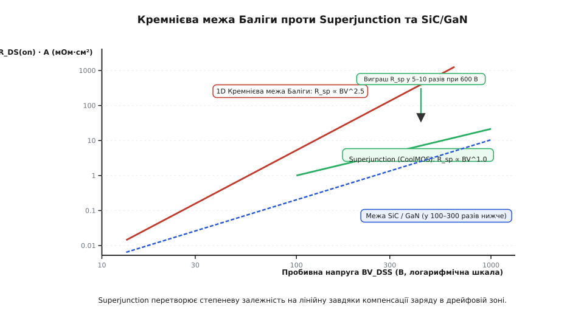

# 🧮 Електростатика дрейфової зони: виведення межі Баліги та Superjunction

В основі проєктування будь-якого силового напівпровідникового приладу лежить фундаментальне фізичне протиріччя: здатність витримувати високу напругу вимагає товстого і слабо легованого шару кремнію, але такий шар має великий омічний опір і виділяє надмірне тепло при протіканні робочого струму.

У цій математичній моделі ми виведемо точні аналітичні співвідношення для розподілу електричного поля в закритому стані комірки, отримаємо класичну одномірну кремнієву межу Баліги *(Baliga's 1D Silicon Limit)* зі степеневою залежністю питомого опору від пробивної напруги `R_sp ∝ BV^2.5`, а також розв'яжемо двовимірне рівняння Пуассона для структури Superjunction, яке доводить перехід до лінійного масштабування `R_sp ∝ BV^1.0` завдяки поперечній компенсації просторового заряду.


*Залежність питомого опору відкритого стану від пробивної напруги: класична кремнієва межа Баліги з нахилом 2.5, лінійна залежність Superjunction та межі широкозонних напівпровідників SiC і GaN.*

---

### 1. Одномірне рівняння Пуассона для n⁻-дрейфової зони

Розглянемо зворотно зміщений p-n перехід, утворений p-тілом *(p-body)* та слабко легованим n⁻-епітаксійним дрейфовим шаром. Оскільки концентрація акцепторів у p-тілі на кілька порядків перевищує концентрацію донорів у дрейфовій зоні (`N_A ≫ N_D`), збіднена область майже повністю поширюється вглиб n⁻-шару.

Розподіл електростатичного потенціалу `V(x)` та напруженості електричного поля `E(x)` вздовж вертикальної координати `x` (де `x = 0` відповідає металургійній межі p-n переходу, а `x = W_d` — межі сильно легованої n⁺-підкладки) описується одномірним рівнянням Пуассона:

```
d²V / dx² = - dE / dx
          = - ρ(x) / ε_s       [рівняння Пуассона]
          = - q·N_D / ε_s      [густина іонізованих донорів ρ = q·N_D]
```

де:
- `q = 1.602 · 10⁻¹⁹ Кл` — елементарний електричний заряд;
- `N_D` (см⁻³) — концентрація іонізованих донорних домішок у дрейфовому шарі;
- `ε_s = ε_r · ε₀ = 11.7 · 8.854 · 10⁻¹⁴ Ф/см ≈ 1.036 · 10⁻¹² Ф/см` — абсолютна діелектрична проникність кремнію *(silicon permittivity)*.

Інтегруємо рівняння для напруженості поля `dE / dx = q · N_D / ε_s` з граничною умовою, що на правому краї збідненої області поле спадає до нуля `E(W_d) = 0`:

```
E(x) = ∫ (q·N_D / ε_s) dx
     = (q·N_D / ε_s) · x + C           [невизначений інтеграл]
     = (q·N_D / ε_s) · (x - W_d)       [враховано E(W_d) = 0]
```

Оскільки вектор напруженості спрямований у бік спадання потенціалу, модуль електричного поля досягає свого абсолютного максимуму `E_max = E_c` на металургійній межі переходу при `x = 0`:

```
E_c = (q·N_D · W_d) / ε_s
```

Отже, просторовий розподіл поля в n⁻-шарі має класичний **трикутний профіль**:

```
E(x) = E_c · (1 - x / W_d)
```

---

### 2. Пробивна напруга і критична товщина дрейфового шару

Пробивна напруга лавинного пробою `BV` *(Breakdown Voltage)* визначається як інтеграл від напруженості електричного поля по всій товщині збідненого шару (геометрично — це площа під трикутним графіком `E(x)`):

```
BV = ∫₀^{W_d} E(x) dx
   = ∫₀^{W_d} E_c · (1 - x / W_d) dx   [підстановка трикутного профілю]
   = E_c · [x - x² / (2·W_d)]₀^{W_d}   [первісна функція]
   = ½ · E_c · W_d                     [площа трикутника з висотою E_c та основою W_d]
```

З цієї геометричної залежності однозначно випливає мінімальна товщина дрейфового шару `W_d`, необхідна для утримання напруги `BV` без передчасного змикання з підкладкою:

```
W_d = (2 · BV) / E_c
```

Підставивши вираз для `W_d` у формулу максимального поля `E_c = (q · N_D · W_d) / ε_s`, знаходимо максимально допустиму концентрацію легування дрейфової зони `N_D`:

```
E_c = q · N_D · (2·BV / E_c) / ε_s     [підставили W_d]
N_D = (ε_s · E_c²) / (2 · q · BV)      [виразили оптимальну концентрацію донорів]
```

> **Фізичний наслідок:** Що вищу пробивну напругу `BV` повинен мати транзистор, то товстішим має бути його дрейфовий шар (`W_d ∝ BV`) і то слабкіше його слід легувати (`N_D ∝ 1 / BV`).

---

### 3. Виведення ідеальної 1D кремнієвої межі Баліги

Питомий опір відкритого дрейфового шару на одиницю площі кристала `R_{drift,sp} = R_drift · A` (вимірюється в Ом·см² або мОм·см²) визначається законом Ома через питому провідність `σ = q · μ_n · N_D`:

```
R_{drift,sp} = W_d / σ
             = W_d / (q · μ_n · N_D)
```

де `μ_n` — дрейфова рухливість електронів у слабо легованому кремнію (`μ_n ≈ 1350–1400 см²/(В·с)` при кімнатній температурі).

Підставимо у вираз для `R_{drift,sp}` раніше отримані значення `W_d` та `N_D`:

```
R_{drift,sp} = [(2 · BV) / E_c] / [q · μ_n · (ε_s · E_c² / (2 · q · BV))]   [підставили W_d та N_D]
             = [(2 · BV) / E_c] · [2 · BV / (μ_n · ε_s · E_c²)]             [скоротили заряд q]
             = (4 · BV²) / (ε_s · μ_n · E_c³)                               [ідеальна 1D межа Баліги]
```

Знаменник цього виразу `BFOM = ε_s · μ_n · E_c³` називають **критерієм якості матеріалу Баліги** *(Baliga's Figure of Merit)*. Він показує провідникову ефективність напівпровідника при заданій діелектричній міцності.

У реальному кремнії критична напруженість електричного поля лавинного пробою `E_c` не є строго постійною, а слабо зростає зі збільшенням рівня легування за емпіричним законом Фуллопа:

```
E_c ≈ 4010 · (N_D)^{1/8} В/см
```

Підставивши залежність `N_D ∝ BV^(-4/7)` у формулу для `E_c` і перерахувавши інтеграл ударної іонізації, отримуємо точну аналітичну формулу кремнієвої межі:

```
R_{drift,sp(Si)} ≈ 5.93 · 10⁻⁹ · (BV)^{2.5}  [Ом·см²]
```

Якщо виразити питомий опір у зручних практичних одиницях **мОм·см²**, а напругу у **вольтах**:

```
R_{drift,sp} [мОм·см²] ≈ 5.93 · 10⁻⁶ · (BV)^{2.5}
```

Таблиця значень ідеального питомого опору дрейфового шару для різних класів напруг:

| Пробивна напруга `BV` | Товщина `W_d` | Концентрація `N_D` | `R_{drift,sp}` кремнію |
|---|---|---|---|
| **30 В** | 2.5 мкм | 8.5 · 10¹⁵ см⁻³ | 0.03 мОм·см² |
| **100 В** | 9.0 мкм | 1.8 · 10¹⁵ см⁻³ | 0.59 мОм·см² |
| **200 В** | 18 мкм | 7.5 · 10¹⁴ см⁻³ | 3.35 мОм·см² |
| **600 В** | 50 мкм | 1.4 · 10¹⁴ см⁻³ | 52.3 мОм·см² |
| **1200 В** | 105 мкм | 5.5 · 10¹³ см⁻³ | 296 мОм·см² |

Зі зростанням напруги від 30 В до 600 В (у 20 разів) опір дрейфової зони зростає у `20^2.5 ≈ 1790` разів. Саме ця нелінійна стіна робить звичайні планарні кремнієві MOSFET вище 200 В надзвичайно неефективними.

---

### 4. Двовимірна електростатика Superjunction (компенсація заряду)

Архітектура Superjunction розв'язує цю проблему шляхом заміни однорідного n⁻-шару періодичною матрицею вертикальних чергованих стовпчиків p-типу та n-типу шириною `W_p` та `W_n` відповідно.


*Розподіл напруженості електричного поля: трикутний профіль класичного VDMOS проти прямокутного профілю Superjunction завдяки поперечному збідненню стовпчиків.*

Застосуємо двовимірне рівняння Пуассона в декартових координатах, де `y` — вертикальна глибина кристала, а `x` — горизонтальна координата впоперек стовпчиків:

```
∂²V / ∂x² + ∂²V / ∂y² = - ρ(x, y) / ε_s
```

У стані блокування зворотної напруги електричне поле розкладається на дві ортогональні складові:
1. **Горизонтальне поле `E_x`:** виникає між сусідніми p- і n-стовпчиками завдяки бічній різниці потенціалів.
2. **Вертикальне поле `E_y`:** утримує основну стокову напругу між витоком і нижньою підкладкою.

Горизонтальне збіднення описується складовою `∂²V / ∂x² = - q · N_D / ε_s`. Напруга повного бічного збіднення стовпчика шириною `W_n` (від центру `x = 0` до межі `x = W_n / 2`):

```
V_pinch = ∫₀^{W_n / 2} (q · N_D / ε_s) · x dx
        = (q · N_D · W_n²) / (8 · ε_s)
```

При типовій ширині стовпчика `W_n = 3–4 мкм` та концентрації `N_D = 2 · 10¹⁵ см⁻³` напруга повного збіднення становить лише:

```
V_pinch = (1.602·10⁻¹⁹ · 2·10¹⁵ · (4·10⁻⁴)²) / (8 · 1.036·10⁻¹²) ≈ 6.2 В
```

Це означає, що вже при напрузі на стоку близько 10–30 В усі стовпчики повністю збіднюються по горизонталі, і їхній об'ємний заряд взаємно нейтралізується:

```
q · N_D · W_n = q · N_A · W_p          [умова ідеального балансу зарядів]
```

Коли об'ємний просторовий заряд скомпенсовано (`∂²V / ∂x² ≈ 0`), вертикальне рівняння Пуассона спрощується до одновимірного рівняння Лапласа:

```
∂²V / ∂y² ≈ 0   ⇒   E_y(y) = const = E_c
```

Замість трикутного спадання поле стає **прямокутним** і рівномірним по всій товщині епітаксійного шару `W_epi`:

```
BV = ∫₀^{W_epi} E_y(y) dy
   = E_c · W_epi
```

Звідси необхідна товщина епітаксійного шару Superjunction становить:

```
W_epi = BV / E_c
```

> **Порівняння товщини:** Для утримання однакової напруги `BV` структура Superjunction потребує рівно **вдвічі меншої товщини дрейфового шару**, ніж класичний транзистор: `W_epi = ½ · W_d(1D)`.

---

### 5. Лінійне масштабування опору Superjunction

Оскільки напруженість поля розвантажується по горизонталі, концентрацію донорів `N_D` у n-стовпчику можна збільшити на один-два порядки порівняно з 1D кремнієм. Обмеженням на `N_D` тепер виступає лише умова, щоб максимальне горизонтальне поле не перевищило критичне значення `E_c`:

```
E_{x,max} = (q · N_D · W_n) / (2 · ε_s) ≤ E_c
N_D(max) = (2 · ε_s · E_c) / (q · W_n)
```

Обчислимо питомий опір n-стовпчика з урахуванням того, що він займає лише половину загальної площі кристала (коефіцієнт заповнення `W_n / (W_n + W_p) = 0.5` при симетричних стовпчиках):

```
R_{sp,SJ} = 2 · [W_epi / (q · μ_n · N_D)]                                    [фактор 2 через половину площі n-стовпчиків]
          = 2 · [(BV / E_c) / (q · μ_n · (2 · ε_s · E_c / (q · W_n)))]       [підставили W_epi та N_D]
          = 2 · [BV / E_c] · [W_n / (2 · μ_n · ε_s · E_c)]                   [скоротили заряд q]
          = (W_n · BV) / (ε_s · μ_n · E_c²)                                  [питомий опір Superjunction]
```

З цієї формули видно ключовий прорив структури Superjunction:
1. Залежність питомого опору від пробивної напруги стала **строго лінійною**: `R_sp ∝ BV^1.0` замість `BV^2.5`.
2. Питомий опір прямо пропорційний ширині стовпчика `W_n`. Що тонші стовпчики вдається створити за допомогою передової фотолітографії та глибокого іонного травлення, то нижчим стає опір кристала.

---

### 6. Числовий розрахунок для 600-вольтового ключа

Порівняймо параметри кремнієвого ключа на 600 В, розрахованого за двома архітектурами.

**Вихідні фізичні константи кремнію:**
- `BV = 600 В`;
- `E_c = 2.5 · 10⁵ В/см = 25 В/мкм`;
- `ε_s = 1.036 · 10⁻¹² Ф/см`;
- `μ_n = 1350 см²/(В·с)`.

#### Варіант А: Класичний 1D VDMOS

```
W_d = (2 · 600 В) / (2.5 · 10⁵ В/см)
    = 4.8 · 10⁻³ см = 48 мкм

N_D = (1.036·10⁻¹² · (2.5·10⁵)²) / (2 · 1.602·10⁻¹⁹ · 600)
    = 3.37 · 10¹⁴ см⁻³

R_{drift,sp} = (4 · 600²) / (1.036·10⁻¹² · 1350 · (2.5·10⁵)³)
             = 1.44 · 10⁶ / (1.036·10⁻¹² · 1350 · 1.562·10¹⁶)
             ≈ 0.0658 Ом·см² = 65.8 мОм·см²
```

#### Варіант Б: Superjunction з шириною стовпчиків W_n = 3 мкм (3 · 10⁻⁴ см)

```
W_epi = 600 В / (2.5 · 10⁵ В/см)
      = 2.4 · 10⁻³ см = 24 мкм         [у 2 рази тонше!]

N_D = (2 · 1.036·10⁻¹² · 2.5·10⁵) / (1.602·10⁻¹⁹ · 3·10⁻⁴)
    = 1.078 · 10¹⁶ см⁻³                 [у 32 рази вище легування!]

R_{sp,SJ} = (3 · 10⁻⁴ · 600) / (1.036·10⁻¹² · 1350 · (2.5·10⁵)²)
          = 0.18 / (1.036·10⁻¹² · 1350 · 6.25·10¹⁰)
          ≈ 0.00206 Ом·см² = 2.06 мОм·см²
```

> **Підсумок:** Питомий опір дрейфової зони при переході до Superjunction зменшився з **65.8 мОм·см²** до **2.06 мОм·см²** — тобто у **32 рази** для теоретичної моделі (у реальних серійних приладах з урахуванням опору каналу та перехідних ділянок виграш становить 5–8 разів).

---

### 7. Чутливість до дисбалансу зарядів (Charge Imbalance)

Головною технологічною складністю Superjunction є надзвичайно гостра залежність пробивної напруги від абсолютної точності легування стовпчиків.

Якщо концентрація донорів не дорівнює концентрації акцепторів (`N_D · W_n ≠ N_A · W_p`), в об'ємі виникає нескомпенсований заряд з густиною:

```
ΔQ = q · |N_D · W_n - N_A · W_p|
```

Відносний дисбаланс легування позначають як `δ = |N_D - N_A| / N_D`. При наявності дисбалансу вертикальне поле знову набуває нахилу з градієнтом `dE_y / dy = q · (ΔN) / ε_s`, що руйнує прямокутний профіль і зміщує точку лавинного пробою або до поверхні кристала (при надлишку донорів), або до нижньої підкладки (при надлишку акцепторів).

Пробивна напруга при дисбалансі `δ` описується квадратичною деградаційною формулою:

```
BV(δ) ≈ BV_ideal · [1 - ½ · (δ · N_D · q · W_epi / (ε_s · E_c))]
```

Розрахунок допустимого технологічного вікна для 600-вольтового Superjunction:
- При дисбалансі `δ = 0%`: `BV = 600 В` (100% номіналу);
- При дисбалансі `δ = ±2%`: `BV ≈ 570 В` (95% номіналу);
- При дисбалансі `δ = ±5%`: `BV ≈ 480 В` (80% номіналу);
- При дисбалансі `δ = ±10%`: `BV ≈ 310 В` (падіння напруги вдвічі, структура деградує до звичайного VDMOS).

Саме тому масове виробництво Superjunction MOSFET стало можливим лише з появою високоточних установок багаторазової епітаксії з прецизійною іонною імплантацією *(multi-epi process)* та технології глибокого реактивного травлення траншей кремнію з подальшим бездефектним епітаксійним заповненням *(trench-fill process)*.

---

### 8. Температурний коефіцієнт опору та термічна стабільність

Важливою практичною перевагою дрейфової зони MOSFET над біполярними приладами (BJT та IGBT) є позитивний температурний коефіцієнт опору *(Positive Temperature Coefficient, PTC)* відкритого стану.

Рухливість електронів `μ_n` у кремнії фундаментально обмежена розсіюванням на акустичних фононах кристалічної ґратки. Зі зростанням абсолютної температури `T` амплітуда теплових коливань атомів кремнію зростає, що зменшує довжину вільного пробігу електронів:

```
μ_n(T) = μ_n(300 K) · (T / 300)^{-k}
```

де показник степеня для слабко легованого кремнію лежить у межах `k ≈ 2.2–2.5`.

Оскільки питомий опір дрейфового шару обернено пропорційний рухливості `R_{drift,sp} ∝ 1 / μ_n`, опір каналу монотонно зростає при нагріванні:

```
R_{DS(on)}(T) = R_{DS(on)}(25 °C) · [1 + α · (T - 25 °C)]
```

де температурний коефіцієнт `α ≈ +0.006–0.008 К⁻¹` (тобто опір зростає на 0.6–0.8% на кожний градус Цельсія).

При нагріванні кристала від 25 °C до максимальної робочої температури p-n переходу 150 °C опір відкритого транзистора зростає приблизно у 2–2.5 раза:

```
R_{DS(on)}(150 °C) ≈ 2.2 · R_{DS(on)}(25 °C)
```

> **Інженерний наслідок:** Позитивний температурний коефіцієнт автоматично забезпечує внутрішній самобаланс струму при паралельному з'єднанні тисяч мікрокомірок на одному кристалі або кількох дискретних транзисторів на друкованій платі. Якщо одна з комірок нагрівається сильніше через локальну неоднорідність кристала, її локальний опір `R_DS(on)` миттєво зростає, відштовхуючи частину струму в сусідні холодніші комірки. Це повністю виключає явище вторинного теплового пробою *(thermal runaway)*, притаманне біполярним транзисторам з їхнім негативним температурним коефіцієнтом прямого падіння напруги.

---

### 9. Нелінійна вихідна ємність C_oss та енергія перемикання E_oss

Поперечне збіднення в структурі Superjunction призводить до вираженої нелінійності вихідної ємності `C_oss = C_ds + C_gd`.

Поки стокова напруга менша за напругу повного бічного збіднення стовпчиків (`V_DS < V_pinch ≈ 10–30 В`), площа бічних p-n переходів між стовпчиками є величезною, тому питома ємність кристала досягає гігантських значень (у 10–50 разів вище, ніж у класичного VDMOS). Щойно напруга перевищує `V_pinch`, стовпчики повністю спорожнюються від носіїв заряду, і ефективна товщина діелектрика стрибком зростає до повної товщини `W_epi`, обвалюючи ємність у сотні разів.

Інтегральний накопичений заряд вихідної ємності `Q_oss` визначається інтегруванням нелінійної функції `C_oss(V)`:

```
Q_oss = ∫₀^{V_bus} C_oss(V) dV
```

А повна енергія, накопичена у вихідній ємності при напрузі живлення шини `V_bus` (яка виділяється у вигляді тепла в кристалі при кожному жорсткому вмиканні ключа):

```
E_oss = ∫₀^{V_bus} C_oss(V) · V dV
```

Для класичного одномірного p-n переходу ємність спадає плавно за кореневим законом `C(V) ∝ 1 / √(V)`, тому енергія становить:

```
E_{oss(1D)} = ⅔ · Q_oss · V_bus
```

Для Superjunction через різкий ступінчастий обвал ємності після 20 В основна частина заряду `Q_oss` накопичується при дуже малій напрузі, завдяки чому інтеграл енергії `E_oss` виявляється значно меншим:

```
E_{oss(SJ)} ≈ ⅓ · Q_oss · V_bus
```

Це суттєво знижує динамічні втрати в резонансних та напіврезонансних топологіях перетворювачів (LLC, фазозсунутий повний міст ZVS), де енергія `E_oss` повинна повертатися в контур за рахунок енергії намагнічування індуктивності протягом мертвого часу.

---

### 10. Лавинна іонізація та інтеграл Чиновета

Фізичною першопричиною електричного пробою в напівпровідниках є процес ударної іонізації *(impact ionization)*, коли електрони та дірки, прискорені високим електричним полем, вибивають нові електронно-діркові пари з атомів кристалічної ґратки.

Коефіцієнт ударної іонізації електронів `α_n` (кількість створених пар на одиницю шляху) описується законом Чиновета:

```
α_n(E) = a_n · exp(- b_n / E)
```

де для кремнію експериментальні константи становлять `a_n ≈ 7.03 · 10⁵ см⁻¹`, `b_n ≈ 1.23 · 10⁶ В/см`.

Умова виникнення нескінченного коефіцієнта лавинного множення струму (тобто умова настання лавинного пробою) визначається інтегралом іонізації вздовж силової лінії електричного поля:

```
∫₀^{W_d} α_{eff}(E(x)) dx = 1
```

Підставивши лінійний розподіл напруженості `E(x) = E_c · (1 - x / W_d)` в інтеграл Чиновета, розраховують точне критичне поле `E_c` для конкретного профілю легування.

Порівняння критичного поля та критерію Баліги для сучасних матеріалів силової електроніки:

| Матеріал | Ширина зони `E_g` | Критичне поле `E_c` | Рухливість `μ_n` | BFOM (відносно Si) |
|---|---|---|---|---|
| **Кремній (Si)** | 1.12 еВ | 0.25 МВ/см | 1350 см²/(В·с) | **1.0** (еталон) |
| **Карбід кремнію (4H-SiC)** | 3.26 еВ | 2.5 МВ/см | 900 см²/(В·с) | **~500** |
| **Нітрид галію (GaN)** | 3.40 еВ | 3.3 МВ/см | 1500 см²/(В·с) | **~1500** |

Оскільки критичне поле `E_c` входить у вираз для питомого опору Баліги у третьому степені `R_{sp} ∝ 1 / (ε_s · μ_n · E_c³)`, десятикратне зростання діелектричної міцності широкозонних матеріалів (SiC та GaN) дозволяє зменшити питомий опір дрейфової зони у сотні разів при збереженні високої пробивної напруги.
