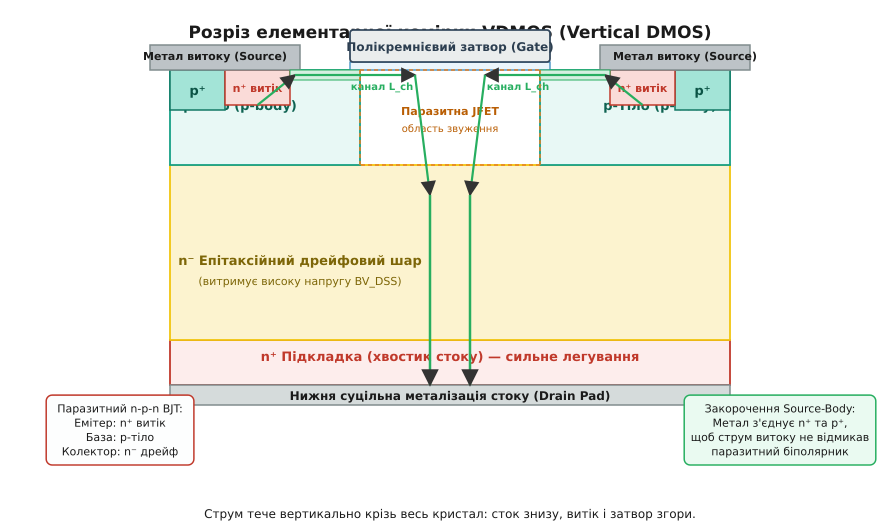
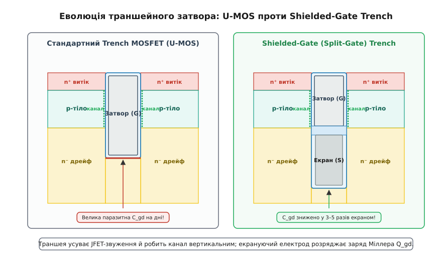
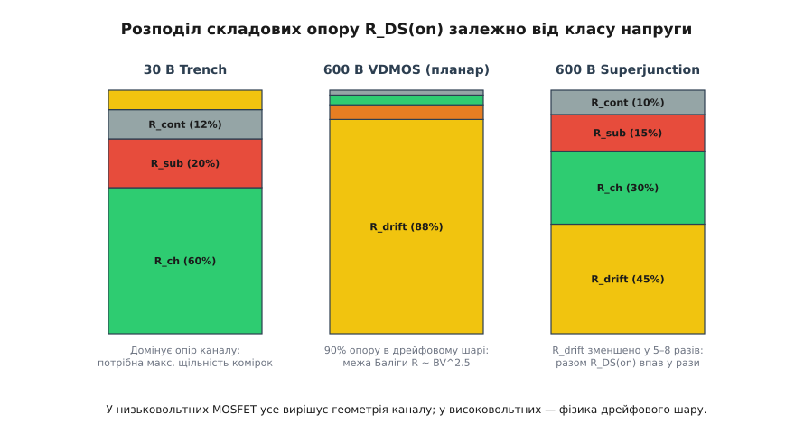
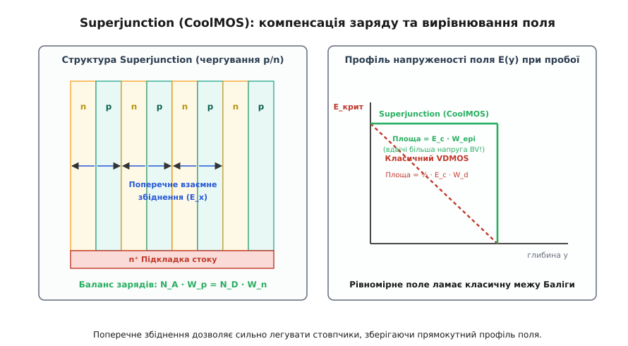
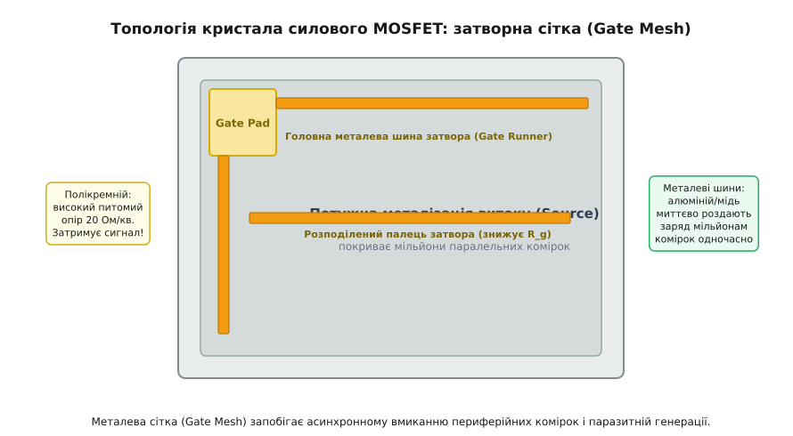

# Комірчаста архітектура силового MOSFET

<preknowlist>
- [Будова MOSFET](topic:electronics/mosfet-structure) — планарний розріз, затвор над діелектриком, наведення каналу витік–стік.
- [Поріг MOSFET](topic:electronics/mosfet-threshold) — умови поверхневої інверсії кремнію під затвором.
- [BJT-транзистори](topic:electronics/bjt) — тришарова структура n-p-n, базовий струм і коефіцієнт підсилення.
- [Body-діод](topic:electronics/body-diode) — внутрішній p-n перехід підкладка–стік і зворотне відновлення.
- [Легування напівпровідників](topic:physics/doping) — донори, акцептори, вільні носії та просторовий заряд.
</preknowlist>

Спроба пропустити струм силового перетворювача силою 50–100 А крізь звичайний польовий транзистор із процесорного кристала завершується миттєвим фізичним знищенням приладу. Тонка алюмінієва металізація товщиною менше мікрона випаровується від колосальної густини струму, що сягає десятків мільйонів амперів на квадратний сантиметр, а поверхневий омічний канал розжарює напівпровідник до температур теплового пробою за лічені мікросекунди.

Силовий польовий транзистор дискретної схемотехніки вимагає докорінно іншого просторового компонування. Замість одного монолітного транзистора на поверхні пластини інженери створюють матрицю з мільйонів паралельно з'єднаних мікроскопічних комірок, розвертаючи напрямок протікання струму з горизонтального у вертикальний.

---

### Криза планарної геометрії: чому поверхневий струм не тримає потужність

У класичному інтегральному MOSFET, який використовують у логічних мікросхемах та операційних підсилювачах, реалізовано бічну *(lateral, латеральну)* структуру. Усі три електроди — витік *(source)*, затвор *(gate)* та стік *(drain)* — розташовані на одній верхній полірованій площині кремнієвої пластини. Струм рухається виключно в тонкому приповерхневому інверсійному шарі товщиною лише 5–10 нанометрів від лівого n⁺-острівця до правого.

Така планарна геометрія має три нездоланні фізичні обмеження при переході в діапазон високих струмів і високих напруг:

1. **Катастрофічна густина струму в планарній металізації:**  
   Щоб зняти струм 100 А з верхніх контактних майданчиків планарного приладу, потрібні широкі металеві доріжки. Оскільки товщина тонкоплівкового алюмінію на кристалі обмежена технологією літографії (типово 1–3 мкм), поперечний переріз провідника залишається крихітним. Локальна густина струму перевищує критичну межу електродіграції *(electromigration threshold)* `J_crit ≈ 10⁶ А/см²`, при якій спрямований потік електронів буквально здуває атоми металу, утворюючи порожнечі, обриви та локальні розплави.

2. **Неефективне використання площі кристала при високій напрузі:**  
   Щоб транзистор утримував напругу 100, 400 чи 600 В у закритому стані без поверхневого пробою, між стоком і витоком на поверхні необхідно витримати значну відстань дрейфової ділянки (від десятків до сотень мікронів). На цій площі не можна розміщувати активний канал — вона слугує лише буфером для розподілу електричного поля. Як наслідок, коефіцієнт корисного використання поверхні кристала падає нижче 5%, а питомий опір відкритого стану на одиницю площі `R_DS(on) · A` стає економічно неприйнятним.

3. **Незручність тепловідведення:**  
   Джоулеве тепло `P = I² · R` виділяється у тонкій поверхневій плівці на лицьовому боці кристала. Щоб передати це тепло на металевий радіатор, тепловий потік мусить подолати всю товщу кремнієвої підкладки зверху донизу, що створює значний паразитно-тепловий опір перехід–корпус `R_thJC`.

Вихід із цього глухого кута полягав у відмові від планарності та переході до об'ємної тривимірної архітектури.

---

### Вертикальний струм: архітектурний перехід до третього виміру

Принциповий інженерний прорив полягає в **просторовому розділенні електродів за протилежними площинами кристала**.

Стіковий електрод повністю переносять на нижню (тильну) сторону кремнієвої пластини *(backside drain)*, покриваючи її суцільним шаром металізації (шари титану, нікелю та срібла для надійної пайки). Цю тильну сторону кристала безпосередньо припаюють високотемпературним припоєм або спікають срібною пастою до масивного мідного теплопровідного фланця корпусу (TO-220, TO-247, DPAK чи поверхневих D2PAK/PowerConnect).

Лицьову (верхню) поверхню кристала повністю віддають під електроди витоку та затвора.

```
       [ Метал витоку ]              [ Затворні шини ]  <- Лицьова грань
───────────────┬─────────────────────────────┬──────────────────────────
               │                             │
        (n⁺ витік / p-тіло)            (Полікремній)
               │
               ▼  Вертикальний струм крізь товщу кристала
               │
        (n⁻ епітаксійний дрейфовий шар)
               │
        (n⁺ низькоомна кремнієва підкладка)
               │
───────────────┴────────────────────────────────────────────────────────
       [ Суцільна металізація стоку ]                   <- Тильна грань (фланець)
```

За такої конфігурації струм входить через верхні витокові контакти, проходить крізь мікроскопічні канали на поверхні й далі рухається строго вертикально вниз крізь усю товщу кремнієвого монокристала, розтікаючись по всій площі стокового фланця.

Це дає одразу три фундаментальні переваги:
- **Максимізація струмопровідного перерізу:** Струм займає 100% об'єму напівпровідникової пластини.
- **Ідеальне тепловідведення:** Зона основного виділення тепла (дрейфовий шар) лежить у безпосередній близькості до масивного мідного фланця; тепловий шлях є найкоротшим із можливих.
- **Можливість масштабування:** Верхню поверхню кристала можна розбити на мільйони однакових мікроскопічних комірок, з'єднаних паралельно єдиним шаром верхньої витокової металізації.

---

### VDMOS: планарна комірка з подвійною дифузією

Першою комерційно успішною архітектурою силового польового транзистора став **VDMOS** *(Vertical Double-Diffused MOSFET — вертикальний транзистор із подвійною дифузією)*, розроблений наприкінці 1970-х років компанією International Rectifier під торговою маркою HEXFET.

Головна інженерна витонченість VDMOS полягає в способі формування довжини каналу `L_ch`. У сигнальних мікросхемах довжина каналу визначається роздільною здатністю літографічної маски затвора. У 1970-х роках фотолітографія не дозволяла масово отримувати лінії менше 3–5 мікрометрів, що давало надто високий опір відкритого каналу. VDMOS обійшов це літографічне обмеження завдяки технології **самосуміщеної подвійної дифузії** *(self-aligned double diffusion)*.


*Анатомія елементарної комірки VDMOS. Крізь єдине вікно полікремнієвого затвора послідовно дифундують p-тіло та n⁺-витік. Довжина горизонтального каналу визначається різницею бічної дифузії. Струм тече вертикально в дрейфовий шар.*

#### Технологічний процес формування комірки VDMOS:

1. На низькоомній n⁺-підкладці вирощують слабко легований епітаксійний шар n⁻-кремнію *(drift layer)* необхідної товщини.
2. Поверхню окислюють, створюючи тонкий підзатворний діелектрик SiO₂, і наносять шар полікремнію.
3. У полікремнії фотолітографією витравлюють регулярні вікна (у формі сот-шестикутників або паралельних смуг).
4. **Перша дифузія (p-тіло):** Крізь відкрите вікно затвора імплантують іони бору (акцептори) і проводять тривалий високотемпературний розгін. Бор проникає вглиб n⁻-шару і, що критично важливо, дифундує **вбік під край полікремнієвого затвора**.
5. **Друга дифузія (n⁺-витік):** Крізь те саме вікно маски імплантують високу дозу фосфору або миш'яку (донори) і проводять короткий терморозгін. Фосфор дифундує повільніше і на меншу глибину.

Оскільки бор розігнався вбік значно далі за фосфор, на поверхні під полікремнієвим затвором утворюється тонка смужка p-кремнію між n⁺-витоком і n⁻-дрейфовою зоною. **Різниця бічних зміщень двох фронтів дифузії задає довжину каналу:**

```
L_ch = x_{p,lateral} - x_{n+,lateral} ≈ 0.5–1.5 мкм
```

Це дозволило отримувати субмікронні канали з високою точністю й повторюваністю на технологічному обладнанні зі скромною літографічною роздільною здатністю 3–5 мкм.

#### Траєкторія руху електронів у відкритій комірці VDMOS:

Коли на затвор подають позитивну напругу щодо витоку (`V_GS > V_th`), поле крізь оксид інвертує тонкий шар p-тіла біля поверхні, утворюючи провідний n-канал. 

Електрони рухаються наступним складним шляхом:
1. З верхньої витокової металізації входять у сильно леговану область **n⁺-витоку**.
2. Проходять горизонтально крізь **інверсійний канал** під затвором.
3. Потрапляють у **шар накопичення** *(accumulation layer)* безпосередньо під оксидом у центрі між комірками.
4. Повертають на 90 градусів униз і протискуються крізь вузьку **JFET-горловину** між двома сусідніми p-body чашами.
5. Розтікаються вертикально по товщі **n⁻-дрейфового шару**.
6. Проходять крізь низькоомну **n⁺-підкладку** і виходять у металізацію стоку.

#### Вузьке місце VDMOS — паразитна JFET-область:

Дві сусідні чаші p-тіла, занурені в n⁻-дрейфовий шар, утворюють структуру, повністю еквівалентну польовому транзистору з p-n переходом (JFET). Проміжок між цими чашами є струмопровідним каналом, а самі p-області діють як затвори JFET.

Коли струм тече вертикально вниз, падіння напруги в дрейфовій зоні створює зворотне зміщення на бічних p-n переходах. Збіднені області p-чаш розширюються назустріч одна одній, стискаючи струмовий потік. Це явище звуть **JFET-затисканням** *(JFET pinch effect)*. 

Якщо спробувати зменшити розмір комірки VDMOS для збільшення їхньої кількості на чипі, JFET-горловина стає настільки вузькою, що її опір `R_JFET` експоненційно зростає, зводячи нанівець усю вигоду від зменшення розміру. Через це максимальна щільність комірок у класичному VDMOS обмежена стелею близько `10⁶ комірок/см²`.

---

### Trench MOSFET: занурення затвора в траншею

Щоб усунути паразитний JFET-опір і різко підвищити щільність каналів, у 1990-х роках мікроелектроніка перейшла до технології **Trench MOSFET** (також відомої як **U-MOS**).

Замість формування планарного затвора на поверхні кремнію, за допомогою реактивного іонного травлення *(Reactive Ion Etching, RIE)* у кремнії прорізають вертикальні канавки (траншеї) глибиною 1.5–3 мкм і шириною 0.3–0.6 мкм. Траншея повністю прорізає шар n⁺-витоку і шар p-тіла, занурюючись своїм дном у n⁻-дрейфовий шар.

Стінки та дно траншеї покривають високоякісним термічним оксидом SiO₂, після чого всю порожнину траншеї заповнюють легованим провідним полікремнієм і зрізають надлишки хіміко-механічною поліруванням (CMP).


*Порівняння конструкцій траншейного затвора. Класичний Trench MOSFET має вертикальний канал вздовж стінок, але страждає від високої ємності C_gd на дні. Shielded-Gate Trench вводить нижній заземлений екран, що кардинально зменшує заряд Міллера.*

#### Переваги траншейної архітектури:

- **Повністю вертикальний канал:**  
  Інверсійний шар формується на бічних вертикальних стінках траншеї. Струм рухається строго зверху вниз без горизонтальних поворотів.
- **Повна ліквідація JFET-ефекту:**  
  Електрони з вертикального каналу виходять безпосередньо в об'єм n⁻-дрейфового шару. Між сусідніми комірками немає звуження з зустрічними p-n переходами, тому складова `R_JFET` повністю зникає з рівняння опору.
- **Колосальна щільність комірок:**  
  Крок комірки *(cell pitch)* зменшився з 10–15 мкм у VDMOS до 0.8–1.5 мкм у сучасних Trench-структурах. Щільність пакування сягнула **10⁷–10⁸ комірок/см²** (від 10 до 100 мільйонів активних комірок на одному квадратному сантиметрі кристала).
- **Збільшення сумарної ширини каналу `W`:**  
  Оскільки кожна траншея має дві активні бічні стінки, сумарна ширина каналу на одиницю площі кристала зростає у 5–10 разів порівняно з VDMOS. Це знижує питомий опір відкритого каналу `R_ch` до рекордно низьких значень.

---

### Shielded-Gate (Split-Gate) Trench MOSFET

Попри блискучі показники статичного опору, класичний Trench MOSFET зіткнувся з важкою динамічною проблемою: **величезною паразитною ємністю затвор–стік `C_gd`** (ємністю Міллера).

У звичайній траншеї дно затвора глибоко занурене в n⁻-дрейфову зону, де прикладено повну стокову напругу. Оскільки оксид на дні траншеї має таку саму малу товщину, як і підзатворний оксид на стінках (20–50 нм), площа дна мільйонів траншей утворює велетенський плоский конденсатор між затвором і стоком. 

При високих швидкостях комутації струм перезаряджання цієї ємності `I_gate = C_gd · (dV_DS / dt)` створює тривале «плато Міллера» на характеристиці затвора, затягуючи процес перемикання і спричиняючи значні динамічні втрати тепла.

Рішенням став транзистор з екранованим затвором — **Shielded-Gate Trench MOSFET** (або **Split-Gate MOSFET**).

Траншею роблять глибшою (до 3–5 мкм), а полікремнієвий електрод усередині розділяють на два незалежні поверхи:
1. **Верхній керівний затвор (Gate Electrode):** Оточений тонким оксидом і розташований строго навпроти p-тіла, виконуючи функцію відкриття вертикального каналу.
2. **Нижній екрануючий електрод (Shield Electrode):** Займає нижню половину траншеї, оточений **товстим захисним оксидом** (у 3–5 разів товстішим за підзатворний) і **електрично з'єднаний із металізацією витоку** *(Source)*, а не затвора.

#### Фізичний ефект екранування:

- Паразитна ємність дна траншеї тепер замкнена між стоком і витоком (`C_ds`), повністю відв'язуючи коло затвора від стрибків стокової напруги.
- Ємність Міллера `C_gd` та сумарний заряд затвора `Q_gd` **падають у 3–5 разів**.
- Товстий діелектрик навколо екрана розвантажує електричне поле на дні траншеї, підвищуючи стійкість приладу до лавинного пробою.

Завдяки екранованому затвору сучасні середньовольтні транзистори (30–150 В) досягли визначних значень критерію добротності *(Figure of Merit, FOM)* `R_DS(on) · Q_gd`, дозволяючи будувати високоефективні імпульсні перетворювачі DC-DC із частотами перемикання 500 кГц–2 МГц для живлення сучасних процесорів та серверів.

---

### Повний баланс опору відкритого стану: R_DS(on)

Опір відкритого силового MOSFET між виводами стоку та витоку є сумою семи послідовних омічних складових, кожна з яких прив'язана до конкретної зони внутрішньої мікрогеометрії:

```
R_DS(on) = R_source + R_ch + R_accum + R_JFET + R_drift + R_sub + R_contact
```

```
[ Витік: R_contact + R_source ]
            │
            ▼
[ Поверхневий канал: R_ch ]
            │
            ▼
[ Зона накопичення: R_accum ]
            │
            ▼
[ Горловина: R_JFET ]  (відсутня в Trench)
            │
            ▼
[ Дрейфовий шар: R_drift ]  (домінує при високій напрузі)
            │
            ▼
[ Підкладка кристала: R_sub ]
            │
            ▼
[ Стік: R_contact ]
```

Розглянемо фізичну природу кожної складової:

1. `R_source` — розподілений опір сильно легованих n⁺-витокових областей під металом.
2. `R_ch` — опір інверсійного каналу. Визначається питомою рухливістю електронів у каналі `μ_ch`, питомою ємністю оксиду `C_ox`, довжиною каналу `L_ch` та сумарною шириною каналу `W`:
   ```
   R_ch = L_ch / (W · μ_ch · C_ox · (V_GS - V_th))
   ```
3. `R_accum` — опір ділянки накопичення носіїв на поверхні слабко легованого n⁻-кремнію під затворним оксидом між комірками.
4. `R_JFET` — опір геометричного звуження між сусідніми p-body кишенями (наявний у VDMOS, усунутий у Trench).
5. `R_drift` — опір слабко легованого епітаксійного n⁻-шару, необхідного для утримання пробивної напруги `BV_DSS`.
6. `R_sub` — опір масивної сильно легованої монокристалічної n⁺-підкладки (товщиною 50–200 мкм), на якій вирощено епітаксію.
7. `R_contact` — опір контакту метал–напівпровідник, опір дротяних розварок *(bond wires)* та металевих виводів корпусу.


*Розподіл складових R_DS(on) для трьох класів приладів. У низьковольтному Trench MOSFET домінує опір каналу; у високовольтному планарному — дрейфовий шар; у Superjunction опір дрейфу зменшено у рази.*

#### Розподіл втрат залежно від номінальної напруги приладу:

- **Низьковольтні транзистори (20–40 В):**  
  Дрейфовий шар дуже тонкий (2–3 мкм) і порівняно сильно легований, тому його опір `R_drift` становить менше 10% загального опору. Понад 60–70% опору припадає на опір каналу `R_ch`, а решта — на підкладку `R_sub` та контакти корпусу. Для цих приладів головна мета — максимальна щільність траншейних комірок.
- **Високовольтні транзистори (500–1000 В):**  
  Дрейфовий шар мусить бути товстим (50–100 мкм) і дуже слабо легованим. Опір `R_drift` зростає настільки сильно, що становить **90–95% усього опору приладу**, роблячи внесок каналу та контактів майже невідчутним.

Залежність питомого опору дрейфового шару від пробивної напруги описується фундаментальною **кремнієвою межею Баліги** *(1D Silicon Limit)*:

```
R_{drift,sp} ∝ (BV_DSS)^{2.5}
```

Детальне строге виведення цього закону з одновимірного рівняння Пуассона та інтеграла ударної іонізації наведено в окремій математичній вставці: [🧮 Виведення кремнієвої межі Баліги](topic:electronics/mosfet-cell-structure/math-baliga-limit.md).

З цієї залежності видно: збільшення пробивної напруги у 10 разів (наприклад, з 60 В до 600 В) збільшує опір дрейфової зони у `10^2.5 ≈ 316` разів! Щоб подолати цей фундаментальний глухий кут, знадобилася концептуально нова архітектура дрейфової зони.

---

### Superjunction: подолання кремнієвої межі компенсацією заряду

Наприкінці 1990-х років компанія Infineon Technologies представила революційну технологію **CoolMOS**, засновану на фізичній концепції **Superjunction** (суперперехід або компенсація просторового заряду).

Ідея Superjunction полягає в заміні однорідного n⁻-дрейфового шару періодичною структурою з вертикальних тонких стовпчиків p-типу *(p-pillars)* та n-типу *(n-pillars)*, розташованих почергово.


*Концепція Superjunction. Чергування p/n стовпчиків забезпечує взаємне поперечне збіднення при малій напрузі. Електричне поле стає прямокутним, дозволяючи сильно легувати струмові n-стовпчики.*

#### Фізичний механізм роботи Superjunction:

1. **Ідеальний баланс зарядів *(Charge Balance):***  
   Концентрацію донорів у n-стовпчиках `N_D` і концентрацію акцепторів у p-стовпчиках `N_A` підбирають так, щоб сумарний електричний заряд у горизонтальному перерізі був строго скомпенсований:
   ```
   N_D · W_n = N_A · W_p
   ```
   де `W_n` та `W_p` — ширина відповідних стовпчиків (зазвичай 2–4 мкм).
2. **Двовимірне бічне збіднення:**  
   Коли до стоку прикладають зворотну блокувальну напругу, електричне поле діє не лише вертикально, а й горизонтально — між бічними стінками сусідніх p- та n-стовпчиків. Через малу ширину стовпчиків вони повністю збіднюються від вільних носіїв заряду вже при напрузі на стоку близько 20–40 В.
3. **Прямокутний профіль електричного поля:**  
   Після повного бічного збіднення об'ємні просторові заряди іонізованих донорів і акцепторів взаємно екранують одне одного. У вертикальному напрямку кремній поводиться як власний напівпровідник (i-тип). Електричне поле `E(y)` стає **строго рівномірним (прямокутним)** по всій глибині дрейфового шару замість трикутного, як у звичайному VDMOS.

#### Інженерні наслідки Superjunction:

- **Збільшення концентрації легування:**  
  Оскільки напруженість поля розвантажується горизонтально, концентрацію донорів у струмопровідних n-стовпчиках вдалося підвищити **у 10–30 разів** порівняно зі звичайним 600-вольтовим VDMOS.
- **Зменшення товщини шару:**  
  Завдяки прямокутному профілю поля для утримання тієї самої напруги потрібна **вдвічі менша товщина дрейфового шару** (`W_epi = BV / E_c`).
- **Зміна закону масштабування:**  
  Залежність питомого опору від пробивної напруги перетворилася зі степеневої на строго лінійну:
  ```
  R_{sp,SJ} ∝ (BV_DSS)^{1.0}
  ```

Для приладів класу 600 В це дозволило знизити питомий опір `R_DS(on) · A` у **5–8 разів**! Наприклад, кристал площею всього 10 мм² у технології CoolMOS має такий самий опір, як гігантський кристал 60–80 мм² першого покоління VDMOS.

> 🔧 **Навіщо це.** Саме поява Superjunction уможливила створення сучасних компактних блоків живлення ноутбуків потужністю 65–100 Вт, серверних перетворювачів із ККД понад 96% (титановий стандарт 80 PLUS) та зарядних станцій електромобілів.

---

### Паразитні напівпровідникові структури комірки

Елементарна комірка MOSFET не є ідеальним польовим транзистором: чергування шарів n⁺–p–n⁻ неминуче створює паразитно інтегровані напівпровідникові компоненти, поведінка яких визначає надійність приладу в екстремальних режимах.

#### 1. Паразитний біполярний транзистор BJT та защіпання (Latch-up):

Кожна комірка містить паразитний біполярний n-p-n транзистор:
- **Емітер:** сильно легований n⁺-витік;
- **База:** p-тіло під затвором;
- **Колектор:** n⁻-дрейфовий шар та n⁺-підкладка стоку.

Якби цей біполярний транзистор відкрився, у ньому виник би лавиноподібний некерований струм, який призвів би до руйнування кристала від вторинного пробою *(secondary breakdown)*.

Щоб надійно заблокувати паразитний біполярник, застосовують **короткозамикач витік–тіло** *(Source-to-Body short)*: верхня металізація витоку навмисно перекриває не лише n⁺-витік, а й центральний, сильно легований **p⁺-контакт тіла**.

```
          Метал витоку (Source Metal)
    ═════════════════════════════════════════
          │                  │
        [n⁺ витік]       [p⁺ контакт тіла]
          │                  │
          └──── R_b ─────────┘   (опір розтікання p-бази)
```

Цей контакт шунтує перехід емітер–база біполярного транзистора через опір розтікання p-бази `R_b`. Поки падіння напруги на `R_b` менше 0.6–0.7 В, біполярний транзистор міцно замкнений.

#### Механізм динамічного відмикання через dV/dt (dV/dt Latch-up):

При дуже швидкому вимиканні силового транзистора напруга на стоку наростає з гігантською швидкістю (`dV_DS / dt` сягає 50–100 В/нс).

Через бар'єрну ємність p-n переходу тіло–стік `C_db` протікає потужний ємнісний струм зміщення:

```
I_cap = C_db · (dV_DS / dt)
```

Цей струм тече крізь шар p-тіла до витокового контакту, створюючи на розподіленому опорі `R_b` падіння напруги:

```
V_be = I_cap · R_b = C_db · (dV_DS / dt) · R_b
```

Якщо швидкість наростання напруги перевищить критичну межу `(dV/dt)_crit`, напруга `V_be` досягне 0.7 В, відмикаючи паразитний n-p-n транзистор. Прилад входить у режим **защіпання** *(latch-up)*: струм крізь біполярник різко зростає, затвор втрачає будь-який контроль над приладом, і настає термічний вибух кристала. 

Саме тому в конструкції сучасних комірок під n⁺-витоком створюють глибоко леговану p⁺-область, яка мінімізує опір `R_b` до десятих часток ома.

#### 2. Антипаралельний діод тіла (Body Diode):

Перехід між p-тілом і n⁻-дрейфовим шаром утворює вбудований діод, анод якого з'єднаний із витоком, а катод — зі стоком.

Цей діод відіграє подвійну роль:
- **Корисна функція:** У мостових схемах інверторів та перетворювачів він працює як зворотний діод *(freewheeling diode)*, скидаючи реактивну енергію індуктивного навантаження в шину живлення без додавання зовнішніх діодів.
- **Шкідлива функція:** Оскільки body-діод є кремнієвим p-n переходом із високим часом життя неосновних носіїв, при його вимиканні виникає великий заряд зворотного відновлення `Q_rr` та тривалий час відновлення `t_rr` (100–500 нс). У момент швидкого закриття діода струм зворотного відновлення генерує важкі сплески напруги, перегріває протилежний транзистор напівмоста і може спровокувати описане вище dV/dt руйнування.

Для високочастотних схем мостових інверторів виробники випускають спеціальні серії транзисторів зі **швидким діодом тіла** *(Fast Recovery Diode / Fast-Body MOSFET)*, де час життя носіїв штучно зменшують за допомогою імплантації платини, опромінення електронами або протонами.

---

### Топологія кристала та затворна сітка (Gate Mesh)

Кристал потужного MOSFET складається з 10–100 мільйонів елементарних комірок, розташованих на кремнієвому чипі площею від 5 до 100 мм².

Однак просто об'єднати всі затвори єдиним шаром легованого полікремнію неможливо. Полікремній, навіть сильно легований, має значний питомий опір квадрата *(sheet resistance)* `R_sq ≈ 15–30 Ом/□` (для порівняння: алюміній має `0.02–0.04 Ом/□`).


*Топологія силового кристала. Потужний метал витоку покриває майже всю площу. Металеві шини затвора (Gate Runners) швидко розносять заряд від Gate Pad до найвіддаленіших полікремнієвих комірок.*

#### Проблема просторової затримки RC:

Полікремнієва площина разом із тонким підзатворним оксидом утворює розподілену двовимірну RC-лінію з розподіленим опором `R_g` та ємністю `C_iss`.

Якби затворний сигнал подавався лише на один кутовий майданчик *(Gate Pad)*, виник би важкий ефект асинхронного перемикання:
1. Комірки, розташовані поруч із Gate Pad, заряджалися б миттєво (за 2–5 нс).
2. Комірки на протилежному кінці кристала запізнювалися б на 30–50 нс через високий опір довгої полікремнієвої доріжки.
3. У процесі вмикання весь робочий струм навантаження (наприклад, 150 А) на десятки наносекунд сконцентрувався б у кількох відсотках найближчих комірок. Ця локальна концентрація струму спричиняє миттєвий перегрів («гарячі плями») і деградацію кристала.

#### Рішення — металева сітка затвора (Gate Runners / Gate Mesh):

Для забезпечення синхронності комутації по поверхні кристала прокладають мережу товстих високопровідних металевих шин (алюмінієвих або мідних):
- **Головна затворна шина *(Gate Runner):*** оперізує периметр кристала.
- **Розподілені затворні пальці *(Gate Fingers):*** пронизують активне поле комірок з регулярним кроком 300–800 мкм.

Металеві пальці контактують із полікремнієвою сіткою комірок через регулярні перехідні отвори *(vias)*. Завдяки цьому сигнал від драйвера затвора миттєво розноситься по металу зі швидкістю світла, а максимальна довжина полікремнієвої доріжки для кожної окремої комірки не перевищує кількох сотень мікронів. Це забезпечує синхронне відкриття всіх 50 мільйонів комірок із розбіжністю менше 1–2 нс.

---

### Порівняльний аналіз архітектур силових MOSFET

Різні типи коміркових архітектур оптимізовано під різні робочі напруги, частоти та типи навантажень.

| Параметр / Характеристика | VDMOS (планарний) | Trench MOSFET (U-MOS) | Shielded-Gate Trench | Superjunction (CoolMOS) |
|---|---|---|---|---|
| **Типовий діапазон напруг `BV_DSS`** | 100 – 1000 В | 12 – 100 В | 30 – 250 В | 500 – 900 В |
| **Щільність комірок (комірок/см²)** | 10⁵ – 10⁶ | 10⁷ – 10⁸ | 5·10⁷ – 10⁸ | 10⁶ – 5·10⁶ |
| **Питомий опір `R_DS(on) · A`** | Дуже високий (базовий) | Найнижчий у низькій напрузі | Наднизький | Найнижчий у високій напрузі (Si) |
| **Паразитна ємність `C_gd` (Міллера)** | Помірна | Висока (дно траншеї) | **У 3–5 разів нижча** | Низька |
| **Критерій якості FOM (`R_on · Q_g`)** | Низький | Середній | **Найвищий у класі <200 В** | **Найвищий у класі 600 В** |
| **Стійкість до лавинного пробою (Avalanche EAS)** | Висока | Середня | Висока | Чутлива до дисбалансу заряду |
| **Складність і вартість виробництва** | Низька (4–5 масок) | Середня (6–8 масок) | Висока (8–10 масок) | Дуже висока (Multi-Epi / Trench Fill) |
| **Основні сфери застосування** | Прості реле, лінійні стабілізатори | Автомобільна електроніка 12 В, материнські плати | Серверні DC-DC, синхронні випрямлячі, телеком 48 В | Мережеві БЖ 230 В, сонячні інвертори, зарядні станції EV |

---

### Інженерний синтез

Архітектура силового MOSFET є результатом еволюції від двовимірної планарної мікросхеми до складного тривимірного просторового приладу. 

1. **Вертикальний струм** зняв бар'єри по густині струму та тепловому опору, перенісши стік на масивний нижній фланець корпусу.
2. **VDMOS** заклав концепцію паралельного об'єднання мільйонів самосуміщених комірок на базі подвійної дифузії.
3. **Trench та Shielded-Gate MOSFET** ліквідували паразитний JFET-опір, розгорнули канал у вертикальну площину та знизили заряд Міллера, ставши абсолютним стандартом у низьковольтній та середньовольтній силовій електроніці.
4. **Superjunction** реалізував фізику двовимірної компенсації заряду, перетворивши степеневу кремнієву межу Баліги `R_sp ∝ BV^2.5` на лінійну `R_sp ∝ BV^1.0`, що відкрило шлях до сучасної високоефективної імпульсної енергетики.
