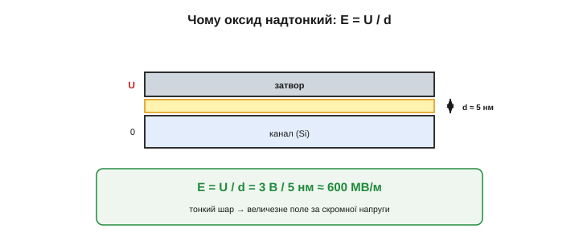

# Будова MOSFET: затвор–ізолятор–канал

Сама [ідея MOSFET](topic:electronics/field-control) проста: поле з затвора відмикає канал, майже не споживаючи струму. А що ж усередині — з яких шарів зроблено прилад і чому саме так? Розбиратимемо найпоширеніший тип — **n-канальний збагачений MOSFET** *(n-channel enhancement MOSFET)*; решта ([p-канальний та збіднений](topic:electronics/nmos-pmos)) — це варіації на ту саму тему.

### Анатомія в розрізі

Уявімо прилад **у розрізі**, шар за шаром, знизу вгору.

- **Підкладка** *(substrate / body, тіло)* — товстий шматок кремнію **p-типу** (його робить таким [легування акцепторами](topic:physics/doping)): у ньому основні носії — дірки, вільних електронів обмаль. Це фундамент, на якому будують усе інше.
- **Витік і стік** *(source, drain)* — у підкладку вплавлено дві ділянки **сильно легованого n⁺-кремнію** (багато вільних електронів). Це два «береги» майбутнього каналу; між ними — проміжок p-кремнію.
- **Підзатворний оксид** *(gate oxide)* — над цим проміжком вирощено **дуже тонкий** шар діоксиду кремнію (SiO₂, скло) — той самий ізолятор, що його приборкання відкрило дорогу до MOSFET ([📜 історія](topic:electronics/field-control/hist-mosfet.md)).
- **Затвор** *(gate)* — поверх оксиду лежить провідний шар (історично метал — «M» в M-O-S; у сучасних приладах — легований полікремній). Він накриває канальний проміжок, але **електрично відділений** від нього оксидом.


*Анатомія MOSFET. На p-підкладці — дві n⁺-ділянки (витік і стік); між ними канальний проміжок, накритий тонким шаром оксиду; зверху — затвор. Затвор не торкається кремнію: між ними скло.*

Зверніть увагу на головне: **затвор ніде не торкається кремнію** — між ними скрізь шар скла. Саме тому в затвор і не тече струм, а сам затвор разом із кремнієм під ним утворює конденсатор, на якому й тримається [польове керування](topic:electronics/field-control).

Значок «плюс» у n⁺ означає **сильне** легування: у цих ділянках вільних електронів дуже багато, тож вони добре проводять і щедро віддають носії в майбутній канал. Підкладка ж легована слабко й має протилежний, p-тип. Саме ця гра типів — n⁺-береги в p-морі — і створює ту пару зустрічних переходів, що замикають прилад, поки каналу немає. Усе легування роблять, [вганяючи в кремній домішки](topic:physics/doping): донори для n-ділянок, акцептори для p.

### M-O-S: три шари, що дали назву

Якщо подивитися на серцевину приладу — стовпчик прямо під затвором, — побачимо три шари, що й дали назву **МОН** (метал–оксид–напівпровідник):

```
   M  — метал (затвор):        провідник, на нього подаємо напругу
   O  — оксид (SiO₂):          тонкий ізолятор-скло
   S  — напівпровідник (Si):   канал, що ним керуємо
```

Це буквально **конденсатор**: дві провідні обкладки (затвор і кремній) розділені діелектриком (оксидом). Уся «магія» MOSFET відбувається в цьому крихітному бутерброді: напруга на металі створює поле, поле проходить крізь скло й керує провідністю кремнію під ним.

А якщо це конденсатор, то в нього є **ємність** — і не зовсім мала, бо обкладки близько (тонкий оксид!), а площа під затвором не нульова. У спокої тримати на ній заряд — задарма. А от **перезаряджати** її щоразу при перемиканні — вже ні: саме ця [ємність затвора](topic:electronics/gate-capacitance) визначить, наскільки **швидко** MOSFET уміє вмикатися й вимикатися.


*Серцевина MOSFET — стовпчик метал-оксид-напівпровідник. Це конденсатор: затвор і кремній — обкладки, оксид — діелектрик. Напруга на затворі → поле крізь скло → керування каналом.*

Слово «метал» у назві лишилося з історії: перші затвори справді робили з алюмінію. Сучасні ж найчастіше роблять із **легованого полікремнію** *(polysilicon)* — він теж добре проводить, але витримує гарячі етапи виробництва й дозволяє точніше «самосумістити» затвор із каналом. Назва MOS прижилася, хоч «метал» там тепер часто умовний; суть — провідний затвор над тонким оксидом — не змінилася ні на йоту.

### Чому без затвора струму немає

Тепер найважливіше для розуміння: що відбувається, коли на затворі **немає** напруги? Чи потече струм від витоку до стоку просто так?

**Ні.** Подивімося на шлях: n⁺-витік → p-підкладка → n⁺-стік. Це **n-p-n** — два p-n переходи **назустріч** один одному, як два діоди, [увімкнені зустрічно](topic:electronics/diode-bias). Хоч куди прикладай напругу між витоком і стоком — один із цих переходів завжди буде зміщений **зворотно** й струм перекриє. Тобто **без каналу прилад замкнений** в обидва боки. Це і є стан «вимкнено». Це навіть корисніше за один діод: закритий MOSFET тримає напругу **в обидва боки**. Щоправда, межа є — максимальна напруга стік–витік, вище якої зворотний перехід усе ж пробивається; її, як і [межу напруги в біполярного транзистора](root:embedded/bjt-load-driving), беруть із даташита із запасом.

Завдання затвора — **створити відсутній місток**: перетворити тонкий шар p-кремнію під оксидом на провідний n-шар, що з'єднає два n⁺-береги. [Як саме поле наводить канал](topic:electronics/mosfet-threshold) — окрема історія; для будови важливо засвоїти головне: **канал не існує сам собою, його наводить поле**. Тому цей тип і звуть «**збагаченим**» *(enhancement)* — канал доводиться щоразу «збагачувати», наводити; без напруги на затворі його немає, і прилад **нормально закритий**.

Існує й протилежний тип — **збіднений** *(depletion)* MOSFET, у якому канал «вбудований» від народження: такий прилад навпаки **нормально відкритий**, а полем його доводиться **закривати**, виштовхуючи носії з каналу. Він трапляється значно рідше, і його варто [порівняти зі збагаченим поряд](topic:electronics/nmos-pmos). Тут тримаймося збагаченого, нормально закритого — саме він панує і як логічний ключ у процесорах, і як силовий ключ.

Корисний образ усієї будови: два n⁺-**острови** (витік і стік) посеред p-**моря**, а переправи між ними немає. Затвор — наглядач, що полем наводить **тимчасовий міст** (канал) між островами: дав напругу — міст постав, носії побігли з берега на берег; прибрав напругу — міст зник, рух спинився. Уся решта анатомії — підкладка, береги, тонкий оксид — існує лише задля того, щоб цей наведений міст з'являвся **чітко, швидко й керовано**. І, на відміну від звідного моста з дощок, він не зношується від мільярдів підйомів: щоразу він постає наново з самих електронів.


*Стан «вимкнено». Без напруги на затворі шлях витік→стік — це n-p-n, два зустрічні діоди. Який бік не запитай — один перехід зворотний, струм перекритий. Каналу немає — прилад замкнений.*

> 🔧 **Навіщо це.** Ось чому MOSFET — чудовий ключ: у закритому стані він тримає напругу **обома** напрямками й майже не пропускає струму (тече лише крихітний струм витоку). А ще звідси видно, чому витік і стік часто **симетричні** на вигляд: фізично це дві однакові n⁺-ділянки. Який із них «витік», а який «стік», вирішує не сам транзистор, а **схема** — у n-канального витоком зветься той вивід, що приєднаний до нижчої напруги (звідки електрони «беруться»).

### Чому оксид мусить бути таким тонким

Один параметр у цій будові — критичний: **товщина підзатворного оксиду**. Він має бути **надзвичайно тонким** — лічені нанометри, тобто шар у кілька десятків атомів. Чому?

Бо сила поля, що проникає в кремній, залежить від **напруженості** *(field strength)*, а вона дорівнює напрузі, поділеній на товщину: `E = U / d`. Що тонший оксид (менше d), то сильніше поле при тій самій скромній напрузі на затворі. Якби оксид був товстий, довелося б подавати на затвор величезну напругу, щоб поле «достукалося» до каналу.

Прикиньмо числа. Хай оксид завтовшки 5 нм (нанометрів), а на затворі 3 В:

```
E = U / d = 3 В / 5 нм = 3 / (5·10⁻⁹) ≈ 6·10⁸ В/м = 600 МВ/м
```

Шістсот мільйонів вольтів на метр! Поле колосальне — і саме тому помірних 3 В на затворі досить, щоб керувати каналом. Скло витримує таку напруженість, бо шар надтонкий і бездоганний. Це інженерне диво: керувати потужним струмом мікроскопічним полем у шарі завтовшки в кілька атомів.


*Чому оксид надтонкий. Напруженість поля E = U/d: при товщині 5 нм навіть 3 В дають ~600 МВ/м. Тонкий шар скла = сильне поле за малої напруги = керування «дешевою» напругою.*

> 🔧 **Навіщо це.** У цій тонкості — і сила, і вразливість MOSFET. Сила: керування слабкою напругою. Вразливість: тонке скло легко **пробити** статикою. Доторк зарядженою рукою може дати на затворі десятки-сотні вольтів, і поле прорве оксид **назавжди** — прилад загине. Тому MOSFET (особливо логічні) чутливі до статики, їх зберігають у провідній упаковці, а на затвори в схемах часто ставлять захисні діоди. Те саме тонке скло, що дає керування, не прощає перенапруги.

І ще одне про цей шар: важлива не лише його товщина, а й **чистота межі** зі кремнієм. Та сама пасивація поверхні, що тридцять років не давалася й зрештою відкрила MOSFET ([📜 історія](topic:electronics/field-control/hist-mosfet.md)), працює тут щодня: добрий оксид «зашиває» обірвані зв'язки, і поверхневі стани не псують керування. Кепська межа — і поріг «попливе», транзистор поводитиметься непередбачувано. Тому вирощування підзатворного оксиду — чи не найвідповідальніший крок усього виробництва.

### Насправді чотири виводи

Ми звикли до трьох виводів — затвор, стік, витік, — але уважний погляд на розріз виявляє **четвертий**: саму **підкладку** *(body / bulk, тіло)*. Це окремий електричний вивід, і він впливає на роботу.

У дискретних силових MOSFET підкладку майже завжди **з'єднують усередині з витоком** — тому назовні й виходять три ноги. Але це з'єднання має наслідок: між підкладкою (p) і стоком (n⁺) лишається p-n перехід — [**вбудований діод** *(body diode)*](topic:electronics/body-diode), що його не видно, поки не згадаєш про підкладку. Цей «тілесний діод» то рятує (гасить індуктивний викид у мостах), то підставляє (один ключ не від'єднає зворотну напругу — потрібна пара «спина-до-спини»), а його повільне відновлення доводиться приборкувати окремо; у пригоді (і часом на заваді) він стає у [силовому ключі](topic:electronics/mosfet-power-switch). А в мікросхемах підкладку часто тримають окремо, щоб керувати порогом. Підкладка впливає й тонше: напруга на ній **зсуває поріг** відмикання — це звуть **ефектом підкладки** *(body effect)*. Тому в точних аналогових схемах тіло не лишають напризволяще. У простих же ключах достатньо пам'ятати правило: тіло з'єднане з витоком, а між тілом і стоком чаїться вбудований діод.


*Четвертий вивід — підкладка. У дискретних MOSFET її з'єднують із витоком, тож ніг три. Але перехід підкладка–стік лишається вбудованим діодом — він проступить у [силовому ключі](book:electronics/mosfet-power-switch).*

### Надруковано, а не зібрано

І остання, але вирішальна риса будови: MOSFET роблять **плоскими шарами на поверхні** кремнієвої пластини *(planar process)*. Підкладка, n⁺-ділянки, оксид, затвор — усе це наносять і витравлюють пошарово, як друк, на величезній пластині відразу для **мільйонів** приладів. Нічого не треба збирати з окремих деталей — транзистори «проявляють» у кремнії, мов фотографію.

Саме тому їх і вдається тіснити мільярдами на нігтику: коли прилад — це кілька плоских шарів, його можна зробити мікроскопічним і повторити безліч разів одним і тим самим процесом. А наскільки малим? У сучасних чипах довжина каналу — одиниці нанометрів, лічені десятки атомів упоперек; те, що ми малюємо тут великими шарами заради наочності, насправді дрібніше за довжину хвилі видимого світла. На зрізі нігтя вміщаються десятки мільярдів таких транзисторів. Будова MOSFET — не лише про фізику одного транзистора, а й про те, **чому їх може бути так багато**.


*MOSFET не збирають — його «друкують» плоскими шарами на кремнієвій пластині, мільйони приладів за один процес. Звідси й мільярди транзисторів на одному чипі.*

Будова MOSFET зводиться до кількох плоских шарів: p-підкладка з двома n⁺-берегами, тонкий оксид-скло й затвор над каналом — конденсатор, що керує провідністю. Без поля прилад замкнений (n-p-n), а оксид мусить бути надтонким, щоб скромна напруга на затворі давала колосальне поле. Лишається головне питання — **як саме поле відмикає канал** і що таке той [«поріг», починаючи з якого транзистор оживає](topic:electronics/mosfet-threshold).
