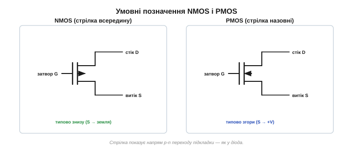
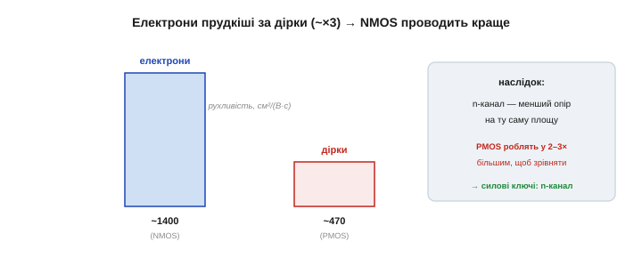

# N-канальний і P-канальний (NMOS/PMOS)

Класичний **n-канальний** MOSFET — це коли в p-підкладці поле наводить канал з **електронів**. Але є й дзеркальний близнюк — **p-канальний**, де все навпаки. Розберімо обидва поряд: це не подвоєння матеріалу, а ключ до розуміння, чому з MOSFET складають усю цифрову логіку.

### Дзеркальна будова

P-канальний MOSFET *(p-channel, PMOS)* — це n-канальний, у якому **всі типи перевернуто**:

- **Підкладка** тепер **n-типу** (основні носії — електрони).
- **Витік і стік** — дві ділянки **p⁺**-кремнію (багато дірок).
- **Канал**, коли він з'явиться, складається з **дірок** — це інверсійний шар p-типу на поверхні n-підкладки.

Усе як у дзеркалі: де в NMOS був n, тут p, і навпаки. Прилад той самий за ідеєю — затвор крізь оксид керує каналом, — але носії в каналі тепер позитивні дірки, а не негативні електрони.


*Дзеркальні близнюки. NMOS: p-підкладка, n⁺-береги, канал з електронів. PMOS: n-підкладка, p⁺-береги, канал із дірок. Однакова будова — протилежні знаки.*

Варто додати, що і n-, і p-канальні бувають двох підвидів: **збагачені** (нормально закриті, які ми й розбираємо) та **збіднені** (нормально відкриті, із каналом, вбудованим від народження, — це різні значення [порогової напруги](book:electronics/mosfet-threshold)). На практиці майже скрізь — збагачені, тож надалі під «NMOS» і «PMOS» матимемо на увазі саме їх. Збіднені трапляються лише у вузьких нішах, як-от деякі радіочастотні каскади.

### Протилежна полярність вмикання

Якщо типи перевернуто, то й **керувальна напруга — протилежного знаку**.

- **NMOS** відкривається, коли затвор стає **додатнішим** за витік: позитивне поле стягує **електрони** в канал. Vgs > Vth, де Vth **додатний** (скажімо, +2 В).
- **PMOS** відкривається, коли затвор стає **від'ємнішим** за витік: негативне поле стягує **дірки** в канал. Vgs < Vth, де Vth **від'ємний** (скажімо, −2 В).

Тобто NMOS вмикають, **піднімаючи** напругу затвора, а PMOS — **опускаючи** її. Це найважливіша практична відмінність, і саме вона так зручно лягає у схеми.

```
NMOS:  затвор ВИЩЕ за витік (Vgs > 0)  → відкрито
PMOS:  затвор НИЖЧЕ за витік (Vgs < 0)  → відкрито
```


*NMOS відкривають додатною Vgs (затвор вищий за витік), PMOS — від'ємною (затвор нижчий за витік). Протилежні знаки — бо протилежні носії.*

Числа роблять це наочним. **NMOS:** витік на землі (0 В), подаємо на затвор +5 В → Vgs = 5 − 0 = +5 В, більше за Vth ≈ +2 В → відкрито. **PMOS:** витік на +5 В, подаємо на затвор 0 В → Vgs = 0 − 5 = −5 В, менше за Vth ≈ −2 В → теж відкрито. І навпаки: щоб **закрити** PMOS, на затвор треба подати +5 В (тоді Vgs = 0). Тобто «висока» напруга на затворі вмикає NMOS, але вимикає PMOS — дзеркально.

### Де чий витік

Звідси випливає, **куди їх ставлять** у схемі. Витік — це звідки беруться [носії каналу](book:electronics/field-control):

- У **NMOS** носії — електрони, вони «течуть» від низької напруги, тож **витік природно тягнеться до землі**, а керують, піднімаючи затвор над землею. NMOS — звичайний ключ **нижнього плеча** *(low-side)*.
- У **PMOS** носії — дірки, вони «течуть» від високої напруги, тож **витік природно тягнеться до +V**, а вмикають, опускаючи затвор нижче +V (наприклад, притягнувши до землі). PMOS — зручний ключ **верхнього плеча** *(high-side)*.

Той самий поділ на верхнє й нижнє плече знайомий і з [навантаження на біполярному транзисторі](root:embedded/bjt-load-driving), тільки тут він ще природніший: сам тип транзистора підказує, з якого боку навантаження його ставити.


*Умовні позначення. У NMOS стрілка (на підкладці/витоку) вказує всередину, у PMOS — назовні. NMOS зазвичай унизу (витік до землі), PMOS — угорі (витік до +V).*

Як розрізнити їх на схемі? Орієнтуйтеся на **стрілку** (вона на виводі підкладки або витоку): у n-канального вона дивиться **до** каналу, у p-канального — **від** нього. Стрілка показує напрям p-n переходу підкладки, точнісінько як [напрям пропускання діода](book:electronics/diode-bias). А практично ще простіше дивитися на розташування: транзистор «ногами до землі» — майже напевно NMOS, «головою до +V» — PMOS.

> 🔧 **Навіщо це.** Практичний висновок: **PMOS легко керувати у верхньому плечі**, а NMOS — ні. Щоб увімкнути PMOS-ключ між +12 В і навантаженням, досить притягнути його затвор до землі — і Vgs = 0 − 12 = −12 В, прилад відкритий. А щоб так само ввімкнути NMOS у верхньому плечі, на затвор треба подати напругу **вищу за +12 В** (бо витік уже на ~12 В, а Vgs має бути ще додатнішим) — а такої в схемі може й не бути. Тому або беруть PMOS, або застосовують хитрощі (зарядову помпу) — про це в темі про [силовий MOSFET-ключ](book:electronics/mosfet-power-switch).

І все ж більшість силових ключів — драйвери моторів, перетворювачі живлення, контролери заряду — будують саме на **n-канальних**, навіть у верхньому плечі, доплачуючи за схему підняття затвора (зарядову помпу чи бутстреп). Дешевий, малий, низькоомний n-канал того вартий. P-канальний верхнього плеча обирають там, де простота важливіша за останній відсоток ефективності, — скажімо, у звичайному [ключі живлення (load switch)](book:electronics/load-switch), де PMOS однією ніжкою логіки цілком знеструмлює вузол (давач, радіо) заради економії батареї, вмикаючись простим притягуванням затвора до землі.

### Електрони прудкіші за дірки

Є між ними й несиметрична, фізична відмінність. **Рухливість** *(mobility)* електронів у кремнії приблизно **втричі більша**, ніж дірок: електрони — спритніші носії. А це означає, що n-канал за тих самих розмірів і напруги проводить **краще** (менший опір), ніж p-канал.

Наслідок практичний: щоб PMOS мав такий самий опір відкритого каналу, як NMOS, його доводиться робити **в 2–3 рази більшим** (ширший канал компенсує повільніші дірки). Тому в силовій техніці майже завжди обирають **n-канальний** — він дешевший, менший і має нижчий опір на однакову площу. P-канальний беруть тоді, коли важливіша **зручність** керування у верхньому плечі, а не гранична ефективність.

Чому ж електрони прудкіші? Грубо кажучи, дірка — це «брак електрона» у зв'язках, і її рух насправді означає послідовне перескакування електронів із зв'язку в зв'язок, що дається важче й повільніше; вільному електронові бігти легше. Фізики кажуть про меншу «ефективну масу» електрона. Для нас висновок простий: n-канал ефективніший, і саме йому дістається силова й цифрова «важка робота».


*Електрони в кремнії рухливіші за дірки приблизно втричі. Тому n-канал за тих самих розмірів проводить краще; щоб зрівняти PMOS із NMOS, його роблять у 2–3 рази більшим.*

### Кожен сильний у свій бік

Тепер — найцікавіше, заради чого й потрібні **обидва** типи. Виявляється, кожен з них добре передає лише **один** логічний рівень, а інший — погано.

- **NMOS** чудово «садить» вузол **до землі** — передає сильний «нуль». А от підтягнути вузол до самого +V він не може: коли вихід підіймається, його Vgs зменшується, і біля верху транзистор сам себе прикриває. Тож «одиницю» NMOS передає **кволу**.
- **PMOS** — навпаки: чудово підтягує вузол **до +V** (сильна «одиниця»), а «нуль» передає кволо.

Чому так? Бо в NMOS, тягнучи вихід **угору**, ми піднімаємо й сам витік (носії ж течуть від витоку). Коли вихід наближається до +V, напруга витоку росте, тож Vgs = Vg − Vs (затвор мінус витік) **зменшується** — і за крок до мети падає нижче порога, транзистор сам себе зачиняє. Вихід застрягає приблизно на «+V мінус Vth», не дотягуючи до повної одиниці. У PMOS дзеркально: не дотягує до повного нуля. Ось фізична причина, чому кожен сильний лише у свій бік.

Висновок напрошується: **використовуй кожен у його сильний бік**. Хочеш надійно з'єднати вузол із землею — став NMOS знизу. Хочеш надійно з'єднати з +V — став PMOS зверху. А якщо потрібні **обидва** напрямки — постав їх **у пару**.

На практиці це найчастіше виглядає так: хочеш увімкнути моторчик чи світлодіодну стрічку — ставиш **NMOS знизу**, між навантаженням і землею, бо саме «садити до землі» він уміє найкраще, та й керувати ним прямо з ніжки мікроконтролера найзручніше (детальніше — [силовий MOSFET-ключ](book:electronics/mosfet-power-switch)). Це найпоширеніша схема ключа, і вона ж дзеркалить «нижнє плече» на [біполярному транзисторі-ключі](book:electronics/bjt-switch).


*NMOS добре передає «нуль» (садить до землі), але кволу «одиницю»; PMOS — добре «одиницю» (тягне до +V), але кволий «нуль». Тому кожен працює у свій бік.*

### Комплементарна пара — натяк на CMOS

Якщо поставити **PMOS зверху** (тягне вихід до +V) і **NMOS знизу** (тягне вихід до землі) й керувати ними **разом**, дістанемо ідеальний двопозиційний вихід: одна напруга на спільному затворі — і вмикається рівно **один** із пари. Вихід або міцно притягнутий до +V (через PMOS), або міцно до землі (через NMOS), і **ніколи обидва водночас** — тож наскрізного струму від живлення до землі немає, а отже й споживання в спокої майже нульове.

Цю парочку — **комплементарну** *(complementary)*, тобто взаємодоповнювальну — і звуть **КМОН** *(CMOS)*. З неї зроблено геть усю сучасну цифрову логіку: кожен вентиль у процесорі — це пари PMOS+NMOS.

Найпростіший приклад — **інвертор**: PMOS зверху, NMOS знизу, затвори з'єднані (це вхід), стоки з'єднані (це вихід). Подали на вхід «одиницю» → NMOS відкрився, PMOS закрився → вихід притягнуто до землі, тобто «нуль». Подали «нуль» → навпаки: PMOS тягне вихід до +V, виходить «одиниця». Вхід перевернувся на виході — це й є інвертор, найдрібніша цеглинка логіки. Та сама пара робить і чудовий **аналоговий ключ** *(transmission gate)*: NMOS добре пропускає низькі напруги, PMOS — високі, тож паралельно вони чисто проводять **будь-яку** напругу в обидва боки — те, чого одиночний транзистор не вміє.

А ще цікавий історичний поворот: однотипна MOS-логіка (як-от NMOS) обходилася простим резистором-підтяжкою замість другого, комплементарного транзистора. Але такий резистор у половині станів безперервно тягне струм від живлення до землі — чип грівся й споживав енергію навіть у спокої. Заміна того резистора на PMOS (тобто перехід до КМОН) і прибрала наскрізний струм — ось чому саме CMOS, а не NMOS-логіка, дала змогу будувати велетенські й економні процесори.

Це й була тиха революція. Логіка на комплементарних парах споживає енергію майже лише в **мить** перемикання, а в спокої — хіба що крихітну краплю струму витоку. Помножте економію одного вентиля на мільярди — і дістанете різницю між чипом, що пашить, наче праска, і тим, що тижнями живиться від маленької батарейки. Саме тому КМОН витіснила всі попередні різновиди логіки й на десятиліття лишилася єдиною основою цифрової техніки. Чому вона така економна й як із неї будують логіку — окрема велика тема про [КМОН-логіку](book:electronics/cmos); тут досить запам'ятати, що **обидва типи існують саме заради цієї пари**.


*PMOS зверху тягне вихід до +V, NMOS знизу — до землі; керовані разом, вони дають чистий «0» або «1» без наскрізного струму. Це комплементарна пара — основа КМОН-логіки.*

> 🔧 **Навіщо це.** Запам'ятайте розподіл ролей як просте правило: **NMOS тягне вниз, PMOS тягне вгору**. Звідси й уся їхня «географія» у схемах: n-канальний — знизу, до землі; p-канальний — згори, до живлення. Це ж правило пояснює будову будь-якого [логічного вентиля на КМОН](book:electronics/cmos) з першого погляду.

### Підсумок

Отже, MOSFET буває двох дзеркальних типів: n-канальний (швидший, для нижнього плеча й силових ключів) і p-канальний (зручний для верхнього плеча), а разом вони складають комплементарну пару — серце цифрової логіки. Тут не раз спливав «опір відкритого каналу»: то він великий, то малий. Саме цей параметр — [Rds(on)](book:electronics/rds-on) — визначає, скільки силовий ключ гріється, тож на нього варто придивитися окремо й уважно.
