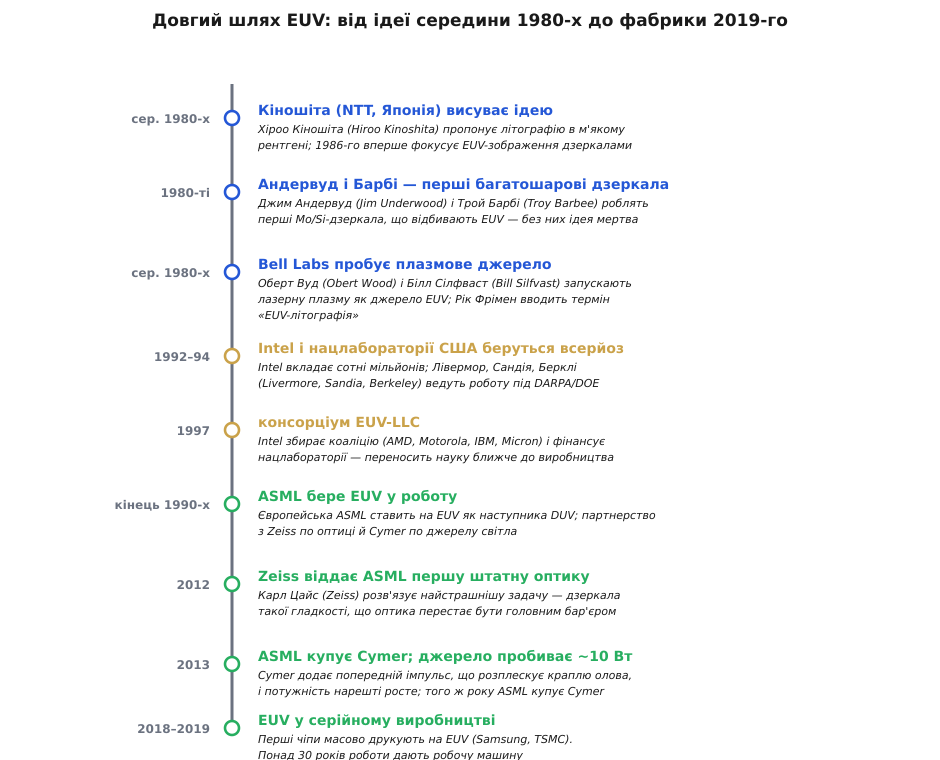
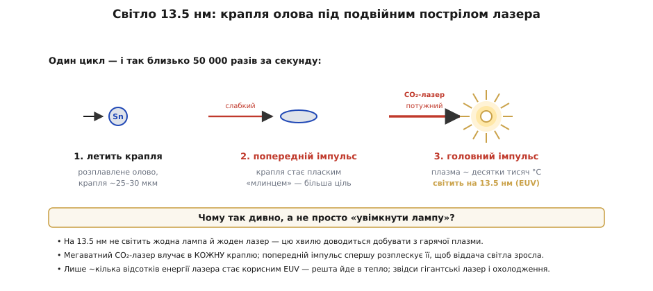
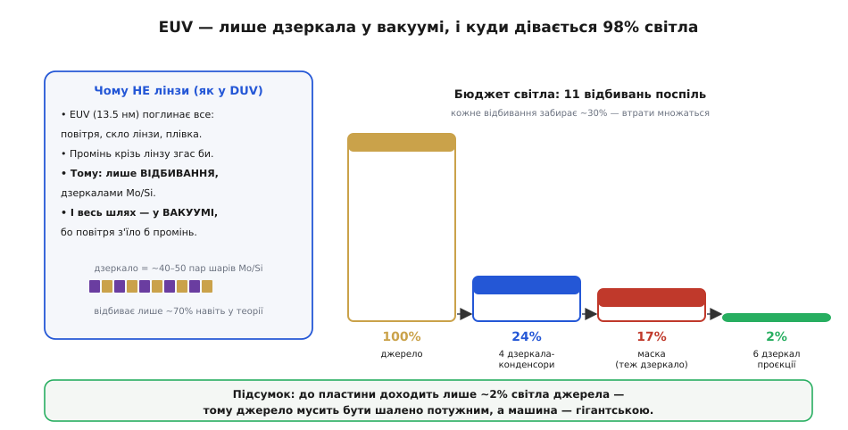

# 📜 ASML і EUV: світло з олов'яної плазми — найскладніша машина у виробництві

> Ця історична вставка виростає з простої речі: щоб перенести рисунок схеми на пластину, її [друкують світлом](topic:electronics/photolithography) крізь маску — як проєктор кидає кадр на екран. Що дрібніша деталь, яку треба надрукувати, то коротша потрібна довжина хвилі світла, бо хвиля не вміє окреслити щось набагато менше за себе. І ось у цьому реченні захована ціла епопея. Коли інженери вперлися в межу звичайного ультрафіолету, наступний крок — світло з довжиною хвилі **13.5 нанометра** (так зване **EUV**, *extreme ultraviolet*, «крайній ультрафіолет») — виявився таким важким, що його довелося добувати **понад тридцять років**, коштом мільярдів доларів і праці цілої коаліції лабораторій та фірм. Машину, яка зрештою з цього вийшла, небезпідставно називають найскладнішим серійним приладом, який будь-коли робило людство. Ця вставка — про те, **чому** так вийшло: чому не можна було просто «взяти лампу яскравіше», звідки беруться ті 13.5 нм, і чому в усьому світі таку машину сьогодні робить лише одна компанія — нідерландська **ASML**.
>
> Розробникові вбудованих систем ця історія не така вже й далека. Кожен мікроконтролер у ваших проєктах — ESP32, STM32, RP2040 — надрукований саме літографією; а найновіші, найдрібніші й найекономніші кристали виходять уже з EUV-машин. Розуміючи, чому передовий техпроцес коштує так дорого й залежить від єдиного постачальника обладнання, ви краще читаєте новини галузі, на якій тримається вся ваша робота. Почнімо з кореня проблеми — з того, чому світло взагалі довелося робити настільки коротким.

## Чому довелося лізти в 13.5 нанометра

В основі всієї цієї історії лежить одна фізична межа, тож із неї й почнімо, бо саме вона штовхнула всю подальшу драму. Світло — хвиля, і надрукувати ним деталь, набагато дрібнішу за його довжину хвилі, неможливо: хвиля просто «розмазує» край. Десятиліттями літографія користувалася ультрафіолетом дедалі коротшим — аж до **193 нм** (це випромінює лазер на молекулах ArF, аргон-фтор). На цій довжині хвилі галузь затрималася надовго й вичавлювала з неї все можливе різними хитрощами, та все одно деталі ставали дрібнішими за саму хвилю, і друкувати їх ставало щораз важче.

Логічний наступний крок очевидний: узяти світло ще коротше. Але тут природа ставить злий жарт, і саме він — пружина всієї подальшої драми. Між 193 нм і 13.5 нм немає зручної «сходинки»: коротшає хвиля — і світло перестає поводитися як світло, до якого ми звикли. На 13.5 нм випромінювання **поглинає геть усе** — повітря, скло, вода, будь-яка лінза, навіть тонесенька плівка бруду. Це вже майже м'який рентген. А отже, ламаються одразу два звичні стовпи літографії. По-перше, крізь таке світло **не можна дивитися лінзою** — лінза його просто поглине; доводиться будувати всю оптику на **дзеркалах**. По-друге, промінь не можна вести в повітрі — його з'їсть атмосфера; уся машина мусить працювати у **вакуумі**. І найголовніше: жодна лампа й жоден лазер не світять прямо на 13.5 нм — цю довжину хвилі взагалі **немає чим увімкнути**, її доводиться добувати штучно з розжареної плазми. Кожна з цих трьох обставин окремо — інженерний кошмар; разом вони й зробили EUV справою на тридцять років.


*Хроніка EUV — не історія одного винахідника, а естафета поколінь і країн. Ідея (Кіношіта, Японія, середина 1980-х) і перші дзеркала (Андервуд і Барбі) народилися в науці; перше плазмове джерело пробували в Bell Labs; гроші й масштаб дали Intel із нацлабораторіями США (консорціум EUV-LLC, 1997); довести задум до робочої машини взялася європейська ASML — з оптикою від Zeiss і джерелом світла від Cymer. Серійне виробництво почалося аж близько 2018–2019 років. Понад тридцять років від ідеї до фабрики.*

Тепер ясно, чому це не вдосконалення, а майже зміна фізики процесу. І ясно, чому жодна окрема людина й жодна окрема фірма не могли «винайти EUV»: задача розпадалася на кілька майже незалежних чудес, кожне з яких розв'язував свій колектив. Пройдімо їх по черзі — починаючи з людини, яка першою повірила, що з цього взагалі щось вийде.

## Кіношіта і перші дзеркала: ідея, в яку довго не вірили

Прийнято, що думку про літографію в такому короткому світлі першим серйозно висунув японський інженер **Хіроо Кіношіта** (*Hiroo Kinoshita*), який у середині 1980-х працював у дослідному підрозділі телекомунікаційного гіганта **NTT** (Nippon Telegraph and Telephone). Саме він припустив, що майбутнє літографії — у м'якому рентгені, і **1986 року** вперше показав, що EUV-зображення в принципі можна сфокусувати. Це варто підкреслити, бо тут легко піддатися спокусі «національного» переказу: EUV не є винаходом однієї країни. Японський інженер дав ідею; працездатною її зробили зусилля американських лабораторій і європейських машинобудівників. Кожен доклав свою незамінну частину.

Сама ідея Кіношіти повисла б у повітрі без однієї речі, якої тоді просто не існувало: **дзеркала, здатного відбивати 13.5 нм**. Адже ми щойно з'ясували, що EUV поглинає все, — то як його взагалі відбити? Відповідь дала тонка фізика. Якщо взяти не одне дзеркало, а **багато десятків надтонких шарів** двох матеріалів навперемін (зазвичай молібден і кремній, **Mo/Si**), кожен завтовшки в кілька нанометрів, то слабкі відбиття від усіх меж між шарами можуть скластися **в такт** і дати помітне сумарне відбиття. Це той самий принцип, за яким райдужно вилискує мильна бульбашка чи масляна плівка на воді, тільки розрахований дуже точно під одну довжину хвилі. Перші такі багатошарові дзеркала для діапазону приблизно 10–100 нм зробили американські фізики **Джим Андервуд** (*Jim Underwood*) і **Трой Барбі** (*Troy Barbee*); саме на їхніх дзеркалах Кіношіта і ставив свої досліди. Без цього винаходу вся затія EUV була б мертвою з самого початку — відбивати промінь не було б чим.

Та навіть найкраще таке дзеркало відбиває лише близько **70%** світла, що на нього падає, — решту все одно поглинає. Запам'ятаймо це число: трохи згодом воно обернеться однією з найбільших морок усієї машини. А поки що в історії з'явився ще один шматок головоломки — звідки взяти саме світло.

## Bell Labs і думка добувати світло з плазми

Дзеркало є — лишається питання, яке ми вже позначили як найважче: чим **світити**, якщо лампи на 13.5 нм не буває? Відповідь, до якої зрештою дійшла галузь, звучить дико: світло треба не вмикати, а **викрешувати** — з краплі металу, розжареної лазером до стану плазми. Перші підступи до цієї думки робили в легендарній американській лабораторії **Bell Labs** ще в середині 1980-х: інженери **Оберт Вуд** (*Obert Wood*) і **Білл Сілфваст** (*Bill Silfvast*) пробували діставати короткохвильове світло з плазми, яку запалювали лазером. Тоді ж, на початку 1990-х, у Bell Labs прижилася й сама назва, якою ми користуємося досі: менеджер **Рік Фрімен** (*Rick Freeman*) запропонував термін «extreme ultraviolet lithography» — щоб відрізнити цей підхід від спроб робити «рентгенівську літографію» іншими, тупиковими способами.

Чому саме плазма, а не щось простіше? Бо коли речовину розжарити до десятків тисяч градусів, її атоми втрачають частину електронів і у збудженому стані випромінюють світло на цілком конкретних довжинах хвиль, що залежать від самого атома. Виявилося, що іони **олова** (*tin*, Sn) у певних станах дуже щедро світять якраз поблизу 13.5 нм. Олово стало матеріалом-переможцем не випадково, а тому, що його «лінія» збігається з тим вікном, у якому ще сяк-так працюють багатошарові дзеркала Mo/Si. Тобто вибір 13.5 нм — це не кругле гарне число, а компроміс між тим, **де вміє світити плазма олова**, і тим, **що здатне відбити дзеркало**. Дві незалежні фізичні обставини зустрілися в одній точці — і саме її галузь і вхопила.

Отже, до середини 1990-х усі три ключові ідеї вже існували нарізно: коротка хвиля (Кіношіта), дзеркала для неї (Андервуд і Барбі), плазмове джерело (Bell Labs). Бракувало головного — грошей і волі скласти це в реальну фабричну машину. І тут на сцену вийшов той, хто міг собі це дозволити.

## Гроші й масштаб: Intel, нацлабораторії та консорціум EUV-LLC

Перетворити жменю лабораторних доказів на промислову технологію — це вже не наука, а величезна інженерія, яку не потягне жоден університет. Зрозуміла це **Intel**: компанії, що живе з продажу дедалі дрібніших чипів, конче потрібен був наступник ультрафіолетової літографії, бо без нього [закон Мура](topic:electronics/fabs-fabless) просто вперся б у стіну. Тож Intel зробила те, що вміла найкраще, — вклала великі гроші. Уже на початку 1990-х компанія почала фінансувати дослідження EUV у державних **національних лабораторіях** США — у Лоуренса в Ліверморі, у Сандії та в Берклі (*Lawrence Livermore*, *Sandia*, *Berkeley*), — спершу під егідою оборонного агентства DARPA й Міністерства енергетики.

Коли державне фінансування захиталося, Intel зробила сміливіший хід і **1997 року** зібрала навколо себе галузеву коаліцію — консорціум **EUV-LLC**. До нього увійшли й інші великі американські фірми — AMD, Motorola, IBM, Micron, — але головним вкладником і рушієм лишалася Intel. Консорціум за контрактом фінансував роботу тих самих національних лабораторій, тепер уже з прицілом не на чисту науку, а на конкретну машину. Це був розумний устрій: держлабораторії мали унікальних фахівців і обладнання, а промисловість — гроші й чітку мету. Саме в ці роки EUV перестав бути екзотикою фізиків і перетворився на інженерний проєкт із дедлайнами.

Та був один цікавий поворот, повчальний сам по собі. Зробити з напрацювань консорціуму **готову машину** американські фірми не взялися — це гігантська й ризикована справа машинобудування, не їхній фах. І право будувати EUV-сканери на основі цих досліджень дісталося — не без політичних суперечок у США — європейській компанії, яка на той час уже була одним зі світових лідерів у літографічних машинах. Її і чекає головна частина нашої історії.

## ASML, Zeiss і Cymer: хто зрештою побудував машину

Компанія називається **ASML** (нідерландська, виросла свого часу з підрозділу Philips). Вона зробила стратегічну ставку, яка тоді виглядала майже божевільною: поки конкуренти вагалися, ASML вирішила, що саме EUV стане наступником ультрафіолету, і вклала в нього долю всієї фірми. Ставка справдилася — але далеко не одразу й не самотужки. Ключ до розуміння ASML у тому, що вона **не робить EUV-машину сама**: вона радше **диригент**, що зводить докупи найкраще, що є в кількох вузьких світових чемпіонів. Два з них варто назвати, бо без них нічого не вийшло б.

Перший — німецька оптична компанія **Zeiss** (*Carl Zeiss*), точніше її підрозділ для напівпровідникової техніки. Саме оптика від самого початку вважалася найстрашнішим бар'єром EUV: ми ж пам'ятаємо, що лінз тут бути не може, лише дзеркала, і кожне має бути нелюдськи гладким. Наскільки гладким? Часто наводять таке порівняння: якби дзеркало EUV-системи розтягнути до розмірів великої країни, найбільша нерівність на його поверхні була б заввишки з кілька міліметрів. Інакше короткохвильове світло просто розсіється й «розмаже» рисунок. Виготовити дзеркала такої досконалості — і не одне, а цілий точно вивірений набір — десятиліттями ніхто не вмів. Прорив стався тоді, коли Zeiss довела, що вміє: **близько 2012 року** вона передала ASML першу штатну EUV-оптику, і найгрізніша перешкода нарешті відступила.

Другий чемпіон — каліфорнійська фірма **Cymer**, світовий фахівець із джерел світла для літографії. Саме їй випало приборкати ту саму плазму олова, ідею якої колись намацали в Bell Labs, — і перетворити лабораторний дослід на джерело, достатньо яскраве й стабільне для фабрики. Це виявилося так само важко, як і оптика, тож зупинімося на цьому окремо: тут уся історія сходиться до однієї приголомшливої інженерної картини.


*Джерело світла EUV у трьох тактах, і так десятки тисяч разів на секунду. (1) Крихітна крапля розплавленого олова (близько 25–30 мкм) летить крізь вакуумну камеру. (2) Слабкий **попередній імпульс** лазера влучає в неї й розплескує на плаский «млинець» — більшу мішень. (3) Потужний головний імпульс CO₂-лазера випаровує цей млинець у розжарену плазму, яка й світить на 13.5 нм. Корисним EUV стає лише кілька відсотків енергії лазера — решта йде в тепло; звідси гігантський лазер і колосальне охолодження.*

Картина така, що в неї важко повірити. Усередині джерела крихітні краплі олова — близько **25–30 мікрометрів**, тонші за людську волосину — вистрілюються в вакуумну камеру одна за одною. У кожну окрему краплю влучає не один, а **два** імпульси найпотужнішого промислового лазера на світі — **CO₂-лазера** мегаватного класу. Перший, слабший імпульс **розплескує** краплю в пласку «таблетку», щоб у неї було легше поцілити й щоб вона ефективніше віддала світло; другий, потужний, перетворює цю таблетку на плазму, розжарену до десятків тисяч градусів, — і та спалахує на 13.5 нм. І так — близько **50 000 разів за секунду**, крапля за краплею, рік за роком, без зупину. Саме до такої схеми дійшла Cymer; ключем стало те, що 2013 року вона навчилася піднімати потужність вище практичної межі завдяки тому самому попередньому імпульсу. Того ж року ASML **купила Cymer**, щоб остаточно прибрати джерело світла під свій контроль і вкласти в його доведення ще більше ресурсів.

Тут варто чесно назвати міру визначеності. Загальна картина — крапля олова, подвійний імпульс CO₂-лазера, плазма на 13.5 нм, десятки тисяч спалахів за секунду — добре задокументована й не є таємницею. А от точні цифри потужностей, ресурсу дзеркал чи виходу світла різняться від покоління до покоління машин і часто є комерційною таємницею, тож конкретні числа в різних джерелах слід приймати обережно **(перевірити для кожного покоління окремо)**. Нам важлива не точна цифра у ватах, а сам масштаб божевілля, потрібного, щоб просто **отримати потрібне світло** — ще до того, як воно торкнеться пластини.

## Куди дівається 98% світла — і чому машина така гігантська

Здавалося б, найгірше позаду: світло є, дзеркала є. Та саме тепер дві обставини, які ми відклали раніше — «дзеркало відбиває лише ~70%» і «їх потрібно багато», — об'єднуються в окрему дорогу проблему, що й пояснює, чому EUV-машина виходить такою монструозною. Промінь від джерела до пластини мусить відбитися від цілого **ланцюга дзеркал**: спершу кілька дзеркал збирають світло від плазми, потім воно падає на саму маску зі схемою (яка теж дзеркало, а не прозорий шаблон, — бо EUV крізь маску не пройде), а далі ще кілька дзеркал проєкції зменшують рисунок і кладуть його на пластину. Усього виходить близько **одинадцяти відбиттів** поспіль.

А тепер арифметика, від якої холоне кров. Якщо кожне дзеркало пропускає далі лише ~70% світла, то після одинадцяти відбиттів лишиться:

```
0.70¹¹ ≈ 0.0198  ≈  ~2%
```

До пластини доходить лише близько **двох відсотків** того світла, що його народила плазма. Решта — дев'яносто вісім зі ста — губиться дорогою, поглинута дзеркалами, і перетворюється на тепло, яке ще треба відвести, щоб дзеркала не повело від нагріву. Ось чому джерело мусить бути таким нестямно потужним: щоб **після втрати 98%** на пластині лишилося достатньо світла, аби друкувати з пристойною швидкістю. Уся надлишковість машини — мегаватний лазер, складна система охолодження, вакуумні камери — росте саме з цього невблаганного множення втрат.


*Чому EUV — це лише дзеркала у вакуумі й чому джерело мусить бути таким потужним. Ліворуч: оскільки EUV поглинає все, лінз не буває — тільки багатошарові дзеркала Mo/Si, та й ті відбивають близько 70%, а весь шлях іде у вакуумі. Праворуч: світло слабшає на кожному з ~11 відбиттів, і до пластини доходить лише ~2% від джерела (числа орієнтовні, ілюструють принцип множення втрат). Саме це множення й робить машину гігантською.*

Складімо тепер усе докупи, бо лише разом ці частини пояснюють репутацію EUV. Світло, якого немає чим увімкнути, доводиться щосекунди десятки тисяч разів викрешувати з крапель олова найпотужнішим лазером планети. Вести його можна лише дзеркалами небаченої гладкості й лише у вакуумі. І попри все це до пластини доходить дрібка від початкового світла. Не дивно, що готова EUV-машина — це апарат вагою близько **200 тонн**, із сотень тисяч деталей, ціною в **сотні мільйонів доларів** за штуку, який доставляють замовникові кількома вантажними літаками. Кожне з цих чисел — пряме відлуння фізики, з якої ми почали: світло на 13.5 нм просто **не хоче** поводитися зручно, і всю його норовливість доводиться долати залізом.

## Чому таку машину робить лише одна компанія

З усього сказаного випливає остання, майже неминуча обставина — і нею варто закінчити, бо вона найважливіша для розуміння сьогоднішньої галузі. Зібрати все це в одне ціле — оптику рівня Zeiss, джерело світла рівня Cymer, вакуум, лазер, точну механіку, що рухає пластину з точністю до часток нанометра, — спромоглася у світі **тільки одна компанія, ASML**. Не тому, що хтось володіє якимось одним секретом, а тому, що тут потрібно **одночасно** володіти десятками найскладніших технологій і десятиліттями вибудовувати ланцюг постачальників, кожен з яких — світовий монополіст у своїй вузькій справі. Повторити такий збіг із нуля надзвичайно важко: це не один винахід, який можна скопіювати, а ціла промислова екосистема, що визрівала тридцять років.

Тут доречно бути точним і не скочуватися в гучні заяви. Кажуть, що EUV-машину «не може зробити більше ніхто у світі», — і станом на середину 2020-х це фактично так для серійного виробництва. Та межа технологій рухається: час від часу з'являються повідомлення про спроби й окремі прототипи деінде **(перевірити актуальний стан)**. Чесне формулювання таке: серійно й на світовий ринок EUV-сканери постачає одна ASML, спираючись на коаліцію постачальників, яку складно відтворити, — а не «цього не вміє ніхто, крапка». Так само не варто приписувати весь успіх одній ASML на шкоду решті: без ідеї Кіношіти, без дзеркал Андервуда й Барбі, без грошей Intel і праці національних лабораторій, без оптики Zeiss і джерела Cymer ніякої машини не було б. ASML зіграла роль того, хто зрештою все це **зібрав і довів до фабрики**, — роль величезну, але не самотню.

І ось наскрізна нитка, яку варто забрати з цієї історії. Проста фраза «[схему друкують світлом](topic:electronics/photolithography)» за лаштунками обертається тридцятирічною естафетою ідей, грошей і праці кількох країн, найпотужнішим лазером на світі, дзеркалами небаченої гладкості й машиною вагою з невеликий будинок. Коли наступного разу ви візьмете в проєкт черговий мікроконтролер — а найдрібніші, найшвидші й найекономніші з них уже народжуються саме на EUV, — згадайте, з якого боку до цього кремнієвого квадратика підступалося людство. Сам фабричний процес, у який це світло вбудоване — як на пластині шар за шаром [виростає транзистор](topic:electronics/doping-etching-metal), — це окрема велика тема; ця ж історія пояснює, **звідки** взялося саме те світло, що робить такий друк узагалі можливим.
