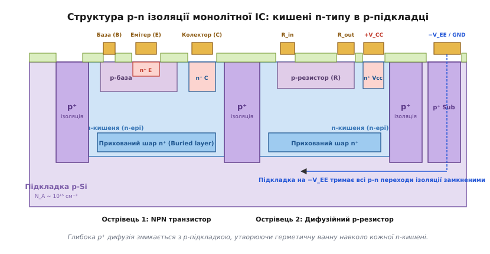
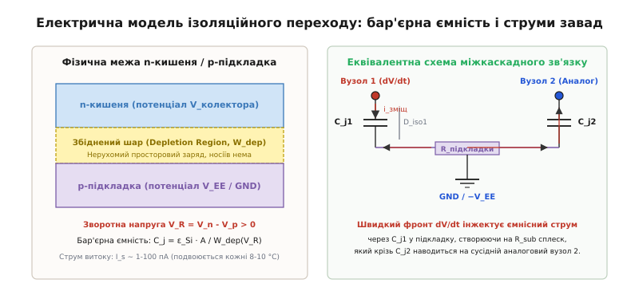
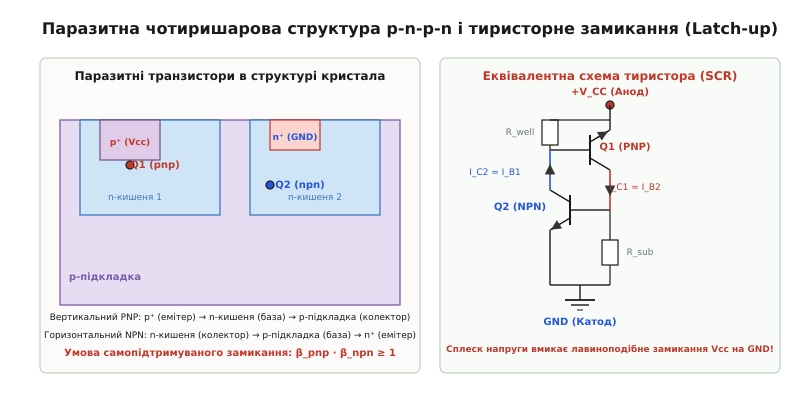
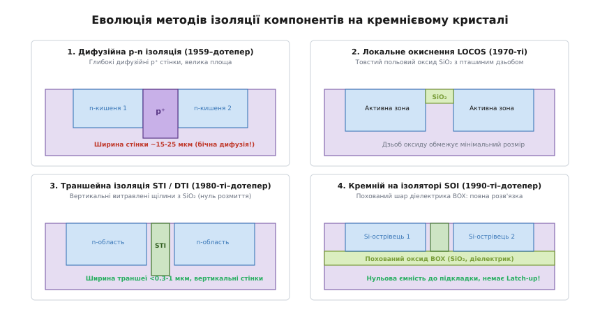

# p-n ізоляція компонентів на кристалі

<preknowlist>
- [p-n перехід](book:physics/pn-junction) — утворення збідненої області, потенціальний бар'єр і поведінка переходу під зворотним зміщенням.
- [Легування напівпровідників](book:physics/doping) — створення донорних (n) та акцепторних (p) областей у кристалічній ґратці кремнію.
- [Будова BJT](book:electronics/bjt-structure) — тришарова планарна структура біполярного транзистора (емітер, база, колектор).
- [Планарний процес](book:electronics/planar-process) — термічне оксидування, фотолітографія та локальна дифузія домішок через оксидні маски.
</preknowlist>

Коли на одній кремнієвій пластині площею кілька квадратних міліметрів розташовано сотні або тисячі біполярних транзисторів, резисторів і діодів, виникає фундаментальна фізична суперечність: спільне монокристалічне тіло кремнію є напівпровідником із питомим електричним опором усього 1–20 Ом·см. Якщо спробувати сформувати два сусідні планарні транзистори на такій нерозділеній підкладці, колекторні струми величиною в десятки міліамперів не потечуть до потрібних навантажень крізь металеві доріжки, а миттєво розтечуться крізь спільний кремній. У результаті кожен вузол схеми виявиться закороченим на всі сусідні елементи, а вихідні сигнали перетворяться на некеровану суміш наведених потенціалів.

Електрична ізоляція компонентів — це технологічний спосіб розділити спільний напівпровідниковий моноліт на незалежні електричні острівці, що не пропускають між собою струм. Найпершим, найбільш технологічним і донині незамінним у високовольтній аналоговій мікроелектроніці методом стало використання зворотно зміщених p-n переходів.

## Загадка монолітного кристала: як розділити спільний провідник

У дискретній схемотехніці проблема ізоляції не існує: кожен транзистор поміщений у власний пластиковий чи металевий корпус, а повітряний зазор або склотекстоліт друкованої плати між їхніми ніжками мають опір понад десятки гігаомів. Перша спроба перенести цю логіку на кристал — винайдена Джеком Кілбі в Texas Instruments у 1958 році — полягала у фізичному пропилюванні канавок навколо кожного транзистора, утворюючи так звані «меза-структури» (*mesa* — столова гора). Проте прорізання урвищ залишало крихкі східці й вимагало з'єднання елементів тонкими золотими дротиками, які приварювалися вручну під мікроскопом і обривалися від найменшої вібрації.

Справжня монолітна інтеграція, започаткована планарним процесом Жана Ерні та планарною металізацією Роберта Нойса, вимагала абсолютно плоскої, непорушеної поверхні кристала, вкритої захисним діоксидом кремнію `SiO₂`. Потрібно було ізолювати компоненти всередині товщі кремнію, не руйнуючи механічної суцільності та гладкості верхньої площини пластини.

Фізична відповідь ховалася у властивостях самого кремнію: p-n перехід за прямого зміщення пропускає величезні струми, але під зворотним зміщенням перетворюється на чудовий ізолятор. Коли до переходу прикладено зворотну напругу (плюс до напівпровідника n-типу, мінус — до p-типу), зовнішнє електричне поле виштовхує вільні носії від металургійної межі. Утворюється збіднена область (*depletion region*), де немає вільних електронів і дірок, а залишаються лише нерухомі іонізовані атоми домішок, міцно затиснуті в кристалічній ґратці. 

Питомий опір збідненої області сягає `10¹⁰ – 10¹² Ом·см`, що робить її еквівалентною найякіснішому діелектрику. Якщо оточити кожну функціональну ділянку схеми шаром напівпровідника протилежного типу провідності й гарантувати, що цей перехід завжди перебуває під зворотною напругою, компоненти виявляються замкненими всередині власних «діелектричних капсул».

Цей концептуальний прорив здійснив навесні 1959 року фізик чеського походження Курт Леговець у лабораторії Sprague Electric, створивши фундаментальний патент, на якому виросла вся сучасна мікроелектроніка; про суперництво лабораторій і драматичну боротьбу за пріоритет розповідає [історія винаходу p-n ізоляції Куртом Леговцем](book:electronics/pn-isolation/hist-kurt-lehovec.md).

## Анатомія ізольованої кишені: епітаксія, прихований шар і глибока дифузія

Побудова структури з p-n ізоляцією — це багатостадійний процес послідовного вирощування та термічної дифузії напівпровідникових шарів. Розглянемо класичну технологію створення ізольованих кишень (англ. *isolated tubs* або *islands*), на базі якої виготовляються класичні аналогові інтегральні схеми — від легендарних операційних підсилювачів uA741 та LM324 до таймера NE555 та стабілізатора LM317.

```
+─────────────────────────────────────────────────────────────────────────────+
|                         Поверхневий оксид SiO₂                              |
+───────┬──────────────────────┬───────────────┬──────────────────────┬───────+
|  p⁺   |      n-епітаксія     |      p⁺       |      n-епітаксія     |  p⁺   |
| стінка|   (кишеня під NPN)   |    стінка     | (кишеня під резистор)| стінка|
|       ├──────────────────────┤               ├──────────────────────┤       |
|       |  n⁺ прихований шар   |               |  n⁺ прихований шар   |       |
+───────┴──────────────────────┴───────────────┴──────────────────────┴───────+
|                              Підкладка p-Si                                 |
|                     (зміщена до найнижчого потенціалу V_EE)                 |
+─────────────────────────────────────────────────────────────────────────────+
```

### 1. Вихідна підкладка (p-substrate)
Основою всієї мікросхеми є монокристалічна кремнієва пластина p-типу товщиною 300–500 мкм, легована бором (концентрація акцепторів `N_A ~ 10¹⁵ см⁻³`, питомий опір `10 – 20 Ом·см`). Вона забезпечує механічну міцність кристала та слугує спільним колектором для ізоляційних переходів.

### 2. Формування прихованого шару (n⁺ Buried Layer / Subcollector)
Перш ніж нарощувати робочий шар, у підкладку крізь вікна в оксиді проводять локальну дифузію донорної домішки з високою концентрацією (`N_D ~ 10¹⁹ см⁻³`). Як домішку використовують сурму (Sb) або миш'як (As), оскільки їхні атоми мають малий коефіцієнт дифузії в кремнії та не «розмиваються» вгору під час наступних тривалих високотемпературних нагрівів.

Прихований шар потрібен з критичної причини: слаболегована n-кишеня має відносно високий опір. Якби струм колектора транзистора протікав горизонтально крізь товщу слаболегованого епітаксійного шару до поверхневого виводу, омічний опір тіла колектора `R_C` сягав би сотень омів, що призводило б до раннього насичення транзистора й катастрофічного падіння швидкодії. Високопровідний n⁺ прихований шар слугує паралельною «магістраллю» з низьким опором (кілька омів), крізь яку колекторний струм тече вертикально вниз від бази, горизонтально по n⁺ шару й вертикально вгору до контакту колектора.

### 3. Нарощування епітаксійного шару (n-epitaxy)
Поверх підкладки з прихованими шарами методом газофазної епітаксії (грец. *epi* — на, зверху + *taxis* — порядок) вирощують монокристалічний шар кремнію n-типу, легований фосфором (`N_D ~ 10¹⁵ – 2 · 10¹⁶ см⁻³`). Товщина епітаксійного шару становить від 3–5 мкм (для швидкісних низьковольтних схем) до 15–25 мкм (для високовольтних мікросхем живлення). Епітаксійний шар зберігає бездоганну кристалічну орієнтацію підкладки й стає робочим тілом, у якому розміщуватимуться всі майбутні прилади.

Під час росту епітаксії виникає ефект автолегування (*autodoping*): атоми сурми чи миш'яку з високолегованого прихованого шару частково випаровуються в реакційну газову фазу й знову вбудовуються в зростаючий шар, що вимагає ретельного контролю температурного профілю реактора для отримання різкого переходу.

### 4. Глибока ізоляційна дифузія (p⁺ Isolation Walls)
На поверхні епітаксійного шару вирощують захисний шар оксиду `SiO₂` товщиною близько 0.5–0.8 мкм, після чого методом фотолітографії розкривають сітку замкнених вікон, що оконтурюють майбутні компоненти. Через ці вікна проводять тривалу дифузію бору (акцептор) за температури `1200 – 1250 °C` протягом 10–16 годин.

Атоми бору проникають крізь усю товщу n-епітаксійного шару, змінюючи тип провідності з n на p⁺, доки фронт дифузії повністю не з'єднається з базовою p-підкладкою. У результаті утворюються суцільні вертикальні p⁺ стінки.

Увесь епітаксійний шар виявляється розрізаним на герметичні n-кишені. Кожна така кишеня оточена знизу p-підкладкою, а з боків — вертикальними p⁺ ізоляційними стінками.


*Поперечний розріз кремнієвого кристала зі сформованими ізольованими n-кишенями: NPN-транзистор, дифузійний резистор і контакт підкладки оточені p⁺ стінками.*

## Розміщення компонентів усередині ізольованих кишень

Сформована n-кишеня є універсальним базовим модулем, у якому за допомогою додаткових операцій фотолітографії та дифузії виготовляють різні елементи мікросхеми:

1. **Планарний біполярний NPN-транзистор**:
   - Тіло n-кишені слугує колектором.
   - Усередині кишені формується дифузійна p-область, яка стає базою.
   - Усередині p-бази формується дрібна сильнолегована n⁺ область емітера.
   - Для підключення колектора роблять окремий n⁺ контакт (sinker), що запобігає утворенню випрямляючого контакту Шотткі між алюмінієвою металізацією та слаболегованим n-кремнієм і знижує залишковий опір колектора.

2. **Дифузійний p-резистор**:
   - Формується одночасно з дифузією баз транзисторів як довга звивиста смужка p-типу всередині окремої n-кишені.
   - Опір резистора задається співвідношенням довжини до ширини смужки `R = R_sq · (L / W)`, де `R_sq` — шаровий опір базової дифузії (типово `150 – 250 Ом/квадрат`).

3. **Інтегральні діоди**:
   - Виготовляються на базі стандартної NPN-структури шляхом закорочування виводів: наприклад, з'єднанням бази з колектором (діод із мінімальним часом відновлення) або бази з емітером (стабілітрон з напругою лавинного пробою `6.5 – 7.2 В`).

## Золоте правило підкладки: найнижчий потенціал схеми

Для того щоб система ізоляції функціонувала бездоганно, всі без винятку p-n переходи між n-кишенями та навколишніми p-областями (підкладкою та стінками) мають залишатися замкненими за будь-яких умов роботи схеми.

Звідси випливає **головне фундаментальне правило проєктування та експлуатації ІС із p-n ізоляцією**:

> **Підкладка мікросхеми повинна бути постійно під'єднана до найнижчого електричного потенціалу в усій схемі.**

У схемах з двополярним живленням (наприклад, операційні підсилювачі з живленням `±15 В`) підкладку з'єднують із шиною від'ємного живлення `-V_EE` (`-15 В`). У схемах з однополярним живленням (наприклад, `+5 В` або `+12 В`) підкладку з'єднують із загальною шиною заземлення `GND` (`0 В`).

```
              ┌──────────────────────────────────────────┐
              │      V_кишені (потенціал колектора)      │  +5 В ... +15 В
              └────────────────────┬─────────────────────┘
                                   │
                                 ┌─┴─┐
                                 │ ▲ │  Зворотний p-n перехід
                                 │ ─ │  (замкнений, I_витоку ~ 10 пА)
                                 └───┘
                                   │
              ┌────────────────────┴─────────────────────┐
              │           Підкладка p-типу               │  -15 В або GND
              └──────────────────────────────────────────┘
```

Що станеться, якщо це правило буде порушено хоча б на частку мілівольта? 

Якщо потенціал будь-якої n-кишені опуститься нижче потенціалу підкладки більш ніж на `0.6 В` (пряма напруга відмикання кремнієвого діода `V_on`), перехід `p-підкладка / n-кишеня` миттєво відкриється в прямому напрямку:
1. **Масивна інжекція струму**: крізь перехід поллється прямий струм величиною в сотні міліамперів від джерела живлення підкладки в низькопотенційний вузол.
2. **Активація паразитних біполярних транзисторів**: відкритий перехід інжектує мільйони електронів у підкладку, які діють як емітер паразитного транзистора. Сусідні n-кишені починають працювати як паразитні колектори, збираючи ці електрони. Струми сусідніх транзисторів зміщуються, робочі точки ламаються, а напруги зміщення операційних підсилювачів різко зростають.
3. **Омічний перекіс кристала**: протікання великого струму крізь тіло підкладки створює на її внутрішньому розподіленому опорі `R_sub` різницю потенціалів, що спричиняє ланцюгове відмикання ізоляційних переходів по всій площі чипа.

### Правило зміщення кишень для резисторів

Особливої уваги потребують n-кишені, в яких розташовані дифузійні p-резистори. Резистор не має прямого контакту з живленням: струм тече крізь p-смужку, створюючи на ній змінний потенціал уздовж усієї довжини `V(x)`.

Щоб перехід між p-резистором та його n-кишенею ніде не відкрився, тіло самої n-кишені резистора **обов'язково підключають до найвищого потенціалу схеми** (`+V_CC`). Тоді для будь-якої точки резистора потенціал n-кишені є гарантовано вищим за локальний потенціал резистора:

```
V_n_кишені = V_CC ≥ V_p_резистора(x)     [умова постійного зворотного зміщення резистора]
```

Це правило реалізують за допомогою спеціального n⁺ контакту на поверхні кишені резистора, з'єднаного алюмінієвою доріжкою з шиною живлення.

## Фізичні межі та пробій ізоляційного переходу

Робота p-n ізоляції обмежена двома основними явищами пробою:

1. **Лавинний пробій ізоляції (`BV_iso` / `BV_CS`)**:
   Коли зворотна напруга між кишенею та підкладкою перевищує критичну межу, напруженість електричного поля в збідненій області досягає величини `E_crit ≈ 3 · 10⁵ В/см`. Носії заряду набувають кінетичної енергії, достатньої для вибивання електронів із ковалентних зв'язків кристалічної ґратки (ударна іонізація), що призводить до лавинного наростання зворотного струму. Величина `BV_iso` визначається концентрацією легування епітаксійного шару й становить від `40 В` (для швидкодіючих техпроцесів) до `120 – 160 В` (для високовольтних BCD-процесів).

2. **Прокол епітаксійного шару (Reach-through / Punch-through)**:
   При підвищенні зворотної напруги на колекторі збіднена область переходу `колектор-підкладка` розширюється вгору в товщу епітаксійного шару, а збіднена область переходу `база-колектор` розширюється вниз. Якщо товщина епітаксійного шару `X_epi` недостатня, обидва збіднені шари змикаються всередині n-кишені. Між базою транзистора та підкладкою виникає прямий струм проколу, який не залежить від стану колекторного переходу. Запобігання проколу вимагає суворого узгодження товщини епітаксії та рівня її легування.

## Ціна електричної ізоляції: паразитна ємність, витік і шуми підкладки

Хоча зворотний p-n перехід надійно блокує постійний струм, напівпровідникова природа ізоляції накладає жорсткі фізичні обмеження, які інженери зобов'язані враховувати під час розрахунку схем.

### 1. Зворотний струм витоку (I_leakage)
Ідеальний діелектрик має нескінченний опір. Зворотно зміщений p-n перехід пропускає невеликий струм генерації термодинамічних пар електрон-дірка в збідненій області:
- При кімнатній температурі (`25 °C`) струм витоку однієї кишені становить усього `1 – 100 пА`.
- Проте струм витоку напівпровідникового переходу підпорядковується експоненційному закону й **подвоюється кожні 8–10 °C**.
- При максимальній робочій температурі автомобільного діапазону (`125 – 150 °C`) витік кожної кишені зростає в тисячі разів і сягає `0.1 – 1 мкА`.

Для мікропотужних інтегральних схем і наноамперних джерел опорного струму такий витік за високих температур може перевищити робочий струм каскаду й повністю вивести прилад з ладу.

### 2. Бар'єрна ємність ізоляції (C_iso)
Збіднена область діє як обкладка плоского конденсатора з відносною діелектричною проникністю кремнію `ε_r ≈ 11.7`. Питома ємність зворотно зміщеного переходу визначається шириною збідненого шару `W_dep`, яка залежить від прикладеної зворотної напруги:

```
C_j(V_R) = ε_s / W_dep(V_R) = C_j0 / (1 + V_R / V_bi)^m   [нелінійна бар'єрна ємність переходу]
```

Для типової n-кишені площею `80 × 40 мкм` сумарна паразитна ємність (дно кишені плюс бічні стінки) становить `0.1 – 0.3 пФ` (100–300 фФ). Докладне математичне виведення формул ширини збіднення та покроковий інженерний розрахунок ємностей дна й стінок наведено в [математичному розрахунку ємності p-n ізоляції та струмів зміщення](book:electronics/pn-isolation/math-isolation-capacitance.md).


*Еквівалентна схема ізоляційного переходу: бар'єрна ємність C_j, струм витоку I_s та інжекція високочастотних завад у спільну підкладку при комутації dV/dt.*

### 3. Динамічні завади підкладки (Substrate Crosstalk)
Паразитна ємність ізоляції безпосередньо зв'язує колектор кожного транзистора зі спільною підкладкою. Коли в цифровій частині мікросхеми перемикається логічний вентиль зі швидкістю зміни напруги `dV/dt ~ 5 В/нс`, крізь ємність `C_iso` в підкладку інжектується імпульсний струм зміщення:

```
i_sub = C_iso · (dV / dt) ≈ 0.2 пФ · 5 · 10⁹ В/с = 1 мА   [струм зміщення однієї кишені]
```

Одночасне перемикання десятків ключів створює в підкладці сумарні імпульсні струми амплітудою в сотні міліамперів. Протікаючи крізь розподілений опір підкладки `R_sub`, цей струм генерує короткі сплески напруги (шум підкладки — *substrate noise*). Крізь бар'єрні ємності сусідніх кишень цей шум наводиться на чутливі вхідні каскади підсилювачів, обмежуючи динамічний діапазон і точність аналогово-цифрових перетворювачів.

## Теплове розсіювання та тепловий зв'язок крізь підкладку

Кремнієвий монокристал є не лише провідником електрики, а й чудовим провідником тепла: його коефіцієнт теплопровідності при кімнатній температурі становить `k_Si ≈ 148 Вт/(м·К)`. Коли вихідний силовий транзистор розсіює потужність у кілька ватів, тепло поширюється від його кишені вглиб підкладки конусом із кутом розсіювання близько `45°`.

Це створює на поверхні кристала температурний градієнт: різниця температур між гарячим силовим каскадом і віддаленими ділянками може досягати `10 – 30 °C`.

Оскільки напруга емітер-база біполярного транзистора має температурний коефіцієнт близько `-2 мВ/°C`, а коефіцієнт підсилення `β` зростає приблизно на `+0.5 %/°C`, тепловий градієнт підкладки викликає перекіс у прецизійних диференціальних парах. Для боротьби з цим ефектом аналогові блоки розміщують на ізотермічних лініях і застосовують перехресно-квадрупольну симетрію (*cross-quad centroid matching*), за якої протилежні плечі диференціального каскаду рівномірно сприймають тепло від силових кишень.

## Невидимий ворог: паразитні тиристори та ефект Latch-up

Найнебезпечнішим побічним наслідком p-n ізоляції є неминуче утворення паразитних чотиришарових напівпровідникових структур типу p-n-p-n. Будь-яка ділянка кристала, де поруч розташовані транзистори або резистори, утворює чергування шарів: `p⁺(анод) → n(кишеня 1) → p(підкладка) → n⁺(емітер у кишені 2)`.

Ця комбінація еквівалентна двом біполярним транзисторам, з'єднаним у регенеративне кільце позитивного зворотного зв'язку:
- **Вертикальний PNP-транзистор (`Q_pnp`)**: емітером є p-база транзистора або p-резистор, базою — n-кишеня, колектором — p-підкладка.
- **Горизонтальний NPN-транзистор (`Q_npn`)**: колектором є n-кишеня, базою — p-підкладка, емітером — n⁺ емітер сусіднього каскаду.


*Механізм тиристорного замикання: паразитні вертикальний PNP і горизонтальний NPN транзистори утворюють коло позитивного зворотного зв'язку через підкладку.*

Колектор `Q_pnp` вдуває струм у базу `Q_npn`, а колектор `Q_npn` висмоктує струм із бази `Q_pnp`. Якщо добуток їхніх коефіцієнтів підсилення перевищує одиницю:

```
β_pnp · β_npn ≥ 1                        [умова тиристорного самопідтримуваного замикання]
```

структура утворює кремнієвий керований вентиль (тиристор, SCR).

### Сценарій аварії Latch-up:
1. Зовнішня індуктивна завада або імпульс електростатичного розряду (ESD) на виводі мікросхеми викликає короткочасний викид напруги вище `V_CC` або провал нижче `GND`.
2. Інжектований струм завади відкриває один із паразитних транзисторів.
3. Позитивний зворотний зв'язок лавиноподібно розганяє струми обох транзисторів до повного насичення.
4. Тиристор фіксується у відкритому стані з низьким внутрішнім опором. Між шинами живлення `V_CC` та `GND` спалахує фактично пряме коротке замикання з падінням напруги `~1 В` і струмом у кілька амперів.
5. Мікросхема розігрівається за мілісекунди, металізація випаровується, а кристалічна ґратка сплавляється в суцільну монолітну краплю. Єдиний спосіб вийти зі стану замикання до руйнування — повністю знеструмити схему.

Для діагностики та локалізації зон замикання на кристалі інженери використовують оптичну емісійну мікроскопію (EMMI — *Emission Microscopy*): струм прямого рекомбінаційного випромінювання відкритих переходів фіксується високочутливими інфрачервоними камерами як яскрава світлова пляма на поверхні зрізу кремнію.

Для захисту від Latch-up застосовують спеціальні конструктивні бар'єри — **охоронні кільця** (*Guard Rings*), які перехоплюють струми завад і гасять коефіцієнти підсилення паразитних транзисторів; правила їхнього розрахунку та топологічного проектування розбирає [довідник з топологічного захисту від замикання](book:electronics/pn-isolation/comp-latchup-guard-rings.md).

## Сучасні розширення: потрійна кишеня (Triple-Well) та BCD-інтеграція

У сучасних інтегрованих технологіях BCD (Bipolar-CMOS-DMOS) класичну схему p-n ізоляції модернізують за допомогою архітектури **потрійної кишені** (*Triple-Well*). Вона дозволяє розміщувати на одній p-підкладці не лише стандартні NPN-транзистори, а й чутливі низьковольтні NMOS-транзистори та потужні вертикальні DMOS-ключі, повністю ізолюючи їхні локальні підкладки від шумів силової частини.

У трикишеньковій структурі слаболегована n-кишеня глибокої дифузії (Deep N-Well, DNW) формує ізолюючу ванну, всередині якої створюється власна локальна p-кишеня (P-Well). Таким чином, NMOS-транзистор отримує індивідуальну p-підкладку, яка може бути зміщена незалежно від глобальної підкладки чипа. Це усуває паразитний ефект підкладки (*body effect*), пригнічує підпорогові витоки та кардинально знижує рівень завад у радіочастотних та прецизійних вимірювальних трактах.

## Автоматизована верифікація правил ізоляції в САПР (DRC / LVS)

Під час проектування сучасних великих інтегральних схем ручна перевірка дотримання правил p-n ізоляції та захисту від Latch-up неможлива через наявність мільйонів транзисторів. Цю задачу виконують спеціалізовані засоби автоматизованого проектування (EDA):

1. **Топологічна верифікація (DRC — Design Rule Checking)**:
   - Автоматичні правила перевіряють максимальну відстань від кожного дифузійного вузла до найближчого контакту підкладки або кишені (Well-Tap Spacing Rule).
   - Алгоритми сканують периметри всіх ізоляційних стінок, перевіряючи мінімальну ширину перекриття та відсутність розривів у захисних p⁺ та n⁺ кільцях навколо потужних вихідних ключів.
2. **Схемотехнічна верифікація (LVS — Layout Versus Schematic & ERC — Electrical Rule Checking)**:
   - Програми видобування паразитів (Parasitic Extraction) автоматично знаходять усі можливі чотиришарові структури p-n-p-n на топології, розраховують петльовий коефіцієнт підсилення `β_pnp · β_npn` з урахуванням тривимірної геометрії та сигналізують про потенційно небезпечні вузли.
   - Правила ERC перевіряють, щоб контакт підкладки був гальванічно з'єднаний виключно з виділеною шиною найнижчого потенціалу, запобігаючи випадковому плаваючому станові підкладки (*floating substrate*).

## Еволюція ізоляції: чому p-n переходи поступилися діелектрикам і де вони незамінні

Незважаючи на простоту, метод p-n ізоляції має геометричну ваду, яка наприкінці 1970-х років стала нездоланним бар'єром для масштабування мікросхем високого ступеня інтеграції (LSI/VLSI).

Ця вада — **бічна дифузія домішок** (*lateral diffusion*). Коли бор дифундує крізь маску на глибину `X_j = 8 мкм`, він одночасно розповзається в горизонтальному напрямку під краї оксиду приблизно на `0.75 – 0.8 · X_j` (тобто на `6 – 6.5 мкм` в кожен бік). 

Щоб отримати надійне змикання стінки з підкладкою, фотолітографічне вікно маски має бути завширшки щонайменше 6–8 мкм. У результаті реальна ширина готової p⁺ ізоляційної стінки на кристалі сягає `18 – 25 мкм`.

Коли розмір самого біполярного транзистора становив `50 × 50 мкм`, ізоляційні стінки займали до 60–70% загальної корисної площі кремнієвої пластини! Розмістити мільйони транзисторів на одному чипі за такої технології було фізично неможливо.


*Еволюція технологій ізоляції: від глибоких дифузійних p⁺ стінок до діелектричних оксидних траншей STI/DTI та монокристалічного шару на ізоляторі SOI.*

### Етапи заміни p-n ізоляції:

1. **Локальне термічне окиснення кремнію (LOCOS, 1970-ті)**:
   - Вільні ділянки кремнію маскують нітридом кремнію `Si₃N₄` і проводять глибоке термічне окиснення, вирощуючи товстий польовий оксид `SiO₂` (0.8–1.5 мкм).
   - Оксид ізолює поверхневі канали транзисторів, але стикається з ефектом «пташиного дзьоба» (*bird's beak*) — підтіканням окиснювача під краї нітриду, що обмежує мінімальний розмір елементів на рівні 0.5–0.8 мкм.

2. **Мілка та глибока траншейна ізоляція (STI / DTI, 1980-ті–дотепер)**:
   - Замість дифузії в кремнії методом реактивного іонного травлення (RIE) витравлюють вертикальні канавки глибиною від 0.3–0.5 мкм (Shallow Trench Isolation, STI для CMOS) до 5–15 мкм (Deep Trench Isolation, DTI для високовольтних BJT).
   - Траншеї заповнюють високоякісним діоксидом кремнію `SiO₂` або шарами полікремнію в оксидній сорочці.
   - Ширина ізоляційного шва зменшується до `0.1 – 0.3 мкм`, повністю усуваючи бічне розширення й вивільняючи до 80% площі чипа.

3. **Кремній на ізоляторі (SOI — Silicon On Insulator, 1990-ті–дотепер)**:
   - Усі компоненти формуються в тонкому шарі монокристалічного кремнію, відділеному від базової пластини суцільним похованим шаром оксиду (BOX — *Buried Oxide* товщиною 0.1–1 мкм).
   - Дно кожної кишені спирається на справжній діелектрик `SiO₂`.
   - Бар'єрна ємність до підкладки падає практично до нуля, завади підкладки зникають, а паразитна p-n-p-n структура фізично розривається, назавжди усуваючи загрозу Latch-up.

### Порівняльна характеристика методів ізоляції

| Параметр | Дифузійна p-n ізоляція | Локальне окиснення (LOCOS) | Траншейна ізоляція (STI/DTI) | Кремній на ізоляторі (SOI) |
| :--- | :--- | :--- | :--- | :--- |
| **Ширина шва ізоляції** | 15 – 25 мкм | 1.5 – 3.0 мкм | 0.1 – 1.0 мкм | < 0.2 мкм |
| **Паразитна ємність дна** | Висока (0.1 – 0.3 пФ) | Середня (p-n перехід) | Середня/Низька | Нульова (діелектрик BOX) |
| **Ризик замикання Latch-up** | Високий (p-n-p-n існує) | Високий (у CMOS) | Знижений (через глибину) | Відсутній (повна розв'язка) |
| **Максимальна робоча напруга** | Дуже висока (40 – 120 В) | Низька/Середня (5 – 15 В) | Висока (у варіанті DTI) | Висока (> 100 В) |
| **Собівартість виготовлення** | Найнижча (базові маски) | Низька | Середня (вимагає RIE/CMP) | Висока (ціна пластин SOI) |

### Де p-n ізоляція панує сьогодні?

Попри появу діелектричних траншей та SOI, класична дифузійна p-n ізоляція залишається головною робочою конячкою світової аналогової мікроелектроніки:

1. **BCD-технологія (Bipolar-CMOS-DMOS)**: сучасні мікросхеми керування живленням (PMIC), драйвери крокових і безколекторних двигунів, контролери автомобільних шин (CAN, LIN), перетворювачі напруги. У цих чипах низьковольтна цифрова CMOS-логіка співіснує з високовольтними DMOS-ключами на `40 – 100 В`. Глибока p-n ізоляція у товстих епітаксійних шарах є у рази дешевшою у виробництві, ніж дорогі пластини SOI чи глибокі оксидні траншеї DTI.
2. **Висока стійкість до електричного пробою**: тверді діелектричні оксидні стінки при локальних перенапругах зазнають незворотного пробою (пропалювання оксиду з утворенням закоротки). Натомість p-n перехід при перевищенні напруги переходить у режим оборотного лавинного пробою і після зняття імпульсу повністю відновлює свої ізоляційні властивості.
3. **Масові стандартні аналогові чипи**: мільярди випущених щороку операційних підсилювачів, компараторів, джерел опорної напруги та лінійних стабілізаторів донині виробляються за класичним планарним техпроцесом з p-n ізоляцією завдяки його неперевершеній економічній ефективності та бездоганно відпрацьованій надійності.

---

> 🔧 **Навіщо це.** Розуміння фізики p-n ізоляції критично важливе не лише для розробників кремнієвих топологій, а й для кожного схемотехніка та інженера з розробки друкованих плат:
> 
> 1. **Захист від підземного струму**: якщо на вхідний чи вихідний пін мікросхеми прийде імпульс напруги нижче потенціалу її землі (наприклад, `-0.7 В` через індуктивний викид від котушки реле чи мотора), внутрішній p-n перехід ізоляції відкриється. Це інжектує паразитний струм у спільну підкладку чипа, що призведе до хаотичного перезавантаження мікроконтролера, збою АЦП або переходу мікросхеми в тиристорне замикання Latch-up. Саме тому кожен індуктивний вихід обов'язково шунтують зовнішнім швидким діодом Шотткі паралельно до землі.
> 2. **Розведення чутливих аналогових земель**: знаючи, що підкладка є спільним провідником із ненульовим опором, інженер ніколи не пустить імпульсні струми силового каскаду крізь ту саму земельну доріжку, до якої під'єднано аналогове джерело опорної напруги.
> 3. **Діагностика відмов**: раптове зростання споживання струму мікросхемою до максимуму джерела живлення з одночасним падінням напруги живлення до 1–1.5 В — це класичний симптом замикання Latch-up, який вказує на порушення правил розв'язки або відсутність діодного захисту від перенапруг.
