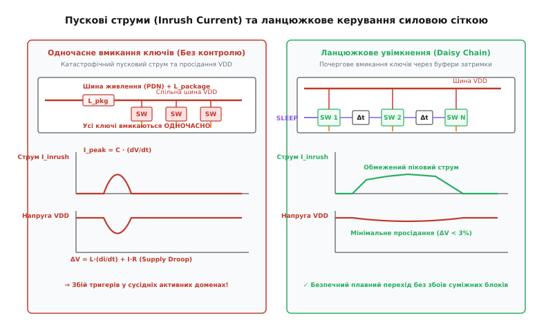

# 🧮 Математична модель пускового струму, просідання напруги та розрахунку силових ключів

<preknowlist>
- [Закон Ома](book:electronics/ohms-law) — зв'язок струму, напруги та активного опору провідника.
- [Стала RC](book:electronics/rc-time-constant) — перехідні процеси заряду ємності через опір у диференціальних рівняннях першого порядку.
- [Індуктивність і ЕРС самоіндукції](book:electronics/inductive-reactance) — виникнення стрибка проти-ЕРС при різкій зміні струму `di/dt`.
- [Поріг MOSFET](book:electronics/mosfet-threshold) — вольт-амперна характеристика каналу польового транзистора в лінійній області та області насичення.
</preknowlist>

Коли знеструмлений функціональний домен інтегральної мікросхеми повертається до активного стану, затвори тисяч комутаційних транзисторів (Sleep Transistors) відкриваються, з'єднуючи розряджену віртуальну розподільчу шину живлення `VDD_VIRTUAL` із загальною системою живлення кристала `VDD`. Паразитна ємність віртуальної шини, затворів внутрішніх логічних вентилів та дифузійних областей `C_v` миттєво починає заряджатися від нуля до робочої напруги `V_dd`. Неконтрольований стрибок струму створює різке падіння напруги на активному опорі та паразитній індуктивності виводів корпусу мікросхеми, що здатне порушити роботу сусідніх активних доменів.

Нижче виведено повний математичний апарат для розрахунку геометрії силових ключів, аналітичного моделювання нелінійного перехідного процесу заряду віртуальної шини, оцінки індуктивного коливального просідання напруги на розподільчій сітці кристала, аналізу технологічних кутів розкиду параметрів (PVT Corners), розрахунку щільності струму для запобігання електромеграції та оптимізації багатоступеневих ланцюжків увімкнення Daisy Chain.

---

## 1. Розрахунок геометрії силових ключів за допустимим статичним падінням напруги (IR-Drop)

У робочому стані домену всі силові транзистори повністю відкриті. Через них протікає сумарний струм активної логіки `I_active`. Оскільки відкритий канал польового транзистора має кінцевий опір `R_on`, на ньому виникає статичне падіння напруги:

```
ΔV_IR = I_active · R_on
```

Падіння напруги `ΔV_IR` безпосередньо зменшує ефективну напругу живлення логічних вентилів (`V_logic = V_dd - ΔV_IR`), що призводить до затримки поширення сигналу. Затримка логічного вентиля в CMOS-технології описується формулою Альфа-степеневого закону Сакаї:

```
t_pd ∝ (C_load · V_logic) / (V_logic - V_th)^α
```

де `α ≈ 1.2–1.4` для нанометрових транзисторів із насиченням швидкості носіїв (Velocity Saturation). Зменшення напруги `V_logic` на 5% призводить до зростання затримки на 10–15%, що руйнує часовий бюджет критичного шляху (Setup Timing Violation). Тому статичне падіння напруги `ΔV_IR` на масиві силових ключів жорстко обмежують величиною `1.0–1.5%` від номінальної напруги живлення `V_dd` (для `V_dd = 0.85 В` це не більше `8.5–12.5 мВ`).

Оскільки падіння напруги на відкритому ключі `V_ds = ΔV_IR` є малим порівняно з напругою на затворі (`V_ds << V_gs - |V_th|`), силовий транзистор працює в глибокій лінійній (омічній) області вольт-амперної характеристики.

Струм стоку польового транзистора в лінійному режимі описується формулою:

```
I_D = μ · C_ox · (W / L) · [(V_gs - |V_th|) · V_ds - (V_ds² / 2)]
```

Знехтувавши квадратичним членом `V_ds² / 2` через його малість, отримуємо вираз для струму відкритого ключа:

```
I_active = μ · C_ox · (W_total / L_min) · (V_dd - |V_th|) · ΔV_IR
```

Звідси отримуємо необхідну сумарну геометричну ширину каналу силових ключів `W_total`:

```
W_total = I_active / (μ · C_ox · (1 / L_min) · (V_dd - |V_th|) · ΔV_IR)
```

де:
- `μ` — рухливість основних носіїв заряду (для електронів у nMOS `μ_n ≈ 400–450 см²/(В·с)`, для дірок у pMOS `μ_p ≈ 140–160 см²/(В·с)`);
- `C_ox = ε_0 · ε_ox / t_ox` — питома ємність підзатворного діелектрика на одиницю площі;
- `L_min` — технологічна довжина каналу силового транзистора;
- `V_th` — порогова напруга високовитічного транзистора сну (HVT Sleep Transistor);
- `ΔV_IR` — гранично допустиме статичне падіння напруги на силовій сітці.

Оскільки рухливість електронів у кремнії перевищує рухливість дірок у 2.5–3 рази (`μ_n / μ_p ≈ 2.8`), для досягнення однакового опору `R_on` сумарна ширина каналу pMOS Header-транзисторів повинна бути майже втричі більшою за ширину nMOS Footer-транзисторів:

```
W_total(pMOS) ≈ 2.8 · W_total(nMOS)
```

### Температурна залежність опору відкритого каналу
При проектуванні силових ключів обов'язково враховують найгірший температурний кут (Worst-Case Slow Corner, `T = 125 °C`). Рухливість носіїв заряду падає з підвищенням температури внаслідок розсіювання на фононах кристалічної решітки:

```
μ(T) = μ(T_0) · (T / T_0)^(-k_m)
```

де `k_m ≈ 1.5–1.7`. При нагріванні від 25 °C (298 K) до 125 °C (398 K) рухливість дірок `μ_p` падає приблизно на 35–40%, що збільшує опір `R_on` на 40%. Хоча порогова напруга транзистора одночасно знижується з температурним коефіцієнтом `dV_th/dT ≈ -1.5 мВ/°C`, падіння рухливості домінує. Тому геометричну ширину `W_total` завжди розраховують для максимальної робочої температури кристала.

---

## 2. Нелінійне диференціальне рівняння заряду віртуальної шини живлення

Перехідний процес встановлення напруги на віртуальній шині `V_v(t)` описується рівнянням заряду зосередженої еквівалентної ємності домену `C_v`:

```
C_v · (d V_v(t) / dt) = i_switch(V_v, t)
```

де `i_switch` — струм, що протікає крізь силовий транзистор. Оскільки напруга на стоці транзистора `V_ds(t) = V_dd - V_v(t)` змінюється від `V_dd` до `0`, транзистор у процесі увімкнення послідовно проходить дві різні області роботи: область насичення та лінійну область.

```
       V_dd ──┐
              │      [ Область лінійна (t > t_sat): експоненційне дозаряджання ]
   V_v(t)     │     . - - - - - - - - - - - - - - - - - - - - - - - - - - -
              │   /
              │  /   [ Область насичення (0 < t ≤ t_sat): лінійне наростання ]
          0 ──┴───────────────────────────────────────────────────────► Час t
              0   t_sat
```

### Фаза 1: Область насичення (`0 ≤ V_v(t) < |V_th|`)
На початковому етапі напруга на віртуальній шині близька до нуля, тому `V_ds = V_dd - V_v > (V_dd - |V_th|)`. Транзистор перебуває в режимі насичення, і струм практично не залежить від напруги на віртуальній шині, залишаючись константним:

```
I_sat = (1 / 2) · μ · C_ox · (W_total / L_min) · (V_dd - |V_th|)²
```

Розв'язок диференціального рівняння для початкової фази є строго лінійним:

```
V_v(t) = (I_sat / C_v) · t
```

Тривалість фази насичення `t_sat` визначається моментом, коли напруга на віртуальній шині досягає межі насичення `V_v(t_sat) = |V_th|`:

```
t_sat = (C_v · |V_th|) / I_sat
```

### Фаза 2: Лінійна область (`|V_th| ≤ V_v(t) ≤ V_dd`)
Щойно напруга перевищує `|V_th|`, транзистор переходить у лінійний режим із залежністю струму від `V_v(t)`:

```
i_switch(t) = μ · C_ox · (W_total / L_min) · (V_dd - |V_th|) · (V_dd - V_v(t))
```

Введемо еквівалентну провідність відкритого каналу `G_on = 1 / R_on`:

```
G_on = μ · C_ox · (W_total / L_min) · (V_dd - |V_th|)
```

Диференціальне рівняння набуває класичного вигляду:

```
d V_v(t) / dt + (G_on / C_v) · V_v(t) = (G_on / C_v) · V_dd
```

Розв'язком цього рівняння з початковою умовою `V_v(t_sat) = |V_th|` є експонента:

```
V_v(t) = V_dd - (V_dd - |V_th|) · exp(-(t - t_sat) / τ_RC)
```

де `τ_RC = R_on · C_v` — постійна часу RC-кола комутованої віртуальної шини.

---

## 3. Співвідношення пікового пускового струму до робочого струму

Знайдемо аналітичне відношення пікового пускового струму `I_peak = I_sat` до номінального струму активного режиму `I_active`:

```
I_peak / I_active
= [(1/2) · μ · C_ox · (W/L) · (V_dd - |V_th|)²] / [μ · C_ox · (W/L) · (V_dd - |V_th|) · ΔV_IR]   [підстановка формул I_sat та I_active]
= (V_dd - |V_th|) / (2 · ΔV_IR)                                                                      [скорочення спільних множників]
```

Для типових параметрів 5-нанометрового техпроцесу (`V_dd = 0.85 В`, `|V_th| = 0.35 В`, `ΔV_IR = 0.012 В`):

```
I_peak / I_active
= (0.85 - 0.35) / (2 · 0.012)   [підстановка числових параметрів]
= 0.50 / 0.024                  [обчислення різниці та знаменника]
≈ 20.83                         [кратність пікового струму]
```

Цей розрахунок доводить, що за умови некерованого одночасного вмикання всіх силових ключів піковий пусковий струм у **21 раз перевищує максимальний робочий струм блоку**.

---

## 4. Моделювання RLC-мережі розподілу живлення та індуктивного просідання

Справжня система розподілу живлення кристала (Power Delivery Network, PDN) містить паразитні індуктивності та ємності розпаювального корпусу.

```
       V_ext ───[ L_pkg ]───┬───[ R_pkg ]───┬──────── VDD_SHARED
                            │               │
                        [ C_decap ]     [ C_v (через Sleep SW) ]
                            │               │
       GND   ───────────────┴───────────────┴──────── GND
```

Диференціальне рівняння для напруги на спільній шині живлення `v_dd(t)` при підключенні навантаження зі швидкістю зміни струму `di/dt`:

```
v_dd(t) = V_ext - L_pkg · (d i_total(t) / dt) - R_pkg · i_total(t)
```

За наявності блокувальних конденсаторів на кристалі (Decoupling Capacitors, `C_decap`) виникає коливальний контур другого порядку. Характеристичне рівняння коливального контуру має вигляд:

```
s² + 2 · ζ · ω_0 · s + ω_0² = 0
```

де:
- `ω_0 = 1 / √(L_pkg · C_decap)` — власна кутова резонансна частота системи живлення;
- `ζ = (R_pkg / 2) · √(C_decap / L_pkg)` — коефіцієнт згасання контуру;
- `Z_0 = √(L_pkg / C_decap)` — характеристичний хвильовий опір системи розподілу живлення.

Оскільки активний опір силових металевих шарів кристала та корпусу є надзвичайно малим (`R_pkg < 5–10 мОм`), коефіцієнт згасання є значно меншим за одиницю (`ζ << 1`). Це означає, що система розподілу живлення перебуває в режимі глибокого недозатухання.

Різкий комутаційний стрибок струму `di/dt` спричиняє потужний високочастотний коливальний дзвін (Ringing) та просідання напруги живлення, максимальна амплітуда якого описується виразом:

```
ΔV_droop_max ≈ Z_0 · ΔI_step + L_pkg · (d i_inrush / dt)_max
```

Якщо індуктивність корпусу становить `L_pkg = 0.15 нГн`, піковий струм `I_peak = 8 А`, а час перемикання затвора `t_edge = 0.15 нс`:

```
ΔV_droop
= L_pkg · (I_peak / t_edge)       [індуктивне падіння напруги]
= 0.15 · 10⁻⁹ · (8 / (0.15 · 10⁻⁹)) [підстановка числових значень]
= 0.15 · 53.33                     [обчислення похідної струму: 53.33 ГА/с]
= 8.0 В                            [теоретичний розрахунковий стрибок]
```

Падіння напруги на 8.0 В при робочій напрузі 0.85 В означає повний миттєвий колапс розподільчої мережі живлення, що неминуче призведе до спотворення станів тригерів у всіх сусідніх активних доменах.

### Бюджет заряду блокувальних конденсаторів (Decap Sizing)
Для локального демпфування стрибка струму під час комутації використовують внутрішньокристальні блокувальні конденсатори `C_decap`. Мінімальна необхідна ємність `C_decap` для утримання просідання напруги в межах `ΔV_margin` визначається інтегралом переданого заряду:

```
Q_inrush = ∫[0..t_wake] i_inrush(t) dt ≈ C_v · V_dd
```

Звідси мінімальна ємність блокувальних конденсаторів на спільній шині Always-On становить:

```
C_decap_min ≥ Q_inrush / ΔV_margin = C_v · (V_dd / ΔV_margin)
```

Якщо допустиме просідання становить `ΔV_margin = 0.03 · V_dd` (3%), ємність демпферних конденсаторів повинна бути щонайменше в 33 рази більшою за ємність комутованого домену `C_v`: `C_decap ≥ 33.3 · C_v`. Оскільки розміщення такої гігантської ємності вимагало б надмірної площі кристала, основним засобом захисту стає активне обмеження швидкості наростання струму `di/dt` за допомогою ланцюжкового увімкнення.

---

## 5. Вплив технологічних кутів розкиду параметрів (PVT Corners)

При фізичному проектуванні силової мережі параметри транзисторів і металізації ніколи не розраховують лише для типових умов (Typical-Typical, TT). Схемотехніка повинна зберігати працездатність у крайніх кутах виробничого процесу, напруги та температури (Process, Voltage, Temperature — PVT Corners):

1. **Найшвидший технологічний кут (Fast-Fast Corner / FF, `T = -40 °C`, `V_dd = V_nom + 10%`, `V_th = V_th,min`):**
   При низькій температурі та високій напрузі рухливість носіїв заряду `μ` досягає максимуму, а порогова напруга транзисторів `V_th` є мінімальною. Струм насичення силового ключа `I_sat` зростає на 40–60% порівняно з номіналом. Саме цей кут є найкритичнішим для перевірки **максимального пускового струму та пікового просідання напруги `ΔV_droop`**. Ланцюжок Daisy Chain розраховують так, щоб навіть у кутку FF швидкість наростання струму не перевищувала допустимий ліміт `(di/dt)_limit`;
2. **Найповільніший технологічний кут (Slow-Slow Corner / SS, `T = 125 °C`, `V_dd = V_nom - 10%`, `V_th = V_th,max`):**
   При високій температурі та заниженій напрузі опір відкритого каналу `R_on` зростає майже вдвічі. Цей кут є найгіршим для перевірки **статичного падіння напруги `ΔV_IR` та максимального часу пробудження `T_wakeup`**. Якщо сумарної ширини `W_total` недостатньо в кутку SS, схема не вкладеться в часовий бюджет виходу зі сну або зазнає збою через недостатню напругу живлення логіки.

---

## 6. Розрахунок електромеграції та кроку розміщення силових ключів (EM & Grid Pitch)

Окрім динамічних стрибків напруги, масив силових ключів повинен задовольняти обмеження за **електромеграцією** (Electromigration, EM) — поступовим переносом атомів металу провідника під дією спрямованого потоку електронів високої густини.

Гранично допустима густина постійного струму в мідних провідниках та міжрівневих переходах (Via) становить:

```
J_max ≤ 1.5–2.0 мА / мкм²
```

Якщо домен споживає струм `I_active = 2.4 А`, сумарна площа поперечного перерізу міжрівневих контактів силової сітки `A_via,total` повинна задовольняти умову:

```
A_via,total ≥ I_active / J_max = 2.4 А / (2.0 · 10⁹ А/м²) = 1.2 · 10⁻⁹ м² = 1.2 мкм²
```

Для міжрівневих переходів площею `0.04 мкм²` це вимагає розміщення щонайменше 30 паралельних контактів на кожну силову комірку.

Крок розміщення силових ключів `L_pitch` у регулярній матриці обмежується допустимим падінням напруги на внутрішніх металевих смужках віртуальної сітки `ΔV_grid`:

```
L_pitch ≤ √((8 · ΔV_grid) / (J_area · R_sq))
```

де `J_area` — середня поверхнева густина струму логіки (`А/мкм²`), а `R_sq` — поверхневий питомий опір шару металу (Ом/квадрат).

---

## 7. Синтез параметрів багатоступеневого ланцюжка Daisy Chain

Для обмеження коливань напруги в межах допустимого бюджету `ΔV_margin` силові ключі розбивають на `N` послідовних секцій, що активуються почергово через буфери затримки.


*Згладжування пускового струму за допомогою ступеневої комутації Daisy Chain.*

Максимально допустима крутизна зміни струму для збереження стабільності мережі становить:

```
(di / dt)_limit = ΔV_margin / L_pkg
```

Якщо кожна секція комутує частку струму `I_stage = I_peak / N`, мінімальний час затримки між ступенями `τ_stage` повинен задовольняти нерівність:

```
τ_stage ≥ I_stage / (di / dt)_limit
= (I_peak / N) / (ΔV_margin / L_pkg)   [підстановка допустимої крутизни струму]
= (I_peak · L_pkg) / (N · ΔV_margin)   [остаточна формула розрахунку затримки]
```

### Порівняння рівномірного та геометричного розподілу затримок
1. **Рівномірний розподіл (Uniform Staging):** Усі `N` буферів мають однакову затримку `τ_stage`. Це найпростіша топологічна реалізація, однак вона є субоптимальною: на пізніх етапах напруга `V_v(t)` уже висока, тому струм наступних ключів є меншим, і фіксована затримка призводить до надлишкового затягування загального часу пробудження;
2. **Геометричний / Експоненційний розподіл (Tapered Staging):** Перші ступені мають меншу ширину транзисторів (або більшу затримку), а наступні ступені поступово нарощують ширину каналу пропорційно зростанню напруги `V_v(t)`. Це дозволяє скоротити повний час пробудження `T_wakeup` на 25–35% при збереженні ідентичного пікового значення `ΔV_droop`.

Сумарний час повного виходу домену зі стану сну `T_wakeup` складається з часу активації всіх `N` ступенів та часу експоненційного дозаряджання віртуальної ємності до рівня 95% (`3 · τ_RC`):

```
T_wakeup = (N - 1) · τ_stage + 3 · R_on_total · C_v
```

---

## 8. Комплексний числовий приклад проектування домену обчислень

Розглянемо практичний інженерний розрахунок параметрів підсистеми Power Gating для високоефективного тензорного прискорювача NPU на базі 5-нанометрового техпроцесу:

**Вихідні проектні параметри:**
- Номінальна напруга живлення: `V_dd = 0.85 В`;
- Порогова напруга силових ключів HVT pMOS: `|V_th| = 0.35 В`;
- Максимальний робочий струм блоку: `I_active = 2.4 А`;
- Допустиме статичне падіння напруги: `ΔV_IR = 10 мВ` (`0.010 В`);
- Сумарна ємність віртуальної розподільчої сітки: `C_v = 8 нФ`;
- Паразитна індуктивність виводів корпусу: `L_pkg = 0.12 нГн`;
- Допустиме динамічне просідання напруги на Always-On шині: `ΔV_margin = 25 мВ` (`0.025 В`).

**Крок 1: Розрахунок номінального опору силової сітки:**
```
R_on_total = ΔV_IR / I_active = 0.010 В / 2.4 А ≈ 4.17 мОм
```

**Крок 2: Оцінка некерованого пікового струму насичення:**
```
I_peak = I_active · [(V_dd - |V_th|) / (2 · ΔV_IR)]
= 2.4 · [(0.85 - 0.35) / (2 · 0.010)] [підстановка параметрів]
= 2.4 · [0.50 / 0.020]                [обчислення коефіцієнта кратності: 25]
= 60.0 А                              [піковий струм насичення]
```

**Крок 3: Визначення кількості ступенів ланцюжка Daisy Chain:**
Обмежимо струм одного ступеня величиною `I_stage = 3.75 А`, що відповідає розбиттю масиву ключів на `N = 16` ступенів:
```
N = 60 А / 3.75 А = 16 ступенів
```

**Крок 4: Розрахунок граничної крутизни струму та мінімальної затримки буферів:**
```
(di / dt)_limit
= 0.025 В / (0.12 · 10⁻⁹ Гн)          [розрахунок ліміту крутизни струму]
≈ 2.083 · 10⁸ А/с                      [максимальна швидкість наростання: 208.3 МА/с]

τ_stage
= 3.75 А / (2.083 · 10⁸ А/с)           [розрахунок мінімальної затримки]
≈ 1.8 · 10⁻⁹ с                         [необхідна затримка буфера: 1.8 нс]
```

**Крок 5: Розрахунок загального часу безпечного пробудження блоку:**
```
T_wakeup
= (16 - 1) · 1.8 нс + 3 · (0.00417 Ом · 8 · 10⁻⁹ Ф) [підстановка тривалості ланцюжка і сталої RC]
= 15 · 1.8 нс + 3 · 0.0334 нс                         [обчислення добутків]
= 27.0 нс + 0.1 нс                                    [додавання складових часу]
= 27.1 нс                                             [загальний час пробудження домену]
```

**Висновки з інженерного розрахунку:**
1. Некероване увімкнення створило б сплеск струму амплітудою 60 А та крутизною понад 50 ГА/с, що спричинило б стрибок напруги 6–8 В і вивело б мікросхему з ладу;
2. Розбиття силових ключів на 16 послідовних ступенів із буферною затримкою 1.8 нс дозволяє повністю ліквідувати небезпеку індуктивного колапсу живлення;
3. Повний час відновлення працездатності блоку становить лише `27.1 нс`, що є абсолютно непомітною затримкою для операційної системи та дозволяє вмикати й вимикати блок сотні тисяч разів на секунду при мінімальних втратах енергії.
