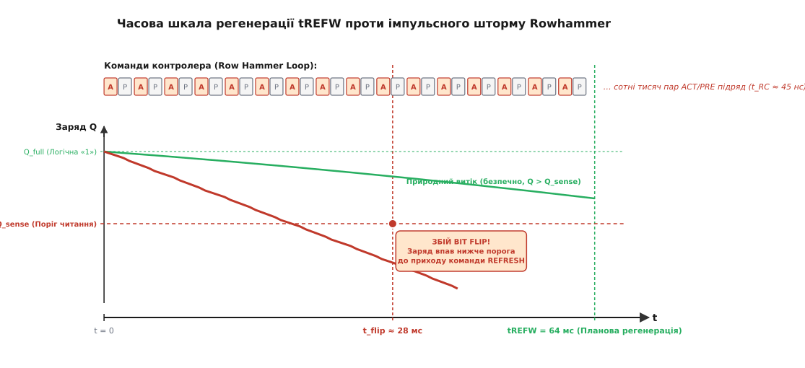
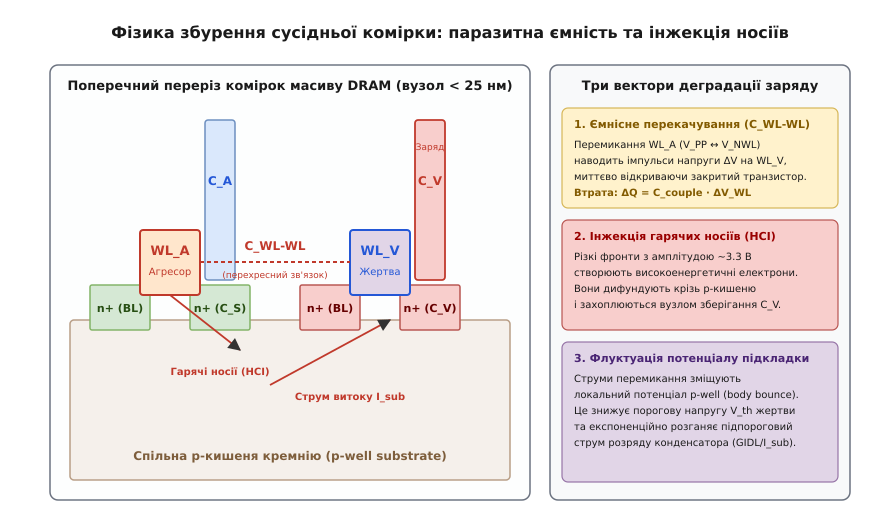
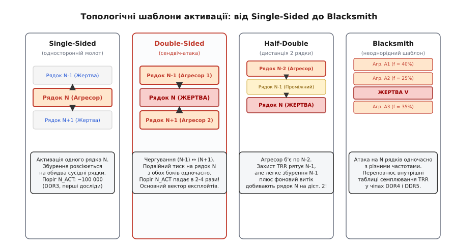
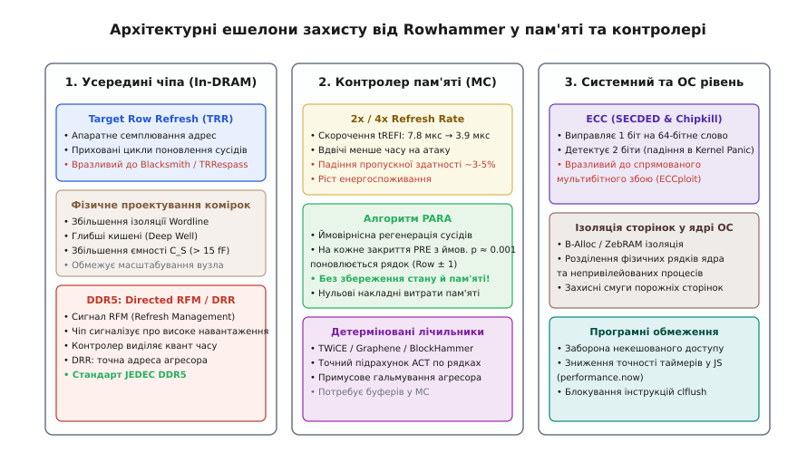

# Ефект Rowhammer у DRAM: фізика збою комірок

<preknowlist>
- [DRAM: транзистор і конденсатор](book:electronics/dram-cell) — будова комірки 1T1C, руйнівне зчитування, буфер-підсилювач і необхідність регенерації.
- [SDRAM і DDR](book:electronics/sdram-ddr) — синхронна робота, таймінги активації tRAS/tRP/tRC, відкриття та закриття рядків масиву.
- [Траншейний і стекований конденсатор DRAM](book:electronics/trench-capacitor) — геометрія мікроскопічної комірки, ємність зберігання заряду та діелектрики.
- [Підпороговий струм і витік](book:electronics/subthreshold-leakage) — експоненційний витік закритого MOSFET-ключа через підпорогову провідність.
- [Ефект підкладки](book:electronics/body-effect) — вплив локального потенціалу підкладки на порогову напругу транзистора.
- [ECC у RAM і Flash](book:communications/ecc-ram-flash) — коди виправлення помилок SECDED та межі захисту пам'яті.
</preknowlist>

Непривілейований процес у системі виконує звичайний цикл зчитування з власного масиву пам'яті, до якого він має повний легальний доступ. Програма не здійснює жодного системного виклику, не експлуатує помилок переповнення буфера в ядрі операційної системи й не порушує правил віртуальної адресації MMU. Проте за кілька мілісекунд у сусідній фізичній сторінці пам'яті, що належить ядру ОС або іншому ізольованому процесу, один із бітів спонтанно змінює свій стан із логічної одиниці на нуль. Якщо цей біт належав дескриптору сторінкової таблиці (*Page Table Entry*, PTE), процес користувача миттєво отримує повні права на запис у будь-яку ділянку фізичної пам'яті комп'ютера, повністю руйнуючи програмну ізоляцію операційної системи.

Цей феномен відомий як ефект **Rowhammer** (від англ. *row* — «рядок» та *hammer* — «молоток, довбати»). Він виникає не через логічну помилку в коді чи мікрокоді процесора, а внаслідок фундаментальних електромагнітних і квантово-механічних процесів у кремнієвих кристалах динамічної пам'яті (DRAM), де ультращільне розташування провідників перетворює швидкісне перемикання одного рядка на потужне джерело зарядового витоку для його сусідів.

### Анатомія ультращільного масиву DRAM та межа масштабування

Щоб зрозуміти фізичну природу збою, необхідно спуститися на рівень напівпровідникової топології кремнієвого кристала. Класична динамічна пам'ять будується на елементарній комірці Деннарда (1T1C): один польовий транзистор доступу (*Access Transistor*) та один крихітний накопичувальний конденсатор (*Storage Capacitor* `C_S`). Заряд, що зберігається в цьому конденсаторі, становить основу біта інформації: наявність заряду кодує логічний стан, а його відсутність — протилежний.

У гонитві за гігабайтами щільність розміщення комірок на кремнієвій пластині невпинно зростала впродовж десятиліть. Коли технологічні норми літографії перетнули межу 50 нанометрів і опустилися до суб-30 нм (вузли 2x, 1x, 1y, 1z та 1a нм), фізичні розміри елементів досягли фундаментальних меж твердотільної фізики.

```
Вузол масштабування  Крок словесних ліній  Ємність конденсатора C_S  Заряд повної «1»
──────────────────────────────────────────────────────────────────────────────────────
50 нм (DDR3, 2008)   50 нм                 35 фФ                     ≈ 42 фКл
30 нм (DDR3, 2012)   30 нм                 24 фФ                     ≈ 29 фКл
2x нм (DDR4, 2015)   22 нм                 16 фФ                     ≈ 19 фКл
1x нм (DDR4, 2018)   17 нм                 12 фФ                     ≈ 14 фКл
1z/1a нм (DDR5)      12 нм                 8–10 фФ                   ≈ 9–11 фКл
```

При проектній нормі 1x нм відстань між паралельними словесними лініями (*Wordlines*, WL), які керують затворами транзисторів, скоротилася до 15–18 нанометрів — це відстань усього в 60–80 міжатомних проміжків кристалічної решітки кремнію. Самі конденсатори довелося трансформувати у надвисокі вертикальні циліндри зі співвідношенням висоти до діаметра понад 50:1, використовуючи матеріали з високою діелектричною проникністю (*High-k dielectrics* на основі оксидів цирконію та алюмінію).

Попри всі технологічні хитрощі, абсолютна ємність конденсатора неминуче впала з 35–40 фемтокулонів у старіших чіпах до 10–12 фемтокулонів у сучасних. Повний електричний заряд логічної одиниці в сучасній комірці становить лише близько 14 фемтокулонів (менше 90 000 електронів), а критичний запас заряду, втрата якого зміщує напругу нижче порога чутливості диференційного підсилювача зчитування, не перевищує 3–4 фемтокулонів (близько 20 000 електронів).

Коли мільйони таких надчутливих наноємностей розміщуються впритул одна до одної, ізоляція між сусідніми провідниками перестає бути абсолютною. Докладний літографічний та історичний контекст виникнення цієї кризи викладено в [історії відкриття вразливості Rowhammer](book:electronics/rowhammer/hist-rowhammer.md).

### Механіка «молота»: цикли активації, закриття та кеш-бар'єр

Доступ до даних у DRAM організований у вигляді матриці рядків і стовпчиків. Щоб прочитати або записати навіть один 64-бітний байт, контролер пам'яті повинен виконати суворо регламентовану послідовність операцій на шині команд:

1. **Команда активації (`ACTIVATE`, `ACT`):** Контролер виставляє адресу рядка. Дешифратор рядків піднімає напругу на відповідній словесній лінії від рівня замикання `V_NWL ≈ -0.3 В` до високого потенціалу відмикання `V_PP ≈ +3.0 В`. Транзистори всіх 65 536 комірок цього рядка одночасно відкриваються і зливають свій заряд на відповідні розрядні лінії (*Bitlines*).
2. **Підсилення та утримання в буфері (*Sense & Latch*):** Диференційні підсилювачі зчитування вловлюють мілівольтові відхилення на розрядних лініях, підсилюють їх до повних рівнів напруги живлення `V_DD` та фіксують у внутрішньому буфері рядка (*Row Buffer*). Оскільки первинне читання руйнує заряд конденсаторів, підсилювачі негайно перезаписують відновлені рівні назад у комірки.
3. **Команда читання/запису (`READ`/`WRITE`, `CAS`):** Дані зчитуються безпосередньо з буфера рядка на зовнішню шину з мінімальною затримкою.
4. **Команда деактивації та відновлення (`PRECHARGE`, `PRE`):** Щоб звернутися до іншого рядка в тому самому банку, відкритий рядок необхідно закрити. Напруга на словесній лінії скидається назад до `-0.3 В`, замикаючи транзистори, а розрядні лінії балансуються до опорного рівня `V_DD / 2`.

Тривалість виконання повного циклу «відкрити — закрити» обмежується фізичними часовими константами кремнію: часом відновлення заряду `t_RAS` (близько 32–35 нс) та часом перезаряджання розрядних ліній `t_RP` (близько 13–15 нс). Їхня сума визначає мінімальний період повторного звернення до одного банку — час циклу рядка `t_RC`:

```
t_RC = t_RAS + t_RP ≈ 35 нс + 15 нс = 50 нс               [мінімальний період циклу ACT+PRE]
```

Це означає, що за одну секунду до одного банку можна надіслати до 20 мільйонів циклів відкриття-закриття.

За звичайних умов робота процесора не створює аномального навантаження на один рядок. Процесорний кеш (L1, L2, L3) утримує прочитані дані, тому повторні звернення програми обслуговуються всередині процесора за частки наносекунди, не доходячи до мікросхем оперативної пам'яті. Контролер пам'яті бачить лише рідкісні запити на читання цілих кеш-ліній (64 байти).

Проте якщо атакуюча програма примусово інвалідує кеш-лінію за допомогою спеціальної асемблерної інструкції `clflush` (*Cache Line Flush*) або через спеціально підібрані набори витіснення кешу (*Eviction Sets*), кожна наступна інструкція читання змушена йти безпосередньо до DRAM. Зловмисник запускає високошвидкісний цикл «молота» (*Row Hammer Loop*):

```
Активація рядка-агресора (ACT) 
→ Читання даних 
→ Примусове скидання кешу (clflush) 
→ Закриття рядка (PRECHARGE) 
→ Негайний повтор циклу
```

Такий цикл повторюється сотні тисяч разів підряд із максимальною фізично можливою швидкістю, визначеною таймінгом `t_RC`.


*Зверху — неперервний шторм команд активації (ACT) та деактивації (PRE) рядка-агресора з періодом t_RC ≈ 45–50 нс. Знизу — крива заряду конденсатора в сусідній комірці-жертві: при звичайній роботі (зелена лінія) повільний природний витік утримує заряд вище порога компаратора Q_sense до планової регенерації (tREFW = 64 мс). Під дією імпульсного збурення Rowhammer (червона східчаста лінія) заряд лавиноподібно спадає і перетинає критичний поріг уже через ~28 мс (після N_ACT активацій), викликаючи незворотне перекидання біта до приходу планової команди поновлення.*

Кожна динамічна пам'ять зобов'язана періодично поновлювати заряд у своїх конденсаторах. Стандарт JEDEC встановлює вікно повної регенерації `t_REFW = 64 мс` (при робочій температурі до 85°C). За ці 64 мс контролер пам'яті встигає надіслати 8192 розподілені команди `REFRESH`, по черзі оновлюючи всі рядки матриці. Проте максимальна кількість циклів активації агресора, яку процесор може виконати за 64 мс, сягає колосальної величини:

```
N_max = t_REFW / t_RC = 64·10⁻³ с / 50·10⁻⁹ с = 1 280 000 активацій [місткість часового вікна]
```

Якщо критична кількість активацій, необхідна для вичерпання заряду сусідньої комірки, менша за `N_max`, комірка неминуче втратить свій біт до того, як контролер надішле планову команду `REFRESH`.

### Три фізичні механізми витоку заряду з комірки-жертви

Чому саме багаторазове відкриття та закриття рядка-агресора (`WL_A`) викликає витік заряду з конденсатора сусіднього рядка-жертви (`WL_V`), транзистор якого весь цей час надійно замкнений негативною напругою `-0.3 В`?

Фізичні дослідження показують, що ефект Rowhammer є кумулятивним результатом дії трьох незалежних напівпровідникових механізмів, які підсилюють один одного на суб-30 нм масштабах.


*Поперечний переріз масиву комірок DRAM із похованими затворами (BCAT). При комутації словесної лінії агресора WL_A (V_PP ↔ V_NWL) паразитна ємність C_WL-WL наводить імпульси напруги на затвор жертви WL_V, миттєво переводячи його в режим глибокого підпорогового витоку. Одночасно сильні електричні поля інжектують гарячі носії (HCI) у діелектрик, а струми розтікання підкладки зміщують потенціал p-well, викликаючи body-ефект і додаткове зниження порогової напруги.*

#### 1. Ємнісний перехресний зв'язок затворів (`C_WL-WL`) та паразитна накачка напруги

Паралельні металеві або полікремнієві словесні лінії утворюють між собою протяжний паразитний плоский конденсатор із ємністю `C_WL_WL`.

Коли на лінію агресора подається імпульс відмикання з амплітудою `ΔV_WL = V_PP - V_NWL = 3.0 - (-0.3) = 3.3 В`, фронт наростання напруги з крутизною `dV/dt > 2 В/нс` передається на лінію жертви через ємнісний подільник напруги:

```
ΔV_V = ΔV_WL · ( C_WL_WL / ( C_WL_WL + C_V_total ) )       [наведена паразитна напруга на затворі]
```

де `C_V_total` — сумарна власна ємність вузла жертви відносно підкладки та каналу.

У типовому кремнії коефіцієнт ділення становить близько 10–12%. Це означає, що кожен позитивний фронт активації агресора підкидає напругу на закритому затворі жертви від `-0.30 В` до позитивного значення `+0.05...+0.10 В`.

Хоча напруга `+0.10 В` не досягає номінального порога повного відкриття n-MOSFET (`V_th ≈ 0.6 В`), струм через канал транзистора в підпороговій області залежить від напруги затвора **експоненційно**:

```
I_sub ∝ exp( ( V_GS - V_th ) / ( n · V_T ) )              [експоненційний підпороговий струм]
```

Зсув напруги затвора на кожні 95 мВ (величина підпорогового розмаху `S` при 85°C) збільшує струм витоку через закритий транзистор рівно в 10 разів. Зсув потенціалу на `+0.40 В` відносно стану спокою збільшує підпорогову провідність каналу у понад 15 000 разів на час дії кожного імпульсу. Конденсатор комірки-жертви починає прискорено розряджатися через напіввідкритий канал на розрядну лінію.

#### 2. Інжекція гарячих носіїв (Hot Carrier Injection, HCI) та ударна іонізація

Другим фактором є наявність екстремально високих локальних електричних полів. При напрузі комутації 3.3 В та товщині підзатворного діелектрика всього 5–6 нм напруженість електричного поля під затвором агресора сягає величини:

```
E_ox = ΔV_WL / d_ox ≈ 3.3 В / ( 5.5 · 10⁻⁹ м ) = 6.0 МВ/см [екстремальна напруженість поля]
```

У такому полі вільні електрони в каналі агресора розганяються до швидкостей насичення і набувають надлишкової кінетичної енергії, перетворюючись на «гарячі носії». Зіштовхуючись з атомами кремнієвої решітки в області p-n переходу стоку, вони викликають ударну іонізацію, породжуючи вторинні електронно-діркові пари.

Частина високоенергетичних електронів набуває енергії, достатньої для подолання потенційного бар'єра на межі `Si–SiO₂` (близько 3.15 еВ), і інжектується в об'єм діелектрика. Ці носії дифундують крізь кремній на відстань у десятки нанометрів і захоплюються вузлом зберігання сусідньої комірки, безпосередньо нейтралізуючи накопичений у ній додатний заряд.

#### 3. Модулювання потенціалу підкладки (Substrate / Well Bounce) та ефект тіла

Дірки, що утворилися в результаті ударної іонізації та ємнісного перемикання затворів, стікають у спільну напівпровідникову p-кишеню (*p-well*), у якій сформовані транзистори цілого блоку комірок.

Оскільки кремнієва підкладка має власний опір розтікання `R_well`, протікання імпульсного струму створює локальний динамічний підскік електричного потенціалу кишені `ΔV_body ≈ 0.1–0.15 В` (*Body Bounce*). Згідно з фізикою польового транзистора, позитивне зміщення підкладки відносно витоку викликає зворотний ефект підкладки (*Body Effect*): воно звужує збіднену область p-n переходу і **знижує порогову напругу** `V_th` транзистора сусідньої комірки на 30–40 мВ.

Зниження `V_th` додає ще один мультиплікативний коефіцієнт (у 2.0–2.5 раза) до підпорогового струму витоку. Усі три механізми діють узгоджено:
1. Ємнісний зв'язок підкидає напругу на затворі жертви вгору.
2. Ефект підкладки опускає поріг відмикання транзистора вниз.
3. Гарячі електрони та струми витоку через пастки в діелектрику (Trap-Assisted Tunneling) безпосередньо крадуть заряд із конденсатора.

Повний математичний апарат розрахунку балансу заряду, інтегралів витоку та енергії активації за законом Арреніуса наведено в [математичній моделі витоку заряду й критичного порога активацій](book:electronics/rowhammer/math-rowhammer-leakage.md).

### Топологічні шаблони атак: від Single-Sided до Blacksmith

Фізичний ефект витоку трансформується в практичну атаку через вибір просторово-часового шаблону активації рядків усередині банку DRAM.


*Чотири покоління топологічних шаблонів Rowhammer. Single-Sided атакує один рядок, розсіюючи енергію на двох сусідів. Double-Sided стискає жертву між двома агресорами (N-1 та N+1), подвоюючи втрату заряду й знижуючи поріг збою в рази. Half-Double долає захист TRR на дистанції d = 2. Blacksmith використовує неперіодичні патерни багатьох агресорів для переповнення апаратних лічильників мікросхеми.*

#### 1. Односторонній молот (Single-Sided Rowhammer)
Атакуючий процес вибирає один рядок-агресор `Row N` і багаторазово активує його. Паразитне збурення симетрично розсіюється на обидва сусідні рядки: `Row N - 1` та `Row N + 1`. Це найперший історичний варіант атаки, відкритий Кімом і Мутлу у 2014 році. На пам'яті DDR3 критичний поріг активацій `N_ACT` для одностороннього молота становив від 100 000 до 300 000 циклів.

#### 2. Двосторонній молот (Double-Sided Rowhammer / Сендвіч-атака)
Зловмисник знаходить у пам'яті адреси двох рядків-агресорів `Row N - 1` та `Row N + 1`, між якими фізично затиснутий цільовий рядок-жертва `Row N`. Програма по черзі активує то перший, то другий рядок у швидкому циклі:

```
ACT(N - 1) → clflush(N - 1) → ACT(N + 1) → clflush(N + 1) → повтор
```

У цьому режимі конденсатори комірок рядка `N` зазнають імпульсних ударів з обох боків одночасно: парні словесні лінії по черзі наводять паразитні напруги на затвор жертви. Втрата заряду за одиницю часу подвоюється, а критичний поріг `N_ACT` падає в 2.5–4 рази порівняно з одностороннім режимом (до 10 000–25 000 активацій на чіпах DDR4). Сендвіч-атака стала базовим інструментом для побудови практичних експлойтів.

#### 3. Атака Half-Double (дистанція 2 рядки)
Коли виробники пам'яті впровадили апаратні механізми захисту, які автоматично оновлювали безпосередніх сусідів агресора на дистанції `d = 1`, інженери Google у 2021 році відкрили ефект **Half-Double**.

Якщо інтенсивно молотити рядок `Row N - 2`, захист вчасно поновлює заряд у безпосередньому сусіді `Row N - 1`. Проте сам рядок `Row N - 1` під час цих поновлень зазнає сотень мікроактивацій. Ця слабка активність рядка `N - 1`, накладаючись на фонове поле агресора `N - 2`, призводить до витоку заряду в рядку `Row N` (дистанція `d = 2`). Оскільки апаратний захист пам'яті стежить лише за дистанцією 1, рядок на дистанції 2 деградує і зазнає збою абсолютно непомітно для контролера.

#### 4. Неперіодичні та багаторядкові шаблони (Blacksmith / TRRespass)
У найсучасніших мікросхемах DDR4 та DDR5 апаратні фільтри відстежують регулярні звернення до пар рядків. Дослідники з ETH Zurich (проєкт Blacksmith, 2021) застосували генетичні алгоритми для створення складних патернів: одночасна активація пачки з 8–32 рядків із нерівномірним розподілом частот (наприклад, агресор `A1` отримує 40% активацій, `A2` — 25%, `A3` — 20%, `A4` — 15%). Такі патерни переповнюють обмежені внутрішні черги лічильників мікросхеми та обходять захист на 100% протестованих модулів.

#### 5. Фізична асиметрія: прямі та інверсні комірки (True-Cells vs Anti-Cells)
У топології DRAM для вирівнювання шумів на розрядних лініях застосовують просторове чергування полярності кодування. У прямих комірках (*True-Cells*) логічній «1» відповідає наявність заряду (`V_cell = V_DD`), а «0» — розряджений стан (`0 В`). В інверсних комірках (*Anti-Cells*), навпаки, логічній «1» відповідає розряджений стан (`0 В`), а логічному «0» — заряджений стан (`V_cell = V_DD`).

Оскільки фізичний витік Rowhammer завжди спрямований на розряджання конденсатора до базового потенціалу, інверсія бітів у логічному просторі процесора має сувору спрямованість:
- У комірках True-Cell збій завжди відбувається у напрямку $1 \to 0$;
- У комірках Anti-Cell збій завжди відбувається у напрямку $0 \to 1$.

Зловмисник не може довільно змінити біт у будь-який бік: він повинен попередньо знати або підібрати шаблон даних у пам'яті (шаховий патерн `0xAA`/`0x55`, суцільні `0xFF`/`0x00`), щоб цільовий біт перебував у фізично зарядженому стані.

### Програмні вектори експлуатації: від фізичного дефекту до захоплення ядра

Здатність інвертувати одиночні біти у фізичній пам'яті відкрила принципово новий клас атак на інформаційну безпеку обчислювальних систем.

#### 1. Атака на сторінкові таблиці ядра (PTE Rowhammer Attack)
Найвідоміший класичний вектор, продемонстрований Google Project Zero у 2015 році, дозволяє непривілейованому процесу отримати повні права адміністратора (root / kernel execution).

Атака будується за схемою *Page Table Spraying*:
1. Процес користувача виділяє гігабайти пам'яті через виклик `mmap`, змушуючи ядро операційної системи виділити мільйони структур таблиць сторінок другого та третього рівнів (Page Table Entries, PTE).
2. Записи PTE розміщуються у випадкових фізичних фреймах DRAM. Кожен 64-бітний запис PTE містить 40-бітний фізичний номер базової сторінки (*Page Frame Number*, PFN) та прапорці доступу (R/W, User/Supervisor).
3. Процес запускає двосторонній молот на своїй пам'яті, що межує з пулом сторінкових таблиць ядра.
4. Коли в одному з записів PTE перекидається біт у полі PFN, віртуальна сторінка процесу починає несподівано вказувати не на його власні дані, а на саму таблицю сторінок ядра з відкритими правами на запис.
5. Процес напряму модифікує свої права доступу у відображеній сторінці ядра, призначаючи собі довільні фізичні адреси пам'яті та отримуючи повний контроль над операційною системою.

#### 2. Злам пісочниць браузерів через JavaScript та WebAssembly
Дослідники з Грацького технічного університету (Rowhammer.js) довели, що для проведення атаки не потрібен доступ до низькорівневих компіляторів чи системних викликів.

У звичайному браузері Chrome або Firefox створюються великі типізовані масиви `ArrayBuffer`. Для обходу відсутності інструкції `clflush` у JavaScript використовують масивні цикли звернення до допоміжних елементів, які витісняють рядки-агресори з кешу L3 за алгоритмом LRU. Шляхом перекидання біта в покажчиках об'єктів JavaScript руйнується сувора типізація рушіїв V8 чи SpiderMonkey, що дозволяє вийти за межі пісочниці браузера та виконати довільний машинний код на комп'ютері відвідувача сайту.

#### 3. Дистанційні атаки через мережу: NetHammer та Throwhammer
Атаки NetHammer та Throwhammer продемонстрували можливість інверсії бітів через локальну мережу без запуску шкідливого коду на машині жертви. Зловмисник надсилає гігабітний потік спеціально сформованих мережевих пакетів UDP або транзакцій RDMA (*Remote Direct Memory Access*). Мережева карта жертви за допомогою контролера прямого доступу до пам'яті (DMA) безперервно записує пакети в одні й ті самі кільцеві буфери ядра, створюючи необхідну частоту активацій рядків і спричиняючи перекидання бітів у сусідніх структурах сервера.

Практичний алгоритм виявлення вразливих рядків, керування кеш-лініями та аналізу інверсій бітів реалізовано в [програмному алгоритмі пошуку та перевірки вразливих рядків](book:electronics/rowhammer/proj-rowhammer-sweep.md).

### Архітектурні методи захисту та їхні інженерні компроміси

Боротьба з Rowhammer ведеться одночасно на трьох рівнях: фізичному рівні кремнієвого кристала, логічному рівні контролера пам'яті та системному рівні операційної системи.


*Три ешелони захисту від Rowhammer. На рівні чіпа DRAM діють апаратний моніторинг TRR та нові протоколи DDR5 (RFM/DRR). На рівні контролера пам'яті застосовують подвоєну регенерацію (2x/4x Refresh), ймовірнісний алгоритм PARA та детерміновані лічильники. На рівні системи діють коди корекції помилок ECC та фізична ізоляція пам'яті ядра.*

#### 1. Подвоєння частоти регенерації (2x / 4x Refresh Rate)
Найпростішим первинним захистом, реалізованим у багатьох BIOS/UEFI, стало скорочення інтервалу між командами регенерації:

```
t_REFI = 7.8 мкс → 3.9 мкс (режим 2x Refresh) → 1.95 мкс (режим 4x Refresh)
```

Скорочення часового вікна вдвічі зменшує максимальну кількість активацій `N_max`, яку атакуючий встигає виконати до відновлення заряду.
- **Ціна рішення:** Кожна команда `REFRESH` тимчасово блокує доступ до банків пам'яті. Перехід на 2x Refresh забирає 2–4% пропускної здатності шини та підвищує енергоспоживання, а 4x Refresh викликає падіння продуктивності до 8–10%, що неприйнятно для високонавантажених серверів і мобільних пристроїв. Крім того, при сучасних порогах `N_ACT < 5 000` навіть 4x Refresh більше не гарантує безпеки.

#### 2. Target Row Refresh (TRR) усередині чіпа DRAM
Починаючи з покоління DDR4, виробники пам'яті інтегрували в кристали апаратний блок **In-DRAM TRR**. Блок містить внутрішні схеми семплювання адрес і лічильники активацій. Коли кількість відкриттів певного рядка перевищує внутрішній поріг, чіп самостійно використовує вільні такти команд `REFRESH` для прихованого поновлення заряду в безпосередніх сусідах `Row ± 1`.
- **Вразливість:** Виробники реалізували TRR як пропрієтарну апаратну евристику з обмеженою кількістю лічильників (зазвичай 1–4 регістри на банк). Дослідження TRRespass та Blacksmith довели, що розподілені багаторядкові шаблони повністю виводять лічильники TRR із ладу, обходячи захист.

#### 3. Пам'ять із корекцією помилок (ECC)
Серверні модулі оперативної пам'яті комплектуються 72-бітною шиною, де додаткові 8 біт на кожні 64 біти даних зберігають контрольний код корекції помилок (ECC на базі коду Хеммінга / SECDED — *Single Error Correction, Double Error Detection*).
- **Межі захисту:** SECDED виправляє одиночне перекидання біта в 64-бітному слові та детектує подвійне. Проте сильні атаки Rowhammer здатні одночасно перекинути 2, 3 або 4 біти в межах одного слова (техніка ECCploit). У разі подвійного збою сервер падає в Kernel Panic (відмова в обслуговуванні, DoS), а при непарному трибітовому збої блок ECC помилково «виправляє» дані, створюючи приховане спотворення пам'яті.

#### 4. Алгоритми на рівні контролера пам'яті (PARA, TWiCE, Graphene)
Найбільш перспективним підходом є моніторинг активності безпосередньо в контролері пам'яті процесора:

- **PARA (Probabilistic Adjacent Row Activation):** Елегантний ймовірнісний алгоритм, запропонований групою Мутлу. Під час кожного закриття рядка (`PRECHARGE`) контролер із невеликою фіксованою ймовірністю `p` (наприклад, `p = 0.001` або 0.1%) надсилає додаткову команду активації випадкового сусіда `Row ± 1`. Якщо рядок відкривається 100 000 разів, ймовірність того, що його сусід жодного разу не буде оновлений, становить мізерну величину `(1 - p)¹⁰⁰⁰⁰⁰ ≈ 10⁻⁴⁴`. PARA не вимагає жодного біта додаткової пам'яті для зберігання стану лічильників.
- **Детерміновані лічильники (Graphene / BlockHammer):** Контролер пам'яті веде компактні хеш-таблиці та лічильники активацій за алгоритмами підрахунку частотних елементів (Heavy Hitters). Якщо рядок перевищує безпечний ліміт активацій, контролер примусово блокує доступ до нього (*Row Throttling*) або негайно вставляє адресне поновлення.

#### 5. Стандарти DDR5: сигнали RFM та Directed Row Refresh (DRR)
У специфікаціях DDR5 та LPDDR5 комітет JEDEC вперше стандартизував спільний протокол захисту між чіпом пам'яті та контролером:
1. **Refresh Management (RFM):** Чіп пам'яті самостійно підраховує кількість активацій у своїх банках. Коли внутрішній ліміт вичерпується, чіп сигналізує контролеру про необхідність виділити додатковий час на обслуговування.
2. **Directed Row Refresh (DRR):** Контролер надсилає стандартизовану команду поновлення із зазначенням точної фізичної адреси перевантаженого агресора, змушуючи чіп гарантовано поновити сусідні комірки.

> 🔧 **Навіщо це.** Розуміння фізики та механізмів Rowhammer є критично важливим для системного проектування на всіх рівнях:
> 1. **Проектування вбудованих систем і SoC:** Вибираючи мікросхеми оперативної пам'яті для критичних систем (автомобільна електроніка, авіоніка, промислова автоматика), не можна покладатися лише на декларації виробників про «Rowhammer-free». Необхідно враховувати температурний режим (нагрівання кристала до 85–95°C знижує поріг збою в рази) та вмикати апаратні механізми 2x Refresh або контролерні лічильники.
> 2. **Архітектура серверів і хмарних гіпервізорів:** Звичайна ізоляція сторінок на рівні MMU більше не захищає віртуальні машини від атаки сусіднього клієнта на тому самому фізичному сервері. Системи віртуалізації застосовують алокатори пам'яті з колірним розділенням банків (*Bank Coloring*), які гарантують, що пам'ять різних клієнтів фізично потрапляє в різні банки DRAM.
> 3. **Розробка низькорівневого ПЗ та ядер ОС:** Ядра сучасних ОС (Linux, Windows, macOS) впроваджують механізми ізоляції критичних пулів пам'яті (B-Alloc), розміщуючи сторінкові таблиці ядра на безпечній фізичній відстані від пам'яті непривілейованих процесів.

---

Ефект Rowhammer довів, що в сучасній мікроелектроніці більше не існує абсолютної абстракції між фізичним кремнієм і логічними даними програми. Зі зменшенням топологічних норм нижче 30 нанометрів заряд накопичувальних конденсаторів DRAM скоротився до лічених фемтокулонів, а словесні лінії зблизилися на відстань у кілька десятків атомів. Швидкісне багаторазове перемикання напруги на затворах агресора через паразитну ємність `C_WL_WL`, інжекцію гарячих електронів та модуляцію потенціалу підкладки експоненційно прискорює підпороговий витік із сусідніх комірок, спричиняючи спонтанне перекидання бітів задовго до приходу планової регенерації `REFRESH`.

Подолання цієї кризи вимагає відмови від пасивних евристик і переходу до скоординованого багаторівневого захисту: від фізичного екранування ліній на кристалі та протоколів DDR5 RFM/DRR до ймовірнісних алгоритмів контролера пам'яті (PARA) та фізичної ізоляції банків на рівні ядра операційної системи.
