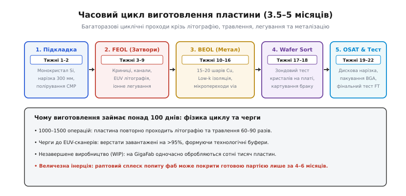
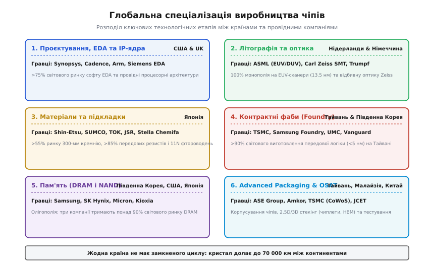
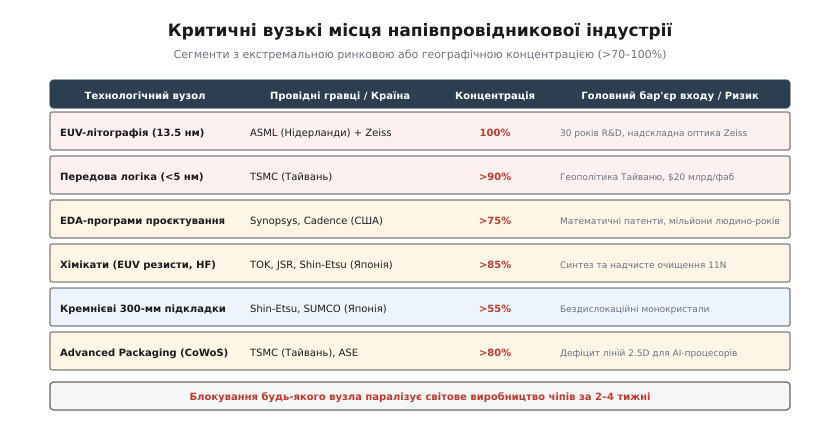

# Ланцюг постачання чіпів

<preknowlist>
- [Фаби й fabless](book:electronics/fabs-fabless) — бізнес-моделі напівпровідникової індустрії та поділ праці між проєктуванням і виробництвом.
- [Фотолітографія](book:electronics/photolithography) — друк нанометрових структур світлом і робота сканерів DUV/EUV.
- [Шар за шаром](book:electronics/doping-etching-metal) — цикл легування, травлення й осадження металізації.
- [Техпроцес](book:electronics/process-node) — нанометрові вузли, геометрія затвора та щільність компонентів.
</preknowlist>

Сучасний мікропроцесор містить десятки мільярдів транзисторів, сформованих із точністю до одиниць нанометрів. Проте найбільш приголомшливий факт про нього полягає не в квантовій фізиці затворів, а в географії та логістиці: перш ніж кремнієвий кристал опиниться всередині смартфона чи сервера, його вихідні матеріали, цифрові проєкти, оптичні маски та напівфабрикати долають від 40 000 до 70 000 кілометрів і перетинають міжнародні кордони від 70 до 100 разів. Жодна компанія, жоден промисловий конгломерат і жодна держава у світі не мають повного замкненого циклу для створення передової мікросхеми.

Коли автозавод зупиняє конвеєр через відсутність одного стабілізатора напруги за два долари, це оголює базову властивість напівпровідникової індустрії: вона не схожа на жодну іншу галузь людського виробництва. Глобальний ланцюг постачання (англ. *supply chain*) напівпровідників формувався десятиліттями не через випадковість чи дешевизну робочої сили, а під тиском нещадної технологічної складності та економіки капіталу. Кожен виробничий крок вимагає настільки глибокої концентрації знань, патентів та інвестицій, що в кожному сегменті ринок звівся до двох-трьох компаній або навіть абсолютного монополіста. Розберімо, як працює ця глобальна машина, чому виготовлення кремнієвої пластини триває майже пів року і чому жодна країна не може ізолювати своє виробництво від решти світу.

### Анатомія шляху пластини: 1500 операцій, 5 місяців та інерція конвеєра

Технологічний шлях напівпровідникового кристала починається задовго до того, як кремнієвий диск потрапить у чисту кімнату літографічного цеху. Усе починається з кварцового піску високої чистоти, який відновлюють до металургійного кремнію, переводять у трихлорсилан і багаторазово ректифікують, отримуючи полікристалічний кремній чистотою одинадцять дев'яток (99.999999999% основного елемента). Цей надчистий полікремній плавлять у кварцових тиглях за температури понад 1420 °C і [витягують бездислокаційний монокристалічний зливок](book:electronics/silicon-monocrystal) вагою кілька сотень кілограмів. Зливок калібрують, шліфують алмазними інструментами й розпилюють надтонким алмазним дротом на сотні пластин діаметром 300 мм і товщиною близько 775 мікрометрів.

Кожна така пластина проходить хіміко-механічне полірування (англ. *Chemical Mechanical Planarization*, *CMP*) до стану ідеального оптичного дзеркала: перепад висот на всій 300-міліметровій площині не перевищує кількох ангстремів. Лише після цього поліровані диски упаковують у герметичні капсули й транспортують літаками на контрактні фабрики (англ. *foundry*, «ливарня»), де починається найдовша частина подорожі.


*Виробничий цикл кремнієвої пластини триває від 14 до 22 тижнів через багаторазове повторення літографічних циклів для 60–90 масок і черги до верстатів.*

На сучасній кремнієвій фабриці пластина проводить від 14 до 22 тижнів — від 3.5 до 5.5 місяців. Цей тривалий термін не є наслідком бюрократичних затримок: він диктується фізикою пошарового вирощування мікроструктури. Виготовлення сучасного логічного чіпа за нормами 3 або 5 нанометрів вимагає від 1000 до 1500 окремих технологічних операцій. Весь процес поділяють на дві великі стадії:
1. **FEOL** (англ. *Front-End-of-Line*, «початок виробничої лінії») — формування активних ділянок напівпровідника: створення ізоляційних траншей, легування кишень, вирощування наношарів оксидів під затворами, формування вертикальних кремнієвих ребер FinFET або наносторінок GAAFET (англ. *Gate-All-Around FET*).
2. **BEOL** (англ. *Back-End-of-Line*, «кінець виробничої лінії») — побудова багатоповерхової системи комутації з міді та діелектриків із наднизькою проникністю (англ. *Low-k dielectric*). У передовому процесорі кількість металевих шарів сягає 15–22, а загальна довжина мікроскопічних мідних доріжок на одному квадратному сантиметрі кристала перевищує 50 кілометрів.

Головна просторова особливість фабу — так звана ре-ентрантна (повторна) логістика. Пластина не рухається прямою конвеєрною стрічкою від верстата до верстата. Натомість вона циклічно повертається до тих самих базових модулів обладнання десятки разів: нанесення фоторезисту → [експонування на літографічному сканері](book:electronics/photolithography) → хімічне проявлення → плазмове реактивно-іонне травлення → іонна імплантація чи осадження діелектрика → рідинне видалення залишків маски → хіміко-механічне полірування CMP.

```
Цикл одного шару (повторюється 60–90 разів):
1. Осадження шару (CVD / ALD)        [створення оксиду або металу]
2. Покриття фоторезистом             [нанесення світлочутливої емульсії]
3. Експонування (EUV / DUV сканер)   [перенесення малюнка маски світлом]
4. Проявлення та запікання          [видалення експонованого резисту]
5. Плазмове травлення (RIE)          [перенесення малюнка в діелектрик/кремній]
6. Змивання резисту (Ashing/Strip)   [очищення поверхні перед наступним етапом]
7. Атомне полірування (CMP)          [вирівнювання поверхні перед новим шаром]
```

Оскільки комплект фотомасок для передового процесу налічує від 60 до 90 окремих шарів, пластина проходить цей повний цикл 60–90 разів. Кожна операція вимагає десятків хвилин під вакуумом, точного термічного відпалу за 1000 °C або прецизійного вимірювання дефектів (метрології).

Тут вступає в дію фундаментальний закон теорії черг — закон Літтла (англ. *Little's Law*):

```
WIP = TH × CT
де:
WIP = Work-in-Process [кількість пластин, що одночасно обробляються на заводі]
TH  = Throughput      [пропускна здатність фабрики, пластин на добу]
CT  = Cycle Time      [повний час перебування пластини у виробництві, діб]
```

Для фабрики потужністю 100 000 пластин на місяць (близько 3300 пластин на добу) при виробничому циклі в 120 днів кількість незавершеного виробництва (WIP) у чистих кімнатах становить близько 400 000 активних пластин одночасно. Усі вони перебувають у безперервному автоматизованому русі всередині герметичних контейнерів FOUP (англ. *Front Opening Unified Pod*), які транспортуються підвісною монорейковою мережею під стелею заводського корпусу.

Така механіка породжує колосальну **інерцію конвеєра**. Фабрика не може раптово змінити тип виробу за один день чи зупинити роботу без мільйонних збитків. Якщо автомобільний концерн скасовує замовлення на мікроконтролери у квітні, фаб уже має заповнений конвеєр на чотири місяці вперед. Коли в жовтні попит раптово повертається, фабриці потрібно від чотирьох до шести місяців лише на те, щоб перша нова партія пройшла весь ланцюг від чистого кремнію до готового кремнієвого чіпа. Саме ця часова інертність стала першопричиною світової кризи постачання автоелектроніки у 2020–2022 роках.

### Шість незамінних ланок: спеціалізація за країнами та компаніями

Щоб зрозуміти, чому окремі регіони світу володіють монопольним впливом на ринок мікросхем, необхідно простежити поділ праці за шістьма основними технологічними ланками. Кожна з них вимагає специфічного наукового та промислового базису, який вибудовувався десятиліттями.


*Глобальна спеціалізація: США контролюють проєктування й софт, Європа — літографію та оптику, Японія — хімію та підкладки, Тайвань і Корея — виробництво кристалів і пам'яті, Південно-Східна Азія — корпусування.*

#### 1. Проєктування, архітектурні ядра та EDA (США, Велика Британія)

Вершина напівпровідникової піраміди — це створення логічної структури мікросхеми. Розробка кристала з 50 мільярдами транзисторів неможлива вручну. Вона спирається на спеціалізоване програмне забезпечення класу **EDA** (англ. *Electronic Design Automation*, «автоматизація проєктування електроніки»).

Програми EDA виконують надскладні математичні завдання: перетворення коду мовою опису апаратури (SystemVerilog, VHDL) на логічні вентилі (логічний синтез), автоматичне розміщення та трасування мільярдів провідників (англ. *Place and Route*), перевірку часових затримок (англ. *Static Timing Analysis*) і фізичну верифікацію правил проєктування (англ. *Design Rule Checking*, *DRC*). Додатково EDA-пакети моделюють оптичні спотворення літографії та модифікують геометрію масок за допомогою алгоритмів оптичної корекції близькості (англ. *Optical Proximity Correction*, *OPC*).

Світовий ринок складного EDA-софту більш ніж на 75% контролюється трьома компаніями зі штаб-квартирами в США: **Synopsys**, **Cadence Design Systems** та **Siemens EDA** (колишній американський *Mentor Graphics*, придбаний німецьким концерном). Їхні алгоритми захищені тисячами фундаментальних патентів на методи оптимізації графів і розв'язання рівнянь Максвелла для електромагнітної взаємодії провідників.

Поруч із софтом стоїть індустрія ліцензування готових схемотехнічних блоків — **IP-ядер** (англ. *Intellectual Property core*). Британська компанія **Arm** розробляє однойменну мікропроцесорну архітектуру, на якій працює понад 95% усіх мобільних процесорів планети та зростаюча частка серверів. Компанії на кшталт Apple, Qualcomm, Nvidia чи MediaTek проєктують власні кристали за безфабричною моделлю ([fabless](book:electronics/fabs-fabless)), комбінуючи архітектури Arm, власні обчислювальні блоки та бібліотеки інтерфейсів від Synopsys.

#### 2. Літографічне обладнання, лазери та прецизійна оптика (Нідерланди, Німеччина, США, Японія)

Для перенесення топології з комп'ютерного файлу маски на кремній потрібні найскладніші машини, коли-небудь створені людством, — літографічні сканери. У сегменті найпередовішої **EUV-літографії** (англ. *Extreme Ultraviolet*, довжина хвилі 13.5 нм) існує абсолютний 100% світовий монополіст — нідерландська компанія **ASML** (місто Велдговен).

Машина ASML Twinscan EXE/NXE важить близько 180 тонн, складається з понад 100 000 деталей і коштує від $200 млн до $380 млн за одиницю. Щоб згенерувати світло з довжиною хвилі 13.5 нм, генератор плазми вистрілює 50 000 крапель розплавленого олова на секунду діаметром 25 мікрометрів. Імпульсний промисловий CO₂-лазер потужністю 25 кВт від німецької компанії **Trumpf** двічі влучає в кожну краплю на льоту: перший слабкий імпульс сплющує краплю в диск, а другий потужний імпульс випаровує її, нагріваючи до стану плазми з температурою в сотні тисяч градусів, яка випромінює потрібний EUV-фотоновий імпульс.

Оскільки екстремальний ультрафіолет поглинається будь-яким оптичним склом і навіть повітрям, весь шлях променя всередині сканера проходить у глибокому вакуумі. Замість лінз використовують систему багатошарових рентгенівських дзеркал із чергуванням шарів молібдену й кремнію товщиною по кілька нанометрів. Цю оптику ексклюзивно виготовляє німецька компанія **Carl Zeiss SMT** (Оберкохен). Дзеркала Zeiss відполіровані з такою точністю, що якби дзеркало було розміром із територію Німеччини, найбільша нерівність на його поверхні не перевищувала б десятої частки міліметра.

Окрім літографії, для створення чіпа потрібні сотні верстатів інших типів:
- Плазмове травлення та осадження тонких плівок: **Applied Materials** (США), **Lam Research** (США), **Tokyo Electron / TEL** (Японія).
- Оптична метрологія та контроль дефектів на пластинах: **KLA Corporation** (США, частка ринку дефектоскопії понад 55%).
- Іонна імплантація: **Axcelis Technologies** (США), **Varian / Applied Materials** (США).

#### 3. Контрактне виготовлення передової логіки — Pure-Play Foundries (Тайвань, Південна Корея)

Коли проєкт завершено, файл масок передають на контрактну фабрику. Світовим центром контрактного виготовлення логіки є острів Тайвань і компанія **TSMC** (англ. *Taiwan Semiconductor Manufacturing Company*).

TSMC контролює понад 58% усього світового ринку контрактного виробництва (foundry) і понад **90% світового виробництва передових логічних мікросхем** за нормами 7 нм, 5 нм, 3 нм і 2 нм. На гігантських виробничих кластерах GigaFab у містах Сіньчжу, Тайнань і Тайчжун виготовляються всі передові процесори для Apple (A-серія та M-серія), графічні прискорювачі Nvidia (H100, B200), процесори AMD, чіпи Qualcomm і значна частина продукції Intel.

Другим гравцем, здатним виробляти передову логіку за суб-5нм нормами, є південнокорейська корпорація **Samsung Electronics** (підрозділ Samsung Foundry). Проте її ринкова частка у передовому контрактному сегменті значно менша (близько 10–12%), а показники [відсотка виходу придатних кристалів (yield)](book:electronics/yield) історично поступаються TSMC.

У сегменті зрілих технологічних процесів (28 нм, 40 нм, 65 нм, 180 нм), які критично важливі для автомобільної промисловості, силової електроніки та датчиків, ринок поділений ширше: **UMC** (Тайвань), **GlobalFoundries** (США/Німеччина/Сінгапур), **SMIC** (Китай) та **Vanguard International Semiconductor** (Тайвань).

#### 4. Масове виробництво пам'яті — DRAM і 3D NAND (Південна Корея, США, Японія)

Виробництво пам'яті — це висококонкурентний капіталомісткий ринок стандартизованих мікросхем. На відміну від логіки, чіпи пам'яті мають регулярну геометричну структуру:
- **DRAM** (динамічна оперативна пам'ять): ринок фактично є олігополією трьох гігантів: **Samsung Electronics** (Південна Корея, ~40%), **SK Hynix** (Південна Корея, ~30%) та **Micron Technology** (США, ~23%). Разом вони контролюють понад 93% світового випуску оперативної пам'яті для комп'ютерів, смартфонів і центрів обробки даних.
- **NAND Flash** (енергонезалежна флешпам'ять із вертикальним стекуванням до 200–300 шарів): ринок ділять **Samsung**, **SK Hynix** (включно з придбаним підрозділом Intel — *Solidigm*), **Kioxia** (Японія, колишня *Toshiba Memory*), **Western Digital / SanDisk** (США) та **Micron**.

Виробництво пам'яті характеризується жорсткими ціновими циклами (англ. *boom-and-bust cycle*): періоди дефіциту та надприбутків змінюються кризами перевиробництва, коли ціни на мікросхеми падають нижче собівартості, змушуючи виробників заморожувати мільярдні капітальні бюджети.

#### 5. Хімічні надчисті матеріали, спеціальні гази та кремнієві підкладки (Японія, Німеччина)

Якщо фабрика є серцем напівпровідникового виробництва, то високочисті хімічні реагенти — це його кров. У цій тихій, але критичній ланці абсолютне лідерство утримують хімічні концерни Японії:
- **Кремнієві 300-мм підкладки**: японські корпорації **Shin-Etsu Chemical** та **SUMCO** разом контролюють понад 55% світового постачання полірованих монокристалічних пластин. Разом із німецькою **Siltronic** та тайванською **GlobalWafers** вони забезпечують понад 85% світової потреби.
- **Фоторезисти**: світлочутливі полімерні емульсії для EUV- та ArFi-літографії виробляють японські компанії **Tokyo Ohka Kogyo (TOK)**, **JSR Corporation**, **Shin-Etsu** та **Fujifilm**. Частка Японії на ринку передових фоторезистів перевищує 85–90%.
- **Надчистий фтороводень (HF) та фторовані сполуки**: для травлення діоксиду кремнію та очищення пластин потрібна плавикова кислота з рівнем домішок менше ніж 1 частка на трильйон (клас чистоти 11N). Її постачають японські компанії **Stella Chemifa** та **Morita Chemical Industries**.
- **Спеціальні технологічні гази**: неон високої чистоти (використовується як буферний газ у глибоких ультрафіолетових ексимерних лазерах DUV ArF), криптон, ксенон та трифторид азоту ($NF_3$). До 2022 року близько 45–54% світового очищеного напівпровідникового неону постачали українські підприємства «Кріоін Інжиніринг» (Одеса) та «Інгаз» (Маріуполь), переробляючи неоно-гелієву суміш металургійних заводів.

#### 6. Корпусування, чиплети та фінальне тестування — OSAT (Тайвань, Малайзія, Китай)

Після завершення обробки пластини її передають на фінальну стадію — [зондове сортування](book:electronics/testing-binning), нарізку алмазною пилкою на окремі кристали та монтаж у захисний корпус із виводами. Цей етап традиційно виконують спеціалізовані підрядники — компанії класу **OSAT** (англ. *Outsourced Semiconductor Assembly and Test*, «зовнішнє складання й тестування напівпровідників»).

Найбільшими гравцями ринку традиційного корпусування є **ASE Group** (Тайвань), **Amkor Technology** (США зі складанням у Кореї та В'єтнамі), **JCET** (Китай) та кластер заводів у штаті Пенанг (Малайзія), де історично зосереджено корпусування аналогових мікросхем і мікроконтролерів.

Проте за останні роки корпусування перестало бути просто дешевим пакуванням кремнію в пластик. Через сповільнення масштабування транзисторів індустрія перейшла до концепції [чиплетів](book:electronics/chiplets) (англ. *chiplet*, «малий кристал») і передового просторового компонування (англ. *Advanced Packaging*). Кілька різних кристалів (обчислювальні ядра, контролери пам'яті, стеки надшвидкої пам'яті HBM) монтують на спільну кремнієву підкладку-інтерпозер (технологія TSMC CoWoS — *Chip-on-Wafer-on-Substrate*, або Intel EMIB). Сьогодні саме потужності ліній CoWoS на Тайвані стали головним вузьким місцем для випуску прискорювачів штучного інтелекту у світі.

### Економіка GigaFab: $20 млрд капітальних витрат і нещадна амортизація

Щоб зрозуміти, чому виробництво чіпів так сильно сконцентрувалося в руках небагатьох компаній, слід розглянути структуру витрат сучасної напівпровідникової мегафабрики — **GigaFab** (завод із продуктивністю понад 100 000 пластин на місяць).

Будівництво та оснащення одного передового заводу під норми 3 нм або 2 нм сьогодні коштує від **$15 млрд до $22 млрд**. Для порівняння, будівництво найбільшого сучасного авіаносця класу «Джеральд Форд» коштує близько $13 млрд, а спорудження атомної електростанції — $8–12 млрд. Фабрика мікроелектроніки є найдорожчим стаціонарним промисловим об'єктом, створеним цивілізацією.

```
Структура капітальних витрат (CapEx) GigaFab ($20 млрд):
┌────────────────────────────────────────────────────────┬─────────────┐
│ Елемент витрат                                         │ Сума (млрд) │
├────────────────────────────────────────────────────────┼─────────────┤
│ Чиста кімната ISO Class 1/3, віброзахист, підстанції   │ $3.5  (18%) │
│ Літографічне обладнання (15–20 сканерів EUV/High-NA)   │ $5.5  (28%) │
│ Верстати плазмового травлення, CVD/ALD осадження       │ $6.0  (30%) │
│ Метрологія, дефектоскопія, іонна імплантація           │ $2.5  (12%) │
│ Автоматизація AMHS, робототехніка, ліцензії            │ $1.5   (7%) │
│ Системи регенерації надчистої води та утилізації газів │ $1.0   (5%) │
└────────────────────────────────────────────────────────┴─────────────┘
```

Ці колосальні витрати породжують надзвичайно жорстку фінансову математику. Обладнання для виробництва чіпів морально застаріває за 4–5 років, оскільки індустрія переходить на наступний технологічний вузол. Отже, фабрику необхідно амортизувати прискореними темпами.

**Приклад (розрахунок амортизаційного навантаження GigaFab).** Фабрика вартістю $20 млрд амортизується за стандартний термін у 5 років за лінійною схемою. Порахуймо ціну простою такого підприємства:

```
Річна амортизація:  $20 000 000 000 ÷ 5 років       = $4 000 000 000 на рік
Денна амортизація:  $4 000 000 000 ÷ 365 діб        = $10 958 904 на добу
Годинна амортизація: $10 958 904 ÷ 24 години        ≈ $456 621 на годину
Хвилинна амортизація: $456 621 ÷ 60 хвилин          ≈ $7 610 на хвилину
```

Кожна хвилина існування фабрики коштує $7600 лише амортизаційних відрахувань за обладнання, незалежно від того, чи працює завод, чи стоїть через аварію. Якщо додати витрати на електроенергію (GigaFab споживає понад 100 мегаватів електричної потужності), надчисту воду, дорогі гази та фонд оплати праці інженерів, годинний простій фабрики завдає збитків у понад $1 млн.

Саме тому напівпровідникові заводи працюють **24 години на добу, 7 днів на тиждень, 365 днів на рік** із цільовим коефіцієнтом завантаження потужностей не менше ніж 90–95%. Якщо завантаження заводу падає до 70%, собівартість кожної випущеної пластини різко злітає, і фабрика стає глибоко збитковою.

Ця економіка пояснює, чому модель чистих контрактних фабрик (pure-play foundry) здобула переконливу перемогу над моделлю інтегрованих виробників (IDM, як-от класичний Intel). Жодна окрема компанія, навіть рівня Apple чи Nvidia, не має стабільного попиту настільки гігантського обсягу, щоб поодинці забезпечити 100% завантаження двох-трьох власних GigaFab цілорічно. TSMC агрегує замовлення від сотень клієнтів з усього світу, змішуючи цикли випуску смартфонів, ігрових приставок, серверних чіпів і автокомпонентів, завдяки чому її фабрики працюють на максимальній ефективності цілодобово.

### Вузькі місця (Chokepoints) та системна вразливість індустрії

Термін **вузьке місце** або **горловина** (англ. *chokepoint*, від *choke*, «задушити, перекрити» + *point*, «точка») в теорії ланцюгів постачання означає технологічний вузол, де альтернативи відсутні, а ринкова або географічна частка одного постачальника перевищує критичний поріг у 70–100%.

У напівпровідниковій промисловості виникла безпрецедентна кількість таких вузьких місць. Вони сформувалися не штучними картельними змовами, а дією бар'єрів входу: щоб наздогнати лідера, новому гравцеві потрібні десятки мільярдів доларів, тисячі патентів і десятиліття експериментів із невідомим результатом.


*Критичні вузькі місця: технологічні ділянки, де зупинка одного постачальника здатна заблокувати світове виробництво чіпів.*

Розгляньмо чотири головні вразливості системи:

1. **Монополія на EUV-інструменти (ASML та Carl Zeiss)**. Якщо завод ASML у Велдговені або оптичний завод Zeiss в Оберкохені буде пошкоджено пожежею чи землетрусом, світове виробництво передових процесорів (<5 нм) зупинить свій розвиток щонайменше на три-п'ять років. У світі немає жодної іншої компанії, здатної зібрати промисловий EUV-сканер. Навіть американські гіганти прикладного машинобудування не мають необхідних оптичних і плазмових технологій.
2. **Географічна концентрація в Тайванській протоці**. Понад 90% світової суб-5нм логіки виробляється на західному узбережжі острова Тайвань. Острів розташований у зоні Тихоокеанського сейсмічного вогняного кола, щороку зазнає впливу руйнівних тайфунів і перебуває під постійною загрозою військово-морської блокади або конфлікту з боку Китаю. Військова чи логістична ізоляція Тайваню призведе до зупинки світового випуску смартфонів, серверів штучного інтелекту, систем навігації та авіоніки протягом кількох тижнів, викликавши глобальну рецесію з оціночними збитками понад $2–5 трильйонів на рік.
3. **Хімічна монополія Японії та торговельні конфлікти**. У липні 2019 року уряд Японії запровадив експортні обмеження проти Південної Кореї на постачання трьох матеріалів: фторованих поліімідів (для гнучких OLED-екранів), фоторезистів для EUV та надчистого фтороводню. Південнокорейські гіганти Samsung та SK Hynix опинилися за лічені тижні від повної зупинки ліній випуску DRAM та NAND-пам'яті, що забезпечують половину світових комп'ютерів. Цей інцидент продемонстрував, що навіть найбагатші виробники безпорадні без стабільних поставок специфічної хімії.
4. **Експортний контроль EDA та передових архітектур (США)**. Уряд США активно використовує своє домінування в EDA-інструментах, патентах на транзистори та виробничому обладнанні (Applied Materials, Lam Research, KLA) для блокування доступу геополітичних опонентів (зокрема Китаю та його фабрики SMIC) до передових вузлів виготовлення чіпів. Заборона на використання американського ПЗ та обладнання перекриває можливість створити конкурентоспроможний фаб, навіть якщо в країні є необмежені державні субсидії.

### Ілюзія «технологічного суверенітету»: чому автаркія неможлива

У відповідь на кризу постачання та геополітичну напруженість провідні держави світу запустили масштабні державні програми з субсидування напівпровідникової галузі:
- **US CHIPS and Science Act** (США, $52.7 млрд прямих субсидій та податкових кредитів на залучення фабів TSMC, Intel, Samsung та Micron).
- **European Chips Act** (Європейський Союз, €43 млрд на будівництво заводів і R&D центрів).
- **China Big Fund** (Китай, Національний фонд інтегральних схем із капіталом понад $100 млрд).
- **Japan Semiconductor Strategy** (Японія, проєкт *Rapidus* на острові Хоккайдо для стрибка одразу на 2 нм процес).

Політики часто називають ці програми спробою досягти «повного суверенітету та самодостатності» у виробництві мікросхем. Проте з точки зору інженерії та економіки повна напівпровідникова автаркія (самозабезпечення) є нездійсненною ілюзією.

Згідно з дослідженнями Асоціації напівпровідникової промисловості (SIA) та Boston Consulting Group (BCG), спроба побудувати повністю локалізований і самодостатній напівпровідниковий ланцюг у межах одного регіону (наприклад, тільки в США або тільки в Європі) вимагатиме:
1. Понад **$1 трильйон** додаткових одноразових капітальних інвестицій у дублювання всіх світових заводів, лабораторій та ліній хімічного синтезу.
2. Збільшення щорічних операційних витрат індустрії на $45–90 млрд через втрату ефекту масштабу та поділ ринку на ізольовані анклави.
3. Зростання собівартості готових мікросхем на **35–65%** для кінцевих споживачів.

Але головною перешкодою є навіть не гроші, а брак людського капіталу та технологічної екосистеми. Виробництво чіпа тримається на взаємодії сотень високоспеціалізованих наукових шкіл: прецизійна механіка Нідерландів, кристалічна оптика Німеччини, хімічний синтез Японії, прикладна математика США, виробнича дисципліна й технологічна культура Тайваню. Скопіювати цю екосистему вольовим рішенням за 5 чи навіть 10 років неможливо.

Державні інвестиції здатні диверсифікувати географію — побудувати фабрики TSMC в Аризоні чи Німеччині, фабрики Intel в Огайо чи Ірландії, — але вони не скасовують глобальної залежності: завод в Аризоні все одно купуватиме сканери в Нідерландах, оптику в Німеччині, підкладки й резисти в Японії, софт у Каліфорнії, а відправлятиме готові пластини на корпусування до Тайваню чи Малайзії.

> 🔧 **Навіщо це.** Знання архітектури ланцюга постачання кардинально змінює інженерну практику розробника електронних пристроїв.
> 
> 1. **Аналіз BOM на наявність вузьких місць**. Створюючи специфікацію виробу (англ. *Bill of Materials*, *BOM*), інженер має перевіряти не лише електричні параметри чіпів, але й їхню доступність: де саме виготовляється мікроконтролер чи драйвер, чи є він продуктом єдиної фабрики (англ. *single-source*), чи випускається на кількох незалежних майданчиках.
> 2. **Проєктування під заміну (Design for Multi-Sourcing)**. Замість вибору одного унікального мікроконтролера в екзотичному корпусі розробляють друковані плати зі спареними посадковими місцями (англ. *dual-footprint*) або обирають мікросхеми зі стандартизованою розпіновкою (наприклад, сумісні за виводами сімейства ARM Cortex-M від STMicroelectronics, NXP та GigaDevice).
> 3. **Врахування строків поставки (Lead Time)**. У спокійні періоди термін поставки мікросхем дистриб'юторами становить 8–12 тижнів. У періоди дефіциту через інерцію конвеєра він зростає до 26–52 тижнів (пів року або рік). Закладання запасу часу на замовлення критичних компонентів є обов'язковою частиною життєвого циклу будь-якого апаратного проєкту.
