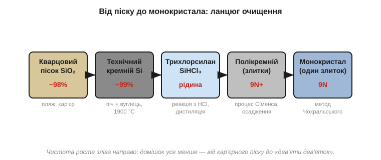
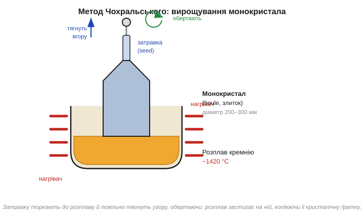
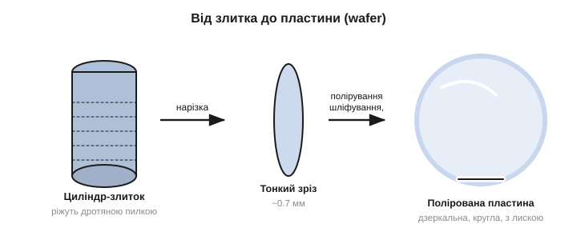

# Кремній: від кварцового піску до монокристала

Почнімо з найнесподіванішого факту в усій електроніці: основа кожного процесора, кожного мікроконтролера, кожної мікросхеми пам'яті — це **пісок**. Точніше, кремній, добутий із кварцового піску, найпоширенішої після кисню речовини в земній корі. Сировина буквально лежить під ногами й коштує копійки. Уся складність — і вся вартість — у тому, щоб довести цей пісок до стану, який потрібен електроніці: майже ідеально чистого, з атомами, вишикуваними в один бездоганний кристал. Розберімо цей шлях, бо він задає тон усьому розділу: виробництво чіпів — це передусім **боротьба за чистоту й порядок** на атомному рівні.

### Чому саме кремній

Перше питання — чому взагалі кремній (*silicon*, Si)? Тому що кремній — [напівпровідник](book:physics/semiconductor), тобто речовина, що сидить рівно посередині між провідником і ізолятором, і — головне — його провідністю можна **керувати**, додаючи мікроскопічні домішки ([легування](book:physics/doping)). Саме ця керованість робить можливими і [діод](book:physics/pn-junction), і [транзистор](book:electronics/field-control). Германій, з якого складали перші транзистори, цю властивість теж має, але кремнію пощастило з кількома дрібницями, що виявилися вирішальними.

Найголовніша з них — **оксид**. Природний оксид кремнію (SiO₂ — той самий кварц, скло, пісок) — чудовий, стабільний **ізолятор**, який легко виростити прямо на поверхні кристала, просто нагрівши його в кисні. Германій такого подарунка не має: його оксид нестійкий, розчинний у воді й непридатний. А вся планарна технологія, [на якій будують структуру чіпа](book:electronics/doping-etching-metal), тримається саме на тому, що ізолятор можна вирощувати локально на поверхні й використовувати і як [підзатворний діелектрик транзистора](book:electronics/mosfet-structure), і як маску, і як захист. Друга перевага — кремній витримує вищі температури, ніж германій, не «розпливаючись», а виробництво вимагає нагрівів до сотень градусів. Третя — він **дешевий і всюдисущий**: після кисню це найпоширеніший елемент земної кори, тоді як германій рідкісний. Складіть усе — і стане ясно, чому кремній переміг: не тому, що він найкращий напівпровідник за чистою фізикою (за рухливістю носіїв його перевершують і германій, і арсенід галію), а тому, що він **найзручніший у масовому виробництві**. Це повторюваний урок усього розділу: перемагає не теоретично найкраще, а технологічно найпридатніше.

### Ланцюг очищення

Між піском і чіпом лежить ціла низка хімічних перетворень, кожне з яких прибирає чергову порцію домішок.


*Рис. Шлях від піску до монокристала. Кварцовий пісок (SiO₂, чистота ~98%) у дуговій печі з вуглецем відновлюють до **технічного кремнію** (~99%). Його перетворюють на леткий **трихлорсилан** (SiHCl₃) і ретельно дистилюють — саме тут відсікаються домішки. Очищений газ осаджують назад у твердий **полікремній** дуже високої чистоти. І нарешті з нього вирощують **єдиний монокристал**. Чистота росте зліва направо: від кар'єрного піску до «дев'яти дев'яток».*

Простежмо логіку цього ланцюга, бо вона повчальна. Спершу пісок **відновлюють** — у величезній дуговій печі при майже 2000 °C вуглець відбирає в SiO₂ кисень, лишаючи металічний кремній. Та цей «технічний» кремній (його так і звуть — *metallurgical-grade*) для електроніки безнадійно брудний: ~99% чистоти означає цілий відсоток чужих атомів, а це астрономічно багато. Наскільки багато — стане видно зі строгої міри чистоти трохи нижче; поки досить інтуїції, що для напівпровідника відсоток домішки — це катастрофа.

Прямо очистити твердий кремній до потрібного рівня неможливо — домішки сидять у ньому надто міцно. Тому хитрість наступного кроку — обхідна: кремній переводять у **рідку леткий сполуку** (трихлорсилан, SiHCl₃), яку вже можна **дистилювати**, як спирт. Сенс у тому, що різні речовини киплять за різних температур, тож, багаторазово випаровуючи й конденсуючи трихлорсилан, домішки відсікають одну за одною — рівно так, як перегонка розділяє суміш рідин. Це і є місце, де народжується чистота: не в печі, а в дистиляційній колоні. Уже очищений газ тоді **розкладають назад** на твердий кремній: у реакторі (так званий процес Сіменса) гарячі стрижні «обростають» чистим кремнієм, що осідає з газу шар за шаром, — виходять палички **полікремнію** (*polysilicon*), сировина вже електронної чистоти.

Та є нюанс, який і веде нас до наступного кроку. «Полі-» означає, що цей кремній складається з безлічі дрібних кристаликів, зрослих в усіх напрямках абияк — як купа піщинок, спечених докупи. Чистота вже є, а от **порядку** немає. А чому порядок узагалі важливий? Бо на межах між кристаликами (їх звуть **зернами**) ґратка обривається, і там електрони розсіюються й застрягають — поведінка напівпровідника на таких межах непередбачувана. Транзистор же завтовшки в десятки атомів не терпить, щоб посеред його каналу проходила границя зерна. Йому потрібен **єдиний** кристал з нерозривною ґраткою — а отже, потрібен ще один крок.

### Що означає «чистота 9N»

Слово «чистий» в електроніці має дуже конкретну міру, і вона вражає.


*Рис. Чистоту записують числом «дев'яток» (nines). **2N** (99%) — технічний кремній: один чужий атом на сто. **6N** (99.9999%) — «сонячний», для фотопанелей: один на мільйон. **9N** (99.9999999%) — електронний: один чужий атом на **мільярд** кремнієвих. Кожен крок очищення прибирає домішки на порядки; електроніці потрібен крайній рівень.*

Закарбуймо цей масштаб, бо він пояснює всю дорожнечу процесу. «Дев'ять дев'яток» — це **один сторонній атом на мільярд** атомів кремнію. Уявіть стадіон, заповнений людьми, і помножте його населення в мільйони разів — і серед усього цього натовпу має бути лише кілька «чужих». Чому така параноя? Бо [легування](book:physics/doping) — це додавання домішки в концентрації якраз порядку «кілька атомів на мільйон-мільярд». Якщо вихідний кремній уже забруднений на цьому рівні **неконтрольовано**, то контрольоване легування втрачає сенс: ви не знатимете, скільки насправді носіїв у вашому напівпровіднику, і транзистори поводитимуться як заманеться. Чистота тут — не перфекціонізм, а передумова самої керованості, на якій тримається вся електроніка.

### Метод Чохральського: один кристал

Полікремній уже чистий, але «зернистий» — безліч дрібних кристаликів. А транзистор хоче рости в **ідеально впорядкованій** ґратці, єдиній на всю пластину. Як виростити **один** кристал розміром із відро? Відповідь знайшов 1916 року польський хімік **Ян Чохральський** (*Jan Czochralski*) — і, що характерно, знайшов випадково: за легендою, замислившись, він умочив перо не в чорнильницю, а в тигель із розплавленим металом, висмикнув — і за пером потяглася тонка застигла нитка-монокристал. Метод, названий його іменем, і досі лежить в основі виробництва кремнію.


*Рис. Полікремній розплавляють у тиглі (~1420 °C). До поверхні розплаву торкаються маленькою **затравкою** (seed) — шматочком кремнію з потрібною орієнтацією ґратки. Затравку повільно **тягнуть угору**, водночас **обертаючи**. Розплав застигає на ній, атом за атомом копіюючи її кристалічну структуру, — і за затравкою росте суцільний монокристал (boule, злиток) діаметром 200–300 мм.*

Осягніть, наскільки це елегантно. Розплавлений кремній — це хаос вільних атомів. Затравка дає їм **зразок для наслідування**: кожен атом, що пристає до фронту кристалізації (тонкого шару на межі розплаву й твердого), стає на «правильне» місце за прикладом сусідів, продовжуючи ту саму ґратку. Виходить, увесь майбутній злиток «успадковує» орієнтацію однієї маленької затравки — тому її кристалографічний напрямок обирають заздалегідь, і він задає орієнтацію всіх майбутніх пластин. Повільно витягуючи затравку, ми ніби «намотуємо» на неї дедалі довший монокристал.

Тонкощів тут чимало, і кожна важлива. Швидкість витягування й температуру тримають у дуже вузьких межах: трохи швидше — і ґратка не встигає копіюватися рівно, з'являються дефекти; трохи повільніше — і злиток роздувається. На самому початку затравку навмисно тягнуть **швидко**, утоншуючи кристал до вузької «шийки», — цей прийом виганяє з кристала успадковані від затравки дефекти, бо вони «висипаються» на тонкому перешийку й не йдуть далі в тіло злитка. Лише потім швидкість зменшують, і кристал розростається до повного діаметра. Обертання тигля й кристала усереднює неминучі неоднорідності розплаву й температури, щоб злиток вийшов рівним і однаковим по всьому перерізу. Так за кілька десятків годин виростає циліндр — **злиток** (*ingot*, *boule*) — багатокілограмовий, дзеркально-сірий, і весь він — **один кристал** з єдиною нерозривною ґраткою від краю до краю. Тут же, на стадії розплаву, у кремній часто вводять і первинне [легування](book:physics/doping), кидаючи в тигель точно відважену дрібку домішки, — так весь злиток рівномірно «підфарбовують» у слабкий n- чи p-тип, що стане підкладкою майбутніх транзисторів.

### Від злитка до пластини

Злиток — це ще не те, на чому роблять чіпи. Його треба перетворити на тонкі круглі **пластини** (*wafer*) — ті самі блискучі диски, що стали символом мікроелектроніки.


*Рис. Циліндричний злиток ріжуть тонкою дротяною пилкою на зрізи завтовшки ~0.7 мм — майбутні пластини. Кожен зріз шліфують і **полірують** до дзеркального, атомарно-гладенького стану. На краю роблять зріз (flat) або виїмку (notch) — позначку орієнтації ґратки. Виходить кругла полірована пластина, на якій далі друкуватимуть схеми.*

Логіка останніх кроків проста, але вимоглива. Злиток **нарізають** надтонкою дротяною пилкою на сотні зрізів — кожен стане окремою пластиною. Помітна частина дорогого кремнію при цьому буквально йде в тирсу (пропил завширшки з саму пластину), і з цим мовчки миряться — інакше тонких рівних зрізів не дістати. Та поверхня після різання шорстка й пошкоджена, а майбутні транзистори завтовшки в нанометри не терплять і найменшої нерівності, тож пластини **шліфують і полірують** (механічно й хімічно), доки вони не стають гладенькими на **атомному** рівні й дзеркальними — настільки, що в них можна дивитися, як у люстро. Невеличкий зріз (flat) чи виїмка (notch) на краю — не прикраса, а **позначка орієнтації** кристалічної ґратки: за нею обладнання точно знає, як пластина повернута, що критично, бо кристал має напрямки, уздовж яких його легше травити чи розколювати.

Чому ж пластини роблять дедалі більшими? Бо обробка йде **цілою пластиною за раз** — багато кроків (печі, осадження, травлення, а почасти й друк) обробляють увесь диск одним заходом, і їхня вартість слабо залежить від того, велика пластина чи мала. Отже, що більша пластина, то більше чіпів виходить за ту саму обробку, і то дешевший кожен. Саме тому індустрія десятиліттями нарощувала діаметр — від перших пластин у кілька сантиметрів до сьогоднішнього стандарту 300 мм (12 дюймів). Наступний логічний крок до 450 мм, утім, забуксував: вигода від більшого диска не покрила страшної ціни нового покоління обладнання, тож перехід поки відклали — рідкісний випадок, коли економіка масштабу спіткнулася. Скільки ж чіпів дає одна пластина — питання не риторичне, а грошове, тож оцінімо його прямо.

**Приклад (скільки кристалів на пластині).** Пластина діаметром 300 мм; кристал процесора — квадрат 10 мм × 10 мм. Грубо оцінимо, скільки кристалів поміститься.

```
Площа пластини:     S = π·r²  = 3.14 × (150 мм)²  ≈ 70 700 мм²
Площа кристала:     A = 10 × 10                    =     100 мм²
Наївна оцінка:      N ≈ S / A = 70 700 / 100       ≈     707 шт.
Поправка на край:   круглий диск ↔ квадратні кристали — по краю
                    кристали «не влазять» цілими, втрата ~10–15%
Реально:            N ≈ 600 кристалів
```

Сімсот складних процесорів з одного диска кремнію — ось чому окремий чіп може коштувати недорого, попри захмарну вартість заводу: витрати розмазуються на сотні штук із кожної пластини, а пластин — потік. Зверніть увагу й на **поправку на край**: круглий диск погано б'ється на квадрати, і частина периферії пропадає — це той самий «геометричний податок» на круглу форму, що дається взнаки і при підрахунку [придатних кристалів](book:electronics/yield). На цій-от полірованій круглій пластині — чистій, упорядкованій, дзеркальній — і розгортається вся подальша магія виготовлення чіпів.

> 🔧 **Навіщо це.** Здавалося б, де ви — і де вирощування кристалів. Та ця стадія пояснює базові факти, з якими ви стикаєтесь постійно. Перше: **кремнієва підкладка — це монокристал надвисокої чистоти**, і саме тому «сире» виробництво напівпровідників таке дороге й зосереджене в кількох країнах; ціна вашого чипа починається тут. Друге: **пластини круглі, а кристали чипів прямокутні** — звідси неминучі втрати по краях круга й сама ідея «скільки чіпів влізе на пластину», що прямо впливає на [собівартість і вихід придатних](book:electronics/yield). Третє, концептуальне: уся електроніка тримається на **контрольованій чистоті** — один зайвий атом на мільярд псує гру; це підкаже вам, чому навіть мікроскопічне забруднення на будь-якому етапі фатальне (а саме тому виробництво й виносять у [надчисті кімнати](book:electronics/photolithography)). Тримайте в голові образ: ваш процесор виріс із піску, який спершу зробили чистішим за будь-що у природі, а тоді вишикували в один бездоганний кристал.
