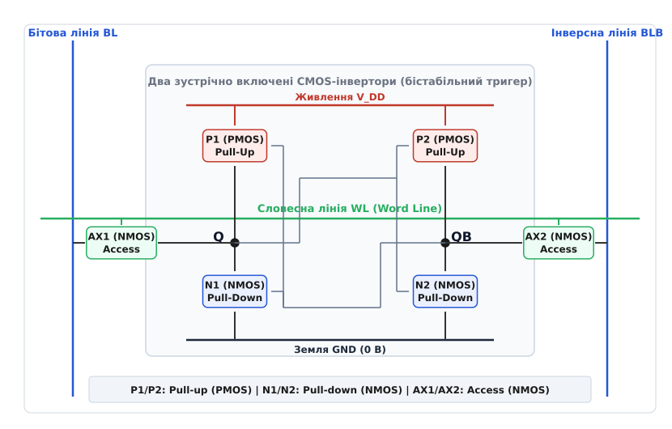
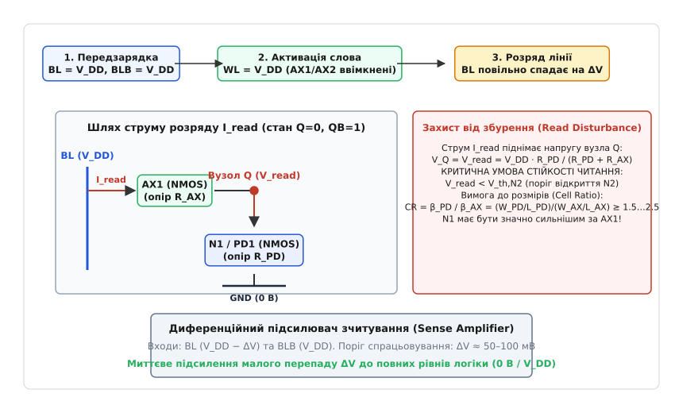
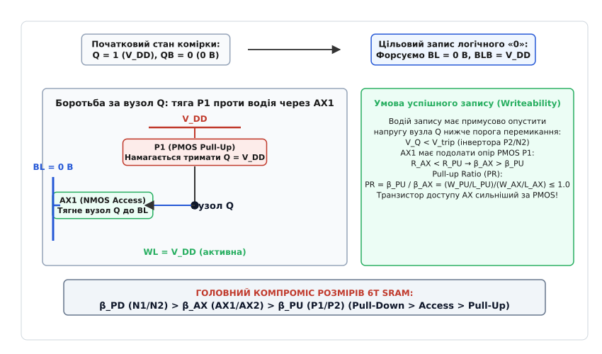
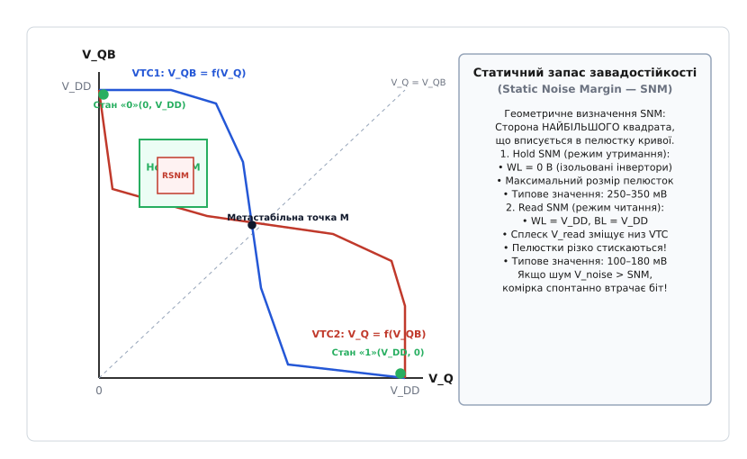
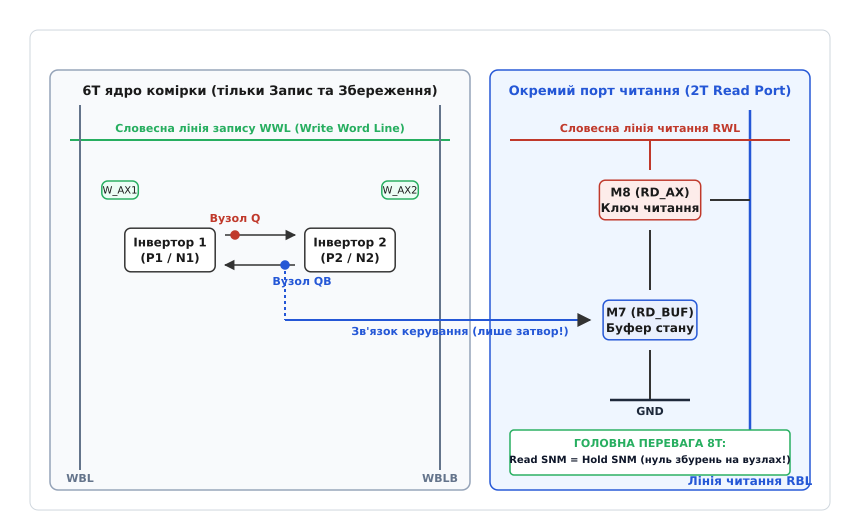

# SRAM-комірка: бістабільний тригер і фізика надшвидкої пам'яті

<preknowlist>
- [CMOS-пара та інвертор](book:electronics/cmos) — комплементарне поєднання NMOS і PMOS, стан відсутності наскрізного струму в спокої.
- [Порогова напруга MOSFET](book:electronics/mosfet-threshold) — умови формування провідного каналу та підпорогові струми витоку.
- [NMOS і PMOS](book:electronics/nmos-pmos) — провідність сильного нуля та сильної одиниці.
- [DRAM-комірка](book:electronics/dram-cell) — відмінність динамічного конденсаторного збереження від активного статичного тригера.
</preknowlist>

Процесорному ядру, що виконує кілька інструкцій за один гігагерцовий такт, потрібна пам'ять, яка здатна віддати або прийняти машинне слово за частки наносекунди. [Динамічна пам'ять DRAM](book:electronics/dram-cell) із її періодичною регенерацією та необхідністю перезаряджати мікроскопічний конденсатор через довгу шину для цього надто повільна: час очікування відповіді сягає 50–70 наносекунд. Процесору потрібна пам'ять, що живе на тому ж кристалі кремнію, працює синхронно з регістрами й тримає інформацію безперервно, без потреби освіжати біти.

Цю задачу вирішує комірка статичної оперативної пам'яті — **SRAM** (*Static Random-Access Memory*; *static*, лат. через грец. *statikos* — «той, що стоїть на місці», бо стан біта зафіксований активним зворотним зв'язком, на противагу динамічному заряду конденсатора). Замість накопичення заряду вона використовує активний бістабільний тригер на комплементарних транзисторах. Проте підключення внутрішніх вузлів тригера до зовнішнього світу створює складну інженерну проблему: як прочитати збережене значення через спільну лінію без ризику випадково перекинути тригер і як гарантовано перезаписати його новим значенням за один короткий імпульс.

### Бістабільність: як два інвертори тримають одне одного

Фундаментом статичної пам'яті є кільце з двох взаємно замкнених [CMOS-інверторів](book:electronics/cmos). Вхід першого інвертора з'єднаний з виходом другого, а вхід другого — з виходом першого.

Простежимо, чому ця замкнена пара має рівно два стійкі стани рівноваги:
- **Стан «0» у вузлі Q:** якщо напруга на вузлі `Q` дорівнює 0 В (земля), цей нуль надходить на затвори другого інвертора. Верхній PMOS-транзистор другого інвертора відкривається, а нижній NMOS закривається. У результаті вихід другого інвертора — вузол `QB` (інверсне значення) — підтягується до напруги живлення `V_DD` (логічна «1»). Ця висока напруга з вузла `QB` надходить на затвори першого інвертора, відкриваючи його нижній NMOS і надійно саджаючи вузол `Q` на землю. Коло замкнулося: нуль на `Q` підтримує одиницю на `QB`, а одиниця на `QB` підтримує нуль на `Q`.
- **Стан «1» у вузлі Q:** дзеркальна ситуація. Якщо на вузлі `Q` встановлено напругу `V_DD`, нижній NMOS другого інвертора відкритий і притягує вузол `QB` до 0 В. Нуль на `QB` відкриває верхній PMOS першого інвертора, утримуючи вузол `Q` на рівні `V_DD`.

У будь-якому з цих двох станів один транзистор кожного інвертора повністю відкритий, а другий надійно закритий. Немає прямого наскрізного шляху від лінії живлення до землі, а логічні рівні надійно притиснуті до рейок живлення (0 В або `V_DD`).

Існує також третій, теоретичний стан, коли напруги на обох вузлах однакові й дорівнюють половині живлення (`V_Q = V_QB = V_DD / 2`). Це стан **метастабільності** (*metastability*; лат. *meta* — «за, посеред» та *stabilis* — «стійкий»). Він подібний до кулі, ідеально збалансованої на вістрі голки: будь-який тепловий шум або найменша флуктуація напруги в частку мілівольта виводить систему з рівноваги, і регенеративний позитивний зворотний зв'язок миттєво скочує схему в один із двох стійких станів — «0» або «1».

### Анатомія класичної комірки 6T

Щоб перетворити замкнену пару інверторів на робочу комірку пам'яті, до неї необхідно додати керовані ключі доступу. Так виникає класична **6T SRAM-комірка** (шість транзисторів, *six-transistor cell*), що складається з трьох функціональних пар транзисторів:

1. **Pull-Up транзистори (P1, P2):** два P-канальні MOSFET, підключені витоками до шини живлення `V_DD`. Їхнє завдання — підтягувати відповідний внутрішній вузол до високого потенціалу «1».
2. **Pull-Down транзистори (N1, N2):** два N-канальні MOSFET, підключені витоками до шини землі GND. Їхнє завдання — стягувати відповідний внутрішній вузол до низького потенціалу «0».
3. **Access транзистори (AX1, AX2):** два N-канальні MOSFET, що слугують двонапрямленими ключами доступу. Вони з'єднують внутрішні вузли `Q` та `QB` зі стовпцевими бітовими лініями.

Керування коміркою здійснюється за допомогою ортогональної сітки сигнальних провідників:
- **Словесна лінія WL (*Word Line*):** горизонтальний металевий провідник, що об'єднує затвори обох транзисторів доступу `AX1` та `AX2` для всіх комірок одного рядка масиву. Коли рядок не вибраний, на лінії `WL` утримується 0 В (транзистори доступу закриті, комірка ізольована). Коли до рядка звертаються для читання чи запису, на лінію `WL` подається напруга `V_DD`, відкриваючи канали `AX1` та `AX2`.
- **Бітова пара ліній BL та BLB (*Bit Line* та *Bit Line Bar*):** два вертикальні провідники, спільні для всього стовпця комірок. Лінія `BL` під'єднана до вузла `Q` через `AX1`, а інверсна лінія `BLB` — до вузла `QB` через `AX2`.


*Принципова схема 6T SRAM. Два зустрічні інвертори утворюють бістабільний тригер у вузлах Q та QB. Транзистори доступу AX1 та AX2 відкриваються сигналом словесної лінії WL, підключаючи комірку до диференційної пари бітових ліній BL та BLB.*

Застосування диференційної (комплементарної) пари бітових ліній `BL/BLB` є фундаментальним рішенням. По-перше, зчитування різниці напруг між двома лініями дозволяє повністю придушити синфазні електромагнітні завади (*common-mode noise*), що наводяться на довгі паралельні провідники масиву. По-друге, диференційний сигнал подвоює ефективну амплітуду відгуку, дозволяючи фіксувати стан біта за мінімального зміщення напруги.

### Режим збереження (Hold) та ціна спокою

У режимі збереження стану (*Hold mode*) словесна лінія неактивна: `WL = 0 В`. Обидва транзистори доступу `AX1` та `AX2` замкнені, ізолюючи внутрішні вузли `Q` та `QB` від бітових ліній.

У цьому режимі два зустрічні інвертори живляться від шини `V_DD` і підтримують збережений біт нескінченно довго, поки подається напруга живлення. Оскільки в кожному інверторі один із транзисторів закритий, наскрізного струму провідності немає.

Однак у сучасних нанометрових мікросхемах поняття «транзистор повністю закритий» більше не означає нульовий струм. У режимі спокою через комірку протікають три типи паразитного струму витоку (*leakage current*):
1. **Підпороговий витік (*subthreshold leakage*):** струм дифузії носіїв через канал закритого транзистора при напрузі на затворі, нижчій за порогову. Зі зменшенням товщини каналу та зниженням порогової напруги цей витік зростає експоненційно.
2. **Тунелювання крізь підзатворний діелектрик (*gate oxide tunneling*):** квантовомеханічне просочування електронів крізь надтонкий шар діелектрика затвора товщиною в кілька атомних шарів під дією сильного електричного поля.
3. **Міжзонне тунелювання на p-n переходах (*band-to-band tunneling*):** струм витоку зворотно зміщених діодів між областями стоку/витоку та підкладкою кристала.

Хоча витік однієї комірки вимірюється пікоамперами (`10⁻¹² А`), сучасний процесор містить у кешах L2 та L3 сотні мільйонів комірок. Помножений на таку кількість, сумарний струм спокою становить кілька амперів, генеруючи кілька ватів тепла навіть тоді, коли процесор не виконує жодних обчислень.

Для боротьби зі статичним споживанням застосовують режим глибокого сну зі зниженням напруги живлення масиву до мінімальної межі утримання — **напруги збереження даних** (*Data Retention Voltage — DRV*). При зниженні напруги живлення до величини `V_DD ≈ 0.4 … 0.5 В` струми витоку падають у рази, але бістабільний зворотний зв'язок ще встигає компенсувати паразитно стікаючий заряд, запобігаючи втраті бітів.

### Режим читання (Read): подільник напруги та збурення вузла

Зчитування інформації з 6T SRAM є найскладнішим і найнебезпечнішим процесом, під час якого комірка балансує на межі спонтанної втрати збереженого стану.

Простежмо послідовність дій під час циклу читання:

**Крок 1: Передзарядка бітових ліній (*Precharge*).**
Перед початком звернення спеціальні потужні транзистори передзарядки у верхній частині стовпця примусово заряджають обидві бітові лінії `BL` та `BLB` до напруги живлення `V_DD`. Після вирівнювання потенціалів драйвери передзарядки вимикаються, і довгі бітові лінії залишаються «висіти» в плаваючому стані під високим потенціалом `V_DD` завдяки своїй великій паразитній ємності `C_BL`.

**Крок 2: Активація словесної лінії (*Word Line Assert*).**
Напруга на лінії `WL` вибраного рядка піднімається від 0 В до `V_DD`. Транзистори доступу `AX1` та `AX2` відмикаються.

**Крок 3: Формування струму розряду.**
Припустимо, комірка зберігає `Q = 0` (0 В) та `QB = 1` (`V_DD`).
- З боку вузла `QB` напруга дорівнює `V_DD`, і лінія `BLB` також заряджена до `V_DD`. Різниця потенціалів між ними дорівнює нулю, тому струм через транзистор `AX2` не тече, і лінія `BLB` залишається на рівні `V_DD`.
- З боку вузла `Q` напруга дорівнює 0 В, тоді як лінія `BL` заряджена до `V_DD`. Виникає різниця потенціалів, і струм зчитування `I_read` починає текти з лінії `BL` крізь транзистор доступу `AX1` та відкритий транзистор стягування `N1` на землю GND.


*Динаміка читання. Струм розряду I_read тече з передзарядженої лінії BL через транзистори AX1 та N1 на землю. Подільник напруги викликає небезпечний сплеск V_read у вузлі Q. Sense Amplifier фіксує малий перепад ΔV між BL та BLB.*

**Крок 4: Феномен збурення читання (*Read Disturbance*).**
Поки струм `I_read` розряджає ємність лінії `BL`, транзистори `AX1` та `N1` утворюють резистивний подільник напруги між високим рівнем `BL` (`V_DD`) та землею GND (0 В).

Унаслідок падіння напруги на внутрішньому опорі транзистора `N1` потенціал внутрішнього вузла `Q` миттєво підскакує вище нуля до деякого значення `V_read`:

```
V_read = V_DD · R_N1 ÷ (R_N1 + R_AX1)          [сплеск напруги в нульовому вузлі]
```

Ось де криється головна небезпека! Вузол `Q` безпосередньо з'єднаний із затвором транзистора `N2` протилежного інвертора. Якщо сплеск напруги `V_read` перевищить [порогову напругу](book:electronics/mosfet-threshold) відкриття транзистора `N2` (`V_read ≥ V_th,N2`), транзистор `N2` почне відкриватися і потягне напругу вузла `QB` вниз від `V_DD` до землі. Це негайно відкриє транзистор `P1`, який почне ще сильніше підтягувати вузол `Q` до `V_DD`. Увімкнеться регенеративна лавина позитивного зворотного зв'язку, і збережений нуль у вузлі `Q` перетвориться на одиницю — **комірка незворотно зітре власні дані під час спроби їх прочитати**.

### Стійкість читання та коефіцієнт комірки (Cell Ratio)

Щоб запобігти руйнуванню даних при читанні, сплеск напруги `V_read` повинен бути гарантовано меншим за порогову напругу протилежного транзистора з урахуванням усіх можливих шумів:

```
V_read < V_th,N2                               [умова збереження стійкості читання]
```

З аналізу подільника напруги випливає, що опір транзистора стягування `N1` у відкритому стані має бути значно меншим за опір транзистора доступу `AX1` (`R_N1 ≪ R_AX1`). Оскільки провідність відкритого каналу пропорційна коефіцієнту крутизни `β = μ · C_ox · (W / L)`, це накладає сувору вимогу на геометричні розміри транзисторів.

Вводиться безрозмірний параметр — **коефіцієнт комірки** (*Cell Ratio — CR*, або *β-ratio*):

```
CR = β_PD ÷ β_AX = (W_PD / L_PD) ÷ (W_AX / L_AX) [визначення Cell Ratio]
```

де `W_PD` та `L_PD` — ширина й довжина каналу pull-down транзисторів `N1/N2`, а `W_AX` та `L_AX` — ширина й довжина транзисторів доступу `AX1/AX2`.

Щоб сплеск `V_read` не перевищував безпечної межі (зазвичай `V_read ≤ 0.15 … 0.20 В` при живленні 1.0 В), коефіцієнт комірки проектують у межах:

```
CR = 1.5 … 2.5                                 [інженерне співвідношення для 6T]
```

Це означає, що стягувальний транзистор `N1` має бути у півтора-два з половиною рази ширшим і «сильнішим» за транзистор доступу `AX1`. Детальний математичний вивід граничного значення `CR` через рівняння насичення та лінійного режиму транзисторів наведено в [математичному аналізі запасу завадостійкості](book:electronics/sram-cell/math-sram-snm.md).

### Диференційний підсилювач зчитування (Sense Amplifier)

Паразитна ємність бітової лінії `C_BL`, до якої підключені сотні комірок одного стовпця, є гігантською порівняно з крихітними транзисторами самої комірки. Струм розряду `I_read` становить лише кілька десятків мікроамперів. Якби ми чекали, поки цей слабкий струм повністю розрядить лінію `BL` від напруги `V_DD` до нуля (повний логічний перепад `0 В`), операція читання тривала б кілька наносекунд і витрачала б колосальну енергію на щотактовий перезаряд ліній стовпця.

Тому 6T SRAM використовує стробований **диференційний підсилювач зчитування** (*Sense Amplifier — SA*).

Підсилювач зчитування — це чутливий аналоговий компаратор, побудований на власному швидкому симетричному тригері. Він підключається між лініями `BL` та `BLB` у нижній частині стовпця.

Робота підсилювача відбувається у три фази:
1. **Фаза накопичення дельти:** транзистор `AX1` починає розряджати лінію `BL`. Напруга на `BL` плавно падає, тоді як на `BLB` залишається строго рівною `V_DD`.
2. **Фаза стробування (*Sensing*):** щойно різниця напруг між лініями досягає крихітного порога `ΔV = V_BLB − V_BL ≈ 50 … 100 мВ` (що становить лише 5–10% від повної напруги живлення), контролер пам'яті подає швидкий тактовий імпульс стробування `Sense Enable (SE)`.
3. **Регенеративне підсилення:** підсилювач зчитування вмикає свій внутрішній позитивний зворотний зв'язок і за лічені пікосекунди розганяє малий вхідний перепад `ΔV` до повного цифрового розмаху логічних рівнів: лінія `BL` миттєво фіксується як «0» (0 В), а `BLB` — як «1» (`V_DD`).

Після фіксації результату словесна лінія `WL` негайно вимикається, відсікаючи комірку від бітових ліній. Завдяки підсилювачу зчитування комірці не потрібно розряджати довгу шину до кінця. Це скорочує час зчитування в 5–10 разів і на порядок зменшує динамічне енергоспоживання масиву пам'яті.

### Режим запису (Write): примусове пересилення та Pull-up Ratio

Якщо під час читання головною метою є захист внутрішнього стану від зовнішнього впливу, то в режимі запису (*Write mode*) мета діаметрально протилежна: зовнішній сигнал повинен легко й беззаперечно подолати внутрішній стан тригера та примусово перемкнути його.

Розглянемо процес запису логічного «0» у вузол `Q`, коли там попередньо зберігалася «1» (`Q = V_DD`, `QB = 0 В`):

**Крок 1: Форсування рівнів водіями запису (*Write Drivers*).**
Спеціальні потужні вихідні буфери запису на кінцях стовпця примусово притискають лінію `BL` до землі (`BL = 0 В`), а лінію `BLB` — до напруги живлення (`BLB = V_DD`).

**Крок 2: Активація словесної лінії.**
Лінія `WL` піднімається до `V_DD`, відкриваючи транзистори доступу `AX1` та `AX2`.

**Крок 3: Бій за внутрішній вузол Q.**
У вузлі `Q` стикаються дві протилежні сили:
- Внутрішній транзистор підтяжки `P1` (PMOS) повністю відкритий і намагається втримати потенціал вузла `Q` на рівні `V_DD`.
- Зовнішній водій запису через відкритий транзистор доступу `AX1` (NMOS) тягне вузол `Q` вниз до нульового потенціалу лінії `BL` (`0 В`).


*Механізм запису. Водій запису садить лінію BL на землю. Транзистор доступу AX1 пересилює опір PMOS-транзистора P1 і опускає вузол Q нижче порога перемикання V_trip, викликаючи регенеративне перекидання стану.*

Чому ми завжди записуємо новий стан, стягуючи одиничний вузол до нуля, а не піднімаючи нульовий вузол до одиниці? [N-канальний транзистор доступу чудово передає нуль](book:electronics/nmos-pmos), саджаючи витік майже до нульового потенціалу лінії `BL`. Але він украй неефективно передає одиницю: при спробі подати високу напругу напруга на витоку обмежується пороговим падінням `V_DD − V_th,AX`, через що транзистор доступу закривається ще до того, як вузол зарядиться до повного рівня. Тому запис у 6T SRAM **завжди** здійснюється шляхом примусового «пробивання» високого вузла до нуля через транзистор доступу.

**Крок 4: Перемикання через точку спрацьовування (*Trip Point*).**
Щоб запис став незворотним, транзистор `AX1` повинен зуміти опустити напругу вузла `Q` нижче напруги спрацьовування другого інвертора:

```
V_Q < V_trip ≈ ½ · V_DD                        [умова незворотного запису]
```

Щойно напруга `V_Q` опускається нижче `V_trip`, транзистор `P2` відмикається, а `N2` замикається. Вузол `QB` починає стрімко підніматися до `V_DD`. Це закриває транзистор `P1` і відкриває `N1`, який тепер уже сам притягує вузол `Q` до землі. Тригер перекинувся: у вузлі `Q` надійно зафіксовано «0», а у вузлі `QB` — «1».

#### Коефіцієнт підтяжки (Pull-up Ratio)

Для забезпечення легкого запису транзистор доступу `AX1` повинен бути сильнішим за транзистор підтяжки `P1` (`R_AX1 < R_P1`).

Співвідношення їхньої крутизни визначає **коефіцієнт підтяжки** (*Pull-up Ratio — PR*):

```
PR = β_PU ÷ β_AX = (W_PU / L_PU) ÷ (W_AX / L_AX) [визначення Pull-up Ratio]
```

де `W_PU` та `L_PU` — розміри PMOS-транзисторів підтяжки `P1/P2`.

Щоб запис проходив надійно за найгірших умов розкиду технологічних параметрів, коефіцієнт підтяжки обмежують зверху:

```
PR ≤ 0.8 … 1.0                                 [вимога для успішного запису]
```

Тобто транзистор доступу `AX1` повинен мати вищу провідність, ніж внутрішній PMOS-транзистор `P1`.

### Головний компроміс розмірів транзисторів

Зіставлення вимог режимів читання та запису виявляє фундаментальний архітектурний конфлікт розмірів у класичній 6T SRAM-комірці:

1. **Вимога стійкості читання (Read Stability):** транзистор доступу `AX` повинен бути значно **слабшим** за pull-down транзистор `PD` (`β_PD > β_AX`), щоб сплеск напруги `V_read` не зруйнував збережений біт.
2. **Вимога надійності запису (Writeability):** транзистор доступу `AX` повинен бути значно **сильнішим** за pull-up транзистор `PU` (`β_AX > β_PU`), щоб водій запису міг легко пробити PMOS-підтяжку.
3. **Вимога мінімальної площі та енергоспоживання:** усі шість транзисторів повинні мати якомога меншу площу, щоб на кристалі площею в кілька десятків квадратних міліметрів можна було розмістити десятки мегабайтів пам'яті.

Поєднуючи обидві нерівності, отримуємо **золоту ієрархію крутизни транзисторів 6T SRAM**:

```
β_PD > β_AX > β_PU                             [ієрархія крутизни: PD > AX > PU]
```

Це означає, що в кремнії:
- Найширшими та найпотужнішими є N-канальні транзистори стягування `PD` (N1, N2);
- Середніми за силою є N-канальні транзистори доступу `AX` (AX1, AX2);
- Найвужчими та найслабшими є P-канальні транзистори підтяжки `PU` (P1, P2). До того ж рухливість дірок у кремнії в 2–3 рази нижча за рухливість електронів (`μ_p < μ_n`), що природно робить PMOS слабшим за ідентичних геометричних розмірів.

У сучасних FinFET-техпроцесах (від 16 нм до 3 нм) ширина каналу більше не є неперервною величиною: вона квантується дискретною кількістю кремнієвих ребер (*fins*). Класична FinFET 6T SRAM-комірка конфігурується у співвідношенні плавців `1-1-1` (найкомпактніша комірка: 1 плавець на кожен транзистор, а різниця крутизни забезпечується різницею довжин каналу та мобільністю носіїв) або `2-1-1` (2 плавці на `PD`, 1 плавець на `AX`, 1 плавець на `PU`), що гарантує максимальний запас стійкості.

### Статичний запас завадостійкості (SNM) та метеликова крива

Щоб оцінити стійкість комірки кількісно, використовують метрику **статичного запасу завадостійкості** (*Static Noise Margin — SNM*). Вона визначає максимальну амплітуду напруги постійної завади `V_noise`, яку можна прикласти до внутрішнього вузла без зміни збереженого логічного стану.

Графічним інструментом аналізу SNM є **метеликова крива** (*Butterfly Curve*). Її будують шляхом накладання передавальних характеристик напруги (*VTC*) обох інверторів на спільну площину `(V_Q, V_QB)`.


*Метеликова крива. Перетин характеристик двох інверторів утворює дві стійкі пелюстки. Сторона найбільшого вписаного квадрата дорівнює статичному запасу завадостійкості SNM. У режимі читання (Read SNM) пелюстки стискаються через підйом напруги V_read.*

Геометрично величина `SNM` дорівнює **довжині сторони найбільшого квадрата**, який можна вписати всередину меншої пелюстки метеликової кривої.

Розрізняють три критичні модифікації запасу завадостійкості:

1. **Hold SNM (HSNM) — запас у режимі збереження:** словесна лінія закрита (`WL = 0 В`). Інвертори повністю ізольовані від бітових ліній. Пелюстки метелика мають максимальну площу, а величина `HSNM` зазвичай становить `250 … 350 мВ` при напрузі живлення 1.0 В.
2. **Read SNM (RSNM) — запас у режимі читання:** словесна лінія активна (`WL = V_DD`), а бітові лінії заряджені до `V_DD`. Через появу сплеску `V_read` у нульовому вузлі нижній лівий кут характеристики інвертора зміщується вгору. Пелюстки метелика суттєво деформуються і стискаються. Величина `RSNM` падає до `100 … 180 мВ`. **Режим читання є найбільш вразливим моментом життя 6T SRAM**: якщо завада перевищить `RSNM`, біт буде миттєво знищено.
3. **Write Margin (WM) — запас надійності запису:** вимірює, наскільки легко комірка перемикається при форсуванні бітових ліній. У режимі запису одна з пелюсток метелика має повністю зникнути, гарантуючи безальтернативне скочування схеми в новий стан.

Повний математичний апарат методу Сівінка для повороту координат на 45° та аналітичного розрахунку максимального вписаного квадрата викладено в [математичній вставці до теми](book:electronics/sram-cell/math-sram-snm.md).

### Технологічна варіативність і межа Vmin

Зі зменшенням розмірів транзисторів до нанометрових масштабів проявилися фундаментальні фізичні обмеження, пов'язані з атомарною структурою речовини:

- **Випадкова флуктуація кількості домішок (*Random Dopant Fluctuation — RDF*):** у каналі нанометрового транзистора міститься лише кілька десятків атомів легуючої домішки. Випадкова різниця навіть у 3–5 атомів між лівим і правим транзисторами однієї комірки викликає асиметрію їхніх порогових напруг `V_th`.
- **Шорсткість країв ліній (*Line-Edge Roughness — LER*):** неідеальність фотолітографії призводить до мікроскопічних коливань довжини та ширини каналу.

Згідно із **законом Пелгрома** (*Pelgrom's Law*), середньоквадратичне відхилення порогової напруги транзистора `σ_Vth` обернено пропорційне кореню з площі його каналу:

```
σ_Vth = A_VT ÷ √(W · L)                       [закон Пелгрома]
```

Оскільки транзистори SRAM проектують із мінімально можливими розмірами `W` та `L` заради щільності пакування, саме вони мають найбільший технологічний розкид параметрів на кристалі.

У масиві пам'яті на 64 МБ міститься понад 500 мільйонів комірок. За нормального гауссового розподілу параметрів серед них неминуче виявляться статистичні викиди з відхиленням у `5σ … 6σ`. В одній такій комірці транзистор `PD` виявиться випадково слабшим за норму, а транзистор `AX` — сильнішим. Під час читання сплеск `V_read` у цій комірці перевищить занижений поріг `V_th,N2`, і вона перекинеться.

При зниженні напруги живлення `V_DD` середній запас `RSNM` лінійно зменшується, тоді як статистичний розкид `σ_Vth` залишається постійним. Напруга, за якої найгірша комірка масиву втрачає працездатність, називається **апаратним бар'єром мінімальної напруги** — **Vmin Wall** (зазвичай `V_min ≈ 0.65 … 0.75 В` для класичної 6T). Опустити напругу живлення 6T SRAM нижче цієї межі без спеціальних заходів неможливо.

### Схеми допомоги запису та читанню (Assist Circuits)

Щоб розширити робочий діапазон напруг і підвищити вихід придатних кристалів (*yield*), сучасні контролери пам'яті використовують динамічні допоміжні схеми (*Assist Circuits*):

1. **Зниження напруги слова при читанні (*Wordline Under-Drive — WLUD*):** під час читання на лінію `WL` подають напругу, трохи нижчу за живлення (`V_WL = V_DD − 100 мВ`). Це пригнічує провідність транзисторів доступу `AX`, зменшуючи струм `I_read` і сплеск `V_read`, що радикально підвищує `Read SNM`.
2. **Негативна напруга бітової лінії при записі (*Negative Bitline — NBL*):** під час запису лінію `BL` примусово опускають нижче нуля (`V_BL = −100 … −150 мВ`). Це штучно збільшує напругу затвор-витік транзистора `AX1` (`V_gs = V_DD − (−V_BL) > V_DD`), різко посилюючи його здатність пробити внутрішню PMOS-підтяжку навіть за низької напруги живлення.
3. **Зниження живлення комірки при записі (*Vdd Collapse*):** на короткий час запису шину живлення `V_DD` вибраного стовпця злегка просаджують, послаблюючи PMOS-транзистори `P1/P2` і полегшуючи перемикання тригера.

### Архітектура 8T SRAM: ізоляція порту читання

Для мікросхем із наднизьким енергоспоживанням (процесори Інтернету речей, імплантована медична електроніка, сенсорні вузли), які повинні працювати від напруг `0.4 … 0.6 В` (поблизу [порога відкриття транзистора](book:electronics/mosfet-threshold)), класична комірка 6T непридатна через колапс `Read SNM`.

Радикальним розв'язанням цієї проблеми стала **архітектура 8T SRAM** (вісім транзисторів).

Головна ідея 8T полягає в повному фізичному розділенні шляхів запису та читання:
- **Шеститранзисторне ядро (Write Core):** використовується **виключно** для збереження стану та запису. Воно підключене до словесної лінії запису `WWL` та бітових ліній запису `WBL/WBLB`.
- **Окремий дводіодний порт зчитування (2T Read Port):** складається з двох N-канальних транзисторів `M7` та `M8`, включених послідовно між спеціальною лінією читання `RBL` (*Read Bit Line*) та землею GND.


*Архітектура 8T SRAM. Порт читання (транзистори M7 та M8) повністю відокремлений від внутрішніх вузлів тригера. Затвор буферного транзистора M7 лише зчитує потенціал вузла QB, виключаючи будь-яке збурення при читанні.*

Транзистор `M7` (*Read Buffer*) підключений своїм затвором до внутрішнього вузла `QB`.
Транзистор `M8` (*Read Access*) керується окремою словесною лінією читання `RWL`.

#### Механізм читання в 8T:
1. Лінія читання `RBL` передзаряджається до `V_DD`.
2. Активується лінія читання `RWL = V_DD`, відкриваючи транзистор `M8`.
3. Якщо у вузлі `QB` зберігається «1», буферний транзистор `M7` відкритий: ланцюг `M8–M7` замикається на землю, і лінія `RBL` швидко розряджається.
4. Якщо у вузлі `QB` зберігається «0», транзистор `M7` закритий: лінія `RBL` залишається під високим потенціалом `V_DD`.

#### Чому 8T знищує проблему Read Disturbance?
Внутрішні вузли `Q` та `QB` підключені **лише до затвора** транзистора `M7`. Затвор ізольований від каналу оксидним діелектриком, тому струм з лінії `RBL` фізично не може затекти всередину комірки.

Наслідки розділення портів у 8T:
- **`Read SNM` стає строго рівним `Hold SNM`**: збурення читання повністю ліквідоване.
- **Зникає конфлікт розмірів**: транзистори ядра можна зробити мінімально можливими для щільного збереження й легкого запису, а транзистори порту читання `M7/M8` оптимізувати суто під швидкість розряду `RBL`.
- **Працездатність при наднизьких напругах**: 8T SRAM надійно працює при напругах живлення аж до `0.35 … 0.45 В`.

Ціною цих переваг є збільшення площі комірки на 30–40% через додавання двох транзисторів і додаткових сигнальних ліній `RWL` та `RBL`, а також необхідність однополярного зчитування (*Single-Ended Sensing*).

### Історія створення та еволюція

Розвиток статичної пам'яті пройшов через зміну кількох технологічних парадигм: від громіздких біполярних тригерів IBM System/360 та перших pMOS-комірок Джона Шмідта у Fairchild (1965) до легендарного чіпа Intel 1101 з кремнієвим затвором (1969) та перехідної епохи 4T2R з полікремнієвими резисторами. Детальний літопис винаходу, боротьби за щільність і перемоги КМОН-стандарту викладено в [історичному нарисі](book:electronics/sram-cell/hist-sram.md).

> 🔧 **Навіщо це.** Розуміння фізики SRAM-комірки визначає проектування всієї ієрархії пам'яті мікропроцесорів та систем-на-кристалі:
> 1. **Баланс кешів L1/L2/L3:** кеші першого рівня (L1), для яких критична латентність в 1 такт, проектують на високошвидкісних 6T або 8T комірках зі збільшеним струмом `I_read`. Кеші третього рівня (L3) оптимізують під екстремальну щільність пакування (*High-Density 6T*) з мінімальним розміром ребер FinFET.
> 2. **Роздільні домени живлення (*Dual-Rail Architecture*):** оскільки масив SRAM має бар'єр `V_min ≈ 0.7 В`, а цифрова логіка ядра може працювати при `0.5 В` завдяки [динамічному регулюванню частоти й напруги (DVFS)](book:electronics/system-on-chip/proj-soc-power-dvfs.md), сучасні процесори живлять масиви пам'яті від окремої, вищої шини `V_DD,SRAM`.
> 3. **Корекція помилок (ECC):** для захисту від спонтанних збоїв окремих слабких комірок під дією теплового шуму та альфа-частинок усі масиви кеш-пам'яті об'єднують блоками з контрольними бітами виявлення та виправлення помилок (SEC-DED ECC).

---

### Підсумок: архітектурний баланс статичної пам'яті

Статична комірка пам'яті тримається на точно вивіреному балансі між законами напівпровідникової фізики та топологією схеми. 

Два зустрічно включені CMOS-інвертори створюють міцний позитивний зворотний зв'язок із двома стійкими станами, утримуючи біт без витрат енергії на регенерацію. Проте відкриття ключів доступу перетворює внутрішній вузол на резистивний подільник напруги. Щоб читання не руйнувало дані, а запис відбувався безперешкодно, шість транзисторів класичної 6T-комірки підпорядковані суворій ієрархії провідності: стягувальний транзистор створює міцну опору для нуля (`β_PD > β_AX`), тоді як ключ доступу пересилює внутрішню підтяжку (`β_AX > β_PU`).

Коли ж технологічне масштабування впирається в бар'єр атомарних варіацій і вимагає наднизьких напруг живлення, на зміну класичній симетрії 6T приходить ізольований дводіодний порт архітектури 8T, що повністю усуває зворотний вплив зчитування на збережений біт.
