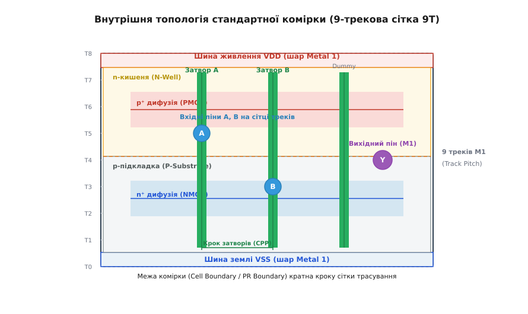
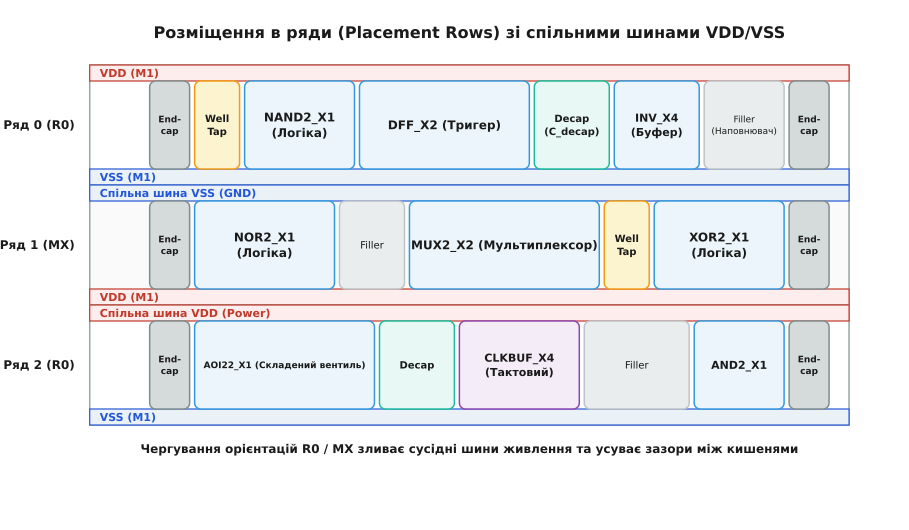
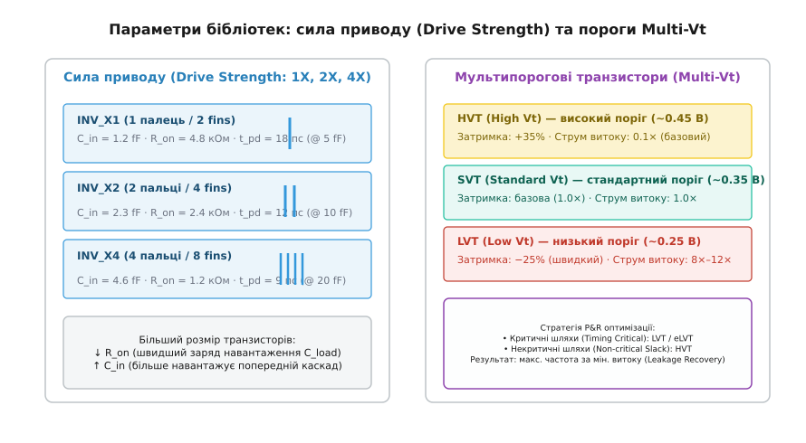
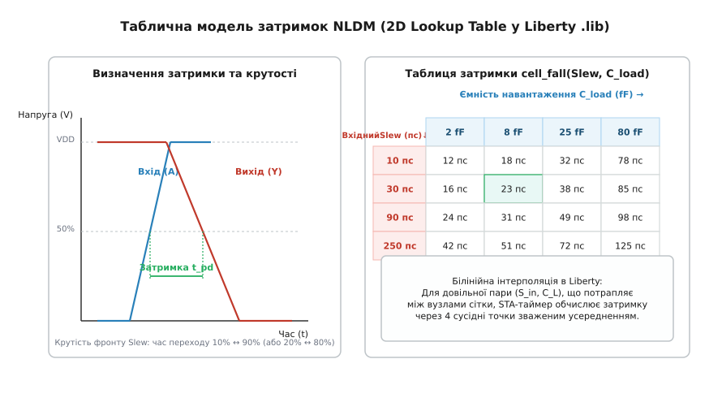

# Стандартні комірки: анатомія, геометричний канон та моделі базового будівельного блоку цифрових СБІС

<preknowlist>
- [CMOS-логіка](book:electronics/cmos) — комплементарна пара транзисторів NMOS та PMOS, робота базового інвертора.
- [Будова MOSFET](book:electronics/mosfet-structure) — фізичні області польового транзистора: затвор, витік, стік, підкладка та підзатворний діелектрик.
- [Техпроцес](book:electronics/process-node) — шари напівпровідникової структури, крок затворів CPP та сітка металізації.
- [Фотолітографія](book:electronics/photolithography) — проектування та травлення геометричних малюнків через систему фотошаблонів.
- [Фаби й fabless](book:electronics/fabs-fabless) — розділення індустрії на кремнієві заводи та безфабричні дизайн-центри.
</preknowlist>

Сучасний мікропроцесор містить від десяти до ста мільярдів транзисторів. Якщо проєктувати такий кристал на рівні окремих польових транзисторів (англ. *full-custom layout*), вручну визначаючи координати кожного дифузійного вікна, полікремнієвого затвора та контактного отвору, команда з сотні інженерів-топологів витратила б на розробку одного кристала понад два століття. Будь-яке випадкове зміщення полігону металу на кілька нанометрів у процесі ручного креслення створювало б коротке замикання або порушення правил технологічного процесу (DRC, англ. *Design Rule Check*), що робило б серійне виготовлення неможливим.

Виходом із цієї кризи складності стала модульна стандартизація: розбиття цифрової схеми на набір заздалегідь спроєктованих, багаторазово оптимізованих та електрично охарактеризованих функціональних блоків фіксованої геометричної форми. Таку уніфіковану функціональну одиницю називають **стандартною коміркою** (англ. *standard cell*), а всю методологію проектування — блочно-модульним або напівзамовним проєктуванням цифрових інтегральних схем (ASIC, англ. *Application-Specific Integrated Circuit*).

Комірка інкапсулює всередині себе точну топологію транзисторів для реалізації конкретної логічної функції (інвертора, двовходового NAND, мультиплексора чи тригера), а назовні виставляє стандартизований геометричний та часовий інтерфейс. Програми автоматичного логічного синтезу та автотрасування оперують цими блоками як дитячими кубиками: вони складають з них мільйони логічних ланцюгів, не заглядаючи щоразу у внутрішню будову кремнієвих шарів.

## 1. Геометричний канон стандартної комірки

Головне правило, яке дозволяє розміщувати сотні тисяч комірок на одному кристалі в щільні безшовні масиви за допомогою комп'ютерних алгоритмів — це сувора геометрична стандартизація.

```text
вимоги стандартизації:
  • фіксована висота комірки (Cell Height) = ціле число треків металу (7.5T, 9T, 12T)
  • ширина комірки (Cell Width) = ціле число кроків затворів (CPP)
  • шина живлення VDD — суворо на верхній межі (шар Metal 1)
  • шина землі VSS — суворо на нижній межі (шар Metal 1)
  • усі логічні виводи (піни) — суворо на перетині сітки трасування (Routing Grid)
```

### Висота комірки та сітка треків металізації (Track Pitch)

Висота стандартної комірки (**Cell Height**) є фіксованою для всієї бібліотеки і вимірюється не в абсолютних мікронах чи нанометрах, а в кількості паралельних горизонтальних ліній металізації шару Metal 1 (треків, англ. *metal tracks*), які здатні пройти крізь комірку від її нижнього до верхнього краю.

Крок металізації (**Track Pitch**) — це мінімальна фізична відстань між центрами двох сусідніх паралельних металевих провідників з урахуванням мінімальної ширини металу та технологічного зазору між ними. Висота комірки завжди дорівнює цілому числу треків:

```text
H_cell = N_tracks · Metal_1_Pitch
```

Залежно від кількості треків бібліотеки стандартних комірок поділяють на три фундаментальні архітектурні класи:

1. **Ультрависока щільність (7.5T, 6T або 5T, Ultra High Density — UHD):** комірка має висоту 7.5 або 6 треків. Призначена для блоків з екстремальними вимогами до площі та мінімального енергоспоживання (контролери вводу-виводу, цифрові фільтри, кеш-пам'ять). У такій тісній висоті поміщаються лише транзистори з малою шириною каналу (1–2 ребра у FinFET або 1 нанолист у GAA), тому ці комірки мають обмежений вихідний струм і працюють на помірних частотах.
2. **Збалансовані бібліотеки (9T, High Density / Standard):** класичний компроміс для більшості ядер процесорів і цифрових блоків SoC. Дозволяє розмістити транзистори середньої потужності та забезпечує достатньо простору для прокладання внутрішніх з'єднань на шарі Metal 1.
3. **Висока продуктивність (12T або 10.5T, High Performance — HP):** комірки мають велику висоту, що дозволяє використовувати широкі багатопальцеві транзистори або FinFET з 3–4 паралельними ребрами. Вони перезаряджають великі ємності навантаження за лічені пікосекунди і застосовуються на критичних шляхах обчислювальних блоків, АЛП та швидкісних інтерфейсів, але споживають більше енергії та займають більшу площу.

```text
тип бібліотеки    висота в треках    розмір транзисторів    цільове застосування
UHD (Ultra-HD)    5T – 7.5T          мінімальний (1-2 fins) IoT, низьке енергоспоживання
HD (Standard)     9T                 середній (2-3 fins)    базова процесорна логіка
HP (High-Perf)    10.5T – 12T        великий (3-4 fins)     критичні шляхи, розгін частоти
```


*Внутрішня топологія елементарної стандартної комірки на 9-трековій сітці Metal 1 з вирівнюванням затворів за кроком CPP та розміщенням пінів на сітці.*

### Квантування висоти у FinFET та GAA (Fin Quantization)

У планарних техпроцесах ширину каналу транзистора можна було змінювати неперервно (наприклад, зробити `W = 1.2 мкм` або `W = 1.35 мкм`). Проте з переходом на FinFET та горизонтальні нанолисти GAA (Gate-All-Around) виник ефект **квантування ширини каналу**:
- Струм одного транзистора тепер пропорційний дискретній кількості вертикальних кремнієвих ребер (*fins*) або горизонтальних нанолистів (*nanosheets*).
- У 9-трековій комірці поміщається 3 ребра для PMOS і 3 ребра для NMOS (конфігурація 3-3 fin library).
- У компактній 6-трековій комірці можлива лише конфігурація 2-2 fin або навіть 2-1 fin.
- Це змушує інженерів бібліотеки створювати різні варіанти сили приводу не плавною зміною геометрії, а додаванням кратних паралельних ребер і затворів.

### Сітка розміщення пінів і крок затворів (CPP)

Якщо висота комірки фіксована, то її ширина (**Cell Width**) варіюється залежно від складності логічної функції, але вона завжди кратна фундаментальному кроку затворів — **Contacted Poly Pitch (CPP)** або **Gate Pitch** (відстань між центрами сусідніх полікремнієвих ліній із контактами стоку/витоку між ними).

Усі вхідні та вихідні виводи комірки (металеві майданчики пінів A, B, Y) виводяться на шарі Metal 1 або Metal 2 і розташовуються суворо на вузлах **сітки трасування** (англ. *routing grid*). Завдяки цьому автороутер може опустити вертикальний перехідний отвір (Via) на пін комірки з вищих шарів металу (Metal 2 / Metal 3) у передбачуваній точці, не ризикуючи порушити мінімальні зазори літографії.

## 2. Внутрішня транзисторна топологія та фізичні межі

Усередині стандартна комірка розділена на дві горизонтальні фізичні зони:
- **Верхня половина:** кремнієва n-кишеня (англ. *N-Well*), у якій формуються p-канальні польові транзистори (PMOS).
- **Нижня половина:** p-типна підкладка або p-кишеня (англ. *P-Substrate / P-Well*), де розміщуються n-канальні транзистори (NMOS).

Затвори PMOS та NMOS транзисторів формуються спільними вертикальними лініями полікремнію (Continuous Poly), що перетинають комірку зверху вниз. Коли на вхідний пін подається високий потенціал, полікремнієвий затвор одночасно замикає нижній NMOS транзистор на землю і розмикає верхній PMOS транзистор.

### Неперервна дифузія та розриви дифузії (SDB / DDB)

В ультрасучасних техпроцесах літографічні обмеження забороняють друкувати ізольовані прямокутні острівці дифузії довільної форми. Натомість кремнієвий шар кремнію або ребра FinFET формуються у вигляді нескінченних паралельних смуг дифузії, що проходять крізь усі комірки ряду.

Щоб електрично ізолювати витокові та стокові області сусідніх транзисторів різних комірок, використовуються механізми **розриву дифузії** (англ. *diffusion break*):

1. **Подвійний розрив дифузії (Double Diffusion Break — DDB):** на стику двох комірок встановлюються два фіктивні затвори (*dummy gates*), посаджені на нульовий потенціал, між якими фізично протравлюється розрив у кремнії. Це забезпечує надійну ізоляцію, але додає 1–2 зайвих кроки CPP до ширини комірки.
2. **Одинарний розрив дифузії (Single Diffusion Break — SDB):** передова технологія, де дифузія перерізається прямо під одним фіктивним полікремнієвим затвором за допомогою прецизійного лазерного чи плазмового травлення. SDB зменшує площу логічних блоків на 10–15%, але вимагає складнішого контролю механічних напружень у каналі.

### Топологічні крайові ефекти (Layout-Dependent Effects — LDE)

Сучасні транзистори чутливі до свого геометричного оточення через ефекти механічного напруження:
- **Ефект напруження неглибокої ізоляції траншей (STI Stress):** діелектрик SiO₂ у траншеях ізоляції стискає крайні транзистори дифузійної смуги. Стиснення прискорює дірки в PMOS, але сповільнює електрони в NMOS.
- **Ефект близькості кишені (Well Proximity Effect — WPE):** під час імплантації n-кишені іони відбиваються від країв товстого шару фоторезисту, підвищуючи концентрацію домішки біля краю кишені. Це змінює порогову напругу транзисторів, розташованих ближче до краю комірки.
- **Фіктивні затвори на краях (PODE — Poly Over Diffusion Edge):** щоб нівелювати STI та WPE, по краях кожної комірки розміщують неробочі фіктивні затвори, які вирівнюють механічні напруження для внутрішніх робочих транзисторів.

Історію того, як індустрія перейшла від ручного малювання кожного окремого транзистора до строгої бібліотечної стандартизації, розкрито в нарисі [Історія виникнення методології стандартних комірок](book:electronics/standard-cell/hist-standard-cell.md).

## 3. Архітектура регулярних рядів та чергування орієнтацій

На кристалі стандартні комірки не розміщуються хаотично. Площа процесора розбивається на строго паралельні горизонтальні смуги — **ряди розміщення** (англ. *Placement Rows*). Кожен ряд має висоту, що точно збігається з висотою комірки `H_cell`.

```text
Ряд 2 (R0):   VDD ──────────────────────────────────────────────── (M1)
              [ PMOS зона ]
              [ NMOS зона ]
              VSS ──────────────────────────────────────────────── (M1)
                                      ▲
                         спільна шина VSS ряду 1 і 2
                                      ▼
Ряд 1 (MX):   VSS ──────────────────────────────────────────────── (M1)
              [ NMOS зона ]
              [ PMOS зона ]
              VDD ──────────────────────────────────────────────── (M1)
```

### Дзеркальне чергування рядів (R0 / MX)

Головний топологічний трюк розміщення рядів полягає в чергуванні їхньої просторової орієнтації:
- Парні ряди (Ряд 0, Ряд 2, Ряд 4...) встановлюються у **прямій орієнтації R0** (шина `VDD` зверху, шина `VSS` знизу).
- Непарні ряди (Ряд 1, Ряд 3, Ряд 5...) встановлюються у **віддзеркаленій орієнтації MX** (віддзеркалення по осі X: шина `VSS` зверху, шина `VDD` знизу).

Завдяки цьому ряд 0 і ряд 1 стикуються своїми нижніми шинами `VSS`, утворюючи одну спільну шину землі подвійної ширини. Ряд 1 і ряд 2 стикуються шинами `VDD`, утворюючи спільну шину живлення. Це дає два фундаментальні виграші:
1. **Економія площі кристала на 15–20%**, оскільки між рядами не потрібно залишати технологічних діелектричних зазорів між шинами живлення.
2. **Злиття сусідніх n-кишень**: n-кишені сусідніх віддзеркалених рядів зливаються в єдиний широкий суцільний масив, усуваючи необхідність дотримання важких правил зазорів «кишеня-підкладка» (Well-to-Well spacing DRC).


*Схема щільного розміщення стандартних комірок у ряди з дзеркальним чергуванням R0/MX та інтеграцією службових фізичних комірок.*

### Фізичні службові комірки в рядах

Окрім корисних логічних вентилів, регулярний ряд обов'язково наповнюється спеціальними нелогічними фізичними комірками:

- **Комірки контакту кишень (Well Tap Cells / Substrate Taps):** у комплементарній CMOS-структурі поруч існують паразитичні біполярні p-n-p-n структури, здатні утворювати паразитичний тиристор. При стрибках напруги цей тиристор може відкритися, викликавши катастрофічне коротке замикання між VDD і VSS — ефект **защіпання** (англ. *latch-up*). Щоб пригнітити latch-up, потенціал n-кишені має бути жорстко зафіксований на VDD, а p-підкладки — на VSS. Tap-комірки не несуть логічної функції, а лише містять низькоомні омічні контакти `n⁺` до n-кишені та `p⁺` до p-підкладки. Правило проектування (*tap distance rule*) вимагає розміщувати їх у кожному ряду з регулярним кроком (наприклад, не рідше ніж через кожні 25–30 мкм).
- **Комірки наповнювача (Filler Cells):** після автоматичного розміщення логіки в рядах залишаються порожні проміжки між комірками. Їх не можна залишати порожніми, оскільки це розірве неперервність шин VDD/VSS та n-кишені, а також створить нерівномірну щільність металу під час хіміко-механічного полірування (CMP). Філери заповнюють ці діри фіктивними шарами оксиду, дифузії та металу.
- **Крайові комірки (Endcap Cells):** встановлюються на лівих та правих торцях кожного ряду розміщення, а також навколо великих блоків пам'яті (SRAM-макросів). Вони фізично захищають робочі транзистори від крайових ефектів літографії (оптичних спотворень на межі масиву) та дрейфу концентрації домішок легування.
- **Декаплінгові комірки (Decoupling Capacitor / Decap Cells):** містять інтегрований у структуру ряду МОН-конденсатор між VDD та VSS. Коли тисячі логічних вентилів одночасно перемикаються, виникає миттєвий сплеск споживання струму `di/dt`, що викликає локальне динамічне просідання напруги живлення (**IR-drop**). Розподілені в рядах Decap-комірки віддають накопичений локальний заряд за лічені пікосекунди, стабілізуючи живлення поруч із працюючою логікою.
- **Антенні комірки (Antenna Diode Cells):** містять захисний зворотний діод на підкладку. Під час фабричного виготовлення на етапі плазмового реактивного іонного травлення довгі металеві доріжки діють як антени, збираючи статичний електричний заряд. Якщо цей провід підключений лише до тонкого оксиду затвора MOSFET, накопичений заряд пробиває діелектрик затвора, незворотно руйнуючи транзистор. Антенний діод безпечно скидає цей заряд у підкладку під час виробництва.

## 4. Сила приводу та мультипорогові транзистори (Multi-Vt)

Будь-яка базова логічна функція (наприклад, двовходовий елемент І-НІ) присутня в бібліотеці стандартних комірок не в одному екземплярі, а у вигляді цілого сімейства з десятків взаємозамінних варіантів, що розрізняються за двома параметрами: **силою приводу** та **пороговою напругою**.

```text
виміри варіативності бібліотеки:
  ┌───────────────────────┬────────────────────────────────────────────────────────┐
  │ Параметр              │ Варіанти виконання                                     │
  ├───────────────────────┼────────────────────────────────────────────────────────┤
  │ Сила приводу          │ X0.5, X1, X2, X3, X4, X8, X12, X16, X20, X32          │
  │ Порогова напруга (Vt) │ HVT (високий поріг), SVT (стандартний), LVT (низький), │
  │                       │ eLVT (екстра-низький)                                 │
  └───────────────────────┴────────────────────────────────────────────────────────┘
```


*Зліва: розширення ширини каналу за рахунок транзисторних пальців (Drive Strength). Справа: компроміс між затримкою перемикання та підпороговим струмом витоку (Multi-Vt).*

### Сила приводу (Drive Strength: X1, X2, X4, X8...)

Число після назви комірки (наприклад, `NAND2_X1`, `NAND2_X4`, `INV_X8`) позначає її вихідну навантажувальну здатність щодо базового вентиля одиничного розміру (1X).

Механізм масштабування полягає у зміні сумарної ширини каналу транзисторів `W`:
- У планарних процесах один широкий транзистор розбивають на кілька паралельно з'єднаних секцій — **пальців** (англ. *gate fingers*).
- У FinFET-процесах збільшують кількість паралельних вертикальних ребер під затвором (*fins*): комірка X1 має 2 ребра на транзистор, X2 — 4 ребра, X4 — 8 ребер.

Фізичний компроміс сили приводу:
1. **Зростання потужності виходу:** комірка X4 має у 4 рази менший активний вихідний опір `R_on` порівняно з X1. Вона здатна швидко перезарядити велику ємність довгої міжз'єднувальної лінії або розгалуження на 10 наступних вентилів (**Fanout**), запобігаючи затягуванню фронтів сигналу.
2. **Зростання вхідної ємності та площі:** комірка X4 має у 4 рази більшу вхідну ємність `C_in` своїх затворів і займає значно більше сайтів у ряду. Вона створює важке навантаження для попереднього каскаду, що вимагає ретельного балансування дерева буферів.

### Мультипорогові технології (Multi-Vt: HVT, SVT, LVT, eLVT)

Порогова напруга транзистора `V_th` визначає напругу на затворі, за якої канал починає проводити струм. У сучасному техпроцесі фабрика підтримує від трьох до чотирьох варіантів порогової напруги для абсолютно однакових за геометрією транзисторів за рахунок додаткового дозування іонної імплантації каналу або зміни хімічного складу металу затвора (роботи виходу електрона у HKMG):

- **HVT (High Threshold Voltage — високий поріг):** `V_th ≈ 0.45 В`. Транзистор відкривається повільніше, затримка поширення сигналу `t_pd` збільшується на 30–40%. Проте струм підпорогового витоку в закритому стані падає в 10–20 разів порівняно зі стандартним.
- **SVT / RVT (Standard/Regular Threshold Voltage — стандартний поріг):** `V_th ≈ 0.35 В`. Базовий компроміс між швидкодією та статичним витоком.
- **LVT (Low Threshold Voltage — низький поріг):** `V_th ≈ 0.25 В`. Струм відмикання `I_on` різко зростає, транзистор перемикається на 20–30% швидше. Проте підпороговий витік зростає експоненційно (у 8–15 разів).
- **eLVT / uLVT (Extreme Low Threshold Voltage — екстра-низький поріг):** `V_th ≈ 0.18 В`. Екстремально швидкі комірки для подолання порушень Setup Time на найскладніших тактових частотах ціною гігантського статичного струму витоку.

```text
тип Vt    поріг V_th    відносна швидкість    струм витоку I_leak    де застосовується
HVT       ~0.45 В       повільний (0.75×)     дуже низький (0.1×)    некритичні шляхи (90% чипа)
SVT       ~0.35 В       базова (1.0×)         базовий (1.0×)         шляхи з помірним запасом
LVT       ~0.25 В       швидкий (1.25×)       високий (10×)          критичні шляхи (Setup critical)
eLVT      ~0.18 В       екстремальний (1.4×)  критичний (50×–100×)   поодинокі вузькі місця STA
```

### Алгоритм оптимізації енергоспоживання (Leakage Recovery)

Усі варіанти однієї комірки (наприклад, `AND2_X2` у версіях HVT, SVT та LVT) мають абсолютно однаковий геометричний контур (той самий розмір, розташування пінів та шарів блокування). Це дозволяє інструментам синтезу та фізичної оптимізації застосовувати потужну стратегію:

1. На етапі початкового розміщення схема синтезується на швидких комірках LVT/SVT, щоб гарантовано вкластися у тактову частоту (виконати вимоги **Setup Time** на критичних шляхах).
2. Після трасування інструмент аналізує часовий запас (**Timing Slack**) для кожного з мільйонів логічних шляхів.
3. Якщо шлях має позитивний запас затримки (наприклад, сигнал приходить на 300 пікосекунд раніше тактового імпульсу), інструмент автоматично замінює швидкі комірки LVT на повільні, але енергоефективні **HVT** (*Footprint Swap / Leakage Recovery*).
4. Оскільки геометрія комірок ідентична, заміна відбувається без зміни прокладених проводів трасування. У результаті 85–95% кристала переводиться на HVT-вентилі, що зменшує загальний струм витоку процесора у стані спокою в десятки разів без втрати жодного мегагерца робочої частоти.

Математичні рівняння підпорогового струму, розрахунок інтерполяції затримок та розподіл потужності наведено у вставці [Математичні моделі затримки та енергоспоживання комірок](book:electronics/standard-cell/math-cell-delay.md).

## 5. Функціональні класи комірок у бібліотеці

Повна комерційна бібліотека стандартних комірок напівпровідникового заводу (наприклад, TSMC N5 або GlobalFoundries 22FDX) містить від 800 до 2500 унікальних комірок, згрупованих за функціональним призначенням:

### 1. Комбінаційна логіка (Combinational Cells)
- **Базові вентилі:** інвертори (INV), буфери (BUF), елементи І (AND), І-НЕ (NAND), АБО (OR), АБО-НЕ (NOR).
- **Симетричні та арифметичні елементи:** виключальне АБО (XOR), виключальне АБО-НЕ (XNOR), двовходові та чотиривходові мультиплексори (MUX2, MUX4), напівсуматори (Half Adder), повні суматори (Full Adder).
- **Складені вентилі (Complex Gates / AOI / OAI):** об'єднують кілька логічних операцій в одній кремнієвій комірці без проміжних буферів. Наприклад, елемент **AOI22** реалізує функцію `Y = ¬((A · B) + (C · D))`, а **OAI21** — `Y = ¬((A + B) · C)`. Складені вентилі займають на 30% менше площі та працюють значно швидше, ніж еквівалентний ланцюг з окремих вентилів AND, OR та INV.

### 2. Послідовнісні елементи (Sequential Cells)
- **D-тригери (D-Flip-Flops — DFF):** синхронні елементи збереження стану, що фіксують вхідні дані за позитивним або негативним фронтом тактового сигналу. Випускаються у варіантах з асинхронним скиданням (Reset), синхронним встановленням (Set), дозволом тактування (Clock Enable).
- **Тестові скан-тригери (Scan Flip-Flops):** спеціальні D-тригери для тестування кристала на виробництві (DFT, Design for Testability). Мають вбудований вхідний мультиплексор, керований сигналом `SE` (Scan Enable). У тестовому режимі всі мільйони тригерів кристала з'єднуються у довгі послідовні зсувні регістри (**Scan Chains**), що дозволяє завантажувати тестові вектори безпосередньо у внутрішній стан процесора.
- **Засувки (Latches):** тригери, прозорі за рівнем сигналу, для спеціалізованих високошвидкісних конвеєрів.

### 3. Елементи тактових дерев (Clock Tree Cells)
Тактові дерева вимагають мінімального тремтіння фази (джитеру) та нульового перекосу тактових фронтів (**Clock Skew**).
- **Тактові буфери та інвертори (CLKBUF, CLKINV):** мають суворо симетричну схемотехніку, де час наростання вихідного фронту `t_rise` точно дорівнює часу спаду `t_fall` у всьому діапазоні температур, щоб не спотворювати шпаруватість тактового сигналу.
- **Вентилі вимкнення тактування (Integrated Clock Gating — ICG):** спеціальні комірки, що містять засувку та елемент AND. Вони безпечно відключають подачу тактової частоти на неактивні блоки процесора, виключаючи виникнення небезпечних коротких паразитичних імпульсів (глітчів).

### 4. Комірки керування живленням (Power Management Cells)
Застосовуються в сучасних системах на кристалі з кількома доменами напруги:
- **Транслятори рівнів (Level Shifters):** забезпечують передачу логічного сигналу між блоками, що працюють від різних напруг живлення (наприклад, ядро на 0.75 В та інтерфейс пам'яті на 1.2 В).
- **Ізоляційні комірки (Isolation Cells):** встановлюються на виходах блоків, живлення яких може повністю відключатися (**Power Gating**). Коли блок знеструмлений, його виходи переходять у невизначений плаваючий стан (Z-стан), що може спричинити короткі наскрізні струми у приймальних вентилях. Ізоляційна комірка примусово фіксує на виході стабільний логічний 0 або 1 за сигналом `ISO`.
- **Тригери зі збереженням стану (Retention Flip-Flops):** містять крихітну тіньову енергонезалежну засувку, підключену до резервної невимикаємої лінії живлення `VDD_always_on`. Перед знеструмленням ядра процесора стан реєстрів зберігається в тіньових засувках за 1 такт, а після повернення живлення миттєво відновлюється без потреби в тривалому перезавантаженні.

## 6. Артефакти та моделі бібліотеки (Library Views)

Бібліотека стандартних комірок поставляється замовнику у вигляді великого пакету спеціалізованих файлів (**Library Views**). Кожен файл описує один і той самий набір вентилів, але на різному рівні абстракції для різних інструментів САПР:

```text
склад бібліотеки стандартних комірок:
  ├── Timing & Power:      .lib / .db      (Liberty: таймінги NLDM/CCS, витоки, стани)
  ├── Geometry (Abstract): .lef            (LEF: межі макросів, прямокутники пінів, OBS)
  ├── Simulation:          .v / .vhd       (Verilog/VHDL моделі логіки з блоками specify)
  ├── Transistor Netlist:  .sp / .cdl      (SPICE/CDL нетлісти з паразитними ємностями)
  ├── Full Layout:         .gds / .oas     (GDSII/OASIS: повна фізична топологія всіх масок)
  └── Physical Database:   .oa / .ndm      (OpenAccess / NDM бази даних для каденсу та синопсісу)
```

```text
етап проектування            використовуваний артефакт    що зчитує САПР
Логічний синтез              Liberty (.lib)               логічна функція, площа, затримка
Функціональна симуляція      Verilog (.v)                 поведінковий опис, перевірка логіки
Розміщення і трасування (P&R) LEF (.lef)                  розміри, посадочні піни, перешкоди
Статичний часовий аналіз     Liberty (.lib) + SDF         точні затримки з урахуванням ємностей
Фізична верифікація (DRC/LVS) GDSII (.gds) + CDL (.cdl)    повна перевірка правил фабрики
```


*Принцип табличної моделі затримок NLDM у форматі Liberty: часові діаграми вимірювання затримки та двовимірна матриця інтерполяції затримки від вхідного Slew та вихідної ємності C_load.*

### Опис ключових форматів

1. **Liberty (`.lib` / бінарний комкомпільований `.db`):** головний текстовий файл електричного опису. Містить логічну функцію кожного виходу, вхідні ємності пінів, таблиці затримок наростання та спаду (таблиці NLDM від вхідного `slew` та вихідної ємності `C_load`), таблиці динамічної енергії перемикання та опис статичних струмів витоку для кожної логічної комбінації входів.
2. **Library Exchange Format (`.lef`):** фізична геометрична абстракція. Містить інформацію про шар і координати прямокутників зовнішніх меж (`SIZE`), пінів для приєднання контактів (`PIN`) та внутрішніх провідників металу 1, перетин яких заборонено іншим сигналам під час трасування (`OBS`, англ. *obstructions / keep-out zones*).
3. **Поведінкова модель Verilog (`.v`):** симуляційна модель мовою Verilog для верифікації функціонування схеми на тактовому рівні. Містить блок `specify`, що зв'язує піни з файлом розрахунку затримок SDF (Standard Delay Format).
4. **SPICE Netlist (`.sp` / `.cdl`):** детальний транзисторний список з'єднань із точними розмірами довжини і ширини каналів, площею дифузійних переходів та паразитними опорами для аналогового моделювання й верифікації топології LVS (Layout Versus Schematic).
5. **GDSII / OASIS (`.gds` / `.oas`):** бінарний файл повної фізичної топології. Містить точні креслення полігонів абсолютно всіх 60–90 фотошаблонів техпроцесу (імплантація, оксид, полікремній, метали від M1 до M15, перехідні отвори). Використовується на фінальному етапі передачі проєкту на фабрику (*Tape-Out*) для виготовлення масок.

Повний синтаксис ключових файлів, структуру полів та правила узгодження описано у вставці [Специфікація форматів Liberty та LEF](book:electronics/standard-cell/api-liberty-lef.md).

## 7. Процес характеризації бібліотеки (Cell Characterization)

Файли Liberty не беруться самі по собі: для їх створення команда інженерів бібліотеки запускає складний автоматизований процес — **характеризацію бібліотеки** (англ. *Library Characterization*).

```text
процес створення файлу Liberty (.lib):
  1. Малювання топології GDSII → екстракція паразитної RC-сітки транзисторів
  2. Генерація SPICE-нетліста для кожного логічного елемента
  3. Запуск масивного паралельного SPICE-моделювання на кластері (Cadence Liberate, Synopsys SiliconSmart):
     • для всіх входів і переходів (0→1, 1→0)
     • для 7 значень крутості вхідного фронту (Slew: 5 пс ... 500 пс)
     • для 7 значень ємності навантаження (C_load: 1 fF ... 200 fF)
     • для всіх PVT-кутів (SS, TT, FF, при температурах -40°C, 25°C, 125°C)
  4. Автоматичне заповнення сотень тисяч комірок таблиць затримок та енергії
  5. Формування єдиного верифікованого файлу .lib
```

Кількість запусків SPICE для характеризації однієї сучасної бібліотеки сягає сотень мільйонів симуляцій. Але одного разу виконана робота дозволяє цифровим інженерам у всьому світі створювати складні багатоядерні системи, маючи гарантію, що розраховані таймінги та фізичні параметри з точністю до пікосекунди зійдуться на реальному кремнії.

> 🔧 **Навіщо це.** Коли цифровий проектувальник пише рядок `assign y = a & b;` мовою SystemVerilog, синтезатор не створює нових фізичних транзисторів. Він звертається до бібліотеки стандартних комірок, обирає серед сотень готових варіантів вентиля І оптимальний за площею, силою приводу (наприклад, `AND2_X2`) та пороговою напругою (`HVT`), а програма розміщення й трасування встановлює його у призначений ряд відповідно до сітки LEF. Розуміння внутрішньої фізики, геометрії та часових моделей стандартної комірки дозволяє інженеру свідомо керувати балансом між максимальною частотою (Fmax), площею кристала та енергоспоживанням процесора.
