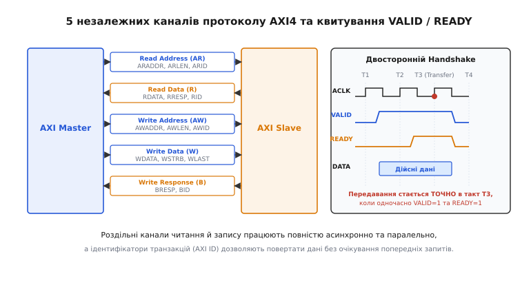

# 🔌 Архітектура внутрішньокристальних шин ARM AMBA: APB, AHB, AXI4

Коли на одному кремнієвому кристалі необхідно об'єднати чотири процесорні ядра, графічний прискорювач, контролер оперативної пам'яті, модуль прямого доступу DMA та три десятки периферійних контролерів (від швидкісного PCIe до повільного UART), головною проблемою стає організація їхньої спільної взаємодії. Якщо під'єднати всі ці блоки до однієї спільної паралельної шини із загальним арбітром, система миттєво втрачає продуктивність. Високошвидкісні запити процесора до пам'яті вимушені чекати, поки повільний таймер зчитує свій регістр стану; ємнісне навантаження від сотень підключених транзисторних затворів сповільнює фронти сигналів на всій магістралі, а єдиний арбітр перетворюється на вузьке місце, що обмежує пропускну здатність кристала.

Для вирішення цієї проблеми компанія ARM розробила багаторівневу архітектуру внутрішньокристальних шин AMBA (англ. *Advanced Microcontroller Bus Architecture*). Замість універсальної, але неефективної єдиної магістралі, стандарт AMBA розділяє внутрішній трафік кристала на ієрархічні рівні з різною пропускною здатністю, протоколами та апаратними витратами: від надпростої периферійної шини APB до високопродуктивного повнодуплексного інтерконекту AXI4 із роздільними каналами та позачерговим виконанням транзакцій.


*Архітектура протоколу AXI4: п'ять повністю незалежних каналів зв'язку та часова діаграма узгодження передавання через двостороннє квитування VALID/READY.*

---

## 1. Периферійна шина AMBA APB (Advanced Peripheral Bus)

Шина APB спроектована для підключення повільних периферійних модулів: регістрів конфігурації, таймерів, контролерів переривань, послідовних інтерфейсів UART, I2C, SPI та ліній GPIO. Головні пріоритети APB — мінімальна кількість логічних вентилів, простота реалізації слейв-інтерфейсів та нульове динамічне споживання енергії під час простою.

Шина APB є односпрямованою, неконвеєрною і підтримує лише одного майстра, роль якого майже завжди виконує міст із вищого рівня інтерконекту (AXI-to-APB Bridge). Кожне передавання даних по шині APB займає щонайменше два такти системного годинника і складається з двох послідовних фаз:

1. **Фаза налаштування (Setup Phase):** Міст виставляє на шину адресу `PADDR`, керувальний сигнал напрямку `PWRITE` (1 — запис, 0 — читання) та піднімає сигнал вибору конкретного периферійного пристрою `PSELx`. Сигнал стробування `PENABLE` у цьому такті залишається низьким.
2. **Фаза доступу (Access Phase):** На наступному такті міст піднімає сигнал `PENABLE = 1`. Це вказує слейву, що адреса й керувальні лінії стабільні, і транзакцію можна виконувати. Якщо слейв здатний завершити операцію за один такт, він виставляє дані читання `PRDATA` або приймає дані запису `PWDATA`, після чого транзакція завершується.

У версії протоколу APB4 було додано лінію готовності `PREADY` (що дозволяє слейву розтягувати фазу доступу на кілька тактів, якщо йому потрібен додатковий час), сигнал помилки транзакції `PSLVERR` та байти захисту доступу `PPROT`. Завдяки відсутності складної конвеєризації слейв-контролер APB займає всього кілька десятків логічних вентилів у кремнії.

---

## 2. Проміжна шина AMBA AHB (Advanced High-performance Bus)

Шина AHB з'явилася як рішення для об'єднання швидкісних процесорних блоків, внутрішньої пам'яті SRAM і контролерів прямого доступу DMA в мікроконтролерах середнього класу (наприклад, ядрах серії ARM Cortex-M).

На відміну від APB, шина AHB є конвеєрною: фаза виставлення адреси накладається в часі на фазу передавання даних попередньої транзакції. Це дозволяє здійснювати передавання зі швидкістю одне слово за один тактовий цикл під час пакетних обмінів (англ. *burst transfers*). AHB використовує централізований арбітр, який надає шину одному з кількох майстрів, та адресний дешифратор, що керує вибором слейвів.

Проте централізована природа AHB створює суттєві обмеження у складних багатоядерних SoC. Оскільки шина адреси та шина даних є спільними для всіх пристроїв, у кожен момент часу активним може бути лише одне передавання: читання блокує запис, а монопольне захоплення шини одним майстром під час довгого пакетного обміну зупиняє роботу решти обчислювальних вузлів кристала.

---

## 3. Високопродуктивний протокол AMBA AXI4 (Advanced eXtensible Interface)

Для подолання обмежень загальних шин у високопродуктивних процесорах (серій Cortex-A, графічних чіпах GPU та нейроприскорювачах) ARM представила протокол четвертого покоління — AXI4. Його архітектура базується на переході від спільної шини до матричного інтерконекту (Crossbar / Switch Fabric) із роздільними односпрямованими каналами передавання.

Протокол AXI4 визначає **п'ять повністю незалежних каналів зв'язку**:

1. **Канал адреси читання (Read Address Channel, AR):** Передає адресу пам'яті `ARADDR`, довжину пакета `ARLEN`, розмір слова `ARSIZE`, тип пакетного обміну `ARBURST` та ідентифікатор транзакції `ARID`.
2. **Канал даних читання (Read Data Channel, R):** Передає зчитані з пам'яті дані `RDATA`, статус відповіді `RRESP` (OKAY, EXOKAY, SLVERR, DECERR), прапорець останнього слова в пакеті `RLAST` та ідентифікатор `RID`.
3. **Канал адреси запису (Write Address Channel, AW):** Передає адресу початку запису `AWADDR`, параметри пакета та ідентифікатор `AWID`.
4. **Канал даних запису (Write Data Channel, W):** Передає дані для запису `WDATA`, маску активних байтів `WSTRB` (дозволяє побайтовий запис у 64-бітні чи 512-бітні шини) та прапорець останнього слова `WLAST`.
5. **Канал відповіді на запис (Write Response Channel, B):** Повертає статус виконання запису `BRESP` та ідентифікатор `BID`. Окремий канал відповіді необхідний тому, що через наявність проміжних буферів запису підтвердження про фіксацію даних у пам'яті повертається значно пізніше, ніж передаються самі байти.

Головна перевага такої структури — **асиметричність і паралелізм**: операції читання та запису виконуються одночасно без жодного взаємного блокування.

---

## 4. Механізм двостороннього квитування (VALID / READY Handshake)

Кожен із п'яти каналів AXI4 використовує єдиний уніфікований протокол узгодження передавання через пару сигналів: `VALID` від джерела інформації та `READY` від приймача.

Фізичне передавання даних або керувальної адреси через канал відбувається **винятково в тому тактовому циклі, коли обидва сигнали одночасно встановлені в логічну одиницю**:

```
Передавання здійснено ⇔ (VALID == 1) ∧ (READY == 1) на висхідному фронті ACLK
```

Специфікація AXI4 накладає суворі правила на формування цих сигналів для запобігання взаємним блокуванням (дедлокам):
- Джерело виставляє корисні дані та піднімає `VALID = 1`. Джерело **не має права чекати**, поки приймач виставить `READY = 1`, щоб виставити `VALID`.
- Щойно джерело підняло сигнал `VALID`, воно **зобов'язане утримувати всі інформаційні лінії та сам сигнал `VALID` незмінними**, доки приймач не відповість сигналом `READY = 1` і транзакція не завершиться.
- Приймач має право виставляти `READY = 1` заздалегідь (показуючи, що буфер вільний) або піднімати `READY` у відповідь на появу `VALID`.

---

## 5. Ідентифікатори транзакцій (AXI ID) та позачергове виконання

У класичних шинах усі запити мусять повертати відповіді в тому самому порядку, в якому вони були надіслані. Якщо процесор звернувся за даними до повільної зовнішньої пам'яті DDR (латентність 80–100 нс), а потім запросив дані зі швидкої внутрішньої SRAM (латентність 2 нс), у звичайній шині швидкий запит застрягне позаду повільного.

AXI4 вирішує це маркуванням кожної транзакції унікальним тегом — `AXI ID` (`ARID` для читання, `AWID` для запису):
- Транзакції з **однаковим ID** завершуються **суворо послідовно**. Це гарантує цілісність даних при залежних операціях одного потоку процесора.
- Транзакції з **різними ID** можуть завершуватися **у довільному (позачерговому) порядку** (англ. *out-of-order completion*).

Контролер пам'яті, отримавши пачку запитів із різними ID, перевпорядковує їх так, щоб мінімізувати перемикання банків і рядків у мікросхемах DRAM, зчитує доступні дані та повертає їх через шину з відповідним тегом `RID`. Процесорне ядро за тегом `RID` самостійно розкладає отримані слова у відповідні черги конвеєра інструкцій.

---

## 6. Режими пакетного передавання (Burst Types)

AXI4 підтримує передавання пакетів довжиною від 1 до 256 слів на одну виставлену адресу за трьома типами інкременту (`ARBURST` / `AWBURST`):

1. **FIXED (Фіксована адреса):** Адреса не змінюється між тактами. Використовується для читання або запису у внутрішні апаратні черги FIFO периферійних модулів.
2. **INCR (Інкрементна адреса):** Адреса кожного наступного слова зростає на розмір передавання (`1, 2, 4, 8, 16, ..., 128` байтів). Це основний робочий режим для копіювання масивів даних у пам'яті та роботи контролерів DMA.
3. **WRAP (Кільцева адреса):** Адреса інкрементується до досягнення верхньої межі вирівнювання, після чого «загортається» на початок діапазону. Цей режим є критично важливим для заповнення рядків кеш-пам'яті процесора (англ. *cache line fill*): процесор запитує насамперед те слово, яке спричинило промах кешу (*Critical Word First*), а решта слів рядка зчитується по кільцю без зміни базової структури рядка кешу.

---

## 7. Порівняльна характеристика протоколів сімейства AMBA

| Параметр | AMBA APB4 | AMBA AHB-Lite | AMBA AXI4 | AMBA AXI4-Stream |
| :--- | :--- | :--- | :--- | :--- |
| **Призначення** | Регістри периферії | Вбудована пам'ять MCU | Системний інтерконект SoC | Потокове аудіо/відео/DSP |
| **Пропускна здатність** | Низька (1 слово / 2 такти) | Середня (конвеєрна) | Дуже висока (повнодуплексна) | Максимальна (без адрес) |
| **Кількість каналів** | 1 спільний | 1 конвеєрний | 5 роздільних | 1 прямий потік даних |
| **Пакетний обмін (Burst)** | Немає | Є (фіксовані 4, 8, 16) | Є (до 256 слів, WRAP/INCR) | Нескінченний потік |
| **Позачерговий порядок** | Немає | Немає | Є (завдяки AXI ID) | Не застосовується |
| **Складність логіки** | Мінімальна (~50 вентилів) | Середня (~500 вентилів) | Висока (~3000–8000 вентилів) | Низька-середня |

---

## 8. Спеціалізовані діалекти: AXI4-Lite та AXI4-Stream

Для задач, де повна функціональність AXI4 є надлишковою, стандарт визначає два оптимізовані піднабори:
- **AXI4-Lite:** Спрощена версія протоколу для доступу до керувальних регістрів. У ній заборонені пакетні передавання (довжина завжди дорівнює 1 слову), зафіксовано розрядність шини (32 або 64 біти) та вилучено підтримку позачергового виконання. Це значно спрощує кінцеві слейв-автомати.
- **AXI4-Stream:** Протокол для передавання суцільних потоків даних без адресації (наприклад, пікселів від сенсора камери до сигнального процесора або аудіосемплів). Протокол містить лише прямий канал даних із сигналами `TDATA`, `TVALID`, `TREADY` та службовими прапорцями кінця кадру `TLAST`, що забезпечує гранично високу швидкість обробки без адресних накладних витрат.
