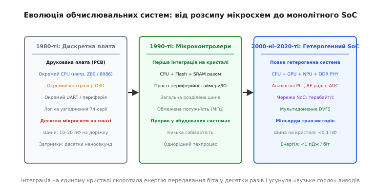

# 📜 Від розсипу мікросхем до єдиного кристала: народження архітектури SoC

У 1970-х та на початку 1980-х років побудова будь-якого комп'ютера чи контролера починалася зі свердління сотень отворів у текстолітовій друкованій платі. Типова материнська плата персонального комп'ютера або промислового автомата являла собою килим із десятків окремих корпусів мікросхем у виконанні DIP (англ. *Dual In-line Package*). Центральний процесор займав один великий керамічний корпус; поруч стояли окремі мікросхеми динамічної пам'яті DRAM, мікросхема постійної пам'яті ROM із зашитою програмою ініціалізації, окремий контролер послідовного порту UART, дискретний контролер прямого доступу до пам'яті DMA, контролер переривань і ще тридцять–сорок дрібних логічних мікросхем стандартної 74-ї серії ТТЛ, які інженери називали «клеєм» (англ. *glue logic*), бо вони лише узгоджували часові діаграми та дешифрували адреси між несумісними виводами головних компонентів.

Така розсипна архітектура вперлася у фізичну стіну, щойно тактові частоти процесорів спробували підняти вище кількох десятків мегагерців. Мідна доріжка на друкованій платі довжиною всього 10–15 сантиметрів має власну паразитну ємність близько 15–25 пікофарад і паразитну індуктивність у кілька десятків наногенрі. Щоразу, коли вихідний каскад процесора перемикав логічний рівень на зовнішній 8-бітній чи 16-бітній шині, йому доводилося перезаряджати цей масивний електричний конденсатор плати. Це вимагало вихідних струмів у десятки міліампер на кожен вивід мікросхеми, створювало колосальні сплески живлення, породжувало електромагнітне випромінювання та затягувало фронти імпульсів на 10–20 наносекунд. Сигнали просто не встигали добігти від одного кінця плати до іншого за один такт нового швидкого процесора.

*Еволюція обчислювальної техніки: скорочення паразитних ємностей і затримок завдяки перенесенню друкованої плати всередину єдиного кремнієвого кристала.*

Першим кроком до подолання цієї дискретної кризи стала поява однокристальних мікроконтролерів (MCU, англ. *Microcontroller Unit*). У 1976 році компанія Intel представила кристал i8048, а в 1980 році — легендарний 8-бітний мікроконтролер Intel 8051. Концепція була революційною для свого часу: на одному кремнієвому кристалі площею в кілька десятків квадратних міліметрів розмістили процесорне ядро, 128 байтів статичної оперативної пам'яті (SRAM), 4 кілобайти масочного ROM, два 16-бітних таймери та лінії паралельного введення-виведення. Замість громіздкої плати на десяток чіпів інженер отримував один корпус, якому були потрібні лише напруга живлення та кварцовий резонатор.

Проте класичні мікроконтролери залишалися простими, жорстко фіксованими та функціонально обмеженими приладами. Їх виготовляли за єдиним, відносно дешевим і повільним технологічним процесом, який добре підходив для вбудованої пам'яті та транзисторів середньої щільності, але не дозволяв інтегрувати високопродуктивні суперскалярні процесори, великі кеші або швидкісні аналогові тракти. Кожен виробник сам створював кристал від першого до останнього транзистора, використовуючи власну закриту систему команд та власні пропрієтарні схемотехнічні топології.

Справжній фундамент під майбутню еру систем-на-кристалі заклала революція в методології проектування надвеликих інтегральних схем (VLSI, англ. *Very Large Scale Integration*), здійснена наприкінці 1970-х років Карвером Мідом (*Carver Mead*) з Каліфорнійського технологічного інституту (Caltech) та Лінн Конвей (*Lynn Conway*) з дослідницького центру Xerox PARC. До виходу їхньої епохальної праці «Вступ до систем VLSI» (*Introduction to VLSI Systems*, 1980 рік) проектування мікросхем вважалося винятковою справою фізиків-технологів, які вручну малювали геометрію кожного окремого дифузійного шару та полікремнієвого затвора на міліметровому папері.

Мід і Конвей запропонували радикальний поділ праці: абстрагувати фізику напівпровідників у набір чітких геометричних правил проектування (англ. *design rules*, виражених у безрозмірному параметрі `lambda`) та стандартних логічних комірок (англ. *standard cells*). Це дозволило розробникам апаратури описувати цифрову логіку алгоритмічно — за допомогою мов опису апаратури (HDL: Verilog, VHDL), не замислюючись про те, в якій саме хімічній печі вирощуватиметься діоксид кремнію. Синтез логіки перетворився на комп'ютерну задачу: програма-синтезатор транслювала високорівневий поведінковий код у схему з логічних вентилів, а алгоритми автоматичного розміщення й трасування (Place & Route) генерували готові топологічні маски.

Цей абстрактний поділ уможливив появу принципово нової бізнес-моделі напівпровідникової індустрії — розділення компаній на розробників без власних фабрик (англ. *fabless*) та контрактних кремнієвих виробників (англ. *pure-play foundry*). У 1987 році Морріс Чанг (*Morris Chang*) заснував на Тайвані компанію TSMC (Taiwan Semiconductor Manufacturing Company), яка відмовилася від розробки власних чіпів і зосередилася винятково на послугах високоточної літографії для сторонніх замовників.

Тепер невеликій інженерній команді більше не потрібно було будувати власну фабрику вартістю сотні мільйонів доларів. Але постала нова проблема: сучасний кристал вимагав інтеграції стількох функціональних вузлів (процесор, шини, контролери дисплеїв, пам'ять, радіотрансивери), що жодна окрема компанія не встигала спроектувати їх з нуля у прийнятні строки виходу продукту на ринок (англ. *time-to-market*).

Відповіддю на цей виклик стало зародження ринку кремнієвої інтелектуальної власності (англ. *Semiconductor Intellectual Property*, IP-cores). У листопаді 1990 року спільними зусиллями компаній Acorn Computers, Apple Computer та виробника чіпів VLSI Technology було засновано компанію ARM (Advanced RISC Machines). ARM обрала бізнес-модель, яка остаточно сформувала обличчя сучасного SoC-будування: компанія взагалі не виготовляла фізичний кремній і не продавала корпусовані мікросхеми. Вона ліцензувала синтезовані описи процесорних ядер (RTL-код на мові Verilog) та системні шинні протоколи (AMBA) десяткам інших виробників.

Водночас виникла запекла боротьба за внутрішньокристальні стандарти з'єднань. На платах панували загальні стандартизовані шини на зразок VMEbus та PCI, але всередині кремнію пряме перенесення тристабільної багатоточкової шини виявилося катастрофою: довгі спільні провідники мали велику паразитну ємність, а неможливість точно синхронізувати десятки драйверів призводила до виникнення наскрізних струмів при одночасному вмиканні. IBM запропонувала власну архітектуру шин CoreConnect (із розділенням на швидкісну шину процесора PLB та периферійну OPB), консорціум VSI Alliance намагався стандартизувати універсальний протокол OCP (Open Core Protocol), проте світовим де-факто стандартом стала розроблена в 1995–1999 роках архітектура ARM AMBA (Advanced Microcontroller Bus Architecture). AMBA витіснила спільні тристабільні дроти й перейшла на чисті мультиплексорні структури з роздільними односпрямованими шинами запису й читання, що згодом еволюціонували у високопродуктивний інтерфейс AXI.

Наприкінці 1990-х років концепція системи-на-кристалі перейшла у фазу бурхливого практичного втілення завдяки вибуховому розвитку стільникового зв'язку GSM та кишенькових пристроїв. Перші мобільні телефони Nokia використовували інтегровані процесори Texas Instruments сімейства OMAP (англ. *Open Multimedia Applications Platform*). На одному кристалі TI вперше об'єднала ліцензоване процесорне ядро загального призначення ARM для виконання операційної системи й користувацького інтерфейсу та спеціалізований цифровий сигнальний процесор DSP (власної архітектури TMS320C55x) для обробки радіосигналів голосового кодека в реальному часі.

Це була перша масова демонстрація головного принципу SoC: **гетерогенності** (від грец. *heteros* — інший та *genos* — рід). Універсальний процесор чудово справлявся з логікою меню та файловою системою, але був енергетично занадто неефективним для математичних операцій множення з накопиченням (MAC), необхідних для радіозв'язку та стиснення звуку. Спеціалізований апаратний блок виконував ту саму математику на порядок швидше і витрачав у десять разів менше енергії від крихітної батареї телефону.

У 2010 році вихід першого планшета Apple iPad та смартфона iPhone 4 ознаменував новий якісний стрибок: випуск системи-на-кристалі Apple A4, розробленої командою придбаного стартапу P.A. Semi та виготовленої на фабриці Samsung. Apple остаточно довела ринку, що володіння власною архітектурою SoC дає вирішальну перевагу над конкурентами. Інтегрувавши процесор ARM Cortex-A8, графічний прискорювач PowerVR SGX535, апаратні декодери відео H.264 та контролери пам'яті LPDDR у єдиний кристалічний ансамбль з оптимізованим керуванням живленням, компанія отримала небачену на той час енергоефективність і компактність пристрою.

Сьогодні системи-на-кристалі Apple Silicon (серії M), Qualcomm Snapdragon, MediaTek Dimensity та Google Tensor містять від 15 до понад 100 мільярдів транзисторів на кремнієвій пластинці розміром з ніготь. Вони об'єднують десятки гетерогенних ядер: кластери продуктивних та енергоефективних процесорів, масивні шейдерні GPU, тензорні нейропроцесори (NPU), сигнальні процесори зображень (ISP), захищені криптографічні анклави та високошвидкісні бездротові радіомодеми 5G і Wi-Fi 7.

Історичний рух від розсипної друкованої плати до монолітного SoC замкнув коло: друкована плата 1980-х років не зникла, вона просто стиснулася в мікроскопічні масштаби й перетворилася на багатошаровий пиріг із мідних нанодоріжок інтерконекту всередині одного кремнієвого кристала.
