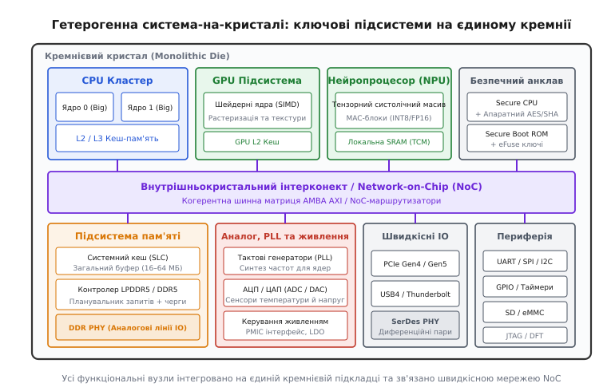
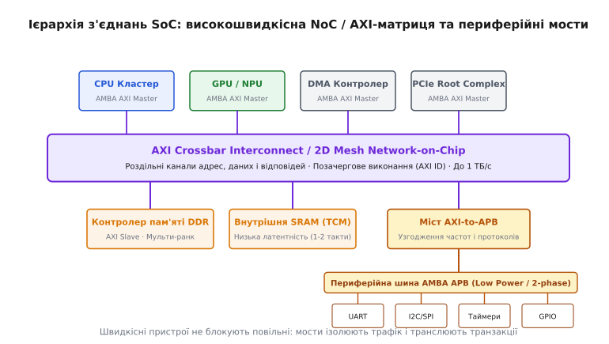
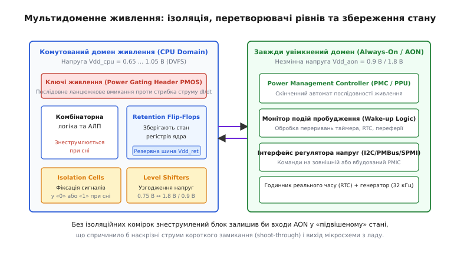
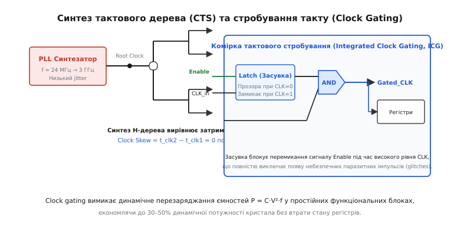
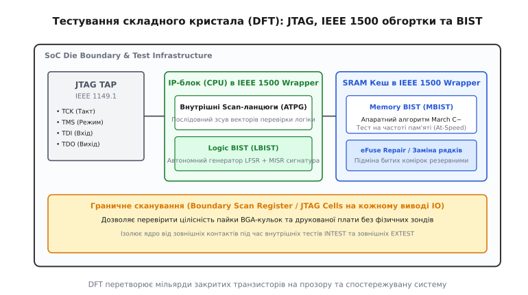

# Система-на-кристалі (SoC)

<preknowlist>
- [CMOS-технологія](topic:electronics/cmos) — комплементарні пари транзисторів як основа цифрових вентилів і статичного живлення.
- [Техпроцес та літографія](topic:electronics/process-node) — просторове масштабування елементів і фізичні обмеження кремнію.
- [Тестування й binning](topic:electronics/testing-binning) — перевірка кристалів на пластині та в корпусі через тестові структури.
- [Power gating і clock gating](topic:electronics/power-gating) — вимкнення живлення і тактування для усунення витоків.
</preknowlist>

Коли обчислювальну систему будують із дискретних мікросхем на друкованій платі (окремий процесор, графічний чіп, контролер пам'яті, аудіокодек та радіомодуль), кожен електричний зв'язок між ними проходить крізь виводи корпусів і мідні доріжки текстоліту. Мідна лінія довжиною лише кілька сантиметрів має власну паразитну ємність близько 10–20 пікофарад та індуктивність у десятки наногенрі. Перезаряджання цієї зовнішньої ємності при напругах 1.8–3.3 В вимагає від вихідних буферів значних струмів і витрачає від 10 до 50 пікоджоулів на кожен переданий біт (`10–50 пДж/біт`), обмежуючи швидкість передавання десятками або сотнями мегагерців через паразитні коливання та електромагнітні завади.

Якщо ж перенести всі ці функціональні вузли на єдину монолітну кремнієву пластинку (англ. *monolithic die*), відстані між блоками скорочуються з десятків сантиметрів до кількох сотень мікрометрів. Довжина внутрішньокристальних алюмінієвих або мідних з'єднань зменшується на три порядки, а їхня паразитна ємність падає до десятків фемтофарад (`10–50 фФ`). Енергія передавання біта інформації між процесором, кешем та графічним ядром знижується до `0.1–1 пДж/біт`, затримки поширення сигналу скорочуються до часток наносекунди, а ширина внутрішніх паралельних шин може досягати тисяч ліній, що фізично неможливо реалізувати на зовнішніх виводах мікросхеми. Таку повністю інтегровану обчислювальну систему на єдиному кристалі називають **системою-на-кристалі** (SoC, англ. *System-on-Chip*).

Проте об'єднання десятків різнорідних пристроїв на спільному кремнієвому субстраті створює безпрецедентну схемотехнічну складність. Цифрові ядра процесора, що перемикаються на частотах понад 3 ГГц при напругах 0.7–0.9 В, інжектують у кремнієву підкладку потужний високочастотний струмовий шум, здатний порушити роботу сусідніх чутливих аналогових генераторів PLL та радіотрансиверів із сигналами мікровольтного рівня. Різні функціональні блоки вимагають несумісних тактових частот і режимів живлення, а щільність виділення тепла на кристалі площею в 1 см² досягає значень ядерного реактора, що робить неможливою роботу кристала без багаторівневого керування живленням, складних тактових дерев та спеціалізованих тестових структур.

---

## Гетерогенна архітектура на монолітному кремнії

Головним принципом проектування сучасних SoC є **гетерогенність** (від грец. *heteros* — інший та *genos* — рід) — розміщення на одному кристалі спеціалізованих апаратних обчислювачів, кожен із яких оптимізований під свій клас алгоритмів.


*Гетерогенна система-на-кристалі: інтеграція процесорних ядер, графіки, прискорювачів, пам'яті, аналогових блоків та периферії на єдиному кремнієвому кристалі.*

### Класифікація основних обчислювальних вузлів
1. **Універсальні процесорні кластери (Application CPU Cores):**
   Будуються за ієрархічним принципом (наприклад, архітектура ARM DynamIQ або big.LITTLE). Кластер містить кілька високопродуктивних ядер із позачерговим виконанням інструкцій (Out-of-Order, великі площі кристала, глибші конвеєри) для швидкого відгуку операційної системи та складних однопотокових задач, а також групу енергоефективних ядер із послідовним виконанням (In-Order) для фонових процесів із мінімальним споживанням енергії.

2. **Графічні процесори (GPU) та блоки обробки зображень (ISP):**
   Масивно-паралельні архітектури класу SIMD/SIMT (Single Instruction, Multiple Data / Threads), що складаються з сотень паралельних арифметико-логічних пристроїв (АЛП). Оптимізовані для растеризації 3D-сцен, обчислення шейдерів та потокового перетворення сигналів матриці фотокамери (дебайєризація, шумозаглушення, корекція оптичних спотворень).

3. **Нейропроцесори (NPU) та цифрові сигнальні процесори (DSP):**
   Спеціалізовані тензорні прискорювачі, побудовані на базі систолічних масивів помножувачів із накопиченням (MAC, англ. *Multiply-Accumulate*). Вони оперують цілочисельними форматами низької розрядності (INT8, INT4) або спеціальними форматами з рухомою комою (BF16, FP8), забезпечуючи виконання десятків трильйонів операцій за секунду (TOPS) при споживанні всього 1–3 Вт.

4. **Безпечний анклав (Secure Enclave / Root of Trust):**
   Повністю апаратно ізольований мікроконтролер із власним захищеним ROM, локальною SRAM, апаратними криптографічними генераторами ключів (AES, SHA, ECC, TRNG) та масивом одноразово програмованих перемичок eFuse. Доступ до пам'яті анклаву апаратно заблокований для основного процесора, що гарантує захист ключів шифрування навіть у разі повної компрометації операційної системи.

5. **Підсистема оперативної пам'яті та системний кеш (SLC):**
   Містить багатоканальні контролери пам'яті LPDDR5/DDR5 та масивний системний кеш (System-Level Cache, SLC) об'ємом 16–64 МБ. Системний кеш діє як спільний високоефективний буфер для CPU, GPU та NPU, дозволяючи уникнути енерговитратних звернень до зовнішніх мікросхем DRAM. Аналоговий блок інтерфейсу пам'яті (DDR PHY) містить схеми автокалібрування затримок (Delay-Locked Loops, DLL), які компенсують фазовий розкид сигналів на лініях зв'язку з точністю до одиниць пікосекунд.

6. **Аналогові та змішані блоки (Analog & Mixed-Signal Islands):**
   Синтезатори частот на базі фазового автопідстроювання частоти (Phase-Locked Loop, PLL), джерела опорної напруги на ширині забороненої зони (Bandgap Voltage References), аналого-цифрові перетворювачі (ADC) для термодатчиків та контролю напруг, а також радіочастотні трансивери бездротового зв'язку (Wi-Fi, Bluetooth, 5G).

Щоб зрозуміти, як індустрія перейшла від багаточипових плат до монолітної гетерогенності, зверніться до окремої історичної довідки ([📜 історія переходу від розсипних плат до SoC](topic:electronics/system-on-chip/hist-soc-revolution.md)).

### Захист аналогових блоків від цифрового шуму субстрату
Під час перемикання мільйонів цифрових транзисторів виникають різкі кидки струму `dI/dt`, які через паразитні ємності переходів створюють імпульси напруги в кремнієвій підкладці (Substrate Noise). Якщо цей шум досягне прецизійного генератора PLL або вхідного підсилювача радіоканалу, виникне фазове тремтіння тактового сигналу (Jitter) та спотворення переданих даних.

Для фізичної ізоляції аналогових острівців застосовують такі топологічні заходи:
- **Глибокі N-кишені (Deep N-Well, DNW):** Аналогові NMOS-транзистори розміщують усередині потрійної кишені, яка електрично ізолює їхню локальну підкладку P-типу від загального об'єму кремнієвої пластини.
- **Охоронні кільця (Guard Rings):** Аналоговий блок оточують суцільними дифузійними кільцями, підключеними до окремих зовнішніх виводів «чистого» живлення та «чистої» землі (AVDD/AVSS), які збирають паразитні носії заряду до того, як вони досягнуть чутливих кіл.

---

## Внутрішньокристальні з'єднання та когерентність пам'яті

З'єднання десятків функціональних вузлів у єдину систему вимагає високопродуктивного внутрішньокристального інтерконекту та підтримки спільної узгодженості пам'яті.


*Ієрархічна структура з'єднань: високопродуктивна матриця AXI/NoC для пам'яті й ядер та мостові переходи на енергоефективну периферійну шину APB.*

### Еволюція шинної архітектури ARM AMBA
У простих системах з'єднання будувалися на базі шинних протоколів сімейства AMBA:
- **APB (Advanced Peripheral Bus):** Проста неконвеєрна шина для повільної периферії (UART, I2C, SPI), де кожна транзакція займає два такти (фаза Setup та фаза Access) без підтримки пакетних передавань.
- **AHB (Advanced High-performance Bus):** Конвеєрна шина з централізованим арбітром для мікроконтролерних систем. Вона дозволяє передавати одне слово за такт у пакетному режимі, проте залишається спільною середою: операції читання та запису не можуть виконуватися одночасно.
- **AXI4 (Advanced eXtensible Interface):** Сучасний стандарт високошвидкісного інтерконекту. AXI4 відмовляється від спільної шини на користь повнодуплексної матричної комутації з **п'ятьма незалежними односпрямованими каналами** (адреса читання AR, дані читання R, адреса запису AW, дані запису W, відповідь запису B).

Канали AXI4 використовують уніфіковане двостороннє квитування `VALID` / `READY` і підтримують позачергове виконання транзакцій завдяки ідентифікаторам `AXI ID`, що детально розглянуто в окремому розборі ([🔌 архітектура шин AMBA AXI та APB](topic:electronics/system-on-chip/comp-amba-axi.md)).

### Апаратна когерентність кешів (Cache Coherent Interconnect)
Коли центральний процесор CPU, графічне ядро GPU та контролер прямого доступу DMA одночасно працюють зі спільними масивами даних в оперативній пам'яті, виникає фундаментальна проблема узгодженості кешів: якщо процесор модифікує змінну у своєму локальному L1-кеші, контролер DMA або GPU, читаючи DRAM напряму, зчитають застаріле значення.

Для усунення цієї проблеми інтерконект SoC оснащують апаратним блоком когерентності (наприклад, ARM CoreLink CCI або CMN — Coherent Mesh Network), який реалізує протокол AMBA ACE (AXI Coherent Extensions) або CHI (Coherent Hub Interface):
- **Апаратне підглядання (Snoop Filter):** Централізована таблиця відстежує, які саме рядки пам'яті наразі завантажені у приватні кеші процесорів.
- **Прямий трансфер даних між кешами (Peer-to-Peer Cache Transfer):** Якщо ядро A запитує рядок, модифікований у кеші ядра B, блок когерентності перехоплює транзакцію і передає свіжі дані безпосередньо з кешу ядра B до ядра A без повільного запису в DRAM.

### Мережа на кристалі (Network-on-Chip, NoC)
Коли кількість комутованих майстрів перевищує 16–32 блоки, фізична реалізація матриці AXI Crossbar стає неможливою: довжина діагональних зв'язків перевищує лінійні розміри кристала, а затримка поширення сигналу по металевих провідниках перевищує період тактового сигналу процесора.

Рішенням стає **Network-on-Chip (NoC)** — організація зв'язків у вигляді регулярної пакетної мікромережі (найчастіше двовимірної сітки 2D Mesh). Кожен обчислювальний вузол з'єднується з локальним маршрутизатором (Router), а пакети даних розбиваються на елементарні одиниці керування потоком — **фліти** (Head Flit, Body Flits, Tail Flit). Маршрутизатори передають фліти за алгоритмом червоточинної комутації (Wormhole Switching) з розмірно-впорядкованою маршрутизацією XY, що гарантує відсутність тупикових блокувань.

Точний математичний апарат розрахунку манхеттенських відстаней, затримок черв'ячної комутації та пропускної здатності бісекції виведено у математичній вставці ([🧮 математична модель затримок і пропускної здатності NoC](topic:electronics/system-on-chip/math-noc-latency.md)).

---

## Мультидоменне керування живленням та DVFS

Сумарна потужність споживання цифрової CMOS-схеми складається з двох фундаментальних компонентів:

```
P_total = P_dyn + P_stat
P_dyn = α · C_L · V_dd² · f
P_stat = I_leak · V_dd
```

де `alpha` — коефіцієнт активності перемикання вентилів, `C_L` — сумарна комутована ємність навантаження, `V_dd` — напруга живлення, `f` — тактова частота, а `I_leak` — статичний струм витоку закритих транзисторів (підпороговий витік та тунелювання крізь тонкий діелектрик затвора).


*Мультидоменне живлення: взаємодія комутованого домену процесора із завжди увімкненим доменом AON через комірки ізоляції та силові ключі.*

### Острівці напруги (Voltage Islands) та домени живлення (Power Domains)
Оскільки динамічна потужність залежить від напруги **квадратично**, кристал ділять на незалежні домени:
1. **Постійно увімкнений домен (Always-On, AON):** Живиться від стабільної напруги і містить контролер керування живленням (Power Management Controller, PMC), годинник реального часу (RTC) та логіку виявлення подій пробудження (натискання кнопки, надходження мережевого пакета).
2. **Комутовані домени (Switchable Domains):** Окремі зони для процесорних ядер, GPU, NPU та відеокодеків. Кожен такий домен може бути повністю знеструмлений за допомогою силових ключів (Power Gating) або переведений на індивідуальну напругу.

### Граничні комірки між доменами
Для безпечної взаємодії між доменами з різними напругами та станами живлення застосовують обов'язковий набір спеціальних комірок:
- **Комірки ізоляції (Isolation Cells):** Вентилі, які при знеструмленні домену примусово фіксують його вихідні лінії у стабільному нулі або одиниці, не дозволяючи плаваючим напругам відкрити транзистори у сусідньому ввімкненому блоці.
- **Перетворювачі рівнів (Level Shifters):** Транслюють амплітуду логічних сигналів між доменами з різними робочими напругами (наприклад, 0.75 В у 1.8 В) без виникнення витоків.
- **Ретеншн-тригери (Retention Flip-Flops):** Тригери з додатковою низькоспоживаючою засувкою, що живиться від резервної шини. Вони зберігають внутрішній регістровий стан ядра перед вимкненням живлення, що дозволяє відновити роботу за лічені мікросекунди без перезавантаження.

### Динамічне масштабування напруги й частоти (DVFS)
Коли обчислювальне навантаження падає, контролер живлення одночасно знижує і тактову частоту, і напругу живлення за попередньо визначеною таблицею робочих точок (Operating Performance Points, OPP). Зменшення напруги вдвічі знижує динамічне споживання у чотири рази.

Практичну програмну реалізацію низькорівневого драйвера керування живленням та скінченного автомата перемикання точок OPP мовами C та C++ розібрано в окремому проекті ([⚙️ контролер керування живленням та DVFS](topic:electronics/system-on-chip/proj-soc-power-dvfs.md)).

---

## Тактові дерева (CTS), тактове стробування та міждоменна синхронізація

Тактовий сигнал є найважливішим координатором роботи мільярдів синхронних тригерів на кристалі.


*Синтез збалансованого тактового дерева H-Tree та усунення динамічних втрат енергії за допомогою комірок тактового стробування ICG.*

### Синтез тактового дерева (Clock Tree Synthesis, CTS)
Тактовий сигнал високої частоти (2–4 ГГц) синтезується аналоговим генератором PLL із низькочастотного сигналу опорного кварцового резонатора (24–48 МГц). Далі цей такт необхідно розвести до мільйонів тригерів, розташованих у різних кутках чіпа.

Фізична довжина провідників до різних тригерів відрізняється, що створює просторову різницю в часі надходження тактового фронту — **перекіс такту (Clock Skew)**:

```
t_skew = t_clk(FF2) − t_clk(FF1)
```

Якщо `t_skew` перевищить затримку логіки між двома тригерами, виникне порушення часу утримання (**Hold Time Violation**): другий тригер перезапишеться новими даними до того, як зафіксує старі, що призведе до фатального збою логіки на будь-якій частоті. Для мінімізації перекосу алгоритми CTS синтезують симетричні деревоподібні структури (H-Tree) з регулярною вставкою буферних інверторів, вирівнюючи час поширення такту по всьому кристалу з точністю до десятків пікосекунд.

### Тактове стробування (Clock Gating)
Близько 40–60% усієї динамічної енергії кристала витрачається на марне перезаряджання ємностей тактового дерева та вхідних затворів тригерів, навіть коли стан регістрів не змінюється.

Для усунення цих втрат застосовують інтегровані комірки тактового стробування (Integrated Clock Gating, ICG). Комірка ICG складається з прозорої по низькому рівню засувки (Latch) та вентиля AND. Засувка блокує перемикання сигналу дозволу `Enable` під час високого рівня такту, що повністю виключає появу небезпечних коротких паразитних імпульсів (глітчів) на виході `Gated_CLK`. Завдяки ICG невикористовувані функціональні блоки повністю вимикають своє динамічне споживання без втрати даних у регістрах.

### Перетин тактових доменів (Clock Domain Crossing, CDC)
Коли дані передаються між блоками, що працюють від різних незалежних генераторів PLL, виникає небезпека **метастабільності**: якщо вхідний сигнал зміниться в момент висхідного фронту приймального такту (порушення вікна `t_setup` / `t_hold`), внутрішній тригер приймача може зависнути у проміжному стані між нулем і одиницею на невизначений час.

Для безпечного перетину доменів застосовують спеціальні схемотехнічні бар'єри:
- **Двотригерні синхронізатори (2-FF Synchronizers):** Послідовне увімкнення двох тригерів на приймальній стороні дає метастабільному стану першого тригера час експоненційно затухнути до надійного логічного рівня, збільшуючи середній час між збоями (MTBF) до тисяч років. Застосовується для одиночних керувальних бітів.
- **Асинхронні FIFO на коді Грея:** Для передавання багаторозрядних шин даних використовують двопортову буферну пам'ять SRAM із роздільними тактовими сигналами запису й читання. Покажчики запису та читання кодуються циклічним кодом Грея, у якому при зміні значення на одиницю змінюється **лише один двійковий біт**. Це гарантує, що приймач ніколи не зчитає спотворене проміжне значення адреси буфера.

---

## Фізичне проектування: від планування підлоги (Floorplanning) до масок

Перетворення поведінкового коду Verilog у реальний кремнієвий кристал здійснюється за суворим маршрутом фізичного проектування (Physical Design Flow):

1. **Планування топологічної структури (Floorplanning):**
   Інженери визначають геометричні межі кристала та розміщують макроси жорсткої інтелектуальної власності (Hard IP): матриці пам'яті SRAM кешів, блоки PLL, контактні площадки введення-виведення (I/O Pads) та аналогові блоки DDR PHY. Навколо макросів залишають захисні зони (Halos) для прокладання трасувальних магістралей.

2. **Сітка розподілу живлення (Power Grid Synthesis):**
   На верхніх товстих металевих шарах (наприклад, шарах M7–M11) проектують масивну ортогональну сітку силових шин `Vdd` та `Vss`. Товсті верхні шари мають мінімальний опір, що запобігає динамічному просіданню напруги (Dynamic IR-Drop) під час пікових струмових сплесків та виключає явище електроміграції (руйнування металевих провідників потоком електронів).

3. **Розміщення стандартних комірок (Placement):**
   САПР автоматично розставляє мільйони базових вентилів (NAND, NOR, DFF, MUX) у регулярні ряди standard-cells, мінімізуючи сумарну довжину з'єднань (Wirelength) та усуваючи локальні зони надмірної концентрації вентилів (Congestion).

4. **Трасування з'єднань (Global & Detailed Routing):**
   Алгоритми детального трасування розводять напівпровідникові зв'язки по координатах сітки літографії, вставляючи міжшарові перехідні отвори (Vias). При цьому контролюється паразитний ємнісний зв'язок між сусідніми паралельними лініями: для швидкісних критичних шин застосовують просторове екранування (Shielding) земляними лініями `Vss` для усунення перехресних наведень (Crosstalk Noise).

5. **Фізична верифікація (DRC / LVS / Tape-Out):**
   Перед передачею файлів масок у форматі GDSII/OASIS на фабрику топологія проходить автоматичні перевірки:
   - **DRC (Design Rule Check):** Перевірка дотримання геометричних правил фабрики (мінімальна ширина ліній, мінімальні зазори між полікремнієм і металізацією).
   - **LVS (Layout Versus Schematic):** Вилучення електричної схеми з накресленої геометрії та її повузлове порівняння з вихідною принциповою схемою.

---

## Апаратна безпека: довірене завантаження та шифрування пам'яті

Сучасна система-на-кристалі є головним сховищем біометричних даних, банківських ключів та конфіденційної інформації користувача, тому захист інтегровано безпосередньо в апаратну структуру чіпа.

### Ланцюжок довіреного завантаження (Secure Boot Chain)
Процес старту SoC починається з абсолютно незмінного апаратного кореня довіри (Hardware Root of Trust):
1. **Масочне ROM (Boot ROM):** Програма первинного завантажувача витравлена безпосередньо у фізичному шарі металізації кристала під час виробництва і не може бути модифікована жодним програмним вірусом.
2. **Перевірка відбитків ключів (eFuse Hash Verification):** При першому включенні процесор зчитує з масиву eFuse публічний хеш сертифіката виробника. Завантажувач Boot ROM перевіряє цифровий підпис другого ступеня завантажувача (BL1) за допомогою вбудованого криптографічного прискорювача SHA/RSA/ECC.
3. Якщо підпис не збігається хоча б на один біт, апаратний автомат безпеки миттєво зупиняє генерацію тактових сигналів і блокує живлення кристала.

### Апаратне шифрування шини DRAM (Inline Memory Encryption)
Оскільки зовнішні мікросхеми DRAM розташовані за межами кристала SoC на платі або в корпусі Package-on-Package (PoP), зловмисник може фізично перехопити дані на виводах за допомогою логічного аналізатора або охолодити мікросхему пам'яті рідким азотом для вилучення ключів (Cold Boot Attack).

Для нейтралізації цієї загрози сучасні контролери пам'яті оснащують конвеєрним блоком апаратного шифрування (наприклад, AES-XTS або Speck). Дані шифруються апаратним ключем прямо на льоту під час запису в DRAM і миттєво розшифровуються під час завантаження в системний кеш SLC, не додаючи помітної затримки до циклу читання.

---

## Сучасна еволюція: від моноліту до чіплетних модулів (Chiplets)

Коли загальна площа монолітного кристала наближається до фізичної межі літографічного сканера (Reticle Limit близько 858 мм²), вихід придатних кристалів (Yield) стрімко падає через випадкові точкові дефекти кремнієвої пластини. Виготовлення величезного кристала площею 800 мм² на найдорожчому техпроцесі 3 нм стає економічно невигідним.

Сучасною відповіддю на цю кризу є перехід до модульної архітектури **чіплетів (Chiplets)**:
- Обчислювальні ядра CPU, GPU та NPU виготовляють у вигляді невеликих окремих кремнієвих кристалів площею 50–100 мм² за найновішим передовим техпроцесом (N3/N2), де щільність транзисторів є найвищою.
- Контролери введення-виведення, радіомодулі та контролери пам'яті DDR виготовляють окремими чіплетами за дешевшим зрілим техпроцесом (N6/N12), оскільки аналогові транзистори не масштабуються при зменшенні літографічної норми.
- Усі чіплети монтують на спільну кремнієву проміжну підкладку (Silicon Interposer за технологією TSMC CoWoS або Intel EMIB) і з'єднують високошвидкісним відкритим стандартом інтерконекту **UCIe (Universal Chiplet Interconnect Express)**.

---

## Тестування складного кристала (DFT) та вбудований самоконтроль (BIST)

У кристалі з десятками мільярдів транзисторів неможливо перевірити працездатність внутрішньої логіки через кількасот зовнішніх контактних площадок за допомогою класичних функціональних тестів. Для забезпечення 100% контролю якості на етапі фабричного виробництва до архітектури SoC закладають спеціальні структури для проектування під тестування (Design for Testability, DFT).


*Інфраструктура тестування DFT: стандартизований доступ JTAG, тестові обгортки блоків IEEE 1500, scan-ланцюги та вбудовані генератори самотестування BIST.*

### Scan-ланцюги та автоматична генерація тестових векторів (ATPG)
У режимі тестування всі звичайні робочі тригери кристала перемикаються вбудованими мультиплексорами у довгі послідовні зсувні регістри — **Scan Chains**.

Тестовий цикл складається з трьох фаз:
1. **Зсув вхідного вектора (Shift-In):** Крізь один тестовий вивід у тисячі послідовно з'єднаних тригерів зсувом записують тестову комбінацію (забезпечуючи 100% керованість внутрішніх вузлів, *Controllability*).
2. **Захоплення результату (Capture):** Схема перемикається у робочий режим рівно на один такт системного годинника. Комбінаторна логіка виконує перетворення, і результат фіксується у тригерах.
3. **Виштовхування відповіді (Shift-Out):** Стан тригерів послідовно зсувається назовні для порівняння з еталоном (забезпечуючи повну спостережуваність, *Observability*).

Спеціальні програми автоматичної генерації тестових векторів (ATPG) розраховують мінімальний набір вхідних комбінацій, здатний виявити дефекти типу «константа 0/1» (Stuck-At Faults) та дефекти затримок перемикання (At-Speed Delay Faults).

### Вбудований самоконтроль пам'яті та логіки (BIST)
- **Memory BIST (MBIST):** Оскільки до 60–70% площі сучасного SoC займає пам'ять SRAM кешів, зовнішнє тестування пам'яті через виводи кристала вимагало б занадто багато часу на дорогому тестовому обладнанні (ATE). Блок MBIST є вбудованим апаратним автоматом, який самостійно генерує складні алгоритми заповнення та зчитування матриці (наприклад, алгоритм March C− або Checkerboard) на повній робочій частоті пам'яті. При виявленні пошкоджених комірок MBIST автоматично перепалює мікроперемички eFuse, підміняючи дефектні рядки матриці резервними рядками (Redundancy Repair).
- **Logic BIST (LBIST):** Вбудований лінійний регістр зсуву зі зворотним зв'язком (LFSR) генерує мільйони псевдовипадкових тестових векторів для цифрової логіки, а багатовходовий сигнатурний регістр (MISR) стискає отримані результати в коротку 32-бітну сигнатуру, яка звіряється з еталоном.

### Стандарти IEEE 1149.1 (JTAG) та IEEE 1500
Для стандартизації доступу до тестових ресурсів кристал обладнують портом доступу до тестів (Test Access Port, TAP) стандарту IEEE 1149.1 (JTAG), що працює через 4 фізичні виводи (`TCK`, `TMS`, `TDI`, `TDO`).

Кожен сторонній ліцензований IP-блок (процесорне ядро, графічний прискорювач) оточують стандартизованою обгорткою **IEEE 1500 Wrapper**. Обгортка містить регістри граничного сканування ядра, що дозволяє ізолювати окремий блок і повністю протестувати його незалежно від оточення кристала (Core-Internal Test), а потім протестувати міжблочні зв'язки (Core-External Test).

---

> 🔧 **Навіщо це.** Створення системи-на-кристалі — це мистецтво пошуку компромісу між обчислювальною потужністю, енергоспоживанням, площею кремнію та цілісністю сигналів. Розуміння внутрішньої структури SoC дозволяє системному програмісту та інженеру вбудованих систем писати код, який усвідомлює фізичну природу заліза: прив'язувати потоки обчислень до відповідних гетерогенних ядер, ефективно використовувати системний кеш SLC замість нераціональних звернень до DRAM, коректно налаштовувати точки DVFS і враховувати часові затримки перемикання доменів живлення.
