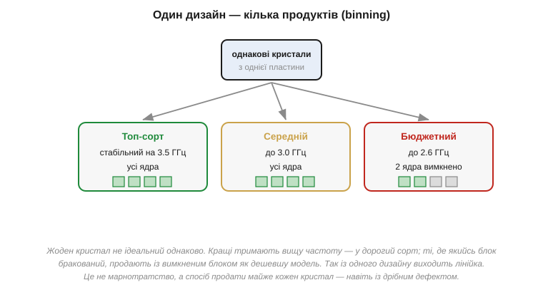

# Тестування й binning: один кристал — кілька продуктів

Кристали з однієї пластини виходять **різні**. Одні бездоганні, інші з дрібним дефектом у якомусь блоці, треті працюють, але не тримають високої частоти, четверті споживають трохи більше за норму. Це прямий наслідок статистичної природи виробництва — повна однаковість недосяжна, і частка бездоганних кристалів (тобто [вихід придатних](book:electronics/yield)) майже завжди менша за сто відсотків. Постає питання: що з усім цим розкидом робити? Найгірша відповідь — викидати все, що не ідеальне; вона руйнівно дорога, бо бездоганних кристалів буває меншість.

Індустрія робить розумніше: **тестує** кожен кристал і **сортує** його за реальними можливостями, перетворюючи розкид якості з біди на **товарний асортимент**. Замість боротися з тим, що кристали різні, вона цю різницю **продає**: кращі — дорожче, гірші — дешевше, дефектні — з вимкненою ваддю ще дешевше. Цей сорт-розподіл називають **binning** (від англ. *bin* — «кошик», «сорт»: кристали ніби розкладають по кошиках за якістю), і саме завдяки йому з **одного** дизайну кристала виходить ціла лінійка продуктів за різною ціною. Розберімо, як кристали перевіряють і як той самий шматок кремнію стає то дорогою, то дешевою моделлю.

### Спершу — перевірити кожен

Перш ніж сортувати, треба виміряти. Тестування починається ще на пластині, до того як її розріжуть на окремі кристали.


*Рис. **Зондовий контроль** (wafer probe): на контактні площадки кожного кристала прямо на пластині опускають тонкі голки **зондової карти**, подають живлення й проганяють тести. Несправні кристали одразу позначають. Результат — **карта пластини** (bin map): для кожного кристала записано, придатний він, до якого сорту належить чи бракований. Так відсіюють брак ще до різання й корпусування, щоб не витрачати грошей на завідомо мертві кристали.*

Логіка раннього тесту суто економічна. [Запакувати кристал у корпус](book:electronics/packaging) коштує грошей, тож **немає сенсу** пакувати той, який і так не працює, — це викинуті гроші на упаковку мерця, а заразом і марно зайняте місце на тестері й конвеєрі. Дешевше відсіяти брак якомога **раніше**, поки в кристал не вклали ще й вартість корпуса. Тому спершу роблять **зондовий контроль** (*wafer probe*, або *wafer sort*): спеціальна «зондова карта» з безліччю тонесеньких голок-щупів торкається контактних площадок кожного кристала прямо на нерозрізаній пластині, подає живлення й тестові сигнали й дивиться на відповідь. По суті, голки заміняють майбутні виводи й «розмовляють» із кристалом ще до того, як його відрізали від пластини, — як видно на малюнку вище. Кристал, що провалив тест, позначають — на пластині будується **карта придатності** (bin map). Після різання браковані кристали просто відкидають, а решту пакують.

Та сам тест не зводиться до «живий/мертвий». Це повноцінний іспит: кристалові подають десятки, ба сотні тисяч тестових векторів (готових комбінацій входів із наперед відомою правильною відповіддю), щоб упевнитися, що **кожен** його блок рахує правильно, а не лише «вмикається». Як узагалі перевірити мільярд транзисторів через жменю контактів, не маючи доступу до кожного зокрема, — окрема хитра інженерна задача (її розв'язок, scan chain, винесено в ⚙️-вставку до теми). Водночас вимірюють і **аналогові** межі: на якій **частоті** кристал ще працює стабільно, за **якої напруги** живлення, скільки **споживає**, чи не гріється надміру, які блоки цілі, а які ні. Тест триває секунди на кожен кристал, а кристалів — мільйони, тож швидкість і вартість тестування самі стають важливим чинником економіки. Саме ці виміри — функціональність, частота, напруга, цілість блоків — і стають підставою для сортування.

### Сортування за швидкістю й дефектами

Ось де відбувається головна магія: розкид якості перетворюється на лінійку продуктів.


*Рис. **Binning**: однакові кристали з однієї пластини сортують за результатами тесту. Ті, що тримають високу частоту з усіма справними блоками, ідуть у **топ-сорт** (дорожчий). Ті, що стабільні лише на нижчій частоті, — у середній. А кристали, де якийсь блок (наприклад, одне з ядер) **бракований**, продають із **вимкненим** цим блоком як дешевшу модель. Так із одного дизайну виходить ціла лінійка — і майже жоден кристал не марнується.*

Тут — два різні механізми сортування, і обидва красиві. Перший — **за частотою**: через неминучий [розкид параметрів процесу](book:electronics/yield) одні кристали стабільно працюють на вищій тактовій частоті, ніж інші, хоч схема в них однакова й вони з тієї самої пластини. Звідки розкид? Дрібні відхилення товщини оксиду, дози легування, ширини доріжок від місця до місця на пластині (і навіть від центру до краю одного диска) роблять одні транзистори трішки «жвавішими», інші — «млявішими». Поодинці ці відхилення мізерні, та помножені на мільярди транзисторів і зведені докупи, вони складаються в помітно різну максимальну частоту цілого кристала — один упевнено бере високу планку, сусід на тій самій планці вже збоїть. Кращі за цим показником («швидкий кремній») маркують вищою частотою й продають дорожче; повільніші — нижчою й дешевше. Це чистий binning за якістю: продукт той самий, відрізняється лише гарантована частота, на якій виробник ручається за безпомилкову роботу.

Другий механізм — **вимкнення дефектних блоків**, і він прямо рятує кристали, що інакше пішли б у відходи. Тут у пригоді стає те, що сучасні чипи навмисно будують з багатьох **однакових** повторюваних блоків — кількох ядер, багатьох банків кешу, масивів обчислювачів. Така регулярність зручна не лише для проєктування, а й для рятунку: якщо в кристалі з кількома однаковими блоками один виявився бракованим, а решта ціла, увесь кристал **не викидають** — натомість мертвий блок назавжди вимикають (перепалюють крихітні перемички чи виставляють конфігурацію) і продають чіп як модель «з меншою кількістю ядер». Кристал, що мав стати восьмиядерним, але з одним мертвим ядром, стає цілком справним шестиядерним і знаходить свого покупця. Часом виробник навіть вимикає **справні** блоки — коли дешевших моделей бракне на ринку, а дорогих кристалів забагато: тоді добрий кристал свідомо «урізають» до молодшої моделі. Це вже чистий ринковий розрахунок, а не дефект, — і саме звідси беруться легенди про «розблоковування» прихованих ядер. Так увесь розкид виробництва монетизується: замість викидати все, що не ідеальне, індустрія знаходить полицю майже для кожного кристала.

Закріпімо кількісну логіку binning маленьким прикладом — він показує, наскільки це вигідно.

**Приклад (вихід восьмиядерних кристалів).** Нехай великий восьмиядерний кристал має вихід **повністю** справних (усі 8 ядер цілі) лише 40%. Ще 35% кристалів мають рівно одне браковане ядро, а 15% — два. Скільки кристалів можна **продати**, якщо є моделі на 8, 6 і 4 ядра?

```
Повністю справні (8 ядер):        40%  →  модель «8 ядер»  (топ)
Рівно одне мертве ядро:           35%  →  модель «6 ядер»  (вимкнули 2)
Два мертвих ядра:                 15%  →  модель «4 ядра»  (вимкнули 4)
                                  ----
Придатні до продажу:              90%

Брак (≥3 мертвих ядра, інше):     10%  →  у відходи
```

Без binning придатними були б лише **40%** кристалів (тільки ідеальні) — решту довелося б викинути, і кожен проданий чіп мусив би «відбити» вартість майже двох мертвих. З binning продається **90%**: ті самі дефектні кристали стають дешевшими, але цілком реальними моделями на 6 і 4 ядра. Собівартість одного проданого кристала падає більш ніж удвічі — ось чому binning не примха маркетингу, а пряме економічне продовження [статистики дефектів і виходу придатних](book:electronics/yield).

Зверніть увагу й на зворотний бік цієї логіки — він пояснює дещо, що часто дивує покупців. Молодші, дешевші моделі тут — не «гірший товар», спеціально зроблений поганим, а той **самий** кремній, лише з природним дефектом або свідомо вимкненою частиною. Виходить майже парадокс: дешева модель і дорога народжуються на одній пластині, з одного дизайну, за ті самі гроші виробництва, а різниця в ціні відображає не різницю в собівартості, а **готовність ринку платити** за вищу якість і повноту. Виробникові вигідно мати всю лінійку: топові кристали збирають вершки з тих, кому потрібна максимальна продуктивність, а молодші — охоплюють масовий ринок, заразом рятуючи дефектні кристали від смітника. Це елегантний спосіб видобути максимум цінності з неминучого розкиду — і тепер, бачачи в магазині лінійку «однакових, але різних» чипів, ви розумієте, що насправді за нею стоїть.

### Тестують двічі, а слабких відсіюють заздалегідь

Зондовий контроль — лише **перший** іспит, на пластині. Коли кристал уже [вкладено в корпус](book:electronics/packaging), його перевіряють **ще раз** — це **фінальний тест** уже запакованого чипа. Навіщо двічі? Бо корпусування саме по собі може щось пошкодити (дротик відірвався, кулька припою не лягла, кристал тріснув при монтажі), тож готовий чіп зобов'язаний пройти повний іспит наново, на своїх справжніх виводах і на робочих частотах. Лише той, хто склав обидва іспити, їде до замовника.

Є й третій, тонший рівень відбору. Частина чипів справні **зараз**, але мають приховану ваду, що проявиться за тиждень чи місяць роботи, — так звана дитяча смертність електроніки (раптові ранні відмови приладів, що з виду були нормальні). Щоб такі не дісталися виробу, відповідальні чіпи (для авто, медицини, серверів) ганяють під підвищеною температурою й напругою кілька годин — це **припрацювання** (*burn-in*). Ідея в тому, що жорсткий режим **прискорює старіння**: слабка ланка, яка в полі здалася б за місяці, тут здається за години — і гине на стенді, а не в готовому пристрої. Виживають лише ті, що це випробування витримали, — на них можна покластися надовго.

Так формується поняття **гарантовано-доброго кристала** (*known-good die*) — особливо важливе для [чиплетів](book:electronics/yield). Логіка тут невблаганна: якщо ви збираєте дорогий корпус із кількох кристалів, кожен із них мусить бути перевірений **до** складання, бо один поганий занапастить увесь дорогий збір — а викинути доведеться вже не один кристал, а цілий зібраний модуль із кількох справних сусідів. Що дорожчий і складніший збір, то критичніше впевнитися в кожному кристалі заздалегідь; тому тестування й чиплетна інтеграція ростуть пліч-о-пліч.

Звідси й проста економічна істина: **тестування саме по собі коштує грошей** — і часу на дорогих тестерах, і стендів припрацювання. Для дешевого масового чипа довгий тест економічно не виправданий, тож його тестують коротко; для відповідального — навпаки, перевіряють прискіпливо, і ця перевірка помітно додає до ціни. Тому той самий за кристалом чіп у «промисловому» чи «автомобільному» виконанні дорожчий за «споживчий» не лише через відбір за температурним діапазоном, а й через значно ретельніше тестування.

> 🔧 **Навіщо це.** Binning пояснює багато з того, що ви бачите на ринку чипів. Перше: **чому той самий за архітектурою процесор продають у кількох версіях** (різні частоти, різна кількість ядер) за різною ціною — це не різні кристали, а **відсортовані** за якістю однакові; розуміючи це, ви тверезіше обираєте модель під задачу. Друге: **чому дешевша модель часто розганяється до дорожчої** — бо фізично це може бути той самий «хороший» кристал із вимкненими (іноді цілком справними) блоками; звідси й уся культура розгону. Третє: **чому промислові й автомобільні версії дорожчі** — за ними стоїть жорсткіший відбір і припрацювання (burn-in), а не лише ширший діапазон температур; для надійних виробів це варто закладати в кошторис. Четверте, проєктне: лінійка мікроконтролерів з різним обсягом пам'яті чи периферії нерідко **росте з одного кристала** з частково задіяними блоками — тому «молодші» моделі бувають несподівано здатні на більше. А загальний урок: виробництво **витискає цінність із розкиду**, замість боротися за недосяжну однаковість, — той самий інженерний прагматизм, що й скрізь у мікроелектроніці.