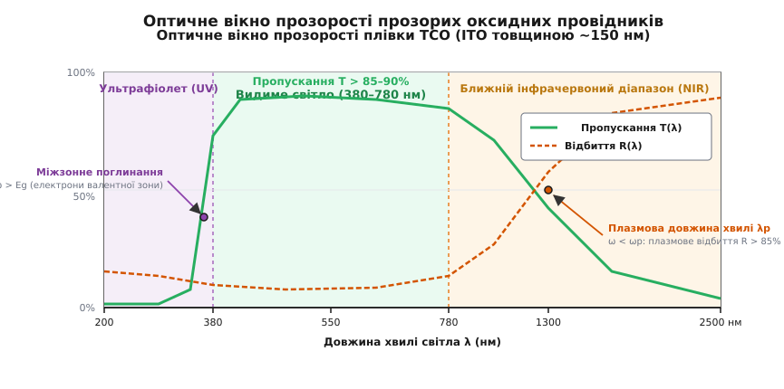
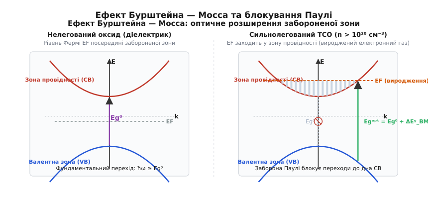
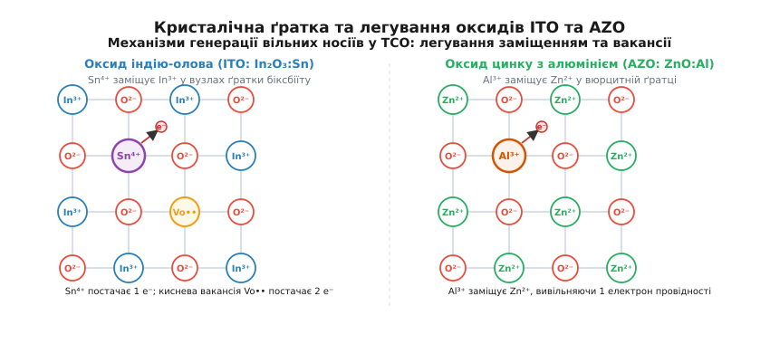
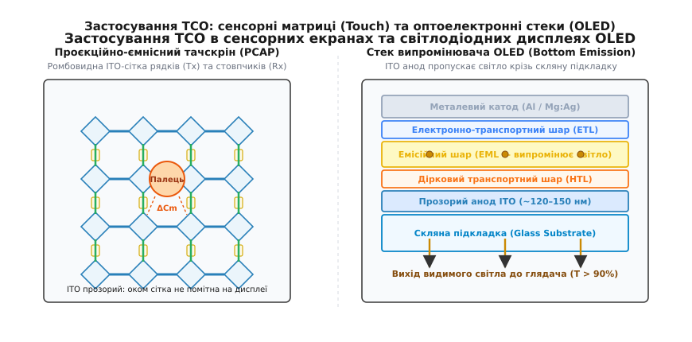

# Прозорі провідники

<preknowlist>
- [Закон Ома](book:electronics/ohms-law) — лінійний зв'язок напруги, струму та опору провідника.
- [Напівпровідник](book:physics/semiconductor) — зонна структура твердого тіла, валентна зона та зона провідності.
- [Модель Друде](book:physics/drude-model) — динаміка вільного електронного газу та його взаємодія з електромагнітним полем.
- [Легування та металізація](book:electronics/doping-etching-metal) — внесення домішок для генерації носіїв заряду.
</preknowlist>

Щоб сенсорний екран смартфона реагував на дотик, піксель OLED-матриці випромінював світло назовні, а кремнієвий сонячний елемент збирав згенеровані фотоструми, на їхній передній поверхні має бути електричний контакт. Цей контакт зобов'язаний проводити струм із поверхневим опором менше 10–50 Ом/кв і водночас пропускати крізь себе не менше 85–90% фотонів видимого світла в діапазоні довжин хвиль від 380 до 780 нм.

У класичній фізиці твердого тіла ці дві вимоги суперечать одна одній. Звичайні метали (мідь, алюміній, срібло) мають високу концентрацію електронів провідності (`n ≈ 10²²–10²³` см⁻³), через що вони повністю відбивають видиме світло й діють як оптичні дзеркала. З іншого боку, прозорі діелектрики (кварц, скло) вільно пропускають фотони, але мають питомий опір понад `10¹⁴` Ом·см через відсутність вільних носіїв. Прозорі провідники (Transparent Conductors) розв'язують цей парадокс шляхом створення виродженого напівпровідника з точно підібраною шириною забороненої зони та строго контрольованою концентрацією електронів.


*Оптичне вікно прозорості: міжзонне поглинання обмежує ультрафіолет, а плазмова частота електронів Друде визначає край відбиття в інфрачервоній області.*

## Оптико-електронний компроміс і фізичні межі прозорості

Прозорість будь-якого матеріалу у видимому діапазоні вимагає, щоб падаючі фотони з енергіями від `E = 1.59` еВ (червоне світло, `λ = 780` нм) до `E = 3.26` еВ (фіолетове світло, `λ = 380` нм) не поглиналися речовиною. У напівпровідниках головним джерелом оптичного поглинання є фундаментальний міжзонний перехід — перекидання електрона з валентної зони в зону провідності за умови `ħ · ω ≥ E_g`.

Якщо заборонена зона `E_g` вужча за 3.1–3.2 еВ, кристал поглинає частину видимого спектра: наприклад, кремній (`E_g = 1.12` еВ) і арсенід галію (`E_g = 1.42` еВ) є повністю непрозорими темними кристалами, а нітрид галію (`E_g = 3.4` еВ) та діоксид титану (`E_g = 3.2` еВ) виглядають прозорими або білими. Отже, першою обов'язковою умовою прозорого провідника є широка заборонена зона:

```
E_g > 3.2 еВ
```

Друга вимога полягає в забезпеченні високої питомої електричної провідності `σ`, яка визначається формулою Друде:

```
σ = n · e · μ
```

де `n` — об'ємна концентрація носіїв заряду, `e` — елементарний заряд, а `μ` — дрейфова рухливість носіїв. Щоб отримати низький питомий опір `ρ = 1 / σ ≈ 10⁻⁴` Ом·см (порівнянний із металами), необхідно або максимально збільшувати концентрацію `n`, або піднімати рухливість `μ`.

Тут виникає фундаментальний конфлікт, керований законами електродинаміки плазми: вільні електрони в зоні провідності утворюють електронний газ, який коливається у змінному полі світлової хвилі. Згідно з моделлю Друде, циклічна плазмова частота цього газу `ω_p` дорівнює:

```
ω_p = √( (n · e²) / (ε₀ · ε_inf · m*) )
```

де `ε₀` — електрична стала, `ε_inf` — високочастотна діелектрична проникність кристалічної ґратки, а `m*` — ефективна маса електрона провідності. 

Коли частота світла `ω` менша за `ω_p` (довгохвильова область), дійсна частина діелектричної проникності стає від'ємною (`ε₁(ω) < 0`), і плівка відбиває електромагнітну хвилю, як дзеркало. Коли ж `ω > ω_p`, матеріал пропускає випромінювання.

Довжина хвилі плазмового краю `λ_p = (2 · π · c) / ω_p` встановлює червону (довгохвильову) межу прозорості. Якщо концентрацію носіїв `n` перевищити понад `(1–2) × 10²¹` см⁻³, плазмова довжина хвилі `λ_p` зміститься з інфрачервоного діапазону у видимий червоний або зелений спектр, і плівка втратить прозорість, перетворившись на метал.

Таким чином, прозорі провідні оксиди (Transparent Conducting Oxides, TCO) можуть існувати лише у строгому вікні концентрацій електронів:

```
10¹⁹ см⁻³ ≤ n ≤ 1.5 × 10²¹ см⁻³
```

Нижня межа обумовлена необхідністю отримати прийнятний електричний опір, а верхня — неприпустимістю зміщення плазмового відбиття у видиму область. Більш детальний аналіз математичного зв'язку між параметрами Друде, оптичною екстинкцією та діелектричною проникністю наведено у [вставці про модель Друде та плазмове відбиття](book:electronics/transparent-conductor/math-drude-plasma.md).

## Вироджений електронний газ та ефект Бурштейна — Мосса

У нелегованому широкозонному напівпровіднику (наприклад, чистому монокристалічному In₂O₃ чи ZnO) власна концентрація носіїв за кімнатної температури мізерно мала (`n_i < 10⁸` см⁻³), тому чистий оксид є чудовим ізолятором. Щоб перетворити його на провідник, у ґратку вводять донорні домішки у величезній кількості — до кількох атомних відсотків.

Коли концентрація донорів перевищує ефективну густину станів на дні зони провідності `N_c ≈ 10¹⁹` см⁻³, відстань між домішковими атомами стає меншою за ефективний борівський радіус електрона `a_B* ≈ 1.3–1.5` нм. Відбувається перехід Мотта: хвильові функції сусідніх донорів перекриваються, дискретні донорні рівні розмиваються в суцільну зону, яка зливається з дном зони провідності.

Матеріал переходить у стан виродженого напівпровідника (фактично прозорого металу). Рівень Фермі `E_F` виходить із забороненої зони й занурюється вглиб зони провідності на глибину `E_F - E_c = 0.5–1.2` еВ.


*Ефект Бурштейна — Мосса: вироджене заповнення станів на дні зони провідності блокує оптичні переходи за принципом Паулі, розширюючи оптичну щілину до ультрафіолету.*

Це виродження породжує ключовий оптичний ефект — зсув Бурштейна — Мосса (Burstein-Moss Shift, названий на честь Еліаса Бурштейна та Тревора Мосса, які незалежно описали його у 1954 році). За принципом заборони Паулі два ферміони не можуть перебувати в одному квантовому стані. Оскільки всі рівні в зоні провідності від дна `E_c` до рівня Фермі `E_F` уже зайняті електронами, оптичний перехід електрона з валентної зони під дією світла можливий лише у вільні стани над рівнем Фермі.

У результаті мінімальна енергія фотона, здатного викликати міжзонне поглинання, зростає:

```
E_g^{opt} = E_g^0 + ΔE_g^{BM}
```

де `E_g^0` — вихідна ширина забороненої зони нелегованого кристала, а величина зсуву Бурштейна — Мосса `ΔE_g^{BM}` залежить від концентрації носіїв `n` та зведеної ефективної маси `m_vc*`:

```
ΔE_g^{BM} = (ħ² / (2 · m_vc*)) · (3 · π² · n)^(2/3)
```

де `1 / m_vc* = 1 / m_c* + 1 / m_v*`. Завдяки цьому ефекту сильне донування оксиду індію збільшує ефективну оптичну заборонену зону з вихідних 3.5 еВ до 4.1–4.3 еВ, що відсуває край ультрафіолетового поглинання ще далі в короткохвильову область і розширює вікно прозорості.

Одночасно діє протилежний ефект — звуження забороненої зони (Bandgap Renormalization, BGN), зумовлений багаточастинковою квантовою взаємодією між вільними електронами та їхнім екрануванням кулонівського потенціалу ґратки (`ΔE_g^{BGN} ∝ n^{1/3}`). Проте за концентрацій до `10²¹` см⁻³ розширення Бурштейна — Мосса переважає, гарантуючи розширення оптичної прозорості.

## Оксид індію-олова (ITO) як індустріальний еталон

Понад 80% світового ринку прозорих провідників займає оксид індію-олова (Indium Tin Oxide, ITO). Хімічно це твердий розчин оксиду олова SnO₂ (типово 8–10 ваг.%) у кристалічній ґратці оксиду індію In₂O₃.


*Легування заміщенням: іони Sn⁴⁺ в оксиді індію та Al³⁺ в оксиді цинку генерують вільні електрони провідності разом із власними кисневими вакансіями.*

Кристалічна структура In₂O₃ належить до кубічної сингонії типу біксбіїту (просторова група `Ia3̄`). Вона містить 80 атомів в елементарній комірці та вирізняється високим ступенем просторового перекриття сферично-симетричних 5s-орбіталей катіонів індію In³⁺. Саме просторове перекриття 5s-орбіталей формує дно зони провідності з дуже малою ефективною масою електронів (`m* ≈ 0.35 m₀`). Завдяки цьому електрони в In₂O₃ мають високу дрейфову рухливість (`μ ≈ 40–60` см²/(В·с) у полікристалічних плівках і до 120 см²/(В·с) в епітаксійних шарах).

Генерація вільних електронів у ITO відбувається за двома механізмами, які описуються в позначеннях Крегера — Вінка:

1. **Заміщення катіонів індію оловом.** Чотиривалентний іон Sn⁴⁺ заміщує тривалентний вузол In³⁺ у ґратці, віддаючи один додатковий валентний електрон у зону провідності:

```
2 SnO₂  → [In₂O₃] →  2 Sn_In^• + 3 O_O^x + 1/2 O₂(газ) + 2 e'
```

де `Sn_In^•` — позитивно заряджений донорний центр заміщення, а `e'` — вільний електрон.

2. **Власні кисневі вакансії.** Під час осадження плівки у вакуумі за нестачі кисню частина атомів оксигену залишає вузли ґратки, утворюючи дворазово іонізовані вакансії `V_O^{••}`, кожна з яких постачає два електрони:

```
O_O^x  ⇌  V_O^{••} + 2 e' + 1/2 O₂(газ)
```

Оптимальна концентрація олова в мішенях для розпилення становить близько 10 ваг.% SnO₂ (що відповідає ~8 ат.% заміщення індію). Якщо олова додати менше, концентрація носіїв буде недостатньою; якщо більше — надлишкові атоми олова починають формувати нейтральні асоціати домішок (комплекси типу `(2Sn_In^• · O_i'')^x`), які не дають вільних носіїв, але слугують центрами сильного розсіювання, знижуючи рухливість.

### Технологія нанесення та відпалу

Промислове нанесення плівок ITO товщиною 100–150 нм здійснюється методом магнетронного розпилення керамічних мішеней In₂O₃–SnO₂ (90:10) у середовищі аргону з додаванням невеликої частки кисню (0.5–2% O₂). 

Температура підкладки під час нанесення визначає фазовий стан:
* **Холодне нанесення (T < 150 °C)** дає аморфний шар (a-ITO), який має дещо вищий питомий опір (`ρ ≈ (4–6) × 10⁻⁴` Ом·см), але легко піддається швидкому рідинному травленню у слабких кислотах (HCl, щавлева кислота) без утворення залишків і підтравлювання країв.
* **Наступний термообробний відпал (200–350 °C)** у захисній або відновній атмосфері (азот, N₂/H₂ або формінг-газ) викликає кристалізацію плівки, вивільняє кисень із ґратки та активує донори олова, знижуючи питомий опір до еталонних значень `(1.2–1.8) × 10⁻⁴` Ом·см.

### Недоліки та обмеження ITO

Попри лідерство на ринку, ITO має три серйозні обмеження:
1. **Геополітична та ресурсна рідкісність індію.** Індій є побічним продуктом переробки цинкових руд із кларком у земній корі всього ~0.05 г/т, що робить ціну на ITO нестабільною та чутливою до експортних обмежень.
2. **Механічна крихкість.** ITO є типовою крихкою оксидною керамікою. При нанесенні на гнучкі полімерні підкладки (PET, PEN, PI) плівка руйнується мікротріщинами вже за деформації розтягу 1.2–1.5%, що унеможливлює її використання у складаних і рулонних смартфонах.
3. **Дифузія індію в органічні шари.** В OLED-структурах іони In³⁺ під дією електричного поля й температури мігрують крізь поверхневий інтерфейс у дірково-транспортний шар (HTL), викликаючи деградацію люмінесценції та утворення «чорних плям» на дисплеї.

Детальніше про те, як оксид індію пройшов шлях від лабораторій середини XX століття до глобального стандарту індустрії та пережив індиєву кризу 2010 року, описано у [вставці про історію прозорих провідників](book:electronics/transparent-conductor/hist-transparent-electrodes.md).

## Альтернативні оксидні провідники: FTO та AZO

Через дорожнечу індію та вимоги окремих галузей промисловість розвинула дві безіндиєві альтернативи:

### Оксид олова, легований фтором (FTO: SnO₂:F)

Діоксид олова SnO₂ кристалізується в тетрагональній структурі рутилу (каситериту). Легування здійснюється введенням іонів фтору F⁻, які заміщують кисень O²⁻ у вузлах аніонної підґратки (`F_O^• + e'`), або заміщенням катіонів олова сурмою Sb⁵⁺ (ATO: SnO₂:Sb).

Головні переваги FTO:
* **Надзвичайна термостійкість і хімічна інертність.** FTO витримує нагрівання до 500–650 °C без деградації провідності та стійкий до агресивних хімічних середовищ, сильних кислот і розчинників.
* **Економічне піролітичне нанесення (APCVD).** Плівки FTO наносять методом хімічного осадження з газової фази за атмосферного тиску безпосередньо на конвеєрній лінії виробництва флоат-скла при температурі ~600 °C, що робить його в рази дешевшим за магнетронний ITO.

FTO став беззаперечним стандартом у фотовольтаїці (перовськітні та сенсибілізовані барвником сонячні елементи) та архітектурному енергоощадному склі (Low-E glass), де висока температура спікання функціональних шарів руйнує ITO. Його недоліки — більша шорсткість поверхні (`R_q ≈ 10–25` нм) та нижча рухливість електронів (`μ ≈ 15–25` см²/(В·с)), що вимагає більшої товщини шару для отримання однакового опору.

### Оксид цинку, легований алюмінієм (AZO: ZnO:Al)

Оксид цинку ZnO має гексагональну структуру вюрциту з прямою забороненою зоною 3.37 еВ. Легування тривалентними іонами алюмінію Al³⁺ (або галію Ga³⁺ — GZO) на вузлах цинку Zn²⁺ вивільняє один вільний електрон на атом домішки.

Переваги AZO:
* Повна відсутність дефіцитних і токсичних елементів: цинк та алюміній належать до найпоширеніших металів земної кори.
* Висока оптична прозорість у видимому діапазоні (до 90–92%) та стійкість до відновлення у водневій плазмі, що critical для виготовлення кремнієвих сонячних батарей із гетеропереходом (Silicon Heterojunction, HJT).

Головний недолік AZO — схильність до хімічної корозії під дією вологи й кислот та деградація провідності за температур понад 250–300 °C у вологому повітрі.

| Матеріал | Кристалічна ґратка | Питомий опір `ρ` (Ом·см) | Рухливість `μ` (см²/В·с) | Пропускання `T_vis` (%) | Робота виходу `Φ` (еВ) | Головна сфера застосування |
| :--- | :--- | :--- | :--- | :--- | :--- | :--- |
| **ITO** (In₂O₃:Sn) | Біксбіїт (кубічна) | `(1.2–2.0) × 10⁻⁴` | 35–55 | 88–92 | 4.8–5.1 | Смартфони, OLED, TFT-LCD |
| **FTO** (SnO₂:F) | Рутил (тетрагональна) | `(4.0–8.0) × 10⁻⁴` | 15–25 | 80–86 | 4.7–4.9 | Перовськітні СБ, Low-E скло |
| **AZO** (ZnO:Al) | Вюрцит (гексагональна) | `(3.0–6.0) × 10⁻⁴` | 20–35 | 85–90 | 4.4–4.6 | Кремнієві HJT сонячні панелі |

## За межами оксидів: гнучкі та наноструктуровані провідники

Вимоги гнучкої електроніки, носимих пристроїв і друкованих мікросхем стимулювали розвиток принципово нових класів матеріалів:


*Оптико-електричний компроміс: порівняння оксидів, срібних нанодротів, графену та провідних полімерів за фактором якості Хааке.*

### Срібні нанодроти (Silver Nanowires, AgNW)

Замість суцільної оксидної плівки на підкладку методом розпилення або щілинного нанесення (Slot-die coating) наносять розріджену сітку металевих срібних нанодротів діаметром 20–35 нм і довжиною 20–100 мкм.

Провідність забезпечується макроскопічним протіканням струму через точки контакту між нанодротами за теорією двовимірної перколяції. Оскільки порожнечі між дротами займають понад 90–95% площі, світло вільно проходить крізь сітку.

* **Електричні та оптичні властивості:** `R_sq = 10–30` Ом/кв при `T = 89–92%`.
* **Гнучкість:** сітка AgNW витримує понад 200 000 циклів згинання з радіусом кривизни 1 мм без помітного збільшення опору, де кераміка ITO розтріскується на першому ж циклі.
* **Інженерний виклик:** розсіювання світла на металевих циліндрах породжує оптичний каламут (Haze), через що дисплей на яскравому сонці може здаватися молочно-білим. Цю проблему вирішують зменшенням діаметра нанодротів нижче 20 нм і застосуванням антиблікових полімерних матриць.

### Графен та вуглецеві нанотрубки (CNT)

Моношар графену товщиною в один атом вуглецю є граничним прозорим матеріалом: він поглинає лише `πα ≈ 2.29%` видимого світла (пропускання 97.7%) і має рекордну теоретичну рухливість носіїв.

Проте нелегований графен має високий поверхневий опір (`R_sq > 500–1000` Ом/кв). Для використання у прозорих електродах застосовують 2–4-шаровий графен, легований азотною кислотою (HNO₃) або хлоридом золота (AuCl₃), що дозволяє досягти `R_sq ≈ 30–50` Ом/кв при прозорості ~90%. Графен є абсолютно хімічно стійким і захищає металеві підшари від окиснення.

### Провідні полімери (PEDOT:PSS)

Полі(3,4-етилендіокситіофен), стабілізований полістиролсульфонатом (PEDOT:PSS), є водним колоїдним розчином спряженого полімеру. У вихідному стані його провідність не перевищує 1 См/см.

Введення полярних розчинників (вторинне легування діетиленгліколем, ДМСО або етиленгліколем) індукує фазове розділення зерен діелектричного PSS та утворення лінійних кондуктивних ланцюгів PEDOT. Провідність зростає до 3 000–4 500 См/см, забезпечуючи `R_sq ≈ 50–100` Ом/кв при `T > 85%`. PEDOT:PSS є базовим матеріалом для струминного друку органічної електроніки та біомедичних шкірних електродів.

### Багатошарові структури діелектрик–метал–діелектрик (DMD)

Окремим високоефективним напрямком є тришарові структури типу Діелектрик / Метал / Діелектрик (DMD, або OMO — Oxide/Metal/Oxide), наприклад `TiO₂ / Ag / TiO₂`, `MoO₃ / Au / MoO₃` або `ZnO / Ag / ZnO`.

У таких структурах ультратонкий суцільний шар металу (срібло товщиною 8–12 нм) забезпечує надзвичайно низький опір (`R_sq ≈ 4–8` Ом/кв). Сам по собі такий металевий шар відбивав би понад 60–80% світла. Проте зовнішні та внутрішні оксидні шари з високим показником заломлення (`n ≈ 2.1–2.4`) діють як інтерференційні просвітлювальні покриття: вони створюють деструктивну інтерференцію для відбитих хвиль у видимому діапазоні, піднімаючи сумарне світлопропускання тришарового пакета до 88–92%. Головним технологічним викликом у виробництві DMD-структур є пригнічення острівкового росту срібла за механізмом Фольмера — Вебера шляхом використання ультратонких зародкових підшарів (seed layers з міді, германію або алюмінію товщиною 0.5–1 нм).

## Прозорі провідники p-типу: фізичний виклик та пошук рішень

Усі описані вище традиційні TCO (ITO, FTO, AZO) є матеріалами n-типу, в яких носіями струму є електрони. Створення прозорих провідників p-типу (з дірковою провідністю) залишається одним із найскладніших фундаментальних завдань оптоелектроніки. Без ефективних p-TCO неможливо реалізувати повністю прозорі p-n переходи, прозорі польові комплементарні транзистори (Transparent CMOS) та високоефективні діркові селективні контакти сонячних елементів.

Причина слабкої p-провідності оксидів криється в особливостях хімічного зв'язку:
1. **Велика ефективна маса дірок.** Верхівка валентної зони більшості оксидів металів сформована сильно локалізованими 2p-орбіталями кисню O²⁻. Через малий радіус перекриття 2p-орбіталей валентна зона є дуже вузькою і плоскою, що призводить до гігантської ефективної маси дірок (`m_h* ≈ 3–10 m₀`) та вкрай низької рухливості (`μ_h < 0.1–1` см²/(В·с)).
2. **Ефект самокомпенсації.** Спроби легувати широкозонний оксид акцепторами (наприклад, заміщенням Zn²⁺ на Li⁺ у ZnO) енергетично компенсуються спонтанним утворенням власних донорних дефектів — кисневих вакансій `V_O^{••}`, які нейтралізують дірки.

У 1997 році група японських фізиків під керівництвом Хідео Хосоно (Hideo Hosono) та Хіроші Кавазое (Hiroshi Kawazoe) запропонувала концепцію «хімічної інженерії валентної зони» (Chemical Modulation of the Valence Band). Ідея полягає у виборі катіонів із повністю заповненою d-оболонкою (зокрема Cu⁺ із конфігурацією 3d¹⁰), енергетичні рівні яких близькі до 2p-рівнів кисню.

Ковалентне змішування (гібридизація) 3d¹⁰-орбіталей міді та 2p-орбіталей кисню формує делокалізовану валентну зону з меншою ефективною масою дірок. На основі цієї концепції було синтезовано сімейство мідних делофоситів (`CuAlO₂`, `CuGaO₂`, `CuCrO₂`) та оксихалькогенідів (`LaCuOS`), а останнім часом — плівки монооксиду олова SnO (де змішуються 5s-орбіталі Sn²⁺ та 2p-орбіталі O²⁻) і галогеніду міді CuI. Йодид міді CuI демонструє кімнатну діркову рухливість понад 40 см²/(В·с) та питомий опір до `10⁻³` Ом·см при прозорості > 80%, що робить його найперспективнішим кандидатом на роль базового p-TCO.

## Метрологія та фактор якості Хааке

Для інженерного порівняння прозорих провідників використовують два ключові параметри:

1. **Питомий поверхневий опір (`R_sq`, Sheet Resistance):** опір квадратного фрагмента плівки довільного розміру, що вимірюється в омах на квадрат (Ом/кв, або Ω/sq):

```
R_sq = ρ / t = 1 / (σ · t)
```

де `ρ` — питомий об'ємний опір, `t` — товщина плівки. `R_sq` вимірюють чотиризондовим методом (чотири лінійні голчасті контакти з компенсацією геометрії зразка за формулою Ван дер Пау).

2. **Оптичне інтегральне пропускання (`T`):** відношення інтенсивності пропущеного світла `I` до падаючого `I₀` на еталонній довжині хвилі 550 нм (максимум чутливості людського ока).

Зі збільшенням товщини плівки `t` поверхневий опір зменшується (`R_sq ∝ 1/t`), але оптичне пропускання експоненційно падає за законом Бугера:

```
T = exp(-α · t)
```

де `α` — коефіцієнт оптичного поглинання.

Для пошуку точки балансу Готтфрід Хааке у 1976 році запропонував фактор якості (Haacke Figure of Merit, `Φ_TC`):

```
Φ_TC = T¹⁰ / R_sq
```

Степінь 10 враховує пріоритет високої прозорості в дисплеях: падіння `T` з 90% до 80% знижує чисельник у 3.3 рази, тому товсті плівки з наднизьким опором штрафуються за поглинання світла. 

Максимум фактора Хааке досягається за оптимальної товщини:

```
t_opt = 1 / (10 · α)
```

що відповідає фіксованому оптичному пропусканню `T(t_opt) = exp(-0.1) ≈ 90.5%`. Чим вищий фактор Хааке матеріалу (типово `10⁻³–10⁻²` Ом⁻¹), тим якіснішим є прозорий провідник.

## Механізми старіння та деградації прозорих провідників

У процесі тривалої експлуатації в приладах мікроелектроніки прозорі контакти піддаються впливу зовнішнього середовища, електричних полів і перепадів температур. Основними механізмами деградації є:

1. **Гідроліз і деградація у вологій атмосфері (характерно для AZO).** Плівки ZnO:Al чутливі до дії атмосферної вологи. Вода адсорбується на міжзеренних межах полікристалічного оксиду цинку, викликаючи хімічну реакцію утворення гідроксиду цинку `Zn(OH)₂`, який є діелектриком. Це призводить до зростання потенціальних бар'єрів між зернами та незворотного падіння рухливості електронів: опір плівок AZO у вологому тропічному кліматі може зрости в 5–10 разів за кілька місяців без захисної пасивації.
2. **Електроміграція та термічне окиснення нанодротів (AgNW).** При високих густинах струму (`J > 10⁵` А/см² у точках перетину нанодротів) джоулеве розігрівання викликає локальну міграцію атомів срібла. Крім того, контакт зі слідами сірководню H₂S у повітрі призводить до утворення сульфіду срібла Ag₂S, який руйнує провідну перколяційну сітку. Для захисту нанодроти інкапсулюють у тонкі оксидні оболонки методом атомно-шарового осадження (ALD шари TiO₂ або Al₂O₃ товщиною 2–5 нм).
3. **Електрохімічне розчинення під час роботи електрохромних систем.** У «розумному склі» та акумуляторах постійний циклічний рух іонів літію (Li⁺) або протонів (H⁺) крізь межу розділу TCO/електроліт викликає поступове відновлення оксидів індію чи олова до металевого стану або утворення поверхневих мікропорожнин, що вимагає нанесення ультратонких буферних бар'єрних шарів.

## Застосування в мікроелектроніці та фотоніці


*Архітектура застосування: ромбовидна проєкційно-ємнісна сенсорна сітка та багатошаровий випромінювальний стек OLED з анодом ITO.*

### Проєкційно-ємнісні сенсорні панелі (PCAP)

У смартфонах та планшетах сітка ITO наноситься на скло або полімерну плівку у формі двох ортогональних шарів: рядків збудження (Tx) та стовпчиків зчитування (Rx). Електроди мають ромбовидну або мозаїчну форму (Diamond Pattern) з містковими перемичками, ізольованими діелектриком (SiO₂ або SiN_x).

Контролер вимірює взаємну ємність `C_m` між перетинами Tx і Rx. Наближення пальця відводить частину силових ліній електричного поля на тіло людини, зменшуючи виміряну ємність на одиниці фемтофарад (`ΔC_m ≈ 0.05–0.5` пФ), що фіксується контролером як координата дотику (X, Y). Висока прозорість ITO робить цю сітку непомітною для ока користувача.

### Світлодіоди OLED та рідкокристалічні матриці LCD

В OLED-дисплеях шар ITO слугує анодом. Важливою характеристикою тут є робота виходу `Φ`: чистий ITO має `Φ ≈ 4.4–4.6` еВ, але після обробки кисневою плазмою або УФ-озоном робота виходу зростає до `4.8–5.1` еВ за рахунок утворення поверхневого дипольного шару кисню. Це дозволяє сформувати омічний контакт із найвищою зайнятою молекулярною орбіталлю (HOMO) органічного діркового інжекційного шару (HIL).

Крім того, шорсткість поверхні ITO для OLED має бути мінімальною (`R_q < 0.5–1.0` нм), інакше локальні голчасті кристаліти проколють тонкий органічний стек товщиною ~100 нм, викликаючи катастрофічне коротке замикання пікселя.

### Сонячна енергетика (Фотовольтаїка)

У тонкоплівкових перовськітних та тандемних кремній-перовськітних елементах передній контакт із FTO або ITO пропускає сонячні фотони до фотоактивного шару й збирає фотогенеровані дірки або електрони. У кремнієвих елементах із гетеропереходом (HJT) шар TCO (типово IWO — оксид індію з домішкою вольфраму, або AZO) додатково виконує функцію антивідблискового покриття (Anti-Reflective Coating), показник заломлення якого (`n ≈ 1.9–2.0`) ідеально узгоджує оптичний імпеданс між повітрям (`n = 1`) та кремнієм (`n ≈ 3.8`).

### Електрохромні пристрої та «розумне скло» (Smart Glass)

Електрохромні вікна здатні динамічно змінювати оптичне пропускання під дією прикладеної електричної напруги (1.5–3.0 В), регулюючи потік сонячного тепла та світла в будівлях і салонах преміальних автомобілів.

Типова структура електрохромного пакета складається з п'яти тонких шарів між двома скляними пластинами:
```
Скло / FTO / WO₃ (електрохромний шар) / Полімерний електроліт (Li⁺) / NiO (іононакопичувач) / FTO / Скло
```

Обидва прозорі електроди FTO забезпечують рівномірне підведення струму по всій площі вікна. Під час подачі негативного потенціалу на шар триоксиду вольфраму WO₃ іони літію Li⁺ з електроліту разом із електронами з TCO-контакту інтеркалюють у кристалічну ґратку оксиду:

```
WO₃ (прозорий) + x Li⁺ + x e⁻  ⇌  Li_xWO₃ (темно-синій)
```

Матеріал оборотно забарвлюється у глибокий темно-синій колір, знижуючи світлопропускання з 75% до менш ніж 5%. Для таких приладів FTO є безальтернативним матеріалом завдяки хімічній стійкості до рідких та гелевих літієвих електролітів.

> 🔧 **Навіщо це в реальній розробці.**
> 
> Під час вибору прозорого провідника інженер завжди балансує між чотирма обмеженнями:
> * **Температурний бюджет підкладки:** якщо прилад формується на склі за високих температур (понад 450 °C, як у перовськітних сонячних панелях чи електрохромних вікнах), безальтернативним вибором є **FTO**. Якщо потрібен гнучкий пластик PET (температурний ліміт 120–150 °C), використовують **срібні нанодроти (AgNW)** або аморфний ITO з низькотемпературним відпалом.
> * **Стійкість до згинання:** для складаних екранів (Foldable OLED) чи натільної електроніки керамічні TCO (ITO, AZO) заборонені — там застосовують виключно **AgNW** або **PEDOT:PSS**.
> * **Сумісність робіт виходу:** для анодів OLED потрібна висока робота виходу (> 4.8 еВ, тобто **ITO** після плазми), тоді як для катодів потрібні матеріали з низькою роботою виходу (AZO, тонкі шари Mg:Ag).
> * **Бюджет собівартості:** у масових кремнієвих сонячних модулях кожен цент на ват має значення, тому там дорогий ITO послідовно замінюють на **AZO**.
