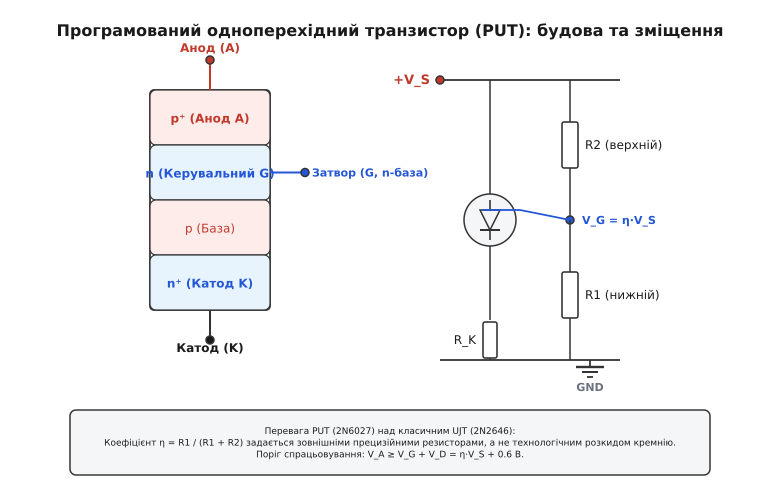

# 🔌 Порівняння одноперехідних транзисторів: класичний UJT проти програмованого PUT

Класичний сплавний або планарний одноперехідний транзистор (UJT, типовий представник — **2N2646**) та програмований одноперехідний транзистор (PUT, типові представники — **2N6027** і **2N6028**) вирішують одну й ту саму схемотехнічну задачу: створення релаксаційних генераторів, прецизійних аналогових таймерів і пускових ключів для тиристорів та симісторів на основі ділянки з від'ємним диференційним опором.

Проте за внутрішньою напівпровідниковою фізикою, структурою шарів та ступенем інженерної гнучкості ці прилади належать до абсолютно різних класів напівпровідникових компонентів.

### 1. Фізична та технологічна відмінність структур

Головна відмінність полягає в будові кристала та кількості p-n переходів:

- **Класичний UJT:** є однорідним бруском монокристалічного кремнію n-типу з двома торцевими омічними контактами (бази B1 і B2) та одним сплавним або дифузійним p-n переходом емітера (E). Це справжній тривимірний об'ємний прилад, перемикання якого базується на ефекті **модуляції провідності** об'єму напівпровідника інжектованими дірками.
- **Програмований PUT:** насправді є не одноперехідним транзистором, а спеціалізованим чотиришаровим **тиристором із керуванням за анодом** (*anode-gated thyristor*, структура p-n-p-n). Його перемикання базується на внутрішньому позитивному зворотному зв'язку між двома комплементарними біполярними транзисторами (PNP та NPN).


*Зліва — чотиришарова напівпровідникова структура p-n-p-n програмованого одноперехідного транзистора (PUT) з керувальним електродом затвора на n-базі. Справа — типова схема ввімкнення PUT із зовнішнім резистивним дільником R1–R2 для програмування порогу спрацьовування.*

### 2. Двотранзисторна модель та внутрішній позитивний зворотний зв'язок PUT

Щоб зрозуміти механізм виникнення від'ємного опору в PUT, розглянемо його еквівалентну схему, утворену парою перехресно увімкнених біполярних транзисторів: верхнього PNP-транзистора (шари `p⁺-n-p`) та нижнього NPN-транзистора (шари `n-p-n⁺`):

1. **Стан відсікання (`V_A < V_G + V_D`):** перехід «емітер–база» верхнього PNP-транзистора (анод–затвор) зсунутий у зворотному напрямку або напруга на ньому менша за контактну різницю потенціалів 0.6 В. Обидва транзистори закриті, струм анода обмежений мізерним струмом витоку `I_AO < 10 нА`.
2. **Точка піку (`V_A = V_G + V_D`):** коли анодна напруга перевищує потенціал затвора на 0.6 В, перехід «анод–затвор» відкривається, і через PNP-транзистор починає текти струм колектора `I_C1 = β1 · I_B1`.
3. **Регенеративне замикання:** колекторний струм PNP-транзистора втікає безпосередньо в базу нижнього NPN-транзистора, відкриваючи його. Відкритий NPN-транзистор починає відбирати струм з бази верхнього PNP-транзистора, викликаючи його подальше лавинне відкривання.
4. **Умова тригерного перемикання:** коли добуток коефіцієнтів підсилення струму задовольняє умову `β1 · β2 ≥ 1`, у структурі розвивається надшвидкий регенеративний процес. Падіння напруги між анодом і катодом колапсує від початкового порогу `V_P` до напруги насичення `V_sat ≈ 0.8...1.2 В`, формуючи круту ділянку від'ємного диференційного опору.

### 3. Принцип програмування порогу спрацьовування та імпедансу затвора

У класичному UJT коефіцієнт внутрішнього поділу напруги `η = R_B1 / (R_B1 + R_B2)` жорстко зафіксований на етапі виготовлення кристала геометричним розташуванням емітера відносно баз B1 і B2. Для транзистора 2N2646 довідковий розкид `η` становить від 0.56 до 0.75 (похибка ±15%), а міжбазовий опір `R_BB` варіюється від 4.7 до 9.1 кОм. Схемотехнік не має можливості змінити ці параметри без зміни напруги живлення.

У програмованому одноперехідному транзисторі (PUT) поріг спрацьовування задається інженером за допомогою зовнішнього резистивного дільника `R1` (нижнє плече) та `R2` (верхнє плече), підключеного до виводу затвора (Gate):

```
V_G = V_S · [R1 / (R1 + R2)] = η_ext · V_S    [опорна напруга затвора PUT]
```

де `η_ext = R1 / (R1 + R2)` — еквівалентний коефіцієнт поділу.

Крім напруги затвора, резистори `R1` та `R2` формують еквівалентний тевенінівський опір затвора `R_G`:

```
R_G = (R1 · R2) / (R1 + R2)    [еквівалентний паралельний опір дільника затвора]
```

Змінюючи величину `R_G`, інженер безпосередньо програмує струм піку `I_P` та струм западини `I_V`:
- При малому опорі `R_G = 10 кОм` струм піку становить `I_P ≈ 1.25 мкА`, а струм западини `I_V ≈ 150 мкА`.
- При великому опорі `R_G = 1 МОм` струм піку падає до надмалих значень `I_P ≈ 0.10 мкА`, а струм западини зменшується до `I_V ≈ 18 мкА`.

Оскільки `R1` та `R2` є зовнішніми дискретними резисторами, інженер може використовувати прецизійні металоплівкові резистори з допуском 0.1% або 1% та низьким температурним коефіцієнтом опору (ТКО ±25 ppm/°C). Це повністю усуває виробничу нестабільність порогу генерації.

Транзистор PUT вмикається, коли напруга на аноді `V_A` (яка надходить від заряджуваного конденсатора) перевищує потенціал затвора на величину прямого падіння на кремнієвому переході `V_D ≈ 0.5...0.7 В`:

```
V_A ≥ V_P = V_G + V_D = η_ext · V_S + V_D    [умова відмикання PUT]
```

### 4. Динамічна стійкість за швидкістю наростання напруги (dV/dt ефект)

Завдяки тиристорній природі чотиришарової структури PUT чутливий до швидкості наростання анодної напруги `dV_A / dt`.

Між анодом і затвором існує бар'єрна ємність переходу `C_AG ≈ 5...12 пФ`. Якщо напруга живлення або анодна напруга має крутий передній фронт, через ємність `C_AG` тече ємнісний струм зміщення:

```
i_disp = C_AG · (dv_A / dt)    [ємнісний струм зміщення через перехід затвора]
```

Якщо цей струм створює на внутрішньому опорі бази або зовнішньому резисторі `R_G` спад напруги понад 0.5 В, транзистор може самочинно відкритися задовго до досягнення статичного порогу `V_P` (*false dynamic triggering*).

Для запобігання хибному спрацьовуванню в умовах промислових імпульсних завад паралельно нижньому плечу дільника `R1` встановлюють блокувальний керамічний конденсатор `C_G ≈ 1...10 нФ`. Це динамічно шунтує затвор на землю для високочастотних викидів, не впливаючи на статичний рівень `V_G`.

### 5. Комплементарний одноперехідний транзистор (CUJT)

Окремим різновидом одноперехідних напівпровідникових приладів є **комплементарний одноперехідний транзистор** (CUJT, серія **2N6116–2N6119**).

У CUJT базова монокристалічна пластина виготовляється з кремнію p-типу, а емітерний перехід формується легуванням донорною домішкою n⁺-типу. Це дзеркально перевертає всі полярності напруг і струмів:
- База B2 підключається до загального проводу (землі), а база B1 — до негативної шини живлення `−V_EE`.
- Емітер формує від'ємні імпульси струму при досягненні від'ємного порогу піку.

CUJT володіє унікальною властивістю: його температурний коефіцієнт напруги піку є практично нульовим (`dV_P / dT ≈ 0`) без жодних додаткових зовнішніх термокомпенсувальних резисторів `R2`, оскільки падіння на прямозміщеному переході та зміна міжбазового опору взаємно компенсуються самою геометрією p-кристала.

### 6. Порівняння ключових електричних параметрів

У таблиці наведено зіставлення класичного кремнієвого UJT (2N2646) та програмованих аналогів (2N6027 для загального застосування та високочутливого 2N6028 для прецизійних таймерів):

| Параметр | Класичний UJT 2N2646 | Програмований PUT 2N6027 | Високочутливий PUT 2N6028 | Інженерний наслідок |
| :--- | :--- | :--- | :--- | :--- |
| **Структура кристала** | Монокристал n-Si, 1 p-n перехід | Планарна p-n-p-n (4 шари) | Планарна p-n-p-n (4 шари) | PUT простіший і дешевший у виробництві |
| **Коефіцієнт поділу `η`** | Фіксований: 0.56...0.75 | Програмований: 0.1...0.9 | Програмований: 0.1...0.9 | PUT забезпечує довільний вибір порогу `V_P` |
| **Струм піку `I_P`** | 2.0...5.0 мкА | 1.25 мкА (при `R_G = 10 кОм`) | **0.10...0.15 мкА** | PUT дозволяє таймери на години при малих `C` |
| **Струм западини `I_V`** | 4.0...6.0 мА | 70...150 мкА | 18...25 мкА | PUT легше зривається з режиму насичення |
| **Міжвитковий опір `R_BB`** | Внутрішній: 4.7...9.1 кОм | Зовнішній: `R1 + R2` | Зовнішній: `R1 + R2` | Повний контроль струму спокою в PUT |
| **Швидкість наростання `t_r`** | 100...200 нс | **40...80 нс** | **40...80 нс** | PUT генерує гостріші імпульси для симісторів |
| **Максимальна частота** | 100...200 кГц | **1.0...2.0 МГц** | **1.0...2.0 МГц** | PUT працює у високочастотних генераторах |

### 7. Загальна таксономія приладів із від'ємним диференційним опором

Щоб зорієнтуватися в усьому спектрі компонентів релаксаційної електроніки, зіставимо UJT та PUT з іншими пороговими ключовими приладами:

1. **DIAC (двонапрямлений диністор):** симетричний тришаровий прилад без виводу керування. Має фіксовану симетричну напругу пробою `V_BO ≈ 28...36 В` в обох полярностях. Широко застосовується у найпростіших мережевих димерах на 230 В, але не дозволяє регулювати поріг і не працює при низьких напругах живлення.
2. **Діод Шоклі (чотиришаровий диністор):** однонапрямлений p-n-p-n прилад без затвора з фіксованою напругою пробою від 10 до 100 В.
3. **Неонова лампа (газорозрядний релаксатор):** історичний попередник напівпровідникових ключів. Має напругу запалювання `V_ign ≈ 70...90 В` та напругу згасання `V_ext ≈ 50...60 В`. Має великі габарити та повільний час відновлення (сотні мікросекунд).
4. **Тунельний діод (діод Есакі):** надшвидкодіючий квантовомеханічний прилад з N-подібною ВАХ на основі виродженого p-n переходу. Працює на мілівольтах (`V_P ≈ 50...100 мВ`) на частотах у гігагерцовому діапазоні (до 10–50 ГГц), але не здатний комутувати потужні струми.

| Тип компонента | Кількість виводів | Робоча напруга | Керування порогом | Симетрія полярності | Типове застосування |
| :--- | :--- | :--- | :--- | :--- | :--- |
| **UJT (2N2646)** | 3 (E, B1, B2) | 10...35 В | Пропорційне `V_BB` | Однонапрямлений | Таймери, пуск тиристорів |
| **PUT (2N6027)** | 3 (A, K, G) | 5...40 В | Зовнішній дільник `R1-R2` | Однонапрямлений | Прецизійні таймери, VCO |
| **CUJT (2N6116)** | 3 (E, B1, B2) | −10...−35 В | Пропорційне `−V_EE` | Негативна полярність | Комплементарні генератори |
| **DIAC (DB3)** | 2 (MT1, MT2) | 28...36 В | Немає (фіксований) | Двонапрямлений | Фазові димери 230 В AC |
| **Неонова лампа** | 2 | 70...120 В | Немає (фіксований) | Двонапрямлений | Індикатори, генератори |
| **Тунельний діод** | 2 | 0.05...0.5 В | Немає (фіксований) | Однонапрямлений | СВЧ-генератори, тригери |

### 8. Чому PUT перевершує UJT у довготривалих таймерах

Головним обмеженням класичного UJT при побудові низькочастотних генераторів та реле часу з великою витримкою є високий струм піку `I_P ≈ 5 мкА`.

Щоб конденсатор гарантовано подолав точку піку, зарядний резистор `R` повинен задовольняти умову:

```
R < (V_BB − V_P) / I_P    [обмеження максимального опору заряду]
```

Для класичного UJT 2N2646 при напрузі живлення 15 В (`V_P ≈ 10 В`):

```
R_max < (15 − 10) / (5·10⁻⁶) = 1.0 МОм
```

Якщо потрібна витримка часу `T = 60 секунд`, необхідна ємність конденсатора становить:

```
C = T / (R_max · ln(1 / (1 − η))) ≈ 60 / (10⁶ · 1.0) = 60 мкФ
```

Електролітичний конденсатор ємністю 60 мкФ володіє власним струмом витоку `I_leak ≈ 0.01 · C · U ≈ 5...10 мкА`, що перевищує струм заряду. В результаті конденсатор перестає заряджатися, і схема зависає.

Використання транзистора PUT 2N6028 зі струмом піку `I_P = 0.1 мкА` дозволяє збільшити опір заряду до `R = 20...50 МОм`. Для формування витримки 60 секунд достатньо якісного плівкового поліпропіленового конденсатора ємністю лише `1.5...2.2 мкФ`, струм витоку якого складає менше 1 нА. Це дозволяє будувати прецизійні аналогові таймери з витримкою до кількох годин.

### 9. Інструкція із заміни класичного UJT на PUT

При ремонті вінтажного промислового обладнання або модернізації існуючих вузлів класичний одноперехідний транзистор 2N2646 можна легко замінити на PUT 2N6027/2N6028 за такою схемою перерахунку:

1. **Цокольовка:**
   - Вивід **Емітера (E)** старого UJT з'єднується з виводом **Анода (A)** транзистора PUT.
   - Вивід **Бази 1 (B1)** старого UJT з'єднується з виводом **Катода (K)** транзистора PUT.
   - Вивід **Бази 2 (B2)** підключається до шини живлення `+V_BB`.
2. **Встановлення зовнішнього дільника затвора:**
   - Між шиною `+V_BB` (вивід B2) та затвором **(G)** PUT встановлюють резистор `R2`.
   - Між затвором **(G)** PUT та землею (вивід B1) встановлюють резистор `R1`.
3. **Розрахунок номіналів дільника:**
   - Для еквівалентної заміни транзистора з `η = 0.65` та `R_BB = 7.0 кОм` обирають:
     ```
     R1 = η · R_BB = 0.65 · 7.0 кОм ≈ 4.55 кОм (стандартний номінал 4.7 кОм)
     R2 = (1 − η) · R_BB = 0.35 · 7.0 кОм ≈ 2.45 кОм (стандартний номінал 2.4 кОм або 2.7 кОм)
     ```

Така заміна є абсолютно повнофункціональною, має підвищену температурну стабільність і меншу чутливість до вібрацій та старіння компонентів.
