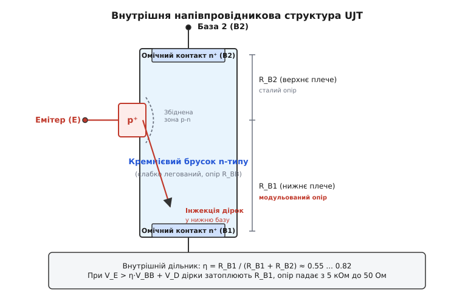
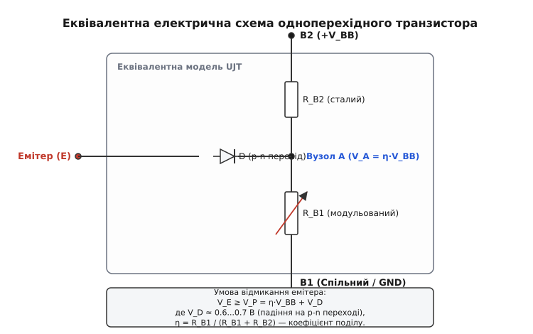
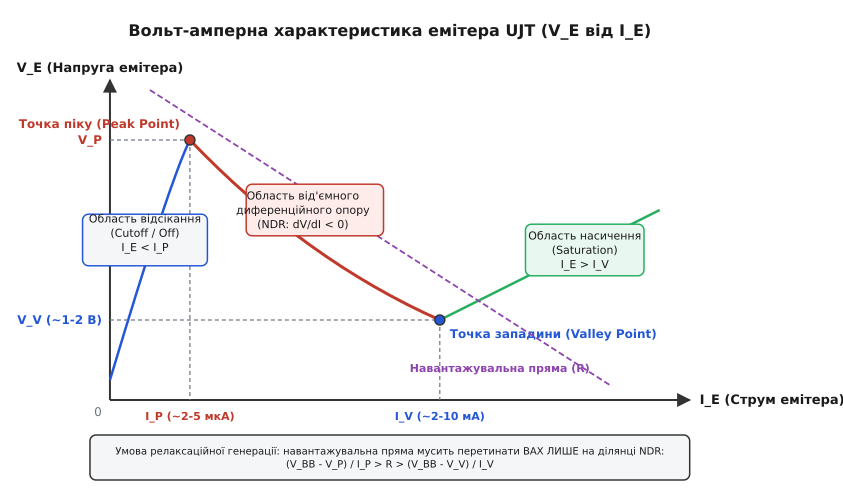
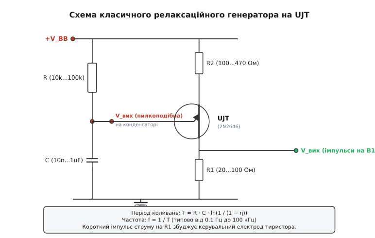
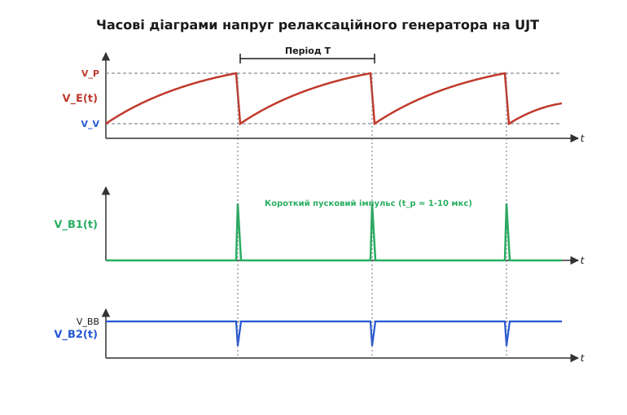

# Одноперехідний транзистор (UJT) і релаксаційний генератор

<preknowlist>
- [P-N перехід](topic:physics/pn-junction) — контактна різниця потенціалів, просторовий заряд і пряме зміщення діода.
- [Закон Ома](topic:electronics/ohms-law) — співвідношення напруги, струму та опору в електричних колах.
- [Дільник напруги](topic:electronics/voltage-divider) — розподіл потенціалу на послідовних резистивних ділянках.
- [Стала RC](topic:electronics/rc-time-constant) — експоненціальний процес заряду та розряду конденсатора через опір.
- [Від'ємний диференційний опір](topic:physics/negative-differential-resistance) — спадання напруги при зростанні струму та умова виникнення автоколивань.
- [Тиристор](topic:electronics/thyristor-scr) — чотиришаровий силовий перемикач, керований імпульсом затвора.
</preknowlist>

У силовій електроніці та імпульсній техніці регулярно виникає завдання: як сформувати потужний короткий пусковий імпульс струму з амплітудою в кілька сотень міліамперів і тривалістю в кілька мікросекунд для надійного відмикання силового тиристора, витративши мінімум компонентів? Звичайний конденсатор, що повільно заряджається через високоомний резистор від джерела живлення, накопичує необхідну енергію, але сам по собі не може різко розрядитися в навантаження. Потрібен комутувальний елемент, який залишається ідеальним ізолятором протягом усього часу заряду ємності, а при досягненні строго визначеного порогу напруги миттєво падає у надпровідний стан із майже нульовим опором, скидаючи накопичений заряд за долі мікросекунди.

Реалізація такого порогового перемикача на класичних біполярних або польових транзисторах вимагає побудови багатокомпонентних тригерних схем Шмідта або мультивібраторів із кількома каскадами підсилення, резистивними дільниками та колами зворотного зв'язку. Проте напівпровідникова фізика пропонує набагато елегантніше рішення: реалізувати пороговий релаксаційний генератор на одному єдиному кристалі кремнію без жодних зовнішніх підсилювальних транзисторів.

Цим приладом є **одноперехідний транзистор** (англ. *Unijunction Transistor, UJT*, від лат. *unus* — один, *junctio* — з'єднання, перехід; історична назва — **двобазовий діод**, *double-base diode*). Це трививідний напівпровідниковий прилад з одним p-n переходом і двома омічними контактами до базового кристала, внутрішній механізм інжекції носіїв у якому породжує фізичний ефект від'ємного диференційного опору.

### Внутрішня фізична будова монокристала та розподіл потенціалу

Щоб зрозуміти, як працює UJT, розглянемо будову його напівпровідникового кристала.

Основою класичного одноперехідного транзистора є тонкий брусок або пластина високочистого монокристалічного кремнію n-типу провідності. Кремній легують донорною домішкою (фосфором або миш'яком) у відносно низькій концентрації (`N_D ≈ 10¹⁴...10¹⁵ см⁻³`), що забезпечує бруску високий питомий об'ємний опір `ρ ≈ 10...50 Ом·см`.


*Внутрішня будова монокристалічного UJT: брусок кремнію n-типу з омічними контактами баз B1 та B2 і сплавним p⁺-емітером, розташованим ближче до B2. Стрілкою показано напрямок інжекції дірок при відмиканні приладу.*

До протилежних торців цього напівпровідникового бруска приварюють нелінійні безбар'єрні **омічні контакти** (*ohmic contacts*), які утворюють два базові виводи:
- **База 1 (B1)** — нижній вивід, який зазвичай підключають до спільного проводу (землі) або через невеликий навантажувальний резистор.
- **База 2 (B2)** — верхній вивід, на який подають позитивний потенціал живлення `+V_BB`.

Між контактами B1 та B2 за відсутності струму емітера кремнієвий брусок поводиться як звичайний лінійний резистор. Опір між цими виводами називають **міжбазовим опором** (*interbase resistance*) і позначають **`R_BB`**:

```
R_BB = R_B1 + R_B2    [міжбазовий опір напівпровідникового бруска]
```

Для типових промислових транзисторів (наприклад, масового 2N2646) величина `R_BB` лежить у діапазоні від `4.7 кОм` до `9.1 кОм`.

На бічній грані кремнієвого бруска методом високотемпературного сплавлення або планарної дифузії створюють локальну сильнолеговану область акцепторного кремнію p⁺-типу (найчастіше за допомогою алюмінію або бору). Межа між цим p⁺-острівцем та n-тілом бруска утворює єдиний випрямний **p-n перехід емітера (E)**.

Вирішальною конструктивною особливістю UJT є **асиметричне геометричне розташування емітера**: перехід вплавляють не посередині бруска, а значно ближче до верхнього контакту B2, ніж до нижнього B1.


*Еквівалентна електрична модель UJT: кремнієвий брусок представлений послідовним з'єднанням сталого верхнього опору R_B2 та керованого змінного опору R_B1, до середньої точки A яких підключено діод емітера D.*

Поділимо об'ємний опір бруска на дві умовні послідовні ділянки відносно точки підключення емітера:
1. **Верхній опір `R_B2`:** ділянка від точки контакту емітера до бази B2.
2. **Нижній опір `R_B1`:** ділянка від точки контакту емітера до бази B1.

Оскільки емітер зміщений ближче до B2, геометрична довжина нижньої ділянки більша за довжину верхньої (`L_B1 > L_B2`), тому у вихідному стані `R_B1 > R_B2`.

Якщо між базами прикласти постійну напругу живлення `V_BB` (плюс на B2, мінус на B1), уздовж кремнієвого бруска виникає однорідне поздовжнє електричне поле. Струм міжбазового спокою `I_BB = V_BB / R_BB` створює плавний спад потенціалу від `V_BB` на верхньому контакті до `0 В` на нижньому.

У внутрішній точці кристала `A`, безпосередньо під p-n переходом емітера, виникає проміжний електричний потенціал `V_A`, величина якого визначається класичною формулою резистивного дільника напруги:

```
V_A = V_BB · (R_B1 / (R_B1 + R_B2)) = V_BB · (R_B1 / R_BB)    [потенціал точки під емітером]
```

Відношення опору нижньої ділянки бази `R_B1` до повного міжбазового опору `R_BB` є фундаментальним паспортом одноперехідного транзистора. Цю безрозмірну величину називають **коефіцієнтом внутрішнього поділу напруги** або **власним відношенням відсічки** (англ. *Intrinsic Standoff Ratio*) і позначають грецькою літерою **`η`** (ета):

```
η = R_B1 / (R_B1 + R_B2) = R_B1 / R_BB    [коефіцієнт внутрішнього поділу напруги]
```

Оскільки коефіцієнт `η` залежить виключно від геометрії розміщення емітера на кристалі та профілю питомого опору кремнію, для кожного конкретного екземпляра транзистора він є строго фіксованою величиною, яка лежить у межах `η ≈ 0.55...0.82` (для приладу 2N2646 гарантований діапазон становить `0.56...0.75`).

Тоді потенціал кремнієвого тіла під катодом діода емітера записується гранично просто:

```
V_A = η · V_BB    [напруга зміщення бази під емітером]
```

Цей внутрішній потенціал виконує роль автоматичного напівпровідникового порогу, який блокує емітерний перехід доти, доки зовнішня напруга на емітері не перевищить рівень `η·V_BB`.

### Технологія виготовлення: сплавний брусок проти планарної структури

Історично перші UJT виготовлялися за **сплавною технологією** (*alloy-junction technology*). Злиток кремнію нарізався на окремі бруски, які монтувалися на керамічній або металевій основі. Омічні контакти створювалися золотисто-сурм'яним припоєм (Au-Sb), а емітер — вплавленням алюмінієвої кульки. Сплавні прилади (наприклад, 2N489–2N494 та ранні 2N2646) мали чудову стійкість до імпульсних перевантажень, але страждали від помітного струму витоку емітера (`I_EO ≈ 10...50 нА` при кімнатній температурі).

Наприкінці 1960-х років з'явилася **планарно-дифузійна технологія** виготовлення UJT (серія 2N4870 / 2N4871). У планарному приладі кремнієвий кристал формується на єдиній монокристалічній пластині за допомогою методів фотолітографії, термічного оксидування та селективної дифузії домішок крізь вікна в оксиді діоксиду кремнію (SiO₂).

Планарна технологія забезпечила дві вирішальні переваги:
1. **Пасивація поверхні діоксидом кремнію:** шар SiO₂ надійно захищає вихід p-n переходу на поверхню, знижуючи зворотний струм витоку `I_EO` до часток наноампера (`< 0.5 нА`).
2. **Прецизійна літографія:** точне фотолітографічне позиціювання вікон емітера та базових контактів звузило виробничий розкид коефіцієнта `η` до ±3...5%, усунувши необхідність індивідуального підбору транзисторів у схемах точних таймерів.

### Фізичний механізм від'ємного диференційного опору та модуляція провідності

Повна вольт-амперна характеристика (ВАХ) кола емітера UJT має характерну нелінійну S-подібну форму, на якій виділяють три принципово різні фізичні режими роботи.


*Статична вольт-амперна характеристика емітера UJT (залежність напруги VE від струму IE): область відсікання, точка піку (VP, IP), область від'ємного диференційного опору (NDR), точка западини (VV, IV) та область насичення. Пурпуровою пунктирною лінією показано навантажувальну пряму.*

Простежмо крок за кроком, що відбувається всередині кристала при плавному збільшенні напруги на емітері `V_E` від нуля до напруги живлення `V_BB`.

#### 1. Область відсікання (Cutoff Region, V_E < V_P)
Поки зовнішня напруга на емітері менша за внутрішній потенціал точки `A` (`V_E < η·V_BB`), кремнієвий p-n перехід перебуває під зворотним зміщенням.

Широка збіднена область просторового заряду перекриває границю «емітер–база». Через вивід емітера тече лише мізерний зворотний тепловий струм витоку `I_EO` (типово від кількох наноамперів до `0.05 мкА` при 25 °C):

```
I_E = −I_EO ≈ 0    [струм емітера в режимі відсікання]
```

Вхідний диференційний опір емітера в цьому стані є гігантським і становить від десятків мегаомів до гігаомів. Транзистор є надійно закритим вимикачем.

#### 2. Точка піку (Peak Point, V_E = V_P, I_E = I_P)
Коли прикладена напруга `V_E` зрівнюється з внутрішнім потенціалом `η·V_BB`, зворотна напруга на p-n переході спадає до нуля. Для того щоб перехід відкрився в прямому напрямку і крізь нього почав текти прямий струм, напругу емітера необхідно підняти ще на величину контактної різниці потенціалів відкритого кремнієвого діода `V_D ≈ 0.6...0.7 В`.

Напруга, за якої емітерний p-n перехід починає інжектувати носії, називається **напругою піку** (*Peak Voltage*) і позначається **`V_P`**:

```
V_P = η · V_BB + V_D    [порогова напруга піку відмикання UJT]
```

Струм емітера, що відповідає цій точці на ВАХ, називають **струмом піку** (*Peak Current*) **`I_P`**. Для кремнієвих транзисторів струм `I_P` є дуже малим і становить лише `1.0...5.0 мкА`.

Точка піку `(I_P, V_P)` є критичною точкою біфуркації, у якій статичний стан системи втрачає стійкість.

#### 3. Область від'ємного диференційного опору (Negative Resistance Region, I_P < I_E < I_V)
Щойно напруга `V_E` бодай на мілівольт перевищує поріг `V_P`, прямозміщений p⁺-емітер починає масивно інжектувати дірки (неосновні носії заряду) у слаболегований об'єм кремнієвого бруска n-типу.

Тут починає діяти ланцюгова реакція:
1. Поздовжнє електричне поле між базами B2 та B1 підхоплює інжектовані позитивні дірки і з високою швидкістю тягне їх униз — до негативного виводу бази B1.
2. Величезна кількість додаткових рухомих дірок, що потрапляють у нижню ділянку бруска, порушує локальну електричну нейтральність напівпровідника.
3. Щоб скомпенсувати позитивний об'ємний заряд дірок, з омічного контакту B1 у брусок негайно втягується така сама кількість електронів із зовнішнього кола.
4. Концентрація вільних носіїв заряду (електронів і дірок) у нижній ділянці кристала лавиноподібно зростає на кілька порядків — від початкових `10¹⁴ см⁻³` до `10¹⁷...10¹⁸ см⁻³`.
5. Це явище називають **модуляцією провідності** (*conductivity modulation*): напівпровідник затоплюється електронно-дірковою плазмою, і питомий опір ділянки `R_B1` стрімко колапсує від початкових `4...6 кОм` до мізерних `5...30 Ом`.
6. Оскільки опір `R_B1` катастрофічно зменшується, спад напруги на ньому різко падає. Внутрішній потенціал точки `A` знижується, що ще сильніше зміщує емітерний перехід у прямому напрямку.

Виникає потужний внутрішній позитивний зворотний зв'язок: зростання струму емітера `I_E` спричиняє падіння напруги між емітером і базою 1 `V_E`.

Диференційний опір приладу на цій ділянці стає строго від'ємним:

```
r_d = dV_E / dI_E < 0    [умова від'ємного диференційного опору]
```

Саме ця падаюча ділянка вольт-амперної характеристики дозволяє UJT працювати як високоефективний твердотільний релаксаційний автогенератор без зовнішніх підсилювачів.

#### 4. Амбіполярний перенос носіїв та динаміка плазми
При високому рівні інжекції, коли концентрація інжектованих дірок `p` перевищує рівноважну концентрацію фонових електронів `n_0`, перенос заряду в напівпровіднику підпорядковується рівнянню **амбіполярного дрейфу та дифузії**:

```
j_p = q·μ_a·p·E − q·D_a·(dp/dx)    [рівняння амбіполярного струму дірок]
```

де:
- `μ_a = (n − p) / (n/μ_p + p/μ_n)` — амбіполярна рухливість плазми,
- `D_a = 2·(D_n · D_p) / (D_n + D_p) ≈ 18 см²/с` — коефіцієнт амбіполярної дифузії в кремнії.

Коли густина плазми досягає максимуму (`p ≈ n`), амбіполярна рухливість прямує до нуля (`μ_a → 0`), і рух носіїв уповільнюється, переходячи від чистого польового дрейфу до дифузійного розтікання плазмового згустку. Це визначає фізичну межу швидкості спаду напруги під час перемикання (фронт наростання струму `t_r ≈ 50...150 нс`).

#### 5. Точка западини (Valley Point, V_E = V_V, I_E = I_V)
У міру збільшення емітерного струму концентрація інжектованих носіїв досягає фізичної межі: об'єм нижньої ділянки бази повністю насичується плазмою, а швидкість рекомбінації носіїв зрівнюється зі швидкістю їх інжекції. Модуляція провідності вичерпує свій потенціал.

Падіння напруги `V_E` сягає свого мінімального значення, яке називають **напругою западини** (*Valley Voltage*) **`V_V`** (типово `1.0...2.5 В`). Струм емітера в цей момент досягає величини **струму западини** (*Valley Current*) **`I_V`** (типово `2.0...10.0 мА`).

У точці западини похідна характеристики перетворюється на нуль: `dV_E / dI_E = 0`.

#### 6. Область насичення (Saturation Region, I_E > I_V)
При струмах `I_E > I_V` опір ділянки `R_B1` вже не може зменшуватися. Напівпровідникова структура переходить у режим звичайного прямозміщеного p-n переходу з малим залишковим омічним опором насичення `R_B1(on) ≈ 10...30 Ом`. Напруга `V_E` знову починає повільно зростати при збільшенні струму, а диференційний опір стає додатним (`r_d > 0`).

Детальний аналіз математичної моделі ВАХ та точний вираз для динамічного імпедансу наведено у вставці [Математичний розрахунок періоду та стабілізації UJT-генератора](topic:electronics/ujt-relaxation/math-relaxation-frequency.md).

### Схемотехніка релаксаційного генератора на UJT

Здатність одноперехідного транзистора стрибкоподібно змінювати свій стан із високоомного на низькоомний при досягненні порогової напруги `V_P` робить його ідеальною основою для побудови **релаксаційного генератора** (*relaxation oscillator*, від лат. *relaxatio* — послаблення, зменшення напруження).


*Принципова електрична схема релаксаційного генератора на одноперехідному транзисторі з часозадавальним колом R-C, термокомпенсувальним резистором R2 та імпульсним вихідним резистором R1.*

Схема генератора містить мінімальну кількість пасивних компонентів:
- **Часозадавальний резистор `R` та конденсатор `C`:** утворюють інтегруюче коло заряду, підключене до шини `+V_BB`.
- **Резистор `R1` (типово 20...100 Ом):** увімкнений між базою B1 та землею; слугує для зняття вихідних позитивних пускових імпульсів струму.
- **Резистор `R2` (типово 100...470 Ом):** увімкнений між шиною `+V_BB` та базою B2; забезпечує температурну стабілізацію частоти коливань.


*Часові діаграми роботи генератора: вгорі — пилкоподібна напруга заряду-розряду на конденсаторі VE(t); посередині — гострі позитивні пускові імпульси на базі B1; внизу — негативні синхроімпульси на базі B2.*

Розгляньмо повний часовий цикл автоколивань:

#### Фаза 1: Експоненціальний заряд конденсатора (повільний рух)
У початковий момент часу конденсатор розряджений до напруги западини `V_E(0) = V_V`. Емітерний перехід UJT закритий, оскільки `V_E < V_P`, а струм емітера практично дорівнює нулю.

Конденсатор повільно заряджається від джерела живлення `+V_BB` через резистор `R`. Напруга на ньому зростає за класичним експоненціальним законом:

```
V_E(t) = V_BB − (V_BB − V_V) · e^(−t / (R·C))    [траєкторія заряду конденсатора]
```

Швидкість наростання напруги визначається сталою часу зарядного кола `τ = R · C`.

#### Фаза 2: Лавинне перемикання та розряд (швидкий стрибок)
Коли напруга на конденсаторі досягає порогового значення `V_P = η·V_BB + V_D`, емітерний p-n перехід відкривається. Інжектовані дірки миттєво затоплюють нижню базу, опір `R_B1` колапсує з 5 кОм до 15 Ом, і транзистор переходить у режим глибокого насичення.

Конденсатор `C` починає блискавично розряджатися через малий опір відкритого каналу `R_B1` та зовнішній резистор `R1`. Стала часу розряду становить:

```
τ_dis = (R_B1(on) + R1) · C    [стала часу кола розряду]
```

Оскільки `R_B1(on) + R1` складає лише кілька десятків омів, розряд триває лічені мікросекунди (`1...5 мкс`), що на 3–4 порядки швидше за час заряду.

Під час розряду через резистор `R1` протікає потужний імпульс струму з піковою амплітудою:

```
I_pulse ≈ (V_P − V_V) / (R_B1(on) + R1)    [піковий струм розряду через B1]
```

Цей імпульс формує на резисторі `R1` короткий позитивний імпульс напруги з крутим переднім фронтом, який ідеально підходить для безпосереднього запуску силових тиристорів і симісторів. Одночасно на базі B2 за рахунок короткочасного зростання міжбазового струму виникає гострий негативний провал напруги.

#### Фаза 3: Відсікання та відновлення циклу
Коли напруга на конденсаторі в процесі розряду падає до рівня напруги западини `V_V`, струм емітера зменшується нижче струму утримання `I_V`.

Лавинна інжекція дірок припиняється, надлишкові носії швидко рекомбінують у кремнії, і опір `R_B1` миттєво відновлює своє високе вихідне значення (кілька кілоомів). Транзистор наглухо закривається, розрядне коло розривається, і конденсатор знову починає повільно заряджатися від напруги `V_V` до `V_P`. Цикл замикається і повторюється нескінченно.

#### Розрахунок періоду та частоти коливань
Тривалість заряду конденсатора від `V_V` до `V_P` визначається логарифмічним рівнянням:

```
T_ch = R · C · ln((V_BB − V_V) / (V_BB − V_P))    [точний час заряду конденсатора]
```

Якщо знехтувати малими величинами `V_D ≈ 0.6 В` та `V_V ≈ 1.5 В` порівняно з напругою живлення `V_BB ≥ 15 В`, отримуємо класичну інженерну формулу:

```
T ≈ R · C · ln(1 / (1 − η))    [інженерна формула періоду коливань]
f = 1 / T ≈ 1 / (R · C · ln(1 / (1 − η)))    [частота генерації UJT]
```

Для типового значення `η = 0.632` вираз під логарифмом перетворюється на точну одиницю `ln(1 / (1 − 0.632)) = ln(e) = 1.00`, і період генератора дорівнює просто добутку номіналів:

```
T = R · C    [період генератора при η = 0.632]
```

### Умови самозбудження та аналіз навантажувальної прямої

Щоб релаксаційний генератор працював у режимі неперервних автоколивань, а не зависав в одному зі статичних положень, навантажувальна пряма, що визначається напругою живлення `V_BB` та опором зарядного резистора `R`, мусить перетинати статичну ВАХ емітера **виключно на ділянці з від'ємним диференційним опором** — між точкою піку `(I_P, V_P)` та точкою западини `(I_V, V_V)`.

Це накладає два жорсткі фізичні обмеження на вибір номіналу резистора `R`:

#### 1. Верхнє обмеження опору R_max (запобігання зависанню у відсіканні)
Струм, який резистор `R` здатен забезпечити при напрузі піку `V_P`, має бути більшим за піковий струм емітера `I_P`. Інакше конденсатор зарядиться до порогу `V_P`, але емітер не зможе набрати необхідний струм інжекції, і схема назавжди застрягне в закритому стані (*cutoff latch-up*):

```
R < (V_BB − V_P) / I_P = R_max    [максимально допустимий опір заряду]
```

Для `V_BB = 20 В`, `V_P = 13 В`, `I_P = 2 мкА`: `R_max = (20 − 13) / (2·10⁻⁶) = 3.5 МОм`.

#### 2. Нижнє обмеження опору R_min (запобігання зависанню в насиченні)
Після розряду конденсатора струм, що надходить через резистор `R` при напрузі западини `V_V`, має бути меншим за струм западини `I_V`. Інакше транзистор не зможе закритися і залишатиметься постійно відкритим у режимі неперервного струму насичення (*saturation latch-up*):

```
R > (V_BB − V_V) / I_V = R_min    [мінімально допустимий опір заряду]
```

Для `V_BB = 20 В`, `V_V = 2 В`, `I_V = 4 мА`: `R_min = (20 − 2) / (4·10⁻³) = 4.5 кОм`.

#### Критерій безперервної генерації
Об'єднуючи обидві нерівності, отримуємо фундаментальний інтервал працездатності:

```
(V_BB − V_P) / I_P  >  R  >  (V_BB − V_V) / I_V    [інтервал стійкого самозбудження]
```

### Фізика температурної компенсації: резистор R2

Головним джерелом нестабільності частоти простих напівпровідникових генераторів є вплив температури на параметри кремнієвих переходів. У одноперехідному транзисторі діють два взаємно протилежні температурні механізми:

1. **Температурний дрейф діода емітера (негативний коефіцієнт):** пряме падіння напруги на кремнієвому p-n переході `V_D` зменшується при нагріванні з коефіцієнтом приблизно `dV_D / dT ≈ −2.2 мВ/°C`. Це призводить до зниження порогу піку `V_P` і збільшення частоти генератора при нагріванні.
2. **Температурний дрейф міжбазового опору (позитивний коефіцієнт):** питомий опір слаболегованого кремнію n-типу зростає при підвищенні температури через зниження рухливості електронів при розсіюванні на фононах ґратки (`μ_n ∝ T^(−3/2)`). Повний міжбазовий опір `R_BB` має позитивний температурний коефіцієнт `α_BB ≈ +0.8 %/°C`.

Якщо базу B2 транзистора підключити безпосередньо до шини живлення `+V_BB`, міжбазовий струм `I_BB` зменшуватиметься з нагріванням, але внутрішній потенціал дільника `V_A = η·V_BB` залишатиметься незмінним. У результаті поріг спрацьовування `V_P(T) = η·V_BB + V_D(T)` монотонно спадатиме зі швидкістю −2.2 мВ/°C.

Щоб компенсувати це явище, у коло виводу B2 послідовно вмикають термокомпенсувальний резистор **`R2`**.

За наявності резистора `R2` напруга між внутрішніми базами UJT стає залежною від температури:

```
V_B2B1(T) = V_BB · (R_BB(T) / (R_BB(T) + R2))
```

При нагріванні опір `R_BB(T)` зростає, тому частка напруги живлення, яка припадає на внутрішній кремнієвий кристал, збільшується. Відповідно, напруга внутрішньої точки дільника `V_A(T) = η · V_B2B1(T)` зростає з температурою.

Підібравши номінал резистора `R2` так, щоб позитивний приріст напруги дільника `d(η·V_B2B1)/dT` точно компенсував негативний спад напруги на діоді `dV_D/dT`, досягають повної температурної інваріантності порогу спрацьовування:

```
dV_P / dT = d(η · V_B2B1) / dT + dV_D / dT = 0    [умова повної термокомпенсації]
```

Аналітичний розрахунок дає оптимальний номінал компенсувального резистора:

```
R2 ≈ (0.40...0.70) · R_BB / (η · V_BB)    [розрахунок термокомпенсувального резистора R2]
```

Для типових параметрів `R_BB = 7 кОм`, `η = 0.65`, `V_BB = 15 В` номінал `R2 ≈ (0.5 · 7000) / (0.65 · 15) ≈ 359 Ом` (обирають стандартний номінал 360 Ом). Правильно скомпенсований UJT-генератор зберігає стабільність частоти краще за ±1% у діапазоні температур від −40 до +100 °C.

> 🔧 **Навіщо це.** Без резистора R2 частота генератора у вуличному блоці автоматики зростає влітку на 15–20% порівняно із зимою. Встановлення одного копійчаного резистора 360 Ом усуває температурний дрейф повністю, перетворюючи просту схему на стабільний промисловий таймер.

### Граничні експлуатаційні режими та захист кристала

При проєктуванні схем на одноперехідних транзисторах необхідно суворо контролювати гранично допустимі електричні режими (*Absolute Maximum Ratings*):

1. **Гранична зворотна напруга емітера `V_EB1(rev)`:** зворотна пробивна напруга сплавного p-n переходу емітера щодо бази B1 становить типово від 30 до 35 В. Подача зворотної напруги, що перевищує `V_EB1(rev)`, призводить до лавинного пробою переходу та деградації коефіцієнта `η`.
2. **Піковий імпульсний струм емітера `I_E(peak)`:** при розряді конденсаторів великої ємності (`C > 1...2 мкФ`) імпульсний струм через емітерний контакт може перевищити `1.5...2.0 А`. Для захисту кристала від локального перегріву та деградації металізації послідовно з емітером або в коло бази B1 обов'язково встановлюють струмообмежувальний резистор `R1 ≥ 10...47 Ом`.
3. **Потужність розсіювання кристала `P_total`:** статичне нагрівання міжбазовим струмом `P_stat = V_BB² / (R_BB + R2 + R1)` у поєднанні з динамічним нагріванням імпульсами розряду не повинно перевищувати `300 мВт` для корпусу TO-92 та `360 мВт` для металевого корпусу TO-18.

### Практичні застосування та схемні реалізації

Завдяки граничній простоті, високій надійності та здатності генерувати імпульси струму амплітудою в кілька амперів одноперехідні транзистори протягом десятиліть залишалися базовим елементом промислової та побутової автоматики:

#### 1. Фазоімпульсне керування тиристорами й симісторами (SCR/TRIAC Trigger)
Найвідомішим застосуванням UJT є регулятори потужності в колах змінного струму 230 В / 50 Гц (димери освітлення, термостати, плавні регулятори обертів колекторних двигунів). Схема синхронізується з нулем мережі за допомогою діодного моста та стабілітрона. Змінюючи опір зарядного потенціометра, інженер регулює кут затримки відмикання силового ключа від 0° до 180°. Детальний аналіз схеми, розрахунок імпульсного трансформатора та код симулятора наведено у вставці [Фазоімпульсне керування тиристором на UJT](topic:electronics/ujt-relaxation/proj-scr-phase-control.md).

#### 2. Генератори строго лінійної пилкоподібної напруги (Linear Sawtooth / Sweep Generator)
Якщо замість постійного зарядного резистора `R` увімкнути генератор стабільного струму на біполярному PNP-транзисторі або польовому JFET, конденсатор заряджатиметься не за експонентою, а строго лінійно:

```
v_C(t) = V_V + (I_const / C) · t    [ідеально лінійне наростання напруги]
```

Це дозволяє будувати високолінійні генератори розгортки для осцилографів, аналогових функціональних генераторів та генераторів, керованих напругою (VCO).

#### 3. Прецизійні тактові генератори та дільники частоти
UJT-генератор легко синхронізується зовнішніми короткими імпульсами, що подаються на базу B2. Це дозволяє використовувати його як надійний дільник частоти на ціле число `N` (1:2, 1:5, 1:10), де UJT спрацьовує лише на кожен N-й синхроімпульс.

### Еволюція та сучасні напівпровідникові альтернативи

Історія розвитку одноперехідних приладів пройшла шлях від перших лабораторних експериментів Вільяма Шоклі та Роберта Сурана до масових серійних компонентів. Повний історичний контекст винаходу двобазового діода розкрито у вставці [Історія двобазового діода](topic:electronics/ujt-relaxation/hist-double-base-diode.md).

З розвитком планарної мікроелектроніки класичний кремнієвий сплавний UJT поступився місцем більш технологічним приладам:

1. **Програмований одноперехідний транзистор (PUT, 2N6027/2N6028):** чотиришаровий тиристорний прилад з анодним керуванням, у якому коефіцієнт поділу `η` та струми перемикання задаються двома зовнішніми прецизійними резисторами. PUT має на порядок нижчий струм піку (`I_P < 0.15 мкА`), що дозволяє створювати таймери з витримкою до кількох годин. Детальне порівняння параметрів та правила заміни наведено у вставці [Порівняння UJT та програмованого транзистора PUT](topic:electronics/ujt-relaxation/comp-ujt-vs-put.md).
2. **Інтегральний таймер NE555:** мікросхема, що містить прецизійний резистивний дільник 3×5 кОм, два компаратори та RS-тригер. Таймер 555 взяв на себе більшість завдань низьковольтної релаксаційної генерації.
3. **Діаки (DIAC, DB3):** симетричні двонапрямлені порогові діністори з фіксованою напругою пробою 32 В, які є сучасним стандартом для побудови найпростіших мережевих димерів на 230 В.
4. **Мікроконтролери з апаратними таймерами:** сучасні цифрові системи (STM32, ESP32) вимірюють нуль мережі через оптопару і формують фазовий кут програмно, відмикаючи симістор через оптосимісторний драйвер (MOC3021/MOC3052).

Незважаючи на домінування цифрових мікросхем, фізичний принцип одноперехідного транзистора залишається класичним фундаментом напівпровідникової електроніки, наочно демонструючи, як використання внутрішніх властивостей монокристала — модуляції провідності та інжекції неосновних носіїв — дозволяє реалізувати складну нелінійну функцію генерації на рівні одного елементарного p-n переходу.
