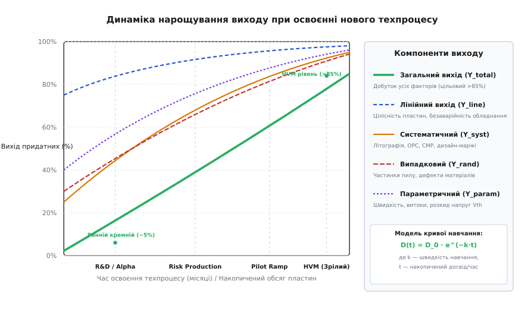
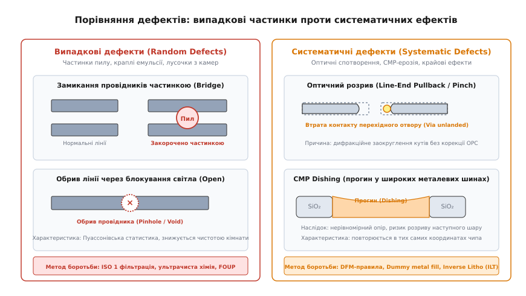
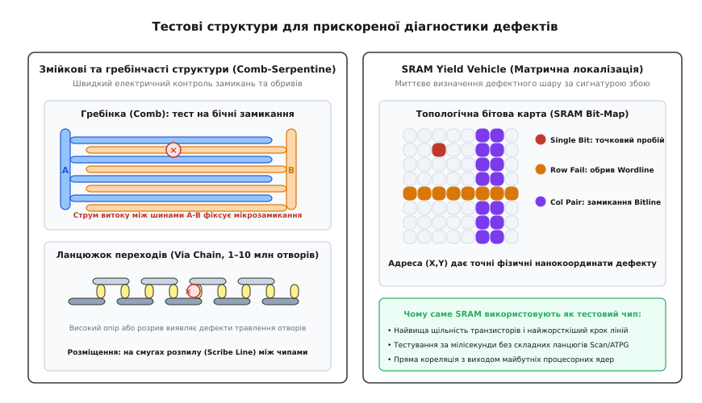
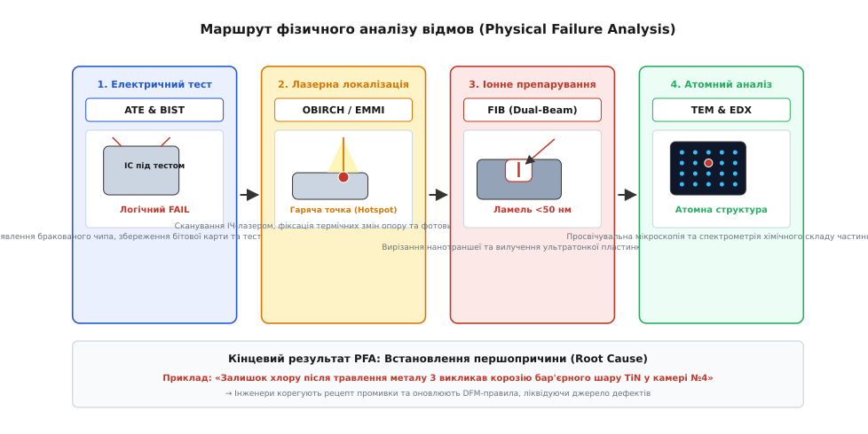

# Дозрівання виходу (yield ramp)

<preknowlist>
- [Вихід придатних (Yield)](book:electronics/yield) — статистика дефектів, площа кристала і базова модель Пуассона.
- [Фотолітографія](book:electronics/photolithography) — перенесення топології, межі роздільної здатності, дифракційні ефекти та маски.
- [Шар за шаром (легування й травлення)](book:electronics/doping-etching-metal) — фізико-хімічні процеси формування шарів і літографічні допуски.
- [Тестування й binning](book:electronics/testing-binning) — зондовий контроль пластин (wafer sort), ATE-тестери та виявлення бракованих кристалів.
- [Фаби й fabless](book:electronics/fabs-fabless) — економіка напівпровідникового виробництва та модель контрактної фабрики.
</preknowlist>

Коли напівпровідникова фабрика запускає у виробництво абсолютно новий технологічний вузол (наприклад, переходить на норми 3 нм або 2 нм із транзисторами GAA), перші повноцінні партії кремнієвих пластин, що виходять із печей після трьох місяців обробки та понад тисячі технологічних операцій, мають вихід придатних кристалів у межах від 5% до 15%. Обробка однієї сучасної 300-міліметрової пластини на передовому вузлі коштує від $15 000 до $25 000. За виходу 10% собівартість одного мікропроцесора площею 100 мм² злітає з планових $150 до нищівних $1500 за штуку — продаж чипів за такою ціною генерує гігантські збитки як для фабрики, так і для розробника.

Фабрика не може розпочати масове комерційне виробництво (*High-Volume Manufacturing*, HVM), доки частка працездатних кристалів не досягне 75–90%. Динамічний процес виявлення, локалізації та методичного усунення сотень джерел технологічного браку, що переводить виробництво від початкових одиничних відсотків виходу до стабільних комерційних показників, називають **дозріванням виходу** (*yield ramp*, від англ. *ramp* — «похилий підйом, нарощування»). Швидкість цього нарощування визначає, чи окупить фабрика багатомільярдні інвестиції в нове обладнання, чи зазнає фінансового краху, поступившись ринком конкурентам.

---

### Анатомія кривої дозрівання та компоненти виходу

Вихід придатних кристалів не є єдиним монолітним числом. Результуючий вихід партії пластин `Y_total` формується як добуток кількох незалежних коефіцієнтів, кожен із яких відповідає за принципово різний клас фізичних явищ на виробництві:

```
Y_total = Y_line · Y_die = Y_line · Y_rand · Y_syst · Y_param

Y_total  — повний інтегральний вихід придатних (Total Composite Yield)
Y_line   — лінійний вихід пластин (Line Yield / Wafer Yield)
Y_die    — вихід кристалів на вцілілих пластинах (Die Yield)
Y_rand   — вихід за випадковими дефектами (Random Defect Yield)
Y_syst   — вихід за систематичними топологічними дефектами (Systematic Yield)
Y_param  — параметричний вихід за швидкістю та витоками (Parametric Yield)
```

Розгляньмо кожен компонент у послідовності їхнього виникнення на конвеєрі:


*Динаміка зростання інтегрального виходу придатних виробів та його окремих складових від фази першого дослідницького кремнію (R&D / Alpha) через ризикове пілотне виробництво до стадії зрілого масового випуску (HVM). Інтегральний вихід є добутком чотирьох компонентів, тому провал хоча б одного фактора (наприклад, систематичних дефектів літографії) утримує загальний вихід на рівні одиничних відсотків.*

1. **Лінійний вихід пластин (`Y_line`)**: частка кремнієвих підкладок, які фізично долають увесь технологічний маршрут без механічного розтріскування, термічного жолоблення, аварійних зупинок роботизованих маніпуляторів та помилок операторів. На зрілому процесі `Y_line` перевищує 98–99%, проте на етапі запуску через калібрування вакуумних захватів і термічних градієнтів у печах він може опускатися до 75–80%.
2. **Випадковий вихід (`Y_rand`)**: визначається сторонніми мікрочастинками (пил у повітрі, мікрозгустки фоторезисту, кристалічні лусочки осадженого металу зі стінок вакуумних камер), які випадково падають на топологію чипа. Цей брак підпорядковується статистичним законам розподілу дефектів за площею.
3. **Систематичний вихід (`Y_syst`)**: викликаний невідповідністю між топологією схеми та фізичними межами технологічного процесу (*Design-Process Margins*). Якщо дві паралельні лінії металу розведені занадто близько, дифракційне розмиття світла в літографічному сканері викликає систематичне замикання між ними в абсолютно однакових координатах кожного кристала на кожній пластині.
4. **Параметричний вихід (`Y_param`)**: описує кристали, які є повністю цілісними функціонально (без коротких замикань і обривів), але не вкладаються у вимоги специфікації за робочою частотою, пороговою напругою перемикання або статичним струмом витоку в режимі спокою.

#### Фізика параметричних втрат виходу
На суб-5-нанометрових масштабах навіть незначні коливання технологічного процесу — розкид товщини підзатворного діелектрика на частки ангстрема чи флуктуація кількості атомів легування в каналі транзистора (*Random Dopant Fluctuation*, RDF) — викликають помітний розкид параметрів між кристалами в центрі та на краю пластини:
* **Розкид порогової напруги (`ΔV_th`)**: якщо порогова напруга транзистора виявляється вищою за норму (кутовий стан процесу *Slow-Slow*), транзистори перемикаються надто повільно, і критичні шляхи логіки чипа не вкладаються в часові обмеження (*timing violation*), не досягаючи цільової тактової частоти.
* **Струми підпорогового витоку (`I_off / I_leak`)**: якщо ж порогова напруга виявляється нижчою за норму (кутовий стан *Fast-Fast*), транзистори працюють швидко, але статичний струм витоку через закритий канал зростає експоненційно. Такий кристал споживає надмірну потужність і перегрівається, не проходячи тести енергоефективності для мобільних пристроїв.

Для порятунку параметричного виходу сучасні процесори проектують із вбудованими кільцевими генераторами (*Ring Oscillators*) та сенсорами технологічних відхилень (*Process Voltage Temperature Monitors*, PVT-сенсори), які дозволяють застосовувати технологію адаптивного керування напругою та частотою (*Adaptive Voltage and Frequency Scaling*, AVFS) безпосередньо в роботі.

Динаміка зниження питомої густини дефектів `D(t)` у часі `t` підпорядковується експоненційній залежності, відомій як **модель кривої навчання** (*Yield Learning Curve*):

```
D(t) = D_inf + (D_0 − D_inf) · e^(−k · t)

D_0    — початкова густина дефектів на старті освоєння процесу (см⁻²)
D_inf  — теоретична межа чистоти та стабільності обладнання фабрики (см⁻²)
k      — темп технологічного навчання фабрики (міс⁻¹ або партія⁻¹)
t      — час освоєння з моменту першого прогону пластин
```

Показник `k` відображає інтелектуальну швидкість інженерної команди: чим швидше фабрика збирає статистику збоїв, локалізує джерела дефектів і вносить корективи в правила проектування та рецепти обладнання, тим крутіше крива виходу злітає вгору.

---

### Математичні моделі виходу: від Пуассона до кластеризації Мерфі та Сідса

У багатьох інженерних оглядах розрахунок виходу зводять до простої [моделі Пуассона](book:electronics/yield), де вихід `Y` залежить від площі кристала `A` та густини дефектів `D`:

```
Y_Poisson = e^(−D · A)
```

Формула Пуассона виходить із припущення, що дефекти розподілені по пластині абсолютно незалежно й рівномірно. Проте для сучасних мікропроцесорів великої площі ця модель виявляється занадто песимістичною і принципово хибною: вона прогнозує повну неможливість виготовлення великих чипів.

Причина розбіжності полягає в явищі **просторової кластеризації дефектів** (*Defect Clustering*). На реальній пластині частки сміття та літографічні збої не розсіюються поодинці, а концентруються групами — вздовж напрямків руху полірувальної подушки CMP, біля країв пластини внаслідок відцентрових сил центрифуги, або навколо газових форсунок плазмових реакторів.

Якщо десять мікрочасток осідають скупченням у межах одного кристала, вони знищують лише цей один кристал, тоді як решта сусідніх кристалів залишаються неушкодженими. Модель Пуассона вважає, що ці десять часток рівномірно вдарять у десять різних кристалів, завищуючи оцінку втрат.

Щоб точно моделювати поведінку реального кремнію, індустрія розробила послідовність статистичних моделей із просторовим усередненням:

1. **Модель Сідса (Seeds Model)**: припускає, що локальна густина дефектів на різних ділянках пластини варіюється за експоненційним законом. Усереднення пуассонівського виходу за експоненційним розподілом дає гіперболічну залежність:
```
Y_Seeds = 1 / (1 + D̄ · A)

D̄  — середня густина дефектів по вибірці
A  — площа кристала
```

2. **Модель Мерфі (Murphy Model)**: враховує більш плавний симетричний трикутний розподіл густини дефектів навколо середнього значення:
```
Y_Murphy = ( (1 − e^(−D̄·A)) / (D̄ · A) )²
```

3. **Модель Стаппера / від'ємного біноміального розподілу (Stapper / Negative Binomial Model)**: загальновизнаний стандарт сучасної напівпровідникової метрології. Модель використовує двопараметричний гамма-розподіл густини дефектів із безрозмірним **параметром кластеризації** `α` (*Clustering Parameter*):
```
Y_Stapper = ( 1 + (D̄ · A_crit) / α )^(−α)

α       — параметр просторової кластеризації (типово α ≈ 0.8–2.0 для передових вузлів)
A_crit  — критична площа топології, вразлива до дефектів заданого розміру
```

При `α → ∞` модель Стаппера математично переходить у класичний розподіл Пуассона (кластеризація відсутня), а при `α = 1` точно збігається з моделлю Сідса. Суворе виведення інтегралів для кожної моделі, аналіз зворотно-степеневого розподілу розмірів часток та математику відновлення блоків пам'яті резервними рядками розгортає [детальна математична вставка про моделі виходу](book:electronics/yield-ramp/math-yield-models.md).

---

### Випадкові проти систематичних дефектів: дві різні інженерні битви

У процесі дозрівання виходу інженери фабрики щодня стикаються з двома фундаментально відмінними категоріями браку. Методи боротьби з ними не перетинаються, і плутанина між ними здатна зупинити розвиток техпроцесу на місяці.


*Фізичні механізми виникнення дефектів. Ліворуч — випадкове забруднення сторонніми частками пилу, що викликає точкові замикання або обриви провідників залежно від місця падіння. Праворуч — систематичні дефекти літографії та хіміко-механічного полірування (CMP), зумовлені дифракційними спотвореннями та топологічною нерівномірністю.*

#### 1. Випадкові дефекти (Random Particle Contamination)
Випадкові дефекти порожні за внутрішньою логікою — це стороннє фізичне сміття, що випадково опинилося на поверхні кремнію у невдалий момент:
* **Частинки в технологічних газах та рідинах**: мікроскопічні частки кремнію, оксидів або металів у деіонізованій воді (*Ultra-Pure Water*, UPW), газах високої чистоти (силан `SiH4`, аргон, трифторид азоту `NF3`) або рідинах для травлення.
* **Лущення стінок вакуумних реакторів**: у процесах плазмового осадження (PECVD) та реактивного іонного травлення (RIE) на стінках робочої камери накопичується товстий шар полімерних осадів. Під дією термічних коливань та вібрацій від вакуумних насосів від стінок відшаровуються мікроскопічні лусочки, які падають на відкриту пластину.
* **Частинки від тертя маніпуляторів**: робототехнічні руки передачі пластин між камерами всередині герметичних модулів FOUP (*Front Opening Unified Pod*) зазнають мікрозносу в шарнірах, генеруючи металевий пил.

Боротьба з випадковими дефектами є війною за фізичну чистоту середовища:
* Перехід на стандарти чистих кімнат **ISO Class 1** (не більше 10 часток розміром понад 100 нм на кубічний метр повітря).
* Повна ізоляція пластин всередині герметичних касет FOUP з атмосферою ультрачистого азоту.
* Регулярне превентивне очищення вакуумних камер сухим плазмовим травленням без розгерметизації (*in-situ chamber clean*).

#### 2. Систематичні дефекти (Systematic & Design-Process Interaction Defects)
Систематичні дефекти є детерміністичними: вони виникають щоразу, коли топологія чипа містить геометричні комбінації, які перебувають на критичній межі фізичних можливостей обладнання. На відміну від пилу, систематичний дефект повторюється в одних і тих самих геометричних координатах кожного окремого кристала.

Головні механізми систематичного браку:
* **Дифракційне розмиття літографії та стягування ліній (Line-End Pullback / Pinching)**: під час експонування субхвильових структур кути прямокутних провідників заокруглюються через дифракцію світла. Якщо провідник закінчується надто близько до краю контакту, лінія вкорочується, і перехідний отвір (*Via*) частково або повністю зависає в повітрі (*unlanded via*), розриваючи електричний контакт.
* **Літографічні містки (Bridging)**: дві паралельні лінії, що проходять поруч на мінімально допустимій відстані, під дією інтерференції світлових хвиль зливаються в один суцільний провідник, утворюючи коротке замикання.
* **Прогин металу та ерозія діелектрика при CMP (Dishing & Erosion)**: процес хіміко-механічного полірування використовує абразивну суспензію (*slurry*) та пружну полірувальну подушку. Мідні провідники значно м'якші за навколишній діелектрик діоксиду кремнію або low-k полімеру. Якщо в топології спроектовано широку мідну шину живлення, подушка прогинається всередину металу, вимиваючи центр шини (*dishing*). Навпаки, у зонах із високою щільністю тонких металевих ліній прискорюється зняття діелектрика (*erosion*). Утворені западини призводять до розривів наступних шарів металізації.
* **Утворення пустот від механічних напружень (Stress-Induced Voiding, SIV)**: різна швидкість термічного розширення міді та діелектрика при відпалі викликає колосальні внутрішні механічні напруження, через які атоми міді мігрують, утворюючи мікроскопічні пустоти під перехідними отворами.

Боротьба із систематичними дефектами ведеться на стику проектування та фабрикації за допомогою методології **DFM** (*Design for Manufacturability* — «проектування з урахуванням технологічності»):
* **Оптична корекція близькості (Optical Proximity Correction, OPC)**: видозміна форми ліній на фотошаблоні (додавання компенсаційних виступів-«вух» на кутах, штучне розширення кінців ліній), щоб після дифракційного розмиття на кремнії вийшов ідеальний прямокутник.
* **Заповнення порожнин фіктивним металом (Dummy Metal Fill)**: алгоритмічне додавання непідключених металевих квадратів у порожні зони чипа для вирівнювання локальної густини металу по всій площі кристала (зазвичай на рівні 35–50%), що усуває ефекти прогину CMP.
* **Дублювання перехідних отворів (Redundant Vias)**: автоматична заміна кожного одиночного переходу між шарами металу на здвоєний або строєний паралельний контакт. Якщо один отвір обірветься через дефект травлення, другий збереже працездатність кола.

---

### Тестові структури: SRAM Yield Vehicles та тестові чипи

Спроба освоювати новий техпроцес безпосередньо на комерційному чипі складної логіки (наприклад, сучасному процесорі SoC із 20 мільярдами транзисторів) приречена на поразку. Якщо процесор не вмикається, за допомогою стандартних скануючих ланцюгів (*Scan Chains*) майже неможливо з'ясувати, який саме з 15 шарів металу чи яка саме з сотень тисяч логічних брам містить мікроскопічне замикання.

Тому головною робочою конячкою прискорення виходу є спеціалізовані **тестові структури** (*Test Vehicles*), які запускаються на фабриці за 6–12 місяців до виготовлення перших клієнтських чипів.


*Конструкція діагностичних тестових структур. Ліворуч — змійкові та гребінчасті структури (Comb-Serpentine) та ланцюжки переходів (Via Chains) на смугах розпилу. Праворуч — матриця тестової пам'яті SRAM Yield Vehicle з картою просторових сигнатур відмов (Single bit, Row fail, Column pair).*

#### 1. Змійкові та гребінчасті структури (Comb & Serpentine Structures)
Розміщуються безпосередньо на технологічних смугах між кристалами, призначених для розпилу пластини алмазною пилкою (*Scribe Lines*):
* **Гребінка (Interdigitated Comb)**: два гребінчасті провідники з довгими паралельними зубцями, вставленими один в один із мінімальним технологічним зазором (наприклад, 18 нм). Якщо між шинами A і B фіксується струм витоку, це свідчить про наявність бічного короткого замикання.
* **Змійка (Serpentine)**: суцільний вузький провідник екстремальної довжини (до кількох метрів), згорнутий щільною гармошкою. Вимірювання опору постійному струму між кінцями змійки миттєво виявляє наявність обривів або локальних звужень лінії.
* **Ланцюжки перехідних отворів (Via Chains)**: послідовне з'єднання від одного до десяти мільйонів перехідних отворів між сусідніми шарами металу (наприклад, переходи V1 між металом M1 та M2). Якщо опір ланцюжка відхиляється від розрахункового значення або прагне до нескінченності, це вказує на дефекти очищення дна отворів від полімерних осадів перед осадженням металу.

#### 2. Тестові матриці пам'яті (SRAM Yield Vehicles)
Матриця статичної пам'яті SRAM є найдосконалішим інструментом діагностики з трьох фундаментальних причин:
1. **Найвища щільність топології**: комірка пам'яті 6T SRAM має найщільніше розташування транзисторів і найменший крок ліній на чипі, тому вона першою ловить будь-які порушення технологічних допусків.
2. **Пряме координатне відображення**: регулярна структура рядків і стовпчиків дозволяє однозначно перетворити логічну адресу збійного біта `(Row, Column)` у фізичні координати на кремнії з нанометровою точністю.
3. **Характерні сигнатури відмов**: геометрія пошкоджених бітів у бітовій карті пам'яті (*Bit-Map*) дозволяє миттєво визначити дефектний технологічний шар без руйнування кристала:
   * *Одиночний біт (Single Bit Fail)*: точковий пробій підзатворного діелектрика транзистора або мікрообрив індивідуального контакту переходу V0.
   * *Відмова цілого рядка (Row Fail)*: обрив або замикання лінії керування затворами Wordline у шарі полікремнію або металу 1.
   * *Відмова пари стовпчиків (Column Pair Fail)*: коротке замикання між сусідніми вертикальними лініями даних Bitline у шарі металу 2 через CMP-прогин.
   * *Масивна пляма (Cluster Fail)*: падіння великої частки пилу або лусочки з камери плазмового осадження, що перекриває площу десятків сусідніх комірок.

Практичну програмну модель симуляції карт дефектів пластини, алгоритми розпізнавання сигнатур у бітових картах SRAM та нелінійну апроксимацію коефіцієнта навчання демонструє [інженерна програмна вставка](book:electronics/yield-ramp/proj-yield-learning.md).

#### Багатопроєктні пластини (MPW Shuttles) та еволюція правил проектування
Окрім внутрішніх тестових чипів SRAM, фабрика залучає зовнішніх розробників за допомогою **багатопроєктних пластин** (*Multi-Project Wafer*, MPW або *Shuttle Runs*). На одній спільній масці фотошаблона розміщують тестові блоки від 20–40 різних безфабричних компаній (блоки PCIe PHY, ядра SerDes, стандартні комірки ARM, PLL-генератори). Це ділить колосальну вартість комплекту фотошаблонів ($5–10 млн) між десятками учасників і дає фабриці масив різноманітних топологічних патернів для перевірки літографічних допусків.

На основі результатів MPW-прогонів фабрика ітеративно оновлює інструкцію правил проектування (*Design Rule Manual*, DRM) та технологічні файли перевірки правил проектування (DRC):
* **DRM v0.1 (Alpha / Early PDK)**: містить попередні оцінки геометрії. Систематичний вихід нестабільний.
* **DRM v0.5 (Risk Production / Beta PDK)**: введення жорстких обмежень на заборонені топологічні патерни (*forbidden pitches*), обов'язкове дублювання критичних перехідних отворів.
* **DRM v1.0 (HVM Mature PDK)**: повністю «заморожені» правила проектування, за яких гарантується стабільний комерційний вихід понад 80%.

---

### Фізичний аналіз відмов (Physical Failure Analysis - PFA)

Електричне тестування на тестері ATE повідомляє інженерам лише те, що кристал несправний, і вказує орієнтовний блок відмови. Проте для ліквідації проблеми фабриці потрібна **фізична першопричина** (*Root Cause*): який саме хімічний елемент спричинив замикання, на якій глибині залягає дефект і який механізм його виникнення.

Для цього відібрані браковані кристали проходять крізь багаторівневий маршрут фізичного аналізу відмов:


*Послідовність фізичного аналізу відмов (PFA). Від виявлення логічного збою на тестері ATE крізь неруйнівну оптичну локалізацію лазером (OBIRCH) до нанопрепарування фокусованим іонним пучком (FIB) та атомного просвічування в електронному мікроскопі (TEM) зі спектральним аналізом хімічного складу (EDX).*

#### 1. Неруйнівна локалізація точки відмови (Fault Localization)
Перед тим як різати кристал, інженери повинні локалізувати місце дефекту з точністю до мікрометра:
* **Оптично індукована зміна опору (OBIRCH / TIVA)**: інфрачервоний лазерний промінь сканує кристал зі зворотного боку кремнієвої підкладки (кремній прозорий для ІЧ-випромінювання). У точці, де лазерний промінь нагріває мікроскопічне коротке замикання або звужений провідник, локальний опір металу стрибкоподібно змінюється, що фіксується високочутливим вимірювачем постійного струму живлення.
* **Емісійна мікроскопія (EMMI / Photon Emission Microscopy)**: у місцях електричного пробою p-n переходів або діелектриків затворів виникає рекомбінація гарячих носіїв заряду, яка супроводжується слабким випромінюванням фотонів видимого та ближнього ІЧ-діапазону. Охолоджені високочутливі ПЗЗ-матриці фіксують точні координати світлової плями («гарячої точки»).

#### 2. Нанопрепарування фокусованим іонним пучком (Dual-Beam FIB)
Коли координати дефекту локалізовано, кристал завантажують у двопроменеву установку FIB-SEM (*Focused Ion Beam - Scanning Electron Microscope*):
* Тонкий сфокусований пучок іонів галію (`Ga⁺`) або ксенону (`Xe⁺`) із прискорювальною напругою до 30 кВ здійснює високоточне пошарове розпилення матеріалу навколо точки дефекту, формуючи мікротраншею.
* Маніпулятор наноголки приварює до дефектної зони мікроскопічну пластинку кремнію завширшки кілька мікрометрів і товщиною менше ніж 50 нанометрів — **ламель** (*TEM lamella*), після чого вирізає її та витягує назовні (*in-situ lift-out*).

#### 3. Атомна просвічувальна мікроскопія та хімічна спектрометрія (TEM & EDX)
Вилучена ультратонка ламель досліджується у просвічувальному електронному мікроскопі (*Transmission Electron Microscopy*, TEM) з роздільною здатністю до десятих часток ангстрема (менше ніж 0.05 нм):
* **TEM-зображення високої роздільної здатності (HR-TEM)**: дозволяє побачити порушення періодичної кристалічної ґратки кремнію, товщину підзатворного діелектрика аж до окремих атомних шарів оксиду гафнію (`HfO2`) та наявність пор у металізації.
* **Енергодисперсійна рентгенівська спектрометрія (EDX / EDS)**: сфокусований електронний промінь вибиває електрони з внутрішніх оболонок атомів дефекту, викликаючи характеристичне рентгенівське випромінювання. Спектр цього випромінювання однозначно вказує хімічну природу сторонньої частки.

**Типовий приклад успішного PFA-розслідування:**
На тесті SRAM виявлено систематичні замикання металу M3. Лазерний аналіз OBIRCH локалізує точку відмови. FIB вирізає ламель перерізу лінії M3. Аналіз TEM-EDX виявляє всередині мідного провідника мікрокристал хлориду титану розміром 25 нм. Інженери доходять висновку: після плазмового травлення бар'єрного шару нітриду титану `TiN` у камері плазмового травлення № 4 відбулося неповне видалення залишків хлоровмісного газу `BCl3`, що викликало корозію металу. Фабрика змінює регламент промивки камери, і систематичний дефект повністю зникає з усіх наступних партій.

---

### Економіка Time-to-Yield: битва за маржу контрактної фабрики

Напівпровідникова фабрика є одним із найдорожчих виробничих об'єктів в історії людської цивілізації. Будівництво та оснащення сучасної мегафабрики передового вузла (GigaFab продуктивністю 50 000 – 100 000 пластин на місяць) вимагає від **$15 до $22 мільярдів капітальних витрат (CapEx)**.

Левова частка цих грошей припадає на літографічні сканери EUV (понад $200 млн за одиницю), установки плазмового травлення Lam Research та системи осадження Applied Materials. Обладнання фабрики амортизується за 5 років, що генерує близько **$3–4 мільярдів чистої амортизації на рік або понад $10 мільйонів на добу**, незалежно від того, чи випускає фабрика робочі чипи, чи працює на склад браку.

Собівартість одного працездатного кристала визначається фундаментальним економічним рівнянням:

```
Cost_die = Cost_wafer / ( DPW · Y_total )

Cost_die    — собівартість одного придатного кристала ($)
Cost_wafer  — повна собівартість обробки однієї кремнієвої пластини ($)
DPW         — теоретична кількість кристалів на пластині (Dies Per Wafer)
Y_total     — результуючий вихід придатних виробів (0 < Y_total ≤ 1)
```

Кількість кристалів, що фізично вміщуються на круглу пластину діаметром `d` (мм) при площі кристала `A` (мм²), наближено обчислюється з урахуванням крайового фактора:

```
DPW ≈ ( π · (d / 2)² ) / A − ( π · d ) / √(2 · A)
```

Покажімо на реальних ринкових числах, чому швидкість нарощування виходу (**Time-to-Yield**) є питанням життя і смерті:

**Приклад розрахунку собівартості процесора:**
Пластина 300 мм (`d = 300 мм`), площа великого процесора `A = 200 мм²` (2.0 см²).
Теоретична місткість: `DPW ≈ (π · 150²) / 200 − (π · 300) / √(400) ≈ 353 − 47 = 306 кристалів`.
Вартість обробки пластини: `Cost_wafer = $18 000`.

```
Сценарій 1: Рання фаза (вихід Y = 15%):
Придатних чипів: 306 × 0.15 ≈ 46 штук
Собівартість чипа: $18 000 / 46 ≈ $391 за штуку

Сценарій 2: Проміжний пілот (вихід Y = 50%):
Придатних чипів: 306 × 0.50 = 153 штуки
Собівартість чипа: $18 000 / 153 ≈ $118 за штуку

Сценарій 3: Зрілий HVM (вихід Y = 85%):
Придатних чипів: 306 × 0.85 ≈ 260 штук
Собівартість чипа: $18 000 / 260 ≈ $69 за штуку
```

Різниця між раннім і зрілим виходом для того самого процесора становить майже **$320 на кожному кристалі** ($391 проти $69).

#### Вікно ринкової премії (Market Window of Opportunity)
Флагманські процесори для смартфонів преміум-класу та новітні серверні AI-прискорювачі мають дуже коротке життєве вікно максимальної рентабельності — приблизно **9–15 місяців**. У цей період замовники готові купувати топові чипи за найвищою ціною (наприклад, понад $10 000 за прискорювач).

Якщо контрактна фабрика «А» (наприклад, TSMC) нарощує вихід із 20% до 80% за 6 місяців, а конкуруюча фабрика «Б» (наприклад, Samsung Foundry чи Intel Foundry) через труднощі з літографією чи CMP витрачає на це 15 місяців:
1. Фабрика «А» збирає до **80% усього сукупного світового прибутку** за час існування даного технологічного вузла.
2. Фабрика «Б» виходить на прийнятний рівень виходу саме тоді, коли ринкова ціна на чипи падає, а провідні замовники вже підписали довгострокові контракти з конкурентом.

Саме неперевершена швидкість дозрівання виходу перетворила тайванську TSMC на монопольного світового лідера передової мікроелектроніки. Захопливу хроніку того, як індустрія перейшла від емпіричного «шаманства» ранніх лабораторій Fairchild до строгої бізнес-моделі чистої контрактної фабрики Морріса Чанга, розкриває [історична вставка про становлення інженерії виходу](book:electronics/yield-ramp/hist-yield-learning.md).

---

> 🔧 **Навіщо це.** Дозрівання виходу пояснює фундаментальні закони економіки та проектування мікроелектроніки, які безпосередньо впливають на інженерну практику:
> 
> 1. **Чому перші ревізії кремнію (Stepping A0) ніколи не йдуть у масову серію**: на стадії A0 вихід низький, а систематичні дефекти літографії вимагають щонайменше 2–3 ітерацій виправлення фотошаблонів (*Mask Respins*), перш ніж чип стане рентабельним для продажу (ревізії B0/C0).
> 2. **Чому індустрія перейшла на чиплети**: великий монолітний кристал площею 800 мм² на ранній стадії освоєння вузла має вихід менше ніж 5%, що робить його виробництво економічно неможливим. Розбиття системи на 4 окремі чиплети по 200 мм² із подальшим [об'єднанням у передовому корпусі](book:electronics/chiplets) піднімає вихід до 50–60%, скорочуючи собівартість у 3–5 разів.
> 3. **Дисципліна DFM для розробників апаратури**: дотримання правил проектування для виробництва (дублювання перехідних отворів, усунення вузьких проміжків, заповнення порожнин фіктивним металом) — це не примха фабрики, а прямий спосіб підвищити систематичний вихід чипа на 10–20% і знизити його кінцеву вартість.
