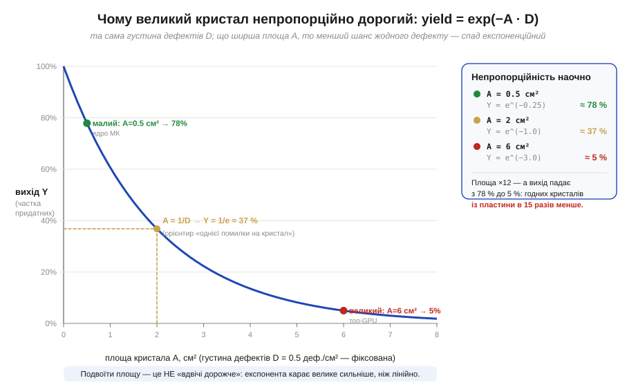
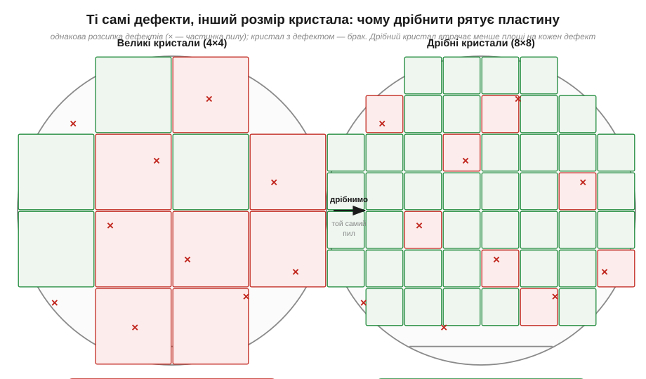
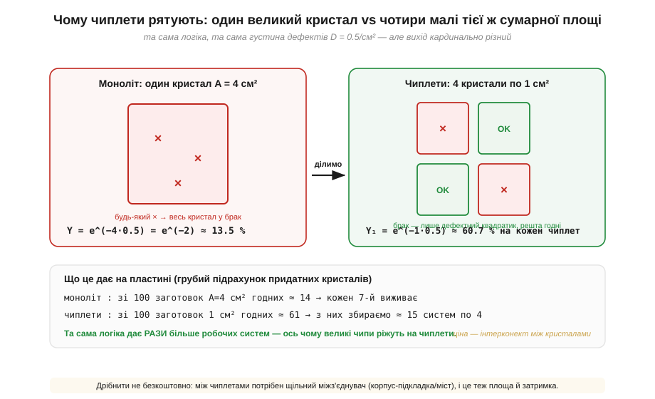

# 🧮 Математика yield: дефекти на см², модель Пуассона і чому чиплети рятують

> Числова вставка про [**вихід придатних кристалів**](book:electronics/yield) (*yield*). На пластині неминуче сідають випадкові дефекти, і чим більший кристал, тим важче йому вціліти, — тому великий кристал коштує **непропорційно** дорого. Тут ми доводимо це «непропорційно» до точної формули. Одного множника — площі кристала в експоненті — досить, щоб пояснити і ціну топового процесора, і моду останніх років різати велику мікросхему на дрібні **чиплети** (*chiplets*).

### Означення: густина дефектів і вихід

Почнемо з двох чисел, якими індустрія міряє цю біду. Перше — **густина дефектів** (*defect density*, D): скільки фатальних дефектів припадає на одиницю площі пластини, зазвичай на квадратний сантиметр. «Фатальний» означає, що дефект убиває кристал: розрив доріжки, замкнення, частинка пилу в потрібному місці. Друге число — **вихід придатних** (*yield*, Y): яка частка кристалів на пластині працює. Саме він — головна економічна величина фабрики, і саме його ми хочемо передбачити з густини дефектів та площі кристала.

```
D — дефектів на см²   (наскільки «брудний» процес)
A — площа кристала, см²   (наскільки великий кристал ми ріжемо)
Y — вихід: частка придатних кристалів  (що з цього виходить)
```

### Інтуїція: чому площа сидить саме в експоненті

Перш ніж виписувати формулу, варто відчути, **чому** залежність нелінійна. Уявімо, що дефекти падають на пластину як рідкі краплі дощу на бруківку — кожне місце однаково ймовірне, і краплі не змовляються між собою. Кристал виживає лише тоді, коли **жоден** дефект не влучив у його площу. Ось тут і ховається підступ: подвоїти площу — це не «впустити вдвічі більше шкоди», а **вдвічі знизити шанс уникнути всіх дефектів одразу**, бо ймовірності вцілілих ділянок перемножуються, а не додаються. Перемноження однакових множників — це і є степінь, тобто експонента. Звідси й береться та сама непропорційність, схована у слові «yield».


*Рис. Вихід Y залежно від площі кристала A при сталій густині дефектів D = 0.5 деф./см². Спад експоненційний: малий кристал (ядро мікроконтролера) бере зі своїх 78 %, а вшестеро більший «топ-GPU» падає до 5 %. Жовтий орієнтир — «одна помилка на кристал»: на площі A = 1/D вихід дорівнює 1/e ≈ 37 %. Праворуч — той самий розклад числами: площа зросла в 12 разів, а годних кристалів стало в 15 разів менше.*

### Формальний апарат: модель Пуассона

Тепер переведемо цю картину в число. «Рідкі незалежні випадкові події на площі» — це рівно той опис, для якого статистика має готову відповідь: [**розподіл Пуассона**](book:math/poisson-statistics) (*Poisson distribution*, на честь Сімеона Дені Пуассона — Siméon Denis Poisson). Він каже, що ймовірність застати **рівно нуль** подій, коли в середньому їх очікується λ, дорівнює e⁻λ. У нас середня кількість дефектів на кристал — це густина, помножена на площу, λ = A·D, а «нуль дефектів» і є умовою придатності. Підставляємо:

```
λ = A · D          (середнє число дефектів на один кристал)
Y = e^(−A·D)       (ймовірність, що їх рівно нуль → кристал годен)
```

Це і є шукана формула, проста до краси. Перевіримо її на двох краях звичайним прийомом здорового глузду: при A → 0 (нескінченно малий кристал) маємо Y = e⁰ = 1, тобто крихітна точка майже завжди ціла; при дуже великій площі A·D росте, а Y → 0 — гігантський кристал приречений. Обидві межі збігаються з інтуїцією, тож формулі можна вірити. Числа з кривої виходу — це просто підстановки в неї:

```
A = 0.5 см² :  Y = e^(−0.25) ≈ 78 %
A = 2   см² :  Y = e^(−1.0)  ≈ 37 %    ← рівно 1/e: «одна помилка на кристал»
A = 6   см² :  Y = e^(−3.0)  ≈ 5 %
```

Справжня фабрика додає до цього поправочні коефіцієнти (дефекти трохи злипаються в кластери, а не падають ідеально нарізно), тому в індустрії живуть і складніші формули — модель Мерфі, негативно-біноміальна. Але голова в усіх одна й та сама: площа кристала стоїть в експоненті, і саме вона диктує економіку.

### Геометрія тієї ж біди

Формула — це алгебра, але за нею стоїть наочна геометрія, яку корисно побачити окремо. Візьмемо одну й ту саму розсипку пилу на пластині й покладемо на неї спершу велику сітку кристалів, а тоді дрібну. Та сама пилинка, що губить здоровенний кристал великої сітки, у дрібній сітці зачепить лише крихітний квадратик — а решта поруч залишаться цілі.


*Рис. Дві пластини з ідентичною розсипкою дефектів (× — частинка пилу). Ліворуч кристали великі (сітка 4×4): кожна пилинка списує в брак чималий шмат, і придатних лишається мало. Праворуч ту саму пластину порізано дрібно (8×8): дефекти псують лише свої квадратики, тож частка придатних помітно вища. Дрібний кристал втрачає на кожному дефекті менше площі — це та сама експонента, але побачена очима.*

### Де в курсі це працює: чому винайшли чиплети

Звідси випливає несподівано практичний висновок, який останнім десятиліттям перекроїв проєктування процесорів. Якщо великий кристал площі A приречений на мізерний вихід, то навіщо взагалі його робити суцільним? Розріжемо ту саму логіку на N **чиплетів** по A/N кожен — і з'єднаємо їх щільним міжз'єднувачем уже в спільному [корпусі](book:electronics/packaging). Вихід кожного дрібного кристала рахується тією ж формулою, але площа в експоненті тепер уп'ятеро-вшестеро менша:

```
моноліт :  A = 4 см²,   Y = e^(−4·0.5) = e^(−2)   ≈ 13.5 %
чиплет  :  a = 1 см²,   Y = e^(−1·0.5) = e^(−0.5) ≈ 60.7 %  (на кожен з чотирьох)
```


*Рис. Один монолітний кристал на 4 см² проти чотирьох чиплетів по 1 см² тієї ж сумарної площі. У моноліта будь-який дефект списує всю мікросхему — вихід ≈ 13.5 %. У чиплетів брак з'їдає лише дефектний кристалик, а кожен окремий виходить із шансом ≈ 61 %. Грубий підрахунок: зі 100 монолітних заготовок виживає близько 14, а зі 100 дрібних — близько 61, з яких збираємо ≈ 15 готових систем по чотири. Ціна виграшу — щільний міжз'єднувач між кристалами: він теж займає площу й додає затримку.*

Виграш не безкоштовний, і це чесно видно на тому ж рисунку: чиплети треба зшити докупи щільними лініями зв'язку, а це додаткова площа, затримка й інженерна морока. Тому суцільний кристал не зник — для невеликої логіки (як ядро мікроконтролера з тих самих 78 % виходу) ділити нема сенсу. Але щойно площа підбиває вихід до одиниць відсотків, експонента з нашої формули робить дроблення єдиним розумним вибором — і саме її, а не примху моди, ми бачимо за словом «чиплети» в новинах про процесори.

> 🔧 **Навіщо це.** Формула Y = e⁻ᴬ·ᴰ — це кишеньковий тест на здоровий глузд для двох речей. Перша — **читати між рядків про ціну чипів**: коли топовий процесор коштує як уживане авто, винна не жадібність, а ця експонента — великий кристал просто рідко виходить цілим, і ціна годних покриває гори браку. Друга — **розуміти архітектурні новини**: «перейшли на чиплети», «з'єднали кілька кристалів у корпусі» — це не маркетинг, а пряма відповідь на e⁻ᴬ·ᴰ, спосіб втримати вихід там, де суцільний кристал завалив би всю економіку. А загальний урок ширший за кремній: щойно успіх вимагає, аби **все** йшло без жодної помилки на великій «площі», ймовірність провалу росте експоненційно — і розумніше нарізати задачу на дрібні незалежні шматки, ніж покладатися на безпомилковість одного великого.
