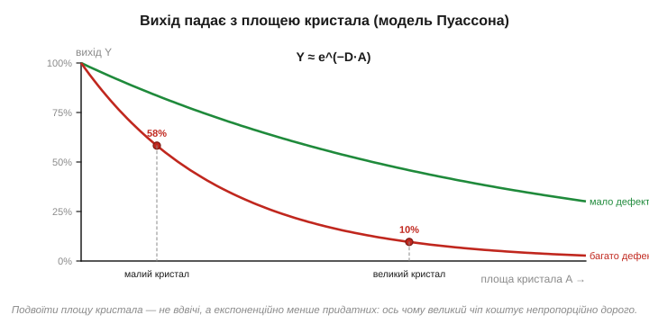

# Yield: дефекти як статистика

Легко припустити, що з пластини виходять самі справні чіпи. Насправді — далеко не всі, і часто навіть не більшість. Хоч би якою чистою була [кімната, де друкують шар за шаром](book:electronics/photolithography), і досконалими [хімічні кроки легування й травлення](book:electronics/doping-etching-metal), на пластині неминуче трапляються **дефекти**: випадкова порошинка, що все ж прослизнула крізь фільтри, дрібний збій у друку чи травленні, точкова неоднорідність кристала, мікроскопічна подряпина. На масштабах мільярдів елементів і сотень кроків абсолютна бездоганність недосяжна в принципі — десь та щось та піде не так. Кожен такий дефект, що влучив у кристал, найчастіше робить його непрацездатним.

Частку придатних кристалів називають **виходом** (*yield*), і це — одне з найважливіших чисел в усій економіці чипів, не менш важливе за саму архітектуру: від нього прямо залежить, скільки коштує кожен проданий чіп. Найцікавіше й найнесподіваніше тут — **не** сам факт браку, а те, як вихід залежить від **розміру** кристала. Здавалося б, удвічі більший кристал мав би коштувати приблизно вдвічі дорожче. А виявляється — у **рази** дорожче, бо великий кристал програє за виходом непропорційно своїй площі. Саме цей нелінійний зв'язок — серцевина теми, і він пояснює дуже багато: від ціни топових процесорів до моди на чиплети. Розберімо його — це красива й дуже практична статистика.

### Дефекти випадкові, кристал або живий, або ні

Почнімо з картини того, що відбувається на пластині. Дефекти розкидані по ній **випадково**, з певною середньою густиною (стільки-то дефектів на см²). А пластина поділена на прямокутні кристали — майбутні чіпи.


*Рис. Дві пластини з **однаковою** густиною й розташуванням дефектів (червоні точки), але різним розміром кристала. На лівій — великі кристали: майже кожен ловить хоч один дефект, тож **придатних мало** (низький вихід). На правій — дрібні кристали з тих самих дефектів: уражено лише ті кілька, у які точка справді влучила, а решта ціла (високий вихід). Кожна точка вбиває рівно той кристал, у який потрапила, — тому площа кристала визначає, наскільки ймовірно він «спіймає» дефект.*

Суть — у простому, але неочевидному міркуванні. Кристал гине, якщо в нього влучив **хоч один** дефект (зазвичай досить однієї пошкодженої ділянки — обірваного дроту, закороченого транзистора, — щоб уся складна схема не запрацювала; для логіки це майже завжди так, хоч пам'ять часом рятують запасними рядками). А ймовірність, що в кристал влучить дефект, зростає з його **площею**: великий кристал — велика мішень, він «збирає» дефекти майже напевно; дрібний — мала мішень, повз нього дефекти переважно проходять, влучаючи лише в той один, на який сіли.

Цю інтуїцію легко відчути на крайнощах. Уявіть пластину, нарізану на **один-єдиний** велетенський кристал на всю площу: будь-який дефект на пластині — у ньому, тож вихід практично нульовий, варто з'явитися хоч одній пилинці. Тепер уявіть протилежне — нарізку на **тисячі крихітних** кристалів: кожен дефект псує лише один із них, а решта тисяч цілі, тож вихід близький до 100%. Реальність — десь поміж, але напрямок ясний: що більший кристал, то ймовірніше він містить дефект і гине. Це не випадковість конкретної пластини, а **статистика площі**.

Корисно тут і відчуття реальних чисел. Густина дефектів на зрілому процесі — порядку часток одиниці на квадратний сантиметр (скажімо, 0.1–0.5 деф./см²); на щойно запущеному — помітно більша. Тобто на пластині 300 мм (площею ~700 см²) сидять десятки-сотні дефектів, розкиданих випадково. Дрібний кристал у кілька міліметрів збоку має непогані шанси їх оминути; кристал у сантиметри — майже напевно котрийсь та спіймає. Ось чому навіть на чудовому процесі великі кристали мають відчутний відсоток браку, тоді як дрібні виходять майже всі. Звідси й випливає головний кількісний висновок розділу.

### Модель: вихід падає експоненційно

Цю залежність можна записати простою формулою — і вона пояснює, чому великі чіпи такі дорогі.


*Рис. Залежність виходу Y від площі кристала A за моделлю Пуассона: Y ≈ e^(−D·A), де D — густина дефектів. Крива падає **експоненційно**: подвоїти площу — отримати не вдвічі менше придатних, а значно менше. Дві криві — для меншої й більшої густини дефектів; точки показують, як на одній і тій самій кривій малий кристал має високий вихід, а великий — низький. Саме ця експонента робить великий кристал непропорційно дорогим.*

Звідки взагалі береться експонента? З простого ймовірнісного міркування. Уявімо, що площа кристала складається з безлічі крихітних клітинок, і в кожну дефект може влучити чи ні незалежно від інших. Імовірність, що **жодна** клітинка не вражена, — це добуток багатьох «не влучив» по всіх клітинках; а добуток безлічі однакових малих імовірностей якраз і дає експоненту. Чим більше клітинок (тобто чим більша площа A), тим більше множників менше за одиницю — і тим стрімкіше падає шанс «усі цілі». Формально це і є [розподіл Пуассона](book:math/poisson-statistics). Запишімо результат:

```
Y  ≈  e^(−D · A)

Y  — вихід (частка придатних кристалів)
D  — густина дефектів (на см²)
A  — площа одного кристала (см²)
```

Ключове тут — що залежність **експоненційна**, а не лінійна. Подвоївши площу A, ми не зменшуємо вихід удвічі — ми підносимо його до квадрата (бо e^(−2DA) = (e^(−DA))²), а число менше за одиницю в квадраті падає набагато швидше. Покажімо це конкретними числами.

**Приклад (вихід малого й великого кристала).** Густина дефектів D = 0.5 на см². Порівняймо два кристали: малий (площа 0.5 см², як у мікроконтролера) і великий (площа 6 см², як у потужного процесора).

```
Малий кристал:   Y = e^(−0.5 × 0.5)  = e^(−0.25)  ≈ 0.78   → 78% придатних
Великий кристал: Y = e^(−0.5 × 6.0)  = e^(−3.0)   ≈ 0.05   → лише 5% придатних!

Площа зросла в 12 разів (0.5 → 6 см²),
а вихід упав у ~16 разів (78% → 5%) — непропорційно.
```

Відчуйте різницю: малий кристал виходить справним у трьох випадках із чотирьох, а великий — лише в одному з двадцяти. Дев'ятнадцять із двадцяти таких велетнів ідуть у відходи, і кожен проданий мусить «відбити» вартість усіх загиблих сусідів. Саме ця математика — серцевина економіки чипів: вона каже, що **велика площа кристала карається непропорційно**. Тому розробники процесорів так бережуть кожен квадратний міліметр, а коли кристал мусить бути величезним (потужні серверні чи графічні процесори), його ціна злітає не лінійно, а круто вгору. Тут же корінь сучасної моди на **чиплети** — розбивати один великий чіп на кілька дрібних і [з'єднувати їх в одному корпусі](book:electronics/packaging): за прикладом вище, шість окремих кристалів по 1 см² матимуть куди вищий сукупний вихід, ніж один на 6 см². Точну математику чиплетів і моделі Пуассона розгортає окрема 🧮-вставка.

### Подвійний удар по ціні

Зведімо економічний наслідок докупи, бо великий кристал програє одразу за двома лініями.


*Рис. Чому великий кристал дорогий непропорційно — два множники в один бік. Перший: на пластині фіксованої площі великих кристалів просто **менше** вміщається. Другий: через більшу площу кожен із них **частіше бракований** (вихід Y нижчий). Обидва ефекти діють разом, тож **ціна за один придатний кристал** росте набагато швидше за саму площу — подвоєння площі може здорожчати чіп у кілька разів.*

Тут спрацьовує неприємна арифметика «двічі». З одного боку, на [круглій пластині фіксованого розміру](book:electronics/silicon-monocrystal) великих кристалів **фізично менше** — простий геометричний факт, помножений ще й на «крайовий податок» круга: чим більший кристал, то більше їх не вміщається цілими біля заокругленого краю. З іншого боку, **більша частка** цих і так нечисленних кристалів виявляється бракованою через експоненційне падіння виходу. Помножте одне на одне — і собівартість **одного придатного** кристала злітає набагато швидше, ніж зростає його площа.

Покажімо це в грошах одним ланцюжком міркування. Нехай пластина коштує фіксовану суму — скажімо, умовні $5000, незалежно від того, що на ній. Якщо це дрібні кристали (600 штук, вихід 78%), придатних виходить ~470, і кожен «коштує» 5000 / 470 ≈ $11. Якщо ж це великі кристали (нехай 80 штук, вихід 5%), придатних лише ~4, і кожен «коштує» 5000 / 4 ≈ $1250 — у понад сто разів дорожче, хоч пластина та сама! Ось чому два процесори з однаковою архітектурою, але різною площею кристала, можуть коштувати разюче по-різному, і чому індустрія так тисне на [зменшення норм](book:electronics/process-node) (щоб та сама логіка займала меншу площу) і на чиплети. Запам'ятайте цей зв'язок: **площа кристала — головний важіль собівартості**, і важіль різко нелінійний — кожен зайвий квадратний міліметр б'є по гаманцю сильніше за попередній.

### Вихід — величина рухлива

Досі ми брали густину дефектів D як дане число. Насправді вона **не стала** — вона падає з часом, у міру того як фабрика «навчається» робити новий чіп. І це теж пояснює багато з того, що ви бачите на ринку.

Коли процес тільки запускають, дефектів багато: технологію щойно освоїли, причини збоїв ще не всі знайдено, вихід може бути жалюгідні відсотки — буває, що з пластини живими виходять одиниці кристалів. Та інженери методично полюють на джерела дефектів — крок за кроком знаходять, чому гинуть кристали (тут забруднення, там нерівність шару, отам збій машини, ще десь поганий контакт), і усувають причини, одну за одною. Густина D повзе вниз, вихід — угору. Цей процес звуть **дозріванням** (*yield ramp*, *yield learning*), і він тягнеться місяцями, а то й роками для зовсім нового вузла. Зрілий, відпрацьований процес дає вихід у високі десятки відсотків навіть для великих кристалів, тоді як той самий дизайн на щойно запущеному процесі ледь жив. По суті, вихід — це міра не лише дизайну, а й того, **наскільки добре фабрика навчилася** робити саме цей чіп.

Звідси — реальні наслідки, які ви відчуваєте. **Дефіцит і ціна на старті**: коли виходить новий чіп на новому процесі, його мало й він дорогий саме тому, що вихід ще низький; за рік-два, у міру дозрівання, і ціна падає, і доступність зростає — той самий кремній стає дешевшим без жодних змін у дизайні. **Зрілі процеси дешевші**: старіші вузли (як-от 28 нм чи 65 нм), де процес давно відшліфований і обладнання окуплене, дають високий вихід за малі гроші — тому переважна більшість мікроконтролерів і простих чипів робиться зовсім **не** на найновіших «нанометрах», а на зрілих процесах, де вони дешеві й надійні. Передовий вузол беруть лише там, де без нього ніяк (топові процесори, графіка). Це прямо стосується вибору компонентів: «старий» техпроцес вашого мікроконтролера — не вада, а ознака дешевизни й зрілості.

> 🔧 **Навіщо це.** Yield пояснює речі, які інакше здаються примхами ринку. Перше: **чому потужні чіпи коштують непропорційно дорого** — не вдвічі більший кристал коштує вдвічі більше, а в рази, через експоненту виходу; це прямо формує ціни процесорів і пам'яті, які ви закладаєте в кошторис пристрою. Друге: **чому існують дешевші «урізані» версії** — кристал із дрібним дефектом не викидають, а [продають із вимкненим бракованим блоком](book:electronics/testing-binning); binning виростає прямо з реальності дефектів. Третє: **чому нові чіпи спершу дорогі й дефіцитні, а зрілі — дешеві** — це дозрівання виходу в дії; прості компоненти роблять на зрілих вузлах саме заради дешевизни. Четверте, проєктне: коли обираєте мікроконтролер, ви опосередковано платите за площу його кристала — простіший чіп дешевший не лише «бо слабший», а й бо **дрібніший і має вищий вихід**. А загальний урок інженерний: на масштабах мільярдів транзисторів досконалість недосяжна, тож виробництво мислить **статистикою й виходом**, а не «справно/несправно» поштучно. Це той самий перехід від детермінізму до ймовірності, що й у [кодах виявлення та виправлення помилок](book:communications/data-reliability), тільки тепер у залізі.
