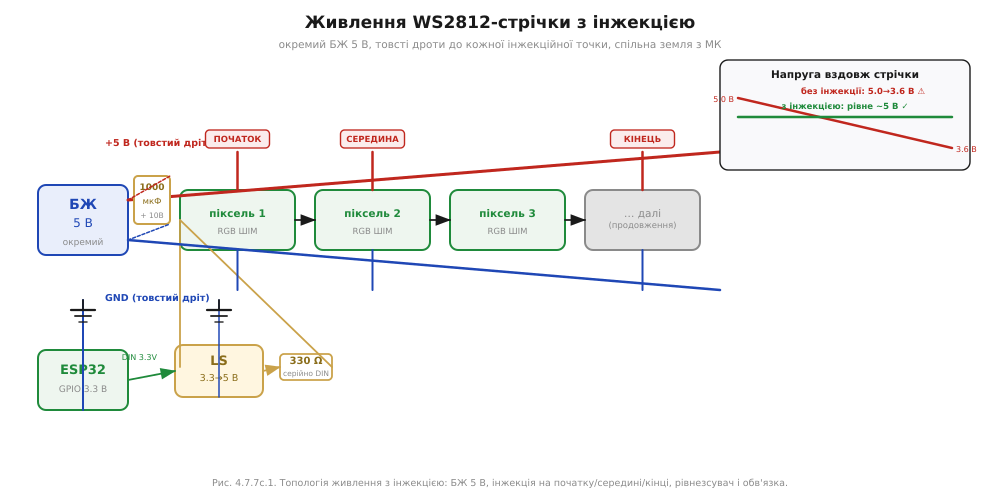
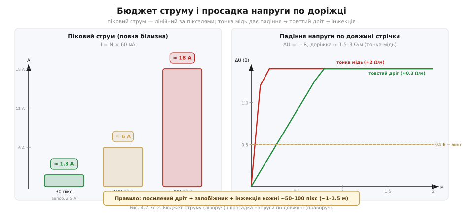

# 📋 Обв'язка стрічки WS2812-класу: розпіновка, живлення, рівні, інжекція

Це — апаратний контракт, щоб стрічка WS2812-класу засвітилася й не згоріла: які три контакти в неї стирчать, звідки брати струм (а сотня пікселів на повній білизні — це ~6 А), які номінали резистора й конденсатора ставити, де і скільки разів підводити живлення, як узгодити 3.3 В логіки ESP32 з 5 В стрічки. Науку [адресних світлодіодів](book:electronics/addressable-leds) — чому один дріт даних і чому ШІМ усередині пікселя — розказано в темі; сам [протокол і таймінг](book:electronics/addressable-leds/api-ws2812-protocol.md) — окремо; тут лише електрика підключення. Чим різняться сімейства класу (5 В проти 12 В, 24 біти проти 32) — у [🔌-вставці про сімейства](book:electronics/addressable-leds/comp-ws2812-family.md).

---

## Розпіновка

Кожен піксель (і кожен відрізок стрічки) має три контакти: **5V** (+5 В, живлення), **GND** (земля) та **DIN** (data in, вхід даних). На протилежному кінці виходять ті самі 5V, GND і **DOUT** (data out) — для наступного сегмента. Напрямок даних позначено стрілками й написами DIN→DOUT; переплутати їх — найпоширеніша помилка, і стрічка тоді просто мовчить або поводиться хаотично, а причина не відразу очевидна.

Фізично стрічка — гнучка PCB з інтегрованих піксельних мікросхем; щільність стандартна: 30, 60 або 144 пікселів на метр. Між сусідніми пікселями є мітка-ножиці: там доріжки живлення й даних ріжуться без ризику, а відрізаний сегмент підключається окремо за тими самими трьома контактами.

## Живлення — це розподілена силова шина

Стрічка — не просто набір пікселів, а **розподілена силова шина** плюс один сигнальний дріт. Кожен піксель висить на лінії +5 В і GND, і через цю шину тече весь струм усіх увімкнених субсвітлодіодів.



*Живлення стрічки з інжекцією. Окремий блок 5 В підведено на початок, середину і кінець (товсті дроти +5 В і GND); спільна земля з ESP32; біля 1-го пікселя — рівнезсувач 3.3→5 В на лінії DIN, послідовний резистор 330 Ω і конденсатор 1000 мкФ на вході живлення. Угорі праворуч — градієнт напруги без інжекції (5.0 В→3.6 В, кінець жовтіє) проти рівного з інжекцією.*

| Вузол | Роль |
|---|---|
| **Блок живлення 5 В (окремий)** | єдине джерело струму для стрічки; USB/3.3 В ніжки МК тут не місце — вони [не тягнуть такий струм](book:electronics/pin-drive-limits) |
| **[Рівнезсувач](book:electronics/level-shifter)** | піднімає сигнал даних з 3.3 В ESP32 до ~5 В ≥ поріг пікселя |
| **Резистор 330 Ω на DIN** | гасить дзвін фронту, захищає вхід першого пікселя |
| **Конденсатор 1000 мкФ на вході** | буферує стрибок струму при увімкненні |
| **Товсті дроти +5 В і GND** | мінімальне спадіння напруги по довжині шини |
| **Точки інжекції** | підводять свіжі 5 В у середину і кінець довгої стрічки |

## Номінали обв'язки

**Резистор на DIN.** Послідовно перед входом першого пікселя — **220–470 Ω** (типово **330 Ω**). Фронти на 800 кГц дуже круті; ємність дроту й вхідна ємність пікселя разом утворюють [RC-контур](book:electronics/rc-filter), і без обмежувального резистора короткий паразитний дзвін на фронті може зчитатися як хибний символ. Резистор ставлять якнайближче до пікселя, а не до МК.

**Конденсатор на живленні.** Між +5 В і GND — електролітичний **≈1000 мкФ, ≥ 6.3 В** (краще 10–16 В: більший запас напруги подовжує ресурс). У момент подачі живлення стрічка бере великий струм заряджання внутрішніх ємностей пікселів; без буферного конденсатора цей стрибок спричиняє [brownout](book:programming/reset-causes) або псує перший піксель. Полярність обов'язкова: «+» до +5 В.

**Бюджет струму й перетин дроту:**

```
Дано: N = 100 пікселів, повна білизна (R=255, G=255, B=255)
Струм одного пікселя: 3 × 20 мА = 60 мА
Загальний пік:         I = 100 × 60 мА = 6000 мА = 6 А
Запобіжник:            ~1.25 × I = 7.5 А → стандарт 7.5 А або 8 А

Просадка по доріжці стрічки (тонка мідь, ≈0.5 Ω/м):
  ΔU = I · R = 6 А × 0.5 Ω/м × 1 м = 3 В за метр  ← кінець метрової стрічки недосвічує

Дріт живлення (зовнішній):
  6 А через 0.75 мм² мідь, 1 м → R ≈ 0.024 Ω → ΔU ≈ 0.14 В  ✓
  Мінімальний перетин для 6 А: ≥ 0.75 мм² (краще 1.0–1.5 мм²)
```

Одна точка живлення не справляється вже на метрі стрічки 60 LED/м — потрібна інжекція.

## Інжекція живлення: скільки точок і де

Правило емпіричне й перевірене практикою: **підводити +5 В і GND кожні 50–100 пікселів**, тобто кожні **1–1.5 метра** (для щільності 60 LED/м). «Підводити» — товстим дротом від блока живлення прямо до лінії живлення стрічки, припаяним або через клему до точки між пікселями.

Критично: інжектувати **обидва дроти — і +5 В, і GND**. Зворотний струм теж тече міддю; якщо шина GND тонка, на ній виникає власне падіння напруги. Воно зсуває потенціал нуля відносно МК — і сигнал DIN стає нечитабельним для пікселів, навіть якщо +5 В виглядає нормально. Земля — теж шина з опором, а не один раз підключений дріт.



*Бюджет струму й просадка. Ліворуч: піковий струм = пікселі × 60 мА (повна білизна) — 30 пікс ≈ 1.8 А, 100 ≈ 6 А, 300 ≈ 18 А, з рекомендованим номіналом запобіжника. Праворуч: падіння ΔU = I·R уздовж мідної доріжки стрічки — тонка мідь (≈2 Ω/м) проти товстого зовнішнього дроту (≈0.3 Ω/м); пунктир 0.5 В — межа, нижче якої стрічка помилятиметься.*

> 🔧 **Навіщо це — практичний крок**
>
> 1. Порахуй максимальний струм: I = N × 60 мА.
> 2. Добери блок живлення із запасом ×1.25–1.5 понад I.
> 3. Постав запобіжник трохи вище I (I × 1.25).
> 4. Визнач перетин зовнішнього дроту: мінімум 0.75 мм² на кожен ампер, краще 1.0–1.5 мм².
> 5. Інжектуй +5 В і GND кожні ~50–100 пікселів.
> 6. Не живи метрову стрічку через USB ESP32: USB дає 500 мА, стрічці треба ~3.6 А → [brownout](book:programming/reset-causes) або пожежа.

## Рівні: 3.3 В логіки проти 5 В стрічки

ESP32 виводить сигнали 3.3 В, а піксель WS2812B гарантує розпізнавання HIGH при напрузі ≥ 0.7 × VDD. Якщо стрічка живиться від 5 В, поріг = 0.7 × 5 = **3.5 В** — трохи вище за 3.3 В ESP32. Формально — за межею; на практиці одні партії пікселів читають 3.3 В нормально, інші — ні, і це найнеприємніший тип несправності («іноді працює»).

Два надійних рішення: поставити [**рівнезсувач 3.3→5 В**](book:electronics/level-shifter) якнайближче до першого пікселя, або живити перший сегмент трохи нижчою напругою (~4.5–4.7 В через діод на живленні), щоб знизити й поріг входу. Перший спосіб надійніший і чистіший.

## Перший запуск

Мінімальний робочий код (C++ — Adafruit\_NeoPixel, RMT-бекенд ESP32; MicroPython — вбудований модуль `neopixel` поверх `machine`):

:::tabs

```cpp
#include <Adafruit_NeoPixel.h>

#define PIN   5          // GPIO даних (через рівнезсув на DIN стрічки)
#define N     100        // кількість пікселів у стрічці

Adafruit_NeoPixel strip(N, PIN, NEO_GRB + NEO_KHZ800);

void setup() {
    strip.begin();
    strip.setBrightness(40);                          // ОБМЕЖУЄМО яскравість → менше струму!
    strip.setPixelColor(0, strip.Color(255, 0, 0));   // перший піксель — червоний
    strip.show();                                     // вилити кадр у стрічку + скидання (LOW ≥ 50 мкс)
}

void loop() {}
```

```python
# MicroPython на ESP32: модуль neopixel сам витримує таймінг WS2812.
from machine import Pin
from neopixel import NeoPixel

PIN = 5          # GPIO даних (через рівнезсув на DIN стрічки)
N   = 100        # кількість пікселів у стрічці

strip = NeoPixel(Pin(PIN, Pin.OUT), N)   # порядок байтів G-R-B — типовий для WS2812

scale = 40                               # обмежуємо яскравість вручну: 40/255 ≈ 0.16 струму
r, g, b = 255, 0, 0                       # перший піксель — червоний
strip[0] = (r * scale // 255, g * scale // 255, b * scale // 255)
strip.write()                            # вилити кадр у стрічку + скидання (LOW ≥ 50 мкс)
```

:::

`NEO_GRB` — порядок байтів G-R-B (а не R-G-B, як можна подумати), у якому пікселі WS2812 чекають кольорові дані. `setBrightness(40)` — реальний важіль обмеження струму: замість 6 А при значенні 255 стрічка споживатиме ~1 А при 40, зручно для першого запуску без потужного блока. Спільна земля МК і блока живлення — обов'язкова: без неї рівень DIN плаває відносно пікселя, бібліотека шле правильні дані, а піксель читає їх як сміття.

## Типові граблі

- **Живлення від USB МК → [brownout](book:programming/reset-causes).** USB дає 500 мА; навіть 10 пікселів на повній білизні — 600 мА. Стрічка тягне МК за собою.
- **Немає спільної землі між блоком живлення і МК.** Стрічка мовчить або блимає хаотично — навіть якщо +5 В у нормі.
- **Інжекція лише по +5 В без GND.** Шина GND теж має опір; просадка на ній зсуває рівні сигналу.
- **Одна точка живлення на довгу стрічку.** Кінець жовтіє (бракує синьої та зеленої), тьмяніє або смикається.
- **Забули резистор на DIN.** Перший піксель поступово деградує від дзвонів фронту; помітно через дні або тижні роботи.
- **Забули великий конденсатор.** Перший піксель глючить при кожному ввімкненні живлення.
- **Переплутали напрямок DIN/DOUT.** Жодного пікселя, жодного глюку — просто тиша.
- **Забули рівнезсувач.** 3.3 В «іноді» читається як HIGH — найгірший тип несправності, бо важко відтворити.
- **Повна біла на всю довжину без бюджету струму.** Штатний сценарій спрацювання запобіжника або пожежонебезпечного перегріву дроту.
- **Перевернута полярність електроліта.** Конденсатор виходить з ладу, іноді гучно.
- **Відсутній запобіжник.** Коротке замикання на 6-амперній стрічці — це не «перегорить і все»; це пожежа або розплавлений дріт.
