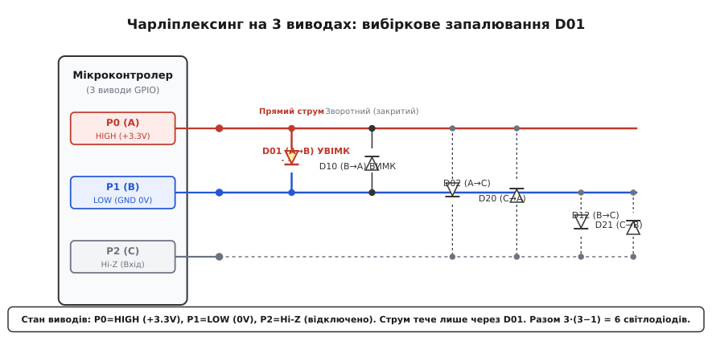
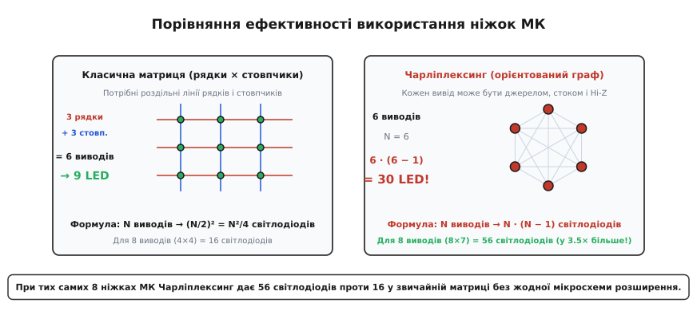
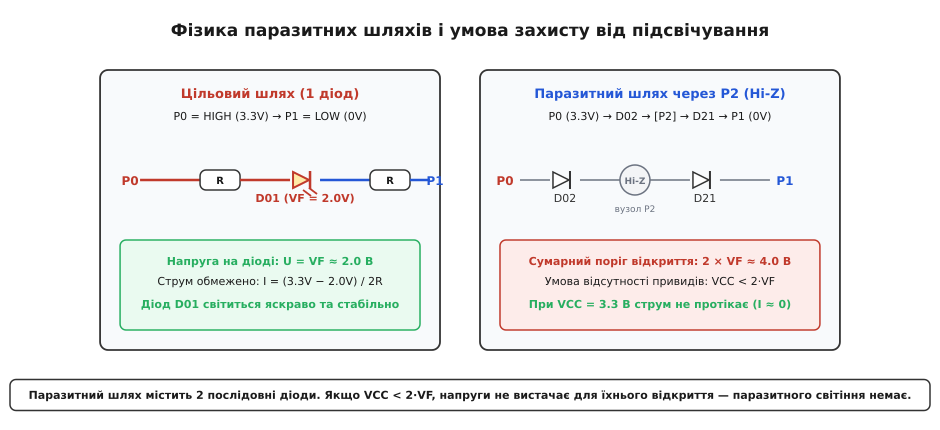
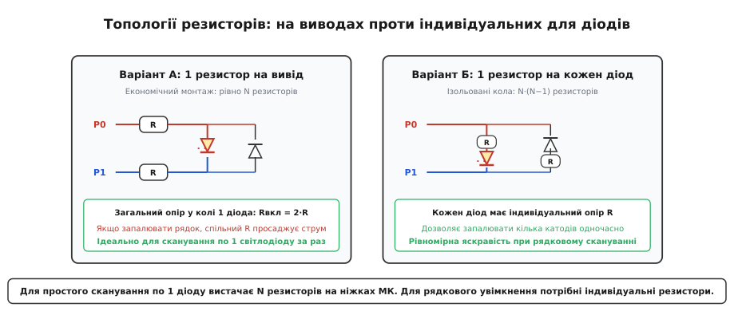
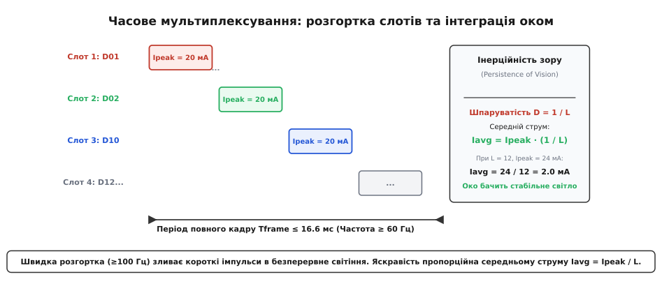

# Чарліплексинг (Charlieplexing)

<preknowlist>
- [Закон Ома](topic:electronics/ohms-law) — зв'язок напруги, струму й опору в електричному колі.
- [Світлодіод](topic:electronics/led) — однобічна провідність pn-переходу та пряме падіння напруги.
- [GPIO](topic:electronics/gpio) — режими цифрового виводу: HIGH, LOW і стан високого імпедансу (Hi-Z).
- [Мультиплексор](topic:electronics/multiplexer) — принцип часового розділення ліній зв'язку.
</preknowlist>

Мікроконтролер у компактному восьмививідному корпусі (наприклад, ATtiny85 чи PIC12F) має у розпорядженні інженера лише 5 вільних цифрових ліній [GPIO](topic:electronics/gpio). Якщо у приладі необхідно реалізувати шкалу стану чи матричний індикатор на 20 світлодіодів, пряме підключення вичерпується вже на п'ятому діоді. Класична матрична схема з виділеними лініями рядків і стовпчиків (2 рядки × 3 стовпчики) дозволяє увімкнути щонайбільше `2 · 3 = 6` індикаторів. Додавання зовнішніх зсувних регістрів або мікросхем-драйверів збільшує габарити друкованої плати, підвищує собівартість виробу та струм споживання в режимі очікування.

Цю інженерну суперечність розв'язує **Чарліплексинг** (англ. *Charlieplexing*, від імені винахідника Чарльза Аллена та терміна *multiplexing*, що походить від лат. *multiplex* — многократний, складний). Метод дозволяє керувати масивом із `N · (N − 1)` світлодіодів, використовуючи лише `N` ліній мікроконтролера без жодного зовнішнього активного компонента. Для 5 виводів це дає рівно `5 · 4 = 20` незалежних світлодіодів, а для 8 виводів — 56 світлодіодів замість 16 у звичайній матриці.

> 🔧 **Навіщо це.** Чарліплексинг є ключовим схемотехнічним прийомом в ультракомпактних та бюджетних пристроях: наручних годинниках, світлодіодних шкалах вимірювальних приладів, автомобільних панелях індикації, іграшках та мініатюрних платах розробника (таких як матриця 5×5 у BBC micro:bit), де кількість доступних ніжок мікроконтролера суворо обмежена фізичними розмірами корпусу.

---

### Фізичні першопричини: асиметрія діода та три стани логіки

Чарліплексинг не вимагає спеціалізованих апаратних блоків усередині кремнієвого кристала. Він базується на поєднанні двох фундаментальних властивостей напівпровідникової схемотехніки:

1. **Однобічна провідність [світлодіода](topic:electronics/led)**. Напівпровідниковий діод (грец. *dis* — двічі + *hodos* — шлях) на основі `pn`-переходу пропускає електричний струм лише тоді, коли потенціал анода (грец. *anodos* — рух угору) перевищує потенціал катода (грец. *kathodos* — рух униз) на величину прямого падіння напруги `V[F]` (типово 1.8–3.3 В залежно від кольору кристала). При прикладанні зворотної напруги діод закритий, а його опір сягає гігаомів, блокуючи будь-який струм аж до напруги зворотного пробою `V[BR]`.
2. **Тристанна логіка цифрового виводу (Tri-State Logic)**. Вихідний каскад сучасного мікроконтролера на комплементарних польових транзисторах (CMOS) може перебувати в одному з трьох станів:
   - **`HIGH`**: верхній польовий транзистор (P-MOS) відкритий, нижній закритий. Вивід з'єднаний із шиною живлення `V[CC]` і працює як активне джерело струму (current source).
   - **`LOW`**: нижній польовий транзистор (N-MOS) відкритий, верхній закритий. Вивід з'єднаний із шиною `GND` (`0 В`) і працює як активний стік струму (current sink).
   - **`Hi-Z` (High Impedance)**: обидва вихідні транзистори повністю закриті, внутрішні підтягувальні резистори вимкнені. Вивід має власний імпеданс (лат. *impedire* — перешкоджати) понад сотні мегаом і електрично від'єднується від схеми, не впливаючи на потенціали підключених до нього вузлів.

У класичній матриці виводи суворо поділені на ролі: одні завжди слугують джерелами (рядки), інші — стоками (стовпчики). У Чарліплексингу кожна цифрова лінія динамічно змінює свою роль на кожному кроці розгортки: в один мікросекундний інтервал вона штовхає струм (`HIGH`), у наступний — забирає його (`LOW`), а в решту часу стає ізолятором (`Hi-Z`).

Детальніше про історію виникнення цієї ідеї та інженерний контекст 1990-х років розказано у вставці [Історія появи Чарліплексингу](topic:electronics/charlieplexing/hist-charlie-allen.md).

---

### Топологія сітки та комбінаторика впорядкованих пар

Розглянемо схему підключення світлодіодів. Між кожною унікальною парою цифрових ліній встановлюються два світлодіоди, увімкнені зустрічно-паралельно (антипаралельно): анод першого з'єднується з першою лінією, катод — з другою; анод другого — з другою лінією, катод — з першою.


*Керування 6 світлодіодами через 3 виводи: P0 у стані HIGH, P1 у стані LOW, P2 у стані Hi-Z. Струм проходить виключно через діод D01.*

Щоб запалити конкретний діод `D[0, 1]` (анод на `P0`, катод на `P1`), програма виконує три дії:
- Вивід `P0` переводиться в режим виходу зі станом `HIGH` (+3.3 В).
- Вивід `P1` переводиться в режим виходу зі станом `LOW` (0 В).
- Вивід `P2` (і всі інші виводи схеми) переводиться в режим входу зі станом `Hi-Z`.

Струм від шини живлення виходить через вивід `P0`, проходить крізь струмообмежувальний резистор і діод `D[0, 1]` у прямому напрямку, після чого повертається в землю через вивід `P1`. При цьому:
- Зустрічний діод `D[1, 0]`, підключений між тими ж виводами, перебуває під зворотною напругою (на його катоді +3.3 В, на аноді 0 В) і надійно закритий.
- Діоди `D[0, 2]`, `D[2, 0]`, `D[1, 2]` та `D[2, 1]`, підключені до виводу `P2`, не можуть створити замкненого контуру зі землею чи живленням, оскільки вивід `P2` висить у повітрі (стан `Hi-Z`).

Кількість таких пар із `N` ліній дорівнює кількості способів обрати один вивід-джерело та один відмінний від нього вивід-стік:

```
L(N) = N · (N − 1)
```

Для `N = 3` отримуємо `3 · 2 = 6` світлодіодів; для `N = 4` — `4 · 3 = 12`; для `N = 6` — `6 · 5 = 30`; для `N = 8` — `8 · 7 = 56` світлодіодів.


*Звичайна матриця з 8 ліній дає 16 світлодіодів (4 рядки × 4 стовпчики), тоді як Чарліплексинг на тих самих 8 лініях забезпечує роботу 56 світлодіодів.*

Повний комбінаторний вивід формули ємності шини та її порівняння з класичною прямокутною матрицею наведено у вставці [Математичний аналіз графів і паразитних напруг](topic:electronics/charlieplexing/math-charlieplexing.md).

---

### Фізика паразитних шляхів і ефект примарного світіння (Ghosting)

Головна небезпека схемотехніки Чарліплексингу полягає у виникненні непередбачених паразитних шляхів протікання струму (sneak paths) через незадіяні виводи, що перебувають у стані `Hi-Z`.

Розглянемо випадок, коли активним є діод `D[0, 1]` (`P0 = HIGH`, `P1 = LOW`), а вивід `P2` перебуває у `Hi-Z`. Між лініями `P0` (+3.3 В) та `P1` (0 В) паралельно до діода `D[0, 1]` утворюється другий шлях: через діод `D[0, 2]`, ізольовану точку `P2` та діод `D[2, 1]`.


*Паразитний шлях містить два послідовні діоди D02 та D21. При VCC < 2·VF напруги живлення недостатньо для відкриття обох переходів, що запобігає появі примарного світіння.*

У цьому паразитному ланцюзі два світлодіоди `D[0, 2]` та `D[2, 1]` увімкнені послідовно у прямому напрямку. Сумарний поріг відкриття такого ланцюга дорівнює сумі прямих напруг обох діодів:

```
V[threshold,sneak] = V[F1] + V[F2] ≈ 2 · V[F]
```

Звідси випливає фундаментальний закон стійкості Чарліплексингу: **щоб паразитний струм не виникав, напруга живлення схеми `V[CC]` повинна бути меншою за подвійне пряме падіння напруги світлодіодів**:

```
V[CC] < 2 · V[F]
```

Розглянемо практичні наслідки цієї нерівності:

1. **Сині, білі та зелені світлодіоди (`V[F] ≈ 2.8 – 3.3 В`) при живленні `V[CC] = 3.3 В` або `5.0 В`:**
   Сумарний поріг становить `2 · 3.0 В = 6.0 В`. Оскільки `V[CC] = 3.3 В < 6.0 В` (і навіть `5.0 В < 6.0 В`), напруги живлення принципово недостатньо для подолання бар'єру двох послідовних `pn`-переходів. Струм витоку не перевищує часток мікроампера, паразитного підсвічування немає.
2. **Червоні, помаранчеві та жовті світлодіоди (`V[F] ≈ 1.6 – 2.0 В`) при живленні `V[CC] = 5.0 В`:**
   Сумарний поріг становить лише `2 · 1.7 В = 3.4 В`. При живленні 5.0 В різниця напруг `5.0 В − 3.4 В = 1.6 В` прикладеться до струмообмежувальних резисторів, спричиняючи помітне паразитне світіння діодів `D[0, 2]` та `D[2, 1]` (ефект привида / ghosting).
3. **Змішані матриці різних кольорів:**
   Якщо в одній сітці об'єднані червоні (`V[F] = 1.8 В`) та сині (`V[F] = 3.2 В`) діоди, відкриття синього діода при 5 В створить на паразитній гілці з двох червоних діодів спад `2 · 1.8 В = 3.6 В < 5.0 В`, викликаючи їхнє небажане світіння.

Для усунення паразитного світіння червоних світлодіодів при живленні 5 В знижують напругу живлення матриці до 3.3 В або встановлюють додаткові кремнієві діоди в гілки живлення.

---

### Топології розміщення струмообмежувальних резисторів

Оскільки світлодіод є приладом із нелінійною крутою вольт-амперною характеристикою, пряме підключення до джерела напруги без обмеження струму призводить до теплового руйнування кристала та виходу з ладу вихідних ключів мікроконтролера. За [законом Ома](topic:electronics/ohms-law) струм обмежується резисторами, причому в Чарліплексингу існують дві альтернативні топології їх розташування.


*Варіант А (по одному резистору на вивід МК) економить компоненти при скануванні по одному діоду; варіант Б (індивідуальний резистор на кожен діод) зберігає рівномірну яскравість при рядковому увімкненні.*

#### Варіант А: Один резистор на кожен вивід мікроконтролера (`N` резисторів)

Резистор номіналом `R` встановлюється безпосередньо у розрив кожної цифрової лінії мікроконтролера перед точками розгалуження діодної сітки.

- **Робота в колі:** При вмиканні діода `D[0, 1]` струм тече від виводу `P0` через перший резистор `R[0]`, діод `D[0, 1]` і другий резистор `R[1]` до виводу `P1`. Загальний опір кола становить `R[eq] = 2 · R`.
- **Розрахунок номіналу:**
  ```
  R = (V[CC] − V[F]) / (2 · I[LED])
  ```
  При `V[CC] = 3.3 В`, `V[F] = 2.1 В` та бажаному піковому струмі `I[LED] = 15 мА`:
  ```
  R = (3.3 − 2.1) / (2 · 0.015) = 1.2 / 0.030 = 40 Ом
  ```
- **Переваги:** Мінімальна кількість компонентів — для матриці з 12 світлодіодів потрібно лише 4 резистори.
- **Обмеження:** Схема розрахована виключно на поодиноке сканування світлодіодів. Якщо спробувати увімкнути одночасно два діоди зі спільним анодом (наприклад, `D[0, 1]` та `D[0, 2]`), струм обох діодів потече через єдиний верхній резистор `R[0]`. Спад напруги на ньому подвоїться, і яскравість кожного діода різко впаде.

#### Варіант Б: Індивідуальний резистор на кожен світлодіод (`N · (N − 1)` резисторів)

Кожен світлодіод має свій власний послідовно увімкнений резистор `R`, а виводи мікроконтролера підключаються до шин напряму.

- **Переваги:** Повна незалежність струму кожного діода. Дозволяє реалізувати рядкове сканування (Gipsonplexing): один вивід налаштовується як `HIGH` (джерело), а кілька інших одночасно переводяться в `LOW` (стоки). Усі відповідні діоди світяться одночасно з однаковою яскравістю, що збільшує шпаруватість у кілька разів.
- **Недоліки:** Збільшення кількості пасивних компонентів до `N · (N − 1)` (12 резисторів для 4 виводів).

---

### Часове мультиплексування, шпаруватість та інтеграція зором

У класичному Чарліплексингу в кожен дискретний момент часу горить лише один світлодіод. Для відображення складного символу чи довільного малюнка застосовують швидке часове мультиплексування (Time-Division Multiplexing, TDM).


*Послідовне сканування часових слотів на високій частоті: око інтегрує короткі імпульси у стабільну яскравість, пропорційну середньому струму.*

Мікроконтролер циклічно перебирає всі `L = N · (N − 1)` світлодіодів, запалюючи потрібні на короткий проміжок часу `t[on]`. Оскільки сітківка людського ока має інерційність зору (Persistence of Vision), періодичні спалахи з частотою понад критичну частоту злиття миготінь (`f[frame] ≥ 60 – 100 Гц`) сприймаються як безперервне світіння.

Яскравість світлодіода визначається середнім струмом `I[avg]`, який пов'язаний із піковим імпульсним струмом `I[peak]` через шпаруватість (коефіцієнт заповнення `D`):

```
D = t[on] / T[frame] = 1 / L = 1 / (N · (N − 1))
I[avg] = I[peak] · D = I[peak] / (N · (N − 1))
```

Щоб отримати еквівалентну яскравість безперервного світіння при середньому струмі `I[avg] = 2 мА` у матриці з 12 світлодіодів (`N = 4`), піковий струм в імпульсі має становити:

```
I[peak] = I[avg] · L = 2 мА · 12 = 24 мА
```

Значення 24 мА цілком допустиме для більшості мікроконтролерів. Проте при спробі збільшити матрицю до 30 діодів (`N = 6`) для збереження тієї ж яскравості потрібен піковий струм `I[peak] = 2 мА · 30 = 60 мА`, що перевищує максимально допустимий струм цифрового виводу багатьох кристалів. Це встановлює природну межу нарощування розмірності простого Чарліплексингу.

---

### Архітектура прошивки та програмна реалізація

Для усунення перешкод і надійної роботи пристрою програмний драйвер повинен задовольняти три обов'язкові вимоги:

1. **Неблокувальна робота за перериванням таймера.** Сканування не повинно виконуватися функціями блокувальної затримки (`delay`) у головному циклі програми, оскільки це заблокує виконання інших задач (обробку кнопок, інтерфейси зв'язку) і спричинить дрижання яскравості при зміні навантаження на процесор.
2. **Мертвий час між кроками (Dead-Time Insertion).** Перемикання станів виводів ніколи не відбувається миттєво. Якщо спочатку ввімкнути новий вихід `HIGH`, а вже потім перевести старий у `Hi-Z`, на час у кілька тактів процесора виникне некоректна комбінація рівнів, що проявиться як ледь помітне спалахування сусідніх діодів. Алгоритм зобов'язаний:
   - Спочатку перевести всі задіяні виводи в стан `Hi-Z`.
   - Потім встановити новий стан `HIGH` для анода та `LOW` для катода.
3. **Обов'язкове вимкнення внутрішніх підтяжок.** При переході виводу в режим входу (`INPUT`) регістр вихідного рівня обов'язково скидається в 0, інакше активується внутрішній резистор `Pull-Up` (20–50 кОм), через який потече паразитний струм `~100 мкА`.

Нижче наведено базовий приклад драйвера з подвійним буфером і викликом за перериванням таймера.

:::tabs
```c
#include <stdint.h>
#include <stdbool.h>

#define PINS_COUNT 3
#define LEDS_COUNT (PINS_COUNT * (PINS_COUNT - 1))

typedef struct {
    uint8_t anode;
    uint8_t cathode;
} CharliePair;

static const CharliePair LED_MAP[LEDS_COUNT] = {
    {0, 1}, {1, 0}, {0, 2}, {2, 0}, {1, 2}, {2, 1}
};

static volatile bool frame_buffer[LEDS_COUNT];
static volatile uint8_t current_slot = 0;

/* Апаратні виклики (приклад для умовного МК) */
extern void mcu_gpio_set_hiz(uint8_t pin);
extern void mcu_gpio_set_high(uint8_t pin);
extern void mcu_gpio_set_low(uint8_t pin);

/* Обробник апаратного таймера (викликається кожні 500 мкс) */
void Charlieplex_Timer_ISR(void) {
    /* 1. Dead-time: гасимо всі лінії */
    for (uint8_t i = 0; i < PINS_COUNT; ++i) {
        mcu_gpio_set_hiz(i);
    }

    /* 2. Вмикаємо активний світлодіод поточного слота */
    if (frame_buffer[current_slot]) {
        uint8_t a = LED_MAP[current_slot].anode;
        uint8_t c = LED_MAP[current_slot].cathode;
        mcu_gpio_set_high(a);
        mcu_gpio_set_low(c);
    }

    /* 3. Крок до наступного слота */
    if (++current_slot >= LEDS_COUNT) {
        current_slot = 0;
    }
}
```
```cpp
#include <array>
#include <cstdint>

template <size_t PinCount>
class CharlieplexDriver {
public:
    static constexpr size_t LedCount = PinCount * (PinCount - 1);

    struct PinPair {
        uint8_t anode;
        uint8_t cathode;
    };

    struct GpioInterface {
        void (*setHiZ)(uint8_t pin);
        void (*setHigh)(uint8_t pin);
        void (*setLow)(uint8_t pin);
    };

    explicit CharlieplexDriver(GpioInterface gpio) noexcept
        : gpio_(gpio), currentSlot_(0), buffer_{} {}

    void setPixel(size_t index, bool state) noexcept {
        if (index < LedCount) {
            buffer_[index] = state;
        }
    }

    void clear() noexcept {
        buffer_.fill(false);
    }

    /* Виклик у періодичному перериванні таймера */
    void handleInterrupt() noexcept {
        for (uint8_t i = 0; i < PinCount; ++i) {
            gpio_.setHiZ(i);
        }

        if (buffer_[currentSlot_]) {
            const auto pair = getPair(currentSlot_);
            gpio_.setHigh(pair.anode);
            gpio_.setLow(pair.cathode);
        }

        currentSlot_ = (currentSlot_ + 1) % LedCount;
    }

    [[nodiscard]] static constexpr PinPair getPair(size_t slot) noexcept {
        size_t idx = 0;
        for (uint8_t a = 0; a < PinCount; ++a) {
            for (uint8_t c = 0; c < PinCount; ++c) {
                if (a != c) {
                    if (idx == slot) return {a, c};
                    idx++;
                }
            }
        }
        return {0, 0};
    }

private:
    GpioInterface gpio_;
    size_t currentSlot_;
    std::array<bool, LedCount> buffer_;
};
```
:::

Повний проект драйвера з підтримкою ШІМ-градацій яскравості та прикладами для платформ AVR, STM32 та ESP-IDF наведено у вставці [Практична реалізація драйвера світлодіодної сітки](topic:electronics/charlieplexing/proj-charlieplex-driver.md).

Детальний опис типів даних, структур конфігурації та специфікацію функцій інтерфейсу можна знайти у вставці [Специфікація програмного інтерфейсу драйвера](topic:electronics/charlieplexing/api-charlieplex-driver.md).

---

### Специфікація помилок і типові схемотехнічні пастки

1. **Перевищення зворотної напруги пробою (`V[BR]`).** Більшість стандартних світлодіодів мають паспортну максимальну зворотну напругу `V[BR] ≈ 5 В`. У Чарліплексингу зворотна напруга на закритому діоді пари дорівнює напрузі живлення за вирахуванням падіння на резисторі (`V[rev] ≤ V[CC]`). Якщо схема живиться від 5 В або 3.3 В, напруга пробою не перевищується. Проте використання підвищеної напруги живлення (наприклад, 9 В або 12 В через буферні транзистори) без захисних діодів призведе до лавинного зворотного пробою світлодіодів.
2. **Спільне використання ліній із зовнішніми підтяжками (I2C/SPI).** Якщо лінії Чарліплексингу одночасно підключені до шин зв'язку із зовнішніми резисторами підтяжки до `V[CC]` (наприклад, лінії SDA/SCL шини I2C з підтяжкою 4.7 кОм), вивід ніколи не зможе перейти у справжній стан `Hi-Z`. Через підтяжку потече постійний струм на всі катоди, увімкнені до цієї лінії, викликаючи хаотичне світіння діодів.
3. **Ємність довгих ліній зв'язку.** При винесенні світлодіодної матриці на довгий шлейф монтажна ємність провідників (десятки пікофарад) уповільнює розряд вузлів при переході в `Hi-Z`. Для запобігання паразитним спалахам необхідно збільшувати інтервал мертвого часу (dead-time) між перемиканням слотів.
