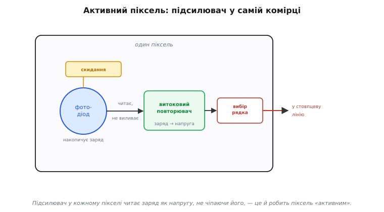

# CMOS-матриця

<preknowlist>
- [Сенсор зображення](book:electronics/image-sensor) — піксель як «відерце», що накопичує заряд, пропорційний світлу.
- [Транзистор](book:electronics/transistor-idea) — керований ключ і підсилювач: напруга на затворі керує струмом.
- [АЦП](book:electronics/adc) — як напругу перетворюють на число.
</preknowlist>

Один [піксель-«відерце»](book:electronics/image-sensor) ловить світло й накопичує заряд. Камера ж — це **мільйони** таких відерець, складених у сітку. І тут постає питання, якого з одним пікселем не було: як **прочитати** їх усі — швидко, дешево й не зіпсувавши слабкий сигнал шумом дорогою? Відповідь, що перемогла майже в кожній сучасній камері, зветься **CMOS-матриця** (англ. *complementary metal-oxide-semiconductor* — та сама технологія, на якій будують і звичайну логіку). Її суть — у двох ідеях: **кожен піксель має власний підсилювач** прямо в кремнії, а зчитують матрицю **рядок за рядком**, мов пам'ять. Розберімо обидві.

### Активний піксель: підсилювач у кожній комірці

Слабкий заряд із відерця — це лічені тисячі електронів. Якщо тягнути такий мізерний заряд довгим провідником через пів кристала до одного підсилювача на краю, дорогою він збере наводки й потоне в шумі. Тому CMOS робить інакше: ставить **підсилювач прямо в піксель**. Сигнал підсилюється там, де народився, ще до того, як вирушити в дорогу, — і йде вже не кволий заряд, а міцна напруга, якій наводки не страшні. Через цей вбудований підсилювач піксель і звуть **активним** (англ. *active pixel sensor*, APS — «сенсор з активним пікселем»), на відміну від **пасивного**, що віддавав голий заряд.

Підсилювачем служить один транзистор у схемі **витокового повторювача** (англ. *source follower* — «повторювач за витоком»). Працює він як буфер: на його затвор подано напругу від накопиченого заряду, а сам транзистор віддає назовні ту саму напругу, але вже «сильним голосом» — здатну прогнати струм по довгій лінії, **не чіпаючи** при цьому самого заряду. Заряд лишається на місці, а ми лише «підслухали» його напругу. Це і є серце активного пікселя: маленький підсилювач, що читає відерце, не виливаючи його.

*Активний піксель CMOS. Фотодіод накопичує заряд від світла; транзистор скидання очищає вузол перед кадром; витоковий повторювач перетворює заряд на напругу, не виливаючи його, і віддає її «сильним голосом» назовні; транзистор вибору рядка під'єднує цей вихід до стовпцевої лінії, коли надходить черга рядка. Підсилювач у кожній комірці — те, що робить піксель «активним».*

Крім повторювача, пікселю потрібні ще два ключі. **Транзистор скидання** (англ. *reset*) перед початком кадру з'єднує вузол накопичення з живленням і «зливає» старий заряд — очищає відерце до порожнього. **Транзистор вибору рядка** (англ. *row select*) — це засувка, що під'єднує вихід повторювача до стовпцевої лінії лише тоді, коли цей рядок зчитують; решту часу піксель «мовчить», не заважаючи сусідам по стовпцю. Три транзистори — скидання, повторювач, вибір — і фотодіод: це і є найпростіший активний піксель.

> 🔧 **Навіщо це.** «Підсилювач у кожному пікселі» — не дрібниця специфікації, а причина, чому CMOS-камера дешева, швидка й живе від батарейки. Бо сигнал підсилюється локально, матрицю можна робити на звичайній логічній фабриці поряд з усією іншою електронікою керування й оцифрування — усе на **одному** кристалі. Звідси й крихітні дешеві камери в кожному телефоні та дроні: це не «гірший» сенсор, а інша філософія зчитування, заточена під інтеграцію.

### Зчитування рядок за рядком, мов пам'ять

Маючи підсилювач у кожному пікселі, лишається зібрати кадр з мільйонів пікселів. Виводити кожен окремим дротом неможливо — дротів забракло б. Тому CMOS адресує матрицю, **мов пам'ять**: пікселі стоять рядками й стовпцями, а зчитування йде рядок за рядком.

Працює це так. Логіка вмикає **один рядок** — подає сигнал на лінію вибору, спільну для всіх пікселів цього рядка. Усі вони воднораз під'єднують свої повторювачі до **стовпцевих ліній**: у кожному стовпці тепер стоїть напруга свого пікселя з активного рядка. На краю кристала ці напруги ловлять **стовпцеві схеми** — підсилювачі, вузли вибірки й [аналого-цифрові перетворювачі](book:electronics/adc), по одному на стовпець. Вони **паралельно** оцифровують увесь рядок одразу — виходить рядок чисел. Тоді логіка вимикає цей рядок, вмикає наступний, і все повторюється — згори вниз, рядок за рядком, аж до останнього.

*Рядково-стовпцеве зчитування CMOS. Логіка вмикає один рядок (червоний); усі його пікселі віддають напругу в стовпцеві лінії; на краю кристала стовпцеві перетворювачі — по одному на стовпець — оцифровують увесь рядок паралельно. Тоді вмикається наступний рядок, і так згори вниз. Адресація рядок-стовпець, як у пам'яті, дозволяє вивести мільйони пікселів небагатьма лініями.*

Ключова деталь — **стовпцевий паралелізм**. Підсилювачів і перетворювачів стільки ж, скільки стовпців (тисячі), і вони працюють воднораз, кожен над своїм стовпцем. Тому за один такт оцифровується цілий рядок, а не піксель. Це і робить CMOS швидким: вузьке місце — лише кількість рядків, а не загальне число пікселів.

> 🔧 **Навіщо це.** Те, що зчитування йде **по рядках**, — корінь і швидкості CMOS, і його головної вади. Швидкість: стовпцевий паралелізм дає високу частоту кадрів за помірного споживання. Вада: рядки знято в **різні миті**, тож на швидкому русі геометрія кадру спотворюється — це [рядкова заслінка](book:electronics/rolling-shutter), прямий наслідок самої архітектури зчитування. Хочеш знімати без перекосу — шукай сенсор зі швидким зчитуванням рядка або з глобальною заслінкою.

### Чистий сигнал — окрема історія

Ці дві ідеї — підсилювач у кожній комірці та зчитування рядок за рядком — і є суть CMOS-матриці; саме за дешевизну, швидкість і живлення від батарейки вона витіснила старіший CCD з масової камери. Але щоб кадр вийшов справді чистим, лишається приборкати шум, який неминуче лишає скидання пікселя перед кадром. Це вимагає хитрішого пікселя — з четвертим транзистором (**4T**) — і трюку **корельованої подвійної вибірки**, а разом із ними тихого «пінованого» фотодіода й вибору між рядковою та глобальною заслінкою. Уся ця механіка чистого сигналу, разом із фізикою шуму й циклом зчитування по тактах, — у [докладному розборі](book:electronics/cmos-matrix/detail).

> 📜 Зробити з матриці пікселів дешеву «камеру на чіпі» зумів **Ерік Фоссум** із командою НАСівської Лабораторії реактивного руху (JPL) на початку 1990-х. Шукаючи, як **зменшити** камери для міжпланетних апаратів, не втративши якості, його група (зокрема Сунетра Мендіс і Сабрина Кемені) близько 1993 року довела до практичного вигляду **CMOS-сенсор з активним пікселем** із внутрішньопіксельним переносом заряду — тим самим затвором переносу, що згодом уможливив прибирання шуму. Сама ідея активного пікселя мала попередників (паралельно над MOS-сенсором працювала й Mitsubishi Electric, 1992), але доти такі сенсори надто шуміли; команда Фоссума **приборкала шум** — і вийшла «камера на одному кристалі». 1995 року він заснував компанію, щоб це продавати, а сьогодні цей винахід стоїть у **мільярдах** камер щороку — майже в кожному смартфоні. Космічна технологія, що опинилась у кожній кишені — і на кожному дроні.

---
