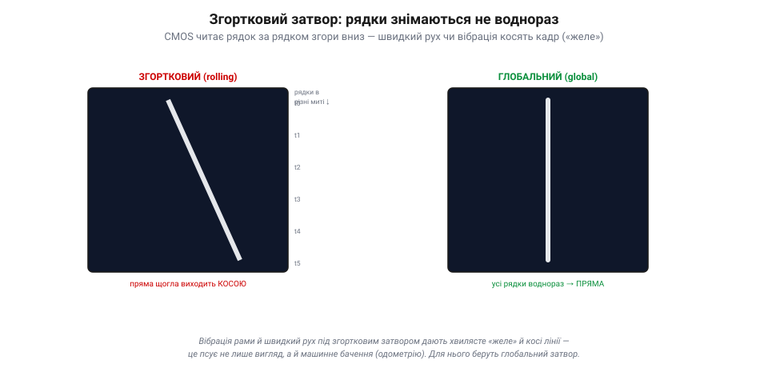

# Матриця CMOS; експозиція й підсилення

Окремий [піксель-«відерце»](book:electronics/image-sensor) ловить світло й перетворює його на число. Та камера — це не один піксель, а **мільйони** їх, складених у сітку, плюс хитра механіка зчитування й дві ручки яскравості. Цей рівень — від купи відерець до готового кадру — і розбираємо тут.

### Сітка відерець, адресована як пам'ять

Сенсор — це **матриця**: пікселі-відерця, вишикувані рядками й стовпцями, мільйонами. У найпростішій картині всі вони ловлять світло **воднораз** за час витримки (так і робить **глобальний** затвор; а в дешевшому **згортковому** рядки експонуються зі зсувом, що має свою ціну). А ось зчитати їх воднораз неможливо — тож сенсор адресує пікселі, мов комірки пам'яті.

*Рис. CMOS-матриця адресує пікселі, мов пам'ять. Мільйони пікселів-відерець стоять сіткою й ловлять світло воднораз. Зчитування: електроніка вмикає **один рядок** (червоний), усі його пікселі віддають заряд у **стовпцеві підсилювачі** → АЦП → потік чисел; тоді наступний рядок, згори вниз. У CMOS кожен піксель має свій підсилювач і адресується окремо — тому сенсор дешевий, швидкий, малоспоживний.*

Працює це так само, як читання пам'яті: електроніка **вмикає один рядок**, і всі його пікселі віддають свій заряд у **стовпцеві підсилювачі**, а ті — в АЦП; виходить рядок чисел. Тоді наступний рядок, і так згори вниз — точнісінько Фарнсвортова розгортка, тільки електронна й паралельна по стовпцях. Саме така архітектура й зветься **CMOS**: кожен піксель має **свій** підсилювач і адресується окремо, як осередок мікросхеми. Це робить сенсор дешевим, швидким, малоспоживним — тому CMOS і стоїть нині майже в кожній камері, від телефона до дрона.

> 📜 Зробити з матриці пікселів дешеву «камеру на чіпі» зумів **Ерік Фоссум** із командою НАСівської Лабораторії реактивного руху (JPL) на початку 1990-х. Шукаючи, як **зменшити** камери для міжпланетних апаратів, не втративши якості, його група (зокрема Сунетра Мендіс і Сабрина Кемені) 1993 року довела до практичного вигляду **CMOS-сенсор з активним пікселем**: кожен піксель дістав власний підсилювач прямо на чіпі. Сама ідея активного пікселя мала попередників, але доти такі сенсори надто шуміли; команда Фоссума **приборкала шум** — і вийшла «камера на одному кристалі». 1995-го він заснував компанію, щоб це продавати, а сьогодні його винахід стоїть у **мільярдах** камер щороку — майже в кожному смартфоні. Космічна технологія, що опинилась у кожній кишені — і на кожному дроні.

### Згортковий затвор: ціна рядкового зчитування

Та в рядкового зчитування є підступна ціна. Якщо пікселі **починають і завершують** збір світла не воднораз, а рядок за рядком згори вниз, то верх кадру знято трохи **раніше** за низ. Це **згортковий затвор** (*rolling shutter*) — і на швидкому русі він кривить картинку.

*Рис. Згортковий проти глобального затвора. **Згортковий** (ліворуч): рядки знято в різні миті (t0, t1, …) згори вниз, тож рухома пряма щогла виходить **косою**, а вібрація робить кадр хвилястим («желе»). **Глобальний** (праворуч): усі пікселі замикаються воднораз — щогла пряма. Для машинного бачення глобальний затвор кращий, та дорожчий.*

Уяви, що знімаєш швидку вертикальну щоглу, а вона (чи камера) рухається вбік. Поки сенсор дочитав до низу, об'єкт уже зрушив — і пряма щогла виходить **косою**. А коли апарат вібрує, різні рядки ловлять різну фазу тремтіння, і кадр **хвилюється**, наче желе (так і кажуть — *jello effect*). Ліки від цього — **глобальний затвор** (*global shutter*), де всі пікселі замикаються воднораз: жодного перекосу, та коштує він дорожче й складніший. Для звичайного відео терплять згортковий; а от для **машинного бачення** на дроні, де [кадр — це масив чисел](book:algorithms/image-as-data) для [одометрії](book:algorithms/odometry) чи фотограмметрії, перекоси отруйні, тож там цінують глобальний затвор.

> 🔧 **Навіщо це.** Хвилясте «желе» на FPV-відео й косі стовпи — це згортковий затвор плюс вібрація. Ліки ті самі, що рятують і [фьюжн із його затримками](book:algorithms/latency-sync): **гасити вібрацію** (м'яко підвісити камеру, збалансувати гвинти). А якщо камера працює на машинне бачення — бери сенсор із **глобальним затвором**, інакше алгоритми міритимуть скривлений світ.

### Дві ручки яскравості: витримка й підсилення

Кадр вийшов темним — як його **освітлити**? Ручок дві, і в кожної своя плата.

*Рис. Дві ручки яскравості. Темний кадр можна освітлити двома шляхами. **↑ Витримка** (синій): тримати відерце відкритим довше — більше світла, але ризик змазати рух. **↑ Підсилення** (бурштиновий): домножити вже зчитане число електронно — миттєво й без змазу, та множиться й **шум**, кадр зернить. Підсилення не додає світла — лише розтягує наявне разом із шумом.*

Перша ручка — **витримка**: тримай [відерце](book:electronics/image-sensor) відкритим **довше**, набереться більше світла, кадр яскравішає. Плата відома — **змаз** руху. Друга ручка — **підсилення** (*gain*, у фотографії — ISO): уже **зчитане** число просто **домножити** на електроніці. Кадр теж яскравішає, причому миттєво й без змазу. Та підсилення **не додає світла** — воно розтягує те, що є, **разом із шумом**: тихий дріб [випадкових електронів](book:electronics/image-sensor) множиться нарівні з сигналом, і кадр стає **зернистим**. Тому «витягнути» темний кадр підсиленням можна лише до межі: за нею бачиш не деталі, а зерно.

### Компроміс: на що міняти що

Складемо все в одну формулу яскравості: **світло сцени × витримка × підсилення**. Світло сцени тобі **не підвладне** (яке є, таке є), тож граєш лише двома ручками — а вони тягнуть у різні боки.

*Рис. Компроміс експозиції на дроні. Яскравість = світло × витримка × підсилення, а світло сцени тобі непідвладне — граєш двома ручками. На швидкому/тряскому апараті: коротка витримка (щоб не змазати) + високе підсилення (брак світла) → різко, але шумно. На повільному/стабільному: довга витримка + низьке підсилення → чисто, та чутливо до руху. На дроні зазвичай виграє перше.*

На **летючому апараті** вибір майже завжди той самий. Він тремтить і рухається, тож **довгу витримку дозволити не можна** — змаже. Лишається коротити витримку, а брак світла надолужувати **підсиленням** — і миритися з шумом. Тому відео з дрона поночі радше **зернисте, зате різке**, ніж яскраве й змазане: різкий шумний кадр корисніший і людині, і алгоритму, ніж гарний мазок. Автоматика камери (авто-експозиція) крутить ці ручки сама, тримаючи середню яскравість, — але її легко обдурити яскравим небом чи темною ціллю, бо вона [орієнтується на усереднену сцену](book:electronics/image-sensor).

> 🔧 **Навіщо це.** Зернистий нічний кадр із дрона — це не «погана камера», а неминучий наслідок короткої витримки плюс підсилення; інакше була б каша. Якщо керуєш налаштуваннями вручну: для машинного бачення став **межу витримки** короткою (щоб не змазувало), а яскравість лиши підсиленню — алгоритм радше переживе шум, ніж розмиту лінію. І не забувай: справжні ліки від браку світла — не ручки камери, а **більше світла** (ширша діафрагма, чутливіший сенсор) або ясніша сцена.

### Підсумок теми

Сенсор — це **матриця** мільйонів пікселів-відерець, що їх адресують, мов пам'ять: вмикають рядок, зчитують усі стовпці крізь підсилювачі в АЦП, і так згори вниз (архітектура **CMOS**, де в кожного пікселя свій підсилювач). Платою за рядкове зчитування є **згортковий затвор**: рядки знято в різні миті, тож рух і вібрація косять і хвилюють кадр — для машинного бачення беруть глобальний затвор і гасять вібрацію. Яскравість регулюють двома ручками: **витримка** набирає більше світла (ризик змазу), **підсилення** множить уже зчитаний сигнал разом із шумом (зернистість). А що світло сцени дане, на летючому апараті майже завжди виграє коротка витримка з підсиленням — різко, хоч і шумно. Так із мільйонів відерець народжується яскравий кадр; окреме питання — звідки в цьому кадрі береться [колір](book:algorithms/bayer-demosaic).

---
