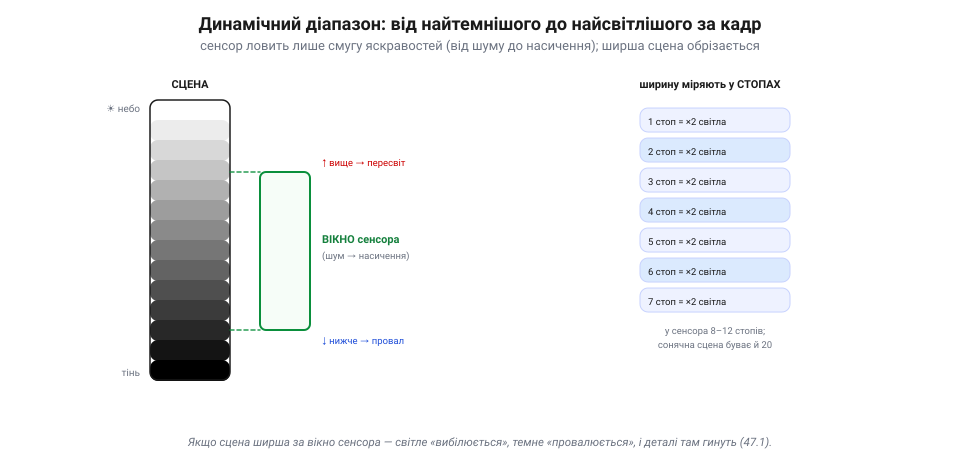

# Динамічний діапазон і шум

Коли [сенсор](book:electronics/image-sensor) спіймав світло, а [матриця пікселів](book:electronics/cmos-matrix) зчитала кадр, постає найважливіше питання для довіри до камери: **скільки в цьому кадрі правди?** Дві величини відповідають на це — **динамічний діапазон** (яку широчінь яскравостей камера вловить за один кадр) і **шум** (скільки в кадрі випадкового «зерна»). Саме вони визначають, чи побачить камера ціль у блиску сонця й у тіні — а отже, чи буде з неї користь машинному баченню.

### Динамічний діапазон: від тіні до блиску

У кожного [пікселя](book:electronics/image-sensor) є дві межі: знизу — **підлога шуму**, зверху — **насичення** (повна місткість). **Динамічний діапазон** (DR) — це і є відстань між ними: відношення найяскравішого світла, яке камера ще вловить, не «вибілившись», до найслабшого, яке ще видно над шумом. Усе, що ширше за цю смугу, гине.

*Рис. Динамічний діапазон і його межі. Сцена (ліворуч) тягнеться від яскравого неба до темної тіні. Сенсор ловить лише **смугу** яскравостей — від підлоги шуму до насичення (зелене вікно). Усе, що **вище** вікна, вибілюється; усе, що **нижче** — провалюється в чорноту, і деталі там гинуть. Ширину міряють у **стопах** (кожен — удвічі більше світла): у сенсора 8–12, а сонячна сцена буває й 20.*

Біда в тому, що реальні сцени бувають **ширші** за вікно сенсора. Класика — яскраве небо й темна земля під ним водночас: різниця в яскравості величезна. Якщо камера виставиться по небу — земля **провалиться** в чорноту; виставиться по землі — небо **вибілиться**. Деталі за межами вікна не приглушені, а **втрачені**: там нема даних. Широчінь діапазону міряють у **стопах** (кожен стоп — удвічі більше світла): у сенсора зазвичай 8–12 стопів, а сонячна сцена легко сягає 20. Звідси й вічна боротьба фотографа: вкласти важливе в обмежене вікно.

> 📜 Це мистецтво — вкладати неосяжну яскравість світу в скромний діапазон плівки — звели в науку **Ансель Адамс** і **Фред Арчер** близько 1939–40 років. Їхня **зонна система** ділила всю шкалу від чорного до білого на **одинадцять зон** (0 — чорне, X — біле, V — середнє сіре), де кожна зона — рівно один стоп. Фотограф наперед **уявляв**, у яку зону лягне кожна частина сцени, і свідомо «**експонував по тінях, проявляв по світлах**», аби втиснути сюжет у вузький діапазон негатива. Сьогоднішні слова «динамічний діапазон» і «HDR» — це та сама задача Адамса, лише цифрова: світ завжди ширший за камеру, і митець (чи алгоритм) мусить вирішити, що зберегти.

### Шум: три джерела зерна

Тепер про нижню межу — **шум**, ту випадкову «крупинку», що псує темні ділянки. Він не один; джерел три.

*Рис. Три джерела шуму. **Дробовий** (фотонний): світло прилітає випадковими порціями, тож на темному (мало фотонів) зерна більше, на світлому — менше; це фундамент, його не вимкнути. **Читання**: електроніка щоразу домішує крихту випадковості — стала «підлога шуму», незалежна від світла. **Тепловий** (темновий): нагрів сам народжує зайві електрони, тим гірше, чим гарячіше й довша витримка.*

Перший і найглибший — [**дробовий** (фотонний) шум](book:math/poisson-statistics). Світло само прилітає **випадковими порціями**: за однакової яскравості в піксель щоразу впаде трохи різна кількість фотонів. Коли світла **мало** (темна сцена), ця випадковість помітна — жменя фотонів коливається сильно, і кадр зернить. Коли світла **багато**, відносні коливання дрібніють. Це **фундаментальний** шум: він у самій природі світла, його не «вимкнути». Другий — **шум читання**: електроніка, перетворюючи заряд на число, щоразу домішує крихту випадковості — це і є та стала «підлога шуму», незалежна від світла. Третій — **тепловий** (темновий) шум: нагрів сам народжує зайві електрони навіть у повній темряві, тим більше, чим **гарячіше** й чим **довша** витримка.

### Сигнал-шум: чому рятує лише світло

Як боротися із зерном? Ключ — **відношення сигнал/шум** (SNR): скільки корисного сигналу припадає на одиницю шуму. І тут є проста, але важлива правда: SNR росте з **коренем** числа спійманих фотонів. Учетверо більше світла — удвічі чистіший кадр.

*Рис. Сигнал-шум і чому рятує лише світло. Темна сцена (мало фотонів) — низький SNR, кадр зернить; світла — високий SNR, чисто. SNR росте з кореня числа фотонів: учетверо світла → удвічі чистіше. А підсилення множить **і сигнал, і шум** на одне число — SNR від фотонного шуму не поліпшує, кадр яскравішає, та не чистішає. Єдиний справжній лік — більше фотонів.*

З цього випливає сувора істина про [**підсилення**](book:electronics/cmos-matrix). Здавалося б, кадр темний — підкрути gain, стане яскравіше й, може, чистіше? Майже ні: підсилення множить **і сигнал, і шум** на одне число, тож у кадрі, обмеженому **фотонним шумом**, їхнє відношення по суті **не поліпшується** — нових фотонів воно не додає. (Аналогове підсилення **перед АЦП** здатне трохи послабити внесок шуму зчитування й квантування — для того й існує «ISO», — але справжньої інформації з нічого не створює.) Кадр яскравішає, та не чистішає від зерна — воно стає яскравішим разом із картинкою. Єдиний справжній лік від шуму — **більше фотонів**: [більший піксель](book:electronics/image-sensor), ширша діафрагма об'єктива, довша витримка (де можна) чи просто ясніша сцена. Світло — і тільки світло — купує чистоту; електроніка лише розтягує наявне.

> 🔧 **Навіщо це.** Зернистий нічний кадр із дрона не «вилікувати» налаштуваннями — у ньому просто **замало світла**, а підсилення тільки яскравить зерно. Якщо потрібен чистий кадр поночі, рішення фізичні: світліший об'єктив, більший сенсор, підсвітка. А машинне бачення в сутінках працює гірше не від «поганого коду», а від низького SNR: алгоритм бачить зерно й помиляється. Тому надійні системи або додають світла, або знають межу й не довіряють темному кадру.

### Коли сцена ширша за сенсор: HDR

Що ж робити, коли сцена все одно **ширша** за діапазон сенсора — і небо, і тінь не влазять разом? Один кадр тут безсилий: або те, або те. Вихід — **HDR** (*high dynamic range*): зняти **кілька** кадрів із різною витримкою й **злити** їх в один.

*Рис. HDR зливає кілька витримок. Короткий кадр зберігає світле (небо), та тінь у ньому чорна; довгий зберігає темне (тінь), та небо вибілене. Склавши з кожного добру частину, дістають один кадр ширшого діапазону, де видно і блиск, і тінь. Та на рухомому апараті об'єкти зсуваються між кадрами — тому на дронах радше беруть сенсор із ширшим власним діапазоном.*

Логіка проста: **короткий** кадр зберігає світле (небо), хоч тінь у ньому чорна; **довгий** — зберігає темне (тінь), хоч небо вибілене. Склавши з кожного його добру частину, дістають один кадр, де видно **і блиск, і тінь** — ширший діапазон, ніж сенсор уловив би за раз. Та на рухомому апараті HDR **підступний**: між кадрами об'єкти (і сам дрон) зсуваються, і злиття дає привиди й змазування. Тому замість багатокадрового HDR на дронах радше беруть сенсор із **ширшим власним діапазоном** і мудро виставляють експозицію — щоб ціль не згинула ні в блиску, ні в тіні.

### Підсумок теми

«Скільки в кадрі правди» визначають дві речі. **Динамічний діапазон** — широчінь яскравостей від підлоги шуму до насичення (8–12 стопів у сенсора); сцена, ширша за нього, обрізається в білість чи чорноту, і деталі там гинуть. **Шум** має три джерела: дробовий (випадковість самого світла, головний на темному), читання (стала електронна підлога) і тепловий (від нагріву й довгої витримки). Бореться з ним лише **світло**: SNR росте з кореня числа фотонів, а підсилення множить сигнал і шум разом, тож чистоти не додає. А коли сцена ширша за сенсор, кілька витримок зливають у **HDR** — хоч на рухомому апараті це й непросто. Ці дві величини — діапазон і шум — і є мірою того, скільки правди несе кожен окремий кадр камери.

---
