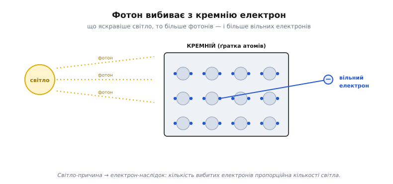
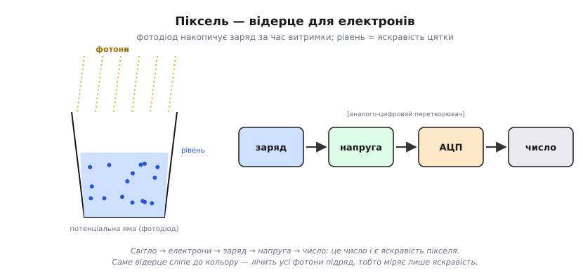
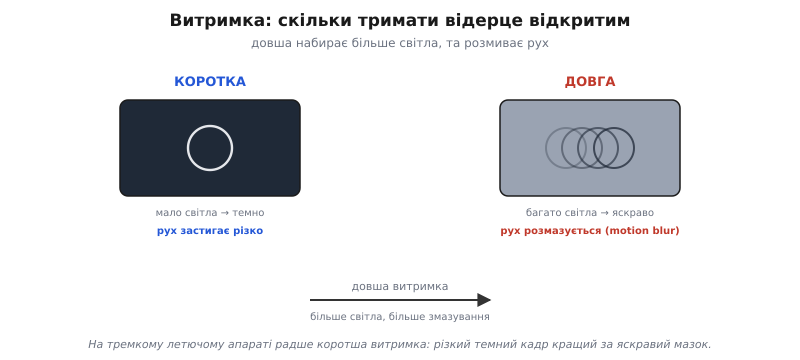
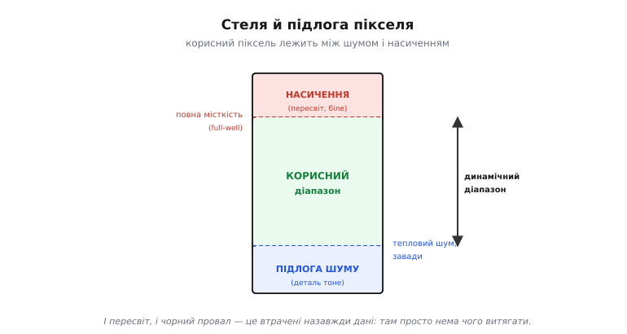
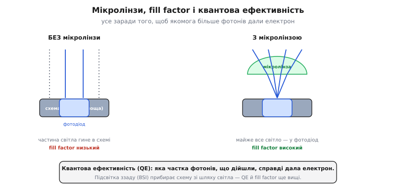
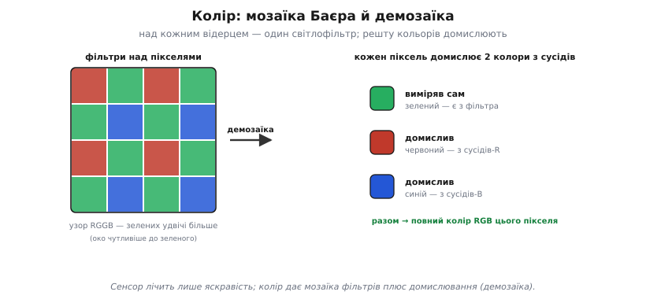

# Сенсор зображення: піксель ловить світло

### Фотон вибиває електрон

Світло — це потік крихітних «зерняток» енергії, **фотонів** (грец. *phōs*, *phōtos* — світло). А пастка для них зроблена з **кремнію** — того самого напівпровідника, що й уся мікроелектроніка. Фокус у простій фізиці: коли фотон віддає свою енергію атомові кремнію, він **вибиває** з нього один **електрон**, роблячи його вільним. Світло-причина — електрон-наслідок. Це і є місток від світу світла до світу електрики, і зветься він **фотоефект** (грец. *phōs* — світло + лат. *effectus* — наслідок).


*Фотон віддає енергію атомові кремнію й вибиває з нього вільний електрон. Що яскравіше світло — то більше фотонів за секунду й більше вибитих електронів, тому кількість зібраних електронів пропорційна кількості світла.*

Що яскравіше світло — то **більше фотонів** за секунду, а отже, більше вибитих електронів. Ось і вся таємниця: **кількість електронів пропорційна кількості світла**. Лишається їх зібрати й порахувати — і матимеш число, що каже, наскільки яскрава ця цятка. Той самий перехід «світло → струм» працює і в окремому [фотодіоді](book:electronics/led-photodiode); сенсор зображення — це, по суті, мільйони крихітних фотодіодів поряд.

> 📜 Те, що світло вибиває електрони саме «зернятками» (порціями), пояснив 1905 року **Альберт Ейнштейн** — і не теорією відносності, а саме фотоефектом. Він припустив, що світло складається з квантів (фотонів), кожен зі своєю порцією енергії, і це акуратно пояснило, чому світло вибиває електрони так, а не інакше. Саме за фотоефект Ейнштейн дістав Нобелівську премію 1921 року. Сто років по тому той самий ефект працює в кожному пікселі камери: фотон зайшов — електрон вибито.

### Піксель — це відерце для електронів

Як же зібрати й порахувати вибиті електрони? Кожен **піксель** (англ. *picture element* — елемент зображення) має крихітну світлочутливу ділянку — **фотосайт** (англ. *photosite* — місце для світла). Це «**відерце**» (потенціальна яма), куди стікаються електрони, вибиті світлом саме в цій цятці. Поки триває знімок, фотони сиплються, електрони накопичуються — і відерце потроху **наповнюється**. Що яскравіше світло било в цей піксель, то вищий рівень у відерці наприкінці.


*Поки триває знімок, фотодіод накопичує вибиті світлом електрони у потенціальній ямі; що яскравіше світло, то вищий рівень. Наприкінці заряд перетворюють на напругу, а АЦП — на число. Саме відерце сліпе до кольору: воно лічить усі фотони підряд, тобто міряє лише яскравість.*

Наприкінці знімка електроніка **міряє рівень** у кожному відерці. Зібраний заряд перетворюють на **напругу**, а ту [аналого-цифровий перетворювач](book:electronics/adc) обертає на **число**. Виходить ланцюжок: **світло → електрони → заряд → напруга → число**. Оце число — яскравість пікселя — і є той «світло-темно», з якого складається кадр. Мільйони таких відерець, зведених в одну [світлочутливу матрицю](book:electronics/cmos-matrix), — і маєш сенсор, що одним кліком наповнює їх усі, а тоді зчитує рядок за рядком.

Зверни увагу: відерце саме по собі **сліпе до кольору**. Воно лічить усі фотони підряд, не розрізняючи, червоні вони чи сині, — тобто міряє тільки **яскравість**. Колір береться з окремої хитрості — кольорових світлофільтрів над пікселями; саме по собі відерце бачить світ у відтінках сірого.

> 🔧 **Навіщо це.** Чим **більше** відерце (фізичний розмір пікселя), то більше світла воно вловить, перш ніж переповниться, — і то менше шуму на темному. Тому за однакових мегапікселів сенсор із **більшими** пікселями (більша матриця) знімає чистіше, надто в сутінках. Це пояснює, чому камера дрона з крихітним сенсором гірша поночі за «велике» око, хоч би скільки мегапікселів обіцяла наклейка.

### Витримка: скільки тримати відерце відкритим

Скільки електронів набереться, залежить не лише від яскравості, а й від того, **як довго** ми збираємо, — від **витримки** (експозиції). Це час, протягом якого відерце «відкрите» й ловить фотони.


*Коротка витримка ловить мало світла (кадр темний), зате застигає рух чітко. Довга набирає багато світла (яскраво), та якщо щось рухалося — розмаже (motion blur). На тремкому летючому апараті надто довга витримка дає змазаний кадр, тож камера балансує між яскравістю й різкістю.*

Тут компроміс. **Коротка** витримка ловить мало світла — кадр темний, зате рух **застигає** чітко. **Довга** витримка набирає багато світла — кадр яскравий, та якщо за цей час щось рухалося, воно **розмажеться** (motion blur), бо в одне відерце впали фотони з різних місць. На дроні це критично: апарат тремтить і летить, тож надто довга витримка дасть **змазаний** кадр, з якого ні людині, ні машинному баченню користі мало. Тому камера балансує: відкрити відерце надовго, щоб набрати світла, — але не настільки, щоб політ розмив картинку. Як саме сенсор відкриває й закриває пікселі — усі заразом чи рядок за рядком — це окреме питання [заслінки](book:electronics/rolling-shutter), і від нього залежить, чи перекосить швидкий рух.

> 🔧 **Навіщо це.** «Темне й зернисте» чи «світле, але змазане» — це майже завжди про витримку. Удень її коротять (світла досить, рух чіткий); поночі мусять довшати — і тоді або задирають **підсилення** (ціною [шуму](book:electronics/dynamic-range-noise)), або ловлять змазування. На рухливому апараті радше жертвуй яскравістю заради короткої витримки: різкий темний кадр кращий за яскравий мазок.

### Стеля й підлога: переповнення та шум

У відерця є **межі**. Зверху — **повна місткість** (англ. *full well* — повна яма): більше за певне число електронів воно не вмістить. Як світла забагато (яскраве небо, сонце в кадрі), відерце **переповнюється** — і всі такі пікселі однаково «білі», деталей у них уже нема. Це **насичення** (пересвіт): за стелею яскравості картина обрізається в суцільну білість.


*Зверху — повна місткість: забагато світла переповнює відерце, і пікселі стають однаково білими (насичення, пересвіт). Знизу — підлога шуму: слабке світло тоне у випадкових електронах. Корисний піксель лежить лише між ними — це його динамічний діапазон.*

Знизу теж є межа — **підлога шуму**. Навіть у темряві у відерці трохи «бовтається» випадкових електронів (тепловий шум, завади). Якщо реального світла менше за цей дріб, його не відрізнити від шуму — деталь тоне. Тож піксель **корисний** лише між підлогою (шум) і стелею (насичення); це його **[динамічний діапазон](book:electronics/dynamic-range-noise)**. Звідси й мистецтво експозиції: підібрати витримку й підсилення так, щоб важливе світло лягло **між** цими межами, не потонувши в шумі й не вилетівши в білість.

> 🔧 **Навіщо це.** І пересвіт, і провал у чорне — це **втрачені назавжди** деталі: з вибіленого неба чи чорної тіні нема чого витягати, там просто нема даних. Тому для [машинного бачення](book:algorithms/image-as-data) важливо тримати об'єкт у середині діапазону: не пересвітити марку чи лінію й не загубити її в тіні. Камера, що сама «жене» експозицію по середньому кадру, може засліпнути на яскравому небі — і проґавити темну ціль під ним.

### Скільки фотонів узагалі доходить: квантова ефективність і мікролінзи

Легко припустити, що кожен фотон дає електрон. Насправді — ні. Частина світла відбивається від поверхні, частина проходить кремній наскрізь, частина б'є не у фоточутливу ділянку, а в **схему** пікселя поряд із нею. Яку **частку** фотонів, що дійшли до пікселя, він справді обертає на електрони — це його **квантова ефективність** (англ. *quantum efficiency*, QE). У добрих сенсорів вона сягає 60–90 % на видимому світлі; решта фотонів пропадає дарма.


*Без мікролінзи частина світла б'є у «мертву» схему між фотодіодами — fill factor низький. Крихітна лінза над кожним пікселем зводить майже все світло у фотодіод. Квантова ефективність каже, яка частка фотонів, що дійшли, дала електрон; підсвітка ззаду (BSI) прибирає схему зі шляху світла й піднімає обидва числа.*

Дві хитрощі рятують фотони. Перша — **мікролінза**: крихітна прозора лінза над кожним пікселем, що збирає світло з усієї його площі й зводить у фоточутливе віконце, повз «мертву» схему. Без неї корисною була б лише частина площі пікселя — її звуть **fill factor** (англ. — частка заповнення, тобто яка частка пікселя справді ловить світло). Друга — **підсвітка ззаду** (англ. *back-side illumination*, BSI): кремній перевертають так, щоб світло падало з боку фотодіода, а дроти й транзистори лишилися **під** ним, а не зверху. Тоді ніщо не затуляє світло, і fill factor разом із QE помітно зростають — особливо в маленьких пікселях, де схема забирала левову частку площі.

> 🔧 **Навіщо це.** Саме QE, fill factor і мікролінзи пояснюють, чому два сенсори з однаковими мегапікселями знімають по-різному поночі. Маленький сенсор недорогого модуля втрачає більше фотонів на схемі й відбитках, тож і світла набирає менше. BSI-сенсор тих самих розмірів витягне з тієї ж сцени більше — це частина того, за що платять у кращих камерах.

### Звідки береться колір

Відерце сліпе до кольору — то як камера знає, що небо синє, а трава зелена? Над кожним пікселем кладуть крихітний **світлофільтр**, що пропускає лише один колір: червоний, зелений або синій. Найпоширеніший узор таких фільтрів — **мозаїка Баєра** (англ. *Bayer filter*, на честь інженера Брайса Баєра з Kodak), де на кожні чотири пікселі припадає один червоний, один синій і **два зелені** (узор RGGB) — бо людське око найчутливіше саме до зеленого.


*Над кожним пікселем — один світлофільтр; узор RGGB дає вдвічі більше зелених, бо око до нього чутливіше. Кожен піксель виміряв лише свій колір, а два інші домислює з сусідів. Це домислювання й зветься демозаїка.*

Виходить, кожен піксель знає **лише один** зі своїх трьох кольорів — той, що пропустив його фільтр. Два інші доводиться **домислювати** з сусідів: якщо піксель «зелений», то скільки в цій точці червоного, прикидають по найближчих «червоних» сусідах, а скільки синього — по «синіх». Це домислювання й зветься [демозаїка](book:algorithms/bayer-demosaic) (англ. *demosaicing*); вона перетворює мозаїку одноколірних вимірів на повноколірне зображення, де кожен піксель має повний набір RGB.

### Як сенсор збирає заряд: CCD проти CMOS

Зібрати електрони у відерцях — півсправи; треба ще **зчитати** рівень із кожного. Історично склалося дві архітектури, і різниця між ними — у тому, **де** заряд перетворюють на напругу.


*CCD переносить заряд із пікселя в піксель, аж до одного спільного підсилювача — чисто, але повільно. CMOS має свій підсилювач у кожному пікселі й адресує їх рядок-стовпець — швидко й дешево, проте частина площі йде на схему.*

У **CCD** (англ. *charge-coupled device* — прилад із зарядовим зв'язком) заряд **переносять** із пікселя в піксель, наче відра по ланцюжку, аж до одного спільного підсилювача на краю матриці, який і міряє кожне відерце по черзі. Один вузол на всіх дає дуже **рівний, чистий** сигнал — тому CCD довго панували в науці й астрономії, — але переносити заряд через усю матрицю **повільно** й живиться воно ласо.

У **CMOS** (та сама технологія, що й уся цифрова логіка) кожен піксель має **свій** крихітний підсилювач і читається **на місці**: матрицю адресують, як пам'ять, за номером рядка й стовпця. Це **швидко, дешево й ощадно** до енергії, тож саме CMOS сьогодні стоїть майже в усіх камерах — від телефона до дрона. Платня — частина площі пікселя йде під схему (її й рятують мікролінзи та BSI), а кожен підсилювач трохи свій, звідки беруться дрібні відмінності між пікселями. Як саме CMOS-матриця адресує пікселі рядково-стовпцевим зчитуванням — це вже [окрема тема про матрицю](book:electronics/cmos-matrix).

### Порахуймо одне відерце

Щоб числа стали відчутними, прикиньмо, скільки електронів набере один піксель і чи влізе він у відерце. Хай повна місткість пікселя — 6000 електронів, а світло таке, що фотодіод збирає 200 електронів за мілісекунду. Скільки можна тримати витримку, перш ніж піксель пересвітиться, і яке число віддасть 10-бітний АЦП за витримки 20 мс?

```c
// Дано:
//   full_well = 6000 e-      (стеля відерця)
//   rate      = 200 e-/мс    (темп набору за цього світла)
//   adc_bits  = 10           → діапазон 0..1023
//   t_exp     = 20 мс        (витримка)

// 1) Стеля за часом: коли відерце переповниться
//    t_max = full_well / rate
t_max = 6000 / 200 = 30 мс         // довше — пересвіт

// 2) Заряд за нашу витримку 20 мс (< 30 мс, отже не насичене)
//    Q = rate * t_exp
Q = 200 * 20 = 4000 e-

// 3) АЦП мапує [0 .. full_well] у [0 .. 1023]
//    code = round( Q / full_well * 1023 )
code = round(4000 / 6000 * 1023) = round(682.0) = 682
```

Тобто за цього світла піксель безпечно набирає заряд аж до 30 мс; на 20 мс він заповнений на дві третини й віддає код 682 з 1023. Накрутили б витримку до 35 мс — відерце переповнилося б, код упав би в стелю 1023, і деталі в цій точці злилися б у білість. Ось чому експозицію підбирають так, щоб найяскравіше важливе місце сцени лягало **трохи нижче** стелі: є запас, і нема пересвіту.

> 🔧 **Навіщо це.** Така прикидка — це і є те, що автоекспозиція робить безперервно: оцінює темп набору й крутить витримку та підсилення, щоб кадр не вилетів у білість і не потонув у шумі. Розуміючи зв'язок «темп × час → заряд → код», легше второпати, чому камера темнить кадр на яскравому небі або задирає зерно в сутінках.

Одне відерце вже вміє зміряти яскравість цятки; ціле зображення народжується, коли мільйони таких відерець зводять в одну [світлочутливу матрицю](book:electronics/cmos-matrix), накривають [мозаїкою кольорових фільтрів](book:algorithms/bayer-demosaic) і навчаються швидко її зчитувати — рядок за рядком, у потік чисел, що тече далі на стиснення, передачу й машинне бачення.

---
