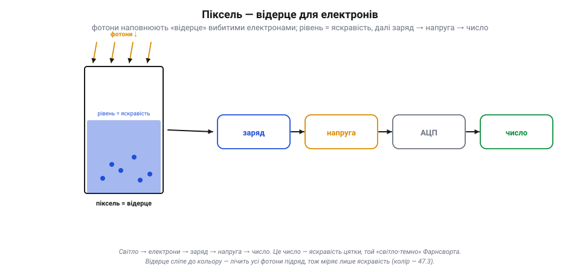

# Сенсор зображення: піксель ловить світло

### Фотон вибиває електрон

Світло — це потік крихітних «зерняток» енергії, **фотонів**. А пастка для них зроблена з **кремнію** — того самого напівпровідника, що й уся мікроелектроніка. Фокус у простій фізиці: коли фотон влучає в кремній, він **вибиває** з атома один **електрон**, роблячи його вільним. Світло-причина — електрон-наслідок. Це і є місток від світу світла до світу електрики.

*Рис. Фотоефект — місток від світла до електрики. Світло — потік фотонів; коли фотон влучає в кремній, він вибиває з атома вільний електрон. Що яскравіше світло — то більше фотонів за секунду й більше вибитих електронів. Отже, **кількість електронів пропорційна кількості світла** — лишається їх зібрати й порахувати.*

Що яскравіше світло — то **більше фотонів** за секунду, а отже, більше вибитих електронів. Ось і вся таємниця: **кількість електронів пропорційна кількості світла**. Лишається їх зібрати й порахувати — і матимеш число, що каже, наскільки яскрава ця цятка.

> 📜 Те, що світло вибиває електрони саме «зернятками» (порціями), пояснив 1905 року **Альберт Ейнштейн** — і не теорією відносності, а саме **фотоефектом**. Він припустив, що світло складається з квантів (фотонів), кожен зі своєю порцією енергії, і це акуратно пояснило, чому світло вибиває електрони так, а не інакше. Саме за **фотоефект**, а не за відносність, Ейнштейн дістав Нобелівську премію 1921 року. Сто років по тому той самий фотоефект працює в кожному пікселі твоєї камери: фотон зайшов — електрон вибито.

### Піксель — це відерце для електронів

Як же зібрати й порахувати вибиті електрони? Кожен **піксель** — це крихітне «**відерце**» (потенціальна яма), куди стікаються електрони, вибиті світлом саме в цій цятці. Поки триває знімок, фотони сиплються, електрони накопичуються — і відерце потроху **наповнюється**. Що яскравіше світло било в цей піксель, то вищий рівень у відерці наприкінці.

*Рис. Піксель — відерце для електронів. Поки триває знімок, фотони наповнюють «відерце» (потенціальну яму) вибитими електронами; що яскравіше світло, то вищий рівень. Наприкінці заряд перетворюють на напругу, а АЦП — на число: **світло → електрони → заряд → напруга → число**. Це число і є яскравість пікселя. Саме відерце сліпе до кольору — лічить усі фотони підряд.*

Наприкінці знімка електроніка **міряє рівень** у кожному відерці. Зібраний заряд перетворюють на **напругу**, а ту [аналого-цифровий перетворювач](book:electronics/adc) обертає на **число**. Виходить ланцюжок: **світло → електрони → заряд → напруга → число**. Оце число — яскравість пікселя — і є той «світло-темно», з якого складається кадр. Мільйони таких відерець, зведених в одну [світлочутливу матрицю](book:electronics/cmos-matrix), — і маєш сенсор, що одним кліком наповнює їх усі, а тоді зчитує рядок за рядком.

Зверни увагу: відерце саме по собі **сліпе до кольору**. Воно лічить усі фотони підряд, не розрізняючи, червоні вони чи сині, — тобто міряє тільки **яскравість**. Звідки ж береться колір — це [окрема хитрість із кольоровими світлофільтрами](book:algorithms/bayer-demosaic); саме по собі відерце бачить світ у відтінках сірого.

> 🔧 **Навіщо це.** Чим **більше** відерце (фізичний розмір пікселя), то більше світла воно вловить, перш ніж переповниться, — і то менше шуму на темному. Тому за однакових мегапікселів сенсор із **більшими** пікселями (більша матриця) знімає чистіше, надто в сутінках. Це пояснює, чому камера дрона з крихітним сенсором гірша поночі за «велике» око, хоч би скільки мегапікселів обіцяла наклейка.

### Витримка: скільки тримати відерце відкритим

Скільки електронів набереться, залежить не лише від яскравості, а й від того, **як довго** ми збираємо, — від **витримки** (експозиції). Це час, протягом якого відерце «відкрите» й ловить фотони.

*Рис. Витримка — скільки тримати відерце відкритим. Коротка витримка ловить мало світла (кадр темний), зате застигає рух чітко. Довга набирає багато світла (яскраво), та якщо щось рухалося — розмаже (motion blur). На тремкому летючому апараті надто довга витримка дає змазаний кадр, тож камера балансує між яскравістю й різкістю.*

Тут компроміс. **Коротка** витримка ловить мало світла — кадр темний, зате рух **застигає** чітко. **Довга** витримка набирає багато світла — кадр яскравий, та якщо за цей час щось рухалося, воно **розмажеться** (motion blur), бо в одне відерце впали фотони з різних місць. На дроні це критично: апарат тремтить і летить, тож надто довга витримка дасть **змазаний** кадр, з якого ні людині, ні машинному баченню користі мало. Тому камера балансує: відкрити відерце надовго, щоб набрати світла, — але не настільки, щоб політ розмив картинку.

> 🔧 **Навіщо це.** «Темне й зернисте» чи «світле, але змазане» — це майже завжди про витримку. Удень її коротять (світла досить, рух чіткий); поночі мусять довшати — і тоді або задирають **підсилення** (ціною [шуму](book:electronics/dynamic-range-noise)), або ловлять змазування. На рухливому апараті радше жертвуй яскравістю заради короткої витримки: різкий темний кадр кращий за яскравий мазок.

### Стеля й підлога: переповнення та шум

У відерця є **межі**. Зверху — **повна місткість** (full-well): більше за певне число електронів воно не вмістить. Як світла забагато (яскраве небо, сонце в кадрі), відерце **переповнюється** — і всі такі пікселі однаково «білі», деталей у них уже нема. Це **насичення** (пересвіт): за стелею яскравості картина обрізається в суцільну білість.

*Рис. Стеля й підлога пікселя. Зверху — **повна місткість**: забагато світла переповнює відерце, і пікселі стають однаково білими (насичення, пересвіт) — деталей нема. Знизу — **підлога шуму**: слабке світло тоне у випадкових електронах. Корисний піксель — лише між ними; це його динамічний діапазон. І пересвіт, і чорний провал — це втрачені назавжди дані.*

Знизу теж є межа — **підлога шуму**. Навіть у темряві у відерці трохи «бовтається» випадкових електронів (тепловий шум, завади). Якщо реального світла менше за цей дріб, його не відрізнити від шуму — деталь тоне. Тож піксель **корисний** лише між підлогою (шум) і стелею (насичення); це його **[динамічний діапазон](book:electronics/dynamic-range-noise)**. Звідси й мистецтво експозиції: підібрати витримку й підсилення так, щоб важливе світло лягло **між** цими межами, не потонувши в шумі й не вилетівши в білість.

> 🔧 **Навіщо це.** І пересвіт, і провал у чорне — це **втрачені назавжди** деталі: з вибіленого неба чи чорної тіні нема чого витягати, там просто нема даних. Тому для [машинного бачення](book:algorithms/image-as-data) важливо тримати об'єкт у середині діапазону: не пересвітити марку чи лінію й не загубити її в тіні. Камера, що сама «жене» експозицію по середньому кадру, може засліпнути на яскравому небі — і проґавити темну ціль під ним.

### Як це збирається докупи

Піксель — це пастка для світла, що працює на простій фізиці: фотон вибиває з кремнію електрон (фотоефект Ейнштейна), і що яскравіше світло, то більше електронів. Кожен піксель — **відерце**, куди ці електрони стікаються за час **витримки**; наприкінці рівень міряють і перетворюють у число: **світло → електрони → заряд → напруга → число**. Витримка задає компроміс «світло проти різкості» (довга набирає яскравість, та розмиває рух — критично на летючому апараті), а саме відерце обмежене згори **насиченням** (пересвіт) і знизу **шумом**, між якими й лежить корисний діапазон. Одне відерце вже вміє зміряти яскравість цятки; ціле зображення народжується, коли мільйони таких відерець зводять в одну [світлочутливу матрицю](book:electronics/cmos-matrix) і навчаються швидко її зчитувати.

---
