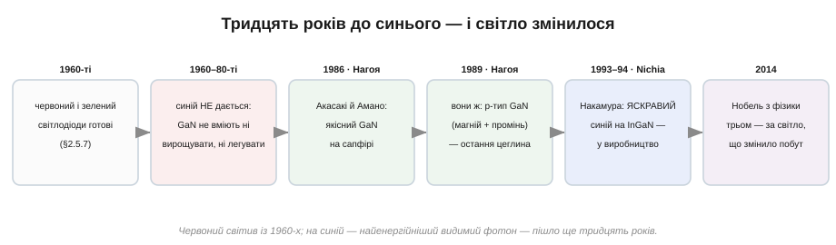
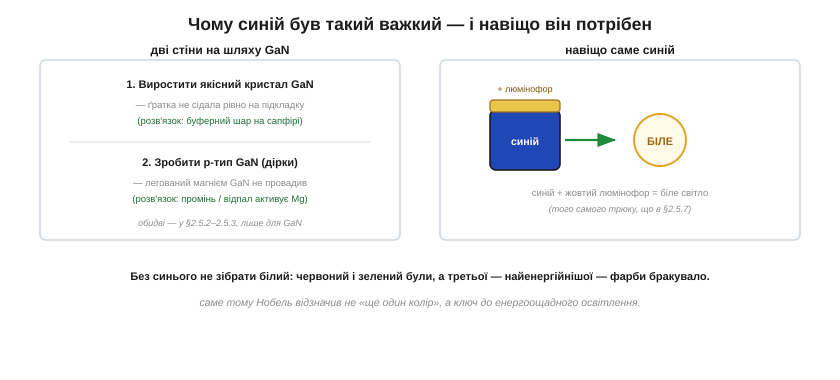
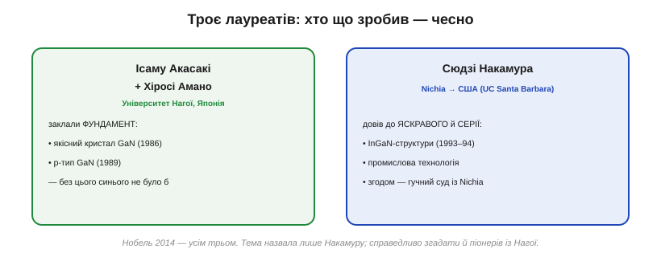

# 📜 Блакитний світлодіод: двадцять років проти «це неможливо»

> Яскравий синій світлодіод дався людству лише в 1990-х, і в популярних переказах за нього дякують Сюдзі Накамурі. Та за цим стоїть більша й справедливіша історія: над синім світлом билися тридцять років, перемогли **троє** японських учених, і Нобелівську премію 2014 року дали всім трьом. Чому одна-єдина фарба коштувала стількох зусиль і стількох доль — і чому без неї не світила б жодна сучасна LED-лампа?

## Бракувало однієї фарби

Червоні світлодіоди світили вже з 1960-х, незабаром з'явилися й зелені. Здавалося б, ще трохи — і буде повний набір кольорів. Але **синій** уперто не давався, і це була не примха, а глуха стіна. Колір світлодіода задає ширина енергетичної щілини [напівпровідника](topic:physics/semiconductor) — синій фотон найенергійніший з видимих, тож і щілина потрібна найширша. Матеріал на таку щілину знали — **нітрид галію** (GaN). Тільки зробити з нього робочий світлодіод не вдавалося нікому, попри десятиліття спроб у лабораторіях по всьому світу.

*Червоний світив із 1960-х, а на синій пішло ще близько тридцяти років: якісний кристал GaN (Нагоя, 1986), p-тип GaN (Нагоя, 1989), яскравий синій на InGaN (Nichia, 1993–94) і Нобелівська премія 2014-го.*

Чому ж бракувало саме синього так гостро? Бо без нього не зібрати **біле** світло. Маючи три основні кольори — червоний, зелений, синій, — можна дати будь-який, зокрема білий; а ще простіше — узяти яскравий синій і додати жовтий люмінофор. Червоний і зелений були давно — бракувало третьої, найенергійнішої фарби. Тому полювання на синій світлодіод було насправді полюванням на **дешеве енергоощадне освітлення** для всього людства; той, хто здобуде синій, відчинить двері до заміни лампи розжарення.

## Дві стіни на шляху GaN

Чому ж GaN не піддавався? Перед інженерами стояли дві окремі стіни, і кожна здавалася непрохідною.

*Перша стіна — виростити якісний кристал GaN (ґратка не сідала рівно на підкладку). Друга — зробити p-тип GaN, тобто матеріал із [дірками](topic:physics/doping). Без обох не буває PN-переходу, а без переходу — світлодіода.*

**Перша стіна — кристал.** Щоб світлодіод світив яскраво, кристал має бути майже бездоганним (та сама вимога монокристалічної чистоти, що й у [історії про кремній](topic:physics/semiconductor/hist-silicon-germanium.md)). Але GaN не було на чому рівно вирощувати: його атомна ґратка не збігалася з жодною зручною підкладкою, і плівки виходили рясно всіяні дефектами — світло в них гасло, не народившись.

**Друга стіна — p-тип.** Світлодіод — це [PN-перехід](topic:physics/pn-junction), тож потрібні обидва типи матеріалу: і n (електрони), і p ([дірки](topic:physics/doping)). N-тип GaN робити навчилися, а от **p-тип** — матеріал GaN із дірками — уперто не виходив: скільки не легуй кристал акцепторною домішкою, він уперто не починав проводити по-дірковому. Без p-боку немає переходу, без переходу немає світлодіода. Багато лабораторій світу, зокрема могутні американські, на цьому здалися й перейшли на інші матеріали, вирішивши, що GaN — глухий кут.

Що стіни справді були грізні, добре видно з ранніх спроб. Ще на початку 1970-х GaN-світлодіоди намагалися робити (зокрема в американській RCA), і навіть діставали слабке синє світіння — та без якісного кристала й без надійного p-типу прилади виходили тьмяні й нестабільні, а дослідження невдовзі майже згорнули. Саме цей загальний відступ і робить упертість двох учених із Нагої такою важливою: вони лишилися біля GaN тоді, коли світ у ньому розчарувався.

## Акасакі й Амано: фундамент у Нагої

Не здалися двоє в Університеті Нагої в Японії — професор **Ісаму Акасакі** (*Isamu Akasaki*) та його молодший колега й учень **Хіросі Амано** (*Hiroshi Amano*). Вони вперто трималися GaN тоді, коли більшість його покинула, і саме вони пробили обидві стіни.

Першу — кристал — вони здолали 1986 року: навчилися вирощувати якісний GaN на сапфіровій підкладці через тонкий **буферний шар** (із нітриду алюмінію), що згладжував невідповідність ґраток. Дефектів поменшало, плівки стали придатними для приладів. Другу стіну — p-тип — узяли 1989 року, і теж несподівано: виявилося, що легований магнієм GaN «оживає» й починає проводити по-дірковому після обробки електронним променем (а згодом з'ясували, що те саме робить простий термічний відпал). Це й була остання цеглина: тепер можна було скласти повноцінний PN-перехід із GaN. Акасакі й Амано заклали **фундамент**, на якому постало все подальше, — і саме тому Нобелівський комітет поставив їхні імена поряд із третім.

## Накамура: від яскравого світла до гучного суду

Третім був **Сюдзі Накамура** (*Shuji Nakamura*) — інженер невеликої японської хімічної компанії **Nichia**. Працюючи майже наодинці, з власноруч переробленим обладнанням, він довів синій світлодіод до **яскравого** й **промислового**: розробив власні методи вирощування, винайшов простий спосіб активувати p-тип відпалом і, головне, навчився робити світловипромінювальний шар зі сплаву **InGaN** (нітрид індію-галію), що давав по-справжньому яскраве синє світло. У 1993–1994 роках його синій світлодіод пішов у виробництво — і світ нарешті дістав усі три фарби.

*Акасакі й Амано (Університет Нагої) заклали фундамент — якісний кристал GaN і p-тип; Накамура (Nichia, згодом США) довів синій до яскравого й промислового. Нобель 2014-го — усім трьом.*

Доля Накамури склалася драматично. Винахід приніс Nichia мільярди, а самому винахіднику — мізерну премію; ображений, він звільнився, перебрався до США, став професором Каліфорнійського університету в Санта-Барбарі й подав на колишнього роботодавця до суду за справедливу винагороду. Суд першої інстанції присудив йому величезну компенсацію, яку згодом при врегулюванні різко зменшили (точні суми називають по-різному, тож переказуймо їх обережно) — але сам процес став знаковим: він підняв питання прав інженера-винахідника на плоди свого відкриття, гостре для всієї японської корпоративної культури. Накамура згодом отримав громадянство США; його різка вдача й гучний спір зробили його найвідомішим із трьох — і саме тому в популярних переказах (як і в нашій темі) часто звучить лише його ім'я.

## Нобель 2014 — і за що саме

У 2014 році Ісаму Акасакі, Хіросі Амано й Сюдзі Накамура дістали **Нобелівську премію з фізики**. Формулювання було промовистим: премію дали не просто за «ще один колір», а за винайдення ефективних синіх світлодіодів, **що уможливили яскраві й енергоощадні білі джерела світла**. Нобелівський комітет прямо наголосив на користі для людства: світлодіодне освітлення дає те саме світло за частку енергії лампи розжарення, служить десятки тисяч годин і несе світло туди, куди не дотягнулася електромережа, — від сонячних ліхтарів у бідних селах до екрана, на якому ви це читаєте. Рідкісний випадок, коли Нобеля з фізики дають за прилад, що вже стоїть у кожному домі.

## Спадок і чесний підсумок

Сьогодні білий світлодіод — синій кристал GaN під шаром жовтого люмінофора — освітлює вулиці, оселі й кишені; кольорові екрани, підсвітка, світлофори, ліхтарики — усе це нащадки того синього кристала з Нагої й Токусіми. Заміна ламп розжарення на світлодіоди вже відчутно зменшила світове споживання електрики на освітлення — а це менше спаленого вугілля й газу.

Той самий приборканий GaN дав і дещо більше за лампочки. Зробивши перехід випромінювальним шаром лазера, з нього отримали **синій лазер** — а коротша синя хвиля дозволяє зчитувати дрібніші позначки на диску, ніж червоний лазер; так народився **Blu-ray** (сама назва — від «blue ray», синій промінь). Підкрутивши частку індію в InGaN, із того ж матеріалу зробили й **зелені** світлодіоди та лазери. Тобто історія про «одну фарбу» насправді відчинила цілий діапазон — від екранів і проєкторів до оптичних носіїв; синій кристал виявився не кінцем, а початком.

І наостанок — головне, заради чого цю історію варто було розповідати, і чесний розподіл честі. Синій світлодіод не «винайшла» одна людина. **Акасакі й Амано** в Нагої пробили обидві стіни — кристал і p-тип, — без чого не було б самого переходу; **Накамура** в Nichia зробив світло яскравим і промисловим. Нобель дали трьом — і це справедливо, хоча в популярних переказах часто лишається саме Накамура (через його гучний суд і харизму). Це той самий урок, що й в [історії кремнію проти германію](topic:physics/semiconductor/hist-silicon-germanium.md): велике відкриття майже завжди естафета, а не подвиг одинака — і коли наступного разу почуєте «винайшов такий-то», варто спитати, чиї плечі були під ним. Уся ця історія, до речі, японська (Університет Нагої й компанія Nichia), і це гарне нагадування, що передовий фронт фізики XX століття був куди ширший за кілька звичних західних імен.
