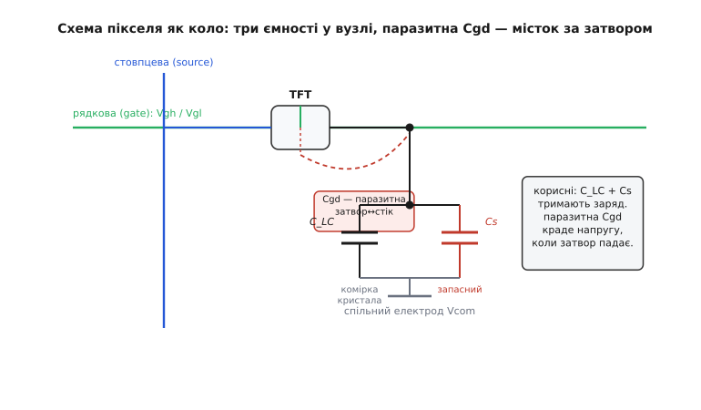
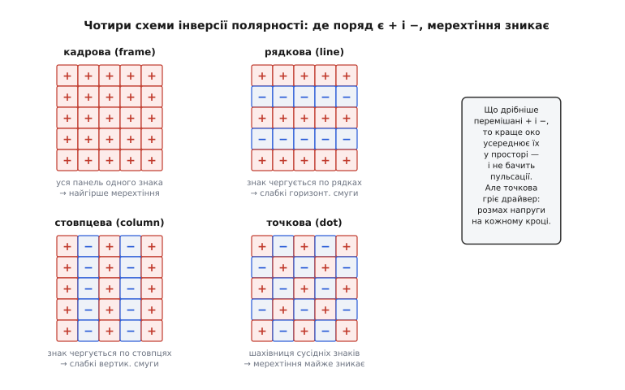

# TFT-дисплей — детально

[Базова стаття](book:electronics/tft) показала головну ідею: рідкокристалічна заслінка не тримає власної напруги, тож до кожного підпікселя приставлено тонкоплівковий транзистор-засувку з запасним конденсатором, і саме він робить екран активноматричним. Тут ми спустимося на рівень нижче — у саму схему пікселя й часові муки її керування. Розберемо, скільки наносекунд транзистор має на зарядження пікселя і чи встигає, чому при закритті транзистора напруга на пікселі стрибає сама собою й як цей стрибок гасять, навіщо запасний конденсатор мусить бути певного розміру, як влаштовані схеми інверсії полярності й чому одна з них дорожча за іншу, і звідки беруться числа часу відгуку та апертури. Заслінку як таку (поляризатори, поворот молекул, типи панелей) тут не повторюємо — нас цікавить електроніка, що нею керує.

## Піксель як коло з трьох ємностей

Щоб рахувати, а не махати руками, треба побачити піксель як точну електричну схему. У вузлі пікселя (на витоку транзистора) сходяться **три** ємності, і кожна грає свою роль:

```
C_LC   — ємність самої комірки рідкого кристала (заслінки)
Cs     — запасний конденсатор, навмисне доданий паралельно
Cgd    — паразитна ємність затвор-стік усередині транзистора
```

Перші дві — корисні: разом вони тримають заряд, що задає яскравість. Третя, Cgd, — небажаний, але неминучий побічний ефект будови транзистора: затвор фізично перекриває край стоку, а будь-які два провідники поряд утворюють конденсатор. Саме ця паразитна ємність, як побачимо, псує життя й змушує підкручувати напруги. Повна ємність вузла, яку транзистор мусить зарядити, — це сума корисних:

```
C_pix = C_LC + Cs
```

Типові порядки для дрібного пікселя: C_LC — частки пікофарада (скажімо, 0.1–0.5 пФ), Cs роблять зазвичай у кілька разів більшим за C_LC, а Cgd — десяті частки пікофарада. Точні числа залежать від панелі, але співвідношення між ними і визначає всю поведінку, тож тримаймо в голові саме порядки.


*Електрична схема одного підпікселя. Транзистор живить вузол, до якого паралельно під'єднані комірка кристала C_LC і запасний Cs (обидві — на спільний електрод Vcom). Окремо, всередині транзистора, сидить паразитна ємність затвор-стік Cgd — місток між рядковою лінією і вузлом пікселя. Корисні ємності тримають заряд; паразитна Cgd при закритті транзистора крадькома стягує частину напруги вузла за затвором.*

## Часовий бюджет: чи встигає транзистор зарядити піксель

Перше жорстке обмеження — час. Контролер відкриває рядок не назавжди, а на коротку **рядкову мить** (англ. *line time*): кадр треба пройти весь, рядок за рядком, поки не настав наступний. Порахуймо цей бюджет напряму.

**Скільки мікросекунд має транзистор на один рядок панелі 240×320 при 60 кадрах за секунду**

```
дано:
  рядків у кадрі  = 320
  частота кадрів  = 60 Гц
  тривалість кадру = 1 / 60                 = 16.67 мс

час на один рядок (груба оцінка, без службових проміжків):
  t_line = тривалість кадру / число рядків
  t_line = 16.67 мс / 320                   ≈ 52 мкс
```

Отже, на зарядження цілого рядка пікселів — близько 52 мікросекунд, і за цей час напруга на кожному пікселі мусить дотягнутися до потрібного рівня. А дотягується вона не миттєво: відкритий транзистор має певний опір каналу R_on, і разом із ємністю пікселя він утворює RC-коло, що заряджається за експонентою. Стала часу цього кола:

```
τ = R_on · C_pix
```

Щоб піксель зарядився з прийнятною точністю (скажімо, до 99 % цільової напруги), потрібно близько 5 сталих часу (бо e⁻⁵ ≈ 0.007, тобто недозаряд менш як 1 %). Звідси вимога:

```
5·τ < t_line     →     5 · R_on · C_pix < 52 мкс
```

**Чи встигає аморфно-кремнієвий транзистор зарядити піксель**

```
дано (порядкові):
  C_pix = C_LC + Cs ≈ 0.5 пФ
  R_on (a-Si, повільний)     ≈ 5 МОм
  R_on (LTPS, швидкий)       ≈ 0.1 МОм

a-Si:
  τ   = 5·10⁶ · 0.5·10⁻¹²    = 2.5 мкс
  5·τ = 12.5 мкс             < 52 мкс  → встигає, але із запасом ~4×

LTPS:
  τ   = 1·10⁵ · 0.5·10⁻¹²    = 0.05 мкс
  5·τ = 0.25 мкс             ≪ 52 мкс  → встигає з величезним запасом
```

Звідси видно глибинну причину, чому рухливість основи така важлива (про a-Si, IGZO, LTPS — у [базовій статті](book:electronics/tft)). Повільний a-Si має високий R_on, тож його стала часу велика — і на дрібному екрані 60 Гц запасу ще вистачає, але варто підняти роздільність (рядків більше → t_line коротший) чи частоту кадрів, як цей запас тане. Високороздільні й швидкі панелі тому й вимагають рухливіших основ: тільки малий R_on дає сталу часу, що влазить у скорочений рядковий бюджет. Це не питання «краще-гірше», а пряма арифметика: 5·R_on·C_pix мусить лишатися меншим за t_line, хоч би як той скорочувався.

> 🔧 **Навіщо це.** Ця нерівність — кількісне пояснення, чому не можна просто взяти дешеву a-Si-панель і «розігнати» їй роздільність чи частоту. Якщо піксель не встигає зарядитися за рядкову мить, він не дотягує до цільової яскравості — картинка тьмяніє й «змилюється» по краях кадру, де часу лишилося найменше. Інженер панелі живе всередині цього бюджету: обирає основу під роздільність, а не навпаки.

## Стрибок напруги при закритті: feedthrough

Тепер найпідступніше — те, заради чого ми взагалі вписали в схему паразитну Cgd. Поки рядок вибрано, на затворі висить висока напруга ввімкнення Vgh, транзистор відкритий, піксель заряджається. Коли рядок знімають, напруга затвора падає до Vgl (напруга вимкнення) — і ось у цю мить діється капость. Затвор зв'язаний із вузлом пікселя через паразитну ємність Cgd, тож різкий перепад затвора Vgh→Vgl **протягує** за собою частину напруги вузла. Заряд перерозподіляється між Cgd і рештою ємностей, і напруга пікселя миттєво стрибає вниз на величину, яку звуть **напругою протягування** (англ. *feedthrough voltage*, або *kickback voltage*):

```
ΔVp = (Vgh − Vgl) · Cgd / (Cgd + C_LC + Cs)
```

Формула читається наочно як ємнісний дільник: повний перепад затвора (Vgh − Vgl) ділиться між паразитним містком Cgd і всіма ємностями вузла, і пікселю «дістається» просадка пропорційно до ваги Cgd у цій сумі. Порахуймо, наскільки це боляче.

**Наскільки просідає напруга пікселя при закритті транзистора**

```
дано (порядкові):
  перепад затвора  Vgh − Vgl = 25 В     (типово: +15 В вмик., −10 В вимк.)
  Cgd = 0.05 пФ
  C_LC = 0.1 пФ
  Cs   = 0.3 пФ

ΔVp = 25 · 0.05 / (0.05 + 0.1 + 0.3)
    = 25 · 0.05 / 0.45
    = 25 · 0.111
    ≈ 2.8 В
```

Майже три вольти просадки — і це не дрібниця, бо корисний розмах напруги на комірці й сам лежить у межах кількох вольтів. Якби ΔVp був однаковим завжди, його можна було б просто скомпенсувати, зсунувши все на постійну величину. Біда в тому, що C_LC **залежить від стану заслінки** (ємність рідкого кристала трохи змінюється з прикладеною напругою), тож ΔVp виходить різним для світлих і темних пікселів — і повністю його прибрати не вийде.

Із цим борються двома прийомами заразом. По-перше, **підкручують спільний електрод Vcom**: його напругу зсувають рівно на середній ΔVp, щоб просадка пікселя стала симетричною відносно Vcom — тоді плюсовий і мінусовий кадри знову однакові за модулем, і постійної складової немає. Саме тому в багатьох панелей є підстроювання Vcom: ним ловлять мінімум мерехтіння. По-друге — і тут вступає Cs — **збільшують запасний конденсатор**: у формулі ΔVp він стоїть у знаменнику, тож що більший Cs, то меншу частку перепаду затвора протягне Cgd. Це друга, окрім утримання заряду, причина існування Cs.

> 🔧 **Навіщо це.** Протягування — фізичний корінь двох знайомих болячок TFT: мерехтіння й залишкового зображення. Якщо на панелі видно дрібне тремтіння рівного сірого поля, найімовірніше, Vcom не вловлено в потрібну точку й залишковий ΔVp розбалансував полярності. Регулювання «flicker» у сервісних меню моніторів — це майже завжди підстроювання Vcom під цю формулу.

## Чому Cs мусить бути певного розміру

Тепер видно, що запасний конденсатор Cs тягне на собі **аж три** обов'язки заразом, і всі троє хочуть, щоб він був більшим:

```
1. Утримання заряду:  більший Cs → менша просадка пікселя
                      від витоку за кадр (картинка стабільніша).
2. Гасіння feedthrough: більший Cs у знаменнику ΔVp
                      → менший стрибок при закритті.
3. Лінійність:        більший Cs «розбавляє» змінну C_LC у сумі,
                      тож ΔVp менше гуляє між світлим і темним.
```

Здавалося б, роби Cs якомога більшим — і всі біди зникнуть. Але йому протистоїть четверта вимога, з протилежним знаком: **час зарядження**. Cs входить у C_pix, тож більший Cs збільшує сталу часу τ = R_on·C_pix — і піксель довше дотягується до цілі, з'їдаючи дефіцитний рядковий бюджет. Та ще й сам Cs **непрозорий** і відбирає площу в світла, псуючи апертуру (про неї нижче). Тому розмір Cs — це точка рівноваги чотирьох тисків: достатньо великий, щоб тримати заряд, гасити протягування й вирівнювати лінійність, але не настільки, щоб транзистор не встиг його зарядити за рядкову мить чи щоб панель потьмяніла. Звідси й типове правило — Cs у кілька разів більший за C_LC, не більше й не менше.

## Де стоять електроди: TN, IPS, VA

Досі ми мовчки уявляли заслінку як «комірку рідкого кристала», не питаючи, *як саме* в ній розкладено електроди й молекули. А ця розкладка — окремий пласт інженерії, бо від неї залежать кути огляду, кольори й навіть та сама ємність C_LC, з якою ми щойно рахували. Є три головні **режими панелі**, і різняться вони тим, у який бік повертається кристал і де сидять керувальні електроди.

**TN** (англ. *twisted nematic* — «закручений нематик») — найстаріший і найдешевший режим. Молекули кристала від природи закручені на 90° між двома пластинами, і в спокої цей закрут провертає площину світла так, що пара поляризаторів його пропускає — піксель світлий. Подаєш напругу — молекули **розкручуються** й вистромлюються вздовж поля, закрут зникає, світло гаситься. Електроди тут стоять **зверху й знизу**, на двох пластинах, тож поле йде наскрізь крізь шар. Це просто й швидко, але має фатальну ваду: коли дивишся збоку, видовжені молекули видно під іншим кутом, і яскравість та колір **пливуть** залежно від погляду — звідси сумнозвісні вузькі кути огляду й «вицвітання» дешевих TN-екранів, якщо глянути зкосока.

**IPS** (англ. *in-plane switching* — «перемикання в площині») розв'язує проблему кутів радикально. Обидва електроди — і піксельний, і спільний — тут кладуть **на одну пластину, в одній площині** під кристалом. Поле виходить не наскрізне, а **горизонтальне**, уздовж скла, тож молекули не вистромлюються догори, а **повертаються в самій площині пластини**, лишаючись плазом. Через те збоку вони виглядають майже так само, як прямо, і картинка тримає колір та яскравість під широким кутом. Платою є складніша структура й те, що електроди в одній площині дають **слабше поле** при тій самій напрузі (відстань між ними більша), тож IPS зазвичай повільніший і потребує вищої керувальної напруги. Саме IPS стоїть там, де важать точні кольори й кути: добрі монітори, планшети, телефони.

**VA** (англ. *vertical alignment* — «вертикальне вирівнювання») — компроміс між ними. У спокої молекули стоять **сторч**, перпендикулярно до скла, і повністю гасять світло — звідси найкраща сильна сторона VA: глибокий чорний і високий контраст, бо закрита заслінка тут перекриває світло щільніше за TN. Подаєш напругу — молекули **нахиляються**, прочиняючи прохід. Кути огляду в VA ширші за TN, хоч і не такі досконалі, як в IPS, а от контраст — найкращий серед трьох рідкокристалічних режимів.

Усі три, підкреслимо, лишаються тією самою активною матрицею з [базової статті](book:electronics/tft) — транзистор-засувка з Cs на кожному пікселі однаковий. Різниця лише в геометрії електродів і повороту молекул усередині заслінки. Але ця різниця прямо чіпає те, що ми рахували: в IPS обидва електроди на одній пластині інакше формують паразитні ємності й апертуру (доріжки електродів крадуть світло прямо в площині пікселя), тож IPS-панелі за інших рівних ще й трохи тьмяніші — більше непрозорого «бордюру» в самому вікні.

> 🔧 **Навіщо це.** Три літери режиму на специфікації одразу кажуть про головний компроміс екрана. «TN» — дешево й швидко, але кольори й кути слабкі: годиться для службового індикатора, не для перегляду під кутом. «IPS» — точні кольори й широкі кути, дорожче й трохи повільніше: для приладу, на який дивляться кілька людей чи збоку. «VA» — найкращий чорний і контраст: для відео й темних інтерфейсів. Знаючи режим, ви передбачаєте поведінку екрана під кутом, ще не ввімкнувши його.

## Інверсія полярності: схеми й чим вони різняться

[Базова стаття](book:electronics/tft) пояснила, *навіщо* перевертати знак напруги на пікселі: постійна напруга електрохімічно вбиває рідкий кристал, тож кожен піксель ведуть змінною напругою з нульовим середнім. Тут — *як саме* це організовано, бо способів кілька й вони помітно різняться ціною та якістю.

Найпростіша уявна схема — **кадрова інверсія**: усю панель один кадр тримають плюсовою відносно Vcom, наступний — мінусовою. Дешево, але погано: плюсовий і мінусовий кадри ніколи не однакові ідеально (через те саме протягування), тож **уся площа** ледь пульсує яскравістю в такт зміні знака — помітне мерехтіння на великих рівних полях.

Розв'язок — перемішати знаки в **просторі**, щоб поряд завжди були і плюсові, і мінусові пікселі; око усереднить їх і пульсацій не побачить. Звідси три практичні схеми:

```
рядкова інверсія (line):   знак однаковий уздовж рядка,
                           чергується від рядка до рядка.
                           Дешева; лишає слабкі горизонтальні смуги.

стовпцева інверсія (column): знак чергується від стовпця до стовпця.
                           Дзеркальна до рядкової; вертикальні смуги.

точкова інверсія (dot):    кожен сусідній піксель — протилежного знака,
                           шахівниця; малюнок ще й перевертається щокадру.
                           Найкраща картинка, найменше мерехтіння.
```


*Розкладка знаків напруги (+ / −) на сітці пікселів у чотирьох схемах. Кадрова: уся панель одного знака — звідси найгірше мерехтіння. Рядкова й стовпцева: знак чергується по рядках або стовпцях — компроміс. Точкова: шахівниця сусідніх знаків — мерехтіння майже зникає, бо поряд із кожним пікселем завжди є його протилежність, і око усереднює їх у просторі.*

Чому ж не завжди беруть найкращу, точкову? Бо за неї платять **енергією та складнішим драйвером**. Щоб перевернути знак, драйвер стовпця мусить перегнати напругу через увесь розмах (з плюсового рівня в мінусовий) — а в точковій інверсії це доводиться робити для кожного сусіднього пікселя, тобто розмахувати напругою на повну на кожному кроці. У рядковій інверсії сусіди вздовж рядка одного знака, тож такого розмаху менше — драйвер споживає менше. Виходить типовий торг: точкова дає найчистішу картинку, але гріє драйвер і їсть більше струму; рядкова економніша, але лишає ледь видимі смуги. Дешеві панелі тому часто на рядковій інверсії, добрі — на точковій.

> 🔧 **Навіщо це.** Схема інверсії — прихована причина того, чому два зовні схожі TFT-екрани так по-різному поводяться на рівних заливках. Якщо на дешевій панелі видно тонкі горизонтальні чи вертикальні смуги або мерехтіння на сірому — це майже напевне відбиток її схеми інверсії. Знаючи це, ви не списуєте дефект на «бракований екран», а розумієте, що то компроміс драйвера, закладений конструктивно.

## Час відгуку: формула інерції

[Базова стаття](book:electronics/tft) назвала час відгуку наслідком фізичного повороту молекул. Тут варто побачити, від чого він залежить кількісно, бо звідси ростуть усі хитрощі його зменшення. Час повороту рідкого кристала пропорційний двом речам:

```
t_відгуку  ∝  γ · d²  /  (рушійна сила)

  γ  — обертова в'язкість кристала (опір повороту молекул)
  d  — товщина шару рідкого кристала (зазор комірки)
```

Найважливіше тут — **квадрат товщини**. Зменшити зазор комірки вдвічі означає прискорити відгук учетверо, бо менше молекул беруть участь у повороті й кожна долає коротший шлях. Тому тонка комірка — головний важіль швидкості, і виробники тиснуть зазор, наскільки дозволяє технологія. В'язкість γ задає сам матеріал кристала: «швидкі» суміші роблять менш в'язкими (і добирають вищу пружність, що повертає молекули назад жвавіше).

Звідси й чому переходи з чорного найповільніші: з повністю закритого стану молекулам треба зрушити найбільше, а рушійна сила біля країв діапазону менша. Із цим борються **розгоном** (англ. *overdrive*): щоб піксель швидше дійшов до цільового рівня, на нього на один кадр подають перебільшену напругу — «штовхають» молекули сильніше, а на наступному кадрі вертають до правильної. Це чисто електронний трюк контролера, що не чіпає фізики кристала, але візуально ріже залишковий слід.

Розгін, утім, має власну ціну, і її варто розуміти. Якщо перестаратися з перебільшеною напругою, піксель **перескочить** цільову яскравість, перш ніж осісти на ній, — і на швидкому русі за рухомим краєм потягнеться світлий ореол замість темного сліду. Це називають інверсним привидом (англ. *overshoot*, «перельот»). Тому контролер тримає цілу таблицю поправок розгону на кожну пару «звідки → куди» переходу й мусить їх вивіряти: замало — лишиться слід, забагато — з'явиться перельот. Ідеального налаштування на всі переходи заразом не буває, тож і тут інженер живе в компромісі, лише іншому — між двома видами артефактів руху.

**Наскільки тонша комірка прискорює відгук**

```
дано:
  товщина d₁ = 5 мкм  →  t₁ = 20 мс (умовно)
  товщина d₂ = 3 мкм

t ∝ d²  →  t₂ / t₁ = (d₂/d₁)²
  t₂ = 20 · (3/5)²
     = 20 · 0.36
     = 7.2 мс
```

Тобто стиснення зазору з 5 до 3 мкм майже втричі пришвидшує піксель — наочно, чому за цей мікрометр товщини так борються.

## Апертура: рахунок втраченого світла

Останнє число — **коефіцієнт апертури** (англ. *aperture ratio*): частка площі пікселя, крізь яку реально проходить світло підсвітки. Усе, що в площині пікселя непрозоре — транзистор, доріжки рядка й стовпця, запасний Cs, чорна маска навколо, — крадеться з цієї площі. Рахунок простий:

```
апертура = прозора площа / повна площа пікселя
```

**Як дрібнішання пікселя з'їдає апертуру**

```
дано (умовний піксель, квадрат):
  сторона пікселя          P
  непрозорий «бордюр» (доріжки, транзистор, Cs) шириною b з кожного боку

прозоре вікно = (P − 2b) ;  апертура = ((P − 2b)/P)²

великий піксель  P = 100 мкм, b = 10 мкм:
  апертура = ((100 − 20)/100)² = 0.8² = 0.64  → 64 %

дрібний піксель  P = 40 мкм, той самий бордюр b = 10 мкм:
  апертура = ((40 − 20)/40)²  = 0.5² = 0.25   → 25 %
```

Ось чому висока роздільність коштує яскравості: бордюр з електроніки майже не меншає (транзистор і доріжки мають свій мінімальний розмір), а от сам піксель дрібнішає — і непрозора рамка з'їдає дедалі більшу його частку. Дрібний піксель пропускає чверть світла там, де великий пропускав дві третини. Звідси прямий зв'язок із вибором основи: рухливіша основа (LTPS) дозволяє дрібніший транзистор і вужчий бордюр, тож при тій самій роздільності лишає світлу більше отвору — апертура вища. Інженери ще й ховають частину доріжок під чорну маску так, щоб ті не крали корисного вікна, але сам квадратичний програш від дрібнішання нікуди не дінеться.

> 🔧 **Навіщо це.** Цей рахунок — кількісна причина, чому високороздільні TFT часто потребують відчутно потужнішої підсвітки, а отже й більшого струму. Для виробу на акумуляторі це пряма стаття витрат: піднявши роздільність дисплея, ви платите не лише за саму матрицю, а й за яскравішу лампу, щоб пробити меншу апертуру. Часто саме підсвітка, а не процесор, виявляється головним споживачем — і апертура пояснює, чому її струм росте швидше за роздільність.

Уся ця механіка зводиться до кількох нерівностей, що тиснуть одна на одну. Транзистор має зарядити три ємності пікселя за рядкову мить — звідси вимога до рухливості основи. При закритті паразитна Cgd протягує напругу вузла вниз — звідси підстроювання Vcom і потреба у великому Cs. Той самий Cs мусить тримати заряд і вирівнювати лінійність, але не зашкодити зарядженню й апертурі — звідси його точно дібраний розмір. Знак напруги треба перевертати в шаховому порядку проти мерехтіння — звідси схеми інверсії та їхній торг між якістю й споживанням драйвера. А товщину комірки тиснуть заради швидкості, бо час відгуку росте як квадрат зазору. Усе це — деталі однієї конструкції з [базової статті](book:electronics/tft): транзистор-засувка з конденсатором пам'яті на кожному пікселі, доведений до інженерної рівноваги. Те, як готовій матриці постачають дані по шині й тримають кадр у пам'яті, веде вже [контролер дисплея](book:electronics/display-controller).
